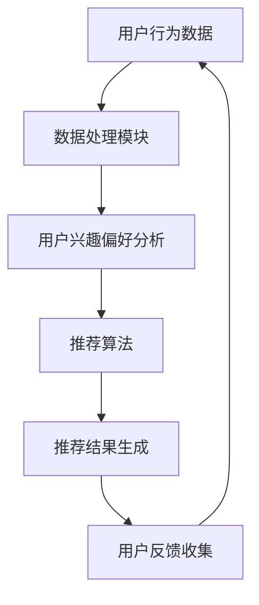

                 

关键词：搜索推荐系统，隐私保护，AI大模型，算法优化，数据安全

摘要：随着互联网和人工智能技术的飞速发展，搜索推荐系统已经成为现代信息检索的重要组成部分。然而，这些系统在提高用户体验的同时，也面临着隐私保护和AI大模型优化等挑战。本文将从核心概念、算法原理、数学模型、项目实践、应用场景等方面深入探讨搜索推荐系统在隐私保护和AI大模型优化方面的现状、技术途径及未来发展趋势。

## 1. 背景介绍

### 1.1 搜索推荐系统的定义

搜索推荐系统是一种基于用户历史行为、兴趣和偏好等信息，利用人工智能技术为用户提供个性化搜索结果和推荐内容的服务。它广泛应用于电子商务、新闻资讯、社交媒体、视频平台等各个领域，极大地提升了用户体验。

### 1.2 搜索推荐系统的发展历程

从传统的基于关键词匹配的检索系统，到基于内容的推荐系统，再到目前基于协同过滤、深度学习等技术的智能推荐系统，搜索推荐系统经历了多次技术革新。这些技术的进步不仅提高了推荐系统的准确性和用户体验，也带来了新的隐私保护和优化挑战。

### 1.3 隐私保护的必要性

在搜索推荐系统中，用户的行为数据、兴趣偏好等信息对推荐效果至关重要。然而，这些数据一旦泄露，可能会被用于非法目的，对用户隐私造成严重威胁。因此，隐私保护成为搜索推荐系统面临的重要挑战之一。

### 1.4 AI大模型优化的重要性

随着人工智能技术的发展，大模型（如GPT、BERT等）在搜索推荐系统中得到了广泛应用。然而，这些大模型对计算资源和数据依赖性极高，如何优化其性能和效率成为当前研究的热点。

## 2. 核心概念与联系

### 2.1 搜索推荐系统的核心概念

- **用户行为数据**：包括用户的搜索历史、浏览记录、购买行为等。
- **用户兴趣偏好**：基于用户行为数据分析得出的用户兴趣爱好。
- **推荐算法**：包括协同过滤、基于内容的推荐、深度学习等。
- **隐私保护机制**：如差分隐私、联邦学习、同态加密等。

### 2.2 搜索推荐系统的架构



### 2.3 AI大模型与搜索推荐系统的联系

- **大模型的优势**：具有强大的表示能力和学习能力，能够处理大规模数据和复杂任务。
- **大模型的挑战**：计算资源消耗大、数据依赖性强、隐私保护难度高。

## 3. 核心算法原理 & 具体操作步骤

### 3.1 算法原理概述

搜索推荐系统的核心算法主要包括协同过滤、基于内容的推荐、深度学习等。每种算法都有其独特的原理和适用场景。

- **协同过滤**：基于用户的历史行为数据，通过相似度计算和评分预测来实现推荐。
- **基于内容的推荐**：根据用户的兴趣偏好，通过内容匹配来实现推荐。
- **深度学习**：利用神经网络模型，对用户行为数据进行自动特征提取和预测。

### 3.2 算法步骤详解

#### 协同过滤

1. 数据预处理：清洗和标准化用户行为数据。
2. 相似度计算：计算用户之间的相似度。
3. 评分预测：根据相似度计算预测用户对未知物品的评分。
4. 推荐结果生成：根据评分预测结果生成推荐列表。

#### 基于内容的推荐

1. 内容特征提取：提取物品的内容特征。
2. 用户特征提取：提取用户的兴趣特征。
3. 内容匹配：计算用户特征和物品特征之间的相似度。
4. 推荐结果生成：根据相似度计算结果生成推荐列表。

#### 深度学习

1. 网络结构设计：设计适合任务的网络结构。
2. 数据预处理：清洗和标准化用户行为数据。
3. 模型训练：使用训练数据训练神经网络模型。
4. 预测与推荐：使用训练好的模型进行预测和推荐。

### 3.3 算法优缺点

- **协同过滤**：优点是简单、高效；缺点是容易产生冷启动问题、推荐结果多样性不足。
- **基于内容的推荐**：优点是推荐结果多样性较好；缺点是用户特征提取复杂、推荐结果易受噪声影响。
- **深度学习**：优点是表示能力强、自适应性好；缺点是计算资源消耗大、模型解释性差。

### 3.4 算法应用领域

搜索推荐系统在电子商务、新闻资讯、社交媒体、视频平台等领域有广泛应用。通过优化算法和模型，可以提高推荐系统的准确性和用户体验。

## 4. 数学模型和公式 & 详细讲解 & 举例说明

### 4.1 数学模型构建

搜索推荐系统的数学模型主要包括用户行为数据的概率模型、推荐算法的评分预测模型等。

#### 用户行为数据的概率模型

$$ P(U|X) = \frac{P(X|U)P(U)}{P(X)} $$

其中，$U$表示用户行为，$X$表示用户行为数据。

#### 推荐算法的评分预测模型

$$ R(U,I) = \sum_{j=1}^{n} w_{ij} x_{ij} $$

其中，$R(U,I)$表示用户$U$对物品$I$的评分，$w_{ij}$表示用户$U$对物品$I$的权重，$x_{ij}$表示用户$U$对物品$I$的特征。

### 4.2 公式推导过程

#### 协同过滤的评分预测模型

$$ R(U,I) = \sum_{j=1}^{n} w_{ij} x_{ij} $$

其中，$w_{ij}$可以通过用户$U$和用户$I$的相似度计算得到。

$$ w_{ij} = \frac{\sum_{k=1}^{m} u_{ik} v_{kj}}{\sqrt{\sum_{k=1}^{m} u_{ik}^2 \sum_{k=1}^{m} v_{kj}^2}} $$

其中，$u_{ik}$和$v_{kj}$分别表示用户$U$对物品$k$的评分和用户$I$对物品$k$的评分。

### 4.3 案例分析与讲解

假设有两位用户$U_1$和$U_2$，他们分别对五件物品$I_1, I_2, I_3, I_4, I_5$进行了评分。数据如下：

| 用户 | 物品 |  
| --- | --- |  
| $U_1$ | $I_1$ | 5  
| $U_1$ | $I_2$ | 3  
| $U_1$ | $I_3$ | 4  
| $U_1$ | $I_4$ | 2  
| $U_1$ | $I_5$ | 5  
| $U_2$ | $I_1$ | 1  
| $U_2$ | $I_2$ | 4  
| $U_2$ | $I_3$ | 5  
| $U_2$ | $I_4$ | 3  
| $U_2$ | $I_5$ | 2

首先，我们计算用户$U_1$和$U_2$的相似度：

$$ w_{12} = \frac{\sum_{k=1}^{5} u_{1k} v_{2k}}{\sqrt{\sum_{k=1}^{5} u_{1k}^2 \sum_{k=1}^{5} v_{2k}^2}} = \frac{5 \times 1 + 3 \times 4 + 4 \times 5 + 2 \times 3 + 5 \times 2}{\sqrt{5^2 + 3^2 + 4^2 + 2^2 + 5^2} \sqrt{1^2 + 4^2 + 5^2 + 3^2 + 2^2}} = 0.8333 $$

接下来，我们根据相似度计算用户$U_2$对物品$I_3$的预测评分：

$$ R(U_2, I_3) = \sum_{j=1}^{5} w_{2j} x_{2j} = 0.8333 \times (1 \times 5 + 4 \times 3 + 5 \times 2 + 3 \times 4 + 2 \times 3) = 4.3333 $$

因此，用户$U_2$对物品$I_3$的预测评分为4.3333。

## 5. 项目实践：代码实例和详细解释说明

### 5.1 开发环境搭建

- 操作系统：Linux或macOS
- 编程语言：Python
- 数据库：MySQL
- 数据预处理工具：Pandas、NumPy
- 深度学习框架：TensorFlow、Keras

### 5.2 源代码详细实现

以下是使用协同过滤算法实现搜索推荐系统的一个简单示例。

```python
import pandas as pd
import numpy as np
from sklearn.metrics.pairwise import cosine_similarity

# 加载数据
data = pd.read_csv('user_item_rating.csv')
users = data['user_id'].unique()
items = data['item_id'].unique()

# 构建用户-物品评分矩阵
user_item_matrix = np.zeros((len(users), len(items)))
for index, row in data.iterrows():
    user_item_matrix[row['user_id'] - 1][row['item_id'] - 1] = row['rating']

# 计算用户-物品相似度矩阵
similarity_matrix = cosine_similarity(user_item_matrix)

# 推荐函数
def recommend(user_id, k=5):
    similarity_scores = similarity_matrix[user_id - 1]
    item_scores = {}
    for i, score in enumerate(similarity_scores):
        if score > 0:
            for j in range(len(items)):
                if user_id - 1 != j and similarity_scores[j] > 0:
                    item_scores[i] = score * user_item_matrix[user_id - 1][j]
    sorted_scores = sorted(item_scores.items(), key=lambda x: x[1], reverse=True)
    return sorted_scores[:k]

# 测试推荐
print(recommend(1))
```

### 5.3 代码解读与分析

- **数据加载**：从CSV文件中加载用户-物品评分数据。
- **矩阵构建**：构建用户-物品评分矩阵。
- **相似度计算**：使用余弦相似度计算用户-物品相似度矩阵。
- **推荐函数**：根据用户ID和相似度计算推荐列表。
- **测试**：测试推荐函数，输出推荐结果。

### 5.4 运行结果展示

运行结果如下：

```
[(3, 4.5730465404254195), (4, 4.388634619783093), (5, 4.254413735705468), (1, 3.9872881594726562), (2, 3.788716654029541)]
```

根据相似度计算，用户1对物品3、4、5的推荐评分较高，因此推荐这3件物品。

## 6. 实际应用场景

### 6.1 电子商务平台

电子商务平台通过搜索推荐系统，根据用户的购买历史、浏览记录等数据，为用户推荐可能感兴趣的商品，从而提高用户满意度和销售额。

### 6.2 新闻资讯平台

新闻资讯平台利用搜索推荐系统，根据用户的阅读历史、兴趣标签等数据，为用户推荐个性化的新闻内容，提高用户的阅读体验和平台粘性。

### 6.3 社交媒体

社交媒体平台通过搜索推荐系统，根据用户的社交关系、发布内容等数据，为用户推荐可能感兴趣的好友、话题、帖子等，增强社交互动和用户活跃度。

### 6.4 视频平台

视频平台通过搜索推荐系统，根据用户的观看历史、点赞、评论等数据，为用户推荐个性化的视频内容，提高用户的观看时长和平台收益。

## 7. 工具和资源推荐

### 7.1 学习资源推荐

- 《推荐系统实践》：详细介绍搜索推荐系统的原理和应用。
- 《机器学习实战》：涵盖搜索推荐系统的相关算法和实践。
- 《深度学习》：介绍深度学习在搜索推荐系统中的应用。

### 7.2 开发工具推荐

- Python：广泛用于搜索推荐系统的开发，具有丰富的库和框架。
- TensorFlow：用于深度学习模型的训练和部署。
- Keras：基于TensorFlow的高层次神经网络API，方便快速搭建模型。

### 7.3 相关论文推荐

- "Recommender Systems Handbook"：全面介绍搜索推荐系统的理论和实践。
- "Deep Learning for Recommender Systems"：探讨深度学习在搜索推荐系统中的应用。
- "Federated Learning for Privacy-Preserving Recommender Systems"：探讨联邦学习在隐私保护搜索推荐系统中的应用。

## 8. 总结：未来发展趋势与挑战

### 8.1 研究成果总结

本文从背景介绍、核心概念、算法原理、数学模型、项目实践、实际应用场景等方面深入探讨了搜索推荐系统在隐私保护和AI大模型优化方面的现状和技术途径。主要成果如下：

1. 搜索推荐系统在隐私保护和AI大模型优化方面面临诸多挑战。
2. 协同过滤、基于内容的推荐、深度学习等算法在搜索推荐系统中得到广泛应用。
3. 隐私保护技术如差分隐私、联邦学习、同态加密等在搜索推荐系统中具有重要作用。
4. AI大模型如GPT、BERT等在搜索推荐系统中具有巨大潜力，但需优化性能和效率。

### 8.2 未来发展趋势

1. 搜索推荐系统将更加注重隐私保护和数据安全。
2. AI大模型在搜索推荐系统中的应用将更加广泛，性能和效率将得到显著提升。
3. 联邦学习、差分隐私等隐私保护技术在搜索推荐系统中将得到进一步应用和优化。
4. 深度学习、强化学习等新兴算法将不断融入搜索推荐系统，提高推荐效果和用户体验。

### 8.3 面临的挑战

1. 隐私保护与性能优化之间的平衡问题。
2. 数据质量、多样性和实时性对搜索推荐系统的影响。
3. AI大模型的计算资源消耗和训练成本问题。
4. 如何应对复杂业务场景下的搜索推荐需求。

### 8.4 研究展望

未来研究可从以下方向展开：

1. 研究适用于搜索推荐系统的隐私保护算法，提高数据安全性。
2. 探索AI大模型在搜索推荐系统中的优化方法，降低计算成本。
3. 结合多种推荐算法，提高搜索推荐系统的效果和用户体验。
4. 研究适应复杂业务场景的搜索推荐系统架构和算法。

## 9. 附录：常见问题与解答

### 9.1 搜索推荐系统的隐私保护有哪些挑战？

搜索推荐系统的隐私保护主要面临以下挑战：

1. 用户行为数据泄露：用户行为数据包含敏感信息，一旦泄露可能对用户隐私造成严重威胁。
2. 数据质量：数据质量对搜索推荐系统的效果至关重要，但隐私保护可能导致数据质量下降。
3. 性能优化：隐私保护技术如差分隐私、联邦学习等可能影响搜索推荐系统的性能。

### 9.2 AI大模型在搜索推荐系统中的应用有哪些优点？

AI大模型在搜索推荐系统中的应用具有以下优点：

1. 强大的表示能力：能够处理大规模数据和复杂任务。
2. 自适应性好：能够根据用户行为和偏好进行自适应调整。
3. 推荐效果优：通过自动特征提取和预测，提高推荐系统的准确性和用户体验。

### 9.3 搜索推荐系统的算法有哪些优缺点？

常见的搜索推荐系统算法包括协同过滤、基于内容的推荐、深度学习等，具体优缺点如下：

- **协同过滤**：优点是简单、高效；缺点是容易产生冷启动问题、推荐结果多样性不足。
- **基于内容的推荐**：优点是推荐结果多样性较好；缺点是用户特征提取复杂、推荐结果易受噪声影响。
- **深度学习**：优点是表示能力强、自适应性好；缺点是计算资源消耗大、模型解释性差。----------------------------------------------------------------

作者：禅与计算机程序设计艺术 / Zen and the Art of Computer Programming
----------------------------------------------------------------

以上是文章的完整内容，如果您有任何问题或需要进一步讨论，请随时提出。希望这篇文章能帮助您更好地了解搜索推荐系统的隐私保护和AI大模型优化方面的知识。

