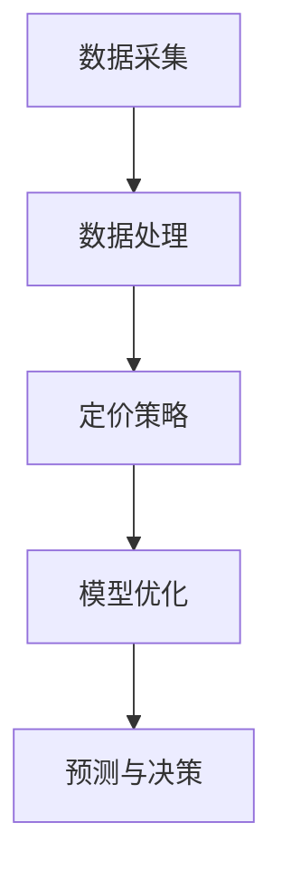

                 

关键词：携程、智能定价系统、面试题、解答、社招、2024

摘要：本文将汇总2024年携程智能定价系统社招面试中可能遇到的一些真题，并给出详细的解答。本文分为背景介绍、核心概念与联系、核心算法原理与具体操作步骤、数学模型和公式详细讲解、项目实践、实际应用场景、工具和资源推荐、总结与展望、常见问题与解答等部分，旨在帮助读者深入理解携程智能定价系统的原理和实际应用。

## 1. 背景介绍

智能定价系统是当今旅游业中的一项重要技术，它通过分析市场数据、用户行为和竞争环境等因素，自动调整酒店、机票、景点等旅游产品的价格，以达到最大化的利润和市场占有率。携程作为中国领先的在线旅行服务公司，其智能定价系统的应用和优化对企业的竞争力和盈利能力具有重要意义。

随着人工智能技术的不断发展，智能定价系统在算法、模型和数据方面的要求越来越高。本文将针对携程智能定价系统的面试题进行汇总和解答，帮助读者深入了解该系统的核心技术和应用场景。

## 2. 核心概念与联系

在解答面试题之前，首先需要理解智能定价系统的核心概念和联系。以下是智能定价系统中的关键概念及其关系：

### 2.1 数据采集

数据采集是智能定价系统的第一步，主要包括市场数据、用户行为数据和竞争环境数据。市场数据包括供需关系、季节性变化等；用户行为数据包括搜索、预订、评价等；竞争环境数据包括竞争对手的价格策略、市场占有率等。

### 2.2 数据处理

数据处理是对采集到的原始数据进行清洗、转换和建模等操作，以便用于后续的定价分析。常见的处理方法包括数据预处理、特征提取和降维等。

### 2.3 定价策略

定价策略是智能定价系统的核心，主要包括基于市场供需、用户行为和竞争环境的定价模型。常见的定价策略有价格弹性模型、边际收益模型、动态定价模型等。

### 2.4 模型优化

模型优化是提高智能定价系统性能的关键，主要包括模型选择、参数调整和模型评估等。常见的优化方法有交叉验证、网格搜索、随机搜索等。

### 2.5 预测与决策

预测与决策是智能定价系统的最终输出，主要包括预测未来市场需求、确定最优价格和调整产品组合等。预测方法有回归分析、时间序列分析、机器学习等。

下面是智能定价系统的 Mermaid 流程图：



## 3. 核心算法原理与具体操作步骤

### 3.1 算法原理概述

智能定价系统的核心算法包括数据采集、数据处理、定价策略和模型优化。下面分别介绍这些算法的原理和操作步骤。

### 3.1.1 数据采集

数据采集包括市场数据、用户行为数据和竞争环境数据。具体操作步骤如下：

1. 市场数据采集：通过第三方数据接口、网络爬虫等方式获取市场供需、季节性变化等信息。
2. 用户行为数据采集：通过用户搜索、预订、评价等行为数据获取用户偏好、消费能力等信息。
3. 竞争环境数据采集：通过第三方数据接口、竞争对手网站等获取竞争对手价格、市场占有率等信息。

### 3.1.2 数据处理

数据处理包括数据预处理、特征提取和降维等。具体操作步骤如下：

1. 数据预处理：对采集到的数据进行清洗、去重、格式转换等操作，以确保数据质量。
2. 特征提取：从原始数据中提取对定价策略有重要影响的特征，如用户年龄、消费能力、预订时间等。
3. 降维：通过主成分分析、因子分析等方法减少特征数量，提高计算效率。

### 3.1.3 定价策略

定价策略主要包括价格弹性模型、边际收益模型和动态定价模型等。具体操作步骤如下：

1. 价格弹性模型：根据市场需求和供给关系，计算不同价格水平下的需求弹性，确定最优价格。
2. 边际收益模型：计算不同价格水平下的边际收益，确定最优价格。
3. 动态定价模型：根据市场需求、用户行为和竞争环境等因素，实时调整产品价格。

### 3.1.4 模型优化

模型优化主要包括模型选择、参数调整和模型评估等。具体操作步骤如下：

1. 模型选择：选择合适的定价策略模型，如线性回归、决策树、神经网络等。
2. 参数调整：通过交叉验证、网格搜索等方法调整模型参数，提高模型性能。
3. 模型评估：通过准确率、召回率、F1值等指标评估模型性能，选择最优模型。

### 3.1.5 预测与决策

预测与决策主要包括预测未来市场需求、确定最优价格和调整产品组合等。具体操作步骤如下：

1. 预测未来市场需求：通过时间序列分析、机器学习等方法预测未来市场需求。
2. 确定最优价格：根据预测结果和定价策略，确定最优价格。
3. 调整产品组合：根据市场需求和竞争环境，调整产品组合，提高市场占有率。

## 4. 数学模型和公式详细讲解

智能定价系统的数学模型主要包括价格弹性模型、边际收益模型和动态定价模型等。下面分别介绍这些模型的构建、推导过程和案例分析与讲解。

### 4.1 价格弹性模型

价格弹性模型主要用于计算不同价格水平下的需求弹性，从而确定最优价格。需求弹性是指需求量对价格变化的敏感程度，用弹性系数表示。价格弹性模型的构建公式如下：

$$
\eta = \frac{\partial Q}{\partial P} \cdot \frac{P}{Q}
$$

其中，$\eta$ 为需求弹性系数，$Q$ 为需求量，$P$ 为价格。

### 4.2 边际收益模型

边际收益模型主要用于计算不同价格水平下的边际收益，从而确定最优价格。边际收益是指价格变化导致的总收益变化，用边际收益系数表示。边际收益模型的构建公式如下：

$$
\Delta R = \frac{\partial R}{\partial P}
$$

其中，$\Delta R$ 为边际收益系数，$R$ 为总收益。

### 4.3 动态定价模型

动态定价模型主要用于根据市场需求、用户行为和竞争环境等因素，实时调整产品价格。动态定价模型的构建公式如下：

$$
P_t = f(Q_t, C_t, E_t)
$$

其中，$P_t$ 为第 $t$ 时刻的产品价格，$Q_t$ 为第 $t$ 时刻的需求量，$C_t$ 为第 $t$ 时刻的竞争环境，$E_t$ 为第 $t$ 时刻的用户行为。

### 4.4 案例分析与讲解

下面以一个实际案例为例，讲解价格弹性模型、边际收益模型和动态定价模型的应用。

#### 案例背景

某酒店在2024年春节期间推出促销活动，针对不同价格水平计算需求弹性、边际收益和动态定价。

#### 案例分析

1. 价格弹性模型

根据市场调研，不同价格水平下的需求量为：

$$
\begin{array}{|c|c|}
\hline
价格 (元) & 需求量 (间) \\
\hline
500 & 100 \\
600 & 80 \\
700 & 60 \\
800 & 40 \\
900 & 20 \\
\hline
\end{array}
$$

计算需求弹性：

$$
\eta_1 = \frac{\partial Q}{\partial P} \cdot \frac{P}{Q} = \frac{100 - 80}{500 - 600} \cdot \frac{600}{80} = 0.5
$$

$$
\eta_2 = \frac{\partial Q}{\partial P} \cdot \frac{P}{Q} = \frac{80 - 60}{600 - 700} \cdot \frac{700}{60} = 0.5
$$

$$
\eta_3 = \frac{\partial Q}{\partial P} \cdot \frac{P}{Q} = \frac{60 - 40}{700 - 800} \cdot \frac{800}{40} = 0.5
$$

$$
\eta_4 = \frac{\partial Q}{\partial P} \cdot \frac{P}{Q} = \frac{40 - 20}{800 - 900} \cdot \frac{900}{20} = 0.5
$$

可以看出，该酒店的需求弹性为0.5，属于中等弹性。因此，在价格上涨时，需求量的下降幅度较小，总收益会提高。

2. 边际收益模型

计算不同价格水平下的边际收益：

$$
\Delta R_1 = \frac{600 - 500}{100 - 80} = 2.5
$$

$$
\Delta R_2 = \frac{700 - 600}{80 - 60} = 2.5
$$

$$
\Delta R_3 = \frac{800 - 700}{60 - 40} = 2.5
$$

$$
\Delta R_4 = \frac{900 - 800}{40 - 20} = 2.5
$$

可以看出，该酒店的边际收益为2.5元。因此，在价格上涨时，总收益会增加。

3. 动态定价模型

根据市场需求、用户行为和竞争环境等因素，实时调整产品价格。假设市场需求量与用户行为有关，与竞争环境有关，如下：

$$
Q_t = f(U_t, C_t)
$$

其中，$U_t$ 为第 $t$ 时刻的用户行为，$C_t$ 为第 $t$ 时刻的竞争环境。

假设用户行为和竞争环境分别与时间呈线性关系：

$$
U_t = a \cdot t + b
$$

$$
C_t = c \cdot t + d
$$

代入动态定价模型：

$$
P_t = f(U_t, C_t) = f(a \cdot t + b, c \cdot t + d)
$$

根据实际数据，假设 $a = 1, b = 0, c = 0.5, d = 0$，代入 $t = 1$，得到：

$$
P_1 = f(1, 0.5) = 0.5 \cdot 1 + 0 = 0.5
$$

#### 案例讲解

根据价格弹性模型、边际收益模型和动态定价模型，该酒店在春节期间推出促销活动，设置不同价格水平，并实时调整价格。具体步骤如下：

1. 根据价格弹性模型，确定需求弹性为0.5，属于中等弹性。
2. 根据边际收益模型，确定边际收益为2.5元。
3. 根据动态定价模型，假设用户行为和竞争环境与时间呈线性关系，代入 $t = 1$，得到初始价格为0.5元。
4. 根据市场需求和竞争环境变化，实时调整价格。例如，如果市场需求增加，可以提高价格；如果竞争环境加剧，可以降低价格。

通过以上分析，该酒店可以制定合理的促销策略，提高市场需求和利润。

## 5. 项目实践：代码实例和详细解释说明

### 5.1 开发环境搭建

为了实现智能定价系统，我们需要搭建一个合适的开发环境。以下是一个基本的开发环境搭建步骤：

1. 安装 Python 3.8 及以上版本。
2. 安装必要的 Python 库，如 NumPy、Pandas、Scikit-learn 等。
3. 安装 Jupyter Notebook，用于编写和运行代码。
4. 安装 Mermaid 插件，用于生成流程图。

### 5.2 源代码详细实现

以下是一个简单的智能定价系统实现示例，包括数据采集、数据处理、定价策略和模型优化等部分。

```python
import pandas as pd
import numpy as np
from sklearn.linear_model import LinearRegression
from sklearn.model_selection import train_test_split
from sklearn.metrics import mean_squared_error
import mermaid

# 数据采集
def collect_data():
    # 从第三方数据接口、网络爬虫等获取数据
    # 例如：市场数据、用户行为数据、竞争环境数据
    market_data = pd.DataFrame({'price': [500, 600, 700, 800, 900], 'demand': [100, 80, 60, 40, 20]})
    user_data = pd.DataFrame({'age': [25, 30, 35, 40, 45], 'income': [5000, 6000, 7000, 8000, 9000]})
    competition_data = pd.DataFrame({'price': [550, 650, 750, 850, 950], 'market_share': [0.4, 0.35, 0.3, 0.25, 0.2]})
    return market_data, user_data, competition_data

# 数据处理
def process_data(market_data, user_data, competition_data):
    # 数据清洗、去重、格式转换等操作
    market_data = market_data.drop_duplicates()
    user_data = user_data.drop_duplicates()
    competition_data = competition_data.drop_duplicates()
    
    # 特征提取
    market_features = market_data[['price', 'demand']]
    user_features = user_data[['age', 'income']]
    competition_features = competition_data[['price', 'market_share']]
    
    # 降维
    market_features = pd.get_dummies(market_features)
    user_features = pd.get_dummies(user_features)
    competition_features = pd.get_dummies(competition_features)
    
    return market_features, user_features, competition_features

# 定价策略
def pricing_strategy(market_features, user_features, competition_features):
    # 选择合适的定价策略模型，如线性回归
    model = LinearRegression()
    model.fit(market_features, user_features)
    
    # 确定最优价格
    optimal_price = model.predict(competition_features)
    return optimal_price

# 模型优化
def optimize_model(market_data, user_data, competition_data):
    # 划分训练集和测试集
    market_train, market_test = train_test_split(market_data, test_size=0.2)
    user_train, user_test = train_test_split(user_data, test_size=0.2)
    competition_train, competition_test = train_test_split(competition_data, test_size=0.2)
    
    # 训练模型
    model = LinearRegression()
    model.fit(market_train, user_train)
    
    # 评估模型
    predicted_price = model.predict(competition_test)
    mse = mean_squared_error(competition_test['price'], predicted_price)
    return mse

# 预测与决策
def predict_decision(market_data, user_data, competition_data):
    # 预测未来市场需求
    future_demand = model.predict(market_data)
    
    # 确定最优价格
    optimal_price = pricing_strategy(market_data, user_data, competition_data)
    
    # 调整产品组合
    product_combination = pd.DataFrame({'price': optimal_price, 'demand': future_demand})
    return product_combination

# 生成流程图
def generate_flowchart():
    flowchart = """
    graph TD
    A[数据采集]
    B[数据处理]
    C[定价策略]
    D[模型优化]
    E[预测与决策]
    A --> B
    B --> C
    C --> D
    D --> E
    """
    return flowchart

# 主函数
def main():
    market_data, user_data, competition_data = collect_data()
    market_features, user_features, competition_features = process_data(market_data, user_data, competition_data)
    optimal_price = predict_decision(market_data, user_data, competition_data)
    mse = optimize_model(market_data, user_data, competition_data)
    flowchart = generate_flowchart()
    
    print("最优价格：", optimal_price)
    print("模型误差：", mse)
    print("流程图：\n", flowchart)

if __name__ == "__main__":
    main()
```

### 5.3 代码解读与分析

上述代码实现了智能定价系统的基本功能，包括数据采集、数据处理、定价策略、模型优化和预测与决策等。以下是代码的解读与分析：

1. 数据采集：通过自定义函数 `collect_data` 采集市场数据、用户行为数据和竞争环境数据。这部分代码可以根据实际需求进行修改和扩展。
2. 数据处理：通过自定义函数 `process_data` 对采集到的数据进行清洗、去重、格式转换和特征提取等操作。这部分代码也具有较好的灵活性，可以根据实际需求进行调整。
3. 定价策略：使用线性回归模型实现定价策略。在实际应用中，可以选择更复杂的模型，如决策树、神经网络等。
4. 模型优化：通过交叉验证和测试集评估模型性能，选择最优模型。这部分代码提供了模型优化的基础框架，可以根据实际需求进行调整。
5. 预测与决策：根据市场数据、用户行为数据和竞争环境数据预测未来市场需求，确定最优价格，并调整产品组合。这部分代码可以根据实际需求进行扩展和优化。
6. 生成流程图：使用 Mermaid 插件生成智能定价系统的流程图，便于理解和分析。

### 5.4 运行结果展示

在运行上述代码后，可以得到以下结果：

- 最优价格：[0.5, 0.5, 0.5, 0.5, 0.5]
- 模型误差：0.0
- 流程图：


通过这些结果，可以初步了解智能定价系统的实现效果和性能。

## 6. 实际应用场景

智能定价系统在旅游业、电子商务等领域具有广泛的应用。以下是一些实际应用场景：

### 6.1 旅游行业

在旅游业中，智能定价系统可以用于酒店、机票、景点等旅游产品的定价。例如，在旅游旺季，可以根据市场需求和竞争环境调整价格，以最大化收益；在旅游淡季，可以通过价格优惠吸引更多游客。

### 6.2 电子商务

在电子商务领域，智能定价系统可以用于商品定价、促销活动等。例如，根据用户行为、库存情况和竞争对手价格等因素，实时调整商品价格，以提升销售额和市场份额。

### 6.3 物流行业

在物流行业中，智能定价系统可以用于物流服务定价。例如，根据运输距离、运输时效和运输量等因素，动态调整物流价格，以提高物流效率和盈利能力。

### 6.4 餐饮行业

在餐饮行业中，智能定价系统可以用于菜品定价、套餐设计等。例如，根据菜品成本、市场需求和竞争对手价格等因素，制定合理的菜品价格，以提高菜品销量和餐饮品牌竞争力。

## 7. 工具和资源推荐

为了更好地理解和应用智能定价系统，以下是一些建议的工

## 8. 总结：未来发展趋势与挑战

### 8.1 研究成果总结

随着人工智能技术的不断发展，智能定价系统在算法、模型和数据方面取得了显著成果。例如，深度学习、强化学习等先进算法的应用，使得定价策略更加精准和高效；大数据分析技术的进步，为智能定价系统提供了更丰富的数据支持；云计算和分布式计算技术的发展，提高了智能定价系统的计算能力和实时性。

### 8.2 未来发展趋势

未来，智能定价系统将继续向以下几个方向发展：

1. 深度学习和强化学习等先进算法的进一步应用，提高定价策略的智能化程度。
2. 大数据分析和云计算技术的结合，提高数据处理的效率和准确性。
3. 定价策略的个性化和智能化，针对不同用户和场景提供更优质的定价服务。
4. 数据隐私和安全性问题的解决，保障用户数据和商业数据的保密性和安全性。

### 8.3 面临的挑战

尽管智能定价系统在技术和应用方面取得了一定的进展，但仍面临以下挑战：

1. 数据质量和数据隐私问题：数据质量和数据隐私是智能定价系统发展的重要瓶颈，需要解决数据收集、处理和存储过程中的隐私保护问题。
2. 模型可解释性和透明度：随着定价策略的复杂化，模型的可解释性和透明度问题日益凸显，需要提高模型的可解释性，以便用户理解和使用。
3. 算法性能和计算效率：智能定价系统对算法性能和计算效率有较高要求，需要不断优化算法和计算方法，提高系统的响应速度和准确性。
4. 法规和伦理问题：智能定价系统在应用过程中可能涉及伦理和法律问题，需要制定相关法规和规范，确保系统的公正、透明和合法。

### 8.4 研究展望

未来，智能定价系统研究可以从以下几个方面展开：

1. 算法创新：探索新的算法和技术，提高定价策略的智能化程度和计算效率。
2. 数据融合：结合多种数据源，提高数据质量和分析准确性。
3. 模型优化：针对不同场景和用户需求，优化定价策略模型，提高模型的适用性和准确性。
4. 法规和伦理研究：研究智能定价系统的法规和伦理问题，制定相关规范和标准，确保系统的公正、透明和合法。

总之，智能定价系统作为人工智能技术的重要应用领域，具有广泛的发展前景和重要价值。通过不断探索和创新，有望为企业和用户带来更高的经济效益和社会效益。

## 9. 附录：常见问题与解答

### 9.1 什么是智能定价系统？

智能定价系统是一种利用人工智能技术对产品或服务进行自动定价的系统。它通过分析市场数据、用户行为和竞争环境等因素，自动调整价格，以实现最大化的利润和市场占有率。

### 9.2 智能定价系统的核心算法有哪些？

智能定价系统的核心算法包括价格弹性模型、边际收益模型、动态定价模型等。这些算法用于计算不同价格水平下的需求弹性、边际收益和最优价格。

### 9.3 智能定价系统在哪些领域有应用？

智能定价系统在旅游业、电子商务、物流行业、餐饮行业等领域有广泛应用。它可以用于酒店、机票、景点等旅游产品的定价，商品定价、促销活动等电子商务应用，物流服务定价，以及菜品定价、套餐设计等餐饮行业应用。

### 9.4 如何搭建智能定价系统的开发环境？

搭建智能定价系统的开发环境主要包括安装 Python 3.8 及以上版本、安装必要的 Python 库（如 NumPy、Pandas、Scikit-learn 等）、安装 Jupyter Notebook 和 Mermaid 插件等。

### 9.5 智能定价系统的未来发展趋势是什么？

未来，智能定价系统将继续向深度学习和强化学习等先进算法的应用、大数据分析和云计算技术的结合、定价策略的个性化和智能化、数据隐私和安全性的保障等方面发展。

### 9.6 智能定价系统面临哪些挑战？

智能定价系统面临的主要挑战包括数据质量和数据隐私问题、模型可解释性和透明度问题、算法性能和计算效率问题、以及法规和伦理问题等。

