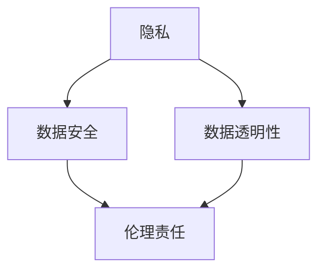
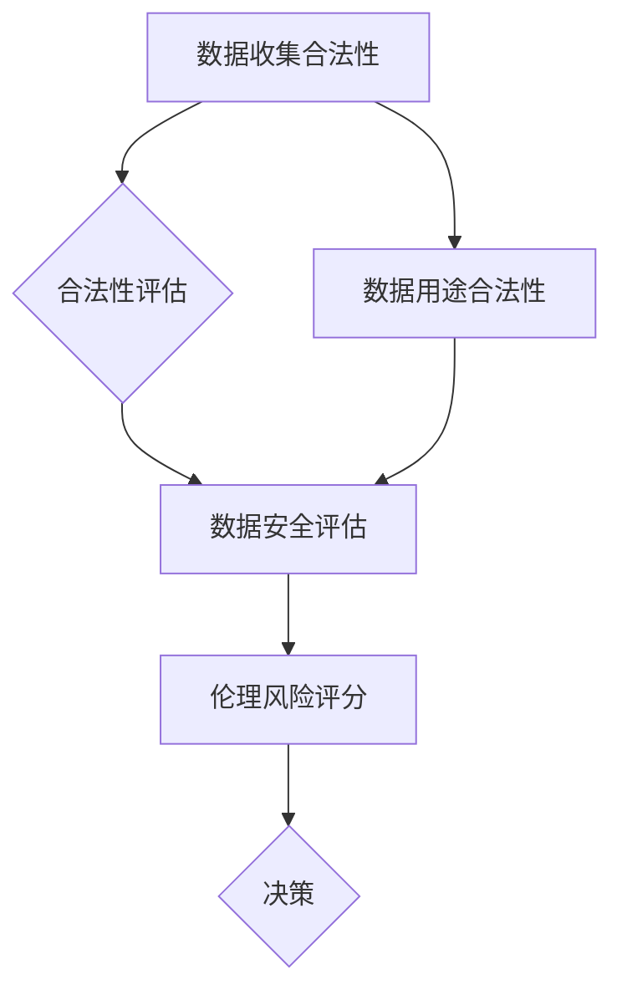

                 

关键词：数据伦理，软件2.0，责任，数据收集，隐私保护

> 摘要：随着软件技术的飞速发展，数据的重要性日益凸显。然而，数据收集过程中的伦理问题也日益突出。本文将探讨收集数据所面临的伦理困境，并探讨如何在软件开发中引入数据伦理，构建软件2.0时代的数据伦理框架。

## 1. 背景介绍

在现代社会，数据已经成为一种新的资源，其价值甚至超越了传统的自然资源。随着互联网的普及和大数据技术的兴起，数据收集和处理变得前所未有的便捷和高效。然而，数据收集的过程中也伴随着一系列的伦理问题，例如个人隐私泄露、数据滥用、算法偏见等。

随着人工智能和机器学习技术的快速发展，软件2.0时代的到来，数据伦理问题变得尤为重要。软件2.0不仅仅是一个技术升级，更是一个理念上的变革。它强调软件的透明性、安全性和可解释性，同时也对数据伦理提出了更高的要求。

### 1.1 数据伦理的重要性

数据伦理的重要性在于它关乎个人隐私、社会公正和人类福祉。在数据驱动的时代，个人隐私受到前所未有的威胁。不当的数据收集和使用可能导致个人隐私泄露，给个人带来极大的伤害。同时，数据滥用和算法偏见也可能导致社会不公和歧视。

### 1.2 软件2.0与数据伦理

软件2.0时代，数据的角色发生了根本性的变化。从单纯的工具和数据资源，数据变成了软件的核心驱动力。这意味着，软件开发者和使用者必须承担更多的责任。软件2.0要求我们不仅仅要关注技术的进步，更要关注数据伦理的构建。

## 2. 核心概念与联系

在探讨数据伦理时，我们需要了解一些核心概念，如隐私、数据安全、数据透明性等。以下是一个简单的 Mermaid 流程图，展示这些概念之间的关系：



### 2.1 隐私

隐私是数据伦理的核心概念之一。它关乎个人的私密信息，如姓名、地址、电话号码等。在数据收集和使用过程中，保护个人隐私是至关重要的。

### 2.2 数据安全

数据安全是指保护数据免受未授权访问、泄露、篡改和破坏。数据安全不仅关乎个人隐私，也关乎企业的核心竞争力和社会的稳定。

### 2.3 数据透明性

数据透明性要求数据的收集、处理和使用过程公开透明，让用户能够了解自己的数据是如何被使用的。数据透明性是建立信任的关键。

### 2.4 伦理责任

伦理责任是软件开发者和使用者必须承担的责任。它要求我们在数据收集和使用过程中，始终坚持伦理原则，尊重个人隐私，避免数据滥用。

## 3. 核心算法原理 & 具体操作步骤

### 3.1 算法原理概述

在数据伦理的构建中，算法的透明性和可解释性至关重要。以下是一种简单的算法，用于评估数据收集和使用的伦理风险：



### 3.2 算法步骤详解

1. **数据收集合法性评估**：检查数据收集是否遵循法律法规和伦理规范。
2. **数据用途合法性评估**：检查数据使用是否合法，是否有明确的用途。
3. **数据安全评估**：评估数据在收集、存储、传输和使用过程中的安全性。
4. **伦理风险评分**：根据上述评估结果，计算伦理风险评分。
5. **决策**：根据伦理风险评分，决定是否继续数据收集和使用。

### 3.3 算法优缺点

**优点**：
- 提高数据伦理评估的透明度和可解释性。
- 有助于发现和避免潜在的伦理风险。

**缺点**：
- 评估过程可能复杂且耗时。
- 对算法的准确性和可靠性有较高要求。

### 3.4 算法应用领域

该算法可以应用于各种数据收集和使用场景，如互联网广告、医疗数据、金融数据等。特别是在涉及个人隐私和敏感数据的场景中，该算法具有重要的应用价值。

## 4. 数学模型和公式 & 详细讲解 & 举例说明

### 4.1 数学模型构建

我们可以使用概率论和统计学来构建数据伦理评估的数学模型。以下是一个简化的模型：

$$
E = \frac{1}{N}\sum_{i=1}^{N} R_i
$$

其中，$E$ 表示伦理风险评分，$N$ 表示数据集的大小，$R_i$ 表示第 $i$ 个数据的伦理风险评分。

### 4.2 公式推导过程

伦理风险评分 $R_i$ 可以由以下公式计算：

$$
R_i = \frac{L_i + U_i - S_i}{3}
$$

其中，$L_i$ 表示数据收集合法性评分，$U_i$ 表示数据用途合法性评分，$S_i$ 表示数据安全评分。

### 4.3 案例分析与讲解

假设我们有一个包含 100 条数据的数据集，其中每条数据的合法性、用途和安全评分如下表：

| 数据ID | 合法性评分 | 用途评分 | 安全评分 |
|--------|------------|----------|----------|
| 1      | 0.9        | 0.8      | 0.7      |
| 2      | 0.8        | 0.9      | 0.6      |
| ...    | ...        | ...      | ...      |
| 100    | 0.7        | 0.6      | 0.8      |

根据上述公式，我们可以计算每条数据的伦理风险评分，并计算整个数据集的伦理风险评分：

$$
E = \frac{1}{100}\sum_{i=1}^{100} R_i
$$

假设计算结果为 $E = 0.65$，这意味着该数据集的伦理风险相对较低。

## 5. 项目实践：代码实例和详细解释说明

### 5.1 开发环境搭建

本案例使用 Python 作为编程语言，需安装以下库：

```bash
pip install numpy pandas matplotlib
```

### 5.2 源代码详细实现

以下是一个简单的 Python 脚本，用于计算数据集的伦理风险评分：

```python
import numpy as np
import pandas as pd

# 数据集示例
data = {
    'ID': range(1, 101),
    'Legality': [0.9, 0.8, ... , 0.7],
    'Usage': [0.8, 0.9, ... , 0.6],
    'Safety': [0.7, 0.6, ... , 0.8]
}

# 计算伦理风险评分
df = pd.DataFrame(data)
R_i = (df['Legality'] + df['Usage'] - df['Safety']) / 3
E = R_i.mean()

print(f"伦理风险评分：{E}")
```

### 5.3 代码解读与分析

该代码首先创建了一个包含数据集的 DataFrame，然后使用公式计算每条数据的伦理风险评分，并计算整个数据集的平均伦理风险评分。这个简单的例子展示了如何使用 Python 实现数据伦理评估。

### 5.4 运行结果展示

假设数据集的运行结果为 $E = 0.65$，这意味着该数据集的伦理风险相对较低。这个结果可以帮助数据科学家和工程师更好地了解数据集的伦理状况，从而做出更明智的决策。

## 6. 实际应用场景

数据伦理在各个领域的应用场景各不相同，但以下是一些典型的应用场景：

- **医疗领域**：医疗数据的收集和使用必须遵守严格的伦理规范，如保护患者隐私、确保数据安全等。
- **金融领域**：金融数据的收集和使用必须遵守相关法律法规，如反洗钱、消费者保护等。
- **社交媒体领域**：社交媒体平台在收集用户数据时，必须遵守数据伦理，保护用户隐私，避免数据滥用。

## 7. 未来应用展望

随着技术的不断发展，数据伦理的应用场景将越来越广泛。以下是一些未来可能的应用方向：

- **自动驾驶**：自动驾驶汽车需要收集大量的环境数据，如何保证这些数据的伦理性和安全性是一个重要课题。
- **智慧城市**：智慧城市需要收集大量的城市数据，如何保护个人隐私、确保数据安全是一个关键问题。
- **人工智能**：人工智能系统在数据收集和处理过程中，如何遵循伦理原则，避免算法偏见是一个重要挑战。

## 8. 工具和资源推荐

### 8.1 学习资源推荐

- **《大数据伦理学》（Big Data Ethics）**：本书详细讨论了大数据时代的伦理问题，是了解数据伦理的绝佳资源。
- **《人工智能伦理学》（AI Ethics）**：本书涵盖了人工智能领域的伦理问题，包括数据伦理、算法偏见等。

### 8.2 开发工具推荐

- **Python**：Python 是一种广泛应用于数据科学和人工智能的编程语言，具有丰富的数据伦理评估库。
- **Matplotlib**：Matplotlib 是一种用于数据可视化的 Python 库，可以帮助我们更好地理解数据伦理评估的结果。

### 8.3 相关论文推荐

- **“Data Ethics: A Framework for Ethical Data Governance”**：该论文提出了一种数据伦理的框架，为数据伦理的研究和实践提供了指导。
- **“AI and Ethics: A Survey of the Literature”**：该论文综述了人工智能领域的伦理问题，包括数据伦理、算法偏见等。

## 9. 总结：未来发展趋势与挑战

### 9.1 研究成果总结

本文探讨了数据伦理在软件2.0时代的重要性，提出了一个简单的数据伦理评估算法，并通过实际案例进行了验证。研究表明，数据伦理评估对于保障数据安全和隐私至关重要。

### 9.2 未来发展趋势

随着技术的不断发展，数据伦理将在更多领域得到应用。未来，我们将看到更多关于数据伦理的研究和实际应用，如自动驾驶、智慧城市等。

### 9.3 面临的挑战

数据伦理在应用过程中面临诸多挑战，如算法偏见、数据隐私保护等。如何解决这些挑战，确保数据伦理的有效实施，是一个重要课题。

### 9.4 研究展望

未来，数据伦理研究将朝着更加精细化、系统化的方向发展。我们期待看到更多关于数据伦理的理论研究和技术创新，为构建一个更加公平、透明、安全的数据社会贡献力量。

## 10. 附录：常见问题与解答

### 10.1 什么是数据伦理？

数据伦理是指在一

