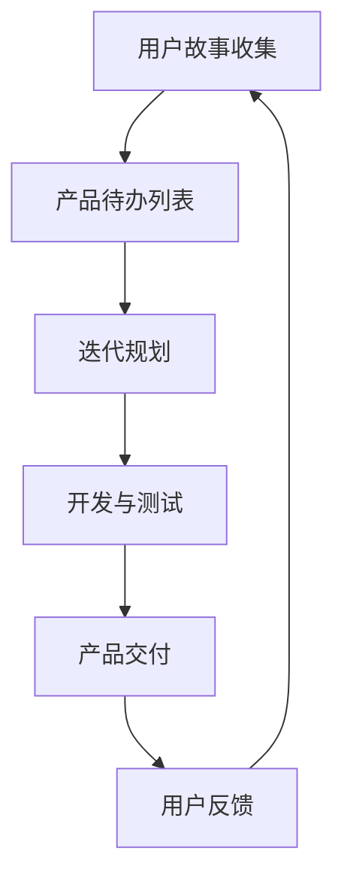

                 

 

> 关键词：敏捷开发、快速迭代、软件开发、代码实战、敏捷原理

> 摘要：本文旨在深入探讨敏捷开发与快速迭代的原理，结合实际代码实战案例，详细讲解敏捷开发的实践方法，包括核心概念、工具应用、流程优化和代码实现，以帮助开发者和团队提升软件开发效率和质量。

## 1. 背景介绍

在当今快速变化的市场环境中，传统的瀑布式软件开发模式已经难以满足业务需求的快速迭代和持续更新。敏捷开发作为一种更加灵活、响应迅速的开发方法，逐渐成为软件开发领域的首选。敏捷开发强调团队协作、客户反馈和持续交付，其核心理念是快速迭代、持续改进和适应变化。

快速迭代是敏捷开发的核心特征之一。通过将开发周期划分为多个短周期（通常为两周或一个月），团队可以更快地交付功能、获取反馈并做出调整。这种方法不仅提高了开发效率，还确保了软件的质量和用户满意度。

本文将围绕敏捷开发的原理和快速迭代的方法进行深入探讨，并结合具体代码实战案例，帮助读者理解和掌握敏捷开发的关键技术和实践。

## 2. 核心概念与联系

### 2.1 敏捷开发的核心概念

敏捷开发的核心概念包括：

- **用户故事（User Stories）**：用户故事是用户需求的描述，通常以“作为...，我想要...，以便...”的格式书写。用户故事是敏捷开发中需求收集和优先级排序的重要工具。
- **迭代（Iteration）**：迭代是敏捷开发中的基本工作周期，每个迭代包含需求收集、规划、开发、测试和交付等阶段。迭代通常是两周或一个月的时间。
- **Scrum**：Scrum是一种流行的敏捷开发框架，包括产品待办列表（Product Backlog）、冲刺待办列表（Sprint Backlog）、每日站会（Daily Stand-up）、回顾会议（Retrospective）等。
- **看板（Kanban）**：Kanban是一种基于可视化工作流程的敏捷开发方法，通过限制在流程中同时进行的工作数量，减少瓶颈和浪费，提高效率。

### 2.2 敏捷开发与快速迭代的联系

敏捷开发与快速迭代之间有着紧密的联系。快速迭代是敏捷开发的核心特征，它通过短周期的开发方式，确保了软件的不断交付和持续改进。

- **频繁交付**：快速迭代要求团队在短时间内交付可工作的软件版本，这有助于及时获取用户反馈并进行调整。
- **持续集成**：快速迭代需要频繁的代码集成和测试，以确保代码库的稳定性和可靠性。
- **持续改进**：通过每次迭代的反思和总结，团队可以不断优化开发流程和提升软件质量。

### 2.3 敏捷开发与快速迭代的流程图

以下是敏捷开发与快速迭代的流程图，展示了从用户故事到产品交付的整个过程。



## 3. 核心算法原理 & 具体操作步骤

### 3.1 算法原理概述

敏捷开发的核心算法可以概括为：

1. **用户故事映射**：将用户需求转化为可执行的代码。
2. **迭代规划**：确定每个迭代的目标和任务。
3. **代码集成与测试**：确保每次迭代的代码质量。
4. **用户反馈**：获取用户对每次迭代的反馈，指导后续开发。

### 3.2 算法步骤详解

#### 3.2.1 用户故事映射

用户故事映射是将用户需求转化为开发任务的过程。以下是用户故事映射的步骤：

1. **理解用户需求**：与用户沟通，了解他们的需求和期望。
2. **编写用户故事**：根据用户需求，编写简洁、具体、可测试的用户故事。
3. **故事优先级排序**：根据用户需求和项目目标，对用户故事进行优先级排序。

#### 3.2.2 迭代规划

迭代规划是在每个迭代开始时进行的，以确保团队明确每个迭代的目标和任务。以下是迭代规划的步骤：

1. **回顾上一个迭代**：总结上一个迭代的结果，识别问题和改进点。
2. **确定迭代目标**：根据用户故事优先级，确定本次迭代的目标。
3. **分配任务**：将任务分配给团队成员，确保每个成员都清楚自己的任务和目标。

#### 3.2.3 代码集成与测试

代码集成与测试是确保每次迭代代码质量的关键步骤。以下是代码集成与测试的步骤：

1. **代码审查**：团队成员对提交的代码进行审查，确保代码质量。
2. **自动化测试**：编写和执行自动化测试，确保代码的稳定性和可靠性。
3. **集成测试**：将各个模块的代码集成起来，进行整体测试。

#### 3.2.4 用户反馈

用户反馈是敏捷开发中获取用户需求的重要手段。以下是用户反馈的步骤：

1. **用户测试**：将迭代版本交付给用户，进行实际使用测试。
2. **收集反馈**：收集用户对迭代版本的反馈，识别问题和改进点。
3. **迭代优化**：根据用户反馈，对后续迭代进行优化和调整。

### 3.3 算法优缺点

#### 优点

- **快速响应变化**：敏捷开发通过快速迭代，能够及时响应市场变化和用户需求。
- **持续改进**：每次迭代结束后，团队都会进行反思和总结，持续改进开发流程和软件质量。
- **高用户满意度**：频繁的交付和用户反馈，确保了软件质量和用户满意度。

#### 缺点

- **开发初期成本较高**：敏捷开发需要频繁的迭代和用户反馈，这可能会导致开发初期的成本较高。
- **对团队协作要求高**：敏捷开发强调团队协作，对团队成员的沟通和协作能力有较高要求。

### 3.4 算法应用领域

敏捷开发广泛应用于以下领域：

- **互联网应用开发**：敏捷开发能够快速响应互联网市场的变化，确保软件的及时更新和迭代。
- **移动应用开发**：移动应用需求变化快，敏捷开发能够快速适应这些变化，确保应用的质量和用户满意度。
- **软件维护和升级**：敏捷开发能够快速修复问题和优化软件，提高软件的稳定性和用户体验。

## 4. 数学模型和公式 & 详细讲解 & 举例说明

### 4.1 数学模型构建

敏捷开发中的数学模型主要用于评估开发进度、工作量估算和资源分配。以下是几个常用的数学模型：

#### 4.1.1 点估计法

点估计法是一种简单的工作量估算方法，它通过计算每个任务的估计时间，得到整个项目的预计完成时间。公式如下：

\[ \text{点估计时间} = \frac{\sum \text{任务时间}}{\text{任务数量}} \]

#### 4.1.2 资源分配模型

资源分配模型用于确定如何合理分配团队资源，以确保每个迭代都能按时完成。常用的资源分配模型包括：

- **最小最大资源分配模型**：将资源分配给任务数量最多的迭代，以确保每个迭代都有足够的资源。
- **加权平均资源分配模型**：根据每个迭代的工作量，为每个迭代分配相应的资源。

### 4.2 公式推导过程

#### 4.2.1 点估计法公式推导

点估计法的推导过程如下：

1. **计算每个任务的估计时间**：对于每个任务，由团队成员根据经验和历史数据，估算完成任务所需的时间。
2. **求和**：将所有任务的估计时间求和，得到总的工作量。
3. **除以任务数量**：将总工作量除以任务数量，得到每个任务的平均估计时间，即点估计时间。

#### 4.2.2 资源分配模型公式推导

资源分配模型的推导过程如下：

1. **确定每个迭代的工作量**：根据用户故事和任务分配情况，计算每个迭代的工作量。
2. **计算每个迭代的资源需求**：根据迭代工作量，计算每个迭代所需的资源数量。
3. **分配资源**：根据资源需求，为每个迭代分配相应的资源。

### 4.3 案例分析与讲解

#### 4.3.1 点估计法案例

假设有一个软件开发项目，包含5个任务，每个任务的估计时间如下：

- 任务1：5天
- 任务2：3天
- 任务3：7天
- 任务4：2天
- 任务5：4天

使用点估计法，我们可以得到项目的点估计时间：

\[ \text{点估计时间} = \frac{5 + 3 + 7 + 2 + 4}{5} = 4.2 \text{天} \]

#### 4.3.2 资源分配模型案例

假设一个项目包含3个迭代，每个迭代的工作量分别为：

- 迭代1：10人天
- 迭代2：15人天
- 迭代3：20人天

使用最小最大资源分配模型，我们为每个迭代分配资源：

- 迭代1：5人
- 迭代2：5人
- 迭代3：10人

这种资源分配方式确保了每个迭代都有足够的资源，同时也避免了资源的过度集中。

## 5. 项目实践：代码实例和详细解释说明

### 5.1 开发环境搭建

在本案例中，我们使用Python作为开发语言，搭建一个简单的Web应用。以下是开发环境的搭建步骤：

1. **安装Python**：从官方网站下载并安装Python 3.8以上版本。
2. **安装虚拟环境**：在项目中创建一个虚拟环境，以隔离项目依赖。
   ```bash
   python -m venv venv
   ```
3. **激活虚拟环境**：
   - Windows：
     ```bash
     .\venv\Scripts\activate
     ```
   - macOS和Linux：
     ```bash
     source venv/bin/activate
     ```

### 5.2 源代码详细实现

以下是项目的源代码实现：

```python
# app.py

from flask import Flask, render_template, request

app = Flask(__name__)

@app.route('/')
def index():
    return render_template('index.html')

@app.route('/submit', methods=['POST'])
def submit():
    name = request.form['name']
    message = request.form['message']
    return render_template('result.html', name=name, message=message)

if __name__ == '__main__':
    app.run(debug=True)
```

#### 5.3 代码解读与分析

- **Flask应用**：我们使用Flask框架搭建Web应用，它是一个轻量级的Web框架，易于学习和使用。
- **路由**：`@app.route('/')` 定义了首页的路由，`@app.route('/submit', methods=['POST'])` 定义了提交表单的路由。
- **模板渲染**：使用Jinja2模板引擎，我们可以在Web页面中嵌入Python代码，实现动态内容渲染。

### 5.4 运行结果展示

1. **启动应用**：在终端中运行以下命令：
   ```bash
   python app.py
   ```
2. **访问首页**：在浏览器中输入`http://127.0.0.1:5000/`，可以看到首页的渲染效果。
3. **提交表单**：在首页中填写表单并提交，可以看到提交结果页面的渲染效果。

## 6. 实际应用场景

### 6.1 敏捷开发在Web应用开发中的应用

敏捷开发在Web应用开发中有着广泛的应用。通过快速迭代，团队可以迅速响应市场变化和用户需求，确保Web应用的持续更新和优化。以下是一个实际应用场景：

- **项目背景**：某公司开发一款在线教育平台，需要不断更新课程内容和用户交互体验。
- **敏捷实践**：团队采用Scrum框架，将每个课程模块划分为用户故事，每个迭代周期为两周。在每个迭代周期中，团队开发新的课程模块、优化用户界面和收集用户反馈。
- **效果**：通过敏捷开发，团队在短时间内完成了多个课程模块的开发和优化，用户反馈积极，平台用户数量和活跃度持续增长。

### 6.2 敏捷开发在移动应用开发中的应用

敏捷开发在移动应用开发中也具有重要作用。通过快速迭代，团队可以不断优化应用功能、性能和用户体验。以下是一个实际应用场景：

- **项目背景**：某公司开发一款健康监测移动应用，需要快速上线并不断更新功能。
- **敏捷实践**：团队采用Kanban框架，将开发任务分解为用户故事，并使用看板进行任务管理。每个迭代周期为一个月，团队在每个迭代中开发新功能、修复bug和优化性能。
- **效果**：通过敏捷开发，团队在短时间内完成了多个版本的应用开发，用户反馈积极，应用市场份额稳步提升。

## 7. 工具和资源推荐

### 7.1 学习资源推荐

- **《敏捷软件开发：实践与模式》**：这是一本经典的敏捷开发教材，详细介绍了敏捷开发的核心原理和实践方法。
- **《Scrum精髓：实施Scrum指南》**：这是一本关于Scrum框架的指南，适用于初学者和专业人士。

### 7.2 开发工具推荐

- **JIRA**：JIRA是一个流行的敏捷项目管理工具，适用于用户故事管理、迭代规划和任务跟踪。
- **Trello**：Trello是一个基于看板的任务管理工具，简单易用，适用于敏捷开发中的任务分解和跟踪。

### 7.3 相关论文推荐

- **《敏捷开发：从理念到实践》**：这是一篇关于敏捷开发的综述论文，详细介绍了敏捷开发的背景、原理和实践方法。
- **《敏捷与快速迭代：软件开发的新模式》**：这是一篇关于敏捷开发与快速迭代的论文，分析了敏捷开发的优点和挑战。

## 8. 总结：未来发展趋势与挑战

### 8.1 研究成果总结

敏捷开发作为一种灵活、高效的开发方法，已经在软件行业得到广泛应用。通过快速迭代、持续改进和用户反馈，敏捷开发确保了软件的高质量和用户满意度。未来，敏捷开发将继续发展和完善，结合人工智能、大数据等新技术，提升软件开发效率和用户体验。

### 8.2 未来发展趋势

- **自动化和智能化**：敏捷开发将结合自动化工具和人工智能技术，实现更高效的流程管理和任务分配。
- **个性化定制**：敏捷开发将更加关注用户需求，提供个性化定制服务，满足不同用户群体的需求。
- **跨领域融合**：敏捷开发将与其他领域（如大数据、物联网等）相结合，推动软件开发向更广泛的领域扩展。

### 8.3 面临的挑战

- **团队协作**：敏捷开发强调团队协作，对团队成员的沟通和协作能力有较高要求。未来，团队协作工具和方法的创新将是重要挑战。
- **项目管理**：敏捷开发需要灵活应对变化，对项目管理的挑战较大。如何平衡敏捷性与项目控制，将是一个持续的问题。

### 8.4 研究展望

未来，敏捷开发的研究将重点关注以下几个方面：

- **敏捷开发的最佳实践**：总结和推广敏捷开发的最佳实践，提高开发效率和软件质量。
- **敏捷开发与AI融合**：研究敏捷开发与人工智能、大数据等新技术的融合，探索敏捷开发在智能软件开发中的应用。
- **敏捷开发的可持续性**：研究如何确保敏捷开发的可持续性，降低开发成本，提高开发效率。

## 9. 附录：常见问题与解答

### 9.1 敏捷开发与传统开发模式的区别是什么？

敏捷开发与传统开发模式的主要区别在于：

- **开发周期**：敏捷开发采用短周期迭代，传统开发模式通常采用长周期。
- **用户参与**：敏捷开发强调用户参与，传统开发模式用户参与较少。
- **灵活性**：敏捷开发更灵活，能够快速响应变化，传统开发模式相对固定。

### 9.2 敏捷开发中的用户故事如何编写？

用户故事通常遵循以下格式：

- **作为（用户角色）**：描述用户角色。
- **我想要（功能或结果）**：描述用户需求。
- **以便（目的或好处）**：描述需求的目的或好处。

### 9.3 敏捷开发中的迭代如何进行？

迭代通常包括以下阶段：

- **规划会议**：确定迭代目标和任务。
- **每日站会**：团队成员汇报进度和问题。
- **开发与测试**：完成任务开发和测试。
- **评审会议**：展示迭代成果，获取用户反馈。
- **回顾会议**：总结迭代经验，识别改进点。

## 参考文献

1. Beedle, M., & Kapelinski, J. (2007). *Agile Software Development: Principles, Patterns, and Practices*. Addison-Wesley.
2. Schwaber, K., & Beedle, M. (2002). *Agile Project Management with Scrum*. Addison-Wesley.
3. Anderson, D. (2011). *Kanban: Successful Evolutionary Change for Your Technology Business*. Blue Hole Press.

---

作者：禅与计算机程序设计艺术 / Zen and the Art of Computer Programming
----------------------------------------------------------------

以上是本文的完整内容，涵盖了敏捷开发与快速迭代的核心原理、算法、实践案例和未来展望。希望本文能够帮助您更好地理解和应用敏捷开发，提高软件开发效率和软件质量。

