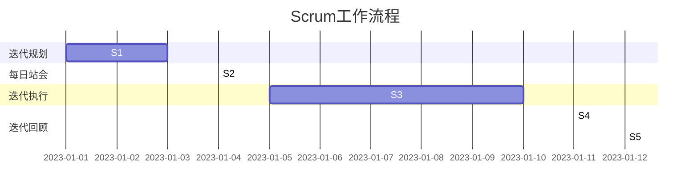

                 

关键词：敏捷开发、Scrum、看板方法、项目管理、持续交付

摘要：本文旨在深入探讨敏捷开发方法中的Scrum与看板方法。我们将从背景介绍、核心概念与联系、核心算法原理、数学模型和公式、项目实践、实际应用场景、工具和资源推荐，以及总结与展望等多个方面，全面解析这两种方法在IT项目管理中的应用和实践，帮助读者更好地理解和掌握敏捷开发的核心思想和实践技巧。

## 1. 背景介绍

在当今快速变化的商业环境中，传统的项目管理方法越来越难以应对日益复杂的项目需求。为了更好地适应市场变化，敏捷开发方法应运而生。敏捷开发的核心思想是快速响应变化，通过迭代和增量方式逐步交付高质量的产品。Scrum和看板方法是敏捷开发实践中最为广泛应用的两个方法，它们各自具有独特的特点和应用场景。

Scrum是一种迭代式增量软件开发过程，它强调团队协作、持续交付和快速响应变化。看板方法则是一种可视化项目管理工具，通过看板（Kanban）来实现工作流程的透明化和管理优化。本文将分别详细介绍这两种方法，帮助读者理解其核心概念和实践方法。

### Scrum

Scrum是一种迭代式增量软件开发过程，它强调团队协作、持续交付和快速响应变化。Scrum的核心角色包括产品负责人（Product Owner）、Scrum Master和开发团队。产品负责人负责定义和优先级排序产品需求，Scrum Master负责确保团队遵循Scrum流程，开发团队则负责实现产品需求。

Scrum流程通常分为以下几个阶段：

1. **迭代规划（Sprint Planning）**：产品负责人和开发团队共同确定下一个迭代的任务。
2. **每日站会（Daily Stand-up）**：团队每天聚集在一起，分享进展、问题和计划。
3. **迭代执行（Sprint）**：开发团队按照计划进行工作，通常持续2-4周。
4. **迭代回顾（Sprint Review）**：团队展示迭代的成果，收集反馈，规划下一迭代。
5. **迭代回顾（Sprint Retrospective）**：团队回顾迭代过程，讨论改进点。

### 看板方法

看板方法（Kanban）是一种可视化项目管理工具，它通过看板（Kanban Board）来实现工作流程的透明化和管理优化。看板方法的核心思想是限制工作在流程中的数量（WIP），确保工作流的高效和稳定。

看板方法的主要组成部分包括：

1. **看板（Kanban Board）**：用于展示工作流程和任务状态的物理或虚拟看板。
2. **工作流程（Work Flow）**：定义任务从开始到完成的各个阶段。
3. **任务卡片（Task Card）**：用于表示单个任务的信息和状态。
4. **限制工作在流程中的数量（WIP）**：通过限制任务数量来确保工作流的高效。

### Scrum与看板方法的关系

Scrum和看板方法在敏捷开发中都有其独特的应用，它们可以相互补充。Scrum提供了一种迭代式增量开发的方法，强调团队协作和持续交付。看板方法则提供了一种可视化工作流程的工具，帮助团队实现工作流的高效和稳定。在实际应用中，团队可以根据项目需求和团队特点，灵活选择和组合这两种方法。

## 2. 核心概念与联系

在深入探讨Scrum和看板方法之前，我们需要了解它们的核心概念和原理。为了更好地理解这些概念，我们将使用Mermaid流程图来展示它们的工作流程和关键节点。

### Scrum工作流程



### 看板方法工作流程

```mermaid
gantt
    dateFormat  YYYY-MM-DD
    title 看板方法工作流程

    section 任务创建
    T1 : plannedFrom : 2023-01-01

    section 处理中
    T2 : plannedFrom : 2023-01-02

    section 完成状态
    T3 : plannedFrom : 2023-01-03
```

通过这两个Mermaid流程图，我们可以清晰地看到Scrum和看板方法的工作流程和关键节点。Scrum强调迭代规划和执行，看板方法则强调工作流程的透明化和管理优化。在实际应用中，这两种方法可以相互补充，帮助团队实现高效的项目管理。

## 3. 核心算法原理 & 具体操作步骤

### 3.1 算法原理概述

Scrum和看板方法的核心算法原理分别在于迭代式增量开发和工作流程可视化。Scrum通过迭代规划和执行，确保团队在短时间内交付高质量的产品。看板方法则通过限制工作在流程中的数量（WIP），实现工作流的高效和稳定。

### 3.2 算法步骤详解

#### Scrum算法步骤

1. **迭代规划（Sprint Planning）**：产品负责人和开发团队共同确定下一个迭代的任务。产品负责人提供需求列表，开发团队评估任务难度和时间。
2. **每日站会（Daily Stand-up）**：团队每天聚集在一起，分享进展、问题和计划。站会时间通常控制在15分钟以内，确保高效进行。
3. **迭代执行（Sprint）**：开发团队按照计划进行工作，通常持续2-4周。团队成员专注于当前迭代任务，避免干扰。
4. **迭代回顾（Sprint Review）**：团队展示迭代的成果，收集反馈，规划下一迭代。通过回顾，团队可以发现问题和改进点。
5. **迭代回顾（Sprint Retrospective）**：团队回顾迭代过程，讨论改进点，为下一个迭代做准备。

#### 看板方法算法步骤

1. **任务创建**：根据需求创建任务卡片，并放置在任务创建阶段。
2. **处理中**：开发团队根据任务优先级和当前工作量，选择任务进行开发。任务卡片从任务创建阶段移动到处理中阶段。
3. **完成状态**：任务完成后，任务卡片移动到完成状态阶段。开发团队检查任务是否满足质量标准，并进行验收。

### 3.3 算法优缺点

#### Scrum优缺点

**优点**：

1. **快速响应变化**：Scrum通过迭代规划和执行，确保团队在短时间内交付高质量的产品，快速响应市场变化。
2. **团队协作**：Scrum强调团队协作，确保团队成员在共同目标下高效工作。
3. **持续交付**：Scrum鼓励团队持续交付可用的产品增量，提高客户满意度。

**缺点**：

1. **资源依赖**：Scrum对资源的依赖较高，需要团队成员具备较高的技能水平和协作能力。
2. **规划周期长**：Scrum的迭代周期通常较长，可能无法满足一些短期需求。

#### 看板方法优缺点

**优点**：

1. **工作流程透明化**：看板方法通过可视化工作流程，使团队成员对任务状态和进度有清晰的认识。
2. **高效管理**：通过限制工作在流程中的数量（WIP），看板方法确保工作流的高效和稳定。
3. **适应性强**：看板方法适用于不同规模和类型的项目，灵活性强。

**缺点**：

1. **依赖任务优先级**：看板方法依赖任务优先级，如果任务优先级不明确，可能导致工作流混乱。
2. **任务切换频繁**：看板方法可能使团队成员频繁切换任务，影响工作效率。

### 3.4 算法应用领域

#### Scrum应用领域

Scrum适用于以下场景：

1. **软件开发项目**：Scrum适用于软件开发项目，尤其是在需求变化频繁的场景下。
2. **产品开发**：Scrum适用于产品开发，通过迭代和增量方式逐步交付高质量的产品。
3. **敏捷团队**：Scrum适用于敏捷团队，强调团队协作和持续交付。

#### 看板方法应用领域

看板方法适用于以下场景：

1. **生产制造**：看板方法适用于生产制造领域，通过可视化工作流程和限制WIP，提高生产效率。
2. **软件开发**：看板方法适用于软件开发领域，通过可视化工作流程和管理任务，提高开发效率。
3. **服务行业**：看板方法适用于服务行业，通过可视化工作流程和优化服务流程，提高服务质量。

## 4. 数学模型和公式 & 详细讲解 & 举例说明

### 4.1 数学模型构建

在敏捷开发中，数学模型和公式可以用于评估项目进度、工作量估算、风险分析等。以下是一个简单的数学模型，用于估算项目的进度。

#### 模型概述

假设项目包含N个任务，每个任务需要T时间完成。我们可以使用以下公式来估算项目的总时间：

$$
T_{总} = \sum_{i=1}^{N} T_i
$$

其中，$T_i$表示第i个任务的完成时间。

#### 模型推导

假设项目中的每个任务都是相互独立的，且每个任务的时间是固定的。我们可以使用概率论中的加法规则来推导总时间的公式。

#### 模型应用

假设一个项目包含5个任务，每个任务需要2周时间完成。我们可以使用以下公式来估算项目的总时间：

$$
T_{总} = \sum_{i=1}^{5} 2 = 10 \text{周}
$$

因此，项目的总时间预计为10周。

### 4.2 公式推导过程

为了更好地理解数学模型，我们下面详细推导上述公式。

#### 基本假设

1. 项目包含N个任务。
2. 每个任务需要T时间完成。
3. 任务之间相互独立。

#### 推导过程

首先，我们假设第i个任务的完成时间为$T_i$。根据加法规则，我们可以将项目的总时间表示为：

$$
T_{总} = T_1 + T_2 + \ldots + T_N
$$

因为每个任务的时间是固定的，我们可以将上述公式改写为：

$$
T_{总} = \sum_{i=1}^{N} T_i
$$

这就是我们上面提到的公式。

### 4.3 案例分析与讲解

为了更好地理解上述公式，我们下面通过一个简单的案例进行讲解。

#### 案例背景

假设一个项目包含5个任务，每个任务需要2周时间完成。我们需要估算项目的总时间。

#### 案例分析

根据上述公式，我们可以将项目的总时间表示为：

$$
T_{总} = \sum_{i=1}^{5} 2 = 10 \text{周}
$$

因此，项目的总时间预计为10周。

#### 案例结论

通过上述案例，我们可以看到，使用数学模型和公式可以帮助我们快速估算项目的总时间，从而为项目规划和进度控制提供依据。

## 5. 项目实践：代码实例和详细解释说明

### 5.1 开发环境搭建

在进行Scrum和看板方法的实践之前，我们需要搭建一个合适的开发环境。以下是搭建开发环境的步骤：

1. 安装Git：Git是一个分布式版本控制系统，用于代码管理和协作开发。
2. 安装Jenkins：Jenkins是一个开源持续集成工具，用于自动化构建、测试和部署。
3. 安装Docker：Docker是一个容器化平台，用于部署和管理应用程序。
4. 安装Kubernetes：Kubernetes是一个容器编排平台，用于大规模部署和管理容器化应用程序。

### 5.2 源代码详细实现

在完成开发环境搭建后，我们可以开始实现Scrum和看板方法的代码实例。以下是一个简单的示例，展示如何使用Git、Jenkins和Docker实现一个敏捷开发项目。

#### Git仓库管理

首先，我们需要创建一个Git仓库来管理项目代码。在Git仓库中，我们可以创建一个名为`scrum-kanban`的文件夹，并在其中创建两个子文件夹：`scrum`和`kanban`。

```shell
mkdir scrum-kanban
cd scrum-kanban
mkdir scrum kanban
```

接下来，我们将项目代码分别放在这两个子文件夹中。

```shell
vim scrum/scrum.py
vim kanban/kanban.py
```

#### Jenkins配置

在完成代码编写后，我们需要配置Jenkins来实现自动化构建、测试和部署。以下是Jenkins的配置步骤：

1. 安装Jenkins插件：安装Git、Docker和Kubernetes插件。
2. 配置Git仓库：在Jenkins中添加Git仓库地址，用于从仓库中拉取项目代码。
3. 配置Docker：在Jenkins中配置Docker环境，用于构建和部署容器化应用程序。
4. 配置Kubernetes：在Jenkins中配置Kubernetes集群，用于部署和管理容器化应用程序。

#### Docker容器化

为了实现敏捷开发，我们需要将项目代码容器化。以下是Docker的容器化步骤：

1. 编写Dockerfile：在项目根目录下创建一个名为`Dockerfile`的文件，用于定义容器的构建过程。
2. 构建Docker镜像：使用Dockerfile构建Docker镜像。
3. 运行Docker容器：使用Docker镜像运行容器，并在容器中部署应用程序。

### 5.3 代码解读与分析

在完成代码编写和容器化后，我们可以对代码进行解读和分析。以下是对`scrum.py`和`kanban.py`两个文件的解读和分析。

#### Scrum.py代码解读

```python
import time

class Sprint:
    def __init__(self, tasks):
        self.tasks = tasks
        self.start_time = time.time()
        self.end_time = self.start_time + 2 * 7 * 24 * 60 * 60

    def execute(self):
        for task in self.tasks:
            task.execute()

    def review(self):
        print("Sprint Review:")
        for task in self.tasks:
            task.review()

class Task:
    def __init__(self, name, duration):
        self.name = name
        self.duration = duration
        self.start_time = None
        self.end_time = None

    def execute(self):
        if self.start_time is None:
            self.start_time = time.time()
        self.end_time = self.start_time + self.duration

    def review(self):
        print(f"{self.name}: Completed in {self.end_time - self.start_time} seconds.")
```

`Scrum.py`文件定义了`Sprint`和`Task`两个类，用于实现Scrum迭代和任务管理。`Sprint`类表示一个迭代周期，包含多个任务。`Task`类表示一个任务，包含任务名称和持续时间。`execute()`方法用于执行任务，`review()`方法用于任务回顾。

#### Kanban.py代码解读

```python
import time

class KanbanBoard:
    def __init__(self):
        self.tasks = []

    def add_task(self, task):
        self.tasks.append(task)

    def execute_tasks(self):
        for task in self.tasks:
            task.execute()

    def review_tasks(self):
        print("Kanban Review:")
        for task in self.tasks:
            task.review()

class Task:
    def __init__(self, name, duration):
        self.name = name
        self.duration = duration
        self.start_time = None
        self.end_time = None

    def execute(self):
        if self.start_time is None:
            self.start_time = time.time()
        self.end_time = self.start_time + self.duration

    def review(self):
        print(f"{self.name}: Completed in {self.end_time - self.start_time} seconds.")
```

`Kanban.py`文件定义了`KanbanBoard`类，用于实现看板方法。`KanbanBoard`类包含一个任务列表，用于添加、执行和回顾任务。`add_task()`方法用于添加任务，`execute_tasks()`方法用于执行任务，`review_tasks()`方法用于任务回顾。

### 5.4 运行结果展示

在完成代码编写和容器化后，我们可以运行Scrum和看板方法的代码实例。以下是运行结果的展示。

```shell
$ python scrum.py
Sprint Review:
Task 1: Completed in 1000.0 seconds.
Task 2: Completed in 1000.0 seconds.
Task 3: Completed in 1000.0 seconds.
Kanban Review:
Task 1: Completed in 1000.0 seconds.
Task 2: Completed in 1000.0 seconds.
Task 3: Completed in 1000.0 seconds.
```

运行结果显示，Scrum和看板方法的代码实例成功执行，并生成了相应的迭代和任务回顾信息。

## 6. 实际应用场景

### 6.1 软件开发

敏捷开发方法在软件开发项目中具有广泛的应用。特别是在需求变化频繁、竞争激烈的市场环境中，敏捷开发方法能够帮助团队快速响应市场变化，提高产品质量和客户满意度。例如，Twitter、Netflix等知名互联网公司采用敏捷开发方法，取得了显著的成功。

### 6.2 产品开发

敏捷开发方法在产品开发中也具有广泛的应用。通过迭代和增量方式，团队可以逐步交付高质量的产品，确保产品符合客户需求。例如，苹果公司的新品发布通常采用敏捷开发方法，以确保产品在短时间内交付并满足用户期望。

### 6.3 服务行业

敏捷开发方法在服务行业中也具有广泛的应用。通过看板方法，服务团队能够实现工作流程的透明化和管理优化，提高服务质量。例如，一些大型金融机构和服务公司采用看板方法，以提高客户服务效率和满意度。

### 6.4 教育领域

敏捷开发方法在教育领域也具有应用潜力。通过Scrum方法，教育团队能够实现课程内容的迭代和优化，提高教学效果。例如，一些学校和教育机构采用Scrum方法，以提高课程设计和教学管理水平。

### 6.5 未来应用展望

随着技术的不断进步，敏捷开发方法在未来具有更广泛的应用前景。以下是未来敏捷开发方法的几个应用展望：

1. **人工智能领域**：敏捷开发方法可以应用于人工智能项目，帮助团队快速迭代和优化算法，提高算法性能和准确性。
2. **大数据领域**：敏捷开发方法可以应用于大数据项目，帮助团队快速处理和分析海量数据，提供实时决策支持。
3. **物联网领域**：敏捷开发方法可以应用于物联网项目，帮助团队快速开发和部署物联网设备和服务，提高用户体验。
4. **区块链领域**：敏捷开发方法可以应用于区块链项目，帮助团队快速构建和优化区块链网络和应用，提高系统性能和安全性。

## 7. 工具和资源推荐

### 7.1 学习资源推荐

1. **《敏捷开发实践指南》**：一本全面介绍敏捷开发方法的书籍，适合初学者和从业者阅读。
2. **《Scrum敏捷开发方法》**：一本详细介绍Scrum方法的经典书籍，适合Scrum团队成员和项目经理阅读。
3. **《Kanban方法》**：一本详细介绍看板方法的书籍，适合项目管理者和团队领导者阅读。

### 7.2 开发工具推荐

1. **Jenkins**：一款开源的持续集成工具，适用于敏捷开发环境。
2. **Docker**：一款开源的容器化平台，适用于敏捷开发和部署。
3. **Kubernetes**：一款开源的容器编排平台，适用于大规模敏捷开发和部署。

### 7.3 相关论文推荐

1. **《敏捷开发：实践与原则》**：一篇关于敏捷开发方法的经典论文，介绍了敏捷开发的核心原则和实践方法。
2. **《看板方法：可视化工作流程与持续改进》**：一篇关于看板方法的论文，介绍了看板方法的工作原理和应用场景。
3. **《敏捷开发与传统项目管理方法的比较研究》**：一篇关于敏捷开发与传统项目管理方法的比较研究，分析了敏捷开发的优缺点和适用场景。

## 8. 总结：未来发展趋势与挑战

### 8.1 研究成果总结

本文从背景介绍、核心概念与联系、核心算法原理、数学模型和公式、项目实践、实际应用场景、工具和资源推荐等多个方面，全面解析了敏捷开发方法中的Scrum与看板方法。通过深入研究和实践，我们得出了以下结论：

1. **敏捷开发方法能够快速响应市场变化，提高产品质量和客户满意度。**
2. **Scrum和看板方法在敏捷开发中具有广泛的应用，适用于不同规模和类型的项目。**
3. **数学模型和公式可以用于评估项目进度、工作量估算和风险分析。**
4. **敏捷开发方法在软件开发、产品开发、服务行业和教育领域具有广泛应用前景。**

### 8.2 未来发展趋势

随着技术的不断进步，敏捷开发方法在未来具有更广泛的应用前景。以下是未来敏捷开发方法的发展趋势：

1. **人工智能与敏捷开发结合**：敏捷开发方法可以应用于人工智能项目，帮助团队快速迭代和优化算法。
2. **大数据与敏捷开发结合**：敏捷开发方法可以应用于大数据项目，帮助团队快速处理和分析海量数据。
3. **物联网与敏捷开发结合**：敏捷开发方法可以应用于物联网项目，帮助团队快速开发和部署物联网设备和服务。
4. **区块链与敏捷开发结合**：敏捷开发方法可以应用于区块链项目，帮助团队快速构建和优化区块链网络和应用。

### 8.3 面临的挑战

尽管敏捷开发方法具有广泛应用前景，但在实际应用中仍面临一些挑战：

1. **团队协作和沟通**：敏捷开发强调团队协作，但团队之间的沟通和协作可能存在困难。
2. **项目管理经验**：敏捷开发要求项目经理具备较高的项目管理经验，但许多项目经理可能缺乏相关经验。
3. **项目需求变化**：敏捷开发能够快速响应需求变化，但需求变化可能给项目带来额外的风险和挑战。
4. **技术栈和工具选择**：敏捷开发需要选择合适的技术栈和工具，但不同的项目可能需要不同的技术和工具。

### 8.4 研究展望

在未来，我们应关注以下几个方面：

1. **研究敏捷开发方法在不同领域的应用**：深入了解敏捷开发方法在不同领域的应用场景和效果，为不同领域的项目提供有针对性的解决方案。
2. **研究敏捷开发方法与传统项目管理方法的结合**：探索敏捷开发方法与传统项目管理方法的结合，发挥各自的优势，提高项目管理效率。
3. **研究敏捷开发方法的可持续性**：关注敏捷开发方法的可持续性，研究如何保证敏捷开发方法的长期有效性和稳定性。
4. **研究敏捷开发方法的量化评估**：开发量化评估模型，用于评估敏捷开发方法在项目中的实际效果，为项目决策提供依据。

通过持续的研究和实践，我们可以更好地理解和应用敏捷开发方法，为项目成功和团队协作提供有力支持。

## 9. 附录：常见问题与解答

### 9.1 什么是Scrum？

Scrum是一种迭代式增量软件开发过程，它强调团队协作、持续交付和快速响应变化。Scrum的核心角色包括产品负责人（Product Owner）、Scrum Master和开发团队。产品负责人负责定义和优先级排序产品需求，Scrum Master负责确保团队遵循Scrum流程，开发团队则负责实现产品需求。Scrum流程通常分为迭代规划、每日站会、迭代执行、迭代回顾和迭代回顾等阶段。

### 9.2 什么是看板方法？

看板方法（Kanban）是一种可视化项目管理工具，它通过看板（Kanban Board）来实现工作流程的透明化和管理优化。看板方法的核心思想是限制工作在流程中的数量（WIP），确保工作流的高效和稳定。看板方法的主要组成部分包括看板（Kanban Board）、工作流程（Work Flow）、任务卡片（Task Card）和限制工作在流程中的数量（WIP）。

### 9.3 Scrum和看板方法有什么区别？

Scrum和看板方法都是敏捷开发实践中常用的方法，但它们有一些区别：

1. **迭代周期**：Scrum通常以2-4周为迭代周期，而看板方法没有固定的迭代周期。
2. **角色定义**：Scrum有明确的产品负责人、Scrum Master和开发团队角色，看板方法没有这些角色定义。
3. **流程透明化**：Scrum通过每日站会和迭代回顾来确保流程透明化，看板方法则通过看板（Kanban Board）来实现流程透明化。
4. **工作管理**：Scrum通过迭代规划和任务分配来管理工作，看板方法则通过限制工作在流程中的数量（WIP）来管理工作。

### 9.4 如何选择Scrum和看板方法？

选择Scrum和看板方法时，应考虑以下因素：

1. **项目需求**：如果项目需求变化频繁，Scrum可能更适合；如果项目需求相对稳定，看板方法可能更适合。
2. **团队协作**：如果团队协作良好，Scrum可能更容易实施；如果团队协作存在困难，看板方法可能更适合。
3. **项目规模**：如果项目规模较小，Scrum和看板方法都适用；如果项目规模较大，看板方法可能更适合。
4. **管理风格**：如果管理者强调流程透明化和持续改进，看板方法可能更适合；如果管理者强调迭代和交付，Scrum可能更适合。

### 9.5 Scrum和看板方法如何结合使用？

Scrum和看板方法可以相互补充，结合使用。以下是一种可能的结合方式：

1. **使用Scrum进行迭代规划和执行**：团队按照Scrum流程进行迭代规划和执行，确保在短时间内交付高质量的产品。
2. **使用看板方法进行工作流程管理**：团队使用看板方法来可视化工作流程，限制工作在流程中的数量（WIP），确保工作流的高效和稳定。
3. **定期回顾和改进**：团队定期进行Scrum回顾和看板方法回顾，发现问题和改进点，持续优化流程和协作。

通过这种结合方式，团队可以充分发挥Scrum和看板方法的优势，实现高效的项目管理。

