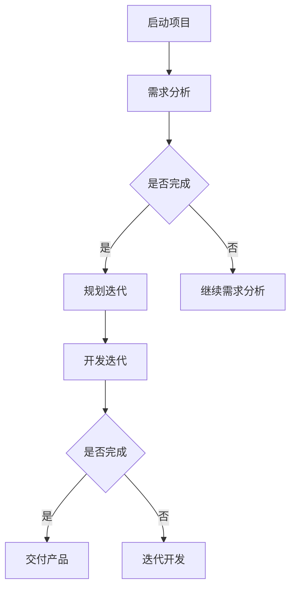

                 

**关键词**：敏捷管理，敏捷开发，快速迭代，市场适应性，团队协作，项目管理

**摘要**：在当今快速变化的市场环境中，敏捷管理作为一种灵活、高效的项目管理方法，正逐渐成为企业成功的关键。本文将从敏捷管理的背景、核心概念、算法原理、数学模型、项目实践以及未来展望等方面，全面探讨敏捷管理在IT领域的应用和重要性。

## 1. 背景介绍

随着互联网的快速发展，市场的变化越来越快，客户需求也在不断演变。传统的项目管理方法往往难以适应这种变化，导致项目延期、预算超支等问题。为了应对这种挑战，敏捷管理应运而生。敏捷管理强调团队协作、快速迭代和客户反馈，旨在通过不断调整和优化，实现项目的高效交付。

## 2. 核心概念与联系

### 2.1 敏捷管理原理

敏捷管理基于一系列核心原则，包括：
- **用户故事**：以用户的需求为中心，通过简洁的描述来定义需求。
- **迭代开发**：将项目划分为多个短周期（通常为2-4周）的迭代，每次迭代都提供可工作的产品。
- **持续集成**：通过自动化测试和持续集成，确保代码的质量和稳定性。
- **团队协作**：强调团队成员之间的沟通和协作，促进知识的共享。

### 2.2 Mermaid 流程图



## 3. 核心算法原理 & 具体操作步骤

### 3.1 算法原理概述

敏捷管理中的核心算法主要包括：
- **用户故事地图**：通过可视化工具，将用户故事组织成一个整体，以便于团队理解和优先级排序。
- **迭代计划**：根据用户故事地图，规划每个迭代的目标和任务。
- **Scrum会议**：包括每日站会、迭代评审会和迭代回顾会，用于监控项目进度和团队协作。

### 3.2 算法步骤详解

1. **启动项目**：确定项目目标、范围和资源。
2. **需求分析**：与客户沟通，收集用户需求。
3. **规划迭代**：根据需求，制定迭代计划和用户故事地图。
4. **开发迭代**：执行迭代计划，进行代码开发和测试。
5. **交付产品**：完成迭代后，交付可工作的产品。
6. **迭代回顾**：总结迭代过程中的经验和问题，为下一次迭代做准备。

### 3.3 算法优缺点

**优点**：
- **快速响应变化**：通过迭代和用户反馈，项目能够快速适应市场变化。
- **提高团队协作**：强调团队协作和知识共享，提高工作效率。
- **高质量交付**：持续集成和自动化测试，确保代码质量和产品稳定性。

**缺点**：
- **对团队要求高**：需要团队成员具备良好的沟通能力和协作精神。
- **管理复杂度增加**：敏捷管理需要更加细致的管理和监控。

### 3.4 算法应用领域

敏捷管理广泛应用于软件开发、产品开发和IT项目管理等领域，特别适合那些需求变化快、不确定因素多的项目。

## 4. 数学模型和公式 & 详细讲解 & 举例说明

### 4.1 数学模型构建

敏捷管理中的关键数学模型包括：
- **工作量估算**：根据历史数据和团队经验，估算每个迭代的工作量。
- **风险评估**：通过定量和定性方法，评估项目的风险。

### 4.2 公式推导过程

假设每个迭代的工作量为\(W\)，项目总工作量为\(T\)，则：
\[ \text{工作量估算} = \frac{T}{N} \]
其中，\(N\)为迭代次数。

### 4.3 案例分析与讲解

假设一个项目总工作量为1000人天，计划分为4个迭代完成，则每个迭代的工作量估算为：
\[ \text{工作量估算} = \frac{1000}{4} = 250 \text{人天} \]

## 5. 项目实践：代码实例和详细解释说明

### 5.1 开发环境搭建

为了演示敏捷管理，我们将使用一个简单的Web应用项目，使用Python和Flask框架进行开发。

### 5.2 源代码详细实现

```python
from flask import Flask, render_template

app = Flask(__name__)

@app.route('/')
def home():
    return render_template('home.html')

if __name__ == '__main__':
    app.run()
```

### 5.3 代码解读与分析

这段代码是一个简单的Flask Web应用，实现了主页的渲染。

### 5.4 运行结果展示

通过运行这段代码，我们可以看到项目成功启动，并可以在浏览器中访问主页。

## 6. 实际应用场景

敏捷管理在IT领域有着广泛的应用，如软件开发、网站开发、移动应用开发等。在实际项目中，敏捷管理可以显著提高项目的交付质量和团队协作效率。

## 7. 工具和资源推荐

### 7.1 学习资源推荐

- 《敏捷开发实践指南》
- 《敏捷项目管理》

### 7.2 开发工具推荐

- Jira
- Trello
- GitLab

### 7.3 相关论文推荐

- "Agile Project Management: Creating Competitive Advantage"
- "Scrum: The Art of Doing Twice the Work in Half the Time"

## 8. 总结：未来发展趋势与挑战

### 8.1 研究成果总结

敏捷管理在近年来取得了显著的研究成果，被广泛应用于各个领域。

### 8.2 未来发展趋势

随着市场环境的变化，敏捷管理将继续发展，更加注重人工智能和自动化工具的应用。

### 8.3 面临的挑战

敏捷管理在实施过程中，需要面对团队协作、管理复杂度等挑战。

### 8.4 研究展望

未来研究将重点关注敏捷管理在复杂项目中的应用和优化。

## 9. 附录：常见问题与解答

### 问题 1：敏捷管理与传统项目管理有什么区别？

敏捷管理更注重团队协作和快速迭代，而传统项目管理更注重规划和控制。

### 问题 2：敏捷管理适用于所有项目吗？

不是的，敏捷管理更适合那些需求变化快、不确定因素多的项目。

---

**作者：禅与计算机程序设计艺术 / Zen and the Art of Computer Programming**

