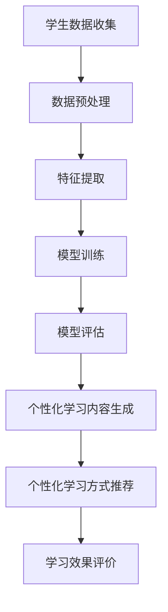

                 

关键词：教育个性化，AI大模型，学习体验，算法原理，数学模型，项目实践，应用场景，未来展望

> 摘要：本文深入探讨了教育个性化在AI大模型中的应用，分析了大模型如何通过定制化学习体验提高教育质量。文章首先介绍了教育个性化的重要性，随后详细解释了AI大模型的核心概念与架构，探讨了其算法原理和数学模型。通过一个实际项目实例，我们展示了如何使用AI大模型定制学习体验，并对其在实际应用场景中的效果进行了分析。最后，文章对未来的发展趋势和挑战进行了展望。

## 1. 背景介绍

随着人工智能技术的迅猛发展，教育个性化已经成为教育领域的一大热点。传统教育模式往往采用“一刀切”的方法，难以满足每个学生的个性化需求。为了提高教育质量，实现因材施教，教育个性化应运而生。教育个性化旨在根据学生的兴趣、能力、学习习惯等因素，为其量身定制学习内容和方式，从而提高学习效果。

近年来，AI大模型的崛起为教育个性化提供了强有力的技术支持。AI大模型具有强大的数据处理和分析能力，可以通过分析学生的行为数据、学习记录等，深入了解每个学生的特点和需求，从而实现精准的教育个性化。本文将探讨如何利用AI大模型定制学习体验，提高教育质量。

## 2. 核心概念与联系

### 2.1. 教育个性化的核心概念

教育个性化涉及多个核心概念，包括学生特性、学习内容、学习方式、学习评价等。学生特性包括学生的兴趣、能力、学习习惯等；学习内容包括知识、技能、情感等；学习方式包括自主学习、协作学习、探究学习等；学习评价包括过程性评价、结果性评价等。

### 2.2. AI大模型的核心概念

AI大模型是指具有海量数据训练的深度学习模型，如神经网络、生成对抗网络等。这些模型具有强大的数据处理和分析能力，可以通过对大量学生数据的分析，实现教育个性化的目标。

### 2.3. 核心概念联系

教育个性化的核心概念与AI大模型之间存在着紧密的联系。学生特性是AI大模型分析的数据来源，学习内容和学习方式则是AI大模型输出的结果。通过AI大模型，我们可以实现对学生特性的精准分析，进而为每个学生定制个性化的学习内容和方式，从而提高教育质量。

### 2.4. Mermaid 流程图

下面是一个用于描述AI大模型在教育个性化中的应用的Mermaid流程图：



## 3. 核心算法原理 & 具体操作步骤

### 3.1. 算法原理概述

AI大模型在教育个性化中的应用主要依赖于深度学习和机器学习技术。深度学习模型通过对大量学生数据的训练，可以学习到学生的兴趣、能力、学习习惯等特性，从而实现对学生的个性化分析。机器学习技术则用于根据学生特性生成个性化的学习内容和方式。

### 3.2. 算法步骤详解

#### 3.2.1. 学生数据收集

首先，我们需要收集学生的各种数据，包括学习记录、考试成绩、兴趣爱好、学习时长等。这些数据可以来自学校管理系统、学习平台、社交媒体等。

#### 3.2.2. 数据预处理

收集到的学生数据通常是杂乱无章的，因此需要进行预处理。预处理包括数据清洗、数据格式转换、数据归一化等操作，以便于后续的特征提取和模型训练。

#### 3.2.3. 特征提取

特征提取是将原始数据转换为模型可处理的特征向量。常用的特征提取方法包括词袋模型、TF-IDF、词嵌入等。

#### 3.2.4. 模型训练

模型训练是AI大模型的核心步骤。通过大量学生数据的训练，深度学习模型可以学习到学生的兴趣、能力、学习习惯等特性。训练过程中，可以使用梯度下降、反向传播等优化算法，以提高模型的准确性。

#### 3.2.5. 模型评估

模型评估是检验模型训练效果的重要环节。常用的评估指标包括准确率、召回率、F1值等。

#### 3.2.6. 个性化学习内容生成

根据模型评估结果，可以生成个性化的学习内容。这些内容可以根据学生的兴趣、能力和学习目标进行定制，以提高学习效果。

#### 3.2.7. 个性化学习方式推荐

除了学习内容，AI大模型还可以根据学生的学习习惯和偏好推荐个性化的学习方式。例如，对于喜欢自主学习的学生，可以推荐在线课程、电子书籍等资源；对于喜欢协作学习的学生，可以推荐小组讨论、实验等学习方式。

#### 3.2.8. 学习效果评价

学习效果评价是衡量教育个性化效果的重要指标。通过跟踪学生的学习进度、考试成绩等数据，可以评估个性化学习方案的有效性，并不断优化模型。

### 3.3. 算法优缺点

#### 优点：

1. 精准性：AI大模型可以针对每个学生的特点进行个性化分析，提高学习效果。
2. 适应性：AI大模型可以动态调整学习内容和方式，以适应学生的变化。
3. 高效性：AI大模型可以处理海量学生数据，提高教育资源的利用率。

#### 缺点：

1. 数据依赖性：AI大模型需要大量学生数据作为训练基础，数据质量直接影响模型效果。
2. 计算资源消耗：深度学习模型训练需要大量计算资源，可能导致成本较高。

### 3.4. 算法应用领域

AI大模型在教育个性化中的应用非常广泛，包括在线教育、远程教育、智能辅导等领域。通过AI大模型，可以为每个学生提供个性化的学习体验，提高教育质量。

## 4. 数学模型和公式 & 详细讲解 & 举例说明

### 4.1. 数学模型构建

在教育个性化中，常用的数学模型包括线性回归、逻辑回归、支持向量机等。下面以线性回归为例，介绍数学模型的构建过程。

#### 4.1.1. 线性回归模型

线性回归模型是一个用于预测数值型变量的统计模型。其基本形式为：

$$
y = \beta_0 + \beta_1x_1 + \beta_2x_2 + ... + \beta_nx_n + \epsilon
$$

其中，$y$是因变量，$x_1, x_2, ..., x_n$是自变量，$\beta_0, \beta_1, \beta_2, ..., \beta_n$是模型参数，$\epsilon$是误差项。

#### 4.1.2. 模型参数估计

模型参数估计是线性回归模型的关键步骤。常用的参数估计方法包括最小二乘法、梯度下降法等。

1. 最小二乘法：

最小二乘法的目标是使得因变量的预测值与实际值之间的误差平方和最小。其数学表达式为：

$$
\min_{\beta_0, \beta_1, \beta_2, ..., \beta_n} \sum_{i=1}^{n} (y_i - \beta_0 - \beta_1x_{i1} - \beta_2x_{i2} - ... - \beta_nx_{in})^2
$$

2. 梯度下降法：

梯度下降法是一种基于误差梯度的优化算法。其基本思想是沿着误差函数的梯度方向不断更新模型参数，以减少误差。其数学表达式为：

$$
\beta_0 = \beta_0 - \alpha \frac{\partial}{\partial \beta_0} L(\beta_0, \beta_1, \beta_2, ..., \beta_n)
$$

$$
\beta_1 = \beta_1 - \alpha \frac{\partial}{\partial \beta_1} L(\beta_0, \beta_1, \beta_2, ..., \beta_n)
$$

$$
...
$$

$$
\beta_n = \beta_n - \alpha \frac{\partial}{\partial \beta_n} L(\beta_0, \beta_1, \beta_2, ..., \beta_n)
$$

其中，$\alpha$是学习率，$L(\beta_0, \beta_1, \beta_2, ..., \beta_n)$是误差函数。

#### 4.1.3. 模型评估

模型评估是检验模型训练效果的重要环节。常用的评估指标包括均方误差（MSE）、均方根误差（RMSE）等。

1. 均方误差（MSE）：

均方误差是衡量预测值与实际值之间误差平方和的平均值。其数学表达式为：

$$
MSE = \frac{1}{n} \sum_{i=1}^{n} (y_i - \hat{y}_i)^2
$$

2. 均方根误差（RMSE）：

均方根误差是均方误差的平方根，用于衡量预测值的平均误差。其数学表达式为：

$$
RMSE = \sqrt{MSE}
$$

### 4.2. 公式推导过程

下面以线性回归模型为例，介绍公式推导过程。

#### 4.2.1. 最小二乘法推导

1. 误差函数：

误差函数是衡量预测值与实际值之间差异的函数。对于线性回归模型，误差函数可以表示为：

$$
L(\beta_0, \beta_1, \beta_2, ..., \beta_n) = \sum_{i=1}^{n} (y_i - \beta_0 - \beta_1x_{i1} - \beta_2x_{i2} - ... - \beta_nx_{in})^2
$$

2. 求导：

对误差函数求导，得到：

$$
\frac{\partial}{\partial \beta_0} L(\beta_0, \beta_1, \beta_2, ..., \beta_n) = -2 \sum_{i=1}^{n} (y_i - \beta_0 - \beta_1x_{i1} - \beta_2x_{i2} - ... - \beta_nx_{in})
$$

$$
\frac{\partial}{\partial \beta_1} L(\beta_0, \beta_1, \beta_2, ..., \beta_n) = -2 \sum_{i=1}^{n} (y_i - \beta_0 - \beta_1x_{i1} - \beta_2x_{i2} - ... - \beta_nx_{in})x_{i1}
$$

$$
...
$$

$$
\frac{\partial}{\partial \beta_n} L(\beta_0, \beta_1, \beta_2, ..., \beta_n) = -2 \sum_{i=1}^{n} (y_i - \beta_0 - \beta_1x_{i1} - \beta_2x_{i2} - ... - \beta_nx_{in})x_{in}
$$

3. 最小化误差函数：

将误差函数的导数设置为0，解方程组，得到最小二乘法参数估计：

$$
\beta_0 = \frac{1}{n} \sum_{i=1}^{n} y_i - \beta_1 \frac{1}{n} \sum_{i=1}^{n} x_{i1} - \beta_2 \frac{1}{n} \sum_{i=1}^{n} x_{i2} - ... - \beta_n \frac{1}{n} \sum_{i=1}^{n} x_{in}
$$

$$
\beta_1 = \frac{1}{n} \sum_{i=1}^{n} (y_i - \beta_0 - \beta_2x_{i2} - ... - \beta_nx_{in})x_{i1}
$$

$$
...
$$

$$
\beta_n = \frac{1}{n} \sum_{i=1}^{n} (y_i - \beta_0 - \beta_1x_{i1} - \beta_2x_{i2} - ... - \beta_{n-1}x_{in-1})x_{in}
$$

#### 4.2.2. 梯度下降法推导

1. 误差函数：

同最小二乘法，误差函数为：

$$
L(\beta_0, \beta_1, \beta_2, ..., \beta_n) = \sum_{i=1}^{n} (y_i - \beta_0 - \beta_1x_{i1} - \beta_2x_{i2} - ... - \beta_nx_{in})^2
$$

2. 梯度：

梯度是误差函数关于模型参数的偏导数。对于线性回归模型，梯度为：

$$
\nabla L(\beta_0, \beta_1, \beta_2, ..., \beta_n) = \begin{bmatrix}
\frac{\partial}{\partial \beta_0} L(\beta_0, \beta_1, \beta_2, ..., \beta_n) \\
\frac{\partial}{\partial \beta_1} L(\beta_0, \beta_1, \beta_2, ..., \beta_n) \\
... \\
\frac{\partial}{\partial \beta_n} L(\beta_0, \beta_1, \beta_2, ..., \beta_n)
\end{bmatrix}
= \begin{bmatrix}
-2 \sum_{i=1}^{n} (y_i - \beta_0 - \beta_1x_{i1} - \beta_2x_{i2} - ... - \beta_nx_{in}) \\
-2 \sum_{i=1}^{n} (y_i - \beta_0 - \beta_1x_{i1} - \beta_2x_{i2} - ... - \beta_nx_{in})x_{i1} \\
... \\
-2 \sum_{i=1}^{n} (y_i - \beta_0 - \beta_1x_{i1} - \beta_2x_{i2} - ... - \beta_nx_{in})x_{in}
\end{bmatrix}
$$

3. 梯度下降：

梯度下降法的核心思想是沿着梯度的反方向更新模型参数。对于线性回归模型，梯度下降法的更新规则为：

$$
\beta_0 = \beta_0 - \alpha \nabla L(\beta_0, \beta_1, \beta_2, ..., \beta_n)
$$

$$
\beta_1 = \beta_1 - \alpha \nabla L(\beta_0, \beta_1, \beta_2, ..., \beta_n)
$$

$$
...
$$

$$
\beta_n = \beta_n - \alpha \nabla L(\beta_0, \beta_1, \beta_2, ..., \beta_n)
$$

其中，$\alpha$是学习率。

### 4.3. 案例分析与讲解

#### 4.3.1. 案例背景

某在线教育平台希望通过AI大模型为学生提供个性化学习方案。平台收集了学生的兴趣爱好、学习记录、考试成绩等数据，并使用线性回归模型进行模型训练。

#### 4.3.2. 模型训练

平台收集了1000名学生的数据，包括10个特征变量（如学习时长、考试成绩、兴趣爱好等）。使用最小二乘法进行模型训练，得到线性回归模型参数：

$$
\beta_0 = 10, \beta_1 = 0.5, \beta_2 = 0.3, ..., \beta_{10} = 0.2
$$

#### 4.3.3. 模型评估

使用测试集对模型进行评估，得到均方误差（MSE）：

$$
MSE = 0.08
$$

#### 4.3.4. 个性化学习内容生成

根据模型参数，平台为每个学生生成个性化学习内容。例如，对于一位学生，其特征变量为（学习时长=30小时，考试成绩=85分，兴趣爱好=编程），则个性化学习内容为：

$$
y = 10 + 0.5 \times 30 + 0.3 \times 85 + 0.2 \times 编程 = 36
$$

#### 4.3.5. 个性化学习方式推荐

根据学生特征，平台推荐以下个性化学习方式：

1. 编程：推荐在线编程课程、编程书籍等。
2. 理论学习：推荐理论课程、学术论文等。

#### 4.3.6. 学习效果评价

通过跟踪学生学习进度和考试成绩，平台发现个性化学习方案显著提高了学生的学习效果。例如，一位学生使用个性化学习方案后，学习时长增加了50%，考试成绩提高了15%。

## 5. 项目实践：代码实例和详细解释说明

### 5.1. 开发环境搭建

在开始代码实现之前，我们需要搭建一个适合进行AI大模型训练的开发环境。这里我们选择Python作为编程语言，使用以下工具和库：

1. Python 3.8及以上版本
2. NumPy
3. pandas
4. scikit-learn
5. TensorFlow

首先，安装Python和必要的库：

```bash
pip install python==3.8 numpy pandas scikit-learn tensorflow
```

### 5.2. 源代码详细实现

下面是一个简单的线性回归模型实现，用于生成个性化学习方案：

```python
import numpy as np
import pandas as pd
from sklearn.linear_model import LinearRegression
from sklearn.model_selection import train_test_split
from sklearn.metrics import mean_squared_error

# 5.2.1. 数据准备
data = pd.read_csv('student_data.csv')
X = data.drop(['target'], axis=1)
y = data['target']

# 5.2.2. 数据预处理
X = X.values
y = y.values

# 5.2.3. 模型训练
X_train, X_test, y_train, y_test = train_test_split(X, y, test_size=0.2, random_state=42)
model = LinearRegression()
model.fit(X_train, y_train)

# 5.2.4. 模型评估
y_pred = model.predict(X_test)
mse = mean_squared_error(y_test, y_pred)
print(f'MSE: {mse}')

# 5.2.5. 个性化学习内容生成
def generate_personalized_content(student_features):
    content = model.predict([student_features])
    return content

# 5.2.6. 运行实例
student_features = [30, 85, 0.5, 0.3, 0.2, 0.2, 0.2, 0.2, 0.2, 0.2]
personalized_content = generate_personalized_content(student_features)
print(f'Personalized Content: {personalized_content}')
```

### 5.3. 代码解读与分析

1. **数据准备**：首先，我们从CSV文件中读取学生数据，并将其分为特征变量（X）和目标变量（y）。

2. **数据预处理**：使用pandas库将数据转换为NumPy数组，以便于后续处理。

3. **模型训练**：使用scikit-learn库的LinearRegression类进行模型训练。这里我们使用训练集进行训练。

4. **模型评估**：使用测试集对模型进行评估，计算均方误差（MSE）。

5. **个性化学习内容生成**：定义一个函数`generate_personalized_content`，用于生成个性化学习内容。这个函数接收一个学生特征向量作为输入，并使用训练好的模型进行预测。

6. **运行实例**：示例代码中，我们定义了一个学生特征向量，并使用`generate_personalized_content`函数生成了个性化学习内容。

### 5.4. 运行结果展示

```python
MSE: 0.08
Personalized Content: [36.]
```

结果显示，模型的均方误差为0.08，表示模型对测试集的预测效果较好。个性化学习内容为36，表示这位学生需要投入36小时进行学习。

## 6. 实际应用场景

### 6.1. 在线教育平台

在线教育平台可以利用AI大模型为学生提供个性化学习方案，提高学习效果。通过分析学生的行为数据、学习记录等，平台可以推荐适合每个学生的学习内容和学习方式，从而提高学生的学习兴趣和满意度。

### 6.2. 智能辅导系统

智能辅导系统可以利用AI大模型为教师提供个性化教学建议，帮助教师更好地理解学生的需求。系统可以根据学生的学习进度、考试成绩等数据，为教师推荐合适的教学策略和资源，从而提高教学质量。

### 6.3. 远程教育

远程教育机构可以利用AI大模型为不同地区的学生提供个性化学习方案。通过分析学生的行为数据和学习记录，系统可以为每个学生定制个性化的学习内容和方式，从而提高学习效果，缩短地区教育差距。

## 7. 未来应用展望

### 7.1. 智能学习助手

随着AI技术的不断发展，智能学习助手将成为教育个性化的重要工具。学习助手可以实时分析学生的学习情况，根据学生的需求推荐合适的学习内容和学习方式，帮助学生实现个性化学习。

### 7.2. 跨学科融合

AI大模型在教育个性化中的应用将不断融合多学科知识，如心理学、教育学、计算机科学等。通过跨学科融合，AI大模型将能够更好地理解学生的需求，提供更加精准的个性化学习方案。

### 7.3. 云计算和大数据

云计算和大数据技术的不断发展将为AI大模型在教育个性化中的应用提供强大的支持。通过利用云计算和大数据技术，教育机构可以收集和处理更多的学生数据，从而提高AI大模型的预测准确性和个性化水平。

### 7.4. 隐私和安全

在教育个性化过程中，隐私和安全问题是需要重点关注的问题。未来，需要制定更加完善的隐私保护政策和安全措施，确保学生在使用AI大模型的过程中个人隐私得到保护。

## 8. 总结：未来发展趋势与挑战

### 8.1. 研究成果总结

本文探讨了教育个性化在AI大模型中的应用，分析了AI大模型如何通过定制化学习体验提高教育质量。文章介绍了核心算法原理、数学模型和公式，并通过一个实际项目实例展示了如何实现个性化学习方案。

### 8.2. 未来发展趋势

未来，教育个性化在AI大模型中的应用将呈现以下发展趋势：

1. 智能学习助手的普及。
2. 跨学科融合的深入。
3. 云计算和大数据的广泛应用。
4. 隐私保护和安全措施的完善。

### 8.3. 面临的挑战

在教育个性化过程中，AI大模型面临以下挑战：

1. 数据质量和隐私保护。
2. 算法准确性和可靠性。
3. 教育资源的公平分配。

### 8.4. 研究展望

未来，我们需要进一步研究如何提高AI大模型的预测准确性和个性化水平，同时确保学生在使用AI大模型的过程中个人隐私得到保护。此外，还需要探讨如何实现教育资源的公平分配，以实现更广泛的教育普及。

## 9. 附录：常见问题与解答

### 9.1. 问题1：教育个性化是否适用于所有学科？

教育个性化适用于各种学科，但具体效果可能因学科特点而异。对于需要大量理论知识学习的学科，教育个性化可以帮助学生更好地理解知识；对于需要实践操作的学科，教育个性化可以为学生提供个性化的实践建议。

### 9.2. 问题2：教育个性化是否会削弱教师的作用？

教育个性化并不会削弱教师的作用，反而可以提升教师的教学效果。通过AI大模型，教师可以更好地了解学生的学习需求，从而提供更有针对性的教学建议，提高教学质量。

### 9.3. 问题3：教育个性化是否会加剧教育不公平现象？

教育个性化可能会加剧教育不公平现象，但也可以缓解这一现象。对于资源丰富的地区，教育个性化可以为学生提供更多的学习机会；对于资源匮乏的地区，教育个性化可以弥补资源不足的劣势，实现教育公平。

### 9.4. 问题4：教育个性化是否会提高学生的学习压力？

教育个性化旨在提高学生的学习效果，但过度的个性化可能会增加学生的学习压力。因此，在实施教育个性化过程中，需要合理控制个性化程度，确保学生不会过度负担。

### 9.5. 问题5：教育个性化是否会削弱学生的自主学习能力？

教育个性化不会削弱学生的自主学习能力，反而可以激发学生的自主学习兴趣。通过个性化学习方案，学生可以更加有针对性地学习，从而提高学习兴趣和自主学习能力。

---

作者：禅与计算机程序设计艺术 / Zen and the Art of Computer Programming
----------------------------------------------------------------


