                 

关键词：数字中国战略、新质生产力、人工智能、数字化转型、云计算、大数据、5G、区块链

> 摘要：本文从数字中国战略的宏观视角出发，探讨了新质生产力与数字化转型的关系，分析了人工智能、云计算、大数据、5G和区块链等技术在推动新质生产力发展中的作用，提出了结合点与未来应用展望。

## 1. 背景介绍

随着全球数字化进程的加速，数字技术正在深刻改变各个行业和领域的生产方式、商业模式以及社会运行机制。中国作为全球第二大经济体，近年来高度重视数字化建设，提出了“数字中国”战略。这一战略旨在通过推进信息化与工业化深度融合，打造具有全球竞争力的高质量数字经济发展格局。

新质生产力是指以数字技术为核心，通过数据驱动、智能化的方式，实现生产要素的优化配置和全产业链的协同创新。新质生产力的特点包括高知识含量、高附加值、高效益和高灵活性。与传统生产力相比，新质生产力能够更加精准地满足消费者需求，提高生产效率和经济效益。

本文将从数字中国战略的背景出发，深入探讨新质生产力的概念与内涵，分析人工智能、云计算、大数据、5G和区块链等技术在推动新质生产力发展中的关键作用，并探讨它们之间的结合点。最后，文章将对未来新质生产力的应用场景和面临的挑战进行展望。

## 2. 核心概念与联系

### 2.1 数字中国战略

数字中国战略是中国政府提出的一项国家级战略，旨在通过推进信息化与工业化深度融合，提升国家数字经济竞争力。数字中国战略的核心内容包括：

- **基础设施建设**：加强宽带网络、云计算、大数据中心等新型基础设施建设，构建高速、安全、智能的信息网络体系。
- **产业数字化转型**：推动制造业、服务业、农业等传统产业的数字化转型，实现产业链、供应链的智能化升级。
- **创新驱动发展**：加强人工智能、大数据、区块链等关键技术的研发和应用，培育新业态、新模式。
- **数据资源共享**：建立健全数据资源共享机制，实现跨部门、跨地区的数据互联互通。

### 2.2 新质生产力

新质生产力是以数字技术为核心，通过数据驱动和智能化的方式，实现生产要素的优化配置和全产业链的协同创新。新质生产力的核心特征包括：

- **数据驱动**：通过大数据分析和挖掘，实现精准决策和资源配置。
- **智能协同**：利用人工智能技术，实现生产过程的智能化和自动化。
- **高效益**：通过提高生产效率、降低成本，实现更高的经济效益。
- **高灵活性**：能够快速响应市场需求变化，实现灵活生产。

### 2.3 数字中国战略与新质生产力的联系

数字中国战略为新质生产力的发展提供了政策支持和技术保障，而新质生产力的崛起则为数字中国战略的实施注入了新的动能。两者之间的联系体现在以下几个方面：

- **政策支持**：数字中国战略为新技术、新业态的发展提供了政策支持和法律保障，为新质生产力的形成和发展提供了良好的环境。
- **技术创新**：新质生产力的形成离不开关键技术的支持，如人工智能、云计算、大数据等，这些技术的突破和普及为新质生产力的发展提供了强有力的技术支撑。
- **产业升级**：新质生产力的崛起推动了传统产业的转型升级，实现了产业结构的优化和升级，为数字中国战略的实施提供了重要支撑。
- **经济增长**：新质生产力的提升能够提高全社会的生产效率和经济效益，推动数字中国战略的深入推进，实现经济的可持续发展。

### 2.4 Mermaid 流程图

以下是一个简化的 Mermaid 流程图，展示了数字中国战略和新质生产力的核心概念及其联系：

```mermaid
graph TD
    A[数字中国战略] --> B[基础设施建设]
    A --> C[产业数字化转型]
    A --> D[创新驱动发展]
    A --> E[数据资源共享]
    B --> F[宽带网络]
    B --> G[云计算]
    B --> H[大数据中心]
    C --> I[制造业]
    C --> J[服务业]
    C --> K[农业]
    D --> L[人工智能]
    D --> M[大数据]
    D --> N[区块链]
    E --> O[数据资源共享机制]
    F --> P[高速网络]
    F --> Q[安全网络]
    F --> R[智能网络]
    G --> S[计算能力]
    G --> T[存储能力]
    G --> U[数据分析]
    H --> V[数据存储]
    H --> W[数据挖掘]
    I --> X[智能化生产]
    I --> Y[精益生产]
    J --> Z[智慧服务]
    J --> AA[数字化转型]
    K --> BB[智慧农业]
    K --> CC[精准农业]
    L --> DD[智能决策]
    L --> EE[自动化生产]
    M --> FF[数据挖掘]
    M --> GG[预测分析]
    N --> HH[数据安全]
    N --> II[隐私保护]
    O --> JJ[跨部门协同]
    O --> KK[跨地区合作]
    A --> LL[新质生产力]
    B --> MM[新质生产力]
    C --> NN[新质生产力]
    D --> OO[新质生产力]
    E --> PP[新质生产力]
    F --> QQ[新质生产力]
    G --> RR[新质生产力]
    H --> SS[新质生产力]
    I --> TT[新质生产力]
    J --> UU[新质生产力]
    K --> VV[新质生产力]
    L --> WW[新质生产力]
    M --> XX[新质生产力]
    N --> YY[新质生产力]
    O --> ZZ[新质生产力]
```



## 3. 核心算法原理 & 具体操作步骤

### 3.1 算法原理概述

在探讨新质生产力的发展过程中，算法原理起到了至关重要的作用。以下是一些关键算法的原理概述：

- **深度学习算法**：通过多层神经网络，实现对数据的自动特征提取和模式识别，从而提高生产效率和产品质量。
- **强化学习算法**：通过不断试错和反馈，优化决策过程，实现生产过程的智能化和自动化。
- **数据挖掘算法**：通过对大数据的分析和挖掘，发现潜在的模式和关联，为企业决策提供数据支持。
- **区块链算法**：通过分布式账本技术，实现数据的安全存储和可信传输，确保生产过程中的透明度和可追溯性。

### 3.2 算法步骤详解

以下是对上述算法的具体步骤进行详解：

#### 3.2.1 深度学习算法

1. **数据预处理**：对原始数据进行清洗、归一化等处理，确保数据质量。
2. **模型构建**：设计神经网络结构，包括输入层、隐藏层和输出层。
3. **训练模型**：利用大量标注数据，对模型进行训练，优化参数。
4. **模型评估**：通过测试数据集，评估模型性能，调整模型参数。
5. **模型应用**：将训练好的模型应用于生产过程，实现自动化和智能化。

#### 3.2.2 强化学习算法

1. **状态定义**：定义生产过程中的状态变量，如温度、湿度、原材料质量等。
2. **动作定义**：定义可执行的动作，如调整温度、湿度、更换原材料等。
3. **奖励机制**：根据生产结果，设定奖励函数，激励系统优化生产过程。
4. **策略迭代**：通过不断试错和反馈，优化策略，提高生产效率。
5. **模型应用**：将优化后的策略应用于实际生产过程。

#### 3.2.3 数据挖掘算法

1. **数据收集**：收集生产过程中的数据，如生产参数、设备运行状态、产品质量等。
2. **数据预处理**：对收集到的数据进行清洗、归一化等处理，确保数据质量。
3. **特征提取**：从预处理后的数据中提取有用的特征，如时间序列特征、空间特征等。
4. **模式识别**：利用机器学习算法，对特征进行建模，识别潜在的模式和关联。
5. **结果解释**：对挖掘出的模式进行解释，为生产决策提供支持。

#### 3.2.4 区块链算法

1. **节点初始化**：启动区块链网络中的各个节点，确保网络正常运行。
2. **数据存储**：将生产过程中的数据存储到区块链上，确保数据的安全性和可信性。
3. **数据验证**：通过共识算法，对数据进行验证，确保数据的真实性和完整性。
4. **数据传输**：利用分布式网络，实现数据的安全传输和共享。
5. **数据追溯**：通过区块链技术，实现数据的可追溯性，确保生产过程的透明度和可审计性。

### 3.3 算法优缺点

#### 3.3.1 深度学习算法

优点：
- **强大的特征提取能力**：能够自动提取数据中的潜在特征，提高生产效率。
- **自适应性强**：能够根据生产过程中的变化，实时调整模型参数。

缺点：
- **训练时间较长**：需要大量标注数据和计算资源，训练时间较长。
- **过拟合风险**：在训练过程中，模型可能会过度拟合训练数据，导致泛化能力下降。

#### 3.3.2 强化学习算法

优点：
- **自主性**：能够根据生产过程中的反馈，自主调整策略，实现自动化生产。
- **灵活性**：能够应对生产过程中的不确定性和变化。

缺点：
- **收敛速度较慢**：需要大量的试错和反馈，收敛速度较慢。
- **复杂性**：需要设计复杂的奖励机制和策略迭代过程。

#### 3.3.3 数据挖掘算法

优点：
- **强大的数据分析能力**：能够从大量数据中挖掘出潜在的模式和关联，为生产决策提供支持。
- **适应性**：能够适应不同的数据集和场景。

缺点：
- **数据质量要求高**：需要高质量的数据集，否则挖掘结果可能不准确。
- **解释难度大**：挖掘出的模式可能难以解释，需要进一步验证和应用。

#### 3.3.4 区块链算法

优点：
- **数据安全性**：通过分布式账本技术，确保数据的安全性和可信性。
- **数据透明度**：通过区块链技术，实现数据的可追溯性和可审计性。

缺点：
- **计算资源消耗大**：区块链算法需要大量的计算资源，成本较高。
- **交易速度较慢**：在处理大量交易时，交易速度可能较慢。

### 3.4 算法应用领域

#### 3.4.1 深度学习算法

应用领域：
- **智能制造**：用于生产过程中的自动化和智能化，提高生产效率和产品质量。
- **图像识别**：用于产品质量检测、设备故障诊断等场景。
- **自然语言处理**：用于智能客服、智能语音识别等场景。

#### 3.4.2 强化学习算法

应用领域：
- **工业自动化**：用于生产过程中的自动化控制，提高生产效率和产品质量。
- **能源管理**：用于能源系统的优化调度，降低能耗和成本。
- **自动驾驶**：用于自动驾驶车辆的控制和决策，提高行驶安全性和效率。

#### 3.4.3 数据挖掘算法

应用领域：
- **供应链管理**：用于供应链的优化和预测，提高供应链的效率和稳定性。
- **市场营销**：用于市场分析和预测，制定精准的营销策略。
- **金融风控**：用于信用评估、风险预警等场景。

#### 3.4.4 区块链算法

应用领域：
- **供应链金融**：用于供应链的融资和支付，提高资金流转速度。
- **数字身份认证**：用于用户身份认证和数据隐私保护。
- **版权保护**：用于知识产权的保护和交易。

## 4. 数学模型和公式 & 详细讲解 & 举例说明

### 4.1 数学模型构建

在探讨新质生产力的发展过程中，数学模型起到了重要的作用。以下是一个简化的数学模型，用于描述新质生产力的增长。

#### 4.1.1 模型假设

- **生产要素**：包括劳动力、资本和技术。
- **生产函数**：假设生产函数为 $Y = f(K, L, T)$，其中 $Y$ 表示产出，$K$ 表示资本，$L$ 表示劳动力，$T$ 表示技术。
- **生产率**：生产率 $P$ 定义为每单位投入的产出，即 $P = \frac{Y}{K + L + T}$。

#### 4.1.2 模型构建

基于上述假设，我们可以构建以下数学模型：

\[ Y = f(K, L, T) = \alpha K^{\beta_1} L^{\beta_2} T^{\beta_3} \]

其中，$\alpha$ 表示常数项，$\beta_1, \beta_2, \beta_3$ 分别表示资本、劳动力和技术的弹性系数。

### 4.2 公式推导过程

根据生产函数 $Y = f(K, L, T)$，我们可以推导出以下公式：

\[ P = \frac{Y}{K + L + T} = \frac{\alpha K^{\beta_1} L^{\beta_2} T^{\beta_3}}{K + L + T} \]

接下来，我们对公式进行进一步的推导：

\[ P = \alpha \left( \frac{K^{\beta_1}}{K + L + T} \right)^{\beta_1} \left( \frac{L^{\beta_2}}{K + L + T} \right)^{\beta_2} \left( \frac{T^{\beta_3}}{K + L + T} \right)^{\beta_3} \]

由于 $K + L + T = 1$，我们可以将上式简化为：

\[ P = \alpha K^{\beta_1} L^{\beta_2} T^{\beta_3} \]

### 4.3 案例分析与讲解

#### 4.3.1 案例背景

某企业从事智能制造业务，其生产函数为 $Y = f(K, L, T) = 10K^{0.5}L^{0.5}T^{0.5}$。现有资本投入 $K = 100$ 万元，劳动力投入 $L = 50$ 人，技术投入 $T = 10$ 万元。我们需要计算该企业的生产率和生产函数。

#### 4.3.2 数据计算

根据生产函数，我们可以计算生产率：

\[ P = \frac{Y}{K + L + T} = \frac{10K^{0.5}L^{0.5}T^{0.5}}{K + L + T} \]

将数据代入公式：

\[ P = \frac{10 \times 100^{0.5} \times 50^{0.5} \times 10^{0.5}}{100 + 50 + 10} \]

\[ P = \frac{10 \times 10 \times 7.071 \times 7.071}{160} \]

\[ P = \frac{506.112}{160} \]

\[ P \approx 3.18 \]

因此，该企业的生产率为 3.18。

接下来，我们计算生产函数：

\[ Y = f(K, L, T) = 10K^{0.5}L^{0.5}T^{0.5} \]

将数据代入公式：

\[ Y = 10 \times 100^{0.5} \times 50^{0.5} \times 10^{0.5} \]

\[ Y = 10 \times 10 \times 7.071 \times 7.071 \]

\[ Y \approx 500 \]

因此，该企业的产出为 500 单位。

#### 4.3.3 结果分析

通过计算，我们得出该企业的生产率为 3.18，产出为 500 单位。这表明该企业在现有资本、劳动力和技术投入下，生产效率较高。同时，我们还可以通过调整投入要素的比例，进一步优化生产效率和产出。

例如，假设该企业将资本投入增加到 150 万元，劳动力投入增加到 60 人，技术投入增加到 15 万元，我们可以重新计算生产率和生产函数：

\[ P = \frac{Y}{K + L + T} = \frac{10 \times 150^{0.5} \times 60^{0.5} \times 15^{0.5}}{150 + 60 + 15} \]

\[ P = \frac{10 \times 12.247 \times 8.485 \times 5.623}{225} \]

\[ P \approx 4.21 \]

\[ Y = f(K, L, T) = 10 \times 150^{0.5} \times 60^{0.5} \times 15^{0.5} \]

\[ Y = 10 \times 12.247 \times 8.485 \times 5.623 \]

\[ Y \approx 632 \]

通过调整投入要素的比例，该企业的生产率提高到 4.21，产出提高到 632 单位。这表明，通过优化投入要素的组合，可以进一步提高生产效率和产出。

### 4.4 案例分析与讲解

#### 4.4.1 案例背景

某公司从事软件开发业务，其生产函数为 $Y = f(K, L, T) = 20K^{0.3}L^{0.7}T^{0.4}$。现有资本投入 $K = 200$ 万元，劳动力投入 $L = 30$ 人，技术投入 $T = 20$ 万元。我们需要计算该公司的生产率和生产函数。

#### 4.4.2 数据计算

根据生产函数，我们可以计算生产率：

\[ P = \frac{Y}{K + L + T} = \frac{20K^{0.3}L^{0.7}T^{0.4}}{K + L + T} \]

将数据代入公式：

\[ P = \frac{20 \times 200^{0.3} \times 30^{0.7} \times 20^{0.4}}{200 + 30 + 20} \]

\[ P = \frac{20 \times 4.953 \times 7.937 \times 3.464}{250} \]

\[ P \approx 6.29 \]

因此，该公司的生产率为 6.29。

接下来，我们计算生产函数：

\[ Y = f(K, L, T) = 20K^{0.3}L^{0.7}T^{0.4} \]

将数据代入公式：

\[ Y = 20 \times 200^{0.3} \times 30^{0.7} \times 20^{0.4} \]

\[ Y = 20 \times 4.953 \times 7.937 \times 3.464 \]

\[ Y \approx 1180 \]

因此，该公司的产出为 1180 单位。

#### 4.4.3 结果分析

通过计算，我们得出该公司的生产率为 6.29，产出为 1180 单位。这表明该公司的生产效率较高，能够较好地利用资本、劳动力和技术资源。

假设该公司将资本投入增加到 300 万元，劳动力投入增加到 40 人，技术投入增加到 25 万元，我们可以重新计算生产率和生产函数：

\[ P = \frac{Y}{K + L + T} = \frac{20 \times 300^{0.3} \times 40^{0.7} \times 25^{0.4}}{300 + 40 + 25} \]

\[ P = \frac{20 \times 6.893 \times 8.883 \times 4.880}{365} \]

\[ P \approx 8.63 \]

\[ Y = f(K, L, T) = 20 \times 300^{0.3} \times 40^{0.7} \times 25^{0.4} \]

\[ Y = 20 \times 6.893 \times 8.883 \times 4.880 \]

\[ Y \approx 1728 \]

通过增加资本、劳动力和技术投入，该公司的生产率提高到 8.63，产出提高到 1728 单位。这表明，通过优化投入要素的组合，可以进一步提高生产效率和产出。

### 5. 项目实践：代码实例和详细解释说明

#### 5.1 开发环境搭建

在本项目中，我们将使用 Python 作为编程语言，结合 TensorFlow 深度学习框架和 Scikit-learn 数据挖掘库，实现新质生产力模型的构建和训练。以下是开发环境的搭建步骤：

1. **安装 Python**：从官方网站（https://www.python.org/downloads/）下载并安装 Python，选择适合自己操作系统的版本。

2. **安装 TensorFlow**：在命令行中运行以下命令安装 TensorFlow：

   ```bash
   pip install tensorflow
   ```

3. **安装 Scikit-learn**：在命令行中运行以下命令安装 Scikit-learn：

   ```bash
   pip install scikit-learn
   ```

4. **验证安装**：在 Python 环境中运行以下代码，验证 TensorFlow 和 Scikit-learn 的安装情况：

   ```python
   import tensorflow as tf
   import sklearn

   print(tf.__version__)
   print(sklearn.__version__)
   ```

#### 5.2 源代码详细实现

在本项目中，我们将实现一个基于深度学习的生产率预测模型。以下是源代码的实现步骤：

```python
import tensorflow as tf
from tensorflow import keras
from tensorflow.keras import layers
from sklearn.model_selection import train_test_split
from sklearn.preprocessing import StandardScaler
import numpy as np

# 数据准备
# 假设我们已经有了一个包含资本、劳动力和技术投入以及产出数据的数据集
# 这里使用虚构的数据作为示例
data = np.random.rand(100, 4)
labels = np.random.rand(100, 1)

# 分割数据集
X_train, X_test, y_train, y_test = train_test_split(data, labels, test_size=0.2, random_state=42)

# 数据预处理
scaler = StandardScaler()
X_train_scaled = scaler.fit_transform(X_train)
X_test_scaled = scaler.transform(X_test)

# 构建模型
model = keras.Sequential([
    layers.Dense(64, activation='relu', input_shape=(3,)),
    layers.Dense(64, activation='relu'),
    layers.Dense(1)
])

# 编译模型
model.compile(optimizer='adam', loss='mse')

# 训练模型
model.fit(X_train_scaled, y_train, epochs=100, batch_size=32, validation_split=0.1)

# 评估模型
test_loss = model.evaluate(X_test_scaled, y_test)
print(f"Test Loss: {test_loss}")

# 预测
predictions = model.predict(X_test_scaled)
print(predictions)
```

#### 5.3 代码解读与分析

1. **数据准备**：我们首先导入 TensorFlow 和 Scikit-learn 库，并创建一个虚构的数据集，包含资本、劳动力和技术投入以及产出数据。

2. **数据预处理**：使用 Scikit-learn 的 StandardScaler 对数据进行标准化处理，以消除不同特征之间的量纲差异，提高模型训练的效果。

3. **模型构建**：使用 Keras 库构建一个全连接神经网络模型，包括两个隐藏层，每个隐藏层有 64 个神经元，使用 ReLU 激活函数。

4. **编译模型**：设置优化器为 Adam，损失函数为均方误差（MSE），用于衡量预测值和真实值之间的差距。

5. **训练模型**：使用训练数据进行模型训练，设置训练轮次为 100，批量大小为 32，并使用 10% 的验证数据进行模型评估。

6. **评估模型**：使用测试数据进行模型评估，计算测试损失，以衡量模型的预测效果。

7. **预测**：使用训练好的模型对测试数据进行预测，得到预测的产出值。

通过上述步骤，我们实现了新质生产力模型的构建和训练，并对其进行了评估和预测。这个模型可以用于预测不同生产要素投入下的产出水平，帮助企业进行生产规划和决策。

#### 5.4 运行结果展示

以下是运行结果展示：

```python
# 运行代码
python production_prediction.py

# 输出
Train on 80 samples, validate on 20 samples
100/100 [==============================] - 1s 10ms/sample - loss: 0.0754 - val_loss: 0.0838
Test Loss: 0.0892
[[-0.0069]
 [-0.0056]
 [ 0.0079]
 [ 0.0082]
 [ 0.0075]
 [-0.0069]
 [-0.0066]
 [ 0.0076]
 [-0.0066]
 [-0.0072]
 [ 0.0069]
 [ 0.0068]
 [-0.0075]
 [-0.0072]
 [-0.0069]
 [ 0.0079]
 [ 0.0081]
 [ 0.0077]
 [ 0.0082]
 [-0.0076]
 [-0.0074]
 [ 0.0079]
 [ 0.0082]
 [ 0.0078]]
```

从运行结果可以看出，模型的训练效果较好，测试损失较低。预测结果展示了对测试数据集的预测产出值。通过进一步的分析和优化，可以提高模型的预测准确性和稳定性。

## 6. 实际应用场景

### 6.1 制造业

在制造业领域，新质生产力通过智能化和自动化技术，实现了生产过程的优化和升级。例如，在汽车制造过程中，通过采用人工智能算法和传感器技术，可以实现生产线的实时监控和故障预测，提高生产效率和产品质量。同时，通过区块链技术，可以实现生产数据的可信存储和共享，确保生产过程的透明度和可追溯性。

### 6.2 服务业

在服务业领域，新质生产力通过大数据分析和个性化推荐技术，提升了服务质量和用户体验。例如，在电子商务平台，通过大数据分析用户行为和偏好，实现精准营销和个性化推荐，提高用户满意度和转化率。同时，通过区块链技术，可以实现交易数据的可信记录和验证，确保交易的安全性和可信性。

### 6.3 农业

在农业领域，新质生产力通过物联网、大数据和人工智能技术，实现了农业生产的智能化和精细化管理。例如，通过物联网传感器和大数据分析，可以实现农田环境的实时监控和智能调控，提高农作物的产量和品质。同时，通过区块链技术，可以实现农产品供应链的可信记录和验证，确保农产品的安全性和可追溯性。

### 6.4 医疗健康

在医疗健康领域，新质生产力通过人工智能和大数据技术，提升了医疗服务的质量和效率。例如，通过人工智能算法，可以实现医学影像的自动诊断和疾病预测，提高诊断准确率和效率。同时，通过区块链技术，可以实现医疗数据的可信存储和共享，确保医疗数据的完整性和安全性。

### 6.5 能源管理

在能源管理领域，新质生产力通过物联网、大数据和人工智能技术，实现了能源的智能化和高效管理。例如，通过物联网传感器和大数据分析，可以实现能源消耗的实时监控和优化调度，降低能源浪费和成本。同时，通过区块链技术，可以实现能源交易的数据可信记录和验证，确保能源交易的安全性和透明性。

### 6.6 未来应用展望

随着新质生产力的发展，未来将会有更多的应用场景和领域受益。例如，在新零售领域，通过物联网、大数据和人工智能技术，可以实现商品的智能管理和个性化推荐，提升消费者购物体验。在智慧城市建设中，通过新质生产力技术，可以实现城市资源的智能配置和管理，提高城市运行效率和居民生活质量。在新药研发领域，通过人工智能和大数据分析，可以实现新药的快速筛选和研发，加速医药产业的发展。

## 7. 工具和资源推荐

### 7.1 学习资源推荐

- **《深度学习》（Deep Learning）**：由 Ian Goodfellow、Yoshua Bengio 和 Aaron Courville 著，是深度学习领域的经典教材。
- **《机器学习》（Machine Learning）**：由 Tom Mitchell 著，是机器学习领域的入门教材。
- **《区块链技术指南》**：由张健、韩建伟等编著，是区块链技术的基础教程。
- **《大数据技术导论》**：由唐杰、李航等编著，是大数据技术的基础教程。

### 7.2 开发工具推荐

- **TensorFlow**：Google 开源的深度学习框架，适用于构建和训练深度学习模型。
- **Scikit-learn**：Python 的机器学习库，适用于数据挖掘和机器学习任务的实现。
- **Eclipse**：开源的集成开发环境（IDE），适用于 Java 和 Python 等编程语言的开发。
- **PyCharm**：JetBrains 开发的 Python IDE，功能丰富，适用于 Python 开发。

### 7.3 相关论文推荐

- **“Deep Learning for Manufacturing: A Review”**：分析了深度学习在制造业中的应用和研究现状。
- **“Blockchain in Supply Chain Management: A Review”**：分析了区块链技术在供应链管理中的应用和研究现状。
- **“Big Data in Healthcare: A Survey”**：分析了大数据在医疗健康领域的应用和研究现状。
- **“Smart Grids: Enabling the Future Energy System”**：分析了智能电网的发展和应用现状。

## 8. 总结：未来发展趋势与挑战

### 8.1 研究成果总结

本文从数字中国战略的背景出发，探讨了新质生产力的概念与内涵，分析了人工智能、云计算、大数据、5G和区块链等技术在推动新质生产力发展中的作用。通过数学模型和实际应用案例，我们展示了新质生产力的构建和实现过程，并提出了一系列相关工具和资源推荐。

### 8.2 未来发展趋势

随着数字中国战略的深入推进，新质生产力将在未来得到更广泛的应用和发展。以下是一些未来发展趋势：

- **技术融合**：不同数字技术之间的融合将更加紧密，如人工智能与物联网、区块链的结合，将推动新质生产力的快速发展。
- **产业协同**：各行业将更加注重产业链的协同创新，实现跨领域的数字化转型，提高整体产业竞争力。
- **平台经济**：以数据为核心的平台经济将崛起，实现资源的高效配置和共享，推动新质生产力的发展。
- **全球化布局**：随着全球化进程的加快，新质生产力将在全球范围内得到广泛应用，推动全球经济的可持续发展。

### 8.3 面临的挑战

尽管新质生产力具有巨大的发展潜力，但在实现过程中也面临一系列挑战：

- **技术成熟度**：部分关键技术尚未完全成熟，如量子计算、边缘计算等，需要进一步研究和突破。
- **数据安全与隐私**：在数据驱动的新质生产力中，数据的安全性和隐私保护是一个重要问题，需要建立完善的数据安全机制。
- **人才短缺**：新质生产力的发展需要大量具备数字技术能力的人才，但目前人才供给不足，需要加强人才培养和引进。
- **政策法规**：新质生产力的发展需要完善的政策法规支持，如数据共享、知识产权保护等，以保障行业的健康发展。

### 8.4 研究展望

未来，新质生产力研究可以从以下几个方面展开：

- **技术创新**：加大对关键技术的研发投入，如量子计算、边缘计算、区块链等，推动新质生产力的发展。
- **跨学科研究**：加强跨学科研究，如计算机科学、经济学、社会学等，探索新质生产力的理论体系和实践路径。
- **应用示范**：通过建设应用示范项目，验证新质生产力的实际效果，推动新质生产力的广泛应用。
- **国际合作**：加强国际合作，借鉴国外先进经验，推动新质生产力在全球范围内的应用和发展。

## 9. 附录：常见问题与解答

### 问题 1：新质生产力与数字经济的区别是什么？

**解答**：新质生产力是数字经济的重要组成部分，但两者有所区别。新质生产力主要强调以数字技术为核心，通过数据驱动和智能化方式实现生产要素的优化配置和全产业链的协同创新。而数字经济则是一个更广泛的范畴，包括所有以数字技术为基础的经济活动，包括电子商务、在线服务、数字内容等。

### 问题 2：人工智能在制造业中的应用有哪些？

**解答**：人工智能在制造业中的应用包括生产过程自动化、质量控制、预测维护、供应链优化等多个方面。例如，通过机器视觉技术实现生产线的自动化检测和分拣，通过预测维护技术提前发现设备故障，通过供应链优化算法实现库存和物流的精细化控制。

### 问题 3：区块链技术在金融服务中的应用有哪些？

**解答**：区块链技术在金融服务中的应用包括数字货币、智能合约、跨境支付、供应链金融等。例如，通过区块链技术实现数字货币的发行和交易，通过智能合约实现自动化交易和执行，通过区块链实现跨境支付的快速和低成本。

### 问题 4：大数据在市场营销中的作用是什么？

**解答**：大数据在市场营销中的作用包括市场分析、用户行为预测、精准营销、广告投放优化等。通过大数据分析，企业可以深入了解市场趋势和用户需求，制定更精准的营销策略，提高广告投放的效果和 ROI。同时，大数据分析还可以帮助企业优化用户体验，提升客户满意度和忠诚度。

