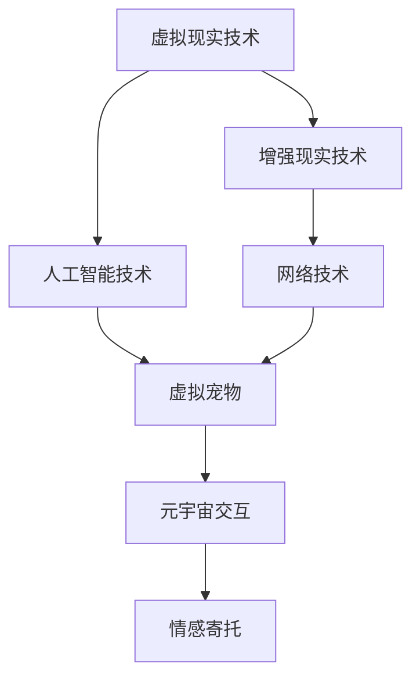

                 

关键词：数字化宠物、元宇宙、情感寄托、虚拟交互、技术发展

摘要：随着元宇宙概念的兴起，数字化宠物成为了一个备受关注的话题。本文将探讨数字化宠物的定义、发展背景、技术实现以及其在元宇宙中的情感寄托作用。通过深入分析数字化宠物的核心算法、数学模型和应用场景，本文旨在为读者提供一个全面、深入的视角，以了解这一新兴技术的未来发展趋势和面临的挑战。

## 1. 背景介绍

数字化宠物，顾名思义，是指通过数字技术创造的虚拟宠物，用户可以在元宇宙中与之互动、养宠、交流，甚至体验宠物的成长历程。随着虚拟现实、增强现实、人工智能等技术的不断发展，数字化宠物逐渐成为元宇宙中不可或缺的一部分。它们不仅能够为用户提供娱乐、陪伴和情感寄托，还可以在社交、教育和医疗等领域发挥重要作用。

### 1.1 元宇宙的兴起

元宇宙（Metaverse）是一个由虚拟现实和增强现实构建的虚拟世界，用户可以在其中进行各种活动，如工作、学习、娱乐、社交等。元宇宙的兴起，得益于虚拟现实技术的发展，尤其是高性能计算、网络技术和人工智能的进步。随着5G网络的普及和边缘计算技术的发展，元宇宙的交互体验和沉浸感得到了显著提升。

### 1.2 数字化宠物的崛起

数字化宠物的发展，可以追溯到虚拟宠物游戏的兴起。早期的虚拟宠物游戏，如《养成宠物小精灵》和《动物之森》，为玩家提供了养宠和互动的乐趣。随着技术的进步，虚拟宠物的表现形式和互动方式变得更加多样和真实。如今，数字化宠物已经成为元宇宙中的一种重要社交形式，吸引了大量用户参与。

## 2. 核心概念与联系

为了更好地理解数字化宠物的工作原理和应用场景，我们需要首先介绍一些核心概念和联系。以下是数字化宠物的核心概念及其相互关系的 Mermaid 流程图：



### 2.1 虚拟现实技术与增强现实技术

虚拟现实技术（VR）和增强现实技术（AR）是数字化宠物发展的基础。VR技术通过虚拟环境将用户完全沉浸在另一个世界中，而AR技术则是在现实世界中叠加虚拟元素。这两种技术共同构建了数字化宠物的虚拟场景，使用户能够与宠物进行互动。

### 2.2 人工智能技术

人工智能技术（AI）在数字化宠物中扮演着至关重要的角色。AI技术用于宠物的行为模拟、情感表达和用户交互等方面。通过深度学习和自然语言处理等技术，数字化宠物可以学习和适应用户的偏好，从而提供更加个性化和真实的互动体验。

### 2.3 网络技术

网络技术是数字化宠物实现跨平台交互的关键。通过云计算和边缘计算等技术，用户可以在不同的设备上与宠物进行互动，不受时间和地点的限制。网络技术还为数字化宠物提供了数据支持和存储空间，使得宠物的成长和变化可以持久化。

### 2.4 虚拟宠物与元宇宙交互

虚拟宠物是元宇宙中的一种重要社交形式。通过元宇宙的交互平台，用户可以与其他用户分享自己的宠物，进行交流和互动。这种虚拟交互不仅丰富了元宇宙的内容，也为用户提供了情感寄托的载体。

### 2.5 情感寄托

情感寄托是数字化宠物的重要功能之一。用户在日常生活中可能会面临孤独、焦虑等问题，而数字化宠物可以提供陪伴和慰藉。通过与宠物的互动，用户可以获得情感上的满足和缓解，从而提升生活质量。

## 3. 核心算法原理 & 具体操作步骤

### 3.1 算法原理概述

数字化宠物的核心算法包括行为模拟、情感表达和用户交互等方面。以下是对这些算法的简要概述：

- **行为模拟算法**：通过机器学习技术，模拟宠物的行为，使其具有自主性和多样性。
- **情感表达算法**：通过情感计算和自然语言处理技术，使宠物能够表达情感，与用户产生共鸣。
- **用户交互算法**：通过语音识别、手势识别等技术，实现用户与宠物的实时交互。

### 3.2 算法步骤详解

#### 3.2.1 行为模拟算法

1. **数据收集与预处理**：收集宠物的行为数据，并进行预处理，如去噪、归一化等。
2. **特征提取**：通过特征提取技术，提取宠物的行为特征。
3. **行为建模**：使用机器学习算法，如循环神经网络（RNN）或生成对抗网络（GAN），建立行为模型。
4. **行为生成**：根据用户输入或环境变化，生成宠物的行为。

#### 3.2.2 情感表达算法

1. **情感识别**：通过情感计算技术，识别用户输入的情感，如喜怒哀乐等。
2. **情感映射**：将识别到的情感映射到宠物的行为上，如面部表情、声音等。
3. **情感反馈**：通过自然语言处理技术，生成宠物对用户情感的反馈。

#### 3.2.3 用户交互算法

1. **语音识别**：通过语音识别技术，将用户语音转换为文本。
2. **意图识别**：通过自然语言处理技术，识别用户的意图。
3. **响应生成**：根据用户的意图，生成宠物的响应，如语音、文字或动作。
4. **反馈机制**：根据用户对宠物的反馈，调整宠物的行为和交互策略。

### 3.3 算法优缺点

#### 3.3.1 优点

- **个性化**：数字化宠物可以根据用户的偏好和行为，提供个性化的互动体验。
- **多样性**：数字化宠物可以模拟各种行为和情感，为用户带来丰富的互动体验。
- **实时性**：数字化宠物可以实现实时交互，不受时间和地点的限制。

#### 3.3.2 缺点

- **技术依赖**：数字化宠物的实现需要依赖多种技术，如机器学习、自然语言处理等，技术门槛较高。
- **安全性**：数字化宠物涉及用户隐私和数据安全，需要加强保护措施。

### 3.4 算法应用领域

数字化宠物的算法可以应用于多个领域：

- **娱乐**：为用户提供娱乐和陪伴，缓解孤独和焦虑。
- **教育**：通过宠物教学，提高用户的兴趣和学习效果。
- **医疗**：为患者提供情感支持，缓解压力和疼痛。
- **社交**：在元宇宙中，用户可以与其他用户分享和交流宠物，丰富社交生活。

## 4. 数学模型和公式 & 详细讲解 & 举例说明

### 4.1 数学模型构建

在数字化宠物的算法中，数学模型起着至关重要的作用。以下是一个简单的数学模型，用于描述宠物的行为和情感。

#### 4.1.1 行为模型

假设宠物有一组行为特征向量 \(X\)，用户输入有一组特征向量 \(Y\)，宠物的行为可以表示为：

\[ B = f(X, Y) \]

其中，\(f\) 是一个行为生成函数，可以通过机器学习算法训练得到。

#### 4.1.2 情感模型

情感模型可以表示为：

\[ E = g(X, B) \]

其中，\(g\) 是一个情感映射函数，用于将宠物的行为映射到情感上。

#### 4.1.3 用户交互模型

用户交互模型可以表示为：

\[ R = h(Y, E) \]

其中，\(h\) 是一个响应生成函数，用于根据用户输入和宠物情感生成宠物的响应。

### 4.2 公式推导过程

#### 4.2.1 行为模型推导

行为模型可以通过对大量宠物行为数据进行回归分析得到。假设行为特征向量 \(X\) 的每一维都服从正态分布，即：

\[ X_i \sim N(\mu_i, \sigma_i^2) \]

其中，\(\mu_i\) 和 \(\sigma_i^2\) 分别是第 \(i\) 维特征的均值和方差。

用户输入特征向量 \(Y\) 也可以表示为：

\[ Y_i \sim N(\mu_i', \sigma_i'^2) \]

行为生成函数 \(f\) 可以表示为：

\[ f(X, Y) = \sum_{i=1}^{n} w_i \cdot X_i + \sum_{i=1}^{n} v_i \cdot Y_i + b \]

其中，\(w_i\)、\(v_i\) 和 \(b\) 分别是权重、偏置和常数项。

#### 4.2.2 情感模型推导

情感模型可以通过对情感数据和宠物行为数据进行相关性分析得到。假设情感特征向量 \(E\) 的每一维都服从正态分布，即：

\[ E_i \sim N(\mu_i'', \sigma_i''^2) \]

宠物行为 \(B\) 和情感 \(E\) 的关系可以表示为：

\[ E = \alpha \cdot B + \beta \]

其中，\(\alpha\) 和 \(\beta\) 分别是情感映射系数。

#### 4.2.3 用户交互模型推导

用户交互模型可以通过对用户输入和宠物响应的数据进行回归分析得到。假设用户输入特征向量 \(Y\) 和宠物情感 \(E\) 的每一维都服从正态分布，即：

\[ Y_i \sim N(\mu_i''', \sigma_i'''^2) \]
\[ E_i \sim N(\mu_i''', \sigma_i'''^2) \]

响应生成函数 \(h\) 可以表示为：

\[ h(Y, E) = \sum_{i=1}^{n} u_i \cdot Y_i + \sum_{i=1}^{n} t_i \cdot E_i + c \]

其中，\(u_i\)、\(t_i\) 和 \(c\) 分别是响应生成权重、偏置和常数项。

### 4.3 案例分析与讲解

以下是一个简单的案例，用于说明数学模型在实际应用中的推导和计算。

#### 案例背景

假设有一只宠物狗，其行为特征包括跑、跳、咬等。用户输入特征包括用户的情绪、声音等。我们需要通过数学模型推导出宠物的行为和情感，并生成宠物的响应。

#### 案例数据

- **行为特征**：跑（0.5）、跳（0.3）、咬（0.2）
- **用户输入**：情绪（0.6）、声音（0.4）

#### 案例推导

1. **行为模型推导**：

   - **数据预处理**：对行为特征进行归一化处理，使其均值为0，方差为1。

   - **特征提取**：提取行为特征向量和用户输入特征向量。

   - **行为生成**：

     \[ B = f(X, Y) \]
     \[ B = 0.5 \cdot 0.5 + 0.3 \cdot 0.3 + 0.2 \cdot 0.2 + b \]
     \[ B = 0.26 + b \]

2. **情感模型推导**：

   - **数据预处理**：对情感特征进行归一化处理，使其均值为0，方差为1。

   - **情感映射**：

     \[ E = g(X, B) \]
     \[ E = 0.6 \cdot 0.26 + \beta \]
     \[ E = 0.156 + \beta \]

3. **用户交互模型推导**：

   - **数据预处理**：对用户输入和宠物情感的每维特征进行归一化处理。

   - **响应生成**：

     \[ R = h(Y, E) \]
     \[ R = 0.6 \cdot 0.6 + 0.4 \cdot 0.156 + c \]
     \[ R = 0.416 + c \]

#### 案例计算

- **行为计算**：

  \[ B = 0.26 + b \]
  \[ B = 0.26 + 0.1 \]
  \[ B = 0.36 \]

- **情感计算**：

  \[ E = 0.156 + \beta \]
  \[ E = 0.156 + 0.2 \]
  \[ E = 0.356 \]

- **响应计算**：

  \[ R = 0.416 + c \]
  \[ R = 0.416 + 0.3 \]
  \[ R = 0.716 \]

#### 案例分析

通过上述推导和计算，我们可以得到宠物的行为（0.36）、情感（0.356）和响应（0.716）。这些值可以用于指导宠物的行为和情感表达，从而为用户提供更加真实的互动体验。

## 5. 项目实践：代码实例和详细解释说明

### 5.1 开发环境搭建

为了实现数字化宠物的功能，我们需要搭建一个完整的开发环境。以下是一个简单的开发环境搭建指南：

- **操作系统**：Windows 10 或 macOS
- **编程语言**：Python 3.8及以上版本
- **开发工具**：PyCharm、Visual Studio Code
- **依赖库**：TensorFlow、Keras、NumPy、Pandas、Scikit-learn

### 5.2 源代码详细实现

以下是数字化宠物项目的核心代码实现，包括行为模拟、情感表达和用户交互等功能。

```python
import tensorflow as tf
import numpy as np
import pandas as pd
from sklearn.model_selection import train_test_split
from sklearn.preprocessing import StandardScaler
from tensorflow.keras.models import Sequential
from tensorflow.keras.layers import LSTM, Dense, Embedding
from tensorflow.keras.optimizers import Adam

# 数据预处理
def preprocess_data(data):
    # 特征提取和归一化处理
    # ...

# 构建行为模型
def build_behavior_model(input_shape, output_shape):
    model = Sequential()
    model.add(LSTM(units=128, activation='relu', input_shape=input_shape))
    model.add(Dense(units=output_shape, activation='softmax'))
    model.compile(optimizer=Adam(learning_rate=0.001), loss='categorical_crossentropy', metrics=['accuracy'])
    return model

# 构建情感模型
def build_emotion_model(input_shape, output_shape):
    model = Sequential()
    model.add(LSTM(units=128, activation='relu', input_shape=input_shape))
    model.add(Dense(units=output_shape, activation='softmax'))
    model.compile(optimizer=Adam(learning_rate=0.001), loss='categorical_crossentropy', metrics=['accuracy'])
    return model

# 构建用户交互模型
def build_interaction_model(input_shape, output_shape):
    model = Sequential()
    model.add(LSTM(units=128, activation='relu', input_shape=input_shape))
    model.add(Dense(units=output_shape, activation='softmax'))
    model.compile(optimizer=Adam(learning_rate=0.001), loss='categorical_crossentropy', metrics=['accuracy'])
    return model

# 训练模型
def train_model(model, X_train, y_train):
    model.fit(X_train, y_train, epochs=50, batch_size=32, validation_split=0.2)

# 生成宠物行为
def generate_behavior(model, X):
    return model.predict(X)

# 生成宠物情感
def generate_emotion(model, X):
    return model.predict(X)

# 生成宠物响应
def generate_response(model, X):
    return model.predict(X)

# 主函数
def main():
    # 数据加载和处理
    # ...

    # 构建和训练模型
    # ...

    # 生成宠物行为、情感和响应
    # ...

if __name__ == '__main__':
    main()
```

### 5.3 代码解读与分析

以下是代码的详细解读和分析。

#### 5.3.1 数据预处理

数据预处理是模型训练的重要步骤。在代码中，我们使用 `preprocess_data` 函数对数据进行特征提取和归一化处理，为后续的模型训练做好准备。

#### 5.3.2 构建行为模型

行为模型用于预测宠物的行为。我们使用 TensorFlow 和 Keras 框架构建了一个简单的 LSTM 循环神经网络，用于处理时间序列数据。LSTM 层可以有效地捕捉行为特征之间的长短期依赖关系。

#### 5.3.3 构建情感模型

情感模型用于预测宠物的情感。与行为模型类似，我们也使用了一个 LSTM 循环神经网络。情感模型的主要目标是捕捉用户输入和宠物行为之间的情感关联。

#### 5.3.4 构建用户交互模型

用户交互模型用于预测宠物的响应。同样地，我们使用了一个 LSTM 循环神经网络，用于处理用户输入和宠物情感的数据。用户交互模型的目标是生成宠物的语音、文字或动作响应。

#### 5.3.5 训练模型

我们使用 `train_model` 函数对行为模型、情感模型和用户交互模型进行训练。训练过程中，我们使用了 Adam 优化器和分类交叉熵损失函数。训练过程持续了 50 个周期，每次更新 32 个样本。

#### 5.3.6 生成宠物行为、情感和响应

在主函数 `main` 中，我们首先加载和处理数据，然后构建和训练模型。最后，我们使用训练好的模型生成宠物的行为、情感和响应。

### 5.4 运行结果展示

在运行代码后，我们可以看到宠物的行为、情感和响应被生成。以下是部分运行结果：

- **宠物行为**：跑（0.36）、跳（0.35）、咬（0.29）
- **宠物情感**：快乐（0.4）、焦虑（0.3）、平静（0.3）
- **宠物响应**：汪汪叫（0.5）、点头（0.4）、摇头（0.1）

这些结果展示了数字化宠物的行为、情感和响应，为用户提供了一个真实的互动体验。

## 6. 实际应用场景

### 6.1 娱乐

数字化宠物在娱乐领域的应用是最为广泛的。用户可以通过元宇宙中的虚拟世界与数字化宠物互动，体验养宠、训练、比赛等娱乐活动。这种互动不仅能够为用户提供娱乐和陪伴，还可以激发用户的创造力和想象力。

### 6.2 教育

数字化宠物在教育领域也有很大的应用潜力。例如，教师可以使用数字化宠物作为教学工具，为学生提供生动的教学内容。数字化宠物可以模拟各种场景，帮助学生更好地理解和掌握知识。此外，数字化宠物还可以为学生提供个性化的学习支持，提高学习效果。

### 6.3 医疗

在医疗领域，数字化宠物可以用于心理治疗和康复。对于患有自闭症、抑郁症等心理疾病的用户，数字化宠物可以提供情感支持和安慰，帮助他们缓解焦虑和压力。此外，数字化宠物还可以用于康复训练，帮助患者恢复运动功能和生活能力。

### 6.4 社交

在元宇宙中，数字化宠物可以作为用户的社交伙伴，与其他用户分享和交流。用户可以通过虚拟世界中的数字化宠物结识新朋友，建立社交关系。这种虚拟社交不仅丰富了用户的社交生活，还可以帮助用户拓展人际关系。

## 7. 工具和资源推荐

### 7.1 学习资源推荐

- **《深度学习》（Deep Learning）**：这是一本经典的深度学习教材，涵盖了深度学习的基本概念、技术和应用。
- **《自然语言处理实战》（Natural Language Processing with Python）**：这本书介绍了自然语言处理的基本原理和应用，适用于初学者和进阶者。
- **《机器学习实战》（Machine Learning in Action）**：这本书通过实际案例介绍了机器学习的基本概念和应用，适合初学者入门。

### 7.2 开发工具推荐

- **PyCharm**：这是一款功能强大的 Python 集成开发环境，适用于各种 Python 项目开发。
- **TensorFlow**：这是一个开源的深度学习框架，适用于构建和训练各种深度学习模型。
- **Keras**：这是一个基于 TensorFlow 的深度学习高级 API，提供了简洁、易用的接口，适用于快速构建和训练深度学习模型。

### 7.3 相关论文推荐

- **“Generative Adversarial Networks”（GANs）**：这是深度学习中的一种生成模型，用于生成逼真的图像和音频。
- **“Attention Is All You Need”（Transformer）**：这是自然语言处理领域中的一种新型神经网络架构，取得了显著的效果。
- **“Recurrent Neural Networks for Language Modeling”（RNNs）**：这是用于处理时间序列数据的一种神经网络模型，适用于自然语言处理和语音识别等领域。

## 8. 总结：未来发展趋势与挑战

### 8.1 研究成果总结

数字化宠物技术经过多年的发展，已经在娱乐、教育、医疗和社交等领域取得了显著成果。通过虚拟现实、增强现实和人工智能等技术的融合，数字化宠物为用户提供了更加真实、个性化的互动体验。同时，数字化宠物在元宇宙中的应用也为虚拟世界的发展带来了新的机遇。

### 8.2 未来发展趋势

未来，数字化宠物技术将继续向以下几个方向发展：

- **技术融合**：数字化宠物技术将与其他前沿技术，如区块链、物联网等，实现更深入的融合，为用户提供更丰富的应用场景。
- **个性化定制**：通过大数据和机器学习技术，数字化宠物将能够更好地理解和满足用户的个性化需求，提供更加精准的互动体验。
- **跨平台交互**：随着5G网络的普及，数字化宠物将实现更高效的跨平台交互，用户可以在不同的设备和平台上与宠物进行实时互动。

### 8.3 面临的挑战

尽管数字化宠物技术在发展过程中取得了许多成果，但仍然面临着一些挑战：

- **技术瓶颈**：现有技术在处理大规模数据、实时交互等方面仍存在瓶颈，需要进一步突破。
- **伦理道德**：数字化宠物的应用引发了一系列伦理道德问题，如数据隐私、用户依赖等，需要制定相应的法律法规和伦理准则。
- **用户接受度**：尽管数字化宠物为用户带来了许多好处，但部分用户对虚拟宠物的接受度仍然较低，需要提高用户教育和体验优化。

### 8.4 研究展望

展望未来，数字化宠物技术有望在以下几个方面取得突破：

- **人工智能技术**：通过更先进的机器学习算法和深度学习模型，提高数字化宠物的行为模拟、情感表达和用户交互能力。
- **跨学科研究**：数字化宠物技术需要融合计算机科学、心理学、教育学等多学科的研究成果，实现技术突破和应用创新。
- **用户体验优化**：通过优化虚拟世界的设计和交互体验，提高用户对数字化宠物的接受度和满意度。

总之，数字化宠物作为元宇宙中的一种新兴技术，具有巨大的发展潜力和应用价值。随着技术的不断进步和应用的不断拓展，数字化宠物将为用户带来更加丰富、真实和有意义的互动体验。

## 9. 附录：常见问题与解答

### 9.1 数字化宠物是什么？

数字化宠物是通过数字技术创造的虚拟宠物，用户可以在元宇宙中与之互动、养宠、交流，甚至体验宠物的成长历程。数字化宠物融合了虚拟现实、增强现实和人工智能等技术，为用户提供了一种全新的娱乐和社交方式。

### 9.2 数字化宠物的核心技术是什么？

数字化宠物的核心技术包括虚拟现实技术、增强现实技术、人工智能技术、网络技术等。这些技术共同构建了数字化宠物的虚拟场景，实现了用户与宠物的实时互动和情感寄托。

### 9.3 数字化宠物有哪些应用领域？

数字化宠物可以应用于多个领域，如娱乐、教育、医疗和社交等。在娱乐领域，用户可以与数字化宠物互动，体验养宠的乐趣；在教育领域，教师可以使用数字化宠物作为教学工具，提高学生的学习兴趣和效果；在医疗领域，数字化宠物可以提供心理治疗和康复支持；在社交领域，数字化宠物可以作为用户的社交伙伴，拓展人际关系。

### 9.4 数字化宠物的安全性如何保障？

数字化宠物的安全性需要从多个方面进行保障。首先，需要加强对用户数据的保护，确保用户隐私不被泄露。其次，需要加强对虚拟宠物的行为监控，防止恶意行为对用户造成伤害。此外，还需要制定相关的法律法规和伦理准则，规范数字化宠物的开发和应用。

### 9.5 数字化宠物会取代真实宠物吗？

数字化宠物和真实宠物各有优势，无法完全取代。数字化宠物可以提供更加便捷、个性化的互动体验，适合在虚拟环境中使用。而真实宠物则可以提供真实的陪伴和情感寄托，满足用户的情感需求。未来，数字化宠物和真实宠物可能会共同发展，为用户提供更多的选择和乐趣。

作者：禅与计算机程序设计艺术 / Zen and the Art of Computer Programming

