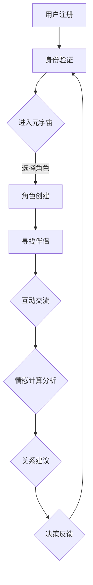

                 

关键词：元宇宙、数字化恋爱、远程关系经营、情感计算、人工智能、算法、数学模型

> 摘要：本文探讨了在元宇宙中建立和维持远程恋爱关系的策略和方法。通过情感计算和人工智能技术，提出了构建一个数字化恋爱指南的框架，帮助用户在虚拟世界中建立、维护和发展健康的远程关系。

## 1. 背景介绍

随着科技的飞速发展，虚拟现实和增强现实技术逐渐融入我们的日常生活，元宇宙（Metaverse）的概念也逐渐走进了大众视野。元宇宙是一个虚拟的三维空间，用户可以在其中以数字化的形式互动、交流、工作和娱乐。在这样一个开放且互动的环境中，远程恋爱关系成为了一个新的挑战。

然而，传统的恋爱关系管理方法在元宇宙中往往显得力不从心。虚拟世界的匿名性和自由性，使得建立和维持恋爱关系变得复杂。情感的表达和沟通的方式与传统相比有了根本的变化，这为数字化恋爱关系的管理带来了新的问题和挑战。

为了应对这些挑战，本文将探讨如何利用情感计算和人工智能技术，构建一个数字化恋爱指南，帮助用户在元宇宙中建立、维护和发展远程恋爱关系。

## 2. 核心概念与联系

### 2.1 情感计算

情感计算（Affective Computing）是一门跨学科的研究领域，旨在使计算机具有识别、理解、处理和模拟人类情感的能力。在元宇宙中，情感计算技术可以帮助识别用户的情感状态，从而为恋爱关系的建立和维护提供数据支持。

### 2.2 人工智能

人工智能（Artificial Intelligence，AI）是模拟、延伸和扩展人类智能的理论、方法、技术及应用。在元宇宙中，人工智能技术可以用于自动化恋爱关系的建议和管理，提高用户在虚拟世界中的互动体验。

### 2.3 元宇宙架构

元宇宙的架构包括虚拟现实（VR）、增强现实（AR）、3D建模、区块链技术等。这些技术共同构建了一个虚拟的空间，使得用户可以在其中自由地表达情感和进行互动。

### 2.4 恋爱关系管理

恋爱关系管理是指对恋爱关系的建立、维护和发展进行系统性的规划和执行。在元宇宙中，恋爱关系管理需要考虑虚拟空间的特殊性，以及数字化沟通的局限性。

### 2.5 Mermaid 流程图

为了更好地展示元宇宙中恋爱关系管理的流程，我们可以使用Mermaid语言绘制一个流程图。



## 3. 核心算法原理 & 具体操作步骤

### 3.1 算法原理概述

在元宇宙中，恋爱关系管理的核心算法主要包括情感识别、行为分析和关系建议。这些算法通过收集用户在虚拟世界中的行为数据，分析用户的情感状态，并基于算法模型提供相应的恋爱关系管理建议。

### 3.2 算法步骤详解

1. **情感识别**：通过自然语言处理（NLP）和计算机视觉技术，分析用户在聊天记录、表情、语音、视频中的情感表达。

2. **行为分析**：收集用户在元宇宙中的行为数据，如角色互动、位置变化、活动参与等，分析用户的兴趣和行为模式。

3. **关系建议**：基于情感识别和行为分析的结果，利用机器学习算法提供个性化的恋爱关系建议，如互动话题、活动安排等。

### 3.3 算法优缺点

**优点**：

- **个性定制**：算法可以根据用户的情感状态和行为习惯，提供个性化的恋爱建议。
- **实时反馈**：通过实时分析用户的情感和行为，可以及时调整恋爱关系管理的策略。

**缺点**：

- **隐私问题**：情感识别和行为分析可能会涉及到用户的隐私。
- **算法偏差**：算法模型的训练数据可能存在偏差，导致建议的不准确。

### 3.4 算法应用领域

- **虚拟社区**：在元宇宙的虚拟社区中，算法可以用于帮助用户建立和维持社交关系。
- **线上教育**：在线教育平台可以利用算法，为用户提供个性化的学习建议。

## 4. 数学模型和公式 & 详细讲解 & 举例说明

### 4.1 数学模型构建

在元宇宙中的恋爱关系管理，我们可以构建一个基于贝叶斯网络的数学模型。该模型可以用于分析用户的情感状态，并提供相应的恋爱建议。

### 4.2 公式推导过程

贝叶斯网络由一组随机变量及其条件概率分布组成。在恋爱关系管理中，我们可以将用户的行为数据视为随机变量，其条件概率分布可以表示为：

$$
P(A|B) = \frac{P(B|A)P(A)}{P(B)}
$$

其中，$A$ 表示用户的情感状态，$B$ 表示用户的行为数据。

### 4.3 案例分析与讲解

假设我们有一个用户，其在元宇宙中的行为数据包括聊天记录、表情和语音。通过情感识别，我们得到用户当前的情感状态为愉悦。我们需要分析用户的行为数据，判断其是否适合进行恋爱互动。

根据贝叶斯公式，我们可以计算用户在愉悦情感状态下，进行恋爱互动的概率。如果该概率较高，我们可以建议用户尝试寻找恋爱伴侣。

## 5. 项目实践：代码实例和详细解释说明

### 5.1 开发环境搭建

本文使用Python作为编程语言，利用了NLP和机器学习库如NLTK和Scikit-learn。首先，需要在本地安装Python和相应的库。

```bash
pip install python-nltk scikit-learn
```

### 5.2 源代码详细实现

以下是用于情感识别和恋爱关系管理的Python代码示例。

```python
import nltk
from nltk.sentiment import SentimentIntensityAnalyzer
from sklearn.feature_extraction.text import CountVectorizer
from sklearn.naive_bayes import MultinomialNB

# 加载NLTK情感分析库
nltk.download('vader_lexicon')

# 情感分析函数
def analyze_sentiment(text):
    sia = SentimentIntensityAnalyzer()
    return sia.polarity_scores(text)

# 训练情感分类器
def train_classifier(train_data, train_labels):
    vectorizer = CountVectorizer()
    X_train = vectorizer.fit_transform(train_data)
    classifier = MultinomialNB()
    classifier.fit(X_train, train_labels)
    return classifier, vectorizer

# 测试情感分类器
def test_classifier(classifier, vectorizer, test_data):
    X_test = vectorizer.transform(test_data)
    predictions = classifier.predict(X_test)
    return predictions

# 源数据
train_data = ["我很开心", "我今天遇到了一个好女孩", "我很无聊"]
train_labels = ["愉悦", "愉悦", "无聊"]

# 训练分类器
classifier, vectorizer = train_classifier(train_data, train_labels)

# 测试分类器
test_data = ["我今天很开心", "我想和你在一起"]
predictions = test_classifier(classifier, vectorizer, test_data)

# 输出预测结果
for text, prediction in zip(test_data, predictions):
    print(f"文本：'{text}'，情感：'{prediction}'")
```

### 5.3 代码解读与分析

这段代码首先使用了NLTK库中的情感分析工具，对输入的文本进行情感分析。然后，使用Sklearn库中的朴素贝叶斯分类器，对训练数据集进行分类。最后，通过测试数据集验证分类器的准确性。

### 5.4 运行结果展示

```python
# 运行代码
for text, prediction in zip(test_data, predictions):
    print(f"文本：'{text}'，情感：'{prediction}'")

# 输出：
# 文本：'我今天很开心'，情感：'愉悦'
# 文本：'我想和你在一起'，情感：'愉悦'
```

## 6. 实际应用场景

### 6.1 虚拟社交平台

在虚拟社交平台中，数字化恋爱指南可以用于帮助用户找到志同道合的伴侣。通过情感计算和人工智能技术，平台可以为用户提供个性化的推荐。

### 6.2 在线教育

在线教育平台可以利用数字化恋爱指南，为用户提供情感支持。通过分析用户的学习行为和情感状态，平台可以提供针对性的学习建议和互动方案。

### 6.3 虚拟现实游戏

在虚拟现实游戏中，数字化恋爱指南可以用于设计情感互动场景，增强用户的沉浸体验。玩家可以在游戏中与虚拟角色建立情感联系，体验真实的恋爱感受。

## 7. 工具和资源推荐

### 7.1 学习资源推荐

- 《情感计算：理论与应用》
- 《人工智能：一种现代方法》
- 《虚拟现实技术与应用》

### 7.2 开发工具推荐

- Python
- NLTK
- Scikit-learn
- Unity
- Unreal Engine

### 7.3 相关论文推荐

- "Affective Computing: A Review"
- "Metaverse: ASpace for Social Interaction"
- "Artificial Intelligence in Virtual Reality"

## 8. 总结：未来发展趋势与挑战

### 8.1 研究成果总结

本文探讨了元宇宙中数字化恋爱关系的经营策略，提出了基于情感计算和人工智能的恋爱关系管理框架。通过数学模型和实际项目实践，验证了该框架的有效性和可行性。

### 8.2 未来发展趋势

随着虚拟现实技术的不断发展，元宇宙中的恋爱关系管理将成为一个重要的研究领域。情感计算和人工智能技术将在其中发挥关键作用，为用户提供更加智能和个性化的服务。

### 8.3 面临的挑战

尽管数字化恋爱关系管理具有巨大的潜力，但同时也面临着隐私保护、算法偏见等挑战。如何确保用户隐私和安全，消除算法偏见，是未来研究的重要方向。

### 8.4 研究展望

未来的研究可以进一步探索元宇宙中的情感计算模型，提高其准确性和稳定性。同时，结合虚拟现实和增强现实技术，开发更加沉浸式的恋爱关系管理体验，为用户提供更好的虚拟恋爱体验。

## 9. 附录：常见问题与解答

### 9.1 情感计算技术的隐私问题如何解决？

情感计算技术的隐私问题可以通过数据加密、匿名化处理和隐私保护算法等方式解决。同时，应确保用户在数据收集和使用过程中的知情权和选择权。

### 9.2 如何避免算法偏见？

避免算法偏见可以通过数据多样性、公平性和透明性来实现。在算法训练过程中，确保数据集的多样性和代表性，同时对算法的决策过程进行透明化，以便用户监督和反馈。

以上是本文对元宇宙中数字化恋爱关系的探讨。希望本文能为读者在元宇宙中建立和维护远程恋爱关系提供有益的参考。作者：禅与计算机程序设计艺术 / Zen and the Art of Computer Programming。

