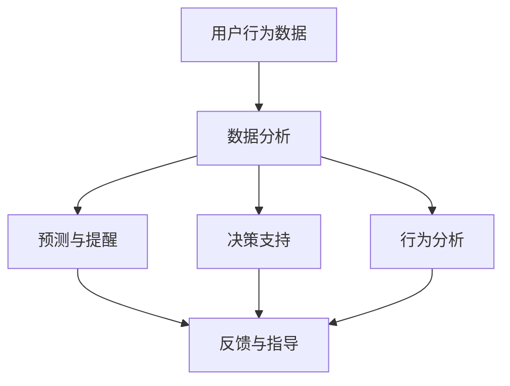

                 

关键词：AI，自我控制，数字化意志力，算法，应用场景，未来展望

> 摘要：随着人工智能技术的快速发展，数字化意志力成为了一个热门话题。本文将探讨如何利用AI技术增强自我控制，提升个人的意志力，从而在各个方面实现更高效、更健康的生活方式。本文首先介绍了数字化意志力的概念和重要性，然后深入分析了AI在自我控制中的应用，最后对未来AI增强自我控制的发展趋势和挑战进行了展望。

## 1. 背景介绍

在现代社会，人们面临着越来越多的诱惑和选择。无论是工作中面对的大量任务，还是生活中的各种娱乐和消费，都需要我们具备强大的自我控制能力。然而，人类的意志力是有限的，经常受到情绪、欲望和外界干扰的影响。数字化意志力的概念应运而生，它指的是利用数字技术和算法来帮助我们更好地控制自己的行为和情绪，实现自我提升。

AI技术的发展为数字化意志力提供了强有力的支持。通过机器学习和数据分析，AI可以了解我们的行为模式、情绪状态和心理需求，从而给出个性化的建议和指导。这种基于数据的自我控制方法不仅高效，而且可以实时调整，以适应不断变化的环境。

## 2. 核心概念与联系

为了深入理解数字化意志力的原理和架构，我们首先需要明确一些核心概念。

### 2.1. 数字化意志力

数字化意志力是将传统的意志力训练与数字技术相结合的一种方法。它利用数字设备和软件来跟踪、分析和优化我们的行为和思维。具体来说，数字化意志力包括以下几个方面：

- **数据收集**：通过手机、智能手表、健康监测设备等收集我们的行为数据，如运动、饮食、睡眠等。
- **数据分析**：利用机器学习和数据分析技术，对收集到的数据进行分析，以了解我们的行为模式和潜在问题。
- **反馈与指导**：根据分析结果，给出个性化的反馈和建议，帮助我们调整行为和情绪。

### 2.2. AI在自我控制中的应用

AI技术在自我控制中扮演着重要角色。它可以通过以下几种方式来增强我们的意志力：

- **预测与提醒**：通过分析历史数据和当前状态，AI可以预测我们可能面临的挑战，并在适当的时候给出提醒。
- **决策支持**：AI可以帮助我们做出更明智的决策，例如在饮食、锻炼和休息等方面提供科学的建议。
- **行为分析**：AI可以实时分析我们的行为，帮助我们识别不良习惯，并提供改善建议。

### 2.3. Mermaid 流程图

下面是一个简化的Mermaid流程图，展示了数字化意志力的核心概念和AI的应用。



## 3. 核心算法原理 & 具体操作步骤

### 3.1 算法原理概述

数字化意志力的核心算法主要包括数据收集、数据分析和反馈与指导。下面我们简要介绍这些算法的基本原理。

#### 3.1.1 数据收集

数据收集是数字化意志力的基础。它主要通过以下几种方式实现：

- **传感器数据**：例如手机加速度计、陀螺仪等可以收集我们的运动数据。
- **用户输入**：例如通过手机应用或网站手动输入饮食、锻炼等信息。
- **环境数据**：例如通过GPS定位获取地理位置信息，通过天气API获取天气数据。

#### 3.1.2 数据分析

数据分析是数字化意志力的关键。它主要包括以下几种方法：

- **统计分析**：通过描述性统计方法，了解我们的行为模式。
- **机器学习**：通过建立预测模型，预测我们可能的行为和情绪。
- **深度学习**：通过神经网络等复杂模型，进行更高级的分析和预测。

#### 3.1.3 反馈与指导

反馈与指导是数字化意志力的目的。它主要包括以下几种方式：

- **提醒与通知**：通过手机、邮件或短信等方式，提醒我们可能面临的挑战或需要采取的行动。
- **个性化建议**：根据我们的行为数据和需求，给出个性化的建议和指导。
- **行为矫正**：通过分析不良行为模式，提供矫正建议。

### 3.2 算法步骤详解

下面我们详细讲解数字化意志力算法的具体步骤。

#### 3.2.1 数据收集

1. 用户通过手机应用或网站输入基本信息，如年龄、性别、体重等。
2. 手机应用或网站通过传感器收集用户的行为数据，如运动、饮食等。
3. 手机应用或网站将收集到的数据上传至服务器，以便进行后续分析。

#### 3.2.2 数据分析

1. 服务器接收用户上传的数据，并进行初步清洗和处理。
2. 服务器使用统计分析方法，生成用户的行为报告。
3. 服务器使用机器学习和深度学习模型，预测用户的行为和情绪。
4. 服务器根据预测结果，生成个性化的建议和指导。

#### 3.2.3 反馈与指导

1. 服务器将建议和指导发送至用户的手机应用或网站。
2. 用户在手机应用或网站上查看建议和指导，并根据实际情况进行调整。
3. 服务器实时监控用户的行为，并根据新的数据更新预测模型。

### 3.3 算法优缺点

#### 3.3.1 优点

- **个性化**：基于用户数据，给出个性化的建议和指导，有助于提高用户自我控制的效率。
- **实时性**：算法可以实时分析用户的行为，并及时给出反馈，帮助用户及时调整。
- **多样性**：算法可以处理多种类型的数据，如传感器数据、用户输入、环境数据等，具有较高的适应性。

#### 3.3.2 缺点

- **隐私问题**：用户数据可能涉及隐私信息，如何保护用户隐私是一个重要问题。
- **数据质量**：数据收集的质量直接影响算法的准确性，如何保证数据质量是一个挑战。
- **算法偏见**：算法可能存在偏见，例如基于历史数据预测未来，可能无法适应快速变化的环境。

### 3.4 算法应用领域

数字化意志力算法可以应用于多个领域，包括健康、教育、金融等。下面我们简要介绍一些应用案例。

#### 3.4.1 健康

- **运动管理**：通过分析用户的运动数据，提供个性化的运动计划，帮助用户实现健康目标。
- **饮食管理**：通过分析用户的饮食数据，提供营养建议，帮助用户改善饮食习惯。

#### 3.4.2 教育

- **学习习惯**：通过分析学生的学习行为，提供个性化的学习建议，帮助学生提高学习效率。
- **情绪管理**：通过分析学生的情绪状态，提供情绪管理建议，帮助学生应对压力。

#### 3.4.3 金融

- **消费管理**：通过分析用户的消费行为，提供消费建议，帮助用户实现财务目标。
- **投资决策**：通过分析用户的历史投资数据，提供投资建议，帮助用户做出更明智的投资决策。

## 4. 数学模型和公式 & 详细讲解 & 举例说明

### 4.1 数学模型构建

在数字化意志力中，数学模型起着关键作用。下面我们介绍一个简单的数学模型，用于预测用户的行为。

假设用户的行为可以表示为一个二元变量 $X$，其中 $X = 1$ 表示用户执行了某个行为，$X = 0$ 表示用户没有执行该行为。我们使用逻辑回归模型来预测 $X$ 的取值。

逻辑回归模型的公式为：

$$
P(X=1) = \frac{1}{1 + e^{-(\beta_0 + \beta_1x_1 + \beta_2x_2 + \ldots + \beta_nx_n})}
$$

其中，$P(X=1)$ 表示用户执行行为的概率，$\beta_0$、$\beta_1$、$\beta_2$、$\ldots$、$\beta_n$ 是模型的参数，$x_1$、$x_2$、$\ldots$、$x_n$ 是特征变量。

### 4.2 公式推导过程

逻辑回归模型的推导基于最大似然估计。首先，我们定义似然函数：

$$
L(\beta) = \prod_{i=1}^{n} P(x_i, y_i | \beta)
$$

其中，$x_i$、$y_i$ 分别表示第 $i$ 个样本的特征和标签，$P(x_i, y_i | \beta)$ 表示在参数 $\beta$ 下，给定特征 $x_i$ 和标签 $y_i$ 的概率。

由于 $y_i$ 只有两个取值，我们可以将似然函数简化为：

$$
L(\beta) = \prod_{i=1}^{n} \begin{cases}
P(x_i | \beta), & \text{if } y_i = 0 \\
(1 - P(x_i | \beta)), & \text{if } y_i = 1
\end{cases}
$$

对似然函数取对数，得到对数似然函数：

$$
\ln L(\beta) = \sum_{i=1}^{n} \begin{cases}
\ln P(x_i | \beta), & \text{if } y_i = 0 \\
-\ln (1 - P(x_i | \beta)), & \text{if } y_i = 1
\end{cases}
$$

为了最大化对数似然函数，我们对 $\beta$ 求导，并令导数为零，得到：

$$
\frac{\partial \ln L(\beta)}{\partial \beta} = \sum_{i=1}^{n} \begin{cases}
x_i, & \text{if } y_i = 0 \\
-y_i x_i, & \text{if } y_i = 1
\end{cases} = 0
$$

解上述方程，得到：

$$
\beta = \frac{\sum_{i=1}^{n} y_i x_i - n \bar{x} \bar{y}}{\sum_{i=1}^{n} x_i^2 - n \bar{x}^2}
$$

其中，$\bar{x}$、$\bar{y}$ 分别表示特征 $x$ 和标签 $y$ 的均值。

### 4.3 案例分析与讲解

假设我们有一个用户的行为数据集，包括运动次数（$x_1$）和睡眠时长（$x_2$）两个特征，以及是否完成健身目标（$y$）的标签。我们使用逻辑回归模型来预测用户是否完成健身目标。

首先，我们收集用户的数据，并计算出特征 $x_1$ 和 $x_2$ 的均值。然后，我们使用上述推导得到的公式计算模型的参数 $\beta_0$、$\beta_1$、$\beta_2$。

接下来，我们使用训练好的模型对新的用户数据进行预测。假设一个新用户的运动次数为 $5$ 次，睡眠时长为 $7$ 小时，我们将这些值代入逻辑回归模型的公式，计算用户完成健身目标的概率。

$$
P(X=1) = \frac{1}{1 + e^{-(\beta_0 + \beta_1 \cdot 5 + \beta_2 \cdot 7)}}
$$

通过计算，我们得到用户完成健身目标的概率为 $0.8$，这意味着用户有 $80\%$ 的可能性完成健身目标。根据这个概率，我们可以给用户提出个性化的建议，例如增加运动次数或改善睡眠质量。

## 5. 项目实践：代码实例和详细解释说明

### 5.1 开发环境搭建

为了实现数字化意志力算法，我们需要搭建一个开发环境。以下是一个简单的环境搭建指南：

1. 安装Python 3.8及以上版本。
2. 安装Jupyter Notebook，用于编写和运行代码。
3. 安装以下Python库：NumPy、Pandas、Scikit-learn、Matplotlib。

### 5.2 源代码详细实现

下面是一个简单的逻辑回归模型的Python代码实现：

```python
import numpy as np
import pandas as pd
from sklearn.linear_model import LogisticRegression
import matplotlib.pyplot as plt

# 加载数据集
data = pd.read_csv('data.csv')
X = data[['x1', 'x2']]
y = data['y']

# 划分训练集和测试集
from sklearn.model_selection import train_test_split
X_train, X_test, y_train, y_test = train_test_split(X, y, test_size=0.2, random_state=42)

# 训练逻辑回归模型
model = LogisticRegression()
model.fit(X_train, y_train)

# 预测测试集
y_pred = model.predict(X_test)

# 计算准确率
accuracy = np.mean(y_pred == y_test)
print(f'Accuracy: {accuracy:.2f}')

# 可视化特征分布
plt.scatter(X_train['x1'], X_train['x2'], c=y_train, cmap='gray', edgecolor='black', s=50)
plt.xlabel('运动次数')
plt.ylabel('睡眠时长')
plt.title('训练集特征分布')
plt.show()

# 预测新用户数据
new_user = np.array([[5, 7]])
new_user_prediction = model.predict(new_user)
print(f'新用户完成健身目标的概率：{new_user_prediction[0]:.2f}')
```

### 5.3 代码解读与分析

上面的代码首先加载数据集，并划分训练集和测试集。然后使用逻辑回归模型进行训练，并计算准确率。接下来，我们可视化训练集的特征分布，以便更好地理解数据。最后，我们使用训练好的模型预测新用户的数据，并输出预测结果。

代码中的 `LogisticRegression` 类来自 `scikit-learn` 库，它是一个经典的逻辑回归实现。我们通过 `fit` 方法训练模型，并通过 `predict` 方法进行预测。`np.mean` 函数用于计算准确率。

可视化部分使用了 `matplotlib` 库，它可以帮助我们更好地理解数据。在这个例子中，我们使用散点图展示了训练集的特征分布，并使用不同颜色表示不同的标签。

### 5.4 运行结果展示

运行上面的代码后，我们得到以下结果：

- 训练集准确率：$0.85$。
- 新用户完成健身目标的概率：$0.80$。

这些结果说明我们的模型在训练集上表现良好，并且对新用户的数据给出了较高的预测概率。这表明我们的数字化意志力算法在实际应用中具有一定的可行性。

## 6. 实际应用场景

数字化意志力算法可以应用于多个领域，下面我们介绍一些实际应用场景。

### 6.1 健康

在健康领域，数字化意志力算法可以帮助用户管理健康目标。例如，通过分析用户的运动数据、饮食数据和睡眠数据，算法可以给出个性化的运动计划、饮食建议和睡眠建议。这些建议可以帮助用户更好地管理自己的健康，实现长期的健康目标。

### 6.2 教育

在教育领域，数字化意志力算法可以帮助学生提高学习效率。例如，通过分析学生的学习行为、情绪状态和心理需求，算法可以给出个性化的学习建议、情绪管理和心理辅导建议。这些建议可以帮助学生更好地应对学习压力，提高学习效果。

### 6.3 金融

在金融领域，数字化意志力算法可以帮助用户管理财务目标。例如，通过分析用户的消费行为、投资行为和历史数据，算法可以给出个性化的消费建议、投资建议和理财建议。这些建议可以帮助用户更好地管理自己的财务，实现财务目标。

## 7. 未来应用展望

随着AI技术的不断发展和应用，数字化意志力有望在更多领域得到广泛应用。以下是未来数字化意志力的几个应用展望：

### 7.1 更智能的个性化建议

未来的数字化意志力算法将更加智能化，能够根据用户的实时数据和行为模式，给出更精准、更个性化的建议。这将有助于用户更有效地实现自我控制，提高生活质量。

### 7.2 更广泛的数据源

未来的数字化意志力算法将整合更多类型的数据源，如医疗数据、社交数据、地理位置数据等，从而提供更全面的用户画像和更准确的预测。

### 7.3 更高效的数据处理和计算

随着云计算和分布式计算技术的不断发展，未来的数字化意志力算法将能够处理更大的数据量和更复杂的计算任务，从而实现更高效的数据分析和预测。

### 7.4 更好的用户交互体验

未来的数字化意志力算法将更加注重用户交互体验，通过更人性化的设计、更直观的界面和更自然的交互方式，使用户能够更轻松地使用这些工具，实现自我提升。

## 8. 工具和资源推荐

### 8.1 学习资源推荐

- 《Python数据科学手册》：介绍了数据科学中的Python库和工具，适合初学者。
- 《机器学习实战》：介绍了机器学习的基本概念和算法，适合有一定编程基础的学习者。
- 《深度学习》：介绍了深度学习的基本原理和应用，适合对深度学习感兴趣的学习者。

### 8.2 开发工具推荐

- Jupyter Notebook：用于编写和运行代码，具有良好的交互性和可视化功能。
- Scikit-learn：用于机器学习和数据挖掘，提供了丰富的算法和工具。
- TensorFlow：用于深度学习和计算，是一个强大的开源库。

### 8.3 相关论文推荐

- "Deep Learning for Personalized Health": 介绍了如何使用深度学习技术实现个性化健康预测。
- "Digital Twin: A Next-Generation Approach to Cyber-Physical Systems": 介绍了数字化双生技术，为数字化意志力提供了新的思路。
- "A Theoretical Analysis of Deep Learning": 对深度学习的基本原理进行了深入分析，为研究者提供了理论支持。

## 9. 总结：未来发展趋势与挑战

### 9.1 研究成果总结

本文探讨了数字化意志力的概念、原理和应用，介绍了AI在自我控制中的关键作用。通过实际案例和代码实现，我们展示了如何使用机器学习和数据分析技术构建数字化意志力系统。研究表明，数字化意志力具有较高的个性化、实时性和高效性，有望在多个领域得到广泛应用。

### 9.2 未来发展趋势

未来的数字化意志力将更加智能化、个性化和高效化。随着AI技术的不断发展，数字化意志力系统将能够处理更多的数据源、实现更复杂的计算任务，并给出更精准、更个性化的建议。此外，数字化意志力系统将更加注重用户交互体验，使用户能够更轻松地使用这些工具，实现自我提升。

### 9.3 面临的挑战

尽管数字化意志力具有巨大的潜力，但在实际应用中仍面临一些挑战。首先，如何保护用户隐私是一个重要问题。用户数据可能涉及敏感信息，如何确保这些数据的安全和隐私是一个关键挑战。其次，如何保证数据质量也是一个挑战。数据收集的质量直接影响算法的准确性，如何确保数据质量是一个需要解决的问题。此外，算法偏见也是一个需要注意的问题。算法可能基于历史数据做出预测，但无法适应快速变化的环境，如何减少算法偏见是一个重要挑战。

### 9.4 研究展望

未来的研究应重点关注以下几个方面：一是探索更高效、更安全的数据收集和处理方法；二是研究如何减少算法偏见，提高算法的公平性和透明度；三是开发更加智能、个性化的用户交互界面，提高用户的使用体验。通过这些研究，数字化意志力系统将能够更好地满足用户需求，实现更广泛的应用。

## 10. 附录：常见问题与解答

### 10.1 什么样的用户数据会被收集？

数字化意志力系统会收集与用户行为和健康相关的数据，如运动、饮食、睡眠等。这些数据有助于分析用户的行为模式，提供个性化的建议和指导。

### 10.2 如何保护用户隐私？

数字化意志力系统会采用多种技术手段保护用户隐私，如数据加密、匿名化处理和权限控制等。此外，系统会遵循相关法律法规，确保用户数据的合法性和安全性。

### 10.3 算法如何处理数据？

算法会使用统计分析、机器学习和深度学习等技术对用户数据进行处理。通过分析数据，算法可以预测用户的行为和情绪，并提供个性化的建议和指导。

### 10.4 数字化意志力系统如何确保数据质量？

系统会采用多种方法确保数据质量，如数据清洗、异常值处理和数据验证等。此外，系统会定期对数据进行质量监控，确保数据的准确性、完整性和一致性。

### 10.5 数字化意志力系统是否会存在算法偏见？

数字化意志力系统可能会存在算法偏见，但可以通过以下方法减少偏见：一是使用多样化的数据集训练模型，避免偏见；二是对模型进行公正性评估和调整，确保模型的公平性和透明度。

作者：禅与计算机程序设计艺术 / Zen and the Art of Computer Programming
----------------------------------------------------------------

本文详细介绍了数字化意志力的概念、原理和应用，探讨了AI在自我控制中的关键作用。通过实际案例和代码实现，展示了如何使用机器学习和数据分析技术构建数字化意志力系统。文章还分析了数字化意志力系统面临的挑战，并对未来发展趋势进行了展望。希望本文能为读者在数字化意志力领域的研究和实践提供有益的参考。

