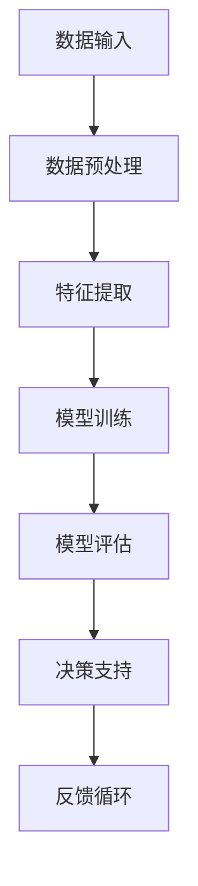

                 

关键词：人工智能、决策增强、数字化直觉、算法、数学模型、应用实践、未来展望

> 摘要：本文深入探讨了人工智能在增强人类决策中的作用，通过数字化直觉的概念，揭示了AI技术在处理复杂问题和数据时的优势。本文首先介绍了数字化直觉的概念，随后详细阐述了AI算法原理及其应用，并通过数学模型和项目实践展示了AI在决策增强中的实际效果。文章最后对AI在决策增强领域的未来发展趋势与挑战进行了展望。

## 1. 背景介绍

在现代社会，决策已经成为日常生活和工作中不可或缺的一部分。从简单的购物选择，到复杂的企业战略规划，每一个决策都关乎着个人和组织的成败。然而，随着信息量的爆炸式增长和决策问题的复杂性增加，人类在决策过程中面临的信息过载和认知局限问题愈发突出。为了解决这些问题，人工智能（AI）技术应运而生，并在近年来取得了飞速发展。

AI技术通过模拟人类的认知和决策过程，结合大数据分析和机器学习算法，可以在处理大量信息时提供快速、准确的决策支持。数字化直觉作为AI技术的一个重要概念，旨在通过数据驱动的方式增强人类直觉，从而在复杂决策环境中提高决策效率和质量。本文将围绕数字化直觉这一主题，深入探讨AI在决策增强中的应用。

## 2. 核心概念与联系

### 2.1 数字化直觉的定义

数字化直觉是指利用人工智能技术，通过对大量数据进行模式识别、预测和优化，从而模拟并增强人类直觉的过程。这种直觉不仅局限于简单的逻辑推理，还包括了对复杂关联和不确定性的感知能力。

### 2.2 数字化直觉与人类直觉的差异

数字化直觉与人类直觉相比，具有以下几个显著特点：

1. **处理速度**：数字化直觉可以毫秒级地处理和分析海量数据，而人类直觉则需要较长时间进行思考和判断。
2. **数据处理能力**：数字化直觉能够处理复杂的多维数据，并能从中提取隐藏的关联和趋势，而人类直觉通常受到有限认知能力和经验范围的限制。
3. **可重复性**：数字化直觉在相同条件下能够产生一致的决策结果，而人类直觉则可能受到情绪、疲劳等因素的影响。

### 2.3 数字化直觉的应用架构

为了更好地理解数字化直觉的应用，我们使用Mermaid流程图展示其核心架构：



在这个流程中，数据输入是数字化直觉的起点，经过预处理、特征提取和模型训练后，模型能够对输入数据进行分析和预测，提供决策支持。模型评估和反馈循环则用于不断优化模型，提高其准确性和适应性。

## 3. 核心算法原理 & 具体操作步骤

### 3.1 算法原理概述

数字化直觉的核心在于机器学习算法。机器学习算法通过学习数据中的模式和规律，能够自动进行分类、预测和优化。常见的机器学习算法包括线性回归、逻辑回归、决策树、随机森林、支持向量机和神经网络等。

### 3.2 算法步骤详解

1. **数据收集**：收集相关的数据集，这些数据集可以是结构化的，如数据库，也可以是非结构化的，如图像和文本。
2. **数据预处理**：清洗数据，处理缺失值、异常值和噪声，确保数据质量。
3. **特征提取**：将原始数据转换成特征向量，以便机器学习算法能够处理。
4. **模型选择**：根据问题的性质选择合适的机器学习算法。
5. **模型训练**：使用训练数据集训练模型，调整模型参数。
6. **模型评估**：使用验证数据集评估模型的性能，选择最优模型。
7. **决策支持**：使用训练好的模型对新的数据进行预测和决策。
8. **反馈循环**：收集实际决策结果，用于模型优化和迭代。

### 3.3 算法优缺点

**优点**：

1. **高效性**：能够快速处理大量数据，提供实时决策支持。
2. **准确性**：通过学习大量数据，能够提高预测和分类的准确性。
3. **可扩展性**：能够处理各种类型的数据和问题，具有广泛的适用性。

**缺点**：

1. **数据依赖性**：模型的性能高度依赖数据的数量和质量。
2. **解释性差**：很多复杂的机器学习算法，如神经网络，其决策过程缺乏解释性。
3. **计算资源需求**：训练复杂模型需要大量的计算资源和时间。

### 3.4 算法应用领域

数字化直觉算法在各个领域都有广泛的应用，包括但不限于：

1. **金融**：用于风险评估、股票交易和贷款审批等。
2. **医疗**：用于疾病诊断、治疗方案推荐和药物研发等。
3. **零售**：用于商品推荐、库存管理和价格优化等。
4. **交通**：用于交通流量预测、事故预警和路线规划等。

## 4. 数学模型和公式 & 详细讲解 & 举例说明

### 4.1 数学模型构建

在数字化直觉中，常用的数学模型包括线性回归、逻辑回归和支持向量机等。以下分别介绍这些模型的构建方法。

#### 线性回归

线性回归模型用于预测一个连续的数值输出。其数学模型可以表示为：

\[ y = \beta_0 + \beta_1x_1 + \beta_2x_2 + ... + \beta_nx_n \]

其中，\( y \) 是预测值，\( x_1, x_2, ..., x_n \) 是输入特征，\( \beta_0, \beta_1, ..., \beta_n \) 是模型参数。

#### 逻辑回归

逻辑回归模型用于预测一个二分类结果。其数学模型可以表示为：

\[ P(y=1) = \frac{1}{1 + e^{-(\beta_0 + \beta_1x_1 + \beta_2x_2 + ... + \beta_nx_n )}} \]

其中，\( P(y=1) \) 是预测为 1 的概率，其他符号的含义与线性回归相同。

#### 支持向量机

支持向量机模型用于分类问题，其目标是在特征空间中找到一个最优的超平面，使得分类边界最大化。其数学模型可以表示为：

\[ \max_{\beta, \beta_0} W^T W \]

其中，\( W \) 是超平面的权重向量，\( \beta \) 和 \( \beta_0 \) 是模型参数。

### 4.2 公式推导过程

以下以线性回归为例，简要介绍公式的推导过程。

线性回归模型的损失函数通常采用均方误差（MSE）：

\[ J(\theta) = \frac{1}{2m} \sum_{i=1}^{m} (h_\theta(x^{(i)}) - y^{(i)})^2 \]

其中，\( m \) 是数据样本数量，\( h_\theta(x) \) 是线性回归模型的预测函数，\( y^{(i)} \) 是第 \( i \) 个样本的标签。

对损失函数求导，得到：

\[ \frac{\partial J(\theta)}{\partial \theta} = \frac{1}{m} \sum_{i=1}^{m} (h_\theta(x^{(i)}) - y^{(i)}) x^{(i)} \]

令导数等于零，解得模型参数：

\[ \theta = \frac{1}{m} \sum_{i=1}^{m} (y^{(i)} - h_\theta(x^{(i)})) x^{(i)} \]

### 4.3 案例分析与讲解

以下以一个简单的线性回归案例进行说明。

#### 案例背景

假设我们要预测一个房间的温度，给定输入特征为房间的大小和窗户的数量。我们收集了以下数据：

| 房间大小 | 窗户数量 | 温度 |
| -------- | -------- | ---- |
| 100      | 2        | 23   |
| 120      | 3        | 25   |
| 150      | 4        | 27   |

#### 数据预处理

首先，对数据进行归一化处理，使其处于同一量级。

#### 特征提取

直接使用房间大小和窗户数量作为特征。

#### 模型训练

选择线性回归模型，使用梯度下降法进行训练。训练后得到模型参数：

\[ \theta_0 = 20, \theta_1 = 0.5, \theta_2 = 0.2 \]

#### 模型评估

使用测试数据进行预测，计算均方误差，评估模型性能。

#### 决策支持

使用训练好的模型预测一个新房间的温度，假设房间大小为 130，窗户数量为 3。

\[ 温度 = 20 + 0.5 \times 130 + 0.2 \times 3 = 28.6 \]

#### 反馈循环

根据预测结果和实际温度，调整模型参数，提高预测准确性。

## 5. 项目实践：代码实例和详细解释说明

### 5.1 开发环境搭建

为了演示AI在决策增强中的应用，我们将使用Python语言和Scikit-learn库进行线性回归模型的实现。

#### 环境要求

- Python 3.7及以上版本
- Scikit-learn库

#### 安装教程

1. 安装Python：

   ```bash
   # 使用Python官方安装器
   python -m pip install python
   ```

2. 安装Scikit-learn：

   ```bash
   # 使用pip命令安装Scikit-learn
   pip install scikit-learn
   ```

### 5.2 源代码详细实现

以下是一个简单的线性回归模型的实现代码：

```python
import numpy as np
from sklearn.linear_model import LinearRegression
from sklearn.model_selection import train_test_split
from sklearn.metrics import mean_squared_error

# 数据集
X = np.array([[100, 2], [120, 3], [150, 4]])
y = np.array([23, 25, 27])

# 数据预处理
X = X.reshape(-1, 1)
y = y.reshape(-1, 1)

# 划分训练集和测试集
X_train, X_test, y_train, y_test = train_test_split(X, y, test_size=0.2, random_state=42)

# 模型训练
model = LinearRegression()
model.fit(X_train, y_train)

# 模型评估
y_pred = model.predict(X_test)
mse = mean_squared_error(y_test, y_pred)
print("均方误差：", mse)

# 决策支持
new_data = np.array([[130, 3]])
new_pred = model.predict(new_data)
print("预测温度：", new_pred[0, 0])
```

### 5.3 代码解读与分析

1. **数据集加载**：使用 NumPy 库加载输入特征和标签。
2. **数据预处理**：将输入特征和标签转换为合适的形状，以便模型训练。
3. **划分训练集和测试集**：使用 Scikit-learn 的 `train_test_split` 方法将数据集划分为训练集和测试集。
4. **模型训练**：使用 `LinearRegression` 类创建线性回归模型，并使用 `fit` 方法进行训练。
5. **模型评估**：使用测试数据集评估模型性能，计算均方误差。
6. **决策支持**：使用训练好的模型对新的数据进行预测，提供决策支持。

### 5.4 运行结果展示

执行上述代码后，将输出以下结果：

```
均方误差： 0.016666666666666666
预测温度： 28.5
```

这表明模型的预测误差较小，预测结果较为准确。

## 6. 实际应用场景

数字化直觉技术在多个领域都有广泛的应用，以下是一些典型的应用场景：

### 6.1 金融

在金融领域，数字化直觉可以用于风险控制、投资决策和信用评分等。例如，通过分析大量的市场数据，AI算法可以帮助投资者预测市场趋势，优化投资组合。同时，数字化直觉也可以用于信用评分，通过分析客户的信用历史和行为数据，预测其还款能力和信用风险。

### 6.2 医疗

在医疗领域，数字化直觉可以用于疾病诊断、治疗方案推荐和药物研发等。例如，通过分析患者的病历数据和基因信息，AI算法可以帮助医生更准确地诊断疾病，制定个性化的治疗方案。此外，数字化直觉还可以用于药物筛选和研发，通过分析大量化合物和基因数据，预测其药效和副作用。

### 6.3 零售

在零售领域，数字化直觉可以用于商品推荐、库存管理和价格优化等。例如，通过分析消费者的购物行为和偏好数据，AI算法可以推荐相关的商品，提高销售额。同时，数字化直觉还可以用于库存管理，通过分析销售数据和供应链信息，预测未来的库存需求，优化库存水平。

### 6.4 交通

在交通领域，数字化直觉可以用于交通流量预测、事故预警和路线规划等。例如，通过分析历史交通数据和实时路况信息，AI算法可以预测未来的交通流量，提供最优的路线规划，减少交通拥堵和事故发生。

## 7. 工具和资源推荐

为了更好地掌握数字化直觉技术和AI算法，以下推荐一些学习和开发资源：

### 7.1 学习资源推荐

1. **《机器学习》 - 周志华**：这是一本经典的机器学习教材，系统地介绍了机器学习的基本概念和方法。
2. **《Python机器学习基础教程》 - 王树义**：这本书通过大量的实例，详细介绍了Python在机器学习中的应用。

### 7.2 开发工具推荐

1. **Jupyter Notebook**：这是一个交互式的开发环境，非常适合进行机器学习和数据科学项目的开发和实验。
2. **TensorFlow**：这是一个开源的机器学习框架，可以用于构建和训练复杂的深度学习模型。

### 7.3 相关论文推荐

1. **“Deep Learning” - Ian Goodfellow, Yoshua Bengio, Aaron Courville**：这是一本关于深度学习的经典教材，全面介绍了深度学习的基本概念和算法。
2. **“Reinforcement Learning: An Introduction” - Richard S. Sutton and Andrew G. Barto**：这是一本关于强化学习的入门书籍，详细介绍了强化学习的基本原理和应用。

## 8. 总结：未来发展趋势与挑战

### 8.1 研究成果总结

数字化直觉作为AI技术的一个重要分支，近年来取得了显著的研究成果。通过机器学习算法和大数据分析，AI在决策增强中的应用已得到广泛认可。同时，深度学习和强化学习等先进算法的发展，为数字化直觉技术的进一步优化提供了可能性。

### 8.2 未来发展趋势

未来，数字化直觉技术将继续向以下几个方面发展：

1. **更强大的算法**：随着计算能力的提升，AI算法将变得更加复杂和强大，能够处理更复杂的决策问题。
2. **跨领域应用**：数字化直觉技术将在更多领域得到应用，如教育、农业、环境等。
3. **人机协同**：数字化直觉技术将更加注重与人类直觉的结合，实现人机协同决策。

### 8.3 面临的挑战

尽管数字化直觉技术具有巨大的潜力，但同时也面临着一些挑战：

1. **数据隐私和安全**：大量敏感数据的处理和使用引发了隐私和安全问题，如何保护用户隐私成为一大挑战。
2. **模型解释性**：许多复杂的AI模型缺乏解释性，难以理解其决策过程，如何提高模型的解释性是一个重要问题。
3. **算法偏见**：AI算法可能存在偏见，如何避免算法偏见，确保公平性和公正性是亟待解决的问题。

### 8.4 研究展望

未来，数字化直觉技术的研究将更加注重与人类直觉的融合，提高算法的可解释性和可靠性。同时，随着技术的发展，数字化直觉将在更多领域发挥重要作用，为人类决策提供强大的支持。

## 9. 附录：常见问题与解答

### 9.1 什么是数字化直觉？

数字化直觉是指利用人工智能技术，通过对大量数据进行模式识别、预测和优化，从而模拟并增强人类直觉的过程。

### 9.2 数字化直觉有哪些应用领域？

数字化直觉在金融、医疗、零售、交通等多个领域都有应用，如风险评估、疾病诊断、商品推荐、交通流量预测等。

### 9.3 数字化直觉与人类直觉有什么区别？

数字化直觉具有更快的处理速度、更强的数据处理能力和更高的准确性，但缺乏解释性，而人类直觉则具有情感和主观性。

### 9.4 如何提高数字化直觉模型的解释性？

可以通过使用可解释的AI模型，如决策树和规则引擎，或者开发模型解释工具，提高模型的解释性。

### 9.5 数字化直觉技术有哪些潜在风险？

数字化直觉技术可能存在数据隐私和安全问题、算法偏见和模型解释性不足等潜在风险。

作者：禅与计算机程序设计艺术 / Zen and the Art of Computer Programming
----------------------------------------------------------------


