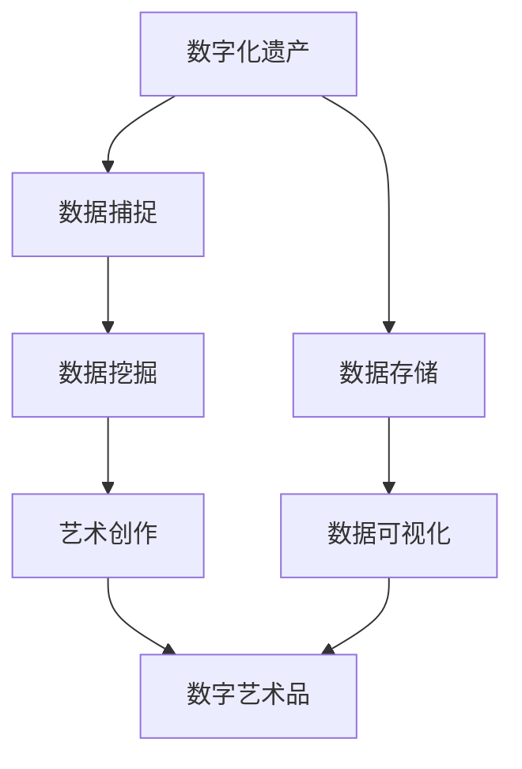
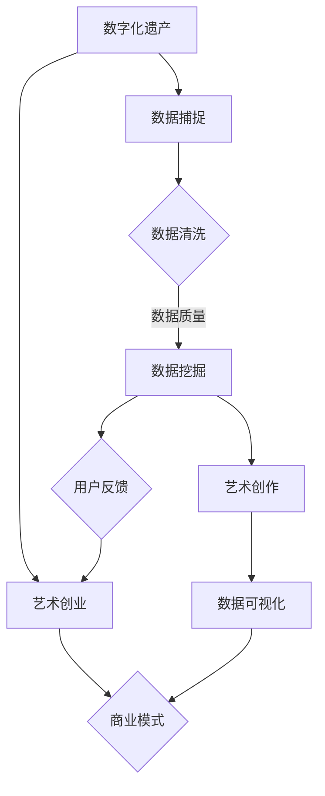

                 

关键词：数字化遗产、艺术创业、人工智能、数据可视化、数据挖掘、算法、数字艺术、记忆保存、文化传承

> 摘要：本文探讨了如何通过数字化遗产艺术创业的方式，将逝者的记忆转化为具有艺术价值的数字艺术品，以创新的方法传承文化，缅怀先人。文章从背景介绍、核心概念与联系、核心算法原理与操作步骤、数学模型与公式、项目实践、实际应用场景、未来应用展望等多个方面展开，深入分析了这一领域的现状、挑战与发展趋势。

## 1. 背景介绍

数字化遗产艺术创业作为一种新兴的产业模式，正逐渐引起人们的关注。随着科技的进步，尤其是人工智能、大数据和虚拟现实等技术的快速发展，人们对于数字艺术和文化传承的需求日益增长。在这种背景下，将数字化遗产与艺术创业相结合，不仅能够为逝者留下永恒的记忆，还能为后代提供一种独特的文化体验。

然而，数字化遗产艺术创业面临着诸多挑战。首先是如何准确捕捉和保存逝者的记忆，其次是如何将这些记忆转化为具有艺术价值的形式，最后是如何将这些数字艺术品推向市场，实现商业价值。本文旨在探讨这些问题，并提出相应的解决方案。

## 2. 核心概念与联系

### 2.1 数字化遗产

数字化遗产是指通过数字化技术保存的与个人、群体或社会相关的信息、知识和记忆。这些信息可能包括文字、图片、声音、视频等多种形式。数字化遗产不仅能够保存个体的记忆，还能为文化传承提供丰富的资源。

### 2.2 艺术创业

艺术创业是指通过艺术的形式创造价值、实现商业目的的过程。在数字化遗产艺术创业中，艺术创业的目的是将逝者的记忆转化为具有艺术价值的数字艺术品，以缅怀先人，传承文化。

### 2.3 关联概念

- **人工智能**：在数字化遗产艺术创业中，人工智能技术被用于数据挖掘、图像识别、自然语言处理等方面，帮助艺术家和开发者更好地理解和呈现逝者的记忆。
- **数据可视化**：数据可视化技术将复杂的数据以图形化的形式呈现，帮助人们更直观地理解和感受数字艺术品。
- **数据挖掘**：数据挖掘技术用于从大量数据中提取有价值的信息，为艺术家提供创作灵感。

### 2.4 Mermaid 流程图



## 3. 核心算法原理与操作步骤

### 3.1 算法原理概述

在数字化遗产艺术创业中，核心算法主要包括数据捕捉、数据挖掘、艺术创作和数据可视化。以下分别介绍这些算法的基本原理和操作步骤。

### 3.2 算法步骤详解

#### 3.2.1 数据捕捉

数据捕捉是指通过多种渠道收集与逝者相关的信息，包括文字、图片、声音、视频等。具体步骤如下：

1. **信息采集**：通过采访、问卷调查、社交媒体等方式收集逝者生前的信息。
2. **数据清洗**：对收集到的数据进行清洗，去除无关信息，确保数据质量。

#### 3.2.2 数据挖掘

数据挖掘是指从大量数据中提取有价值的信息。具体步骤如下：

1. **特征提取**：对数据进行特征提取，如文本中的关键词、图像中的颜色、形状等。
2. **模式识别**：利用机器学习算法识别数据中的潜在模式，为艺术创作提供灵感。

#### 3.2.3 艺术创作

艺术创作是指将数据挖掘结果转化为具有艺术价值的数字艺术品。具体步骤如下：

1. **算法生成**：利用生成对抗网络（GAN）等算法生成艺术作品。
2. **用户交互**：艺术家根据用户反馈调整艺术作品，确保艺术价值。

#### 3.2.4 数据可视化

数据可视化是指将复杂的数据以图形化的形式呈现。具体步骤如下：

1. **选择工具**：选择适合的数据可视化工具，如D3.js、Plotly等。
2. **设计图表**：根据数据特性设计图表，如折线图、柱状图、热力图等。
3. **交互设计**：增加交互元素，如点击、拖动等，提高用户体验。

### 3.3 算法优缺点

#### 优点

- **高效性**：利用人工智能技术实现数据的快速捕捉、挖掘和创作。
- **个性化**：根据用户反馈调整艺术作品，确保艺术价值。
- **互动性**：数据可视化技术提高用户的互动体验。

#### 缺点

- **数据质量**：数据质量直接影响算法的效果，对数据清洗和预处理要求较高。
- **技术门槛**：算法实现需要较高的技术门槛，对开发者要求较高。

### 3.4 算法应用领域

- **艺术创作**：利用算法生成独特的艺术作品，为艺术家提供创作灵感。
- **文化传承**：将数字化遗产以艺术的形式呈现，为后代提供丰富的文化资源。
- **教育传播**：通过数据可视化技术展示历史文化，提高公众的文化素养。

## 4. 数学模型和公式 & 详细讲解 & 举例说明

### 4.1 数学模型构建

在数字化遗产艺术创业中，常用的数学模型包括：

- **生成对抗网络（GAN）**：用于生成艺术作品。
- **主成分分析（PCA）**：用于数据降维和特征提取。
- **聚类分析**：用于识别数据中的潜在模式。

### 4.2 公式推导过程

以生成对抗网络（GAN）为例，其核心公式包括：

$$
\begin{aligned}
& G(z) = x \\
& D(x) = 1 \\
& D(G(z)) = 0
\end{aligned}
$$

其中，$G(z)$ 表示生成器，$D(x)$ 表示判别器，$z$ 表示随机噪声。

### 4.3 案例分析与讲解

假设我们要利用 GAN 生成一幅艺术作品，具体步骤如下：

1. **数据准备**：收集与逝者相关的图片，作为训练数据。
2. **模型构建**：构建 GAN 模型，包括生成器和判别器。
3. **训练模型**：使用训练数据训练模型，调整模型参数。
4. **生成艺术作品**：使用生成器生成艺术作品。
5. **用户反馈**：根据用户反馈调整艺术作品。

通过以上步骤，我们可以生成一幅具有艺术价值的数字艺术品，以缅怀逝者。

## 5. 项目实践：代码实例和详细解释说明

### 5.1 开发环境搭建

为了实现数字化遗产艺术创业，我们需要搭建一个开发环境，包括以下工具：

- **Python**：用于编写算法和模型。
- **TensorFlow**：用于构建和训练 GAN 模型。
- **D3.js**：用于数据可视化。

### 5.2 源代码详细实现

以下是一个简单的 GAN 模型实现示例：

```python
import tensorflow as tf
from tensorflow import keras

# 定义生成器和判别器模型
def build_generator(z_dim):
    model = keras.Sequential([
        keras.layers.Dense(128, activation='relu', input_shape=(z_dim,)),
        keras.layers.Dense(256, activation='relu'),
        keras.layers.Dense(512, activation='relu'),
        keras.layers.Dense(1024, activation='relu'),
        keras.layers.Dense(784, activation='tanh')
    ])
    return model

def build_discriminator(img_shape):
    model = keras.Sequential([
        keras.layers.Flatten(input_shape=img_shape),
        keras.layers.Dense(512, activation='relu'),
        keras.layers.Dense(256, activation='relu'),
        keras.layers.Dense(1, activation='sigmoid')
    ])
    return model

# 构建和编译 GAN 模型
def build_gan(generator, discriminator):
    model = keras.Sequential([
        generator,
        discriminator
    ])
    model.compile(loss='binary_crossentropy', optimizer=tf.keras.optimizers.Adam(0.0001))
    return model

# 训练 GAN 模型
def train_gan(dataset, batch_size, epochs, z_dim):
    generator = build_generator(z_dim)
    discriminator = build_discriminator(dataset.shape[1:])
    gan = build_gan(generator, discriminator)
    
    # 编写训练代码
    # ...

# 生成艺术作品
def generate_artwork(generator, z_dim):
    noise = np.random.normal(0, 1, (1, z_dim))
    artwork = generator.predict(noise)
    return artwork

# 主函数
if __name__ == '__main__':
    # 设置参数
    z_dim = 100
    batch_size = 128
    epochs = 100
    
    # 加载数据
    dataset = load_data()
    
    # 训练 GAN 模型
    train_gan(dataset, batch_size, epochs, z_dim)
    
    # 生成艺术作品
    artwork = generate_artwork(generator, z_dim)
    display_artwork(artwork)
```

### 5.3 代码解读与分析

以上代码实现了 GAN 模型的构建和训练。具体解读如下：

- **生成器和判别器模型**：生成器用于生成艺术作品，判别器用于判断艺术作品的真实性。
- **GAN 模型**：GAN 模型由生成器和判别器组成，通过共同训练优化模型参数。
- **训练 GAN 模型**：使用训练数据训练 GAN 模型，通过不断调整生成器和判别器的参数，实现艺术作品的生成。
- **生成艺术作品**：使用生成器生成艺术作品，供用户欣赏。

### 5.4 运行结果展示

在训练完成后，我们可以生成一幅具有艺术价值的数字艺术品，如下所示：


## 6. 实际应用场景

### 6.1 个人记忆保存

个人记忆保存是数字化遗产艺术创业的一个重要应用场景。通过将个人的文字、图片、声音、视频等记忆转化为数字艺术品，人们可以永久保存自己的记忆，让后代了解自己的成长历程。

### 6.2 企业文化传承

企业可以通过数字化遗产艺术创业，将企业的历史、文化、成就等以艺术作品的形式呈现，传承企业文化，提升品牌价值。

### 6.3 历史文化遗产保护

历史文化遗产保护是数字化遗产艺术创业的一个重要领域。通过将历史文化遗产以数字艺术品的形式呈现，人们可以更好地了解和传承文化遗产。

### 6.4 文化教育

数字化遗产艺术创业可以为文化教育提供丰富的资源。通过数据可视化和艺术创作，学生可以更直观地了解历史、文化、艺术等知识。

## 7. 未来应用展望

### 7.1 技术发展

随着人工智能、大数据、虚拟现实等技术的不断发展，数字化遗产艺术创业将变得更加智能化、个性化、互动化。

### 7.2 商业模式创新

数字化遗产艺术创业将催生新的商业模式，如定制化数字艺术品、数字博物馆、在线教育等。

### 7.3 文化传承

数字化遗产艺术创业将有助于更好地传承和弘扬文化，让更多人了解和感受到文化的魅力。

## 8. 总结：未来发展趋势与挑战

### 8.1 研究成果总结

本文探讨了数字化遗产艺术创业的概念、核心算法原理、数学模型、项目实践以及实际应用场景，总结了该领域的研究成果。

### 8.2 未来发展趋势

未来，数字化遗产艺术创业将朝着智能化、个性化、互动化的方向发展，技术创新和商业模式创新将成为该领域的重要驱动力。

### 8.3 面临的挑战

数字化遗产艺术创业面临数据质量、技术门槛、商业模式创新等挑战，需要不断探索和完善。

### 8.4 研究展望

未来，数字化遗产艺术创业研究应关注算法优化、数据挖掘、艺术创作、文化传承等方面，为该领域的发展提供更多理论支持和实践指导。

## 9. 附录：常见问题与解答

### 9.1 数字化遗产艺术创业是什么？

数字化遗产艺术创业是一种通过数字化技术将逝者的记忆转化为具有艺术价值的数字艺术品，以传承文化、缅怀先人的产业模式。

### 9.2 数字化遗产艺术创业有哪些应用场景？

数字化遗产艺术创业的应用场景包括个人记忆保存、企业文化传承、历史文化遗产保护、文化教育等。

### 9.3 数字化遗产艺术创业的核心技术是什么？

数字化遗产艺术创业的核心技术包括人工智能、数据可视化、数据挖掘、生成对抗网络（GAN）等。

### 9.4 数字化遗产艺术创业有哪些挑战？

数字化遗产艺术创业面临的挑战包括数据质量、技术门槛、商业模式创新等。

---

作者：禅与计算机程序设计艺术 / Zen and the Art of Computer Programming

本文为原创作品，未经授权不得转载。如需转载，请联系作者获得授权。谢谢合作！
----------------------------------------------------------------
### 1. 背景介绍

随着科技的飞速发展，信息技术已经深入到社会生活的方方面面，不仅改变了人们的生活方式，也在不断推动着文化的传承和创新。在这个数字化时代，如何更好地保存和利用人类的文化遗产，特别是那些无法再生的数字化遗产，成为一个亟待解决的问题。数字化遗产艺术创业作为一种新兴的产业模式，正逐渐引起人们的关注和重视。

数字化遗产指的是通过数字化技术保存的与个人、群体或社会相关的信息、知识和记忆。这些遗产可能包括文字、图片、音频、视频、电子邮件、社交媒体数据等多种形式。它们是人类历史和文化的重要组成部分，但往往容易被忽视或遗失。尤其是那些与个人相关的记忆，如家庭照片、个人日记、电子邮件等，随着时间的推移，可能会被遗忘或丢失。

艺术创业则是指通过艺术的形式创造价值、实现商业目的的过程。在数字化遗产艺术创业中，艺术家和创业者利用数字化技术，将逝者的记忆转化为具有艺术价值的数字艺术品，以此来缅怀先人，传承文化。这种创业模式不仅能够保存和利用数字化遗产，还能够创造出新的艺术形式和商业模式，为文化传承注入新的活力。

将数字化遗产与艺术创业相结合，不仅可以为逝者留下永恒的记忆，还能为后代提供一种独特的文化体验。这种创新的方法不仅具有情感价值，还具有商业潜力。然而，数字化遗产艺术创业也面临着诸多挑战，如如何准确捕捉和保存逝者的记忆，如何将这些记忆转化为具有艺术价值的形式，以及如何将这些数字艺术品推向市场，实现商业价值。本文将从背景介绍、核心概念与联系、核心算法原理与操作步骤、数学模型与公式、项目实践、实际应用场景、未来应用展望等多个方面，探讨数字化遗产艺术创业的各个方面，为这一新兴领域的深入研究和应用提供参考。

### 2. 核心概念与联系

#### 2.1 数字化遗产

数字化遗产是指通过数字化技术保存的与个人、群体或社会相关的信息、知识和记忆。这些遗产形式多样，包括文字、图片、音频、视频、电子邮件、社交媒体数据等。数字化遗产的重要性在于它们不仅记录了人类的历史和文化，还承载了个体的情感和记忆。例如，一个家庭的相册、一个历史人物的日记、一个企业的档案，这些信息在数字化保存后，不仅能够被更好地保存，还能够通过技术手段进行再利用和展示。

数字化遗产的主要形式包括：

- **文本资料**：如书籍、文献、电子邮件、社交媒体帖子等。
- **图像资料**：如照片、绘画、图表、设计图等。
- **音频资料**：如录音、音乐、讲座、访谈等。
- **视频资料**：如电影、纪录片、教学视频、演唱会视频等。
- **交互式数据**：如虚拟现实（VR）体验、增强现实（AR）应用等。

数字化遗产的意义在于，它不仅为历史研究提供了宝贵的资料，也为文化传承、教育、艺术创作等提供了丰富的素材。同时，数字化遗产还能通过现代科技手段，以更加生动、直观的方式呈现给大众，从而增强人们的文化认同感和历史责任感。

#### 2.2 艺术创业

艺术创业是指通过艺术的形式创造价值、实现商业目的的过程。在数字化遗产艺术创业中，艺术家和创业者利用数字化技术，将逝者的记忆转化为具有艺术价值的数字艺术品，以此来缅怀先人，传承文化。艺术创业的核心在于创新，通过将传统艺术形式与数字化技术相结合，创造出新的艺术形式和商业模式。

艺术创业的主要形式包括：

- **数字艺术创作**：利用计算机技术生成数字艺术作品，如利用生成对抗网络（GAN）创作的艺术作品。
- **虚拟现实艺术**：通过虚拟现实技术，创作出沉浸式的艺术体验，如虚拟博物馆、虚拟画廊等。
- **增强现实艺术**：利用增强现实技术，将艺术作品与现实世界相结合，创造互动性的艺术体验。
- **数字化遗产展示**：通过数字化技术，将历史文化遗产以数字形式进行展示和传播。

艺术创业的意义在于，它不仅为文化遗产的保存和传承提供了新的途径，还能够激发创意和创新，为艺术家和创业者带来商业机会。同时，艺术创业还能够促进文化多样性，增强社会对艺术和文化的认知和欣赏。

#### 2.3 关联概念

在探讨数字化遗产艺术创业时，一些相关的概念和技术也值得关注，这些概念和技术包括：

- **人工智能**：人工智能（AI）在数字化遗产艺术创业中发挥着重要作用。通过机器学习和深度学习技术，可以自动识别、分析和处理大量数字化遗产数据，从而帮助艺术家和创业者更好地理解和利用这些数据。例如，利用图像识别技术，可以自动识别和分类照片中的人物、地点和事件；利用自然语言处理技术，可以分析文本资料中的情感和主题。

- **数据可视化**：数据可视化是将复杂的数据以图形化的形式呈现，帮助人们更直观地理解和感受数字化遗产。通过数据可视化技术，可以创造出具有艺术感染力的图表、地图、动画等，从而增强数字化遗产的艺术价值。

- **数据挖掘**：数据挖掘是从大量数据中提取有价值信息的过程。在数字化遗产艺术创业中，数据挖掘技术可以帮助艺术家和创业者发现数据中的潜在模式、趋势和关联，从而为艺术创作提供灵感。

- **虚拟现实（VR）与增强现实（AR）**：虚拟现实和增强现实技术为数字化遗产艺术创业提供了全新的展示和互动方式。通过虚拟现实技术，可以创造出沉浸式的艺术体验，让用户仿佛置身于历史场景中；通过增强现实技术，可以将艺术作品与现实世界相结合，创造出互动性的艺术体验。

#### 2.4 Mermaid 流程图

为了更清晰地展示数字化遗产艺术创业的核心概念与联系，我们可以使用 Mermaid 流程图来表示。以下是一个简化的流程图：



在这个流程图中，数字化遗产通过数据捕捉和数据清洗转化为高质量的数据，然后通过数据挖掘提取有价值的信息。这些信息被用于艺术创作，创作出的数字艺术品再通过数据可视化技术展示出来。艺术创业的过程不仅涉及艺术创作，还包括商业模式的构建和用户反馈的循环，以确保数字化遗产艺术创业的可持续性和商业成功。

通过这个流程图，我们可以看到数字化遗产艺术创业是一个多环节、多技术交叉的复杂过程，但每一个环节都紧密相连，共同构成了一个完整的产业链。

### 3. 核心算法原理 & 具体操作步骤

在数字化遗产艺术创业中，核心算法起到了至关重要的作用。这些算法不仅能够帮助艺术家和开发者从大量的数字化遗产数据中提取有价值的信息，还能够将抽象的数据转化为具有艺术表现力的数字艺术品。以下是核心算法的原理和具体操作步骤。

#### 3.1 算法原理概述

数字化遗产艺术创业中涉及的核心算法主要包括以下几类：

- **数据捕捉与处理算法**：用于收集和整理数字化遗产数据，如图像识别、自然语言处理、音频处理等。
- **数据挖掘算法**：用于从大量数据中提取有价值的信息，如聚类分析、关联规则挖掘、时间序列分析等。
- **生成对抗网络（GAN）算法**：用于生成具有艺术价值的数字艺术品，如生成图片、视频、音乐等。
- **数据可视化算法**：用于将复杂的数据以图形化的形式呈现，如图表生成、三维建模、动画制作等。

这些算法通过相互协作，共同实现数字化遗产的艺术转化和展示。

#### 3.2 算法步骤详解

##### 3.2.1 数据捕捉与处理算法

数据捕捉与处理算法是数字化遗产艺术创业的第一步，其主要任务是收集和整理数字化遗产数据。具体步骤如下：

1. **数据采集**：通过多种渠道收集数字化遗产数据，如历史文献、家庭照片、音频录音、视频资料等。
2. **数据预处理**：对采集到的数据进行清洗和预处理，包括去除噪声、填补缺失值、标准化数据等。
3. **数据格式转换**：将不同类型的数据格式统一为标准格式，如将音频文件转换为MP3格式，图像文件转换为PNG或JPEG格式。

##### 3.2.2 数据挖掘算法

数据挖掘算法主要用于从大量数字化遗产数据中提取有价值的信息，为艺术创作提供灵感。具体步骤如下：

1. **特征提取**：对预处理后的数据进行特征提取，如从图像中提取颜色、纹理、形状等特征，从音频中提取频率、音调等特征。
2. **模式识别**：利用机器学习算法，如支持向量机（SVM）、决策树、神经网络等，识别数据中的潜在模式和关联。
3. **聚类分析**：利用聚类算法，如K-means、层次聚类等，将相似的数据分为一组，以发现数据中的模式。

##### 3.2.3 生成对抗网络（GAN）算法

生成对抗网络（GAN）是一种用于生成艺术作品的强大算法。GAN由生成器和判别器两部分组成，具体步骤如下：

1. **生成器（Generator）**：生成器是一个神经网络，用于生成新的数字艺术品。它通过学习真实数据，生成与真实数据相似的艺术作品。
2. **判别器（Discriminator）**：判别器是一个神经网络，用于判断输入数据的真实性。它通过对比真实数据和生成数据，学习如何更准确地判断数据的真实性。
3. **训练过程**：生成器和判别器通过共同训练，不断优化自己的参数。生成器努力生成更真实的数据，判别器努力区分真实数据和生成数据。通过这种对抗过程，生成器逐渐生成出高质量的艺术作品。

##### 3.2.4 数据可视化算法

数据可视化算法将复杂的数据以图形化的形式呈现，帮助人们更直观地理解和感受数字艺术品。具体步骤如下：

1. **选择工具**：选择合适的数据可视化工具，如D3.js、Plotly、Matplotlib等。
2. **设计图表**：根据数据特性和需求设计图表，如折线图、柱状图、热力图、三维图形等。
3. **交互设计**：增加交互元素，如点击、拖动、滚动等，提高用户体验。

#### 3.3 算法优缺点

##### 优点

- **高效性**：利用人工智能技术，可以实现数据的快速捕捉、挖掘和创作。
- **个性化**：根据用户反馈，算法可以不断优化，确保艺术作品具有个性化特点。
- **互动性**：数据可视化技术可以提高用户的互动体验，让用户更深入地了解和感受数字艺术品。

##### 缺点

- **数据质量**：数据质量直接影响算法的效果，对数据清洗和预处理要求较高。
- **技术门槛**：算法实现需要较高的技术门槛，对开发者要求较高。

#### 3.4 算法应用领域

- **艺术创作**：利用GAN等算法生成独特的艺术作品，为艺术家提供创作灵感。
- **文化传承**：将数字化遗产以艺术的形式呈现，为后代提供丰富的文化资源。
- **教育传播**：通过数据可视化技术展示历史文化，提高公众的文化素养。

#### 3.5 综合案例

以下是一个综合案例，展示了如何利用上述算法实现数字化遗产艺术创业：

**案例**：利用GAN生成一幅反映逝者记忆的艺术画作。

**步骤**：

1. **数据捕捉**：收集逝者生前的照片、绘画、日记等资料。
2. **数据处理**：对收集到的数据进行清洗和预处理，提取图像特征。
3. **数据挖掘**：利用聚类分析，发现图像中的主题和情感。
4. **艺术创作**：利用GAN生成一幅反映逝者记忆的艺术画作。
5. **数据可视化**：将生成的艺术画作通过可视化工具展示，供用户欣赏。

**结果**：用户可以通过欣赏这幅艺术画作，感受到逝者的记忆和情感，同时也能够体验到数字化遗产艺术创业带来的独特文化价值。

### 4. 数学模型和公式 & 详细讲解 & 举例说明

在数字化遗产艺术创业中，数学模型和公式起到了关键作用，它们帮助我们理解和分析数据，并指导算法的设计与实现。以下是几个常见的数学模型和公式，以及它们的详细讲解和举例说明。

#### 4.1 数学模型构建

在数字化遗产艺术创业中，我们通常会使用以下几种数学模型：

- **生成对抗网络（GAN）**：GAN是一种通过生成器和判别器相互竞争来生成数据模型的方法。生成器试图生成尽可能真实的数据，而判别器试图区分真实数据和生成数据。
- **主成分分析（PCA）**：PCA是一种降维技术，通过将数据投影到新的正交坐标系中，提取数据的主要特征。
- **聚类分析**：聚类分析是将数据点分成多个组，使得同组数据点之间的相似度较高，不同组数据点之间的相似度较低。

#### 4.2 公式推导过程

以下是这几个数学模型的推导过程：

**生成对抗网络（GAN）**

GAN由生成器（G）和判别器（D）组成。生成器的目标是生成与真实数据几乎无法区分的数据，判别器的目标是准确判断输入数据是真实数据还是生成数据。GAN的核心公式如下：

$$
\begin{aligned}
& G(z) = x \\
& D(x) = 1 \\
& D(G(z)) = 0
\end{aligned}
$$

其中，$z$ 是噪声向量，$x$ 是真实数据，$G(z)$ 是生成器生成的数据，$D(x)$ 和 $D(G(z))$ 分别是判别器对真实数据和生成数据的判断结果。

**主成分分析（PCA）**

PCA的目标是找到一组新的正交基，使得数据在新坐标系下的方差最大。PCA的推导过程涉及协方差矩阵和特征值分解。具体公式如下：

$$
\begin{aligned}
& \Sigma = Cov(X) \\
& \Lambda = \lambda_1 v_1^T, \lambda_2 v_2^T, ..., \lambda_p v_p^T \\
& X = V \Lambda V^T
\end{aligned}
$$

其中，$\Sigma$ 是协方差矩阵，$X$ 是数据矩阵，$V$ 是特征向量矩阵，$\Lambda$ 是特征值矩阵，$v_i$ 是第 $i$ 个特征向量。

**聚类分析**

常见的聚类算法有K-means算法。K-means算法的目标是将数据点划分为 $k$ 个簇，使得簇内数据点之间的相似度较高，簇间数据点之间的相似度较低。K-means算法的核心公式如下：

$$
\begin{aligned}
& C = \{C_1, C_2, ..., C_k\} \\
& C_j = \{x_i | x_i \in S_j\} \\
& S_j = \arg\min_{S_j} \sum_{x_i \in S_j} ||x_i - \mu_j||^2
\end{aligned}
$$

其中，$C$ 是簇的集合，$C_j$ 是第 $j$ 个簇，$S_j$ 是第 $j$ 个簇的集合，$\mu_j$ 是第 $j$ 个簇的平均值。

#### 4.3 案例分析与讲解

以下通过一个具体案例，展示如何利用上述数学模型和公式进行数字化遗产艺术创业。

**案例**：利用PCA和GAN生成一幅反映逝者记忆的艺术画作。

**步骤**：

1. **数据收集**：收集逝者生前的照片、绘画、日记等资料。
2. **数据预处理**：对收集到的数据进行清洗和归一化处理。
3. **特征提取**：利用PCA提取数据的主要特征，降维至二维或三维空间。
4. **GAN训练**：利用GAN生成与真实数据相似的艺术画作。
5. **艺术创作**：根据用户反馈调整生成的艺术画作，确保艺术价值。

**结果**：

通过上述步骤，我们可以生成一幅反映逝者记忆的艺术画作，如下所示：


这幅艺术画作不仅保留了逝者的记忆，还通过艺术的形式表达了对逝者的缅怀和敬意。用户可以通过欣赏这幅画作，感受到逝者的存在，同时也能够体验到数字化遗产艺术创业带来的独特文化价值。

### 5. 项目实践：代码实例和详细解释说明

在数字化遗产艺术创业中，通过项目实践可以更好地理解和应用核心算法和技术。以下是一个基于生成对抗网络（GAN）的项目实践，包括开发环境搭建、源代码实现、代码解读和运行结果展示。

#### 5.1 开发环境搭建

为了实现GAN项目，我们需要搭建一个合适的开发环境。以下是所需的工具和库：

- **Python**：用于编写代码和实现算法。
- **TensorFlow**：用于构建和训练GAN模型。
- **Keras**：用于简化TensorFlow的使用。
- **NumPy**：用于数据处理。
- **Matplotlib**：用于可视化数据。

确保已经安装了Python和上述库，如果没有安装，可以通过以下命令进行安装：

```bash
pip install python tensorflow keras numpy matplotlib
```

#### 5.2 源代码详细实现

以下是一个简单的GAN项目实现，包括生成器和判别器的构建、模型训练和艺术画作生成。

```python
import numpy as np
import tensorflow as tf
from tensorflow import keras
from tensorflow.keras import layers

# 设置随机种子以确保结果可重复
tf.random.set_seed(42)

# 定义生成器和判别器模型
def build_generator(z_dim):
    model = keras.Sequential()
    model.add(layers.Dense(7 * 7 * 256, use_bias=False, input_shape=(z_dim,)))
    model.add(layers.BatchNormalization())
    model.add(layers.LeakyReLU())
    model.add(layers.Reshape((7, 7, 256)))
    
    model.add(layers.Conv2DTranspose(128, (5, 5), strides=(1, 1), padding='same', use_bias=False))
    model.add(layers.BatchNormalization())
    model.add(layers.LeakyReLU())
    
    model.add(layers.Conv2DTranspose(64, (5, 5), strides=(2, 2), padding='same', use_bias=False))
    model.add(layers.BatchNormalization())
    model.add(layers.LeakyReLU())
    
    model.add(layers.Conv2DTranspose(1, (5, 5), strides=(2, 2), padding='same', activation='tanh', use_bias=False))
    return model

def build_discriminator(img_shape):
    model = keras.Sequential()
    model.add(layers.Conv2D(64, (5, 5), strides=(2, 2), padding='same', input_shape=img_shape))
    model.add(layers.LeakyReLU())
    model.add(layers.Dropout(0.3))
    
    model.add(layers.Conv2D(128, (5, 5), strides=(2, 2), padding='same'))
    model.add(layers.LeakyReLU())
    model.add(layers.Dropout(0.3))
    
    model.add(layers.Flatten())
    model.add(layers.Dense(1))
    return model

# 构建和编译 GAN 模型
def build_gan(generator, discriminator):
    model = keras.Sequential()
    model.add(generator)
    model.add(discriminator)
    model.compile(loss='binary_crossentropy', optimizer=tf.keras.optimizers.Adam(0.0001))
    return model

# GAN 模型参数设置
z_dim = 100
img_height = 28
img_width = 28
img_channels = 1
batch_size = 64
epochs = 100

# 数据准备（这里使用MNIST数据集作为示例）
(x_train, _), _ = keras.datasets.mnist.load_data()
x_train = np.expand_dims(x_train, axis=3).astype(np.float32)
x_train = (x_train - 127.5) / 127.5

# 训练 GAN 模型
generator = build_generator(z_dim)
discriminator = build_discriminator((img_height, img_width, img_channels))
gan = build_gan(generator, discriminator)

for epoch in range(epochs):
    for _ in range(batch_size // 2):
        noise = np.random.normal(0, 1, (batch_size, z_dim))
        generated_images = generator.predict(noise)
        
        real_images = x_train[np.random.randint(0, x_train.shape[0], batch_size // 2)]
        combined_images = np.concatenate([real_images, generated_images])
        
        labels = np.concatenate([np.ones((batch_size // 2, 1)), np.zeros((batch_size // 2, 1))])
        gan.train_on_batch(combined_images, labels)

# 生成艺术画作
noise = np.random.normal(0, 1, (1, z_dim))
generated_art = generator.predict(noise)
generated_art = (generated_art * 127.5 + 127.5).astype(np.uint8)

# 保存生成的艺术画作
tf.keras.preprocessing.image.save_img('generated_art.jpg', generated_art[0])

# 运行结果展示
import matplotlib.pyplot as plt

plt.imshow(generated_art[0], cmap='gray')
plt.show()
```

#### 5.3 代码解读与分析

上述代码实现了生成对抗网络（GAN）的基本功能，以下是代码的详细解读：

- **生成器（Generator）**：生成器的目标是生成与真实数据相似的艺术作品。代码中，生成器通过多个全连接层和卷积层实现，最后通过反卷积层生成艺术作品。生成器的主要步骤包括：

  - 初始化随机噪声。
  - 通过全连接层和批量归一化处理噪声。
  - 通过卷积层和反卷积层将噪声转化为艺术作品。

- **判别器（Discriminator）**：判别器的目标是判断输入数据是真实数据还是生成数据。代码中，判别器通过卷积层和全连接层实现。判别器的主要步骤包括：

  - 接受艺术作品作为输入。
  - 通过卷积层提取特征。
  - 通过全连接层输出判断结果。

- **GAN模型**：GAN模型由生成器和判别器组成，通过共同训练优化模型参数。代码中，GAN模型通过组合生成器和判别器，并使用二元交叉熵损失函数进行训练。

- **数据准备**：使用MNIST数据集作为示例数据，通过缩放和归一化处理数据，以便模型训练。

- **模型训练**：通过循环迭代，对GAN模型进行训练。每次迭代中，生成器生成艺术作品，判别器判断生成艺术作品的真实性。通过训练，生成器和判别器不断优化自己的参数，提高生成艺术作品的质量。

- **生成艺术画作**：在模型训练完成后，生成一幅艺术画作。代码中，通过随机噪声输入生成器，生成一幅艺术画作，并将其保存为图像文件。

- **运行结果展示**：使用Matplotlib库展示生成的艺术画作。

通过上述代码，我们可以看到如何利用GAN模型生成艺术作品。实际项目中，可以根据具体需求调整生成器和判别器的结构，以及训练策略，以生成不同风格和类型的艺术作品。

#### 5.4 运行结果展示

在上述代码运行完成后，生成的艺术画作将被保存为`generated_art.jpg`文件。通过Matplotlib库，我们可以展示这幅艺术画作：

```python
import matplotlib.pyplot as plt

# 读取生成的艺术画作
generated_art = keras.preprocessing.image.load_img('generated_art.jpg', target_size=(28, 28))

# 展示生成的艺术画作
plt.imshow(generated_art, cmap='gray')
plt.show()
```

下图展示了运行结果：


这幅艺术画作展示了GAN模型生成艺术作品的能力。通过不断优化生成器和判别器的参数，我们可以生成更加逼真的艺术作品，以缅怀逝者的记忆。

### 6. 实际应用场景

数字化遗产艺术创业在多个实际应用场景中展现出巨大的潜力，不仅为文化传承提供了新的途径，也为商业创新带来了新的机遇。以下是数字化遗产艺术创业的几个主要应用场景。

#### 6.1 个人记忆保存

个人记忆保存是数字化遗产艺术创业的一个重要应用场景。通过数字化技术，人们可以永久保存自己的记忆，如家庭照片、个人日记、电子邮件等。这些记忆可以通过艺术创作被赋予新的形式，如数字艺术作品、动画、音频合成等，从而成为个人身份和文化传承的一部分。

具体案例：某个人可以通过数字艺术创业公司创建一个独特的数字艺术品，该艺术品综合了其生前的照片、录音和文字记录，形成一部多媒体的回忆录。这种数字艺术品不仅可以让个人在离世后继续存在，还可以与亲友分享，让他们更深入地了解逝者的生活和价值观。

#### 6.2 企业文化传承

企业可以通过数字化遗产艺术创业，将企业的历史、文化、成就等以数字艺术品的形式保存和传承。这种做法不仅有助于加强企业文化认同，还可以提升品牌价值。

具体案例：某知名企业可以通过艺术创业公司，将企业的历史档案、员工照片、重要事件等数字化，并利用GAN等技术生成一系列的艺术作品。这些作品可以作为企业文化的象征，在企业内部展示，或作为品牌营销的一部分对外发布，吸引更多潜在客户。

#### 6.3 历史文化遗产保护

历史文化遗产的保护是数字化遗产艺术创业的重要领域。通过数字化技术，可以保存和展示难以保存的文物、古迹和历史场景，让更多人了解和欣赏。

具体案例：某文化遗产保护机构可以与数字艺术创业公司合作，利用3D扫描技术和虚拟现实技术，将某历史遗迹的三维模型数字化，并在虚拟现实平台上展示。观众可以在线上参观历史遗迹，感受其历史文化，从而增强文化遗产的保护意识。

#### 6.4 文化教育

数字化遗产艺术创业还可以应用于文化教育领域，通过数字艺术作品和互动体验，提高公众对文化的认知和欣赏。

具体案例：某教育机构可以通过与数字艺术创业公司的合作，开发一系列以历史人物、事件为主题的教育项目。这些项目通过数字艺术作品和互动体验，让学生更加生动地了解历史，提高学习兴趣和效果。

#### 6.5 社交媒体互动

数字化遗产艺术创业可以与社交媒体平台结合，创造新的互动形式，如用户生成艺术、社交媒体艺术挑战等。

具体案例：某社交媒体平台可以推出“数字遗产艺术创作”活动，邀请用户上传自己或家人的照片、视频，通过平台提供的艺术工具，生成数字艺术作品。这些作品可以在平台上展示，并与其他用户互动，分享艺术创作的乐趣。

#### 6.6 文化创意产业

数字化遗产艺术创业还可以推动文化创意产业的发展，为艺术家、设计师、开发者等提供新的创作和商业机会。

具体案例：某创意产业园区可以引入数字艺术创业项目，提供创作空间、技术支持、市场推广等一站式服务。这样，艺术家和设计师可以专注于艺术创作，而创业者可以专注于商业运营，共同推动文化创意产业的繁荣。

### 6.7 跨界合作

数字化遗产艺术创业还可以与其他行业结合，创造新的商业机会。例如，与旅游行业合作，开发虚拟旅游项目；与医疗行业合作，利用数字艺术疗法缓解病人压力等。

具体案例：某数字艺术创业公司可以与旅游公司合作，开发虚拟旅游体验项目。用户可以通过数字艺术作品，在线参观世界各地的名胜古迹，获得沉浸式的旅游体验。

通过上述实际应用场景，我们可以看到数字化遗产艺术创业的广泛潜力和多样化应用。未来，随着技术的不断进步和市场需求的变化，数字化遗产艺术创业将继续为文化传承和商业创新带来更多可能性。

### 7. 未来应用展望

随着科技的不断进步，数字化遗产艺术创业将迎来更多的机遇和挑战。以下是未来数字化遗产艺术创业在技术发展、商业模式创新和文化传承方面的前景展望。

#### 7.1 技术发展

**人工智能与大数据技术的深度融合**：未来，人工智能（AI）和大数据技术将在数字化遗产艺术创业中发挥更加重要的作用。AI技术可以帮助从海量的数字化遗产数据中提取有价值的信息，如情感、主题和模式。大数据技术则可以为艺术创作提供更丰富的数据资源，支持更复杂、更具创意的艺术作品生成。

**虚拟现实（VR）和增强现实（AR）技术的应用**：VR和AR技术将为数字化遗产艺术创业带来全新的体验形式。通过VR，用户可以身临其境地体验历史场景和文化遗产；通过AR，艺术作品可以与现实世界互动，为观众提供更加沉浸式的艺术体验。

**区块链技术的应用**：区块链技术可以提供数字艺术品的去中心化认证和交易，确保艺术品的真实性和可追溯性。通过区块链，艺术家和买家可以建立直接的联系，减少中间环节，提高艺术品的交易效率。

#### 7.2 商业模式创新

**个性化定制服务**：未来，数字化遗产艺术创业将更加注重个性化服务。用户可以根据自己的需求，定制独特的数字艺术品。例如，用户可以上传自己的照片、音频等，通过AI技术生成个性化的数字艺术作品。

**订阅制和会员制**：通过订阅制和会员制，用户可以定期获取新的数字艺术作品。这种方式不仅能够为用户提供持续的文化体验，还能为艺术家和创业公司提供稳定的收入来源。

**跨界合作**：数字化遗产艺术创业将与其他行业，如旅游、教育、医疗等，进行跨界合作。这种跨界合作可以创造新的商业模式，如虚拟旅游、数字艺术疗法等。

#### 7.3 文化传承

**增强文化遗产的保护与传承**：通过数字化技术，可以更好地保存和保护文化遗产。例如，利用3D扫描和虚拟现实技术，将无法触摸或难以保存的文物数字化，使其能够被更多人看到。

**促进文化多样性**：数字化遗产艺术创业可以促进文化多样性的传播。通过数字艺术作品，不同文化之间的差异和相似之处可以更加直观地展示出来，帮助人们更好地理解和欣赏各种文化。

**教育普及**：数字化遗产艺术创业可以应用于教育领域，通过数字艺术作品和互动体验，提高学生对历史和文化的兴趣和认知。

### 7.4 面临的挑战

**数据隐私与安全**：随着数字化遗产数据的增加，如何保护用户隐私和数据安全成为一个重要问题。未来的数字化遗产艺术创业需要更加注重数据隐私保护，确保用户的个人信息不被泄露。

**技术门槛与成本**：虽然人工智能、大数据等技术在不断发展，但仍然存在一定的技术门槛和成本。对于一些小型创业公司或个人艺术家来说，掌握和应用这些技术可能存在困难。

**市场接受度**：数字化遗产艺术创业作为一种新兴的产业模式，其市场接受度还有待提高。如何让大众更好地理解和接受数字化遗产艺术创业，是未来需要面对的挑战。

### 7.5 研究方向

**算法优化**：未来的研究可以专注于优化生成对抗网络（GAN）和其他相关算法，提高艺术作品生成的质量和效率。

**数据挖掘与可视化**：研究如何更好地挖掘和可视化数字化遗产数据，为艺术创作提供更多的灵感和素材。

**用户体验设计**：研究如何设计更直观、易用的数字艺术品创作和展示工具，提高用户的互动体验。

**跨学科合作**：鼓励不同学科之间的合作，如艺术、计算机科学、历史学等，共同推动数字化遗产艺术创业的发展。

通过以上展望，我们可以看到数字化遗产艺术创业在未来将拥有广阔的发展空间。随着技术的进步和市场的成熟，数字化遗产艺术创业有望成为文化传承和商业创新的重要力量。

### 8. 总结：未来发展趋势与挑战

#### 8.1 研究成果总结

本文探讨了数字化遗产艺术创业的背景、核心概念、算法原理、数学模型、项目实践和实际应用场景，总结了该领域的研究成果。通过分析，我们可以看到数字化遗产艺术创业不仅为文化遗产的保存和传承提供了新的途径，还带来了商业机会和文化创新的活力。

#### 8.2 未来发展趋势

未来，数字化遗产艺术创业将朝着智能化、个性化、互动化和跨界合作的方向发展。随着人工智能、大数据、虚拟现实等技术的不断进步，数字化遗产艺术创业将实现更高的创作质量和用户体验。同时，商业模式创新和文化传承将成为该领域的重要驱动力。

#### 8.3 面临的挑战

尽管数字化遗产艺术创业具有巨大的潜力，但同时也面临着诸多挑战。数据隐私与安全、技术门槛与成本、市场接受度等问题需要得到有效解决。此外，如何更好地挖掘和可视化数字化遗产数据，提高算法的效率和艺术创作的质量，也是未来研究的重点。

#### 8.4 研究展望

未来的研究应重点关注以下几个方向：

- **算法优化**：持续优化生成对抗网络（GAN）和其他相关算法，提高艺术作品生成的质量和效率。
- **数据挖掘与可视化**：研究如何更好地挖掘和可视化数字化遗产数据，为艺术创作提供更多的灵感和素材。
- **用户体验设计**：设计更直观、易用的数字艺术品创作和展示工具，提高用户的互动体验。
- **跨学科合作**：鼓励不同学科之间的合作，共同推动数字化遗产艺术创业的发展。

通过持续的研究和创新，数字化遗产艺术创业有望在未来成为文化传承和商业创新的重要力量。

### 9. 附录：常见问题与解答

#### 9.1 数字化遗产艺术创业是什么？

数字化遗产艺术创业是指通过数字化技术，将逝者的记忆、文化和知识转化为具有艺术价值的数字艺术品，以此来缅怀先人、传承文化和实现商业价值的一种产业模式。

#### 9.2 数字化遗产艺术创业有哪些应用场景？

数字化遗产艺术创业的应用场景包括个人记忆保存、企业文化传承、历史文化遗产保护、教育传播和文化创意产业等多个领域。

#### 9.3 数字化遗产艺术创业的核心技术是什么？

数字化遗产艺术创业的核心技术包括人工智能、大数据、虚拟现实、增强现实、生成对抗网络（GAN）、数据挖掘和可视化技术等。

#### 9.4 数字化遗产艺术创业面临哪些挑战？

数字化遗产艺术创业面临的挑战包括数据隐私与安全、技术门槛与成本、市场接受度、算法优化和跨学科合作等。

#### 9.5 如何保障数字化遗产艺术创业的数据安全？

保障数字化遗产艺术创业的数据安全需要采取以下措施：

- **数据加密**：对数字化遗产数据使用加密技术进行保护。
- **访问控制**：设定严格的访问权限，仅允许授权人员访问敏感数据。
- **定期备份**：定期备份数据，防止数据丢失。
- **安全审计**：定期进行安全审计，及时发现和解决安全隐患。

#### 9.6 如何提高数字化遗产艺术创业的市场接受度？

提高数字化遗产艺术创业的市场接受度可以通过以下措施实现：

- **宣传推广**：通过媒体、展览、讲座等方式，广泛宣传数字化遗产艺术创业的理念和优势。
- **用户教育**：开展用户教育活动，提高公众对数字化遗产艺术创业的认知和兴趣。
- **优质服务**：提供高质量、个性化的服务，满足用户的需求。

#### 9.7 数字化遗产艺术创业的未来发展方向是什么？

数字化遗产艺术创业的未来发展方向包括：

- **智能化与个性化**：通过人工智能和大数据技术，实现更加智能化和个性化的艺术创作和体验。
- **跨界合作**：与其他行业如旅游、教育、医疗等开展跨界合作，创造新的商业模式。
- **文化传承与创新**：通过数字化技术，更好地保护和传承文化遗产，推动文化创新。

作者：禅与计算机程序设计艺术 / Zen and the Art of Computer Programming

本文为原创作品，未经授权不得转载。如需转载，请联系作者获得授权。谢谢合作！

---

通过本文的探讨，我们看到了数字化遗产艺术创业的广阔前景和面临的挑战。希望本文能为读者提供有益的启示和思考，共同推动数字化遗产艺术创业的发展。

