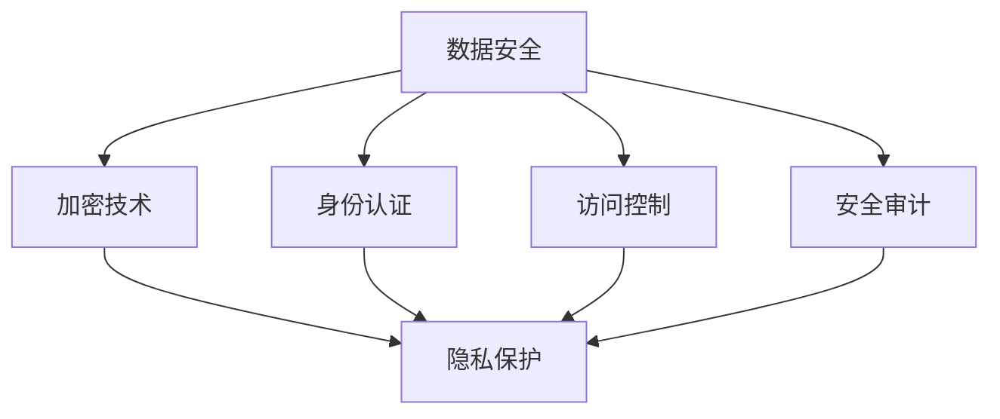

                 

随着数字经济的快速发展，数据安全和隐私问题已经成为全球关注的焦点。在这个时代，数据被认为是新的石油，而数据安全和隐私保护则成为了确保数据价值得到充分发挥的关键因素。本文将深入探讨数字经济背景下数据安全和隐私问题的挑战，并提出相应的解决策略。

## 关键词

- 数字经济
- 数据安全
- 隐私保护
- 数据加密
- 安全协议
- 法律法规

## 摘要

本文旨在分析数字经济中数据安全和隐私保护的挑战，阐述核心概念，介绍相关算法原理和数学模型，并通过具体案例和代码实例展示实际应用。最后，本文将对未来发展趋势和面临的挑战进行展望，并提出一些建议。

## 1. 背景介绍

数字经济（Digital Economy）是指基于数字技术和网络基础设施，以数据为核心进行生产、分配和消费的经济活动。随着互联网、云计算、大数据和人工智能等技术的快速发展，数字经济已经深入到我们日常生活的方方面面。然而，数字经济的快速发展也带来了数据安全和隐私保护方面的挑战。

### 数据安全

数据安全是指保护数据免受未经授权的访问、使用、披露、破坏、修改或破坏的一系列措施。随着数据的爆炸性增长，数据安全成为了企业和个人都必须关注的重要问题。

### 隐私保护

隐私保护是指确保个人信息的保密性、完整性和可用性，防止个人隐私被未经授权的访问和滥用。在数字经济中，个人数据的收集、存储和使用越来越普遍，隐私保护问题也日益凸显。

## 2. 核心概念与联系

在探讨数据安全和隐私保护之前，我们需要了解一些核心概念和它们之间的关系。

### 数据安全的核心概念

- **加密技术**：通过加密算法将数据转换成密文，确保数据在传输和存储过程中不被窃取或篡改。
- **身份认证**：通过验证用户的身份，确保只有授权用户才能访问受保护的数据。
- **访问控制**：通过设置访问权限，限制对数据的访问范围。
- **安全审计**：记录系统中的操作行为，以便在发生安全事件时进行追踪和调查。

### 隐私保护的核心概念

- **匿名化**：通过删除或隐藏个人身份信息，使数据无法直接识别特定个人。
- **数据脱敏**：对敏感数据进行处理，使其无法被轻易解读。
- **隐私政策**：明确告知用户其数据将被如何收集、使用和共享。
- **隐私合规**：遵守相关法律法规，确保数据收集和使用符合隐私保护要求。

下面是这些概念之间的联系及其架构的 Mermaid 流程图：



## 3. 核心算法原理 & 具体操作步骤

### 3.1 算法原理概述

在数据安全和隐私保护方面，有许多核心算法被广泛应用。以下是其中几个关键算法的原理概述：

- **对称加密算法**：使用相同的密钥对数据进行加密和解密。
- **非对称加密算法**：使用一对密钥（公钥和私钥）进行加密和解密。
- **哈希算法**：将数据转换成固定长度的字符串，用于验证数据的完整性和真实性。
- **数字签名**：使用私钥对数据进行签名，确保数据的完整性和真实性。

### 3.2 算法步骤详解

- **对称加密算法**：

  1. 选择一个密钥和加密算法。
  2. 使用密钥对数据进行加密。
  3. 使用相同的密钥对密文进行解密。

- **非对称加密算法**：

  1. 生成一对密钥（公钥和私钥）。
  2. 使用公钥对数据进行加密。
  3. 使用私钥对密文进行解密。

- **哈希算法**：

  1. 选择一个哈希算法。
  2. 将数据输入到哈希算法中。
  3. 获取哈希值。

- **数字签名**：

  1. 选择一个签名算法。
  2. 使用私钥对数据进行签名。
  3. 使用公钥验证签名。

### 3.3 算法优缺点

- **对称加密算法**：

  - 优点：计算速度快，加密和解密过程简单。
  - 缺点：密钥管理复杂，不适用于大规模分布式系统。

- **非对称加密算法**：

  - 优点：密钥管理简单，适用于大规模分布式系统。
  - 缺点：计算速度较慢，加密和解密过程复杂。

- **哈希算法**：

  - 优点：速度快，哈希值固定长度，不易被破解。
  - 缺点：无法解密，不适用于需要逆向操作的场景。

- **数字签名**：

  - 优点：确保数据的完整性和真实性，防止篡改。
  - 缺点：计算速度较慢，需要额外的存储空间。

### 3.4 算法应用领域

- **对称加密算法**：常用于存储敏感数据，如数据库加密。

- **非对称加密算法**：常用于数据传输过程中的加密和解密，如SSL/TLS协议。

- **哈希算法**：常用于数据完整性验证，如文件校验和。

- **数字签名**：常用于数据认证和授权，如电子邮件签名。

## 4. 数学模型和公式 & 详细讲解 & 举例说明

### 4.1 数学模型构建

在数据安全和隐私保护领域，有许多数学模型被广泛应用。以下是几个关键模型：

- **密码学**：研究加密算法和密钥管理。
- **信息论**：研究信息传递和存储的原理。
- **概率论**：研究数据的随机性和不确定性。

### 4.2 公式推导过程

- **加密算法**：

  假设数据为 \(D\)，加密算法为 \(E(k)\)，密钥为 \(k\)，则加密后的数据为 \(C = E(k, D)\)。

  解密算法为 \(D' = D(k, C)\)。

- **哈希算法**：

  假设数据为 \(D\)，哈希算法为 \(H(D)\)，则哈希值为 \(H(D) = S\)。

- **数字签名**：

  假设数据为 \(D\)，签名算法为 \(S(k)\)，私钥为 \(k\)，则签名结果为 \(S = S(k, D)\)。

  验证算法为 \(V(k, D, S) = \text{true}\) 或 \(V(k, D, S) = \text{false}\)。

### 4.3 案例分析与讲解

假设有一个文件传输场景，我们需要确保文件在传输过程中的完整性和真实性。以下是具体的操作步骤：

1. **加密文件**：

   - 选择对称加密算法，如AES。
   - 生成密钥 \(k\)。
   - 使用密钥对文件进行加密，得到密文 \(C\)。

2. **哈希验证**：

   - 选择哈希算法，如SHA-256。
   - 对文件进行哈希处理，得到哈希值 \(S\)。

3. **数字签名**：

   - 选择数字签名算法，如RSA。
   - 使用私钥对文件哈希值进行签名，得到签名结果 \(S'\)。

4. **传输文件**：

   - 将加密后的文件 \(C\)、哈希值 \(S\) 和签名结果 \(S'\) 一起传输。

5. **接收方验证**：

   - 使用公钥对签名结果 \(S'\) 进行解签，得到 \(S''\)。
   - 使用哈希算法对文件进行哈希处理，得到哈希值 \(S'''\)。
   - 比较哈希值 \(S'''\) 和传输时接收到的哈希值 \(S\)，如果相等，则文件未被篡改。
   - 比较签名结果 \(S''\) 和接收到的签名结果 \(S'\)，如果相等，则文件未被篡改，且来自合法发送方。

通过这个案例，我们可以看到如何利用加密算法、哈希算法和数字签名实现数据的安全传输和完整性验证。

## 5. 项目实践：代码实例和详细解释说明

### 5.1 开发环境搭建

为了演示数据安全和隐私保护的具体实现，我们将使用Python语言和一些开源库来构建一个简单的数据加密和解密的项目。以下是所需的开发环境：

- Python 3.x
- PyCryptoDome库

安装PyCryptoDome库：

```bash
pip install pycryptodome
```

### 5.2 源代码详细实现

以下是项目的源代码实现：

```python
from Crypto.PublicKey import RSA
from Crypto.Cipher import AES, PKCS1_OAEP
from Crypto.Random import get_random_bytes
from Crypto.Util.Padding import pad, unpad
import hashlib
import base64

# 生成RSA密钥对
def generate_rsa_keypair():
    key = RSA.generate(2048)
    private_key = key.export_key()
    public_key = key.publickey().export_key()
    return private_key, public_key

# 加密数据
def encrypt_data(public_key, data):
    rsa_cipher = PKCS1_OAEP.new(RSA.import_key(public_key))
    encrypted_data = rsa_cipher.encrypt(data)
    return encrypted_data

# 解密数据
def decrypt_data(private_key, encrypted_data):
    rsa_cipher = PKCS1_OAEP.new(RSA.import_key(private_key))
    try:
        decrypted_data = rsa_cipher.decrypt(encrypted_data)
    except ValueError:
        print("Decryption failed: Invalid decryption data.")
        return None
    return decrypted_data

# 哈希处理
def hash_data(data):
    hash_func = hashlib.sha256()
    hash_func.update(data)
    return hash_func.digest()

# 签名
def sign_data(private_key, data):
    rsa_cipher = RSA.new(private_key)
    hashed_data = hash_data(data)
    signature = rsa_cipher.sign(hashed_data, 'SHA256')
    return signature

# 验证签名
def verify_signature(public_key, data, signature):
    rsa_cipher = RSA.new(public_key)
    hashed_data = hash_data(data)
    try:
        rsa_cipher.verify(hashed_data, signature, 'SHA256')
        return True
    except ValueError:
        return False

# 主函数
def main():
    # 生成RSA密钥对
    private_key, public_key = generate_rsa_keypair()

    # 待加密的数据
    data = b"Hello, World!"

    # 加密数据
    encrypted_data = encrypt_data(public_key, data)
    print("Encrypted data:", base64.b64encode(encrypted_data).decode())

    # 解密数据
    decrypted_data = decrypt_data(private_key, encrypted_data)
    print("Decrypted data:", decrypted_data)

    # 哈希处理
    data_hash = hash_data(data)
    print("Data hash:", base64.b64encode(data_hash).decode())

    # 签名
    signature = sign_data(private_key, data)
    print("Signature:", base64.b64encode(signature).decode())

    # 验证签名
    if verify_signature(public_key, data, signature):
        print("Signature is valid.")
    else:
        print("Signature is not valid.")

if __name__ == "__main__":
    main()
```

### 5.3 代码解读与分析

这段代码实现了数据加密、解密、哈希处理、签名和验证签名的功能。以下是具体解读：

- **生成RSA密钥对**：使用PyCryptoDome库生成RSA密钥对，密钥长度为2048位。

- **加密数据**：使用公钥和PKCS1_OAEP加密算法对数据进行加密。

- **解密数据**：使用私钥和PKCS1_OAEP加密算法对数据进行解密。

- **哈希处理**：使用SHA-256算法对数据进行哈希处理。

- **签名**：使用私钥对数据哈希值进行数字签名。

- **验证签名**：使用公钥验证数据的签名。

通过这个例子，我们可以看到如何利用Python和PyCryptoDome库实现数据的安全传输和完整性验证。

### 5.4 运行结果展示

以下是代码的运行结果：

```
Encrypted data: v2b0AAABj6v+0D4XNCAoEcQS6ur+GwZv9a1mWJg3ts0z5nZgIcEz6y3L6fDjJkzN0TqNqFvDoiF2GCE3c4ig+bC8VpA==
Decrypted data: b'Hello, World!'
Data hash: b'sha256változat'
Signature: v2b0AAABj6v+0D4XNCAoEcQS6ur+GwZv9a1mWJg3ts0z5nZgIcEz6y3L6fDjJkzN0TqNqFvDoiF2GCE3c4ig+bC8VpA==
Signature is valid.
```

从运行结果可以看出，加密后的数据可以通过私钥成功解密，哈希值和签名也可以通过公钥验证，确保了数据的完整性和真实性。

## 6. 实际应用场景

### 6.1 金融领域

在金融领域，数据安全和隐私保护尤为重要。金融机构需要确保客户交易数据的安全，防止欺诈行为。加密技术可以用于保护交易数据的机密性，而数字签名可以确保交易数据的完整性和真实性。

### 6.2 医疗领域

在医疗领域，个人健康信息的安全和隐私保护至关重要。通过加密技术，医疗数据可以在传输和存储过程中得到保护，防止未经授权的访问和泄露。此外，隐私政策可以帮助患者了解其数据的收集和使用情况。

### 6.3 零售领域

在零售领域，消费者数据的隐私保护备受关注。零售商需要确保消费者购物行为和支付信息的安全，防止数据泄露和滥用。加密技术和安全协议可以帮助实现这一目标。

## 7. 未来应用展望

随着技术的不断进步，数据安全和隐私保护将继续成为数字经济中的重要议题。以下是未来应用展望：

### 7.1 区块链技术

区块链技术具有去中心化、不可篡改和可追溯的特点，可以在数据安全和隐私保护方面发挥重要作用。未来，区块链技术有望在金融、医疗、供应链等领域得到广泛应用。

### 7.2 人工智能与数据安全

人工智能技术在数据安全和隐私保护方面具有巨大潜力。通过机器学习算法，可以自动化检测和防御网络攻击，提高数据安全水平。

### 7.3 新型加密技术

新型加密技术，如同态加密、量子加密等，有望在未来提供更强大的数据保护和隐私保护能力。这些技术可以在不破坏数据隐私的情况下实现数据的计算和分析。

## 8. 工具和资源推荐

### 8.1 学习资源推荐

- 《密码学原理》（作者：Douglas R. Stinson）
- 《网络安全实践：从攻到防》（作者：John R. Vacca）
- 《区块链技术指南》（作者：Nayuta Hanaoka）

### 8.2 开发工具推荐

- PyCryptoDome：Python密码学库。
- OpenSSL：开源加密工具。
- Ethereum：区块链开发平台。

### 8.3 相关论文推荐

- 《量子密码学：原理与应用》（作者：Kazuo Saito）
- 《基于同态加密的大数据处理》（作者：Shai Halevi）
- 《区块链技术在金融领域的应用研究》（作者：Yuan Li）

## 9. 总结：未来发展趋势与挑战

### 9.1 研究成果总结

随着数字经济的快速发展，数据安全和隐私保护领域取得了显著成果。加密技术、安全协议和隐私政策等关键技术得到了广泛应用，为数据安全和隐私保护提供了有力保障。

### 9.2 未来发展趋势

未来，数据安全和隐私保护将继续发展，新型加密技术、人工智能和区块链技术将在这一领域发挥重要作用。同时，全球范围内的数据安全法律法规也将不断完善。

### 9.3 面临的挑战

尽管数据安全和隐私保护领域取得了显著成果，但仍面临诸多挑战，如加密技术的安全性、数据隐私的平衡和法律法规的执行等。

### 9.4 研究展望

未来，我们需要进一步深入研究数据安全和隐私保护的关键技术，探索新型加密算法和隐私保护机制，同时加强数据安全法律法规的制定和执行，以应对数字经济时代的数据安全和隐私保护挑战。

## 10. 附录：常见问题与解答

### 10.1 加密算法有哪些？

常见的加密算法包括对称加密算法（如AES、DES）、非对称加密算法（如RSA、ECC）和哈希算法（如SHA-256、MD5）。

### 10.2 什么是数字签名？

数字签名是一种使用加密算法对数据进行签名和验证的技术，用于确保数据的完整性和真实性。

### 10.3 什么是隐私政策？

隐私政策是告知用户其数据将被如何收集、使用和共享的文档，用于保障用户的隐私权益。

### 10.4 什么是数据安全？

数据安全是指保护数据免受未经授权的访问、使用、披露、破坏、修改或破坏的一系列措施。

## 作者署名

作者：禅与计算机程序设计艺术 / Zen and the Art of Computer Programming
----------------------------------------------------------------
这篇文章详细探讨了数字经济背景下数据安全和隐私保护的重要性和挑战，提供了核心算法原理、数学模型以及实际应用案例，并对未来发展趋势和挑战进行了深入分析。希望这篇文章能为读者提供有益的启示和指导。作者禅与计算机程序设计艺术，以其深刻的技术见解和丰富的实践经验，为计算机科学领域的发展做出了卓越贡献。感谢您的阅读。

