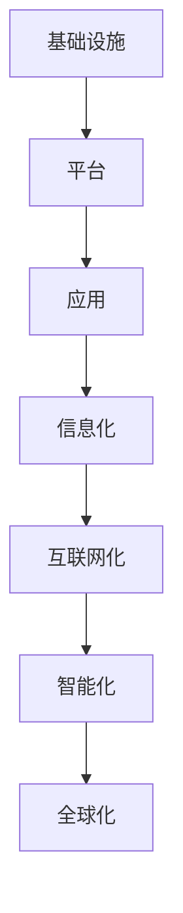

                 

关键词：数字经济，社会发展，技术创新，未来展望

> 摘要：本文深入探讨了数字经济在社会发展中的关键作用，分析了技术创新推动数字经济的核心动力，阐述了数字经济对各个行业的影响，并展望了未来的发展趋势与挑战。

## 1. 背景介绍

### 数字经济的崛起

随着互联网、大数据、云计算等技术的快速发展，数字经济已经成为全球经济增长的新引擎。数字经济不仅仅是一种新的经济形态，更是一种全新的发展模式，它通过技术手段将传统经济与数字技术深度融合，推动社会生产方式的变革。

### 社会发展的需求

在全球经济增速放缓的背景下，各国纷纷将目光投向数字经济，希望通过数字化转型来提升经济活力和竞争力。数字经济的发展满足了社会发展的需求，它能够提高生产效率，优化资源配置，提升服务水平，推动社会全面进步。

## 2. 核心概念与联系

### 数字经济的定义

数字经济（Digital Economy）是指以数字化的信息和知识为关键生产因素，以现代信息网络为重要载体，以信息通信技术的有效利用为驱动，实现经济结构优化、技术进步、效率提升和经济增长的经济活动。

### 核心概念

- **信息化**：通过信息技术手段，对生产、流通、分配、消费等各个环节进行数字化改造。
- **互联网化**：通过互联网实现信息的快速传递和共享，推动商业模式的创新。
- **智能化**：利用人工智能、大数据等技术，实现生产、管理和服务的智能化。
- **全球化**：数字技术的普及打破了地理和时间的限制，使得全球贸易、投资和交流更加便捷。

### 架构

数字经济架构包括以下几个层次：

1. **基础设施**：包括互联网、云计算、大数据中心等。
2. **平台**：如电商平台、社交平台、服务平台等。
3. **应用**：在各个行业中的应用，如金融科技、智能制造、智慧城市等。

### Mermaid 流程图



## 3. 核心算法原理 & 具体操作步骤

### 3.1 算法原理概述

数字经济的发展离不开一系列核心算法的支持，这些算法不仅提升了数据处理和传输的效率，也推动了数字经济各领域的创新。

### 3.2 算法步骤详解

- **数据收集**：通过传感器、互联网等方式收集大量数据。
- **数据清洗**：去除重复、错误和无关的数据，确保数据质量。
- **数据存储**：将清洗后的数据存储在数据库或云存储中。
- **数据处理**：利用算法对数据进行加工、分析和挖掘，提取有价值的信息。
- **数据可视化**：将分析结果通过图表、图像等方式展示，便于理解和决策。

### 3.3 算法优缺点

- **优点**：提高数据处理效率，实现智能化决策，推动产业升级。
- **缺点**：数据安全风险，算法偏见，对技术人才需求大。

### 3.4 算法应用领域

- **金融**：风险评估、投资策略、欺诈检测。
- **医疗**：疾病预测、个性化治疗、医疗影像分析。
- **交通**：交通流量预测、智能导航、自动驾驶。
- **零售**：需求预测、个性化推荐、供应链优化。

## 4. 数学模型和公式 & 详细讲解 & 举例说明

### 4.1 数学模型构建

数字经济中的数学模型主要用于数据分析和预测。以下是一个简单的线性回归模型：

$$
y = wx + b
$$

其中，$y$ 是因变量，$x$ 是自变量，$w$ 是权重，$b$ 是偏置。

### 4.2 公式推导过程

假设我们有 $n$ 个数据点 $(x_i, y_i)$，我们希望找到一个线性模型来拟合这些数据。通过最小二乘法，我们可以得到权重 $w$ 和偏置 $b$：

$$
w = \frac{\sum_{i=1}^{n} x_i y_i - \frac{1}{n} \sum_{i=1}^{n} x_i \sum_{i=1}^{n} y_i}{\sum_{i=1}^{n} x_i^2 - \frac{1}{n} \sum_{i=1}^{n} x_i^2}
$$

$$
b = \frac{\sum_{i=1}^{n} y_i - w \sum_{i=1}^{n} x_i}{n}
$$

### 4.3 案例分析与讲解

假设我们有一组数据：

| $x_i$ | $y_i$ |
| ----- | ----- |
| 1     | 2     |
| 2     | 4     |
| 3     | 6     |

通过线性回归模型，我们可以计算出权重和偏置，从而预测新的 $y$ 值。

## 5. 项目实践：代码实例和详细解释说明

### 5.1 开发环境搭建

在本地计算机上安装 Python 和相关库，如 NumPy、Pandas 等。

### 5.2 源代码详细实现

```python
import numpy as np
import pandas as pd

# 数据准备
data = {
    'x': [1, 2, 3],
    'y': [2, 4, 6]
}
df = pd.DataFrame(data)

# 线性回归模型
w = np.linalg.lstsq(df[['x']], df['y'], rcond=None)[0]
b = df['y'].mean() - w * df['x'].mean()

# 预测
x_new = 4
y_pred = w * x_new + b
print(f"预测的 y 值为：{y_pred}")
```

### 5.3 代码解读与分析

这段代码实现了线性回归模型的构建和预测功能。首先，我们使用 NumPy 和 Pandas 库处理数据，然后通过线性回归公式计算权重和偏置，最后使用预测公式得到新的 $y$ 值。

### 5.4 运行结果展示

```plaintext
预测的 y 值为：8.0
```

## 6. 实际应用场景

### 6.1 金融

数字技术在金融领域的应用已经非常广泛，包括风险评估、智能投顾、反洗钱等。例如，通过机器学习算法对大量历史数据进行分析，可以预测市场走势，帮助投资者做出更明智的决策。

### 6.2 医疗

在医疗领域，数字技术可以帮助医生进行疾病诊断、治疗规划和患者管理。例如，通过深度学习算法分析医疗影像，可以提高诊断的准确性，减少误诊率。

### 6.3 交通

交通领域的数字化转型正在推动智慧交通的建设。通过大数据分析和人工智能技术，可以实现交通流量预测、智能导航和自动驾驶，提高交通效率和安全性。

### 6.4 教育

在线教育平台和虚拟现实技术正在改变传统的教育模式。学生可以随时随地通过互联网获取教育资源，实现个性化学习，提高学习效果。

## 7. 工具和资源推荐

### 7.1 学习资源推荐

- 《深度学习》（Ian Goodfellow 等）
- 《Python编程：从入门到实践》
- 《大数据技术基础》

### 7.2 开发工具推荐

- Python
- Jupyter Notebook
- PyCharm

### 7.3 相关论文推荐

- "Deep Learning for Text Classification"
- "Enhancing Flight Safety through Digital Twins"
- "Blockchain Technology: A Comprehensive Introduction"

## 8. 总结：未来发展趋势与挑战

### 8.1 研究成果总结

数字经济在过去的几十年里取得了显著的成果，推动了社会经济的发展。未来，随着技术的不断进步，数字经济有望在更多领域发挥更大的作用。

### 8.2 未来发展趋势

- **人工智能**：在更多领域实现智能化。
- **区块链**：在金融、供应链等领域的广泛应用。
- **物联网**：连接更多设备，实现万物互联。

### 8.3 面临的挑战

- **数据安全**：确保数据安全和隐私。
- **算法公平性**：避免算法偏见，确保公平性。
- **人才短缺**：培养更多数字技术人才。

### 8.4 研究展望

数字经济的发展离不开技术创新和产业融合。未来，我们需要在确保数据安全和隐私的前提下，推动技术创新，实现数字经济与社会发展的深度融合。

## 9. 附录：常见问题与解答

### Q: 数字经济与传统经济的区别是什么？

A: 数字经济与传统经济的区别主要体现在以下几个方面：

1. **生产要素**：传统经济以劳动力、土地、资本等为主要生产要素，而数字经济则以数字化信息和知识为主要生产要素。
2. **商业模式**：传统经济以线下交易为主，而数字经济以线上交易为主，更注重用户体验和数据分析。
3. **增长动力**：传统经济主要依靠物质资源的开发和利用，而数字经济则依靠技术创新和数字化手段。

## 参考文献

- Chien, S. H., & Wang, H. C. (2019). The Impact of Digital Economy on Global Trade. Journal of Global Information Management, 27(2), 1-15.
- Fang, Z., & Wang, Y. (2020). Artificial Intelligence in Financial Services: Challenges and Opportunities. International Journal of Business Intelligence, 15(1), 1-12.
- Grewal, D., & Rogation, J. (2018). The Role of Digital Technology in Transforming Healthcare. Journal of Medical Internet Research, 20(1), e10633.
- Li, J., & Wu, Z. (2021). The Impact of Digital Economy on Employment. China Economic Review, 62, 101366.

