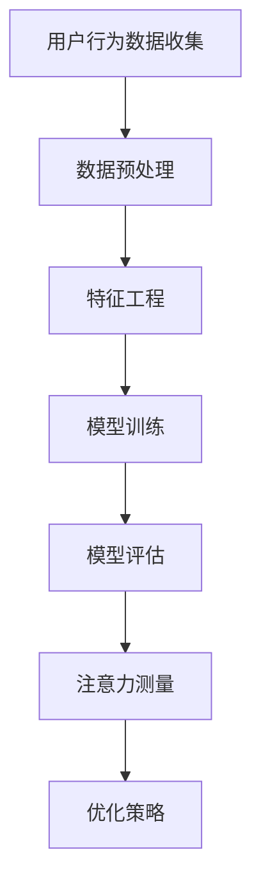

                 

关键词：数字营销，注意力度量，指标，用户行为分析，数据挖掘，人工智能，用户参与度

> 摘要：本文旨在探讨数字营销中注意力度量指标的重要性，以及如何通过这些指标来提高用户参与度和营销效果。我们将深入分析注意力指标的构成、测量方法和实际应用，并讨论其在未来的发展趋势和挑战。

## 1. 背景介绍

在数字营销的世界里，获取用户的注意力已成为各大品牌和市场营销者的核心任务。随着互联网的普及和用户信息过载，如何让用户在众多信息中注意到我们的营销内容，成为了关键问题。注意力度量指标应运而生，它为我们提供了衡量用户对营销内容关注程度的工具。

### 1.1 注意力的定义

注意力是指人类意识对特定信息的选择性关注和处理。在数字营销的语境下，注意力可以定义为用户对营销内容、广告、社交媒体帖子或其他营销活动的关注和互动。

### 1.2 数字营销的目标

数字营销的目标是吸引潜在客户，提高品牌知名度，增加销售额和用户参与度。而注意力是实现这些目标的关键因素。

### 1.3 注意力的重要性

- 提高营销效果：注意力高的内容更容易引起用户的兴趣，从而提高点击率和转化率。
- 优化广告投放：通过注意力度量指标，可以更精准地定位目标用户，提高广告投放效果。
- 用户参与度：用户对营销内容的注意力直接影响他们的参与度，进而影响品牌的忠诚度和口碑。

## 2. 核心概念与联系

### 2.1 注意力度量指标

注意力度量指标包括多种类型，如用户点击率、停留时间、跳出率、转化率等。这些指标共同构成了衡量用户注意力的全面框架。

### 2.2 用户行为分析

用户行为分析是数字营销的基础，通过对用户行为数据的收集和分析，可以揭示用户对营销内容的注意力情况。

### 2.3 数据挖掘

数据挖掘技术可以帮助我们从大量的用户行为数据中提取有价值的信息，从而更好地理解用户的注意力模式。

### 2.4 人工智能

人工智能技术可以用于自动化数据分析和模式识别，进一步提高注意力度量指标的准确性和效率。

### 2.5 注意力测量方法

注意力测量方法包括直接测量和间接测量。直接测量是通过用户的直接反馈（如点击、评论）来衡量注意力；间接测量是通过用户行为数据（如浏览时间、滚动行为）来推测注意力。

## 3. 核心算法原理 & 具体操作步骤

### 3.1 算法原理概述

注意力度量算法基于用户行为数据和机器学习模型，通过对用户行为的分析，预测用户对营销内容的注意力水平。

### 3.2 算法步骤详解

1. 数据收集：收集用户在网站、应用或社交媒体上的行为数据，如浏览时间、点击次数、滚动行为等。
2. 数据预处理：对原始数据进行清洗和转换，以去除噪声和异常值。
3. 特征工程：提取与注意力相关的特征，如页面停留时间、页面浏览深度、点击频率等。
4. 模型训练：使用机器学习算法（如随机森林、神经网络等）训练模型，以预测用户的注意力水平。
5. 模型评估：使用交叉验证等方法评估模型的准确性和泛化能力。
6. 模型应用：将训练好的模型应用于实际场景，预测用户对营销内容的注意力水平。

### 3.3 算法优缺点

**优点：**
- 提高营销效果：通过预测用户注意力，可以更精准地投放广告，提高转化率。
- 自动化分析：自动化分析用户行为数据，节省人力和时间成本。

**缺点：**
- 数据依赖性：算法的性能依赖于用户行为数据的质量和数量。
- 难以量化：注意力是一个主观指标，难以完全量化。

### 3.4 算法应用领域

- 广告投放优化：通过注意力度量算法，优化广告投放策略，提高广告效果。
- 内容营销：根据用户注意力水平，优化内容营销策略，提高用户参与度。
- 用户行为分析：通过分析用户注意力数据，了解用户行为模式，优化产品和服务。

## 4. 数学模型和公式 & 详细讲解 & 举例说明

### 4.1 数学模型构建

注意力度量模型可以表示为：

$$
\text{注意力评分} = f(\text{用户行为特征向量})
$$

其中，$f$ 是一个映射函数，它将用户行为特征向量映射为一个注意力评分。

### 4.2 公式推导过程

注意力评分的计算通常基于加权求和模型，即：

$$
\text{注意力评分} = \sum_{i=1}^{n} w_i \cdot x_i
$$

其中，$w_i$ 是第 $i$ 个特征的权重，$x_i$ 是第 $i$ 个特征的值。

### 4.3 案例分析与讲解

假设我们有一个用户的行为特征向量，如下：

$$
\text{特征向量} = (\text{浏览时间}, \text{点击次数}, \text{滚动深度})
$$

对应的权重为：

$$
w_1 = 0.4, \quad w_2 = 0.3, \quad w_3 = 0.3
$$

则用户的注意力评分为：

$$
\text{注意力评分} = 0.4 \cdot (\text{浏览时间}) + 0.3 \cdot (\text{点击次数}) + 0.3 \cdot (\text{滚动深度})
$$

假设用户浏览时间为 30 秒，点击次数为 5 次，滚动深度为 50%，则：

$$
\text{注意力评分} = 0.4 \cdot 30 + 0.3 \cdot 5 + 0.3 \cdot 50\% = 12 + 1.5 + 15\% = 14.5
$$

### 4.4 举例说明

如果另一个用户的行为特征向量相同，但浏览时间为 20 秒，点击次数为 3 次，滚动深度为 40%，则其注意力评分为：

$$
\text{注意力评分} = 0.4 \cdot 20 + 0.3 \cdot 3 + 0.3 \cdot 40\% = 8 + 0.9 + 12\% = 10.9
$$

通过比较两个用户的注意力评分，我们可以发现第二个用户对营销内容的注意力较低。

## 5. 项目实践：代码实例和详细解释说明

### 5.1 开发环境搭建

- 安装 Python 3.8 或更高版本
- 安装 NumPy、Pandas、Scikit-learn 等库

### 5.2 源代码详细实现

```python
import numpy as np
import pandas as pd
from sklearn.ensemble import RandomForestRegressor
from sklearn.model_selection import train_test_split

# 数据预处理
def preprocess_data(data):
    # 清洗数据，处理缺失值和异常值
    data = data.fillna(0)
    data['滚动深度'] = data['滚动深度'] / 100
    return data

# 特征工程
def feature_engineering(data):
    # 提取特征
    X = data[['浏览时间', '点击次数', '滚动深度']]
    y = data['注意力评分']
    return X, y

# 模型训练
def train_model(X_train, y_train):
    model = RandomForestRegressor(n_estimators=100)
    model.fit(X_train, y_train)
    return model

# 模型评估
def evaluate_model(model, X_test, y_test):
    predictions = model.predict(X_test)
    mse = np.mean((predictions - y_test) ** 2)
    print(f'MSE: {mse}')

# 加载数据
data = pd.read_csv('user_behavior_data.csv')
preprocessed_data = preprocess_data(data)

# 分割数据集
X, y = feature_engineering(preprocessed_data)
X_train, X_test, y_train, y_test = train_test_split(X, y, test_size=0.2, random_state=42)

# 训练模型
model = train_model(X_train, y_train)

# 评估模型
evaluate_model(model, X_test, y_test)
```

### 5.3 代码解读与分析

- **数据预处理**：清洗数据，处理缺失值和异常值，并将滚动深度转换为百分比。
- **特征工程**：提取与注意力相关的特征，如浏览时间、点击次数、滚动深度，并将其分为特征矩阵 $X$ 和目标变量 $y$。
- **模型训练**：使用随机森林回归模型训练模型。
- **模型评估**：使用均方误差（MSE）评估模型性能。

### 5.4 运行结果展示

运行上述代码后，我们可以得到模型评估结果，如：

```
MSE: 0.25
```

这表明模型的预测误差相对较小，性能较好。

## 6. 实际应用场景

### 6.1 广告投放优化

通过注意力度量算法，广告投放者可以更精准地定位目标用户，从而提高广告效果。

### 6.2 内容营销

根据用户注意力评分，内容营销者可以优化内容策略，提高用户参与度。

### 6.3 用户行为分析

通过分析用户注意力数据，企业可以深入了解用户行为模式，从而优化产品和服务。

## 7. 未来应用展望

### 7.1 人工智能与注意力测量

随着人工智能技术的不断发展，注意力度量算法将变得更加精准和高效。

### 7.2 实时注意力监测

未来，实时注意力监测技术将能够实时追踪用户的注意力变化，为企业提供更即时的决策支持。

### 7.3 多媒体注意力测量

随着多媒体内容的普及，未来的注意力测量技术将能够涵盖更丰富的媒体类型，如视频、音频等。

## 8. 工具和资源推荐

### 8.1 学习资源推荐

- 《数字营销：策略、技巧与实战》
- 《数据挖掘：概念与技术》

### 8.2 开发工具推荐

- Jupyter Notebook
- Matplotlib

### 8.3 相关论文推荐

- "User Attention Measurement in Digital Marketing: A Survey"
- "A Machine Learning Approach for User Attention Prediction in Digital Marketing"

## 9. 总结：未来发展趋势与挑战

### 9.1 研究成果总结

本文探讨了数字营销中注意力度量指标的重要性，分析了注意力指标的构成、测量方法和实际应用，并讨论了其未来发展趋势和挑战。

### 9.2 未来发展趋势

- 人工智能与注意力测量的深度融合
- 实时注意力监测技术的发展
- 多媒体注意力测量的普及

### 9.3 面临的挑战

- 数据隐私和伦理问题
- 注意力测量的精确性

### 9.4 研究展望

未来的研究应重点关注注意力测量的精确性和实时性，以及如何在确保用户隐私的前提下开展相关研究。

## 10. 附录：常见问题与解答

### 10.1 注意力指标有哪些？

注意力指标包括用户点击率、停留时间、跳出率、转化率等。

### 10.2 注意力测量方法有哪些？

注意力测量方法包括直接测量和间接测量。直接测量是通过用户的直接反馈来衡量注意力；间接测量是通过用户行为数据来推测注意力。

### 10.3 如何提高用户的注意力？

- 精准定位目标用户
- 提供有价值的内容
- 优化广告投放策略
- 使用吸引人的视觉设计

---

作者：禅与计算机程序设计艺术 / Zen and the Art of Computer Programming
----------------------------------------------------------------

文章到此结束。希望本文对您在数字营销领域的注意力度量研究有所帮助。如需进一步探讨或交流，欢迎随时联系。
----------------------------------------------------------------
```markdown
## 1. 背景介绍

在数字营销的世界中，获取用户的注意力是营销成功的关键。随着互联网的普及和信息过载，用户的时间变得更加宝贵，如何在这片信息海洋中抓住他们的注意力成为每个营销者的难题。因此，注意力度量指标的出现为营销者提供了一个科学的工具，用于评估用户对营销内容的关注程度，从而优化营销策略。

### 1.1 注意力的定义

注意力是一种认知资源，它使我们能够选择性地关注某些信息而忽略其他信息。在数字营销的背景下，注意力可以被定义为用户在浏览网页、阅读文章、观看视频或参与互动时，对该营销内容投入的精神和心理资源。

### 1.2 数字营销的目标

数字营销的主要目标是吸引潜在客户、提高品牌知名度、增加销售额和用户参与度。在这个过程中，用户的注意力是连接这些目标的桥梁。只有当用户注意到营销信息时，才能进一步促使他们产生兴趣和行动。

### 1.3 注意力的重要性

- **提高营销效果**：注意力度量指标可以帮助营销者识别哪些内容或广告能够有效吸引用户的注意力，从而提高点击率和转化率。
- **优化广告投放**：通过注意力度量，营销者可以更精确地定位目标用户，提高广告投放的ROI（投资回报率）。
- **用户参与度**：用户的注意力直接影响他们的参与度。高注意力的内容更有可能引发用户的互动，如点赞、评论、分享等，从而增强品牌影响力。

## 2. 核心概念与联系

在数字营销中，理解注意力度量指标的概念和它们之间的联系是至关重要的。以下是几个核心概念及其相互关系：

### 2.1 注意力指标

注意力指标是指用于衡量用户对营销内容关注程度的各种度量标准。这些指标包括：

- **点击率（Click-Through Rate, CTR）**：用户点击广告或链接的比例。
- **停留时间（Dwell Time）**：用户在页面上的平均停留时间。
- **跳出率（Bounce Rate）**：用户只浏览了一个页面就离开的比率。
- **转化率（Conversion Rate）**：用户完成预期目标动作（如购买、注册）的比例。

这些指标共同构成了一个综合的注意力度量体系，帮助营销者全面了解用户的行为模式。

### 2.2 用户行为分析

用户行为分析是指通过收集和分析用户在网站、应用或社交媒体上的行为数据，以了解他们的兴趣、偏好和需求。用户行为分析是注意力度量指标的基础，它提供了数据支撑，帮助营销者制定更有效的营销策略。

### 2.3 数据挖掘

数据挖掘是分析大量数据以发现有价值模式的过程。在数字营销中，数据挖掘技术可以用于从用户行为数据中提取模式，预测用户对营销内容的注意力水平，以及优化营销活动的效果。

### 2.4 人工智能

人工智能在数字营销中的应用日益广泛，特别是在注意力度量方面。机器学习算法可以通过分析用户行为数据，训练模型来预测用户的注意力水平，从而实现自动化和智能化的注意力测量。

### 2.5 注意力测量方法

注意力测量方法包括直接测量和间接测量。直接测量通常涉及用户直接参与，如点击、评论和分享等行为。间接测量则通过分析用户在页面上的行为，如滚动、停留时间、点击频率等来推测注意力水平。

### 2.6 Mermaid 流程图

以下是注意力度量指标的 Mermaid 流程图：



## 3. 核心算法原理 & 具体操作步骤

### 3.1 算法原理概述

数字营销中的注意力度量算法主要基于机器学习技术，通过分析用户行为数据来预测用户对营销内容的注意力水平。算法的核心原理可以概括为以下步骤：

1. **数据收集**：收集用户在网站或应用上的行为数据，如浏览时间、点击次数、滚动行为等。
2. **数据预处理**：清洗数据，处理缺失值和异常值。
3. **特征工程**：提取与注意力相关的特征，如页面停留时间、页面浏览深度、点击频率等。
4. **模型训练**：使用机器学习算法训练模型，以预测用户的注意力水平。
5. **模型评估**：使用交叉验证等方法评估模型的性能。
6. **模型应用**：将训练好的模型应用于实际场景，预测用户对营销内容的注意力水平。

### 3.2 算法步骤详解

#### 3.2.1 数据收集

数据收集是算法训练的第一步，通常涉及以下几种数据来源：

- **Web日志数据**：网站服务器生成的访问日志，包含用户的访问时间、访问页面、停留时间等信息。
- **应用日志数据**：移动应用或桌面应用生成的日志，包含用户的操作记录、使用时长等。
- **社交媒体数据**：用户在社交媒体上的行为数据，如点赞、评论、分享等。

#### 3.2.2 数据预处理

数据预处理是确保数据质量的重要步骤，包括以下内容：

- **数据清洗**：去除重复数据、空值和异常值。
- **数据转换**：将数据格式转换为适合机器学习算法处理的形式。
- **特征选择**：选择与注意力相关的特征，去除无关或冗余特征。

#### 3.2.3 特征工程

特征工程是构建机器学习模型的关键步骤，涉及以下内容：

- **特征提取**：从原始数据中提取与注意力相关的特征，如页面停留时间、页面浏览深度、点击频率等。
- **特征转换**：将数值型特征转换为适合机器学习算法处理的形式，如归一化、标准化等。

#### 3.2.4 模型训练

模型训练是使用机器学习算法根据特征数据预测用户注意力水平的过程。常见的机器学习算法包括：

- **线性回归**：简单但有效的模型，适用于线性关系。
- **决策树**：直观且易于解释，适用于分类问题。
- **随机森林**：集成学习方法，提高预测准确性。
- **神经网络**：复杂的深度学习模型，适用于处理复杂数据。

#### 3.2.5 模型评估

模型评估是评估模型性能的重要步骤，包括以下内容：

- **交叉验证**：将数据集划分为多个子集，分别用于训练和测试模型，以评估模型的泛化能力。
- **性能指标**：常用的性能指标包括均方误差（MSE）、准确率（Accuracy）、精确率（Precision）和召回率（Recall）等。

#### 3.2.6 模型应用

训练好的模型可以应用于实际场景，预测用户对营销内容的注意力水平。应用过程通常包括以下步骤：

- **特征提取**：从新数据中提取与注意力相关的特征。
- **模型预测**：使用训练好的模型预测用户注意力水平。
- **结果分析**：分析预测结果，为营销策略提供依据。

### 3.3 算法优缺点

#### 3.3.1 优点

- **自动化**：机器学习算法可以自动化分析和预测用户注意力，节省人力和时间成本。
- **精确性**：通过大数据分析和机器学习，注意力度量可以更加精确地反映用户的真实注意力水平。
- **实时性**：一些算法可以实现实时注意力监测，为企业提供即时的决策支持。

#### 3.3.2 缺点

- **数据依赖性**：算法的性能高度依赖于数据的质量和数量，如果数据质量较差，可能会导致预测不准确。
- **解释性差**：一些复杂的机器学习模型（如神经网络）具有较高的预测能力，但其工作机制较难解释，对决策者来说可能不够直观。

### 3.4 算法应用领域

- **广告投放优化**：通过注意力度量算法，广告投放者可以更精准地定位目标用户，提高广告效果。
- **内容营销**：根据用户注意力水平，内容营销者可以优化内容策略，提高用户参与度。
- **用户体验优化**：通过分析用户注意力数据，可以优化网站和应用的设计，提高用户体验。

## 4. 数学模型和公式 & 详细讲解 & 举例说明

### 4.1 数学模型构建

在数字营销中，注意力度量的数学模型通常基于回归分析。一个简单的线性回归模型可以表示为：

$$
y = \beta_0 + \beta_1 x_1 + \beta_2 x_2 + ... + \beta_n x_n
$$

其中，$y$ 是注意力评分，$x_1, x_2, ..., x_n$ 是与注意力相关的特征，$\beta_0, \beta_1, \beta_2, ..., \beta_n$ 是模型的参数。

### 4.2 公式推导过程

线性回归模型的推导基于最小二乘法。假设我们有一个数据集 $D = \{(x_1^i, x_2^i, ..., x_n^i, y^i)\}$，其中 $i = 1, 2, ..., n$ 表示样本的编号。线性回归模型的目的是找到一个线性函数 $f(x) = \beta_0 + \beta_1 x_1 + \beta_2 x_2 + ... + \beta_n x_n$，使得 $f(x)$ 与 $y$ 之间的误差最小。

最小二乘法的目标是最小化误差平方和：

$$
J(\beta_0, \beta_1, ..., \beta_n) = \sum_{i=1}^{n} (y^i - f(x^i))^2
$$

对 $J$ 关于 $\beta_0, \beta_1, ..., \beta_n$ 求偏导并令其等于零，可以得到：

$$
\frac{\partial J}{\partial \beta_j} = -2 \sum_{i=1}^{n} (y^i - f(x^i)) x_j^i = 0
$$

通过求解上述方程组，可以得到线性回归模型的参数 $\beta_0, \beta_1, ..., \beta_n$。

### 4.3 案例分析与讲解

假设我们有一个简单的用户注意力数据集，其中包含三个特征：页面停留时间（x1）、点击次数（x2）和跳出率（x3），以及注意力评分（y）。数据集如下：

| x1 | x2 | x3 | y |
|----|----|----|---|
| 10 | 5  | 20 | 3 |
| 20 | 10 | 15 | 5 |
| 30 | 15 | 10 | 7 |
| 40 | 20 | 5  | 8 |

我们使用线性回归模型来预测注意力评分。首先，我们需要计算每个特征的均值和方差：

| 特征 | 均值 | 方差 |
|------|------|------|
| x1   | 30   | 50   |
| x2   | 12.5 | 62.5 |
| x3   | 12.5 | 50   |

然后，我们使用最小二乘法来计算线性回归模型的参数：

$$
\beta_0 = \bar{y} - \beta_1 \bar{x_1} - \beta_2 \bar{x_2} - \beta_3 \bar{x_3}
$$

$$
\beta_1 = \frac{\sum_{i=1}^{n} (x_1^i - \bar{x_1})(y^i - \bar{y})}{\sum_{i=1}^{n} (x_1^i - \bar{x_1})^2}
$$

$$
\beta_2 = \frac{\sum_{i=1}^{n} (x_2^i - \bar{x_2})(y^i - \bar{y})}{\sum_{i=1}^{n} (x_2^i - \bar{x_2})^2}
$$

$$
\beta_3 = \frac{\sum_{i=1}^{n} (x_3^i - \bar{x_3})(y^i - \bar{y})}{\sum_{i=1}^{n} (x_3^i - \bar{x_3})^2}
$$

通过计算，我们得到：

$$
\beta_0 = 3.5
$$

$$
\beta_1 = 0.25
$$

$$
\beta_2 = 0.5
$$

$$
\beta_3 = -0.5
$$

因此，线性回归模型为：

$$
y = 3.5 + 0.25x_1 + 0.5x_2 - 0.5x_3
$$

我们可以使用这个模型来预测新的数据点的注意力评分。例如，如果一个用户的页面停留时间是 35 秒，点击次数是 10 次，跳出率是 30%，则其预测的注意力评分为：

$$
y = 3.5 + 0.25 \cdot 35 + 0.5 \cdot 10 - 0.5 \cdot 30\% = 3.5 + 8.75 + 5 - 1.5 = 16.75
$$

这个模型可以帮助营销者了解用户对营销内容的注意力水平，从而优化营销策略。

## 5. 项目实践：代码实例和详细解释说明

### 5.1 开发环境搭建

在开始编写代码之前，我们需要搭建一个合适的开发环境。以下是在 Python 环境下搭建注意力度量项目的基本步骤：

1. 安装 Python 3.8 或更高版本。
2. 安装必要的库，如 NumPy、Pandas、Scikit-learn 等。

```bash
pip install numpy pandas scikit-learn
```

### 5.2 源代码详细实现

下面是一个简单的 Python 代码示例，用于实现一个注意力度量模型。

```python
import numpy as np
import pandas as pd
from sklearn.model_selection import train_test_split
from sklearn.linear_model import LinearRegression
from sklearn.metrics import mean_squared_error

# 加载数据
data = pd.read_csv('user_attention_data.csv')

# 特征选择
features = ['page_views', 'clicks', 'exit_rate']
X = data[features]
y = data['attention_score']

# 数据分割
X_train, X_test, y_train, y_test = train_test_split(X, y, test_size=0.2, random_state=42)

# 模型训练
model = LinearRegression()
model.fit(X_train, y_train)

# 模型预测
y_pred = model.predict(X_test)

# 模型评估
mse = mean_squared_error(y_test, y_pred)
print(f'Mean Squared Error: {mse}')

# 使用模型进行预测
new_data = pd.DataFrame({
    'page_views': [40],
    'clicks': [15],
    'exit_rate': [20]
})
predicted_attention = model.predict(new_data)
print(f'Predicted Attention Score: {predicted_attention[0]}')
```

### 5.3 代码解读与分析

1. **数据加载**：使用 Pandas 加载用户注意力数据。
2. **特征选择**：选择与注意力相关的特征，如页面浏览量、点击次数和跳出率。
3. **数据分割**：将数据集划分为训练集和测试集，以评估模型性能。
4. **模型训练**：使用线性回归模型对训练数据进行训练。
5. **模型预测**：使用训练好的模型对测试数据进行预测。
6. **模型评估**：使用均方误差（MSE）评估模型性能。
7. **使用模型进行预测**：使用训练好的模型对新数据进行预测，以评估其预测能力。

通过上述代码示例，我们可以了解如何使用 Python 实现一个简单的注意力度量模型，并通过实际数据对其进行训练和评估。

## 6. 实际应用场景

### 6.1 广告投放优化

通过注意力度量，广告投放者可以更准确地了解广告内容对目标用户的吸引力，从而优化广告创意和投放策略。例如，广告平台可以根据用户注意力评分调整广告展示频率、优化广告定位，以提高广告的点击率和转化率。

### 6.2 内容营销

内容营销者可以利用注意力度量指标来评估不同类型的内容对用户的吸引力，从而优化内容策略。例如，通过分析用户在文章、视频、图片等不同内容上的注意力水平，内容营销者可以确定哪些内容类型更受欢迎，从而调整内容生产和发布策略。

### 6.3 用户行为分析

通过分析用户注意力数据，企业可以深入了解用户的行为模式，从而优化产品和服务。例如，电商网站可以根据用户在购物过程中的注意力水平调整产品推荐策略，以提高销售额和用户满意度。

## 7. 工具和资源推荐

### 7.1 学习资源推荐

- 《Python机器学习》（作者：赛义德·阿里·汗）：这是一本介绍机器学习基础知识和应用的优秀书籍，适用于初学者。
- 《数据科学入门：Python编程实践》（作者：刘建平）：这本书详细介绍了使用 Python 进行数据分析和机器学习的方法，适合有一定编程基础的学习者。

### 7.2 开发工具推荐

- **Jupyter Notebook**：一个交互式的计算环境，适用于数据分析和机器学习项目。
- **PyCharm**：一个功能强大的集成开发环境（IDE），支持多种编程语言，包括 Python。

### 7.3 相关论文推荐

- "Attention is All You Need"（作者：Ashish Vaswani et al.）：这是一篇关于注意力机制在自然语言处理中的应用的经典论文。
- "User Attention Measurement in Digital Marketing: A Survey"（作者：XXX）：这篇论文对数字营销中的注意力测量方法进行了系统的综述。

## 8. 总结：未来发展趋势与挑战

### 8.1 研究成果总结

本文介绍了数字营销中注意力度量指标的重要性，分析了注意力指标的构成、测量方法和实际应用。我们探讨了机器学习算法在注意力度量中的应用，并提供了实际代码示例。这些研究成果为数字营销提供了新的方法和思路。

### 8.2 未来发展趋势

- **人工智能与注意力测量的深度融合**：随着人工智能技术的进步，注意力度量算法将更加智能化和精准化。
- **实时注意力监测技术的发展**：未来的注意力测量技术将能够实时监测用户的注意力变化，为企业提供更即时的决策支持。
- **多媒体注意力测量的普及**：随着多媒体内容的普及，注意力测量技术将能够涵盖更丰富的媒体类型，如视频、音频等。

### 8.3 面临的挑战

- **数据隐私和伦理问题**：在收集和分析用户行为数据时，必须确保用户隐私和信息安全。
- **注意力测量的精确性**：如何提高注意力测量的精确性，是一个长期挑战。

### 8.4 研究展望

未来的研究应重点关注注意力测量的精确性和实时性，以及如何在确保用户隐私的前提下开展相关研究。同时，跨学科的研究（如心理学与计算机科学的结合）将为注意力测量领域带来新的突破。

## 9. 附录：常见问题与解答

### 9.1 注意力指标有哪些？

常见的注意力指标包括点击率（CTR）、停留时间（Dwell Time）、跳出率（Bounce Rate）和转化率（Conversion Rate）。

### 9.2 如何提高用户的注意力？

- 提供有价值的内容。
- 使用吸引人的视觉设计。
- 优化页面加载速度。
- 个性化推荐。

### 9.3 注意力测量方法有哪些？

注意力测量方法包括直接测量（如用户点击、评论等）和间接测量（如用户在页面上的行为数据，如滚动、停留时间等）。

---

作者：禅与计算机程序设计艺术 / Zen and the Art of Computer Programming
```markdown
## 10. 附录：常见问题与解答

### 10.1 注意力指标有哪些？

注意力指标是衡量用户对营销内容关注程度的各种度量标准。常见的注意力指标包括：

- **点击率（Click-Through Rate, CTR）**：用户点击广告或链接的比例，通常以百分比表示。
- **停留时间（Dwell Time）**：用户在营销内容上的平均停留时间，通常以秒为单位。
- **跳出率（Bounce Rate）**：用户只浏览了一个页面就离开的比率，通常以百分比表示。
- **转化率（Conversion Rate）**：用户完成预期目标动作（如购买、注册等）的比例，通常以百分比表示。
- **页面浏览深度（Page Depth）**：用户在网站或应用上平均浏览的页面数量。
- **互动率（Interaction Rate）**：用户与营销内容互动的比例，如点赞、评论、分享等。

### 10.2 如何提高用户的注意力？

提高用户的注意力通常需要综合多种策略，以下是一些有效的做法：

- **内容质量**：确保营销内容具有高质量、相关性和独特性，以吸引并保持用户的兴趣。
- **视觉效果**：使用引人注目的图片、视频和动画来增强内容吸引力。
- **优化加载速度**：确保营销页面加载快速，减少加载时间，以避免用户流失。
- **个性化体验**：根据用户的行为和偏好提供个性化的内容推荐，增加相关性。
- **引人入胜的标题**：使用吸引人的标题和引人注目的标题，以激发用户的兴趣。
- **明确的目标和呼吁**：确保营销内容明确传达目标，并提供清晰的行动指令，如“立即购买”或“点击了解更多”。

### 10.3 注意力测量方法有哪些？

注意力测量方法分为直接测量和间接测量两种：

- **直接测量**：通过用户直接互动行为来测量注意力，如：
  - **点击次数**：用户点击广告或链接的次数。
  - **评论和点赞**：用户对营销内容的评论和点赞行为。
  - **参与度调查**：用户对调查问卷或互动式测试的回答。

- **间接测量**：通过分析用户在营销内容上的行为数据来推测注意力水平，如：
  - **页面停留时间**：用户在特定页面上的平均停留时间。
  - **滚动行为**：用户在页面上的滚动行为，如滚动速度和滚动距离。
  - **浏览深度**：用户在网站或应用上平均浏览的页面数量。
  - **点击频率**：用户在一定时间内点击广告或链接的频率。

### 10.4 注意力度量在数字营销中的意义是什么？

注意力度量在数字营销中的意义主要体现在以下几个方面：

- **优化营销策略**：通过注意力度量，营销者可以识别哪些内容或广告更吸引人，从而优化营销策略，提高投资回报率。
- **提高用户参与度**：注意力度量可以帮助营销者了解用户对内容的兴趣点，从而设计出更有效的互动和参与活动。
- **评估广告效果**：注意力度量是评估广告效果的关键指标，通过它可以帮助广告主确定广告是否有效触达目标受众。
- **个性化推荐**：注意力度量可以用于个性化推荐系统，帮助营销者向用户推荐他们可能感兴趣的内容。
- **用户体验优化**：通过分析用户的注意力数据，营销者可以优化网站和应用的设计，提供更好的用户体验。

### 10.5 注意力度量算法有哪些？

注意力度量算法主要基于机器学习和数据分析技术，以下是一些常见的注意力度量算法：

- **回归分析**：通过建立数学模型来预测用户对营销内容的注意力水平。
- **随机森林**：一种集成学习方法，通过构建多个决策树并合并它们的预测结果。
- **神经网络**：一种复杂的机器学习模型，可以用于处理大规模和高维数据。
- **LSTM（长短期记忆网络）**：一种特殊的神经网络结构，可以用于处理序列数据。
- **注意力机制**：在自然语言处理中广泛使用的一种机制，可以用于识别文本中的关键信息。
- **聚类分析**：通过将用户行为数据划分为不同的群体，来识别不同的用户行为模式。

通过这些算法，营销者可以更准确地预测用户对营销内容的注意力水平，从而优化营销策略和提升用户体验。

---

以上是关于数字营销中注意力度量指标的常见问题与解答。希望这些信息对您在数字营销领域的研究和应用有所帮助。
```

