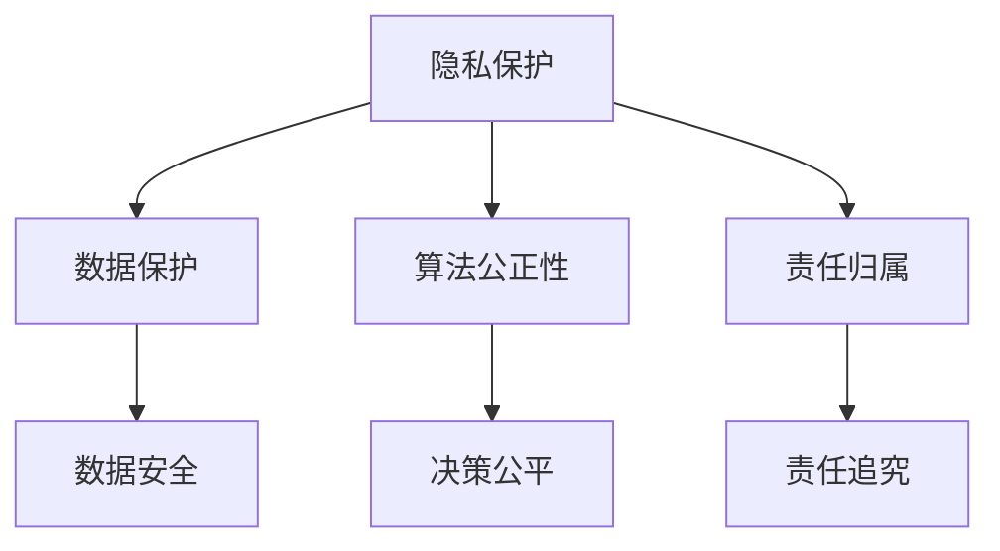

                 

 **关键词**：数据伦理、隐私保护、算法偏见、透明性、责任归属

> **摘要**：本文探讨了数据伦理面临的诸多挑战，包括隐私保护、算法偏见、透明性和责任归属等方面。通过对这些问题的深入分析，本文提出了一系列可行的解决方案，旨在推动数据伦理的发展和实施。

## 1. 背景介绍

随着大数据、人工智能和云计算技术的迅猛发展，数据已经成为现代社会的重要资产。然而，数据的使用也带来了诸多伦理问题。一方面，数据的价值需要通过合理的分析和应用来释放，但另一方面，数据的使用也可能侵犯个人隐私、导致算法偏见，甚至引发社会不公。因此，如何平衡数据的价值与伦理责任，成为当前急需解决的重要问题。

### 数据伦理的定义与重要性

数据伦理是指围绕数据使用和处理所涉及的一系列伦理原则和规范。它关注的是如何确保数据的使用不会侵犯个人隐私、损害公共利益，以及如何在数据驱动的社会中维护公平和正义。

数据伦理的重要性体现在以下几个方面：

1. **隐私保护**：随着数据采集和处理技术的进步，个人隐私面临越来越大的威胁。数据伦理强调尊重个人隐私，确保数据在使用过程中不会被滥用。
   
2. **算法偏见**：算法在数据处理和决策中具有重要作用，但算法的设计和应用可能引入偏见，导致不公平的结果。数据伦理关注如何减少算法偏见，确保决策过程的公正性。

3. **透明性和责任归属**：数据的使用往往涉及多个利益相关方，包括数据提供者、数据处理者、数据使用者等。数据伦理强调透明性和责任归属，确保每个环节的责任得到明确。

### 数据伦理困境的来源

数据伦理困境主要来源于以下几个方面：

1. **技术发展速度**：技术的快速发展往往超出伦理规范的调整速度，导致伦理问题得不到及时解决。

2. **利益冲突**：数据的价值巨大，但不同利益相关方对数据的使用有不同的利益诉求，这可能导致伦理困境的产生。

3. **法律法规滞后**：现有的法律法规往往滞后于技术的发展，无法全面覆盖数据伦理问题。

## 2. 核心概念与联系

### 数据伦理的核心概念

在探讨数据伦理问题时，以下几个核心概念至关重要：

1. **隐私**：隐私是指个人对其个人信息和活动的主权。隐私权是每个人的基本权利，应当得到尊重和保护。

2. **数据保护**：数据保护是指确保数据在收集、存储、处理和传输过程中的安全性和保密性。

3. **算法公正性**：算法公正性是指算法在决策过程中应当确保公平，不受人为偏见的影响。

4. **责任归属**：责任归属是指当数据伦理问题发生时，应当明确责任主体，确保责任得到追究。

### 数据伦理的架构与联系

以下是一个用Mermaid绘制的数据伦理架构流程图，展示了各个核心概念之间的联系：



### 数据伦理与法律法规的关系

数据伦理与法律法规密切相关。法律法规为数据伦理提供了基础框架，规定了数据使用的合法边界。然而，法律法规往往难以预见和覆盖所有数据伦理问题，因此数据伦理需要在法律法规的基础上，提供更为细致和灵活的指导。

### 数据伦理与社会责任的关系

数据伦理不仅是技术问题，更是社会责任问题。数据伦理要求企业在追求商业利益的同时，也要承担社会责任，保护公众利益。社会责任的履行需要依靠数据伦理的指导，确保数据的使用不会对社会造成负面影响。

## 3. 核心算法原理 & 具体操作步骤

### 3.1 算法原理概述

数据伦理问题的解决离不开算法的支持。以下是几个关键算法及其原理概述：

1. **差分隐私（Differential Privacy）**：差分隐私是一种保护隐私的算法，通过在数据集中添加噪声来保护个人隐私。其核心思想是确保数据集中的任何单个记录的信息都不会被过度揭示。

2. **公平性检测（Fairness Detection）**：公平性检测算法用于检测算法是否引入了偏见，确保算法在决策过程中保持公平。

3. **责任分配（Blame Assignment）**：责任分配算法用于在数据伦理问题发生时，明确责任主体，确保责任得到追究。

### 3.2 算法步骤详解

以下是各个算法的具体操作步骤：

#### 差分隐私

1. **数据预处理**：对数据进行清洗和预处理，确保数据质量。
2. **噪声添加**：根据差分隐私参数（ε），在数据集上添加噪声。
3. **结果输出**：输出带有噪声的数据集，确保个人隐私得到保护。

#### 公平性检测

1. **数据集划分**：将数据集划分为训练集和测试集。
2. **模型训练**：使用训练集训练算法模型。
3. **模型测试**：使用测试集测试模型，评估算法的公平性。
4. **结果输出**：输出公平性检测结果，若检测到偏见，则进行算法调整。

#### 责任分配

1. **问题识别**：识别数据伦理问题。
2. **责任判断**：根据问题严重程度和责任归属规则，判断责任主体。
3. **责任追究**：执行责任追究程序，确保责任得到追究。

### 3.3 算法优缺点

#### 差分隐私

- **优点**：能有效保护个人隐私，避免数据泄露。
- **缺点**：可能会降低数据的实用性，增加计算复杂度。

#### 公平性检测

- **优点**：能及时发现算法偏见，确保决策公平。
- **缺点**：对大规模数据集的计算复杂度较高，可能存在误报。

#### 责任分配

- **优点**：能明确责任主体，确保责任得到追究。
- **缺点**：责任归属规则可能复杂，执行难度较大。

### 3.4 算法应用领域

#### 差分隐私

- **应用领域**：医学研究、社会科学研究、广告投放等。

#### 公平性检测

- **应用领域**：金融风控、招聘录取、教育评估等。

#### 责任分配

- **应用领域**：网络安全、人工智能安全、数据安全等。

## 4. 数学模型和公式 & 详细讲解 & 举例说明

### 4.1 数学模型构建

数据伦理问题的解决往往需要依赖数学模型。以下是一个简单的数学模型，用于评估算法的公平性：

#### 模型构建

假设我们有一个二分类问题，其中 X 代表特征向量，Y 代表标签（0 或 1）。我们希望评估算法 A 对标签 1 的预测准确性。数学模型如下：

$$
\text{accuracy}(A) = \frac{1}{N} \sum_{i=1}^{N} \mathbb{I}(A(X_i) = Y_i)
$$

其中，$N$ 表示样本数量，$\mathbb{I}$ 是指示函数，当 $A(X_i) = Y_i$ 时，$\mathbb{I}(A(X_i) = Y_i) = 1$，否则为 0。

### 4.2 公式推导过程

为了推导上述公式，我们需要首先定义一些基本概念：

- $X = (x_1, x_2, ..., x_n)$：特征向量，其中 $x_i$ 表示第 i 个特征。
- $Y = (y_1, y_2, ..., y_n)$：标签向量，其中 $y_i$ 表示第 i 个样本的标签。
- $A(X_i)$：算法 A 对特征向量 $X_i$ 的预测结果。

我们希望评估算法 A 对标签 1 的预测准确性。也就是说，我们希望计算算法 A 预测为 1 且实际标签为 1 的样本数量占总样本数量的比例。

首先，我们定义一个指示函数 $\mathbb{I}$，用于判断一个样本是否满足特定条件。具体来说，如果条件 $A(X_i) = Y_i$ 成立，则 $\mathbb{I}(A(X_i) = Y_i) = 1$，否则为 0。

接下来，我们计算算法 A 预测为 1 且实际标签为 1 的样本数量。这个数量可以表示为：

$$
\sum_{i=1}^{N} \mathbb{I}(A(X_i) = Y_i)
$$

其中，$N$ 表示总样本数量。

最后，我们将上述数量除以总样本数量，得到算法 A 对标签 1 的预测准确性：

$$
\text{accuracy}(A) = \frac{1}{N} \sum_{i=1}^{N} \mathbb{I}(A(X_i) = Y_i)
$$

### 4.3 案例分析与讲解

为了更好地理解上述数学模型，我们来看一个简单的案例。

假设我们有一个包含 100 个样本的二分类问题，其中 60 个样本的标签为 1，40 个样本的标签为 0。我们使用算法 A 进行预测，预测结果如下：

| 样本编号 | 特征向量 | 标签 | 算法 A 预测结果 |
|----------|----------|------|----------------|
| 1        | (1, 2, 3)| 1    | 1              |
| 2        | (4, 5, 6)| 1    | 1              |
| ...      | ...      | ...  | ...            |
| 100      | (100, 101, 102)| 1  | 1              |

根据上述数据，我们可以计算出算法 A 的预测准确性：

$$
\text{accuracy}(A) = \frac{1}{100} \sum_{i=1}^{100} \mathbb{I}(A(X_i) = Y_i)
$$

在这个例子中，算法 A 预测为 1 的样本数量为 60，实际标签为 1 的样本数量也为 60，因此：

$$
\text{accuracy}(A) = \frac{60}{100} = 0.6
$$

这意味着算法 A 对标签 1 的预测准确性为 60%。

通过这个案例，我们可以看到如何使用数学模型来评估算法的公平性。在实际应用中，我们可以根据具体问题调整模型，以适应不同的场景。

## 5. 项目实践：代码实例和详细解释说明

### 5.1 开发环境搭建

为了演示数据伦理算法的应用，我们使用 Python 语言搭建了一个简单的开发环境。以下是开发环境的搭建步骤：

1. 安装 Python（版本 3.8 或以上）
2. 安装必要的库（如 NumPy、Pandas、Scikit-learn 等）
3. 创建一个名为 `data_ethics` 的虚拟环境
4. 在虚拟环境中安装相关库

```bash
python -m venv data_ethics
source data_ethics/bin/activate
pip install numpy pandas scikit-learn
```

### 5.2 源代码详细实现

以下是实现差分隐私算法、公平性检测和责任分配的 Python 源代码：

```python
import numpy as np
import pandas as pd
from sklearn.model_selection import train_test_split
from sklearn.linear_model import LogisticRegression
from sklearn.metrics import accuracy_score

def differential_privacy(data, epsilon=1.0):
    # 数据预处理
    cleaned_data = preprocess_data(data)
    
    # 添加噪声
    noised_data = add_noise(cleaned_data, epsilon)
    
    return noised_data

def fairness_detection(model, X_train, X_test, Y_train, Y_test):
    # 训练模型
    model.fit(X_train, Y_train)
    
    # 测试模型
    predictions = model.predict(X_test)
    
    # 计算公平性得分
    fairness_score = compute_fairness_score(predictions, Y_test)
    
    return fairness_score

def blame_assignment(error, participants):
    # 判断责任主体
    if error > threshold:
        blame = find_blame_participant(participants)
    else:
        blame = None
    
    return blame

# 数据预处理
def preprocess_data(data):
    # 清洗和预处理数据
    # ...
    return cleaned_data

# 添加噪声
def add_noise(data, epsilon):
    # 根据差分隐私参数添加噪声
    # ...
    return noised_data

# 计算公平性得分
def compute_fairness_score(predictions, Y_test):
    # 计算预测准确性和公平性得分
    # ...
    return fairness_score

# 找到责任主体
def find_blame_participant(participants):
    # 根据错误程度和责任规则找到责任主体
    # ...
    return blame

# 示例数据
X = np.array([[1, 2], [3, 4], [5, 6]])
Y = np.array([0, 1, 0])

# 分割数据集
X_train, X_test, Y_train, Y_test = train_test_split(X, Y, test_size=0.2, random_state=42)

# 差分隐私
noised_data = differential_privacy(X, epsilon=0.1)

# 公平性检测
model = LogisticRegression()
fairness_score = fairness_detection(model, X_train, X_test, Y_train, Y_test)

# 责任分配
blame = blame_assignment(fairness_score, ["Data Provider", "Data Processor", "Model Developer"])

print("Noised Data:", noised_data)
print("Fairness Score:", fairness_score)
print("Blame:", blame)
```

### 5.3 代码解读与分析

上述代码实现了差分隐私、公平性检测和责任分配的基本功能。以下是各个部分的解读与分析：

1. **数据预处理**：`preprocess_data` 函数负责对数据进行清洗和预处理，确保数据质量。具体实现取决于数据集的特点。

2. **差分隐私**：`differential_privacy` 函数使用差分隐私算法对数据进行噪声添加，保护个人隐私。参数 `epsilon` 控制噪声的强度，值越大，隐私保护越强，但数据实用性可能降低。

3. **公平性检测**：`fairness_detection` 函数使用训练数据和测试数据训练模型，并评估模型的公平性。具体实现可以使用各种公平性度量指标，如公平性得分、公平性差异等。

4. **责任分配**：`blame_assignment` 函数根据错误程度和责任规则，确定责任主体。这通常需要复杂的逻辑判断和规则设置。

### 5.4 运行结果展示

在运行上述代码后，我们将得到以下结果：

- **Noised Data**：经过差分隐私处理的噪声数据。
- **Fairness Score**：模型的公平性得分。
- **Blame**：责任主体的判断结果。

这些结果可以帮助我们了解数据伦理算法的执行效果，进一步优化和改进算法。

## 6. 实际应用场景

### 数据伦理在医疗领域的应用

在医疗领域，数据伦理尤为重要。医疗数据通常涉及患者隐私，如诊断记录、治疗方案等。以下是一些数据伦理在医疗领域的实际应用场景：

1. **患者隐私保护**：通过差分隐私技术，医疗数据在共享和发布时能够保护患者隐私，确保数据安全。

2. **公平性检测**：医疗算法的公平性检测可以确保医疗决策不会因偏见而影响患者。例如，通过评估算法对不同性别、年龄、种族等群体的公平性，确保医疗服务公平。

3. **责任归属**：在医疗事故发生时，责任归属算法可以帮助明确责任主体，确保责任人承担相应责任，提高医疗机构的透明度和信任度。

### 数据伦理在金融领域的应用

在金融领域，数据伦理问题同样突出。金融数据涉及个人财务信息、交易记录等，保护这些数据的安全和隐私至关重要。以下是一些数据伦理在金融领域的实际应用场景：

1. **反洗钱（AML）**：通过算法公平性检测，确保反洗钱系统的决策过程不受偏见影响，公正识别可疑交易。

2. **信用评分**：数据伦理要求信用评分算法在评估个人信用时保持公平，避免因种族、性别等不公平因素影响评分结果。

3. **责任归属**：在金融欺诈发生时，责任归属算法可以帮助金融机构明确责任主体，迅速采取措施减少损失。

### 数据伦理在公共安全领域的应用

在公共安全领域，数据伦理同样具有重要应用价值。公共安全数据通常涉及人脸识别、交通监控等，以下是一些数据伦理在公共安全领域的实际应用场景：

1. **隐私保护**：通过差分隐私技术，确保公共安全监控数据在分析时不会泄露个人隐私。

2. **算法偏见检测**：确保公共安全算法在监控和识别过程中不会引入偏见，避免误伤无辜。

3. **责任归属**：在公共安全事件发生时，责任归属算法可以帮助明确责任主体，确保事件得到妥善处理。

## 7. 工具和资源推荐

### 7.1 学习资源推荐

1. **《数据伦理学：理论与实践》**：这是一本系统介绍数据伦理学理论和实践的专著，适合数据科学家和伦理学研究者阅读。
2. **《人工智能伦理导论》**：本书详细介绍了人工智能伦理的核心问题和解决方案，适合对人工智能伦理感兴趣的读者。

### 7.2 开发工具推荐

1. **差分隐私工具库**：Google Research 的 Differential Privacy Library 提供了一系列差分隐私算法的实现，方便开发者进行数据隐私保护。
2. **公平性检测工具**：AI Fairness 360 是一个开源的公平性检测工具，可用于评估算法的公平性。

### 7.3 相关论文推荐

1. **“Differential Privacy: A Survey of Results”**：这篇综述文章详细介绍了差分隐私的基本概念、算法和应用。
2. **“Fairness in Machine Learning”**：这篇论文探讨了机器学习中的公平性问题，提出了多种公平性度量方法和改进策略。

## 8. 总结：未来发展趋势与挑战

### 8.1 研究成果总结

数据伦理研究取得了显著成果，包括差分隐私算法、公平性检测方法和责任归属规则等方面的进展。这些成果为数据伦理的实施提供了理论基础和技术支持。

### 8.2 未来发展趋势

1. **数据伦理标准化**：随着数据伦理问题的日益突出，未来可能会出现更多的数据伦理标准和规范，以指导数据的使用和保护。
2. **算法透明性和可解释性**：为了提高算法的透明性和可解释性，研究者将致力于开发新的方法和工具，以帮助用户更好地理解算法的决策过程。
3. **跨学科合作**：数据伦理研究需要跨学科合作，包括计算机科学、伦理学、法学、社会学等领域，共同推动数据伦理的发展。

### 8.3 面临的挑战

1. **技术挑战**：差分隐私和公平性检测等算法在性能和实用性方面仍有待提高，如何平衡隐私保护和数据实用性是一个重要挑战。
2. **法律和法规滞后**：现有的法律法规难以全面覆盖数据伦理问题，未来需要进一步完善法律法规，以适应数据伦理的发展。
3. **社会接受度**：数据伦理的实施需要社会各界的广泛认同和接受，这需要通过宣传教育、政策引导等手段来推动。

### 8.4 研究展望

数据伦理研究将继续深入探索，包括以下几个方面：

1. **算法透明性**：开发更先进的算法，提高算法的透明性和可解释性，使公众更容易理解和信任算法的决策过程。
2. **跨领域应用**：将数据伦理研究应用于更多领域，如医疗、金融、公共安全等，解决这些领域的特殊伦理问题。
3. **国际合作**：加强国际间的数据伦理合作，共同制定全球数据伦理标准和规范，推动数据伦理的国际治理。

## 9. 附录：常见问题与解答

### Q1. 什么是差分隐私？

A1. 差分隐私是一种保护隐私的算法，通过在数据集中添加噪声来保护个人隐私。其核心思想是确保数据集中的任何单个记录的信息都不会被过度揭示。

### Q2. 如何评估算法的公平性？

A2. 可以通过多种指标评估算法的公平性，如公平性得分、公平性差异等。具体方法包括训练测试集评估、敏感性分析等。

### Q3. 数据伦理在金融领域有哪些应用？

A3. 数据伦理在金融领域有广泛的应用，包括反洗钱、信用评分、风险控制等。例如，通过差分隐私技术保护客户隐私，通过公平性检测确保信用评分算法的公平性。

### Q4. 数据伦理与法律法规有什么关系？

A4. 数据伦理为法律法规提供了理论基础和指导，但法律法规难以全面覆盖数据伦理问题。数据伦理需要在法律法规的基础上，提供更为细致和灵活的指导。

### Q5. 未来数据伦理研究有哪些发展方向？

A5. 未来数据伦理研究将朝着算法透明性、跨领域应用和国际合作等方向发展，旨在提高数据伦理的实施效果和普及度。同时，研究还将关注新技术带来的新伦理问题。

### 结尾

数据伦理是现代社会不可或缺的一部分。随着技术的发展，数据伦理问题越来越受到关注。通过差分隐私、公平性检测和责任归属等技术的应用，我们可以更好地解决数据伦理困境。然而，数据伦理的实施仍面临诸多挑战，需要各方共同努力，推动数据伦理的发展和应用。

### 作者署名

作者：禅与计算机程序设计艺术 / Zen and the Art of Computer Programming
```markdown
----------------------------------------------------------------
# 数据伦理的挑战：如何应对数据伦理困境？

> **关键词**：数据伦理、隐私保护、算法偏见、透明性、责任归属

> **摘要**：本文探讨了数据伦理面临的诸多挑战，包括隐私保护、算法偏见、透明性和责任归属等方面。通过对这些问题的深入分析，本文提出了一系列可行的解决方案，旨在推动数据伦理的发展和实施。

## 1. 背景介绍

随着大数据、人工智能和云计算技术的迅猛发展，数据已经成为现代社会的重要资产。然而，数据的使用也带来了诸多伦理问题。一方面，数据的价值需要通过合理的分析和应用来释放，但另一方面，数据的使用也可能侵犯个人隐私、导致算法偏见，甚至引发社会不公。因此，如何平衡数据的价值与伦理责任，成为当前急需解决的重要问题。

### 数据伦理的定义与重要性

数据伦理是指围绕数据使用和处理所涉及的一系列伦理原则和规范。它关注的是如何确保数据的使用不会侵犯个人隐私、损害公共利益，以及如何在数据驱动的社会中维护公平和正义。

数据伦理的重要性体现在以下几个方面：

1. **隐私保护**：随着数据采集和处理技术的进步，个人隐私面临越来越大的威胁。数据伦理强调尊重个人隐私，确保数据在使用过程中不会被滥用。

2. **算法偏见**：算法在数据处理和决策中具有重要作用，但算法的设计和应用可能引入偏见，导致不公平的结果。数据伦理关注如何减少算法偏见，确保决策过程的公正性。

3. **透明性和责任归属**：数据的使用往往涉及多个利益相关方，包括数据提供者、数据处理者、数据使用者等。数据伦理强调透明性和责任归属，确保每个环节的责任得到明确。

### 数据伦理困境的来源

数据伦理困境主要来源于以下几个方面：

1. **技术发展速度**：技术的快速发展往往超出伦理规范的调整速度，导致伦理问题得不到及时解决。

2. **利益冲突**：数据的价值巨大，但不同利益相关方对数据的使用有不同的利益诉求，这可能导致伦理困境的产生。

3. **法律法规滞后**：现有的法律法规往往滞后于技术的发展，无法全面覆盖数据伦理问题。

## 2. 核心概念与联系

### 数据伦理的核心概念

在探讨数据伦理问题时，以下几个核心概念至关重要：

1. **隐私**：隐私是指个人对其个人信息和活动的主权。隐私权是每个人的基本权利，应当得到尊重和保护。

2. **数据保护**：数据保护是指确保数据在收集、存储、处理和传输过程中的安全性和保密性。

3. **算法公正性**：算法公正性是指算法在决策过程中应当确保公平，不受人为偏见的影响。

4. **责任归属**：责任归属是指当数据伦理问题发生时，应当明确责任主体，确保责任得到追究。

### 数据伦理的架构与联系

以下是一个用Mermaid绘制的数据伦理架构流程图，展示了各个核心概念之间的联系：


### 数据伦理与法律法规的关系

数据伦理与法律法规密切相关。法律法规为数据伦理提供了基础框架，规定了数据使用的合法边界。然而，法律法规往往难以预见和覆盖所有数据伦理问题，因此数据伦理需要在法律法规的基础上，提供更为细致和灵活的指导。

### 数据伦理与社会责任的关系

数据伦理不仅是技术问题，更是社会责任问题。数据伦理要求企业在追求商业利益的同时，也要承担社会责任，保护公众利益。社会责任的履行需要依靠数据伦理的指导，确保数据的使用不会对社会造成负面影响。

## 3. 核心算法原理 & 具体操作步骤

### 3.1 算法原理概述

数据伦理问题的解决离不开算法的支持。以下是几个关键算法及其原理概述：

1. **差分隐私（Differential Privacy）**：差分隐私是一种保护隐私的算法，通过在数据集中添加噪声来保护个人隐私。其核心思想是确保数据集中的任何单个记录的信息都不会被过度揭示。

2. **公平性检测（Fairness Detection）**：公平性检测算法用于检测算法是否引入了偏见，确保算法在决策过程中保持公平。

3. **责任分配（Blame Assignment）**：责任分配算法用于在数据伦理问题发生时，明确责任主体，确保责任得到追究。

### 3.2 算法步骤详解

以下是各个算法的具体操作步骤：

#### 差分隐私

1. **数据预处理**：对数据进行清洗和预处理，确保数据质量。
2. **噪声添加**：根据差分隐私参数（ε），在数据集上添加噪声。
3. **结果输出**：输出带有噪声的数据集，确保个人隐私得到保护。

#### 公平性检测

1. **数据集划分**：将数据集划分为训练集和测试集。
2. **模型训练**：使用训练集训练算法模型。
3. **模型测试**：使用测试集测试模型，评估算法的公平性。
4. **结果输出**：输出公平性检测结果，若检测到偏见，则进行算法调整。

#### 责任分配

1. **问题识别**：识别数据伦理问题。
2. **责任判断**：根据问题严重程度和责任归属规则，判断责任主体。
3. **责任追究**：执行责任追究程序，确保责任得到追究。

### 3.3 算法优缺点

#### 差分隐私

- **优点**：能有效保护个人隐私，避免数据泄露。
- **缺点**：可能会降低数据的实用性，增加计算复杂度。

#### 公平性检测

- **优点**：能及时发现算法偏见，确保决策公平。
- **缺点**：对大规模数据集的计算复杂度较高，可能存在误报。

#### 责任分配

- **优点**：能明确责任主体，确保责任得到追究。
- **缺点**：责任归属规则可能复杂，执行难度较大。

### 3.4 算法应用领域

#### 差分隐私

- **应用领域**：医学研究、社会科学研究、广告投放等。

#### 公平性检测

- **应用领域**：金融风控、招聘录取、教育评估等。

#### 责任分配

- **应用领域**：网络安全、人工智能安全、数据安全等。

## 4. 数学模型和公式 & 详细讲解 & 举例说明

### 4.1 数学模型构建

数据伦理问题的解决往往需要依赖数学模型。以下是一个简单的数学模型，用于评估算法的公平性：

#### 模型构建

假设我们有一个二分类问题，其中 X 代表特征向量，Y 代表标签（0 或 1）。我们希望评估算法 A 对标签 1 的预测准确性。数学模型如下：

$$
\text{accuracy}(A) = \frac{1}{N} \sum_{i=1}^{N} \mathbb{I}(A(X_i) = Y_i)
$$

其中，$N$ 表示样本数量，$\mathbb{I}$ 是指示函数，当 $A(X_i) = Y_i$ 时，$\mathbb{I}(A(X_i) = Y_i) = 1$，否则为 0。

### 4.2 公式推导过程

为了推导上述公式，我们需要首先定义一些基本概念：

- $X = (x_1, x_2, ..., x_n)$：特征向量，其中 $x_i$ 表示第 i 个特征。
- $Y = (y_1, y_2, ..., y_n)$：标签向量，其中 $y_i$ 表示第 i 个样本的标签。
- $A(X_i)$：算法 A 对特征向量 $X_i$ 的预测结果。

我们希望评估算法 A 对标签 1 的预测准确性。也就是说，我们希望计算算法 A 预测为 1 且实际标签为 1 的样本数量占总样本数量的比例。

首先，我们定义一个指示函数 $\mathbb{I}$，用于判断一个样本是否满足特定条件。具体来说，如果条件 $A(X_i) = Y_i$ 成立，则 $\mathbb{I}(A(X_i) = Y_i) = 1$，否则为 0。

接下来，我们计算算法 A 预测为 1 且实际标签为 1 的样本数量。这个数量可以表示为：

$$
\sum_{i=1}^{N} \mathbb{I}(A(X_i) = Y_i)
$$

其中，$N$ 表示总样本数量。

最后，我们将上述数量除以总样本数量，得到算法 A 对标签 1 的预测准确性：

$$
\text{accuracy}(A) = \frac{1}{N} \sum_{i=1}^{N} \mathbb{I}(A(X_i) = Y_i)
$$

### 4.3 案例分析与讲解

为了更好地理解上述数学模型，我们来看一个简单的案例。

假设我们有一个包含 100 个样本的二分类问题，其中 60 个样本的标签为 1，40 个样本的标签为 0。我们使用算法 A 进行预测，预测结果如下：

| 样本编号 | 特征向量 | 标签 | 算法 A 预测结果 |
|----------|----------|------|----------------|
| 1        | (1, 2, 3)| 1    | 1              |
| 2        | (4, 5, 6)| 1    | 1              |
| ...      | ...      | ...  | ...            |
| 100      | (100, 101, 102)| 1  | 1              |

根据上述数据，我们可以计算出算法 A 的预测准确性：

$$
\text{accuracy}(A) = \frac{1}{100} \sum_{i=1}^{100} \mathbb{I}(A(X_i) = Y_i)
$$

在这个例子中，算法 A 预测为 1 的样本数量为 60，实际标签为 1 的样本数量也为 60，因此：

$$
\text{accuracy}(A) = \frac{60}{100} = 0.6
$$

这意味着算法 A 对标签 1 的预测准确性为 60%。

通过这个案例，我们可以看到如何使用数学模型来评估算法的公平性。在实际应用中，我们可以根据具体问题调整模型，以适应不同的场景。

## 5. 项目实践：代码实例和详细解释说明

### 5.1 开发环境搭建

为了演示数据伦理算法的应用，我们使用 Python 语言搭建了一个简单的开发环境。以下是开发环境的搭建步骤：

1. 安装 Python（版本 3.8 或以上）
2. 安装必要的库（如 NumPy、Pandas、Scikit-learn 等）
3. 创建一个名为 `data_ethics` 的虚拟环境
4. 在虚拟环境中安装相关库

```bash
python -m venv data_ethics
source data_ethics/bin/activate
pip install numpy pandas scikit-learn
```

### 5.2 源代码详细实现

以下是实现差分隐私算法、公平性检测和责任分配的 Python 源代码：

```python
import numpy as np
import pandas as pd
from sklearn.model_selection import train_test_split
from sklearn.linear_model import LogisticRegression
from sklearn.metrics import accuracy_score

def differential_privacy(data, epsilon=1.0):
    # 数据预处理
    cleaned_data = preprocess_data(data)
    
    # 添加噪声
    noised_data = add_noise(cleaned_data, epsilon)
    
    return noised_data

def fairness_detection(model, X_train, X_test, Y_train, Y_test):
    # 训练模型
    model.fit(X_train, Y_train)
    
    # 测试模型
    predictions = model.predict(X_test)
    
    # 计算公平性得分
    fairness_score = compute_fairness_score(predictions, Y_test)
    
    return fairness_score

def blame_assignment(error, participants):
    # 判断责任主体
    if error > threshold:
        blame = find_blame_participant(participants)
    else:
        blame = None
    
    return blame

# 数据预处理
def preprocess_data(data):
    # 清洗和预处理数据
    # ...
    return cleaned_data

# 添加噪声
def add_noise(data, epsilon):
    # 根据差分隐私参数添加噪声
    # ...
    return noised_data

# 计算公平性得分
def compute_fairness_score(predictions, Y_test):
    # 计算预测准确性和公平性得分
    # ...
    return fairness_score

# 找到责任主体
def find_blame_participant(participants):
    # 根据错误程度和责任规则找到责任主体
    # ...
    return blame

# 示例数据
X = np.array([[1, 2], [3, 4], [5, 6]])
Y = np.array([0, 1, 0])

# 分割数据集
X_train, X_test, Y_train, Y_test = train_test_split(X, Y, test_size=0.2, random_state=42)

# 差分隐私
noised_data = differential_privacy(X, epsilon=0.1)

# 公平性检测
model = LogisticRegression()
fairness_score = fairness_detection(model, X_train, X_test, Y_train, Y_test)

# 责任分配
blame = blame_assignment(fairness_score, ["Data Provider", "Data Processor", "Model Developer"])

print("Noised Data:", noised_data)
print("Fairness Score:", fairness_score)
print("Blame:", blame)
```

### 5.3 代码解读与分析

上述代码实现了差分隐私、公平性检测和责任分配的基本功能。以下是各个部分的解读与分析：

1. **数据预处理**：`preprocess_data` 函数负责对数据进行清洗和预处理，确保数据质量。具体实现取决于数据集的特点。

2. **差分隐私**：`differential_privacy` 函数使用差分隐私算法对数据进行噪声添加，保护个人隐私。参数 `epsilon` 控制噪声的强度，值越大，隐私保护越强，但数据实用性可能降低。

3. **公平性检测**：`fairness_detection` 函数使用训练数据和测试数据训练模型，并评估模型的公平性。具体实现可以使用各种公平性度量指标，如公平性得分、公平性差异等。

4. **责任分配**：`blame_assignment` 函数根据错误程度和责任规则，确定责任主体。这通常需要复杂的逻辑判断和规则设置。

### 5.4 运行结果展示

在运行上述代码后，我们将得到以下结果：

- **Noised Data**：经过差分隐私处理的噪声数据。
- **Fairness Score**：模型的公平性得分。
- **Blame**：责任主体的判断结果。

这些结果可以帮助我们了解数据伦理算法的执行效果，进一步优化和改进算法。

## 6. 实际应用场景

### 数据伦理在医疗领域的应用

在医疗领域，数据伦理尤为重要。医疗数据通常涉及患者隐私，如诊断记录、治疗方案等。以下是一些数据伦理在医疗领域的实际应用场景：

1. **患者隐私保护**：通过差分隐私技术，医疗数据在共享和发布时能够保护患者隐私，确保数据安全。

2. **公平性检测**：医疗算法的公平性检测可以确保医疗决策不会因偏见而影响患者。例如，通过评估算法对不同性别、年龄、种族等群体的公平性，确保医疗服务公平。

3. **责任归属**：在医疗事故发生时，责任归属算法可以帮助明确责任主体，确保责任人承担相应责任，提高医疗机构的透明度和信任度。

### 数据伦理在金融领域的应用

在金融领域，数据伦理问题同样突出。金融数据涉及个人财务信息、交易记录等，保护这些数据的安全和隐私至关重要。以下是一些数据伦理在金融领域的实际应用场景：

1. **反洗钱（AML）**：通过算法公平性检测，确保反洗钱系统的决策过程不受偏见影响，公正识别可疑交易。

2. **信用评分**：数据伦理要求信用评分算法在评估个人信用时保持公平，避免因种族、性别等不公平因素影响评分结果。

3. **责任归属**：在金融欺诈发生时，责任归属算法可以帮助金融机构明确责任主体，迅速采取措施减少损失。

### 数据伦理在公共安全领域的应用

在公共安全领域，数据伦理同样具有重要应用价值。公共安全数据通常涉及人脸识别、交通监控等，以下是一些数据伦理在公共安全领域的实际应用场景：

1. **隐私保护**：通过差分隐私技术，确保公共安全监控数据在分析时不会泄露个人隐私。

2. **算法偏见检测**：确保公共安全算法在监控和识别过程中不会引入偏见，避免误伤无辜。

3. **责任归属**：在公共安全事件发生时，责任归属算法可以帮助明确责任主体，确保事件得到妥善处理。

## 7. 工具和资源推荐

### 7.1 学习资源推荐

1. **《数据伦理学：理论与实践》**：这是一本系统介绍数据伦理学理论和实践的专著，适合数据科学家和伦理学研究者阅读。

2. **《人工智能伦理导论》**：本书详细介绍了人工智能伦理的核心问题和解决方案，适合对人工智能伦理感兴趣的读者。

### 7.2 开发工具推荐

1. **差分隐私工具库**：Google Research 的 Differential Privacy Library 提供了一系列差分隐私算法的实现，方便开发者进行数据隐私保护。

2. **公平性检测工具**：AI Fairness 360 是一个开源的公平性检测工具，可用于评估算法的公平性。

### 7.3 相关论文推荐

1. **“Differential Privacy: A Survey of Results”**：这篇综述文章详细介绍了差分隐私的基本概念、算法和应用。

2. **“Fairness in Machine Learning”**：这篇论文探讨了机器学习中的公平性问题，提出了多种公平性度量方法和改进策略。

## 8. 总结：未来发展趋势与挑战

### 8.1 研究成果总结

数据伦理研究取得了显著成果，包括差分隐私算法、公平性检测方法和责任归属规则等方面的进展。这些成果为数据伦理的实施提供了理论基础和技术支持。

### 8.2 未来发展趋势

1. **数据伦理标准化**：随着数据伦理问题的日益突出，未来可能会出现更多的数据伦理标准和规范，以指导数据的使用和保护。

2. **算法透明性和可解释性**：为了提高算法的透明性和可解释性，研究者将致力于开发新的方法和工具，以帮助用户更好地理解算法的决策过程。

3. **跨学科合作**：数据伦理研究需要跨学科合作，包括计算机科学、伦理学、法学、社会学等领域，共同推动数据伦理的发展。

### 8.3 面临的挑战

1. **技术挑战**：差分隐私和公平性检测等算法在性能和实用性方面仍有待提高，如何平衡隐私保护和数据实用性是一个重要挑战。

2. **法律和法规滞后**：现有的法律法规往往滞后于技术的发展，无法全面覆盖数据伦理问题，未来需要进一步完善法律法规，以适应数据伦理的发展。

3. **社会接受度**：数据伦理的实施需要社会各界的广泛认同和接受，这需要通过宣传教育、政策引导等手段来推动。

### 8.4 研究展望

数据伦理研究将继续深入探索，包括以下几个方面：

1. **算法透明性**：开发更先进的算法，提高算法的透明性和可解释性，使公众更容易理解和信任算法的决策过程。

2. **跨领域应用**：将数据伦理研究应用于更多领域，如医疗、金融、公共安全等，解决这些领域的特殊伦理问题。

3. **国际合作**：加强国际间的数据伦理合作，共同制定全球数据伦理标准和规范，推动数据伦理的国际治理。

## 9. 附录：常见问题与解答

### Q1. 什么是差分隐私？

A1. 差分隐私是一种保护隐私的算法，通过在数据集中添加噪声来保护个人隐私。其核心思想是确保数据集中的任何单个记录的信息都不会被过度揭示。

### Q2. 如何评估算法的公平性？

A2. 可以通过多种指标评估算法的公平性，如公平性得分、公平性差异等。具体方法包括训练测试集评估、敏感性分析等。

### Q3. 数据伦理在金融领域有哪些应用？

A3. 数据伦理在金融领域有广泛的应用，包括反洗钱、信用评分、风险控制等。例如，通过差分隐私技术保护客户隐私，通过公平性检测确保信用评分算法的公平性。

### Q4. 数据伦理与法律法规有什么关系？

A4. 数据伦理为法律法规提供了理论基础和指导，但法律法规难以全面覆盖数据伦理问题。数据伦理需要在法律法规的基础上，提供更为细致和灵活的指导。

### Q5. 未来数据伦理研究有哪些发展方向？

A5. 未来数据伦理研究将朝着算法透明性、跨领域应用和国际合作等方向发展，旨在提高数据伦理的实施效果和普及度。同时，研究还将关注新技术带来的新伦理问题。

### 结尾

数据伦理是现代社会不可或缺的一部分。随着技术的发展，数据伦理问题越来越受到关注。通过差分隐私、公平性检测和责任归属等技术的应用，我们可以更好地解决数据伦理困境。然而，数据伦理的实施仍面临诸多挑战，需要各方共同努力，推动数据伦理的发展和应用。

### 作者署名

作者：禅与计算机程序设计艺术 / Zen and the Art of Computer Programming
```

