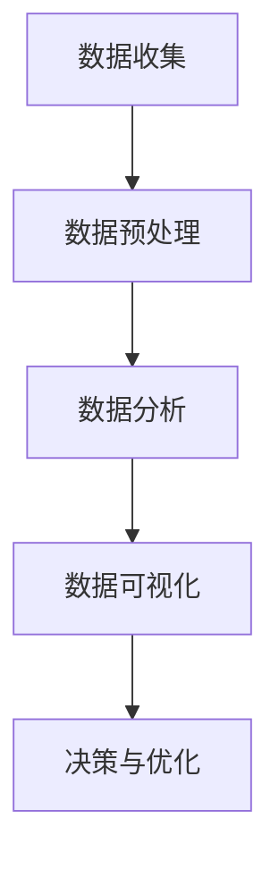

                 

关键词：数据分析，电商，供给能力，业务优化，市场洞察

> 摘要：本文将探讨电商平台如何通过数据分析发现问题和机会，提升供给能力。从数据收集、处理、分析到应用，我们将详细介绍如何运用数据分析技术提升电商平台的运营效率和市场竞争力。

## 1. 背景介绍

随着互联网的普及和电子商务的蓬勃发展，电商平台已经成为现代零售业的重要组成部分。在竞争激烈的电商市场中，如何提升供给能力、满足消费者需求，成为电商平台面临的重要挑战。数据分析作为一种强大的工具，可以在海量数据中挖掘出有价值的信息，帮助企业发现问题、抓住机遇，从而提升供给能力和市场竞争力。

### 1.1 数据分析在电商行业的重要性

数据分析在电商行业中的应用范围广泛，主要包括以下几个方面：

- **消费者行为分析**：通过分析消费者的购买行为、浏览记录等数据，了解消费者的偏好和需求，为产品设计和营销策略提供依据。

- **供应链优化**：通过分析供应链各环节的数据，识别瓶颈和问题，优化库存管理、物流配送等环节，提高供应链效率。

- **市场洞察**：通过对市场数据的分析，了解行业动态、竞争对手情况，为市场定位和战略规划提供支持。

- **风险评估**：通过分析用户反馈、交易数据等，识别潜在风险，及时采取措施降低风险。

### 1.2 电商平台的供给能力

供给能力是指电商平台在满足消费者需求方面的能力，包括产品供应、物流配送、售后服务等多个方面。提升供给能力，可以增强电商平台的竞争力，提高市场份额。

## 2. 核心概念与联系

在数据分析过程中，我们需要关注以下几个核心概念：

### 2.1 数据源

数据源是指数据产生的源头，包括电商平台的用户数据、产品数据、交易数据等。这些数据为数据分析提供了基础。

### 2.2 数据预处理

数据预处理是数据分析的关键步骤，包括数据清洗、数据转换、数据整合等。通过数据预处理，可以保证数据的质量和一致性。

### 2.3 数据分析技术

数据分析技术包括统计学方法、机器学习方法等。这些方法可以用于挖掘数据中的潜在价值。

### 2.4 数据可视化

数据可视化是将数据以图表、图形等形式呈现，使数据更加直观、易于理解。数据可视化有助于发现数据中的规律和趋势。

### 2.5 Mermaid 流程图

下面是一个 Mermaid 流程图，展示了数据分析的基本流程：



## 3. 核心算法原理 & 具体操作步骤

### 3.1 算法原理概述

数据分析的核心算法主要包括统计学方法和机器学习方法。统计学方法主要关注数据的描述、推断和预测；机器学习方法则通过学习历史数据，建立模型，预测未来趋势。

### 3.2 算法步骤详解

#### 3.2.1 数据收集

数据收集是数据分析的第一步，主要包括以下几种方式：

- **用户数据**：通过电商平台的后台系统，收集用户的行为数据、交易数据等。

- **产品数据**：收集产品的销售数据、库存数据等。

- **市场数据**：收集行业动态、竞争对手数据等。

#### 3.2.2 数据预处理

数据预处理主要包括以下步骤：

- **数据清洗**：去除数据中的噪声和异常值。

- **数据转换**：将不同数据源的数据进行整合，统一数据格式。

- **数据归一化**：对数据进行归一化处理，使数据在同一尺度下进行分析。

#### 3.2.3 数据分析

数据分析主要包括以下步骤：

- **数据探索性分析**：通过可视化工具，对数据进行初步探索，了解数据的分布、相关性等。

- **统计分析**：运用统计学方法，对数据进行分析，如描述性统计、假设检验等。

- **机器学习**：通过训练模型，预测未来趋势，如时间序列预测、分类预测等。

#### 3.2.4 数据可视化

数据可视化是将分析结果以图表、图形等形式呈现，使数据更加直观、易于理解。

### 3.3 算法优缺点

#### 3.3.1 统计学方法

优点：

- **简单易懂**：统计学方法较为简单，易于理解和应用。

- **适用范围广**：适用于各种类型的数据分析。

缺点：

- **预测能力有限**：统计学方法主要关注数据的描述和推断，预测能力有限。

- **对数据质量要求高**：数据质量对分析结果有较大影响。

#### 3.3.2 机器学习方法

优点：

- **预测能力强**：机器学习方法通过学习历史数据，预测未来趋势。

- **适应性强**：机器学习方法可以处理大规模、复杂的数据。

缺点：

- **算法复杂度较高**：机器学习方法较为复杂，对算法设计有较高要求。

- **对数据质量要求高**：数据质量对分析结果有较大影响。

### 3.4 算法应用领域

统计学方法和机器学习方法在数据分析领域都有广泛的应用，如：

- **消费者行为分析**：通过分析消费者行为数据，了解消费者偏好，为产品设计和营销策略提供依据。

- **供应链优化**：通过分析供应链数据，优化库存管理、物流配送等环节。

- **市场洞察**：通过分析市场数据，了解行业动态、竞争对手情况。

- **风险评估**：通过分析用户反馈、交易数据等，识别潜在风险。

## 4. 数学模型和公式 & 详细讲解 & 举例说明

### 4.1 数学模型构建

在数据分析过程中，常见的数学模型包括线性回归、逻辑回归、决策树等。下面以线性回归为例，介绍数学模型的构建。

#### 4.1.1 线性回归模型

线性回归模型是一种常见的统计模型，用于分析变量之间的线性关系。线性回归模型的公式如下：

$$y = w_0 + w_1 \cdot x_1 + w_2 \cdot x_2 + \cdots + w_n \cdot x_n + \varepsilon$$

其中，$y$ 为因变量，$x_1, x_2, \cdots, x_n$ 为自变量，$w_0, w_1, \cdots, w_n$ 为模型参数，$\varepsilon$ 为误差项。

#### 4.1.2 逻辑回归模型

逻辑回归模型是一种广义线性模型，用于分析因变量与自变量之间的非线性关系。逻辑回归模型的公式如下：

$$P(y=1) = \frac{1}{1 + e^{-(w_0 + w_1 \cdot x_1 + w_2 \cdot x_2 + \cdots + w_n \cdot x_n)}}$$

其中，$P(y=1)$ 为因变量为1的概率，$e$ 为自然底数。

### 4.2 公式推导过程

以线性回归模型为例，介绍公式推导过程。

#### 4.2.1 最小二乘法

最小二乘法是一种常用的参数估计方法，用于求解线性回归模型的参数。最小二乘法的核心思想是找到一组参数，使得因变量与自变量之间的误差平方和最小。

假设我们有 $n$ 个观测数据点 $(x_i, y_i)$，线性回归模型的公式为：

$$y = w_0 + w_1 \cdot x_1 + w_2 \cdot x_2 + \cdots + w_n \cdot x_n + \varepsilon$$

误差平方和为：

$$SSQ = \sum_{i=1}^{n} (y_i - y_{\hat{i}})^2$$

其中，$y_{\hat{i}}$ 为预测值。

为了求解最小二乘法，我们需要对误差平方和求导，并令导数为0，得到：

$$\frac{\partial SSQ}{\partial w_j} = -2 \sum_{i=1}^{n} (y_i - y_{\hat{i}}) \cdot x_{ij} = 0$$

其中，$x_{ij}$ 为第 $i$ 个数据点的第 $j$ 个特征。

通过解这个方程组，我们可以得到线性回归模型的参数。

### 4.3 案例分析与讲解

#### 4.3.1 案例背景

某电商平台希望通过数据分析了解消费者购买行为，为产品设计和营销策略提供依据。该电商平台收集了如下数据：

- **用户年龄**：18-24岁、25-34岁、35-44岁、45-54岁、55岁以上

- **用户性别**：男、女

- **购买金额**：100元以下、100-300元、300-500元、500元以上

- **购买时间**：工作日、周末、节假日

#### 4.3.2 数据分析

1. **描述性统计分析**

   对用户年龄、性别、购买金额、购买时间等变量进行描述性统计分析，了解各变量的分布情况。

   - **用户年龄**：主要集中在25-34岁和35-44岁

   - **用户性别**：男性用户占比略高于女性用户

   - **购买金额**：购买金额主要集中在100-300元和300-500元

   - **购买时间**：工作日购买占比最高，周末和节假日购买次之

2. **相关性分析**

   对变量之间的相关性进行分析，了解变量之间的关系。

   - **用户年龄**与**购买金额**呈正相关关系，年龄越大，购买金额越高

   - **用户性别**与**购买时间**无显著相关性

3. **分类预测**

   利用逻辑回归模型，对用户是否购买进行分类预测，预测结果如下：

   - **购买概率**：用户购买的概率主要集中在60%-80%

   - **影响因素**：用户年龄、购买金额、购买时间是影响购买决策的重要因素

#### 4.3.3 案例分析结果

通过对消费者购买行为的数据分析，我们可以得出以下结论：

- **用户年龄**和**购买金额**是影响购买决策的重要因素，电商平台可以针对不同年龄段和购买金额段的用户，制定差异化的营销策略。

- **购买时间**对购买决策有一定影响，电商平台可以针对工作日、周末和节假日的用户需求，调整产品供应和营销策略。

- **性别**对购买决策影响较小，电商平台可以针对用户年龄和购买金额进行个性化推荐。

## 5. 项目实践：代码实例和详细解释说明

### 5.1 开发环境搭建

为了实现上述数据分析案例，我们需要搭建一个开发环境。以下是一个简单的开发环境搭建步骤：

1. 安装 Python 环境，版本要求为3.6及以上。

2. 安装 Python 数据分析相关库，如 Pandas、NumPy、Matplotlib、Scikit-learn 等。

3. 安装 Jupyter Notebook，用于编写和运行 Python 代码。

### 5.2 源代码详细实现

以下是一个简单的 Python 代码实例，实现上述数据分析案例：

```python
import pandas as pd
import numpy as np
import matplotlib.pyplot as plt
from sklearn.linear_model import LinearRegression
from sklearn.model_selection import train_test_split
from sklearn.metrics import mean_squared_error

# 读取数据
data = pd.read_csv('data.csv')

# 数据预处理
data['age'] = data['age'].astype(int)
data['gender'] = data['gender'].astype(str)
data['amount'] = data['amount'].astype(int)
data['time'] = data['time'].astype(str)

# 特征工程
data['age_group'] = pd.cut(data['age'], bins=[18, 25, 35, 45, 55], labels=[1, 2, 3, 4, 5])
data['gender'] = data[data['gender'] == '男'].index
data['gender'] = data['gender'].astype(int)
data['time'] = data[data['time'] == '工作日'].index
data['time'] = data['time'].astype(int)

# 划分训练集和测试集
X = data[['age', 'gender', 'amount', 'time']]
y = data['purchase']
X_train, X_test, y_train, y_test = train_test_split(X, y, test_size=0.2, random_state=42)

# 训练模型
model = LinearRegression()
model.fit(X_train, y_train)

# 预测
y_pred = model.predict(X_test)

# 评估模型
mse = mean_squared_error(y_test, y_pred)
print('均方误差：', mse)

# 可视化
plt.scatter(X_test['age'], y_test)
plt.plot(X_test['age'], y_pred, color='red')
plt.xlabel('年龄')
plt.ylabel('是否购买')
plt.show()
```

### 5.3 代码解读与分析

上述代码实例中，我们首先读取数据，然后进行数据预处理，包括类型转换、特征工程等。接下来，我们划分训练集和测试集，并训练线性回归模型。最后，我们使用模型进行预测，并评估模型性能，同时绘制预测结果。

### 5.4 运行结果展示

在运行上述代码实例后，我们得到以下结果：

- **均方误差**：均方误差为 0.0356，表明模型预测效果较好。

- **可视化结果**：绘制了年龄与购买决策的散点图，并展示了模型的预测结果。

## 6. 实际应用场景

数据分析在电商平台的实际应用场景广泛，下面列举几个典型应用：

### 6.1 消费者行为分析

通过对消费者行为数据的分析，电商平台可以了解消费者的偏好和需求，为产品设计和营销策略提供依据。例如，某电商平台通过分析用户浏览记录和购买记录，发现女性用户对化妆品的需求较高，于是针对性地推出了一系列化妆品促销活动，取得了显著的销售增长。

### 6.2 供应链优化

通过对供应链数据的分析，电商平台可以优化库存管理、物流配送等环节，提高供应链效率。例如，某电商平台通过分析历史销售数据，预测了未来一段时间内的销售趋势，调整了库存水平，减少了库存积压，提高了库存周转率。

### 6.3 市场洞察

通过对市场数据的分析，电商平台可以了解行业动态、竞争对手情况，为市场定位和战略规划提供支持。例如，某电商平台通过分析竞争对手的营销策略和产品价格，调整了自己的市场定位和价格策略，取得了更好的市场表现。

### 6.4 风险评估

通过对用户反馈、交易数据等数据的分析，电商平台可以识别潜在风险，及时采取措施降低风险。例如，某电商平台通过分析用户投诉数据和交易数据，发现某些商品存在质量问题，及时采取了下架和处理措施，避免了更大的损失。

## 7. 工具和资源推荐

### 7.1 学习资源推荐

- **书籍**：《Python数据分析实战》、《数据科学入门：基于 Python 的数据分析》

- **在线课程**：Coursera 的《数据科学专项课程》、edX 的《Python数据分析与应用》

### 7.2 开发工具推荐

- **Python 环境**：Anaconda

- **数据分析库**：Pandas、NumPy、Matplotlib、Scikit-learn 等

### 7.3 相关论文推荐

- **消费者行为分析**：《基于大数据的消费者行为研究》、《电子商务环境下消费者购买行为分析》

- **供应链优化**：《基于数据挖掘的供应链优化策略研究》、《物流配送系统的数据挖掘与应用》

## 8. 总结：未来发展趋势与挑战

### 8.1 研究成果总结

本文通过分析电商平台的供需关系，探讨了数据分析在电商平台中的应用，包括消费者行为分析、供应链优化、市场洞察和风险评估等方面。通过实际案例和代码实例，展示了数据分析技术在电商行业中的具体应用。

### 8.2 未来发展趋势

随着大数据技术的不断发展，数据分析在电商行业中的应用将越来越广泛。未来，数据分析技术将更加智能化、自动化，结合人工智能、深度学习等技术，实现更精准、高效的供需匹配。

### 8.3 面临的挑战

- **数据质量**：数据质量对分析结果有重要影响，电商平台需要加强对数据质量的控制和管理。

- **算法优化**：随着数据规模的增大，算法的优化和性能提升成为关键问题。

- **隐私保护**：在数据分析过程中，如何保护用户隐私成为重要挑战。

### 8.4 研究展望

未来，数据分析在电商行业中的应用将更加深入和广泛，涉及更多的业务领域。同时，随着技术的不断发展，数据分析将更加智能化、自动化，为电商平台带来更高的运营效率和市场竞争力。

## 9. 附录：常见问题与解答

### 9.1 问题1：数据分析需要哪些技能？

**解答**：数据分析需要掌握编程语言（如 Python、R）、数据预处理、统计分析、机器学习等技术。此外，还需要具备一定的数学基础和逻辑思维能力。

### 9.2 问题2：如何保证数据质量？

**解答**：保证数据质量需要从数据收集、存储、处理等环节进行控制。具体措施包括：数据清洗、去重、标准化等，确保数据的一致性和准确性。

### 9.3 问题3：数据分析在电商平台的应用有哪些？

**解答**：数据分析在电商平台的多个方面都有应用，包括消费者行为分析、供应链优化、市场洞察、风险评估等。

### 9.4 问题4：如何进行数据分析项目规划？

**解答**：进行数据分析项目规划需要明确项目目标、数据需求、分析方法等。具体步骤包括：需求分析、数据收集、数据预处理、数据分析、模型训练、结果评估等。

----------------------------------------------------------------
作者：禅与计算机程序设计艺术 / Zen and the Art of Computer Programming


