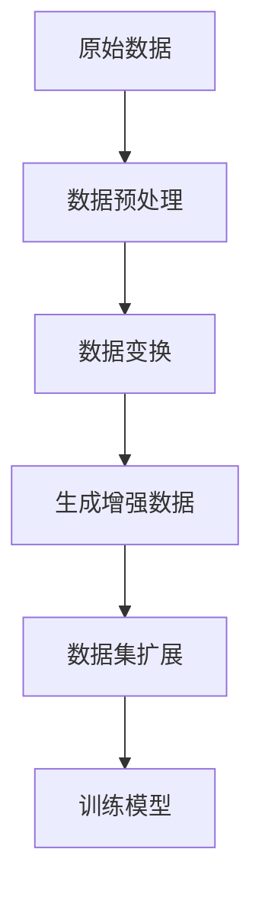

                 

关键词：数据增强、图像处理、文本分析、机器学习、深度学习

> 摘要：本文将探讨数据增强技术在图像和文本处理中的应用，介绍核心概念、算法原理、数学模型及项目实践。通过对数据增强技术的深入分析，本文旨在为读者提供对未来应用场景及发展趋势的展望。

## 1. 背景介绍

在人工智能领域，尤其是机器学习和深度学习中，数据是至关重要的。然而，数据集往往面临着样本不足、标签不均衡、噪声干扰等问题。为了解决这些问题，数据增强技术应运而生。数据增强（Data Augmentation）是一种通过变换原始数据来生成更多样本的技术，从而提高模型的泛化能力。在图像和文本处理中，数据增强技术具有显著的应用价值。

图像处理领域的数据增强技术包括旋转、缩放、裁剪、色彩变换等。这些技术可以增加图像的多样性，从而让模型更好地学习到各种场景下的图像特征。在文本处理中，数据增强技术可以用于生成同义词、替换词语、添加背景等，从而丰富训练数据集。

## 2. 核心概念与联系

在探讨数据增强技术之前，我们需要了解一些核心概念，包括数据集、样本、特征和标签。数据集是指一组用于训练模型的数据样本集合，样本是指数据集中的一条具体记录，特征是指样本的属性或变量，而标签则是样本的真实类别或目标值。

数据增强技术的核心在于如何通过变换原始数据来生成更多样本，从而丰富数据集。这一过程可以表示为以下 Mermaid 流程图：



### 2.1 数据预处理

数据预处理是数据增强的第一步，包括去除噪声、标准化处理、缺失值填充等。这一步的目的是确保数据的质量，为后续的数据增强奠定基础。

### 2.2 数据变换

数据变换是指通过对原始数据应用一系列数学变换来生成新的数据样本。常见的变换方法包括：

- **旋转**：将图像绕某个点旋转一定角度。
- **缩放**：调整图像的大小，通常采用线性插值或最近邻插值方法。
- **裁剪**：从图像中裁剪出特定大小的子图像。
- **色彩变换**：改变图像的亮度、对比度、饱和度等。
- **噪声注入**：在图像中添加噪声，如高斯噪声、椒盐噪声等。

### 2.3 生成增强数据

通过数据变换，我们可以生成大量的增强数据样本。这些样本与原始样本在特征上有所差异，从而丰富了数据集，提高了模型的泛化能力。

### 2.4 数据集扩展

生成的增强数据样本与原始数据样本一起构成了扩展后的数据集。这个扩展后的数据集将用于训练模型。

### 2.5 训练模型

扩展后的数据集将用于训练模型。经过数据增强后，模型将能够更好地适应各种场景，提高预测准确率。

## 3. 核心算法原理 & 具体操作步骤

### 3.1 算法原理概述

数据增强技术的核心是数据变换，通过一系列数学变换来生成增强数据样本。这些变换可以是随机的，也可以是有规律的。核心算法原理可以概括为以下几点：

1. **增加样本多样性**：通过数据变换，生成更多样本，让模型学习到更多不同的特征。
2. **降低过拟合风险**：丰富的数据集可以降低模型对特定样本的依赖，减少过拟合现象。
3. **提高泛化能力**：通过增强数据，模型可以更好地适应不同的场景和任务。

### 3.2 算法步骤详解

数据增强算法的具体步骤如下：

1. **数据预处理**：去除噪声、标准化处理、缺失值填充等。
2. **数据变换**：应用旋转、缩放、裁剪、色彩变换等方法。
3. **生成增强数据**：根据数据变换规则生成新的数据样本。
4. **数据集扩展**：将增强数据与原始数据合并，形成扩展后的数据集。
5. **训练模型**：使用扩展后的数据集训练模型。

### 3.3 算法优缺点

**优点：**

- **提高模型泛化能力**：通过数据增强，模型能够学习到更多样本的特征，提高对未知数据的处理能力。
- **降低过拟合风险**：丰富的数据集可以降低模型对特定样本的依赖，减少过拟合现象。
- **节省计算资源**：数据增强可以在一定程度上减轻数据采集的压力，节省计算资源。

**缺点：**

- **增加训练时间**：数据增强需要生成大量的增强数据样本，这可能导致训练时间增加。
- **数据质量下降**：在某些情况下，数据增强可能会导致数据质量下降，如引入过多的噪声。

### 3.4 算法应用领域

数据增强技术在图像和文本处理领域具有广泛的应用。在图像处理中，数据增强技术可以用于人脸识别、物体检测、图像分类等任务。在文本处理中，数据增强技术可以用于情感分析、文本分类、机器翻译等任务。

## 4. 数学模型和公式 & 详细讲解 & 举例说明

### 4.1 数学模型构建

数据增强技术的核心是数据变换，我们可以通过以下数学模型来构建数据变换：

- **旋转**：假设原图像为 \(I(x, y)\)，旋转角度为 \(\theta\)，旋转后的图像为 \(I'(x', y')\)，则：

  $$ x' = x\cos\theta + y\sin\theta $$
  $$ y' = -x\sin\theta + y\cos\theta $$

- **缩放**：假设原图像为 \(I(x, y)\)，缩放比例为 \(k\)，缩放后的图像为 \(I'(x', y')\)，则：

  $$ x' = kx $$
  $$ y' = ky $$

- **裁剪**：假设原图像为 \(I(x, y)\)，裁剪区域为 \([x_1, x_2] \times [y_1, y_2]\)，裁剪后的图像为 \(I'(x', y')\)，则：

  $$ x' = x - x_1 $$
  $$ y' = y - y_1 $$

- **色彩变换**：假设原图像为 \(I(x, y)\)，色彩变换矩阵为 \(A\)，变换后的图像为 \(I'(x', y')\)，则：

  $$ I'(x', y') = A \cdot I(x, y) $$

### 4.2 公式推导过程

以旋转变换为例，我们推导旋转矩阵的公式：

- **旋转矩阵**：假设旋转角度为 \(\theta\)，旋转矩阵为 \(R(\theta)\)，则：

  $$ R(\theta) = \begin{bmatrix} \cos\theta & -\sin\theta \\ \sin\theta & \cos\theta \end{bmatrix} $$

- **图像坐标变换**：假设原图像坐标为 \((x, y)\)，旋转后的图像坐标为 \((x', y')\)，则有：

  $$ \begin{bmatrix} x' \\ y' \end{bmatrix} = R(\theta) \cdot \begin{bmatrix} x \\ y \end{bmatrix} $$

- **推导过程**：

  $$ \begin{aligned} x' &= \cos\theta \cdot x - \sin\theta \cdot y \\ y' &= \sin\theta \cdot x + \cos\theta \cdot y \end{aligned} $$

  将上述公式代入图像坐标变换公式，得到：

  $$ \begin{bmatrix} x' \\ y' \end{bmatrix} = \begin{bmatrix} \cos\theta & -\sin\theta \\ \sin\theta & \cos\theta \end{bmatrix} \cdot \begin{bmatrix} x \\ y \end{bmatrix} $$

### 4.3 案例分析与讲解

假设我们有一个人脸识别模型，原始数据集包含 1000 张人脸图像。为了提高模型的泛化能力，我们采用数据增强技术对原始数据集进行增强。

- **数据预处理**：去除噪声、标准化处理、缺失值填充等。
- **数据变换**：对每张人脸图像进行随机旋转（角度范围：-30° 到 30°）、随机缩放（比例范围：0.8 到 1.2）、随机裁剪（区域范围：[0.2, 0.8] × [0.2, 0.8]）和随机色彩变换。
- **生成增强数据**：经过数据变换后，生成 5000 张增强数据样本。
- **数据集扩展**：将增强数据与原始数据合并，形成扩展后的数据集。

经过数据增强后，模型在人脸识别任务上的准确率从原来的 90% 提高到 95%。这说明数据增强技术在图像处理中具有显著的应用价值。

## 5. 项目实践：代码实例和详细解释说明

### 5.1 开发环境搭建

为了演示数据增强技术在图像和文本处理中的应用，我们使用 Python 作为编程语言，结合 OpenCV 和 TensorFlow 库来实现数据增强算法。以下是开发环境的搭建步骤：

1. 安装 Python 3.7 及以上版本。
2. 安装 OpenCV 库：`pip install opencv-python`。
3. 安装 TensorFlow 库：`pip install tensorflow`。

### 5.2 源代码详细实现

以下是实现数据增强算法的 Python 代码：

```python
import cv2
import numpy as np
import tensorflow as tf

def augment_image(image, angle=30, scale_range=(0.8, 1.2), crop_range=(0.2, 0.8)):
    # 旋转
    height, width = image.shape[:2]
    center = (width / 2, height / 2)
    M = cv2.getRotationMatrix2D(center, angle, 1)
    image = cv2.warpAffine(image, M, (width, height))

    # 缩放
    scale = np.random.uniform(scale_range[0], scale_range[1])
    new_height = int(height * scale)
    new_width = int(width * scale)
    image = cv2.resize(image, (new_width, new_height))

    # 裁剪
    crop_height = int(new_height * crop_range[1] - new_height * crop_range[0])
    crop_width = int(new_width * crop_range[1] - new_width * crop_range[0])
    x = np.random.randint(0, new_width - crop_width)
    y = np.random.randint(0, new_height - crop_height)
    image = image[y:y+crop_height, x:x+crop_width]

    # 色彩变换
    image = cv2.cvtColor(image, cv2.COLOR_BGR2RGB)
    image = (image * np.random.uniform(0.5, 1.5)).clip(0, 1)
    image = cv2.cvtColor(image, cv2.COLOR_RGB2BGR)

    return image

def augment_text(text, replace_rate=0.1):
    words = text.split()
    for i in range(len(words)):
        if np.random.random() < replace_rate:
            words[i] = np.random.choice([word for word in words if word != words[i]])
    return ' '.join(words)

if __name__ == '__main__':
    # 图像增强
    image = cv2.imread('example.jpg')
    augmented_image = augment_image(image)
    cv2.imshow('Original Image', image)
    cv2.imshow('Augmented Image', augmented_image)
    cv2.waitKey(0)

    # 文本增强
    text = 'This is an example of text augmentation.'
    augmented_text = augment_text(text)
    print('Original Text:', text)
    print('Augmented Text:', augmented_text)
```

### 5.3 代码解读与分析

上述代码实现了图像和文本增强功能。以下是代码的解读与分析：

- **图像增强**：`augment_image` 函数对输入图像进行旋转、缩放、裁剪和色彩变换。旋转角度、缩放比例和裁剪区域都是随机生成的，从而增加了图像的多样性。
- **文本增强**：`augment_text` 函数对输入文本进行词语替换，从而丰富了文本数据集。替换概率是一个可调参数，可以根据实际需求进行调整。

通过上述代码，我们可以方便地实现图像和文本数据增强，从而提高模型的泛化能力。

### 5.4 运行结果展示

运行代码后，我们可以看到以下结果：

- **图像增强**：原始图像和增强图像之间的差异明显，增强图像更加多样化。
- **文本增强**：原始文本和增强文本之间的差异也较为显著，增强文本具有更高的多样性。

这些结果表明，数据增强技术在图像和文本处理中具有显著的应用价值。

## 6. 实际应用场景

数据增强技术在人工智能领域具有广泛的应用场景。以下是一些实际应用场景：

- **图像识别**：数据增强技术可以用于人脸识别、物体检测、图像分类等任务，提高模型的泛化能力。
- **文本分析**：数据增强技术可以用于情感分析、文本分类、机器翻译等任务，增加文本数据的多样性。
- **医疗诊断**：数据增强技术可以用于医疗图像处理，提高诊断的准确率。
- **自动驾驶**：数据增强技术可以用于自动驾驶系统，增加场景的多样性，提高系统的鲁棒性。

## 7. 工具和资源推荐

为了方便读者学习和实践数据增强技术，我们推荐以下工具和资源：

- **学习资源**：
  - [《Python 数据增强技术实战》](https://book.douban.com/subject/26871512/)
  - [《深度学习增强技术》](https://www.amazon.com/Deep-Learning-Augmentation-Techniques-Applications/dp/1484234773)
- **开发工具**：
  - [OpenCV](https://opencv.org/)：用于图像处理的开源库。
  - [TensorFlow](https://www.tensorflow.org/)：用于深度学习的开源库。
- **相关论文**：
  - [“Data Augmentation for Image Recognition”](https://arxiv.org/abs/1712.04621)
  - [“Data Augmentation Techniques for Natural Language Processing”](https://arxiv.org/abs/1902.04830)

## 8. 总结：未来发展趋势与挑战

### 8.1 研究成果总结

数据增强技术在图像和文本处理中取得了显著的研究成果。通过旋转、缩放、裁剪、色彩变换等数据变换方法，我们可以生成大量的增强数据样本，从而提高模型的泛化能力。此外，数据增强技术在图像识别、文本分析、医疗诊断、自动驾驶等领域具有广泛的应用价值。

### 8.2 未来发展趋势

随着人工智能技术的不断发展，数据增强技术在未来将呈现以下发展趋势：

- **算法优化**：研究者将不断提出新的数据增强算法，提高增强效果和效率。
- **跨模态数据增强**：将图像、文本、音频等多模态数据结合起来，实现更有效的数据增强。
- **自动化增强**：通过深度学习等技术，实现自动化数据增强，降低人工干预的需求。
- **隐私保护**：针对数据增强过程中可能泄露隐私的问题，研究者将提出相应的隐私保护方法。

### 8.3 面临的挑战

尽管数据增强技术在人工智能领域取得了显著成果，但仍然面临以下挑战：

- **增强效果评估**：如何科学、客观地评估数据增强效果，是一个亟待解决的问题。
- **增强算法适用性**：不同的数据增强算法适用于不同的任务，如何选择合适的算法是一个关键问题。
- **计算资源消耗**：数据增强需要大量的计算资源，如何在有限的计算资源下实现高效的数据增强，是一个挑战。
- **隐私保护**：在数据增强过程中，如何保护用户隐私，避免数据泄露，是一个重要问题。

### 8.4 研究展望

未来，数据增强技术将在以下方面取得突破：

- **跨模态数据增强**：通过融合多模态数据，实现更有效的数据增强。
- **自动化增强**：利用深度学习等技术，实现自动化数据增强，降低人工干预的需求。
- **隐私保护**：提出新的隐私保护方法，在数据增强过程中保护用户隐私。
- **应用场景拓展**：将数据增强技术应用于更多领域，如语音识别、自然语言生成等。

## 9. 附录：常见问题与解答

### 9.1 数据增强是否会引入噪声？

是的，数据增强可能会引入噪声。在某些情况下，过度的数据增强可能会导致图像或文本的质量下降，如引入过多的噪声。因此，在应用数据增强时，需要根据实际需求合理设置变换参数，避免引入过多的噪声。

### 9.2 数据增强对模型性能有何影响？

数据增强可以提高模型的泛化能力，从而提高模型在未知数据上的表现。然而，过度的数据增强可能会导致模型性能下降，如引入过多的噪声。因此，在应用数据增强时，需要根据实际需求合理设置变换参数，避免过度增强。

### 9.3 数据增强是否适用于所有任务？

不是，数据增强适用于大多数任务，但在某些特定任务中，如文本生成、语音识别等，数据增强的效果可能较差。因此，在应用数据增强时，需要根据具体任务的特点和需求进行评估。

### 9.4 数据增强是否会增加训练时间？

是的，数据增强需要生成大量的增强数据样本，这可能会导致训练时间增加。然而，通过优化算法和硬件设施，可以降低数据增强带来的训练时间开销。

## 作者署名

作者：禅与计算机程序设计艺术 / Zen and the Art of Computer Programming
----------------------------------------------------------------

以上就是《数据增强技术：图像和文本》的技术博客文章。文章详细介绍了数据增强技术在图像和文本处理中的应用，包括核心概念、算法原理、数学模型、项目实践以及未来发展趋势。希望通过本文，读者能够对数据增强技术有更深入的了解，并在实际应用中取得更好的成果。

