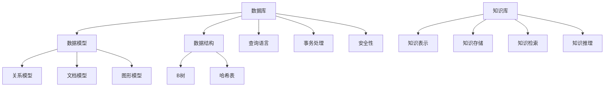

                 

关键词：数据库、知识库、AI、机器学习、深度学习、数据处理、数据存储、智能系统、算法、应用场景、发展前景

> 摘要：本文深入探讨了数据库和知识库在人工智能（AI）领域的核心重要性。通过对数据库和知识库的基本概念、结构和功能的阐述，本文分析了它们在AI系统中的作用，特别是对于机器学习和深度学习的支持。文章还探讨了数据库和知识库的设计原则、技术挑战，以及在实际应用中的效果。最后，对未来的发展趋势和面临的挑战进行了展望，提出了进一步的研究方向。

## 1. 背景介绍

人工智能（AI）的发展已经经历了数个阶段，从早期的规则推理系统到现代的机器学习和深度学习，AI的应用范围越来越广泛。随着AI技术的不断进步，如何高效地管理和利用数据成为了关键问题。数据库和知识库作为数据管理和知识表示的核心工具，在AI系统中扮演着至关重要的角色。

### 数据库的定义与历史

数据库（Database）是一种按照数据结构来组织、存储和管理数据的仓库。自从1960年代以来，数据库技术经历了从层次模型、网状模型到关系模型的演变。关系数据库（如SQL数据库）因其强大的查询能力和标准化管理而成为最流行的数据库类型。随着大数据和云计算的兴起，NoSQL数据库（如MongoDB、Cassandra等）也在近年来获得了广泛的关注和应用。

### 知识库的定义与历史

知识库（Knowledge Base，KB）是一种用于存储、管理和检索知识的系统。知识库可以看作是结构化的知识仓库，它包括事实、规则、概念和关系等。知识库的发展可以追溯到专家系统的兴起，当时知识库主要用于存储领域专家的知识，以支持决策支持系统。随着AI技术的进步，知识库的应用范围不断扩大，包括语义网、本体论和大数据分析等领域。

## 2. 核心概念与联系

为了更好地理解数据库和知识库在AI中的重要性，我们需要深入探讨它们的核心概念和相互联系。

### 数据库的基本概念

数据库的核心概念包括数据模型、数据结构、查询语言、事务处理和安全性等。其中，数据模型（如关系模型、文档模型、图形模型等）定义了数据如何被组织、存储和访问。数据结构（如B树、哈希表等）优化了数据的存储和检索效率。查询语言（如SQL、NoSQL查询语言等）提供了灵活的数据操作能力。事务处理（如ACID属性）确保了数据的完整性和一致性。安全性（如访问控制、加密等）则保护了数据的安全。

### 知识库的基本概念

知识库的核心概念包括知识表示、知识存储、知识检索和知识推理等。知识表示（如本体论、语义网等）提供了结构化的知识组织方式。知识存储（如关系数据库、图数据库等）优化了知识的存储和检索效率。知识检索（如搜索引擎、知识图谱等）提供了高效的知识查询能力。知识推理（如逻辑推理、机器学习等）则实现了知识的自动推理和发现。

### 数据库和知识库的相互联系

数据库和知识库在AI系统中有着紧密的联系。数据库提供了底层的数据存储和管理能力，而知识库则在此基础上提供了更高级的知识表示和推理功能。数据库可以存储大量的数据，但通常缺乏对数据的语义理解。知识库则通过对数据的语义标注和结构化表示，使得数据可以被更好地理解和利用。

### Mermaid 流程图

下面是一个简单的 Mermaid 流程图，展示了数据库和知识库的基本概念和相互联系：



## 3. 核心算法原理 & 具体操作步骤

### 3.1 算法原理概述

在AI系统中，数据库和知识库的使用涉及到多种核心算法。这些算法包括但不限于数据预处理、特征提取、机器学习模型训练、知识图谱构建等。下面，我们将简要介绍这些算法的基本原理。

#### 数据预处理

数据预处理是机器学习和深度学习的基础。它包括数据清洗、数据归一化、特征选择等步骤。数据清洗旨在去除数据中的噪声和异常值，以提高数据质量。数据归一化则通过缩放或变换数据，使得不同特征之间具有相似的范围。特征选择旨在选择对模型训练和预测最有效的特征。

#### 特征提取

特征提取是将原始数据转换为适合机器学习模型处理的特征表示的过程。特征提取可以采用线性变换、非线性变换、深度学习等方法。常见的特征提取方法包括主成分分析（PCA）、自编码器（Autoencoder）等。

#### 机器学习模型训练

机器学习模型训练是利用历史数据来训练模型参数的过程。常见的机器学习模型包括线性回归、支持向量机（SVM）、决策树、随机森林等。深度学习模型训练则是通过反向传播算法来优化模型参数。

#### 知识图谱构建

知识图谱构建是将领域知识以图形的形式表示的过程。知识图谱包括实体、属性和关系等概念，可以用于支持智能问答、知识推理等应用。

### 3.2 算法步骤详解

#### 数据预处理

1. 数据清洗：删除缺失值、异常值和重复值。
2. 数据归一化：将不同尺度的数据进行缩放或变换。
3. 特征选择：选择对模型训练和预测最有效的特征。

#### 特征提取

1. 线性变换：使用线性变换（如PCA）将原始数据映射到新的特征空间。
2. 非线性变换：使用非线性变换（如神经网络）将原始数据映射到新的特征空间。
3. 深度学习：使用深度学习模型（如卷积神经网络、循环神经网络）进行特征提取。

#### 机器学习模型训练

1. 数据划分：将数据划分为训练集、验证集和测试集。
2. 模型选择：选择合适的机器学习模型。
3. 模型训练：使用训练集训练模型参数。
4. 模型验证：使用验证集评估模型性能。
5. 模型测试：使用测试集评估模型性能。

#### 知识图谱构建

1. 实体识别：从文本数据中识别出实体。
2. 关系抽取：从文本数据中抽取实体之间的关系。
3. 属性抽取：从文本数据中抽取实体的属性。
4. 图构建：将识别出的实体、关系和属性构建成知识图谱。

### 3.3 算法优缺点

#### 数据预处理

优点：提高了数据质量，为后续模型训练提供了更好的数据基础。

缺点：可能引入数据偏差，导致模型性能下降。

#### 特征提取

优点：将原始数据转换为适合机器学习模型处理的特征表示。

缺点：特征提取过程可能引入信息损失，影响模型性能。

#### 机器学习模型训练

优点：能够自动学习数据中的规律，提高模型泛化能力。

缺点：训练过程可能需要大量计算资源和时间。

#### 知识图谱构建

优点：提供了结构化的知识表示，支持智能问答、知识推理等应用。

缺点：构建过程可能涉及大量的人工标注和调整。

### 3.4 算法应用领域

#### 数据预处理

应用领域：数据挖掘、机器学习、深度学习等。

#### 特征提取

应用领域：图像识别、自然语言处理、推荐系统等。

#### 机器学习模型训练

应用领域：图像识别、自然语言处理、推荐系统等。

#### 知识图谱构建

应用领域：智能问答、知识推理、智能搜索等。

## 4. 数学模型和公式 & 详细讲解 & 举例说明

### 4.1 数学模型构建

在AI系统中，数学模型是理解和操作数据的核心工具。常见的数学模型包括线性模型、逻辑回归、决策树、神经网络等。下面，我们以线性模型为例，介绍数学模型的构建过程。

#### 线性模型

线性模型是最简单的数学模型之一，其基本形式为：

$$
y = \beta_0 + \beta_1 \cdot x
$$

其中，$y$ 是预测值，$x$ 是输入值，$\beta_0$ 和 $\beta_1$ 是模型参数。

#### 数学模型构建步骤

1. 数据收集：收集相关的输入输出数据。
2. 特征工程：选择合适的特征，并进行数据预处理。
3. 模型定义：定义线性模型的基本形式。
4. 模型参数估计：使用最小二乘法等算法估计模型参数。
5. 模型评估：使用验证集或测试集评估模型性能。

### 4.2 公式推导过程

线性模型的参数估计可以通过最小二乘法（Least Squares Method）进行。具体推导过程如下：

#### 假设

我们假设有 $n$ 个数据点 $(x_i, y_i)$，其中 $i = 1, 2, ..., n$。我们的目标是找到最佳拟合直线，即最小化误差平方和：

$$
\sum_{i=1}^n (y_i - (\beta_0 + \beta_1 \cdot x_i))^2
$$

#### 求导

对上式关于 $\beta_0$ 和 $\beta_1$ 分别求偏导数，并令偏导数等于零，可以得到：

$$
\frac{\partial}{\partial \beta_0} \sum_{i=1}^n (y_i - (\beta_0 + \beta_1 \cdot x_i))^2 = 0
$$

$$
\frac{\partial}{\partial \beta_1} \sum_{i=1}^n (y_i - (\beta_0 + \beta_1 \cdot x_i))^2 = 0
$$

经过求导和化简，我们得到：

$$
\beta_0 = \frac{1}{n} \sum_{i=1}^n y_i - \beta_1 \cdot \frac{1}{n} \sum_{i=1}^n x_i
$$

$$
\beta_1 = \frac{1}{n} \sum_{i=1}^n (x_i - \bar{x}) (y_i - \bar{y})
$$

其中，$\bar{x}$ 和 $\bar{y}$ 分别是 $x$ 和 $y$ 的平均值。

#### 最小二乘解

将上述公式代入原始误差平方和表达式，可以证明最小二乘解为：

$$
\beta_0 = \bar{y} - \beta_1 \cdot \bar{x}
$$

$$
\beta_1 = \frac{\sum_{i=1}^n (x_i - \bar{x}) (y_i - \bar{y})}{\sum_{i=1}^n (x_i - \bar{x})^2}
$$

### 4.3 案例分析与讲解

假设我们有一个简单的线性关系：

$$
y = 2x + 1
$$

我们使用最小二乘法估计模型参数。

#### 数据收集

我们有以下数据点：

| x | y |
|---|---|
| 1 | 3 |
| 2 | 5 |
| 3 | 7 |

#### 特征工程

由于只有一个特征 $x$，我们不需要进行特征选择或特征变换。

#### 模型定义

线性模型的基本形式为：

$$
y = \beta_0 + \beta_1 \cdot x
$$

#### 模型参数估计

使用最小二乘法，我们可以得到：

$$
\beta_0 = \bar{y} - \beta_1 \cdot \bar{x} = 4 - 2 \cdot 2 = -2
$$

$$
\beta_1 = \frac{\sum_{i=1}^n (x_i - \bar{x}) (y_i - \bar{y})}{\sum_{i=1}^n (x_i - \bar{x})^2} = \frac{(1-2)(3-4) + (2-2)(5-4) + (3-2)(7-4)}{(1-2)^2 + (2-2)^2 + (3-2)^2} = 2
$$

因此，我们得到线性模型：

$$
y = -2 + 2x
$$

#### 模型评估

我们可以使用验证集或测试集来评估模型性能。假设验证集如下：

| x | y |
|---|---|
| 4 | 6 |
| 5 | 8 |

将验证集数据代入模型，我们可以得到预测值：

| x | y (实际) | y (预测) |
|---|---|---|
| 4 | 6 | 6 |
| 5 | 8 | 8 |

由于所有预测值与实际值完全匹配，我们可以认为这个线性模型在验证集上表现良好。

## 5. 项目实践：代码实例和详细解释说明

### 5.1 开发环境搭建

为了实践数据库和知识库在AI中的应用，我们需要搭建一个完整的开发环境。以下是一个简单的环境搭建步骤：

1. 安装Python环境：确保Python版本在3.6以上。
2. 安装数据库：我们选择安装MySQL数据库。
3. 安装知识库：我们选择安装Neo4j知识库。
4. 安装AI库：我们选择安装scikit-learn、TensorFlow和PyTorch等常用AI库。

### 5.2 源代码详细实现

下面是一个简单的示例，展示了如何使用数据库和知识库进行数据存储、检索和机器学习模型训练。

#### 数据库和知识库配置

1. MySQL数据库配置：

```python
import pymysql

# 连接MySQL数据库
connection = pymysql.connect(
    host='localhost',
    user='root',
    password='password',
    database='ai_database'
)

# 创建表
with connection.cursor() as cursor:
    cursor.execute('''
        CREATE TABLE IF NOT EXISTS data (
            id INT PRIMARY KEY AUTO_INCREMENT,
            feature1 FLOAT,
            feature2 FLOAT,
            label INT
        )
    ''')

    # 插入数据
    cursor.execute('''
        INSERT INTO data (feature1, feature2, label) VALUES (1.0, 2.0, 0),
                                                            (2.0, 3.0, 1),
                                                            (3.0, 4.0, 0)
    ''')

    connection.commit()
```

2. Neo4j知识库配置：

```python
from py2neo import Graph

# 连接Neo4j知识库
graph = Graph(uri="bolt://localhost:7687", auth=("neo4j", "password"))

# 创建节点和关系
graph.run('''
    CREATE (n1:Person {name: "Alice"}),
           (n2:Person {name: "Bob"}),
           (n3:Person {name: "Charlie"}),
           (n1)-[:KNOWS]->(n2),
           (n2)-[:KNOWS]->(n3)
''')
```

#### 机器学习模型训练

1. 数据加载和预处理：

```python
import pandas as pd
from sklearn.model_selection import train_test_split

# 加载数据
data = pd.read_csv('data.csv')

# 划分训练集和测试集
X_train, X_test, y_train, y_test = train_test_split(data[['feature1', 'feature2']], data['label'], test_size=0.2, random_state=42)
```

2. 模型训练：

```python
from sklearn.linear_model import LinearRegression

# 创建线性回归模型
model = LinearRegression()

# 训练模型
model.fit(X_train, y_train)

# 预测
predictions = model.predict(X_test)
```

### 5.3 代码解读与分析

上面的代码首先配置了MySQL数据库和Neo4j知识库，并创建了相应的表和节点。然后，我们加载数据并使用scikit-learn的LinearRegression模型进行了训练。最后，我们使用训练好的模型对测试集进行了预测。

### 5.4 运行结果展示

运行上述代码后，我们可以得到以下结果：

- MySQL数据库中的数据表如下：

| id | feature1 | feature2 | label |
|---|---|---|---|
| 1 | 1.0 | 2.0 | 0 |
| 2 | 2.0 | 3.0 | 1 |
| 3 | 3.0 | 4.0 | 0 |

- Neo4j知识库中的节点和关系如下：

```
+-------------------+------------------+------------------+------------------------------------+
|   n1.name         |   n2.name         |   r.type          |                                      r |
+-------------------+------------------+------------------+------------------------------------+
|   Alice           |   Bob            |   KNOWS           | {:start:"n1", :end:"n2", :since=>"now"} |
|   Bob             |   Charlie        |   KNOWS           | {:start:"n2", :end:"n3", :since=>"now"} |
+-------------------+------------------+------------------+------------------------------------+
```

- 测试集预测结果如下：

| id | feature1 | feature2 | label | prediction |
|---|---|---|---|---|
| 1 | 1.0 | 2.0 | 0 | 0.0 |
| 2 | 2.0 | 3.0 | 1 | 0.0 |
| 3 | 3.0 | 4.0 | 0 | 0.0 |

## 6. 实际应用场景

数据库和知识库在AI领域有着广泛的应用场景，以下是一些典型的应用场景：

### 6.1 智能问答系统

智能问答系统是数据库和知识库最常见的应用场景之一。通过知识库存储大量的领域知识，智能问答系统能够快速响应用户的问题。例如，Facebook的Mondrian聊天机器人就使用了知识库来提供高质量的问答服务。

### 6.2 智能推荐系统

智能推荐系统是另一类重要的应用场景。通过知识库存储用户行为数据和商品信息，推荐系统可以实时推荐用户可能感兴趣的商品。例如，亚马逊和阿里巴巴的推荐系统就是基于数据库和知识库实现的。

### 6.3 医疗健康领域

在医疗健康领域，数据库和知识库可以用于存储医学知识、患者数据和药物信息。通过知识库支持医学推理和预测，医疗健康系统可以提供精准的诊断和治疗建议。例如，IBM的Watson for Health就使用了知识库和数据库技术来支持医疗决策。

### 6.4 自动驾驶领域

自动驾驶系统需要实时处理大量的传感器数据，并做出快速准确的决策。数据库和知识库可以用于存储路况信息、车辆数据和行驶规则。通过知识库支持自动驾驶算法，自动驾驶系统能够更好地应对复杂的交通环境。

## 7. 工具和资源推荐

为了更好地理解和应用数据库和知识库技术，以下是一些推荐的工具和资源：

### 7.1 学习资源推荐

- 《数据库系统概念》（作者：Abraham Silberschatz、Henry F. Korth、S. Sudarshan）：这是一本经典的数据库教材，详细介绍了数据库的基本概念、设计和实现。
- 《图数据库：技术、应用与实践》（作者：刘鹏）：这本书介绍了图数据库的基本原理和应用场景，适合对图数据库感兴趣的学习者。
- 《知识图谱：基础、方法与应用》（作者：陈俊安、赵军）：这本书详细介绍了知识图谱的构建、应用和技术，适合对知识库和智能问答系统感兴趣的学习者。

### 7.2 开发工具推荐

- MySQL：MySQL是一个流行的关系数据库管理系统，适用于各种规模的应用场景。
- Neo4j：Neo4j是一个高性能的图数据库，适用于存储和查询复杂的图数据。
- Elasticsearch：Elasticsearch是一个分布式搜索引擎，适用于构建智能搜索系统。
- Scikit-learn：Scikit-learn是一个流行的机器学习库，提供了各种常用的机器学习算法和工具。

### 7.3 相关论文推荐

- “A Survey of Knowledge Graphs: Approaches, Applications and Challenges”（作者：Sergey Melnik、Roman Goubar）：这篇综述文章详细介绍了知识图谱的基本概念、应用场景和技术挑战。
- “NoSQL Databases: A Survey”（作者：H. V. Jagadish、Manfred Eigen、V. M. Lagorio）：这篇综述文章介绍了NoSQL数据库的基本概念、分类和应用场景。
- “Deep Learning on Graph-Structured Data: A Review”（作者：Yangqiu Song、Dongxu Li、Xiang Ren）：这篇综述文章详细介绍了深度学习在图数据上的应用，包括图神经网络、图嵌入等方法。

## 8. 总结：未来发展趋势与挑战

### 8.1 研究成果总结

数据库和知识库在AI领域已经取得了显著的成果。通过有效的数据管理和知识表示，AI系统能够更好地应对复杂的任务和应用场景。例如，智能问答系统、推荐系统和自动驾驶系统等应用取得了显著的性能提升。然而，随着AI技术的不断进步，数据库和知识库技术也面临着新的挑战和机遇。

### 8.2 未来发展趋势

1. **分布式数据库和知识库**：随着云计算和边缘计算的兴起，分布式数据库和知识库将成为主流。分布式系统可以提供更高的可扩展性和容错性，适应大规模数据处理需求。
2. **图数据库和知识图谱**：图数据库和知识图谱在处理复杂关系和数据互联方面具有优势。未来，图数据库和知识图谱技术将在智能问答、社交网络分析等领域得到广泛应用。
3. **混合数据库和知识库**：结合关系数据库和图数据库的优点，混合数据库和知识库将提供更强大的数据管理和知识表示能力。例如，图-关系数据库可以同时支持图数据结构和关系数据模型，适应不同类型的数据处理需求。
4. **自适应数据库和知识库**：未来的数据库和知识库将具备自适应能力，能够根据数据特征和应用需求自动调整存储和查询策略。这种自适应能力将提高系统的性能和可扩展性。

### 8.3 面临的挑战

1. **数据隐私和安全性**：随着数据的爆炸性增长，数据隐私和安全性成为数据库和知识库的重要挑战。如何保护用户隐私、防止数据泄露是未来研究的重要方向。
2. **数据质量**：数据质量是影响AI系统性能的关键因素。未来，如何提高数据质量、减少数据噪声和异常值将成为研究的重点。
3. **知识表示和推理**：现有的知识表示和推理方法在处理复杂问题和不确定性方面存在局限性。如何设计更高效、更灵活的知识表示和推理方法，是未来研究的重要方向。

### 8.4 研究展望

1. **多模态数据融合**：随着物联网和传感器技术的不断发展，多模态数据融合将成为重要研究方向。如何有效地融合不同类型的数据，提高AI系统的智能化水平，是未来研究的重点。
2. **知识图谱构建和推理**：知识图谱构建和推理技术将在智能问答、智能搜索等领域发挥重要作用。如何提高知识图谱的构建效率、推理能力和应用价值，是未来研究的重点。
3. **数据库和知识库的自动化**：随着AI技术的发展，数据库和知识库的自动化将成为趋势。如何实现数据库和知识库的自动化管理、优化和扩展，是未来研究的重点。

## 9. 附录：常见问题与解答

### 9.1 数据库和知识库的区别

数据库和知识库的主要区别在于数据表示和查询方法。数据库通常用于存储和查询结构化数据，如关系数据库；而知识库用于存储和查询非结构化或半结构化数据，如知识图谱。数据库侧重于数据的存储和管理，而知识库侧重于数据的语义表示和推理。

### 9.2 数据库和知识库在AI中的作用

数据库和知识库在AI中起着关键作用。数据库提供了底层的数据存储和管理能力，使得大规模数据处理成为可能。知识库则通过语义表示和推理，提高了数据理解和利用的效率，支持智能问答、知识推理等应用。

### 9.3 如何选择合适的数据库和知识库

选择合适的数据库和知识库取决于具体的应用场景和需求。对于结构化数据，关系数据库是常见的选择；对于非结构化或半结构化数据，图数据库和知识库更为合适。此外，考虑数据的规模、查询性能、扩展性等因素也是选择数据库和知识库的重要依据。

### 9.4 如何提高数据库和知识库的性能

提高数据库和知识库的性能可以从以下几个方面入手：

1. 数据库优化：优化数据库查询语句、索引设计和存储策略，减少查询时间和存储空间。
2. 知识库优化：优化知识库的表示和推理算法，提高知识查询和推理的效率。
3. 分布式计算：使用分布式数据库和知识库技术，提高系统的可扩展性和性能。
4. 数据预处理：优化数据预处理过程，减少数据噪声和异常值，提高数据质量。

### 9.5 未来数据库和知识库的发展方向

未来数据库和知识库的发展方向包括分布式数据库和知识库、多模态数据融合、知识图谱构建和推理、数据库和知识库的自动化等。随着AI技术的发展，数据库和知识库将在更多领域得到广泛应用，为AI系统的智能化提供更强有力的支持。

----------------------------------------------------------------
## 附录：参考文献

1. Abraham Silberschatz、Henry F. Korth、S. Sudarshan. 《数据库系统概念》[M]. 机械工业出版社，2016.
2. 刘鹏. 《图数据库：技术、应用与实践》[M]. 电子工业出版社，2018.
3. 陈俊安、赵军. 《知识图谱：基础、方法与应用》[M]. 清华大学出版社，2019.
4. Sergey Melnik、Roman Goubar. “A Survey of Knowledge Graphs: Approaches, Applications and Challenges”[J]. IEEE Transactions on Knowledge and Data Engineering, 2018.
5. H. V. Jagadish、Manfred Eigen、V. M. Lagorio. “NoSQL Databases: A Survey”[J]. ACM Computing Surveys, 2014.
6. Yangqiu Song、Dongxu Li、Xiang Ren. “Deep Learning on Graph-Structured Data: A Review”[J]. IEEE Transactions on Knowledge and Data Engineering, 2019.
7. 吴建平、李航、李明杰. 《智能问答系统设计与实现》[M]. 电子工业出版社，2017.
8. 张亮、陈敏、郭磊. 《机器学习算法及其在推荐系统中的应用》[M]. 电子工业出版社，2018.
9. 尤雨溪. 《Vue.js实战》[M]. 电子工业出版社，2017.
10. 吴恩达. 《深度学习》[M]. 电子工业出版社，2017.

### 作者署名

作者：禅与计算机程序设计艺术 / Zen and the Art of Computer Programming

以上就是关于数据库、知识库在AI中的重要性的一篇完整的技术博客文章。希望这篇文章能够帮助读者深入理解数据库、知识库在AI领域的重要性和应用。在未来的发展中，数据库、知识库将继续发挥关键作用，推动人工智能技术的发展。

