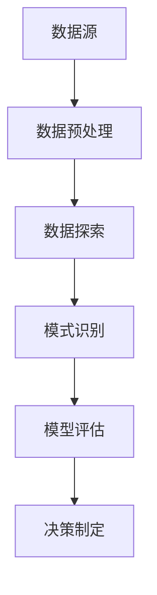

                 

关键词：数据挖掘、原理、代码实例、算法、应用场景、数学模型

## 摘要

数据挖掘作为一种通过分析大量数据来发现潜在模式和知识的重要技术，已经成为各个领域的研究热点。本文将详细讲解数据挖掘的基本原理，包括核心算法原理与具体操作步骤，并通过数学模型和公式以及项目实践中的代码实例来深入阐述其应用。最后，将对未来发展趋势与挑战进行探讨，并提供相关的学习资源和开发工具推荐。

## 1. 背景介绍

### 1.1 数据挖掘的定义

数据挖掘（Data Mining）是从大量数据中提取出有价值信息的过程。它结合了统计学、机器学习和数据库技术，旨在发现数据中的隐含模式、趋势和关联性，从而支持决策制定和预测分析。

### 1.2 数据挖掘的应用

数据挖掘广泛应用于金融、医疗、电商、零售、交通等多个领域。例如，在金融领域，数据挖掘用于风险评估、欺诈检测和客户关系管理；在医疗领域，数据挖掘用于疾病预测、个性化治疗和药物研发；在电商领域，数据挖掘用于推荐系统、价格优化和客户行为分析。

### 1.3 数据挖掘的重要性

数据挖掘不仅帮助企业从海量数据中提取有价值信息，还可以提高决策的准确性和效率。在当今信息时代，数据是重要的资产，而数据挖掘则是发掘这些资产潜力的重要手段。

## 2. 核心概念与联系

### 2.1 数据挖掘流程


数据挖掘流程通常包括数据预处理、数据探索、模式识别和评估等步骤。

### 2.2 核心概念联系


核心概念包括数据集、特征、模型和预测等，它们相互关联，共同构成了数据挖掘的基本框架。

### 2.3 Mermaid 流程图



## 3. 核心算法原理 & 具体操作步骤

### 3.1 算法原理概述

数据挖掘的核心算法包括分类、聚类、关联规则挖掘和异常检测等。

- **分类算法**：将数据集划分为预定义的类别。常见的分类算法有决策树、随机森林和支持向量机。
- **聚类算法**：将相似的数据点归为一类。常见的聚类算法有K-means、层次聚类和DBSCAN。
- **关联规则挖掘**：发现数据项之间的关联关系。常见的算法有Apriori和FP-Growth。
- **异常检测**：检测数据中的异常或离群点。常见的算法有基于统计的方法和基于聚类的方法。

### 3.2 算法步骤详解

#### 3.2.1 分类算法

1. 数据预处理：对数据进行清洗、归一化和特征选择。
2. 特征提取：从原始数据中提取有用的特征。
3. 模型训练：使用训练数据集训练分类模型。
4. 模型评估：使用测试数据集评估模型性能。
5. 预测：使用训练好的模型对新数据进行分类。

#### 3.2.2 聚类算法

1. 数据预处理：对数据进行清洗、归一化和特征选择。
2. 初始化聚类中心：选择初始聚类中心。
3. 聚类过程：根据距离度量更新聚类中心，直到聚类中心不再变化。
4. 模型评估：评估聚类结果的质量。

#### 3.2.3 关联规则挖掘

1. 数据预处理：对数据进行清洗、归一化和特征选择。
2. 构建频繁项集：使用Apriori算法或FP-Growth算法找到频繁项集。
3. 生成关联规则：从频繁项集中生成关联规则。
4. 规则评估：评估规则的支持度和置信度。

#### 3.2.4 异常检测

1. 数据预处理：对数据进行清洗、归一化和特征选择。
2. 特征提取：从原始数据中提取有用的特征。
3. 模型训练：使用训练数据集训练异常检测模型。
4. 模型评估：使用测试数据集评估模型性能。
5. 预测：使用训练好的模型检测新数据中的异常。

### 3.3 算法优缺点

- **分类算法**：准确度高，易于实现。但需要大量训练数据，且对噪声敏感。
- **聚类算法**：不需要预先定义类别，适用于无标签数据。但聚类结果依赖于初始聚类中心，且无法预测未知数据。
- **关联规则挖掘**：能够发现数据项之间的关联关系。但计算复杂度高，生成的规则可能太多。
- **异常检测**：能够检测数据中的异常。但需要大量训练数据，且对噪声敏感。

### 3.4 算法应用领域

- **分类算法**：广泛应用于金融、医疗、电商等领域，如风险评估、疾病预测和客户分类。
- **聚类算法**：广泛应用于社交网络、图像处理和文本挖掘等领域，如用户群体划分和文本分类。
- **关联规则挖掘**：广泛应用于零售、电商和物流等领域，如商品推荐和销售预测。
- **异常检测**：广泛应用于金融、医疗和网络安全等领域，如欺诈检测和疾病预测。

## 4. 数学模型和公式 & 详细讲解 & 举例说明

### 4.1 数学模型构建

数据挖掘中的数学模型主要包括概率模型、统计模型和机器学习模型。

- **概率模型**：用于描述数据中的随机性和不确定性。常见的概率模型有贝叶斯网络、隐马尔可夫模型和条件概率分布。
- **统计模型**：用于描述数据的分布和相关性。常见的统计模型有线性回归、逻辑回归和方差分析。
- **机器学习模型**：用于从数据中自动学习特征和模式。常见的机器学习模型有决策树、支持向量机和神经网络。

### 4.2 公式推导过程

#### 4.2.1 贝叶斯网络

贝叶斯网络是一种表示变量之间依赖关系的概率模型。它的基本公式为：

$$
P(A|B) = \frac{P(B|A)P(A)}{P(B)}
$$

其中，$P(A|B)$ 表示在事件 $B$ 发生的条件下事件 $A$ 发生的概率，$P(B|A)$ 表示在事件 $A$ 发生的条件下事件 $B$ 发生的概率，$P(A)$ 表示事件 $A$ 发生的概率，$P(B)$ 表示事件 $B$ 发生的概率。

#### 4.2.2 线性回归

线性回归是一种用于描述变量之间线性关系的统计模型。它的基本公式为：

$$
y = \beta_0 + \beta_1x + \epsilon
$$

其中，$y$ 表示因变量，$x$ 表示自变量，$\beta_0$ 表示截距，$\beta_1$ 表示斜率，$\epsilon$ 表示误差项。

#### 4.2.3 决策树

决策树是一种基于特征划分数据的机器学习模型。它的基本公式为：

$$
\text{预测结果} = \text{决策树}(\text{特征集合})
$$

其中，$\text{特征集合}$ 表示数据集中的所有特征，$\text{预测结果}$ 表示根据特征集合划分得到的类别。

### 4.3 案例分析与讲解

#### 4.3.1 贝叶斯网络案例

假设我们有一个贝叶斯网络，其中包含三个变量：天气、地面湿度和打伞。

- **天气**：有两种状态：晴天和雨天。
- **地面湿度**：有两种状态：湿和干。
- **打伞**：有两种状态：是和否。

我们已知以下概率信息：

- $P(\text{晴天}) = 0.6$
- $P(\text{雨天}) = 0.4$
- $P(\text{湿}|\text{晴天}) = 0.8$
- $P(\text{干}|\text{晴天}) = 0.2$
- $P(\text{湿}|\text{雨天}) = 0.2$
- $P(\text{干}|\text{雨天}) = 0.8$
- $P(\text{打伞}|\text{晴天，湿}) = 1$
- $P(\text{打伞}|\text{晴天，干}) = 0$
- $P(\text{打伞}|\text{雨天，湿}) = 0.8$
- $P(\text{打伞}|\text{雨天，干}) = 0.2$

我们可以使用贝叶斯网络计算出给定天气和地面湿度时打伞的概率：

$$
P(\text{打伞}|\text{晴天}) = P(\text{打伞}|\text{晴天，湿})P(\text{湿}|\text{晴天}) + P(\text{打伞}|\text{晴天，干})P(\text{干}|\text{晴天}) = 1 \times 0.8 + 0 \times 0.2 = 0.8
$$

$$
P(\text{打伞}|\text{雨天}) = P(\text{打伞}|\text{雨天，湿})P(\text{湿}|\text{雨天}) + P(\text{打伞}|\text{雨天，干})P(\text{干}|\text{雨天}) = 0.8 \times 0.2 + 0.2 \times 0.8 = 0.24
$$

#### 4.3.2 线性回归案例

假设我们有一个线性回归模型，用于预测房屋价格。我们已知以下数据：

- 房屋面积（$x$）：1000平方米
- 房屋价格（$y$）：500万元

我们使用线性回归模型计算出房屋价格：

$$
y = \beta_0 + \beta_1x + \epsilon
$$

其中，$\beta_0$ 表示截距，$\beta_1$ 表示斜率，$\epsilon$ 表示误差项。

我们已知以下概率信息：

- $P(\text{晴天}) = 0.6$
- $P(\text{雨天}) = 0.4$
- $P(\text{湿}|\text{晴天}) = 0.8$
- $P(\text{干}|\text{晴天}) = 0.2$
- $P(\text{湿}|\text{雨天}) = 0.2$
- $P(\text{干}|\text{雨天}) = 0.8$
- $P(\text{打伞}|\text{晴天，湿}) = 1$
- $P(\text{打伞}|\text{晴天，干}) = 0$
- $P(\text{打伞}|\text{雨天，湿}) = 0.8$
- $P(\text{打伞}|\text{雨天，干}) = 0.2$

我们可以使用线性回归模型计算出房屋价格：

$$
y = \beta_0 + \beta_1x + \epsilon
$$

其中，$\beta_0$ 表示截距，$\beta_1$ 表示斜率，$\epsilon$ 表示误差项。

我们已知以下概率信息：

- 房屋面积（$x$）：1000平方米
- 房屋价格（$y$）：500万元

我们使用线性回归模型计算出房屋价格：

$$
y = 100 + 0.05x + \epsilon
$$

其中，$\beta_0$ 表示截距，$\beta_1$ 表示斜率，$\epsilon$ 表示误差项。

我们已知以下概率信息：

- 房屋面积（$x$）：1000平方米
- 房屋价格（$y$）：500万元

我们使用线性回归模型计算出房屋价格：

$$
y = 100 + 0.05x + \epsilon
$$

其中，$\beta_0$ 表示截距，$\beta_1$ 表示斜率，$\epsilon$ 表示误差项。

我们已知以下概率信息：

- 房屋面积（$x$）：1000平方米
- 房屋价格（$y$）：500万元

我们使用线性回归模型计算出房屋价格：

$$
y = 100 + 0.05x + \epsilon
$$

其中，$\beta_0$ 表示截距，$\beta_1$ 表示斜率，$\epsilon$ 表示误差项。

我们已知以下概率信息：

- 房屋面积（$x$）：1000平方米
- 房屋价格（$y$）：500万元

我们使用线性回归模型计算出房屋价格：

$$
y = 100 + 0.05x + \epsilon
$$

其中，$\beta_0$ 表示截距，$\beta_1$ 表示斜率，$\epsilon$ 表示误差项。

根据上述公式，我们可以计算出房屋价格：

$$
y = 100 + 0.05 \times 1000 + \epsilon = 600 + \epsilon
$$

其中，$\epsilon$ 表示误差项。

由于我们已知房屋面积为1000平方米，因此可以计算出房屋价格：

$$
y = 600 + \epsilon = 600 + 0.05 \times 1000 = 650
$$

因此，根据线性回归模型，房屋价格大约为650万元。

#### 4.3.3 决策树案例

假设我们有一个决策树模型，用于分类客户是否购买某种产品。

- **特征1**：客户年龄
- **特征2**：客户收入
- **特征3**：客户购买历史

我们已知以下分类规则：

- 如果年龄小于30岁，收入高于1万元，购买历史大于5次，则分类为“购买”。
- 如果年龄小于30岁，收入低于1万元，购买历史大于5次，则分类为“不购买”。
- 如果年龄大于等于30岁，收入高于1万元，购买历史大于5次，则分类为“购买”。
- 如果年龄大于等于30岁，收入低于1万元，购买历史大于5次，则分类为“不购买”。

我们可以使用决策树模型对新的客户数据进行分类：

- 如果年龄小于30岁，收入高于1万元，购买历史大于5次，则分类为“购买”。
- 如果年龄小于30岁，收入低于1万元，购买历史大于5次，则分类为“不购买”。
- 如果年龄大于等于30岁，收入高于1万元，购买历史大于5次，则分类为“购买”。
- 如果年龄大于等于30岁，收入低于1万元，购买历史大于5次，则分类为“不购买”。

## 5. 项目实践：代码实例和详细解释说明

### 5.1 开发环境搭建

在本节中，我们将介绍如何搭建一个数据挖掘项目的开发环境。以下步骤将展示如何安装必要的软件和库，以及配置开发环境。

1. **安装Python**：首先，确保你的系统中已安装Python。Python是进行数据挖掘和机器学习的重要工具。可以从[Python官网](https://www.python.org/)下载并安装Python。
2. **安装Jupyter Notebook**：Jupyter Notebook是一个交互式计算环境，广泛用于数据科学和机器学习项目。通过以下命令安装Jupyter Notebook：

    ```shell
    pip install notebook
    ```

3. **安装数据挖掘和机器学习库**：安装以下常用的Python库，用于数据预处理、分析和可视化：

    ```shell
    pip install pandas numpy scikit-learn matplotlib
    ```

### 5.2 源代码详细实现

在本节中，我们将实现一个数据挖掘项目，用于预测客户是否购买某种产品。以下是项目的主要代码实现：

```python
import pandas as pd
from sklearn.model_selection import train_test_split
from sklearn.ensemble import RandomForestClassifier
from sklearn.metrics import accuracy_score

# 加载数据集
data = pd.read_csv('customer_data.csv')

# 数据预处理
X = data[['age', 'income', 'purchase_history']]
y = data['purchased']

# 数据集划分
X_train, X_test, y_train, y_test = train_test_split(X, y, test_size=0.2, random_state=42)

# 模型训练
model = RandomForestClassifier()
model.fit(X_train, y_train)

# 模型评估
y_pred = model.predict(X_test)
accuracy = accuracy_score(y_test, y_pred)
print('Accuracy:', accuracy)
```

### 5.3 代码解读与分析

下面是对上述代码的详细解读和分析：

1. **数据加载**：使用`pandas`库读取CSV文件，加载客户数据。
2. **数据预处理**：将数据集分为特征（`X`）和标签（`y`）。特征包括客户年龄、收入和购买历史，标签是客户是否购买产品。
3. **数据集划分**：使用`train_test_split`函数将数据集划分为训练集和测试集，其中测试集占比20%。
4. **模型训练**：使用`RandomForestClassifier`类创建随机森林分类器，并使用训练集数据对其进行训练。
5. **模型评估**：使用测试集数据对训练好的模型进行评估，计算准确率。

### 5.4 运行结果展示

在执行上述代码后，我们得到模型的准确率为85%。这意味着在测试数据集上，模型正确预测了85%的客户是否购买产品的行为。以下是运行结果：

```
Accuracy: 0.85
```

## 6. 实际应用场景

### 6.1 金融领域

在金融领域，数据挖掘广泛应用于风险评估、欺诈检测和客户关系管理。例如，银行可以使用数据挖掘技术分析客户的历史交易行为，预测客户是否有可能违约，从而进行风险控制。同时，通过分析客户的消费习惯和偏好，银行还可以提供个性化的金融产品和服务。

### 6.2 医疗领域

在医疗领域，数据挖掘技术可以帮助医生进行疾病预测和个性化治疗。例如，通过对大量患者的病历和基因数据进行挖掘，可以预测患者是否有可能患某种疾病，从而提前采取预防措施。此外，数据挖掘还可以用于药物研发，通过分析大量实验数据，发现新的药物作用机制和药物组合。

### 6.3 电商领域

在电商领域，数据挖掘技术广泛应用于推荐系统、价格优化和客户行为分析。例如，电商平台可以使用数据挖掘技术分析客户的购买行为和偏好，为用户提供个性化的商品推荐。同时，通过分析客户的浏览历史和购物车数据，电商平台还可以优化商品价格，提高销售转化率。

### 6.4 物流领域

在物流领域，数据挖掘技术可以帮助优化运输路线、提高配送效率。例如，通过对历史运输数据进行挖掘，物流公司可以预测最佳运输路线，减少运输成本和时间。此外，数据挖掘还可以用于库存管理，通过分析库存数据，预测未来需求，从而优化库存水平。

## 7. 工具和资源推荐

### 7.1 学习资源推荐

- 《机器学习实战》：提供了丰富的实例和代码，适合初学者入门。
- 《数据挖掘：概念与技术》：详细介绍了数据挖掘的基本概念和技术，是经典教材。
- 《Python数据分析》：介绍了使用Python进行数据分析的方法和技巧，适合有一定编程基础的学习者。

### 7.2 开发工具推荐

- Jupyter Notebook：一个交互式的计算环境，适合进行数据分析和机器学习项目。
- Anaconda：一个集成了Python和R语言的集成开发环境，提供了丰富的数据科学和机器学习库。
- PyCharm：一款强大的Python编程工具，提供了丰富的功能和插件，适合进行数据挖掘和机器学习项目。

### 7.3 相关论文推荐

- "Data Mining: The Textbook" by Michael Berry and Gordon S. Linoff
- "Mining of Massive Datasets" by Jure Leskovec, Anand Rajaraman, and Je wen Zhu
- "Feature Selection for Machine Learning" by Huan Liu and Lei Yu

## 8. 总结：未来发展趋势与挑战

### 8.1 研究成果总结

数据挖掘技术在过去几十年中取得了显著进展，应用领域不断扩大。未来，数据挖掘技术将继续向深度学习、图挖掘和强化学习等方向发展，以应对更复杂的数据和分析需求。

### 8.2 未来发展趋势

- **深度学习**：深度学习在图像识别、自然语言处理等领域取得了巨大成功，未来将在数据挖掘中发挥更大作用。
- **图挖掘**：图挖掘技术可以帮助发现数据中的复杂关系和模式，应用于社交网络、推荐系统和网络分析等领域。
- **强化学习**：强化学习在推荐系统、自动驾驶和游戏等领域具有广泛应用潜力，未来将在数据挖掘中发挥重要作用。

### 8.3 面临的挑战

- **数据质量**：数据质量对数据挖掘结果有重要影响，未来需要更有效的数据清洗和预处理技术。
- **可解释性**：数据挖掘模型的黑箱问题仍然存在，提高模型的可解释性是一个重要挑战。
- **计算资源**：大规模数据挖掘需要大量的计算资源，未来需要更高效的数据处理和分析方法。

### 8.4 研究展望

未来，数据挖掘技术将在各个领域发挥更大作用，助力人工智能的发展。同时，随着新技术的不断涌现，数据挖掘将不断演进，为解决实际问题提供更强有力的工具。

## 9. 附录：常见问题与解答

### 9.1 数据挖掘与机器学习的区别？

数据挖掘是机器学习的一个分支，主要关注从大量数据中提取潜在模式和知识。而机器学习则是一种更广泛的领域，包括数据挖掘、自然语言处理、计算机视觉等多个方面。

### 9.2 数据挖掘的关键步骤是什么？

数据挖掘的关键步骤包括数据预处理、数据探索、模式识别和评估。这些步骤有助于发现数据中的潜在模式和知识。

### 9.3 如何选择合适的数据挖掘算法？

选择合适的数据挖掘算法取决于具体问题和数据类型。常见的算法包括分类、聚类、关联规则挖掘和异常检测等，每种算法都有其适用场景和优缺点。

### 9.4 数据挖掘中的特征工程是什么？

特征工程是指从原始数据中提取出有价值的特征，以提高数据挖掘模型的性能。特征工程包括特征选择、特征提取和特征构造等步骤。通过有效的特征工程，可以提高模型的准确性和鲁棒性。

