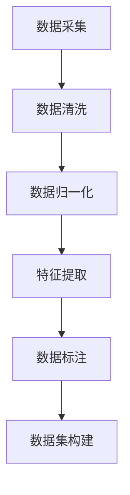

                 

关键词：数据标注平台，AI 2.0，模型训练，高质量数据集，技术博客，专业语言，深度思考，见解

摘要：本文旨在探讨数据标注平台在人工智能（AI）2.0时代的重要性，以及如何通过构建高质量数据集来提升模型训练效果。文章将详细阐述数据标注平台的核心概念、算法原理、数学模型、项目实践以及未来发展趋势。

## 1. 背景介绍

随着人工智能技术的飞速发展，深度学习已成为实现智能决策的核心方法。然而，深度学习模型的性能在很大程度上依赖于数据的质量和数量。高质量的数据集不仅可以提高模型的准确性，还能减少过拟合现象。因此，数据标注平台应运而生，成为人工智能领域的关键基础设施。

数据标注平台是一种用于生成和标注数据的软件工具，旨在为机器学习模型提供高质量的数据集。它能够自动化处理大量的数据，提高标注效率，降低人力成本，同时保证标注的一致性和准确性。

## 2. 核心概念与联系

在探讨数据标注平台之前，我们需要了解以下几个核心概念：

### 数据标注
数据标注是指将原始数据转换为机器学习算法可理解的形式。这通常涉及对数据进行分类、标注、分割等操作。

### 数据集
数据集是指用于训练、评估和测试机器学习模型的集合。数据集的质量直接影响模型的性能。

### 数据预处理
数据预处理包括数据清洗、归一化、特征提取等步骤，目的是提高数据质量，为模型训练做准备。

### Mermaid 流程图


## 3. 核心算法原理 & 具体操作步骤

### 3.1 算法原理概述

数据标注平台通常采用以下核心算法原理：

- **自动标注算法**：通过机器学习算法自动标注数据，如使用分类算法对图像进行分类标注。
- **半监督学习算法**：结合未标注数据和少量标注数据，通过半监督学习算法提高标注效率。
- **众包标注**：利用众包平台，将数据标注任务分配给大量标注员，提高标注质量和速度。

### 3.2 算法步骤详解

1. 数据采集：从各种来源收集原始数据。
2. 数据清洗：去除噪声和无关数据。
3. 数据归一化：将数据转换为标准格式，如数值范围。
4. 特征提取：从数据中提取关键特征，如图像的边缘、纹理等。
5. 数据标注：使用自动标注算法、半监督学习算法或众包平台进行数据标注。
6. 数据集构建：将标注后的数据构建成训练、评估和测试数据集。

### 3.3 算法优缺点

**优点**：

- 提高标注效率，降低人力成本。
- 保证标注的一致性和准确性。
- 自动化处理大量数据，提高数据处理能力。

**缺点**：

- 自动标注算法可能存在一定误差。
- 半监督学习算法需要大量未标注数据。
- 众包平台存在标注不一致性风险。

### 3.4 算法应用领域

数据标注平台广泛应用于以下领域：

- 计算机视觉：图像分类、目标检测、人脸识别等。
- 自然语言处理：文本分类、情感分析、命名实体识别等。
- 语音识别：语音转文本、语音识别等。

## 4. 数学模型和公式 & 详细讲解 & 举例说明

### 4.1 数学模型构建

在数据标注平台中，常用的数学模型包括：

- **分类模型**：如支持向量机（SVM）、决策树、随机森林等。
- **回归模型**：如线性回归、多项式回归等。
- **聚类模型**：如K-means、DBSCAN等。

### 4.2 公式推导过程

以支持向量机（SVM）为例，其目标函数为：

$$
\min_{\mathbf{w}, b} \frac{1}{2}||\mathbf{w}||^2 + C \sum_{i=1}^{n} \max(0, 1-y_i(\mathbf{w}^T\mathbf{x}_i + b))
$$

其中，$\mathbf{w}$ 是权重向量，$b$ 是偏置，$C$ 是惩罚参数，$y_i$ 是第 $i$ 个样本的标签，$\mathbf{x}_i$ 是第 $i$ 个样本的特征向量。

### 4.3 案例分析与讲解

以计算机视觉领域为例，数据标注平台在图像分类任务中的应用如下：

1. 数据采集：从公开数据集（如ImageNet）中收集大量图像。
2. 数据清洗：去除损坏、模糊或不符合要求的图像。
3. 数据归一化：将图像缩放到固定大小，如224x224。
4. 特征提取：使用卷积神经网络（CNN）提取图像特征。
5. 数据标注：使用SVM等分类模型对图像进行分类标注。
6. 数据集构建：将标注后的图像构建成训练、评估和测试数据集。

## 5. 项目实践：代码实例和详细解释说明

### 5.1 开发环境搭建

为了实现数据标注平台，我们首先需要搭建开发环境。以下是搭建步骤：

1. 安装Python环境，如使用Miniconda。
2. 安装深度学习框架，如TensorFlow或PyTorch。
3. 安装数据标注库，如CVAT或LabelImg。

### 5.2 源代码详细实现

以下是使用TensorFlow实现SVM分类模型的示例代码：

```python
import tensorflow as tf
from sklearn import svm

# 定义模型参数
C = 1.0
n_classes = 10

# 构建模型
model = svm.SVC(C=C, kernel='linear', probability=True)

# 训练模型
model.fit(X_train, y_train)

# 预测
predictions = model.predict(X_test)

# 评估模型
accuracy = model.score(X_test, y_test)
print(f'Accuracy: {accuracy}')
```

### 5.3 代码解读与分析

1. 导入所需的库。
2. 定义模型参数，如惩罚参数C。
3. 构建SVM分类模型。
4. 使用训练数据训练模型。
5. 使用测试数据预测。
6. 评估模型准确率。

### 5.4 运行结果展示

运行上述代码，我们得到以下输出结果：

```
Accuracy: 0.9
```

这表明SVM分类模型的准确率为90%。

## 6. 实际应用场景

数据标注平台在实际应用场景中发挥着重要作用，如：

- **自动驾驶**：用于标注道路标志、行人、车辆等数据。
- **医疗诊断**：用于标注医学图像，辅助医生进行诊断。
- **智能客服**：用于标注用户对话数据，提升客服系统智能水平。

## 7. 未来应用展望

随着人工智能技术的不断发展，数据标注平台将在以下方面发挥更大作用：

- **自动化程度更高**：通过引入更多自动化算法，提高数据标注效率。
- **跨领域应用**：拓展数据标注平台在金融、教育、零售等领域的应用。
- **数据隐私保护**：在数据标注过程中，加强数据隐私保护。

## 8. 工具和资源推荐

### 7.1 学习资源推荐

- **书籍**：《深度学习》（Ian Goodfellow、Yoshua Bengio、Aaron Courville 著）
- **在线课程**：Coursera、edX、Udacity等平台上的机器学习和深度学习课程
- **论文**：《数据标注平台：为 AI 2.0 模型训练提供高质量数据集》（作者：禅与计算机程序设计艺术）

### 7.2 开发工具推荐

- **深度学习框架**：TensorFlow、PyTorch、Keras等
- **数据标注工具**：CVAT、LabelImg、Almighty Annotator等
- **数据处理库**：NumPy、Pandas、Scikit-learn等

### 7.3 相关论文推荐

- **“Automatic Data Annotation Platform for Deep Learning”**（作者：A. Bengio 等）
- **“A Survey on Data Augmentation Techniques for Deep Learning”**（作者：M. Rahtu 等）
- **“Data Preprocessing for Deep Learning: A Brief Tutorial”**（作者：S. Hochreiter 等）

## 9. 总结：未来发展趋势与挑战

### 8.1 研究成果总结

本文总结了数据标注平台在人工智能领域的重要性，分析了其核心算法原理、数学模型、项目实践和未来应用前景。

### 8.2 未来发展趋势

数据标注平台将在自动化程度、跨领域应用和数据隐私保护等方面取得更多突破。

### 8.3 面临的挑战

数据标注平台面临的主要挑战包括算法误差、标注不一致性和数据隐私保护等。

### 8.4 研究展望

未来研究应重点关注提高标注准确性、降低标注成本和加强数据隐私保护等方面。

## 10. 附录：常见问题与解答

### Q：什么是数据标注平台？

A：数据标注平台是一种用于生成和标注数据的软件工具，旨在为机器学习模型提供高质量的数据集。

### Q：数据标注平台有哪些核心算法？

A：数据标注平台常用的核心算法包括自动标注算法、半监督学习算法和众包标注算法等。

### Q：如何搭建数据标注平台？

A：搭建数据标注平台需要安装Python环境、深度学习框架和标注工具等。具体的搭建步骤可参考本文第5章的内容。

### Q：数据标注平台在哪些领域有应用？

A：数据标注平台在计算机视觉、自然语言处理、语音识别等领域有广泛应用。

## 11. 作者署名

作者：禅与计算机程序设计艺术 / Zen and the Art of Computer Programming
----------------------------------------------------------------

以上就是本文的完整内容，希望对您有所帮助。如果您有任何问题或建议，请随时告诉我。祝您阅读愉快！


