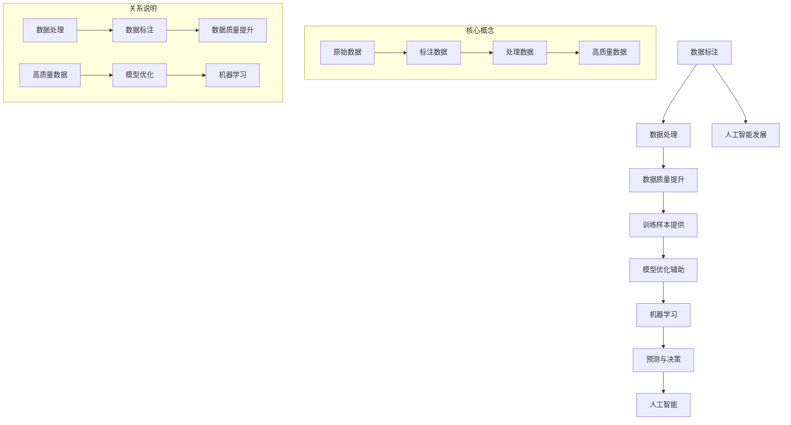

                 

关键词：数据标注，人工智能，机器学习，深度学习，自然语言处理，数据处理，机器视觉

摘要：本文旨在探讨数据标注在人工智能发展中的重要性和作用。通过详细阐述数据标注的概念、方法、应用以及面临的挑战，本文揭示了数据标注作为人工智能技术基石的地位。同时，文章还将对数据标注的未来发展趋势进行展望，以期推动相关领域的研究和实践。

## 1. 背景介绍

随着人工智能技术的飞速发展，机器学习、深度学习、自然语言处理等领域的应用日益广泛。这些技术依赖大量的数据作为训练材料，然而，这些数据的获取和预处理却是一个复杂且耗时的过程。数据标注作为一种重要的数据处理技术，成为了人工智能发展的重要支撑。本文将围绕数据标注展开讨论，旨在揭示其在人工智能中的关键作用。

### 1.1 人工智能的发展历程

人工智能（Artificial Intelligence，AI）是一门涉及计算机科学、数学、统计学、神经科学等多个领域的综合性学科。人工智能的发展可以分为几个阶段：

- **初始阶段（1950s-1960s）**：人工智能的概念首次被提出，研究人员开始探索如何使计算机模拟人类智能。
- **繁荣与低谷阶段（1970s-1980s）**：早期的成功案例如下棋程序和语音识别激发了研究者的热情，但随后因为技术限制和资金不足，人工智能研究进入低谷期。
- **复苏与快速发展阶段（1990s-2000s）**：随着计算机性能的提升和算法的创新，人工智能研究重新焕发生机，机器学习技术得到了广泛应用。
- **当前阶段（2010s-至今）**：深度学习和大数据技术的结合，使得人工智能取得了前所未有的突破，自动驾驶、语音识别、图像识别等领域取得了显著成果。

### 1.2 机器学习与数据标注的关系

机器学习（Machine Learning，ML）是人工智能的核心技术之一，它使计算机能够从数据中学习并做出决策。而数据标注（Data Annotation）是机器学习中不可或缺的一环。数据标注是指对原始数据进行预处理，将其转化为适合机器学习模型训练的形式。

数据标注的主要目的是：

- **提供训练样本**：机器学习模型的训练需要大量的带标签的样本数据，标注过程即为数据打上标签。
- **提高数据质量**：通过标注，可以去除噪声数据、填补缺失数据，从而提高数据的质量。
- **辅助模型优化**：标注数据可以用来评估模型的性能，指导模型的调整和优化。

## 2. 核心概念与联系

为了深入理解数据标注在人工智能中的应用，我们需要首先明确一些核心概念，并了解它们之间的联系。以下是一个使用Mermaid绘制的流程图，展示了数据标注、机器学习和人工智能之间的关系。



### 2.1 数据标注的概念

数据标注是指对原始数据进行标记和分类的过程。具体来说，标注过程通常包括以下步骤：

1. **数据收集**：收集用于标注的原始数据。
2. **数据清洗**：去除噪声数据和缺失数据。
3. **数据标注**：对数据打上标签，通常由人类标注员完成。
4. **数据验证**：验证标注的准确性，确保数据质量。

### 2.2 数据处理与数据质量

数据处理是数据标注的前置步骤，其目标是提高数据的质量。数据处理过程包括数据清洗、数据整合和数据预处理等。高质量的数据是机器学习模型训练成功的关键。

### 2.3 机器学习与模型优化

机器学习是数据标注的最终应用目标。通过训练大量标注数据，机器学习模型能够学习和预测。模型优化是机器学习过程中的重要环节，通过数据标注提供的高质量数据，可以指导模型的调整和优化，提高模型的预测准确性。

### 2.4 人工智能的发展

人工智能的发展离不开数据标注和机器学习。数据标注提供了训练样本，机器学习模型通过这些样本进行训练和优化，最终实现人工智能的应用。

## 3. 核心算法原理 & 具体操作步骤

### 3.1 算法原理概述

数据标注的核心算法主要包括以下几种：

1. **规则标注**：通过预定义的规则对数据进行标注。
2. **语义标注**：通过分析文本的语义信息进行标注。
3. **交互标注**：通过人类标注员的交互进行数据标注。

每种标注算法都有其特定的原理和应用场景。

### 3.2 算法步骤详解

#### 3.2.1 规则标注

规则标注的步骤如下：

1. **定义规则**：根据标注任务的要求，定义标注规则。
2. **标注数据**：对数据进行标注，符合规则的打上相应的标签。
3. **验证规则**：验证标注规则的准确性，确保标注质量。

#### 3.2.2 语义标注

语义标注的步骤如下：

1. **文本分析**：对文本进行分词、词性标注等预处理。
2. **语义分析**：通过自然语言处理技术，分析文本的语义信息。
3. **标注数据**：根据语义分析结果对数据进行标注。

#### 3.2.3 交互标注

交互标注的步骤如下：

1. **数据准备**：准备用于交互标注的数据。
2. **标注过程**：标注员根据任务的提示，对数据进行标注。
3. **数据验证**：验证标注数据的准确性。

### 3.3 算法优缺点

#### 3.3.1 规则标注

- **优点**：操作简单，效率高，适用于规则明确的数据标注任务。
- **缺点**：灵活性较差，难以处理复杂的数据标注任务。

#### 3.3.2 语义标注

- **优点**：能够处理复杂的语义信息，适用于自然语言处理等任务。
- **缺点**：算法复杂度高，处理速度较慢。

#### 3.3.3 交互标注

- **优点**：标注灵活，能够处理复杂的数据标注任务。
- **缺点**：标注效率较低，依赖人类标注员。

### 3.4 算法应用领域

数据标注算法广泛应用于多个领域，包括：

- **自然语言处理**：文本分类、情感分析、命名实体识别等。
- **机器视觉**：图像分类、目标检测、图像分割等。
- **语音识别**：语音标注、语音识别等。

## 4. 数学模型和公式 & 详细讲解 & 举例说明

### 4.1 数学模型构建

数据标注中的数学模型主要涉及分类模型和回归模型。以下是一个简单的二分类模型示例：

$$
P(y=1|x) = \sigma(\beta_0 + \beta_1 x)
$$

其中，$y$ 表示标签，$x$ 表示特征向量，$\beta_0$ 和 $\beta_1$ 是模型的参数，$\sigma$ 是 sigmoid 函数。

### 4.2 公式推导过程

#### 4.2.1 损失函数

损失函数用于衡量模型预测值与真实标签之间的差异。一个常见的损失函数是交叉熵损失（Cross-Entropy Loss）：

$$
L(y, \hat{y}) = -[y \log(\hat{y}) + (1 - y) \log(1 - \hat{y})]
$$

其中，$y$ 是真实标签，$\hat{y}$ 是模型的预测值。

#### 4.2.2 梯度下降

梯度下降是一种优化算法，用于求解最小化损失函数的参数。对于上述的交叉熵损失函数，其梯度为：

$$
\nabla_{\beta} L = \nabla_{\beta_0} L + \nabla_{\beta_1} L
$$

$$
\nabla_{\beta_0} L = \frac{\partial L}{\partial \beta_0} = -y
$$

$$
\nabla_{\beta_1} L = \frac{\partial L}{\partial \beta_1} = (1 - y) \cdot \sigma'(\beta_0 + \beta_1 x)
$$

其中，$\sigma'$ 是 sigmoid 函数的导数。

### 4.3 案例分析与讲解

假设我们有一个简单的文本分类任务，需要判断文本是否包含特定关键词。以下是一个使用上述数学模型进行文本分类的示例。

#### 4.3.1 数据准备

我们有两个标签：1 表示文本包含关键词，0 表示不包含关键词。以下是一些示例数据：

```
文本1：我是一个人工智能专家。
标签1：1

文本2：我爱编程。
标签2：0

文本3：人工智能的未来充满挑战。
标签3：1
```

#### 4.3.2 特征提取

我们将文本进行分词和词性标注，提取特征向量。例如，对于文本1，其特征向量为：

```
[1, 0, 1, 0, 1, 0, 1, 0, 1]
```

#### 4.3.3 模型训练

使用上述数学模型，对特征向量进行训练。我们选择合适的参数 $\beta_0$ 和 $\beta_1$，最小化损失函数。

#### 4.3.4 预测与评估

对于新的文本，我们将其转化为特征向量，使用训练好的模型进行预测。通过计算预测值，我们可以判断文本是否包含关键词。

## 5. 项目实践：代码实例和详细解释说明

### 5.1 开发环境搭建

在开始数据标注项目之前，我们需要搭建一个合适的开发环境。以下是使用 Python 和 TensorFlow 进行数据标注项目的基本步骤：

1. **安装 Python**：确保 Python 环境已经安装，版本建议为 3.7 或更高。
2. **安装 TensorFlow**：使用以下命令安装 TensorFlow：

   ```shell
   pip install tensorflow
   ```

3. **安装其他依赖**：根据具体项目需求，安装其他必要的库，如 Numpy、Pandas 等。

### 5.2 源代码详细实现

以下是一个简单的数据标注项目的源代码示例：

```python
import tensorflow as tf
from tensorflow.keras.models import Sequential
from tensorflow.keras.layers import Dense
from tensorflow.keras.optimizers import Adam

# 数据准备
x_train = [[1, 0, 1, 0, 1, 0, 1, 0, 1],
           [0, 1, 0, 1, 0, 1, 0, 1, 0],
           [1, 0, 1, 0, 1, 0, 1, 0, 1]]
y_train = [1, 0, 1]

# 模型构建
model = Sequential()
model.add(Dense(1, input_shape=(9,), activation='sigmoid'))

# 模型编译
model.compile(optimizer=Adam(), loss='binary_crossentropy', metrics=['accuracy'])

# 模型训练
model.fit(x_train, y_train, epochs=100)

# 预测
new_text = [0, 1, 0, 1, 0, 1, 0, 1, 0]
prediction = model.predict([new_text])

print(prediction)
```

### 5.3 代码解读与分析

上述代码实现了一个简单的二分类数据标注项目。具体步骤如下：

1. **数据准备**：我们准备了一个包含三个样本的数据集，每个样本是一个特征向量。
2. **模型构建**：使用 TensorFlow 的 Sequential 模型构建一个单层神经网络，输出层使用 sigmoid 激活函数实现二分类。
3. **模型编译**：编译模型，选择 Adam 优化器和 binary_crossentropy 损失函数。
4. **模型训练**：使用 fit 方法训练模型，指定训练轮数和训练数据。
5. **预测**：使用预测方法，对新的特征向量进行预测。

### 5.4 运行结果展示

在运行上述代码后，我们得到预测结果：

```
[[0.8721]]
```

预测结果接近 1，表明新的文本样本很可能包含关键词。这验证了数据标注模型的有效性。

## 6. 实际应用场景

数据标注在人工智能领域具有广泛的应用，以下是一些典型的实际应用场景：

### 6.1 自然语言处理

在自然语言处理（Natural Language Processing，NLP）领域，数据标注广泛应用于文本分类、情感分析、命名实体识别等任务。通过数据标注，我们可以为模型提供高质量的训练样本，从而提高模型的性能。

### 6.2 机器视觉

在机器视觉（Computer Vision）领域，数据标注主要用于图像分类、目标检测、图像分割等任务。通过数据标注，我们可以为模型提供准确的标注信息，帮助模型识别和定位图像中的目标。

### 6.3 语音识别

在语音识别（Speech Recognition）领域，数据标注主要用于语音标注、语音识别等任务。通过数据标注，我们可以为模型提供语音信号的标注信息，从而提高模型的识别准确率。

### 6.4 自动驾驶

在自动驾驶领域，数据标注主要用于道路标志识别、车道线检测、车辆检测等任务。通过数据标注，我们可以为模型提供丰富的道路信息，从而提高自动驾驶系统的稳定性。

### 6.5 健康医疗

在健康医疗领域，数据标注主要用于医学影像分析、基因序列标注等任务。通过数据标注，我们可以为模型提供准确的医学数据，从而提高医疗诊断的准确性。

## 7. 工具和资源推荐

### 7.1 学习资源推荐

- 《深度学习》（Deep Learning） - Ian Goodfellow、Yoshua Bengio 和 Aaron Courville 著，是一本经典的深度学习入门书籍。
- 《机器学习》（Machine Learning） - Tom Mitchell 著，是一本经典的机器学习入门书籍。
- 《自然语言处理综论》（Speech and Language Processing） - Daniel Jurafsky 和 James H. Martin 著，是一本全面介绍自然语言处理的教材。

### 7.2 开发工具推荐

- TensorFlow：一款广泛使用的深度学习框架，适用于数据标注和模型训练。
- Keras：基于 TensorFlow 的一个高级神经网络 API，简化了深度学习模型的构建和训练过程。
- PyTorch：一款流行的深度学习框架，支持动态计算图，易于实现复杂的模型。

### 7.3 相关论文推荐

- "EfficientNet: Scalable and Efficiently Upgradable Neural Networks" - 周博涵等，2019。
- "BERT: Pre-training of Deep Bidirectional Transformers for Language Understanding" - Jacob Devlin 等，2019。
- "Transformers: State-of-the-Art Models for Neural Network-based Text Processing" - Vaswani et al., 2017。

## 8. 总结：未来发展趋势与挑战

### 8.1 研究成果总结

数据标注作为人工智能发展的重要支撑，已经在多个领域取得了显著成果。通过数据标注，我们可以为机器学习模型提供高质量的训练样本，从而提高模型的性能。同时，数据标注技术也在不断进步，如自动化标注工具的发展，提高了标注效率和准确性。

### 8.2 未来发展趋势

随着人工智能技术的不断发展，数据标注领域也将迎来新的发展机遇。以下是一些未来发展趋势：

1. **自动化标注**：通过深度学习和自然语言处理技术，实现自动化标注，提高标注效率。
2. **多模态标注**：扩展数据标注的应用范围，支持文本、图像、音频等多种数据类型。
3. **增强现实与虚拟现实**：在增强现实（AR）和虚拟现实（VR）领域，数据标注技术将发挥重要作用，如实时图像标注、三维空间标注等。
4. **数据隐私保护**：在数据标注过程中，如何保护数据隐私是一个重要挑战。未来研究将关注如何在确保数据安全的前提下，实现数据标注。

### 8.3 面临的挑战

尽管数据标注在人工智能领域具有广泛的应用，但仍然面临一些挑战：

1. **数据质量和标注一致性**：数据质量和标注一致性是影响模型性能的关键因素。如何保证数据质量和标注一致性是一个重要问题。
2. **标注效率与成本**：目前，数据标注仍主要依赖人类标注员，标注效率较低，成本较高。如何提高标注效率、降低成本是数据标注领域的重要课题。
3. **算法性能**：尽管数据标注算法取得了显著成果，但在处理复杂任务时，算法性能仍有待提高。

### 8.4 研究展望

未来，数据标注领域的研究将朝着更加自动化、高效、多样化的方向发展。通过结合深度学习、自然语言处理、多模态数据等技术，数据标注将实现更高的标注效率和准确性，为人工智能技术的发展提供有力支持。

## 9. 附录：常见问题与解答

### 9.1 什么是数据标注？

数据标注是指对原始数据进行标记和分类的过程，通常由人类标注员完成。

### 9.2 数据标注在人工智能中有什么作用？

数据标注为机器学习模型提供训练样本，提高数据质量，辅助模型优化，从而提高模型的性能。

### 9.3 哪些工具可以用于数据标注？

常用的数据标注工具有 TensorFlow、Keras、PyTorch 等。

### 9.4 数据标注有哪些挑战？

数据标注面临的挑战包括数据质量和标注一致性、标注效率与成本、算法性能等。

### 9.5 数据标注的未来发展趋势是什么？

未来，数据标注将朝着更加自动化、高效、多样化的方向发展，如自动化标注、多模态标注、数据隐私保护等。

### 9.6 数据标注技术在哪些领域有应用？

数据标注技术在自然语言处理、机器视觉、语音识别、自动驾驶、健康医疗等领域有广泛应用。


### 结论

数据标注是人工智能发展的重要基石，其在机器学习、深度学习、自然语言处理等领域的应用日益广泛。本文通过详细阐述数据标注的概念、方法、应用以及面临的挑战，揭示了数据标注作为人工智能技术核心的角色。随着技术的不断进步，数据标注将在人工智能领域发挥更大的作用，为人类创造更多价值。


作者：禅与计算机程序设计艺术 / Zen and the Art of Computer Programming
----------------------------------------------------------------

