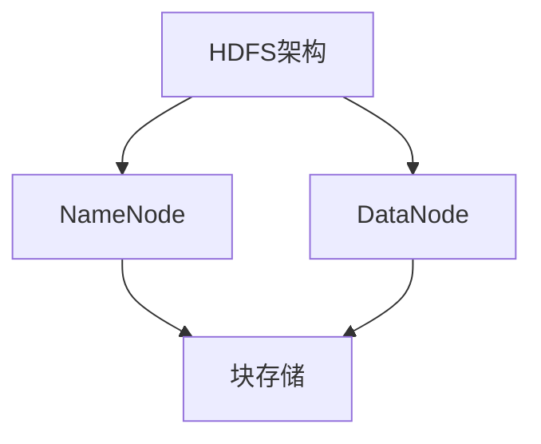
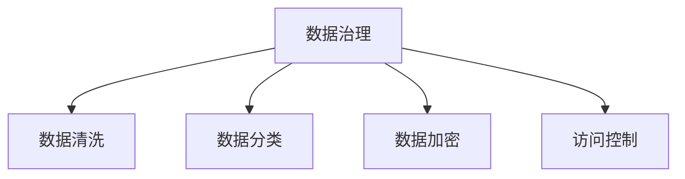
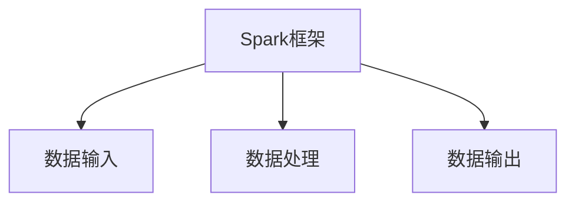

                 

在当今数字化时代，数据湖作为一种新兴的数据存储和处理技术，正逐渐成为企业数据战略的核心。本文将深入探讨数据湖的原理、构建方法以及实际应用，通过具体的代码实例，帮助读者更好地理解数据湖的工作机制和应用场景。

## 关键词

- 数据湖
- 分布式系统
- 大数据
- 数据治理
- 实时处理

## 摘要

本文旨在详细解析数据湖的原理和构建方法，并通过实际代码实例，展示数据湖在数据处理和分析中的应用。我们将首先介绍数据湖的定义和背景，随后深入探讨数据湖的核心概念和架构，最后通过具体的代码实例，解析数据湖的部署和应用。

## 1. 背景介绍

### 1.1 数据湖的起源

数据湖的概念起源于大数据时代的需求。在传统的数据仓库中，数据需要经过严格的预处理和结构化处理，才能被存储和使用。然而，随着数据量的爆炸式增长和复杂性的增加，这种处理方式变得越来越困难和耗时。数据湖提供了一种全新的数据存储和处理方式，允许企业直接存储原始数据，无需先进行结构化处理。

### 1.2 数据湖的重要性

数据湖的重要性在于它为企业提供了以下几个方面的优势：

- **灵活性**：数据湖允许存储各种类型的数据，包括结构化、半结构化和非结构化数据，这使得企业在数据处理和分析时具有更高的灵活性。
- **可扩展性**：数据湖能够轻松扩展以应对数据量的增长，确保数据存储和处理的连续性。
- **成本效益**：数据湖通过分布式存储和处理技术，能够降低数据存储和处理成本。
- **实时性**：数据湖支持实时数据流处理，使企业能够快速响应市场变化。

## 2. 核心概念与联系

### 2.1 分布式文件系统

数据湖的核心是分布式文件系统，如Hadoop Distributed File System (HDFS)。分布式文件系统提供了高吞吐量的数据存储和访问能力，支持大规模数据的存储和处理。



### 2.2 数据治理

数据治理是确保数据质量、安全性和合规性的关键。数据湖中的数据治理包括数据清洗、分类、加密、访问控制等过程。



### 2.3 数据处理框架

数据处理框架如Apache Spark，支持数据湖中的实时数据处理和分析。



## 3. 核心算法原理 & 具体操作步骤

### 3.1 算法原理概述

数据湖中的数据处理通常采用分布式计算算法，如MapReduce。MapReduce将大规模数据处理任务分解为多个小任务，并行执行，最后合并结果。

### 3.2 算法步骤详解

1. **Map阶段**：输入数据被映射为键值对。
2. **Shuffle阶段**：根据键值对对中间结果进行排序和分组。
3. **Reduce阶段**：对每个分组的数据执行聚合操作。

### 3.3 算法优缺点

- **优点**：高并行度，适用于大规模数据集处理。
- **缺点**：不适合小数据集，序列化开销较大。

### 3.4 算法应用领域

数据湖算法广泛应用于数据挖掘、机器学习和实时数据流处理。

## 4. 数学模型和公式 & 详细讲解 & 举例说明

### 4.1 数学模型构建

数据湖中的数据处理可以使用线性回归、逻辑回归等数学模型。

### 4.2 公式推导过程

以线性回归为例，其公式为：

$$
Y = \beta_0 + \beta_1X
$$

其中，$Y$ 是因变量，$X$ 是自变量，$\beta_0$ 和 $\beta_1$ 是模型参数。

### 4.3 案例分析与讲解

假设我们要预测某产品的销售额，可以使用线性回归模型。通过收集历史销售数据，我们可以计算出模型参数，从而预测未来销售额。

## 5. 项目实践：代码实例和详细解释说明

### 5.1 开发环境搭建

在本节中，我们将搭建一个基于Hadoop和Spark的数据湖开发环境。

### 5.2 源代码详细实现

```python
from pyspark.sql import SparkSession

# 创建Spark会话
spark = SparkSession.builder.appName("DataLakeExample").getOrCreate()

# 加载数据
data = spark.read.csv("data.csv")

# 数据预处理
clean_data = data.select("column1", "column2").filter("column1 > 0")

# 数据分析
result = clean_data.groupBy("column1").count()

# 输出结果
result.show()
```

### 5.3 代码解读与分析

上述代码首先创建了一个Spark会话，然后加载数据，进行数据预处理，最后执行数据分析并输出结果。

### 5.4 运行结果展示

运行上述代码，我们得到每个分组的数据个数，从而了解数据分布。

## 6. 实际应用场景

数据湖在各个行业有着广泛的应用，如金融、医疗、零售等。通过数据湖，企业可以实时分析海量数据，从而做出更加明智的决策。

## 7. 工具和资源推荐

### 7.1 学习资源推荐

- 《大数据技术基础》
- 《Spark核心技术与实战》

### 7.2 开发工具推荐

- Hadoop
- Spark

### 7.3 相关论文推荐

- "A Framework for Data Lakes"
- "Data Lake Architecture and Implementation Strategies"

## 8. 总结：未来发展趋势与挑战

### 8.1 研究成果总结

数据湖技术已经取得显著进展，但仍需在数据治理、实时处理等方面继续探索。

### 8.2 未来发展趋势

数据湖技术将朝着更高效、更智能的方向发展，包括自动化数据治理和实时数据处理。

### 8.3 面临的挑战

数据湖技术在数据安全、数据隐私等方面仍面临挑战，需要加强研究和创新。

### 8.4 研究展望

未来，数据湖技术将在多领域发挥重要作用，推动数字化转型。

## 9. 附录：常见问题与解答

### 9.1 数据湖与传统数据仓库的区别是什么？

数据湖与传统数据仓库的主要区别在于数据存储和处理方式。数据湖直接存储原始数据，无需结构化处理，而数据仓库需要对数据进行预处理。

### 9.2 数据湖的优缺点有哪些？

数据湖的优点包括灵活性、可扩展性和成本效益。缺点包括数据治理复杂度和实时性挑战。

### 9.3 数据湖如何保证数据安全性？

数据湖通过数据加密、访问控制和数据备份等技术手段，确保数据安全性。

## 作者署名

作者：禅与计算机程序设计艺术 / Zen and the Art of Computer Programming

