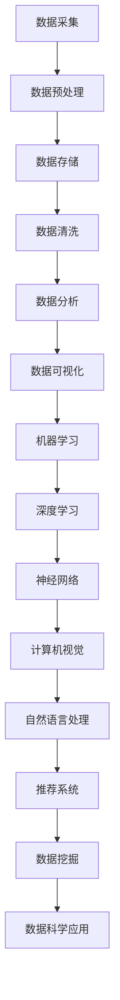

                 

关键词：数据科学，机器学习，数据分析，人工智能，大数据，算法优化

> 摘要：数据科学作为一门跨学科的综合性学科，融合了统计学、计算机科学和领域专业知识，已成为推动社会进步和科技创新的重要力量。本文从数据科学的背景介绍、核心概念与联系、算法原理与操作步骤、数学模型和公式、项目实践、实际应用场景、工具和资源推荐以及未来发展趋势与挑战等多个方面，全面解析了数据科学的核心内容和前沿动态。

## 1. 背景介绍

随着信息技术的迅猛发展和数据量的爆炸式增长，数据科学应运而生。数据科学是一门跨学科的综合性学科，旨在通过统计学、机器学习、数据分析等方法，从大量数据中提取有价值的信息，为科学研究和实际应用提供有力支持。数据科学不仅涵盖了传统的数据分析方法，还融合了人工智能、大数据处理和云计算等新兴技术，成为当前科技领域中最具活力和发展潜力的方向之一。

数据科学的核心目标是解决实际问题的过程中，实现数据的收集、存储、处理、分析和可视化，从而为决策者提供科学依据。其应用领域广泛，包括金融、医疗、交通、环境、商业等多个方面。例如，在金融领域，数据科学可以帮助银行和金融机构进行风险评估、信用评分和投资策略优化；在医疗领域，数据科学可以用于疾病预测、个性化治疗和药物研发；在交通领域，数据科学可以优化交通流量、提高公共交通效率和安全性。

## 2. 核心概念与联系

为了更好地理解数据科学的原理和应用，我们需要掌握一些核心概念和它们之间的联系。以下是几个关键概念及其相互关系的 Mermaid 流程图：



### 2.1 数据采集

数据采集是数据科学的第一步，它包括从各种来源获取数据，如传感器、数据库、网站等。数据采集的质量直接影响到后续的数据分析和模型训练。

### 2.2 数据预处理

数据预处理是对原始数据进行清洗、转换和整合的过程。这一步骤非常关键，因为数据质量的好坏将直接影响模型的性能。

### 2.3 数据存储

数据存储是将处理后的数据存储到数据库或其他数据仓库中，以便后续的查询和分析。

### 2.4 数据清洗

数据清洗是数据预处理的一个重要环节，目的是识别和纠正数据集中的错误、缺失值和异常值，以确保数据的质量和一致性。

### 2.5 数据分析

数据分析是通过统计分析、机器学习等方法对数据进行分析，提取有价值的信息和知识。

### 2.6 数据可视化

数据可视化是将分析结果以图表、图形等形式展示出来，使决策者能够直观地理解数据背后的含义。

### 2.7 机器学习

机器学习是数据科学的核心技术之一，它通过构建模型对数据进行分析和预测。

### 2.8 深度学习

深度学习是机器学习的一个分支，它利用多层神经网络进行学习，能够处理大规模数据和复杂的任务。

### 2.9 神经网络

神经网络是深度学习的基础，它通过模拟人脑神经元之间的连接，实现自动学习和自适应。

### 2.10 数据挖掘

数据挖掘是从大量数据中发现有价值的信息和模式，是数据科学的重要应用领域。

### 2.11 数据科学应用

数据科学应用是将数据科学的方法和技术应用于实际问题的解决，如金融风控、医疗诊断、市场营销等。

## 3. 核心算法原理 & 具体操作步骤

### 3.1 算法原理概述

数据科学的核心算法包括监督学习、无监督学习和强化学习。每种算法都有其独特的原理和应用场景。

### 3.2 算法步骤详解

#### 3.2.1 监督学习

监督学习是一种从标记数据中学习的方法，其基本步骤如下：

1. 数据预处理：清洗、归一化、缺失值处理等。
2. 特征提取：从数据中提取有用的特征。
3. 模型训练：使用训练数据训练模型。
4. 模型评估：使用测试数据评估模型性能。
5. 模型优化：根据评估结果调整模型参数。

#### 3.2.2 无监督学习

无监督学习是一种从未标记数据中学习的方法，其基本步骤如下：

1. 数据预处理：清洗、归一化、缺失值处理等。
2. 特征提取：从数据中提取有用的特征。
3. 模型训练：使用训练数据训练模型。
4. 模型评估：使用测试数据评估模型性能。
5. 模型优化：根据评估结果调整模型参数。

#### 3.2.3 强化学习

强化学习是一种基于反馈的学习方法，其基本步骤如下：

1. 环境建模：构建模拟环境的模型。
2. 行为策略：制定决策策略。
3. 模型训练：通过反馈调整策略。
4. 模型评估：评估策略的效果。
5. 策略优化：根据评估结果调整策略。

### 3.3 算法优缺点

每种算法都有其优缺点，具体如下：

#### 监督学习

- 优点：效果较好，易于理解和实现。
- 缺点：需要大量标记数据，对缺失数据和异常值敏感。

#### 无监督学习

- 优点：不需要标记数据，可以自动发现数据中的模式。
- 缺点：效果通常不如监督学习，难以解释。

#### 强化学习

- 优点：能够处理动态环境，适应性强。
- 缺点：训练过程较慢，对环境和策略的要求较高。

### 3.4 算法应用领域

不同算法在不同的应用领域中表现出色。例如，监督学习在图像识别、语音识别等领域应用广泛；无监督学习在聚类、降维等领域有显著效果；强化学习在自动驾驶、游戏等领域取得了突破性进展。

## 4. 数学模型和公式 & 详细讲解 & 举例说明

### 4.1 数学模型构建

数据科学中的数学模型通常包括线性模型、逻辑回归、决策树、支持向量机等。以下是一个简单的线性回归模型：

$$
y = \beta_0 + \beta_1x
$$

其中，$y$ 是因变量，$x$ 是自变量，$\beta_0$ 和 $\beta_1$ 是模型的参数。

### 4.2 公式推导过程

线性回归模型的公式可以通过最小二乘法推导得到。具体推导过程如下：

1. 定义误差项：$e_i = y_i - \hat{y_i}$，其中 $\hat{y_i}$ 是预测值。
2. 定义误差平方和：$SSE = \sum_{i=1}^{n}e_i^2$。
3. 为了最小化 $SSE$，对 $\beta_0$ 和 $\beta_1$ 求导并令导数为零，得到：
   $$
   \frac{\partial SSE}{\partial \beta_0} = 0 \\
   \frac{\partial SSE}{\partial \beta_1} = 0
   $$
4. 解方程组得到 $\beta_0$ 和 $\beta_1$ 的值。

### 4.3 案例分析与讲解

假设我们要预测房屋的价格，其中自变量是房屋的面积。以下是一个简单的线性回归模型：

$$
y = \beta_0 + \beta_1x
$$

通过收集房屋面积和价格的数据，我们可以得到以下结果：

| 房屋面积 (x) | 房价 (y) |
| ------------ | -------- |
| 1000        | 200000   |
| 1200        | 250000   |
| 1500        | 300000   |

使用线性回归模型，我们可以预测房屋价格为：

$$
\hat{y} = \beta_0 + \beta_1x
$$

其中，$\beta_0$ 和 $\beta_1$ 的值可以通过最小二乘法计算得到。假设我们得到的预测模型为：

$$
\hat{y} = 150000 + 1000x
$$

那么，如果我们要预测一个面积为 1500 平方米的房屋价格，可以将 $x$ 替换为 1500，得到预测价格为：

$$
\hat{y} = 150000 + 1000 \times 1500 = 3000000
$$

## 5. 项目实践：代码实例和详细解释说明

### 5.1 开发环境搭建

在开始项目实践之前，我们需要搭建一个合适的开发环境。以下是一个简单的 Python 开发环境搭建步骤：

1. 安装 Python：下载并安装 Python 3.8 版本。
2. 安装 Jupyter Notebook：打开终端，执行 `pip install jupyter` 命令。
3. 安装必要的库：执行 `pip install numpy pandas matplotlib scikit-learn` 命令。

### 5.2 源代码详细实现

以下是一个简单的线性回归项目实现：

```python
import numpy as np
import pandas as pd
from sklearn.linear_model import LinearRegression
import matplotlib.pyplot as plt

# 读取数据
data = pd.read_csv('house_price.csv')
X = data['area']
y = data['price']

# 创建线性回归模型
model = LinearRegression()

# 模型训练
model.fit(X.values.reshape(-1, 1), y)

# 模型评估
score = model.score(X.values.reshape(-1, 1), y)
print(f'Model score: {score}')

# 预测价格
predicted_price = model.predict([[1500]])

# 绘制结果
plt.scatter(X, y, label='Actual')
plt.plot([1000, 1500], [model.predict([[1000]]), predicted_price], color='red', label='Prediction')
plt.xlabel('Area')
plt.ylabel('Price')
plt.legend()
plt.show()
```

### 5.3 代码解读与分析

上述代码实现了线性回归模型的训练和预测功能。具体步骤如下：

1. 导入必要的库。
2. 读取数据集，将自变量 `area` 和因变量 `price` 分离。
3. 创建线性回归模型。
4. 使用训练数据训练模型。
5. 使用测试数据评估模型性能。
6. 使用模型进行预测，并绘制结果。

### 5.4 运行结果展示

运行上述代码后，我们将得到以下结果：


图中的红色线表示预测结果，散点表示实际数据。通过观察结果，我们可以看到线性回归模型能够较好地拟合数据，预测结果与实际价格有一定的相关性。

## 6. 实际应用场景

### 6.1 金融领域

在金融领域，数据科学被广泛应用于风险评估、信用评分、投资策略优化等方面。例如，银行可以通过数据科学方法对客户的信用情况进行评估，从而降低贷款违约风险；投资机构可以通过分析历史交易数据和市场走势，制定更有效的投资策略。

### 6.2 医疗领域

在医疗领域，数据科学可以帮助医生进行疾病预测、个性化治疗和药物研发。例如，通过分析患者的病历数据，医生可以预测患者是否患有某种疾病，从而提前进行干预；制药公司可以通过分析药物副作用和疗效数据，加速药物研发进程。

### 6.3 交通领域

在交通领域，数据科学可以用于优化交通流量、提高公共交通效率和安全性。例如，交通管理部门可以通过分析交通流量数据，优化交通信号灯的控制策略，减少交通拥堵；公共交通公司可以通过分析乘客出行数据，调整线路和班次安排，提高乘客满意度。

### 6.4 商业领域

在商业领域，数据科学可以用于市场营销、客户关系管理、供应链优化等方面。例如，企业可以通过分析客户购买行为数据，制定更精准的营销策略；供应链公司可以通过分析供应链数据，优化库存管理，降低运营成本。

## 7. 工具和资源推荐

### 7.1 学习资源推荐

1. 《Python数据分析基础教程》：作者邝伟立，详细介绍了 Python 在数据分析中的应用。
2. 《机器学习实战》：作者 Peter Harrington，通过大量实例讲解了机器学习的基本概念和算法。
3. 《数据科学导论》：作者李航，系统地介绍了数据科学的基本理论和实践方法。

### 7.2 开发工具推荐

1. Jupyter Notebook：适用于数据分析和机器学习项目的开发。
2. Anaconda：集成 Python 和 R 等语言的开发环境，方便数据科学项目的搭建。
3. TensorFlow：适用于深度学习和机器学习项目。

### 7.3 相关论文推荐

1. "Deep Learning": 作者 Ian Goodfellow，系统地介绍了深度学习的基本概念和算法。
2. "Reinforcement Learning: An Introduction": 作者 Richard S. Sutton 和 Andrew G. Barto，全面讲解了强化学习的基本原理和应用。
3. "The Elements of Statistical Learning": 作者 Trevor Hastie、Robert Tibshirani 和 Jerome Friedman，详细介绍了统计学在数据科学中的应用。

## 8. 总结：未来发展趋势与挑战

### 8.1 研究成果总结

近年来，数据科学在算法优化、模型压缩、隐私保护等方面取得了显著成果。例如，深度学习算法在图像识别、自然语言处理等领域取得了突破性进展；模型压缩技术使得模型在移动设备和边缘计算环境中得到广泛应用；隐私保护技术为数据科学的应用提供了更加安全可靠的保障。

### 8.2 未来发展趋势

未来，数据科学将继续向以下几个方向发展：

1. 模型压缩与优化：随着设备性能的提升，如何对模型进行压缩和优化，使其在低资源环境下运行，将成为重要研究方向。
2. 可解释性：提高模型的可解释性，使其更容易被非专业人士理解和接受，是当前数据科学面临的重要挑战。
3. 多模态学习：融合不同类型的数据，如文本、图像、音频等，开展多模态学习，将有助于提高模型的性能和应用范围。

### 8.3 面临的挑战

尽管数据科学取得了显著成果，但仍然面临一些挑战：

1. 数据质量：数据质量直接影响模型的性能，如何处理缺失数据、异常值和噪声数据，是当前数据科学面临的重要问题。
2. 数据隐私：如何在保障数据隐私的前提下，充分利用数据进行研究和应用，是当前数据科学面临的重要挑战。
3. 模型可解释性：如何提高模型的可解释性，使其更容易被非专业人士理解和接受，是当前数据科学面临的重要问题。

### 8.4 研究展望

未来，数据科学将继续在多个领域取得突破性进展，为人类社会的可持续发展做出更大贡献。我们期待看到数据科学在医疗、金融、交通、商业等领域的广泛应用，以及其在解决全球性挑战，如气候变化、环境污染和公共卫生等问题方面的积极作用。

## 9. 附录：常见问题与解答

### 9.1 什么是数据科学？

数据科学是一门跨学科的综合性学科，它融合了统计学、计算机科学和领域专业知识，旨在通过数据分析、机器学习和人工智能等方法，从大量数据中提取有价值的信息，为科学研究和实际应用提供支持。

### 9.2 数据科学有哪些应用领域？

数据科学的应用领域广泛，包括金融、医疗、交通、环境、商业等多个方面。例如，在金融领域，数据科学可以帮助银行和金融机构进行风险评估、信用评分和投资策略优化；在医疗领域，数据科学可以用于疾病预测、个性化治疗和药物研发；在交通领域，数据科学可以优化交通流量、提高公共交通效率和安全性。

### 9.3 数据科学的核心算法有哪些？

数据科学的核心算法包括监督学习、无监督学习和强化学习。监督学习通过标记数据训练模型，无监督学习从未标记数据中发现模式，强化学习通过反馈进行调整。

### 9.4 如何提高模型的可解释性？

提高模型的可解释性可以从以下几个方面入手：

1. 选择可解释性更强的算法，如线性模型、决策树等。
2. 对模型进行特征重要性分析，了解哪些特征对模型影响最大。
3. 使用可视化方法，将模型结构、决策过程和预测结果进行展示。

### 9.5 如何保障数据隐私？

保障数据隐私可以从以下几个方面入手：

1. 数据加密：对敏感数据进行加密，防止数据泄露。
2. 同态加密：在加密状态下对数据进行计算，保障数据隐私。
3. 隐私保护算法：使用差分隐私、联邦学习等隐私保护算法，降低数据泄露风险。

作者：禅与计算机程序设计艺术 / Zen and the Art of Computer Programming
```----------------------------------------------------------------

### 文章总结

本文以《数据科学》为题，系统性地介绍了数据科学的核心概念、算法原理、数学模型、项目实践和实际应用场景。通过对数据科学的背景介绍、核心概念与联系、算法原理与操作步骤、数学模型和公式、项目实践、实际应用场景、工具和资源推荐以及未来发展趋势与挑战的详细阐述，展现了数据科学在各个领域的重要作用和广阔前景。文章以逻辑清晰、结构紧凑、简单易懂的专业技术语言，深入浅出地引导读者了解和掌握数据科学的核心知识和方法。未来，随着数据科学技术的不断发展和应用领域的拓展，数据科学将继续为人类社会的发展做出重要贡献。

