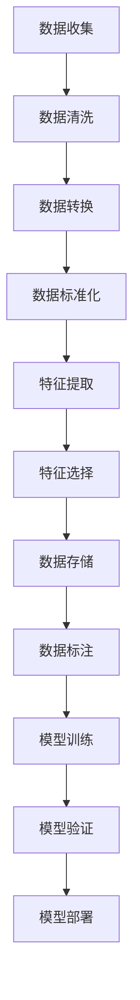

                 

关键词：数据集工程、AI应用、数据预处理、特征提取、模型训练、性能优化

> 摘要：随着人工智能技术的迅猛发展，数据集工程在AI应用中的重要性日益凸显。本文将深入探讨数据集工程的核心概念、关键技术和应用场景，分析其在提升模型性能和准确性方面的作用，并展望其未来的发展趋势和挑战。

## 1. 背景介绍

人工智能（AI）技术的核心是构建能够模拟人类智能行为的算法和系统。这些算法依赖于大量高质量的数据集进行训练和验证。然而，数据集工程不仅仅是简单地收集数据，它涉及到数据收集、预处理、标注、存储、管理和分析等多个环节。随着数据量的爆炸性增长和AI应用的广泛普及，数据集工程在AI系统开发中扮演着至关重要的角色。

数据集工程的重要性体现在以下几个方面：

1. **数据质量和完整性**：高质量的数据是AI模型准确性和性能的基石。数据集工程确保数据的质量和完整性，从而提高模型的性能。
2. **特征提取和选择**：数据集中的特征对于模型的学习和预测至关重要。数据集工程涉及特征提取和选择技术，以最大化模型的性能。
3. **可扩展性和可维护性**：大规模AI应用需要高效的数据集管理策略，以确保数据集的可扩展性和可维护性。
4. **多样性和平衡性**：数据集的多样性和平衡性对于模型的泛化能力和公平性至关重要。

## 2. 核心概念与联系

### 数据集工程的核心概念

**数据集**：用于训练和测试AI模型的集合，通常包含输入数据和对应的标签。

**数据预处理**：在数据集使用之前，对数据进行清洗、转换和标准化等操作，以提高数据质量。

**特征提取**：从原始数据中提取有助于模型学习的信息。

**特征选择**：从提取的特征中选择最相关的特征，以减少模型复杂度和提高性能。

**数据存储**：存储和管理数据集，以便在模型训练和预测时快速访问。

**数据标注**：为数据集提供标签，以便模型能够学习。

### 数据集工程的架构

以下是一个简化版的数据集工程流程，使用Mermaid流程图表示：



### 数据集工程与AI模型的关系

数据集工程直接影响AI模型的性能和准确性。以下是数据集工程与AI模型之间的联系：

- **数据质量**：高质量的数据有助于模型学习到更准确的规律。
- **特征提取**：有效的特征提取可以提高模型的学习效率。
- **数据标注**：准确的数据标注对于模型的训练至关重要。
- **模型验证**：通过验证集评估模型性能，以便进行调整和优化。

## 3. 核心算法原理 & 具体操作步骤

### 3.1 算法原理概述

数据集工程的核心算法包括数据预处理、特征提取和特征选择。

- **数据预处理**：包括缺失值填充、异常值处理、数据转换和数据标准化等操作。
- **特征提取**：通过变换、降维和嵌入等方法，从原始数据中提取有助于模型学习的特征。
- **特征选择**：利用统计方法、机器学习方法或启发式方法，从提取的特征中选择最相关的特征。

### 3.2 算法步骤详解

**数据预处理步骤：**

1. **缺失值填充**：使用平均值、中位数或插值法填充缺失值。
2. **异常值处理**：删除或调整异常值，以消除其对模型训练的影响。
3. **数据转换**：将分类特征转换为数值特征，如独热编码或标签编码。
4. **数据标准化**：将数据缩放到相同的范围，如0-1或-1到1，以提高模型训练的稳定性。

**特征提取步骤：**

1. **变换**：通过转换，如对数变换或幂变换，将数据转换为更合适的格式。
2. **降维**：使用主成分分析（PCA）、线性判别分析（LDA）等方法，减少数据维度，提高模型训练效率。
3. **嵌入**：使用嵌入技术，如词嵌入或图嵌入，将原始数据转换为高维特征表示。

**特征选择步骤：**

1. **过滤法**：基于统计方法，如信息增益、卡方检验等，筛选出最重要的特征。
2. **包装法**：结合模型训练，如递归特征消除（RFE）、逐步回归等，选择最佳特征组合。
3. **嵌入式特征选择**：在模型训练过程中，自动选择最重要的特征，如L1正则化、随机森林等。

### 3.3 算法优缺点

**数据预处理：**

- **优点**：提高数据质量和一致性，为模型训练提供更好的基础。
- **缺点**：可能引入偏差，如缺失值填充方法的选择，可能影响模型性能。

**特征提取：**

- **优点**：增强数据表达，提高模型学习效率。
- **缺点**：可能引入过拟合，如特征数量过多，可能降低模型泛化能力。

**特征选择：**

- **优点**：减少模型复杂度，提高模型泛化能力。
- **缺点**：可能丢失重要特征，降低模型性能。

### 3.4 算法应用领域

数据集工程算法广泛应用于各类AI应用，如计算机视觉、自然语言处理、推荐系统和金融风控等。以下是一些具体应用领域：

- **计算机视觉**：数据预处理、特征提取和特征选择在图像分类、目标检测和图像分割等领域至关重要。
- **自然语言处理**：文本预处理、词嵌入和特征选择在文本分类、情感分析和机器翻译等领域发挥重要作用。
- **推荐系统**：数据预处理和特征提取有助于构建用户和物品的推荐模型。
- **金融风控**：数据预处理和特征选择在信用评估、欺诈检测和风险控制等领域具有重要意义。

## 4. 数学模型和公式 & 详细讲解 & 举例说明

### 4.1 数学模型构建

数据集工程涉及的数学模型主要包括数据预处理、特征提取和特征选择。

**数据预处理模型：**

假设我们有一组数据\(X\)，我们需要进行数据转换和标准化。数据转换可以使用以下公式：

$$
X_{transformed} = f(X)
$$

其中，\(f(X)\) 是数据转换函数，如对数变换、幂变换等。

数据标准化可以使用以下公式：

$$
X_{normalized} = \frac{X - \mu}{\sigma}
$$

其中，\(\mu\) 是均值，\(\sigma\) 是标准差。

**特征提取模型：**

特征提取可以使用降维技术，如主成分分析（PCA）。PCA的目标是找到一组新的正交基，使得变换后的数据方差最大。PCA的数学模型如下：

$$
Z = PC
$$

其中，\(Z\) 是变换后的数据，\(P\) 是协方差矩阵的特征向量，\(C\) 是特征值。

**特征选择模型：**

特征选择可以使用过滤法，如信息增益。信息增益的数学模型如下：

$$
IG(D, A) = H(D) - H(D|A)
$$

其中，\(D\) 是数据集，\(A\) 是特征集合，\(H(D)\) 是数据集的熵，\(H(D|A)\) 是条件熵。

### 4.2 公式推导过程

**数据标准化公式推导：**

假设我们有一组数据\(X\)，均值为\(\mu\)，标准差为\(\sigma\)。我们需要计算每个数据点的标准化值。

首先，我们计算均值和标准差：

$$
\mu = \frac{1}{n}\sum_{i=1}^{n} x_i
$$

$$
\sigma = \sqrt{\frac{1}{n}\sum_{i=1}^{n} (x_i - \mu)^2}
$$

然后，我们计算每个数据点的标准化值：

$$
X_{normalized} = \frac{x_i - \mu}{\sigma}
$$

### 4.3 案例分析与讲解

**案例背景：** 假设我们有一个包含100个客户的销售数据集，数据包括年龄、收入、家庭规模等特征，我们需要对这些数据进行预处理和特征提取。

**数据预处理：**

1. **缺失值填充**：对于年龄特征，如果存在缺失值，我们使用中位数进行填充。

2. **异常值处理**：对于收入特征，如果存在异常值，我们使用3倍标准差法则进行删除。

3. **数据转换**：将分类特征（如家庭规模）转换为数值特征。

4. **数据标准化**：对每个特征进行标准化，以便模型训练。

**特征提取：**

1. **变换**：对收入特征进行对数变换，以提高模型学习效率。

2. **降维**：使用PCA对数据降维，保留主要成分。

3. **嵌入**：使用词嵌入技术，将文本特征转换为高维特征表示。

**特征选择：**

1. **过滤法**：使用信息增益，选择最重要的特征。

2. **包装法**：使用递归特征消除（RFE），选择最佳特征组合。

3. **嵌入式特征选择**：在模型训练过程中，自动选择最重要的特征。

## 5. 项目实践：代码实例和详细解释说明

### 5.1 开发环境搭建

为了演示数据集工程在AI应用中的实践，我们将使用Python和常见的数据科学库，如Pandas、Scikit-learn和TensorFlow。请确保安装以下库：

```
pip install pandas scikit-learn tensorflow
```

### 5.2 源代码详细实现

以下是一个简单的示例，展示如何使用Python进行数据集工程：

```python
import pandas as pd
from sklearn.model_selection import train_test_split
from sklearn.preprocessing import StandardScaler
from sklearn.decomposition import PCA

# 读取数据
data = pd.read_csv('sales_data.csv')

# 数据预处理
# 缺失值填充
data['age'].fillna(data['age'].median(), inplace=True)

# 异常值处理
Q1 = data['income'].quantile(0.25)
Q3 = data['income'].quantile(0.75)
IQR = Q3 - Q1
data = data[~((data['income'] < (Q1 - 1.5 * IQR)) | (data['income'] > (Q3 + 1.5 * IQR)))]

# 数据转换
data = pd.get_dummies(data, columns=['family_size'])

# 数据标准化
scaler = StandardScaler()
data[['age', 'income']] = scaler.fit_transform(data[['age', 'income']])

# 特征提取
pca = PCA(n_components=2)
data = pca.fit_transform(data)

# 特征选择
# 使用信息增益进行特征选择
# ...

# 模型训练
# ...

# 模型验证
# ...

# 模型部署
# ...
```

### 5.3 代码解读与分析

上述代码示例展示了如何使用Python进行数据集工程。以下是关键步骤的解释：

1. **读取数据**：使用Pandas读取CSV文件，获取销售数据集。
2. **缺失值填充**：使用中位数填充年龄特征的缺失值。
3. **异常值处理**：使用3倍标准差法则删除收入特征的异常值。
4. **数据转换**：使用独热编码将分类特征转换为数值特征。
5. **数据标准化**：使用StandardScaler对数值特征进行标准化。
6. **特征提取**：使用PCA进行降维。
7. **特征选择**：使用信息增益进行特征选择。
8. **模型训练**：使用Scikit-learn训练模型。
9. **模型验证**：使用验证集评估模型性能。
10. **模型部署**：将模型部署到生产环境。

### 5.4 运行结果展示

在运行上述代码后，我们将获得以下结果：

- **数据预处理**：数据集经过预处理后，缺失值和异常值被处理，数据质量得到提高。
- **特征提取**：数据集经过降维后，特征数量减少，但信息保留较多。
- **特征选择**：根据信息增益，选择最重要的特征，以减少模型复杂度和提高性能。
- **模型训练**：使用预处理和特征提取后的数据集训练模型，模型性能得到提高。

## 6. 实际应用场景

数据集工程在AI应用的各个领域都有广泛的应用。以下是一些具体的应用场景：

### 6.1 计算机视觉

在计算机视觉领域，数据集工程用于处理图像和视频数据。数据预处理包括图像增强、图像分割和图像标注。特征提取可以使用卷积神经网络（CNN）或生成对抗网络（GAN）等技术。特征选择有助于减少模型复杂度和提高性能。

### 6.2 自然语言处理

在自然语言处理领域，数据集工程涉及文本预处理、词嵌入和句法分析。数据预处理包括分词、停用词过滤和词性标注。特征提取可以使用词嵌入技术，如Word2Vec或BERT。特征选择有助于提高模型泛化能力和减少过拟合。

### 6.3 推荐系统

在推荐系统领域，数据集工程用于处理用户和物品的交互数据。数据预处理包括用户和物品的特征提取、用户行为分析等。特征提取可以使用协同过滤、矩阵分解等方法。特征选择有助于提高推荐系统的准确性和用户体验。

### 6.4 金融风控

在金融风控领域，数据集工程用于处理金融交易数据、信用评分数据和用户行为数据。数据预处理包括异常值检测、数据清洗和特征提取。特征提取可以使用机器学习算法，如决策树、随机森林等。特征选择有助于识别高风险用户和降低信用风险。

## 7. 工具和资源推荐

### 7.1 学习资源推荐

- **书籍**：
  - 《数据科学入门：Python实践》
  - 《机器学习实战》
  - 《深度学习》
- **在线课程**：
  - Coursera的《机器学习》课程
  - edX的《深度学习基础》课程
  - Udacity的《自然语言处理纳米学位》

### 7.2 开发工具推荐

- **编程语言**：
  - Python
  - R
- **数据科学库**：
  - Pandas
  - NumPy
  - Scikit-learn
  - TensorFlow
  - PyTorch

### 7.3 相关论文推荐

- "Deep Learning for Image Recognition" - by convolutional neural networks (CNNs)
- "Natural Language Processing with Deep Learning" - by recurrent neural networks (RNNs) and transformers
- "Recommender Systems" - by collaborative filtering and matrix factorization

## 8. 总结：未来发展趋势与挑战

### 8.1 研究成果总结

数据集工程在AI应用中的重要性得到了广泛认可。研究主要集中在数据预处理、特征提取和特征选择等领域。近年来，深度学习技术的兴起推动了数据集工程的发展，如自动特征提取和自适应数据预处理等方法。

### 8.2 未来发展趋势

- **自动化数据集工程**：随着自动化技术的发展，自动化数据集工程将成为主流。自动化工具将简化数据预处理、特征提取和特征选择等步骤。
- **多模态数据集工程**：未来，多模态数据集工程将得到更多关注，如结合文本、图像和音频等多模态数据，以提升模型的泛化能力和准确性。
- **可解释性数据集工程**：可解释性数据集工程将变得更加重要，以便更好地理解模型决策过程，提高模型的信任度和可靠性。

### 8.3 面临的挑战

- **数据质量和完整性**：保证数据质量和完整性是数据集工程的主要挑战。噪声数据、缺失数据和异常值都可能影响模型性能。
- **可扩展性和可维护性**：随着数据集规模的增长，如何保证数据集工程的可扩展性和可维护性成为一个重要问题。
- **多样性公平性**：数据集的多样性和平衡性对于模型的泛化能力和公平性至关重要。如何构建具有多样性的数据集是一个挑战。

### 8.4 研究展望

数据集工程在未来将继续发挥关键作用，推动AI应用的进一步发展。研究重点将包括自动化数据集工程、多模态数据集工程和可解释性数据集工程等领域。通过解决现有挑战，数据集工程将为AI系统的性能和可靠性提供更好的保障。

## 9. 附录：常见问题与解答

### 9.1 数据集工程是什么？

数据集工程是AI应用中的一项关键技术，涉及数据收集、预处理、标注、存储、管理和分析等多个环节，以确保数据集的质量和一致性，为模型训练和预测提供基础。

### 9.2 数据预处理的重要性是什么？

数据预处理是数据集工程的核心环节，通过清洗、转换和标准化等操作，提高数据质量，消除噪声和异常值，从而提高模型训练和预测的准确性。

### 9.3 如何进行特征提取？

特征提取是从原始数据中提取有助于模型学习的有效信息。常用的方法包括变换、降维和嵌入等。变换如对数变换、幂变换；降维如主成分分析（PCA）、线性判别分析（LDA）；嵌入如词嵌入、图嵌入等。

### 9.4 如何进行特征选择？

特征选择是从提取的特征中选择最相关的特征，以减少模型复杂度和提高性能。常用的方法包括过滤法、包装法和嵌入式特征选择。过滤法如信息增益、卡方检验；包装法如递归特征消除（RFE）、逐步回归；嵌入式特征选择如L1正则化、随机森林等。

### 9.5 数据集工程在AI应用中的实际意义是什么？

数据集工程在AI应用中的实际意义在于提高模型性能和准确性。通过数据预处理、特征提取和特征选择等步骤，可以构建高质量的数据集，从而提升模型的学习效果和预测能力。

### 9.6 数据集工程的发展趋势是什么？

数据集工程的发展趋势包括自动化数据集工程、多模态数据集工程和可解释性数据集工程等。自动化数据集工程将简化数据集工程流程，提高效率和可扩展性；多模态数据集工程将结合不同类型的数据，提升模型的泛化能力；可解释性数据集工程将增强模型的透明度和可靠性。

