                 

关键词：数智化，人工智能，大数据，云计算，数字化转型，5G技术

> 摘要：本文深入探讨了数智新时代的特征和发展趋势。通过对人工智能、大数据、云计算、5G技术等关键技术的分析，本文揭示了数智化在各个领域的应用及其带来的深刻变革。同时，本文还展望了未来数智化发展的前景和面临的挑战。

## 1. 背景介绍

### 1.1 数字化浪潮的兴起

随着互联网技术的飞速发展和计算机性能的不断提升，数字化浪潮正在全球范围内迅速蔓延。无论是企业、政府还是个人，都在积极拥抱数字化，以期在竞争激烈的市场中获得优势。

### 1.2 数智化的概念

数智化，即数字智能化的简称，是指通过大数据、人工智能、云计算等先进技术，对各类信息和资源进行深度挖掘和智能处理，从而实现信息的高效利用和价值的最大化。

### 1.3 数智化的重要性

数智化不仅能够提高企业运营效率，降低成本，还能够提升消费者体验，推动产业升级。在全球化竞争日益激烈的今天，数智化已经成为企业转型升级的关键。

## 2. 核心概念与联系

### 2.1 人工智能

人工智能（AI）是数智化的核心技术之一。它通过模拟人类思维过程，使计算机能够自主学习和决策。人工智能包括机器学习、深度学习、自然语言处理等多个子领域。

### 2.2 大数据

大数据是指无法用传统数据处理工具进行分析的数据集合。它具有海量、多样、高速和低价值密度等特征。大数据技术包括数据采集、存储、处理、分析和可视化等。

### 2.3 云计算

云计算通过互联网提供动态易扩展且经常是虚拟化的资源。它为大数据处理和人工智能应用提供了强大的计算和存储能力。

### 2.4 5G技术

5G技术是第五代移动通信技术，具有高速率、低延迟、大连接等特点。它为物联网、远程操作、智能交通等应用场景提供了技术支持。

### 2.5 Mermaid 流程图

```mermaid
graph TD
    A[人工智能] --> B[机器学习]
    A --> C[深度学习]
    A --> D[自然语言处理]
    B --> E[数据采集]
    B --> F[数据存储]
    B --> G[数据处理]
    B --> H[数据可视化]
    C --> I[神经网络]
    C --> J[卷积神经网络]
    C --> K[递归神经网络]
    D --> L[语音识别]
    D --> M[机器翻译]
    D --> N[情感分析]
    E --> O[传感器数据]
    E --> P[社交网络数据]
    E --> Q[文本数据]
    F --> R[数据库]
    F --> S[数据仓库]
    F --> T[分布式存储]
    G --> U[数据清洗]
    G --> V[数据挖掘]
    G --> W[预测分析]
    H --> X[条形图]
    H --> Y[折线图]
    H --> Z[饼图]
    I --> AA[前馈神经网络]
    I --> BB[反向传播算法]
    J --> CC[卷积操作]
    J --> DD[池化操作]
    K --> EE[循环操作]
    K --> FF[长期记忆]
    L --> GG[声学模型]
    L --> HH[语言模型]
    M --> II[翻译模型]
    M --> JJ[数据对齐]
    N --> KK[文本分类]
    N --> LL[情感分析模型]
    O --> MM[环境监测]
    O --> NN[智能家居]
    O --> PP[智能穿戴]
    P --> QQ[社交网络分析]
    P --> RR[推荐系统]
    P --> SS[社群分析]
    Q --> TT[自然语言处理]
    Q --> UU[文本生成]
    Q --> VW[文本挖掘]
    R --> XX[关系数据库]
    R --> YY[非关系数据库]
    R --> ZZ[分布式数据库]
    S --> AAA[数据仓库架构]
    S --> BBB[数据仓库设计]
    S --> CCC[数据仓库应用]
    T --> DDD[分布式文件系统]
    T --> EEE[云存储]
    T --> FFF[分布式数据库]
    U --> GGG[数据预处理]
    U --> HHH[异常值处理]
    U --> III[噪声处理]
    V --> JJJ[数据关联规则挖掘]
    V --> KKK[聚类分析]
    V --> LLL[关联规则学习]
    W --> MMM[回归分析]
    W --> NNN[时间序列分析]
    X --> OOO[数据可视化]
    Y --> PQQ[数据可视化]
    Z --> RRR[数据可视化]
    AA --> SSS[前向传播]
    AA --> TTT[反向传播]
    BB --> UUU[权重更新]
    BB --> VVV[梯度下降]
    CC --> WWW[卷积操作]
    CC --> XXX[池化操作]
    DD --> YYYY[卷积操作]
    DD --> ZZZ[池化操作]
    EE --> AAAA[循环神经网络]
    EE --> BBBB[递归神经网络]
    FF --> CCCC[长期记忆]
    FF --> DDDD[短期记忆]
    GG --> EEEE[声学模型]
    GG --> FFFF[语言模型]
    HH --> GGGG[编码器]
    HH --> HHHH[解码器]
    II --> IIII[翻译算法]
    II --> JJJJ[翻译评估]
    JJ --> KKKK[翻译对齐]
    JJ --> LLLL[翻译质量]
    KK --> MMMM[情感分类]
    KK --> NNNN[情感检测]
    LL --> OOOO[情感分析]
    LL --> PPPP[情感识别]
    MM --> QQQQ[环境监控]
    MM --> RRRR[能源管理]
    MM --> SSSS[智能农业]
    NN --> TTTT[智能家居]
    NN --> UUUU[智能安防]
    NN --> VVVV[智能医疗]
    PP --> XXXX[社交网络分析]
    PP --> YYY
```

