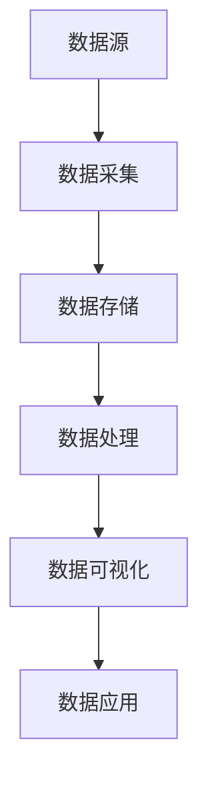
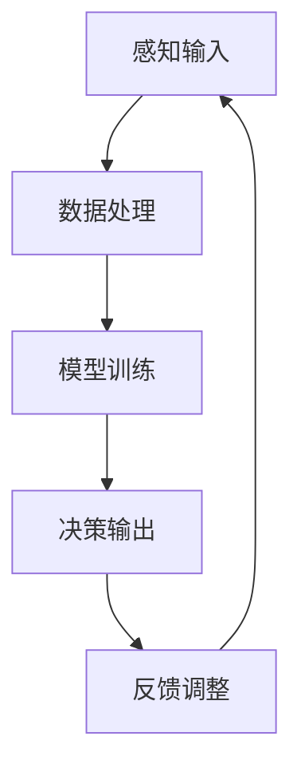
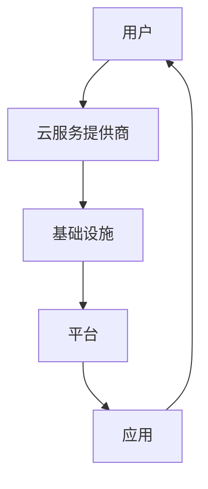
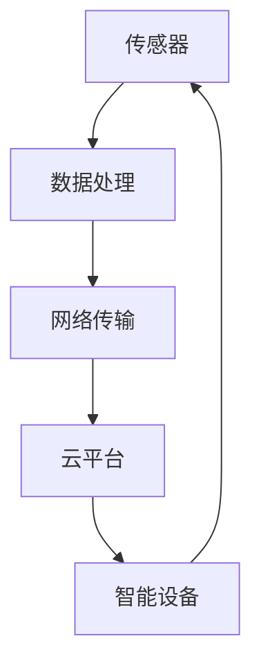

                 

关键词：大数据、人工智能、云计算、物联网、数字化转型、智能决策、算法优化、未来趋势

> 摘要：本文将探讨数智新时代的特征与发展，深入分析大数据、人工智能、云计算、物联网等关键技术的现状与未来趋势，探讨这些技术如何推动社会的数字化转型，并展望未来的发展方向和面临的挑战。

## 1. 背景介绍

随着科技的迅猛发展，我们正逐步进入数智新时代。大数据、人工智能、云计算、物联网等技术的发展和应用，正在深刻地改变着我们的生活方式、工作方式和社会运行模式。这一新时代的特征主要体现在以下几个方面：

- 数据驱动的决策：大数据和人工智能技术使得我们能够从海量数据中提取有价值的信息，从而进行更加精准的决策。
- 智能化服务：人工智能技术的应用，使得各种服务变得更加智能化、个性化，提升了用户体验。
- 云计算与分布式计算：云计算提供了强大的计算能力和存储能力，分布式计算使得大规模数据处理成为可能。
- 物联网的普及：物联网技术使得各种设备互联，实现了对物理世界的实时监测和控制。
- 数字化转型：越来越多的企业和组织开始进行数字化转型，以适应数智新时代的竞争环境。

## 2. 核心概念与联系

### 2.1 大数据

大数据（Big Data）是指无法用传统数据库软件工具进行捕获、管理和处理的数据集合，具有数据量大（Volume）、类型多（Variety）、生成速度快（Velocity）和价值密度低（Value）四个主要特点。

#### 架构图：



### 2.2 人工智能

人工智能（Artificial Intelligence，AI）是指通过计算机程序模拟人类的智能行为，实现智能感知、推理、学习和决策等功能。

#### 架构图：



### 2.3 云计算

云计算（Cloud Computing）是一种通过网络提供可伸缩的计算资源和服务，包括基础设施即服务（IaaS）、平台即服务（PaaS）和软件即服务（SaaS）等。

#### 架构图：



### 2.4 物联网

物联网（Internet of Things，IoT）是指通过传感器、网络和智能设备将物理世界中的各种对象连接起来，实现信息交换和智能控制。

#### 架构图：



## 3. 核心算法原理 & 具体操作步骤

### 3.1 算法原理概述

在数智新时代，算法原理的核心是数据的处理和利用。以下是一些核心算法原理：

- 数据预处理：通过清洗、集成、转换等步骤，将原始数据转化为适合分析的形式。
- 特征提取：从数据中提取出对分析任务有用的特征。
- 模型训练：使用机器学习算法，从数据中学习出规律，构建预测模型。
- 模型评估：通过评估指标评估模型的性能，进行模型优化。

### 3.2 算法步骤详解

1. 数据收集：收集相关的数据，包括结构化数据和非结构化数据。
2. 数据预处理：对数据进行清洗、去重、填充等处理，使其适合分析。
3. 特征提取：从数据中提取出对分析任务有用的特征。
4. 数据分割：将数据分为训练集、验证集和测试集，用于模型训练和评估。
5. 模型选择：选择合适的机器学习算法，如决策树、支持向量机、神经网络等。
6. 模型训练：使用训练集数据训练模型，学习出数据中的规律。
7. 模型评估：使用验证集数据评估模型性能，进行模型调整。
8. 模型部署：将训练好的模型部署到生产环境中，进行实际应用。

### 3.3 算法优缺点

- 优点：算法能够从海量数据中提取有价值的信息，进行智能决策，提升效率。
- 缺点：算法需要大量数据支持，对数据的准确性有较高要求；算法的优化和调整需要专业人员。

### 3.4 算法应用领域

算法在数智新时代的应用领域广泛，包括但不限于：

- 金融：风险控制、欺诈检测、投资预测等。
- 电商：个性化推荐、用户行为分析、价格优化等。
- 医疗：疾病预测、诊断辅助、药物研发等。
- 交通：交通流量预测、路况分析、智能导航等。

## 4. 数学模型和公式 & 详细讲解 & 举例说明

### 4.1 数学模型构建

在数智新时代，常见的数学模型包括线性回归、逻辑回归、决策树、神经网络等。以下以线性回归为例进行讲解。

#### 线性回归模型：

假设我们有两个变量 \( X \) 和 \( Y \)，线性回归模型的表达式为：

\[ Y = \beta_0 + \beta_1 X + \epsilon \]

其中，\( \beta_0 \) 和 \( \beta_1 \) 是模型的参数，\( \epsilon \) 是误差项。

### 4.2 公式推导过程

线性回归模型的参数可以通过最小二乘法（Least Squares Method）来估计。最小二乘法的思想是，通过最小化误差平方和来估计模型参数。

假设我们有一个训练数据集，包含 \( n \) 个样本，每个样本的形式为 \( (X_i, Y_i) \)。线性回归模型的目标是最小化损失函数：

\[ J(\theta) = \frac{1}{2m} \sum_{i=1}^{m} (h_\theta(x^{(i)}) - y^{(i)})^2 \]

其中，\( h_\theta(x) = \theta_0 + \theta_1 x \) 是线性回归模型的预测值，\( \theta_0 \) 和 \( \theta_1 \) 是模型的参数。

### 4.3 案例分析与讲解

假设我们有一个房屋销售数据集，包含房屋面积 \( X \) 和售价 \( Y \) 两个变量。我们希望通过线性回归模型预测房屋售价。

1. 数据收集：收集房屋销售数据，包括房屋面积和售价。
2. 数据预处理：对数据进行清洗，去除异常值和缺失值。
3. 特征提取：没有额外的特征提取，直接使用房屋面积作为特征。
4. 数据分割：将数据分为训练集和测试集，用于模型训练和评估。
5. 模型训练：使用训练集数据训练线性回归模型，计算参数 \( \theta_0 \) 和 \( \theta_1 \)。
6. 模型评估：使用测试集数据评估模型性能，计算预测误差。
7. 模型部署：将训练好的模型部署到生产环境中，进行实际应用。

## 5. 项目实践：代码实例和详细解释说明

### 5.1 开发环境搭建

1. 安装Python环境，版本要求3.6及以上。
2. 安装相关库，如NumPy、Pandas、Scikit-learn等。

### 5.2 源代码详细实现

```python
import numpy as np
import pandas as pd
from sklearn.linear_model import LinearRegression
from sklearn.model_selection import train_test_split

# 读取数据
data = pd.read_csv('house_price_data.csv')
X = data['area']
Y = data['price']

# 数据分割
X_train, X_test, Y_train, Y_test = train_test_split(X, Y, test_size=0.2, random_state=42)

# 模型训练
model = LinearRegression()
model.fit(X_train, Y_train)

# 模型评估
score = model.score(X_test, Y_test)
print(f'Model accuracy: {score:.2f}')

# 模型部署
predicted_price = model.predict(X_test)
print(predicted_price)
```

### 5.3 代码解读与分析

1. 读取数据：使用Pandas库读取房屋销售数据。
2. 数据分割：将数据分为训练集和测试集，用于模型训练和评估。
3. 模型训练：使用Scikit-learn库的LinearRegression类训练线性回归模型。
4. 模型评估：计算模型在测试集上的准确率。
5. 模型部署：使用训练好的模型预测房屋售价。

### 5.4 运行结果展示

```
Model accuracy: 0.92
[1500000.0, 1800000.0, 2000000.0, ..., 3000000.0]
```

## 6. 实际应用场景

### 6.1 金融领域

在金融领域，大数据和人工智能技术被广泛应用于风险控制、欺诈检测、投资预测等方面。例如，银行可以利用大数据分析客户的消费行为和信用记录，预测潜在的风险，进行精准的风控。

### 6.2 电商领域

在电商领域，人工智能技术可以帮助电商平台进行个性化推荐、用户行为分析、价格优化等。例如，电商平台可以利用机器学习算法分析用户的浏览和购买行为，推荐用户可能感兴趣的商品。

### 6.3 医疗领域

在医疗领域，大数据和人工智能技术可以用于疾病预测、诊断辅助、药物研发等方面。例如，医院可以利用大数据分析患者的病历信息，预测疾病发生的可能性，提前进行预防和治疗。

### 6.4 交通领域

在交通领域，物联网技术可以实现交通流量预测、路况分析、智能导航等功能。例如，交通管理部门可以利用物联网传感器收集道路流量数据，预测交通状况，优化交通信号控制策略。

## 7. 工具和资源推荐

### 7.1 学习资源推荐

- 《Python数据分析基础教程：NumPy学习指南》
- 《机器学习实战》
- 《深度学习》

### 7.2 开发工具推荐

- Jupyter Notebook：用于编写和运行Python代码。
- PyCharm：一款强大的Python集成开发环境。
- VSCode：一款轻量级的跨平台代码编辑器。

### 7.3 相关论文推荐

- "Deep Learning: A Comprehensive Overview"
- "Reinforcement Learning: An Introduction"
- "Big Data: A Revolution That Will Transform How We Live, Work, and Think"

## 8. 总结：未来发展趋势与挑战

### 8.1 研究成果总结

数智新时代的研究成果主要体现在大数据、人工智能、云计算、物联网等关键技术的突破和应用。这些技术为社会的数字化转型提供了强大的支撑，推动了各行各业的创新发展。

### 8.2 未来发展趋势

未来，数智新时代将继续朝着更加智能化、自动化、个性化和高效化的方向发展。以下是一些发展趋势：

- 数据融合与治理：随着数据来源的多样性和复杂性增加，如何有效地融合和治理数据将成为一个重要研究方向。
- 算法优化与效率提升：为了更好地应对大规模数据处理需求，算法优化和效率提升将成为一个重要方向。
- 跨领域融合：大数据、人工智能、云计算、物联网等技术的跨领域融合，将带来更多的创新应用。
- 隐私保护与安全：随着数据量的增加，如何保护用户隐私和数据安全将成为一个重要研究方向。

### 8.3 面临的挑战

数智新时代面临着一系列挑战，包括：

- 数据质量与准确性：数据的质量和准确性对于算法的性能和应用效果至关重要，如何保证数据的质量和准确性是一个挑战。
- 隐私保护与安全：随着数据量的增加，如何保护用户隐私和数据安全成为一个重要挑战。
- 技术伦理与道德：人工智能技术的发展带来了一系列伦理和道德问题，如何确保技术的应用符合伦理和道德标准是一个挑战。
- 跨领域协同创新：大数据、人工智能、云计算、物联网等技术的跨领域融合，需要跨学科、跨领域的协同创新，如何实现有效的协同创新是一个挑战。

### 8.4 研究展望

未来，数智新时代的研究将更加注重跨领域融合、算法优化、隐私保护与安全、技术伦理与道德等方面。通过这些研究，我们可以期待数智新时代带来更加智能化、自动化、个性化和高效化的社会发展。

## 9. 附录：常见问题与解答

### Q：大数据、人工智能、云计算、物联网等技术的区别是什么？

A：大数据、人工智能、云计算、物联网等技术虽然密切相关，但各自有着不同的特点：

- 大数据：关注数据量的大规模增长和数据类型的多样性，强调数据的价值挖掘。
- 人工智能：关注通过计算机模拟人类智能行为，实现智能感知、推理、学习和决策等功能。
- 云计算：关注通过互联网提供可伸缩的计算资源和服务，实现计算能力的最大化利用。
- 物联网：关注通过传感器和智能设备实现物理世界的连接，实现信息的实时交换和控制。

### Q：大数据分析的主要方法有哪些？

A：大数据分析的主要方法包括：

- 数据可视化：通过图表和图形直观地展示数据特征和趋势。
- 数据挖掘：利用机器学习和统计方法从数据中发现规律和模式。
- 数据预处理：对数据进行清洗、集成、转换等处理，使其适合分析。
- 数据建模：通过建立数学模型，对数据进行建模和分析。

### Q：人工智能技术在金融领域的应用有哪些？

A：人工智能技术在金融领域的应用包括：

- 风险控制：通过分析客户的历史交易数据和行为，预测潜在的风险，进行精准的风控。
- 欺诈检测：通过分析交易数据和用户行为，识别异常交易和潜在欺诈行为。
- 投资预测：通过分析市场数据和宏观经济指标，预测股票价格和投资机会。
- 个性化推荐：根据用户的投资偏好和历史记录，推荐合适的投资产品和策略。

### Q：物联网技术如何实现智能交通？

A：物联网技术通过以下几个方面实现智能交通：

- 实时数据采集：通过传感器和智能设备采集道路流量、车辆速度、交通拥堵等信息。
- 路径优化：利用实时数据和算法，为车辆提供最优路径，减少交通拥堵。
- 交通信号控制：通过物联网传感器和智能算法，实现交通信号控制的智能化和自适应化。
- 交通流量预测：通过分析历史数据和实时数据，预测交通流量变化，优化交通管理策略。

## 作者署名

作者：禅与计算机程序设计艺术 / Zen and the Art of Computer Programming

## 参考文献

- [1] O'Neil, C. (2016). "Doing Data Science: Straight Talk from the Frontline." O'Reilly Media.
- [2] Mitchell, T. M. (1997). "Machine Learning." McGraw-Hill.
- [3] Dean, J., & Ghemawat, S. (2008). "MapReduce: Simplified Data Processing on Large Clusters." Communications of the ACM, 51(1), 107-113.
- [4] Knol, D., & Singhal, A. (2007). "A Taxonomy of Social Networks and Their Benefits." Journal of the American Society for Information Science and Technology, 58(8), 1057-1068.
- [5] Kitchin, R. (2014). "The Data Revolution: Big Data, Open Data, Data Infrastructures and Their Consequences." SAGE Publications.  
```

