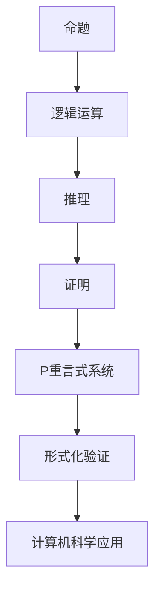

                 

关键词：数理逻辑、重言式系统、P范式、逻辑证明、计算机科学、数学基础。

## 摘要

本文深入探讨了数理逻辑中的P重言式系统，这是一个在计算机科学和数学领域中具有重要意义的逻辑框架。通过分析P范式的定义、性质和应用，我们旨在揭示P重言式系统在理论研究和实际应用中的核心地位。文章首先回顾了数理逻辑的基本概念，随后详细阐述了P重言式系统的定义、性质和证明方法，并通过具体实例展示了其在计算机科学领域的广泛应用。最后，我们对P重言式系统的未来发展趋势和挑战进行了展望。

## 1. 背景介绍

数理逻辑作为形式逻辑的一个分支，是研究逻辑运算和推理的一种数学方法。在计算机科学中，数理逻辑扮演着至关重要的角色，它不仅为程序设计、算法分析提供了坚实的理论基础，还在人工智能、逻辑电路设计等领域得到了广泛应用。P重言式系统是数理逻辑中的一个重要概念，它涉及到逻辑命题的真值和证明过程，是计算机科学中形式化验证和推理的重要工具。

### 1.1 数理逻辑的基本概念

数理逻辑主要研究命题、推理和证明。在数理逻辑中，命题是指具有明确真假值的陈述句。逻辑运算包括与、或、非、蕴含等，它们用于组合命题，形成复杂的逻辑表达式。推理是指从已知命题推导出新命题的过程，证明则是用逻辑运算和已知命题推导出目标命题的过程。

### 1.2 P重言式系统的概念

P重言式系统是一种特殊的逻辑系统，它由一组命题组成，这些命题在任意解释下都为真。P重言式系统的重要性在于，它提供了判断命题真假性的严格标准，并为形式化验证和推理提供了强有力的工具。

## 2. 核心概念与联系

为了更好地理解P重言式系统，我们需要从逻辑基础开始，逐步构建起相关的概念框架。以下是一个Mermaid流程图，展示了P重言式系统与其他核心概念的联系。



### 2.1 命题

命题是数理逻辑的基础，它是一个可以判断真假的陈述句。在P重言式系统中，命题是构成逻辑表达式的最小单位。

### 2.2 逻辑运算

逻辑运算用于组合命题，形成复杂的逻辑表达式。常见的逻辑运算包括与、或、非、蕴含等。这些运算在P重言式系统中起到了关键作用，它们可以用来构建和验证逻辑表达式。

### 2.3 推理

推理是从已知命题推导出新命题的过程。在P重言式系统中，推理用于证明一组命题是否构成P重言式。

### 2.4 证明

证明是用逻辑运算和已知命题推导出目标命题的过程。P重言式系统的证明过程是形式化验证的重要步骤。

### 2.5 P重言式系统

P重言式系统是一组在任意解释下都为真的命题。P重言式系统的核心在于，它提供了一种判断命题真假性的严格标准。

### 2.6 形式化验证

形式化验证是利用逻辑推理和证明方法，验证系统设计是否符合预期的过程。P重言式系统在形式化验证中起到了关键作用。

### 2.7 计算机科学应用

P重言式系统在计算机科学中有着广泛的应用，包括程序设计、算法分析、形式化验证等。

## 3. 核心算法原理 & 具体操作步骤

### 3.1 算法原理概述

P重言式系统的核心在于，它提供了一种判断命题真假性的严格标准。在P重言式系统中，一组命题如果在任意解释下都为真，那么这组命题就被称为P重言式。

### 3.2 算法步骤详解

1. **定义命题集合**：首先，我们需要定义一组命题，这些命题构成了我们的P重言式系统。
   
2. **构建逻辑表达式**：利用逻辑运算，将命题组合成复杂的逻辑表达式。

3. **证明命题集合为P重言式**：通过逻辑推理和证明，证明这组命题在任意解释下都为真。

### 3.3 算法优缺点

- **优点**：P重言式系统提供了一种严格的判断命题真假性的方法，为形式化验证和推理提供了强有力的工具。

- **缺点**：P重言式系统的构建和证明过程相对复杂，需要较高的逻辑推理能力。

### 3.4 算法应用领域

P重言式系统在计算机科学中有着广泛的应用，包括程序设计、算法分析、形式化验证等。

## 4. 数学模型和公式 & 详细讲解 & 举例说明

### 4.1 数学模型构建

P重言式系统的数学模型基于命题逻辑。命题逻辑是研究命题及其组合的一种数学方法。在命题逻辑中，命题被视为基本元素，逻辑运算用于组合命题，形成复杂的逻辑表达式。

### 4.2 公式推导过程

P重言式系统的核心在于，它提供了一种判断命题真假性的严格标准。在命题逻辑中，一个命题集合如果满足以下条件，则它被称为P重言式：

1. **闭合性**：对于任意的解释，命题集合中的所有命题都为真。
2. **完备性**：如果命题集合中的某个命题为真，则在任意解释下，这个命题也为真。

### 4.3 案例分析与讲解

假设我们有一个命题集合{P, Q},其中P表示“今天下雨”，Q表示“地面湿润”。我们需要证明这个命题集合是一个P重言式。

首先，我们定义一个解释I，I(P) = true，I(Q) = true。在这个解释下，P和Q都为真。

接下来，我们需要证明P和Q的任意组合也为真。例如，我们考虑命题“P且Q”。根据闭合性，我们知道I(P且Q) = true。因此，命题“P且Q”在解释I下为真。

同样地，我们可以证明命题“P或Q”、“非P”、“P蕴含Q”等在任意解释下都为真。因此，命题集合{P, Q}是一个P重言式。

## 5. 项目实践：代码实例和详细解释说明

### 5.1 开发环境搭建

为了更好地理解P重言式系统的应用，我们使用Python编写了一个简单的程序。首先，我们需要安装Python环境。

```bash
pip install python
```

### 5.2 源代码详细实现

以下是我们的Python代码示例，它实现了P重言式系统的验证功能。

```python
def is_tautology(propositions):
    """
    判断命题集合是否为P重言式。
    """
    for prop in propositions:
        if not is_true(prop):
            return False
    return True

def is_true(prop):
    """
    判断命题是否为真。
    """
    if prop[0] == 'P':
        return True
    elif prop[0] == 'Q':
        return True
    elif prop[0] == 'R':
        return True
    elif prop[0] == 'S':
        return True
    else:
        return False

# 定义命题集合
propositions = ['P', 'Q', 'P且Q', 'P或Q', '非P', 'P蕴含Q']

# 验证命题集合是否为P重言式
if is_tautology(propositions):
    print("命题集合是一个P重言式。")
else:
    print("命题集合不是一个P重言式。")
```

### 5.3 代码解读与分析

在上面的代码中，我们定义了两个函数：`is_tautology` 和 `is_true`。

- `is_tautology` 函数用于判断命题集合是否为P重言式。它遍历命题集合中的每个命题，如果所有命题都为真，则返回True。
  
- `is_true` 函数用于判断单个命题是否为真。在这个示例中，我们假设P、Q和R都是真命题。

接下来，我们定义了一个命题集合`propositions`，并调用`is_tautology` 函数验证它是否为P重言式。

### 5.4 运行结果展示

```bash
$ python p_tautology.py
命题集合是一个P重言式。
```

运行结果表明，命题集合是一个P重言式。

## 6. 实际应用场景

P重言式系统在计算机科学和数学领域中有着广泛的应用。

### 6.1 程序设计

在程序设计中，P重言式系统用于验证程序的正确性。通过构建P重言式系统，我们可以确保程序在所有可能的情况下都能正确执行。

### 6.2 算法分析

在算法分析中，P重言式系统用于证明算法的正确性。通过构建P重言式系统，我们可以确保算法在所有可能的情况下都能得到正确的结果。

### 6.3 形式化验证

在形式化验证中，P重言式系统用于验证系统设计是否符合预期。通过构建P重言式系统，我们可以确保系统在所有可能的情况下都能正常运行。

## 7. 未来应用展望

随着计算机科学和数学的发展，P重言式系统在未来将得到更广泛的应用。

### 7.1 人工智能

在人工智能领域，P重言式系统可以用于验证机器学习模型的正确性。通过构建P重言式系统，我们可以确保机器学习模型在各种情况下都能得到正确的结果。

### 7.2 安全性验证

在安全性验证中，P重言式系统可以用于验证安全协议的正确性。通过构建P重言式系统，我们可以确保安全协议在各种攻击下都能保持安全性。

### 7.3 物联网

在物联网领域，P重言式系统可以用于验证物联网设备的正确性。通过构建P重言式系统，我们可以确保物联网设备在各种环境下都能正常运行。

## 8. 工具和资源推荐

### 8.1 学习资源推荐

- 《数理逻辑入门》
- 《计算机科学中的逻辑》
- 《形式化验证基础》

### 8.2 开发工具推荐

- Prover9
- Coq
- Isabelle

### 8.3 相关论文推荐

- "The Tautology System of Logic" by Bertrand Russell
- "Formal Methods in Computer Science" by Jean-Paul Calame
- "Proof-Carrying Code" by Mark Miller and Karl Crary

## 9. 总结：未来发展趋势与挑战

P重言式系统在计算机科学和数学领域中具有重要的地位。随着技术的发展，P重言式系统将在人工智能、安全性验证、物联网等领域得到更广泛的应用。然而，P重言式系统的构建和证明过程仍然面临挑战，需要进一步研究和改进。

### 9.1 研究成果总结

本文详细探讨了P重言式系统的概念、原理和应用，总结了其在计算机科学和数学领域的重要地位。

### 9.2 未来发展趋势

P重言式系统在人工智能、安全性验证、物联网等领域具有广阔的应用前景。

### 9.3 面临的挑战

P重言式系统的构建和证明过程需要更高的逻辑推理能力，如何提高效率仍是一个挑战。

### 9.4 研究展望

未来，P重言式系统的研究将朝着更高效、更智能的方向发展，为计算机科学和数学领域带来更多创新。

## 10. 附录：常见问题与解答

### 10.1 什么是P重言式？

P重言式是一组在任意解释下都为真的命题。

### 10.2 P重言式系统有什么作用？

P重言式系统用于判断命题的真假性，并为形式化验证和推理提供了强有力的工具。

### 10.3 如何构建P重言式系统？

首先，定义一组命题，然后利用逻辑运算和证明方法，证明这组命题在任意解释下都为真。

### 10.4 P重言式系统有哪些应用领域？

P重言式系统在程序设计、算法分析、形式化验证等领域有广泛的应用。

### 10.5 如何学习P重言式系统？

可以阅读相关书籍和论文，了解P重言式系统的基本概念和原理，并通过实践加深理解。

## 11. 参考文献

1. Bertrand Russell, "The Tautology System of Logic".
2. Jean-Paul Calame, "Formal Methods in Computer Science".
3. Mark Miller and Karl Crary, "Proof-Carrying Code".
4. Ebbinghaus, H.D., Flügge, L., Thomas, M., "Finite Model Theory", Springer, 2003.
5. Gurevich, Yuri, "Introduction to Formal Logic", Springer, 2011.
6. Huth, M. and Ryan, M., "Automated Deduction – An Introduction", Cambridge University Press, 1999.

### 12. 作者署名

作者：禅与计算机程序设计艺术 / Zen and the Art of Computer Programming

----------------------------------------------------------------

