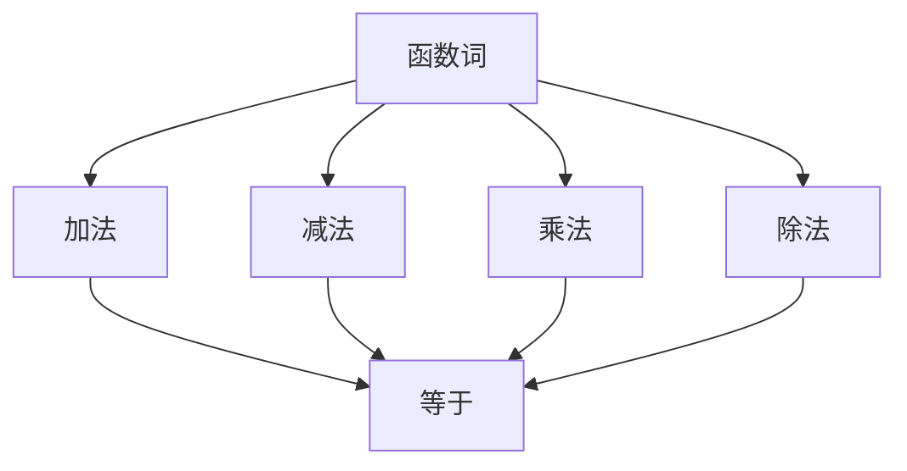

                 

关键词：数理逻辑、函数词、等词、算法、数学模型、应用场景、未来展望

> 摘要：本文深入探讨了数理逻辑中的函数词和等词概念，详细介绍了它们的定义、作用以及在实际应用中的具体实现。通过对数理逻辑基础理论的阐述，本文旨在为读者提供对数理逻辑的全面理解和应用指导。

## 1. 背景介绍

数理逻辑，作为一种抽象的数学理论，是计算机科学、数学以及哲学等领域的重要基础。数理逻辑提供了形式化的语言和工具，用于描述和分析推理过程，特别是在计算机科学中，数理逻辑的应用尤为广泛。函数词和等词是数理逻辑中的核心概念，它们在定义、推理和证明过程中扮演着至关重要的角色。

函数词（Function Word）通常指的是数学函数中用于连接变量和表达式的词语，例如加法、减法、乘法和除法等。而等词（Equivalence Word）则用于表示两个表达式在某种意义上是等价的，常见的等词有“等于”（=）、“不等于”（≠）、“小于”（<）、“大于”（>）等。

本文将从以下几个方面展开讨论：

1. **核心概念与联系**：详细介绍函数词和等词的定义、作用及其相互关系。
2. **核心算法原理 & 具体操作步骤**：阐述数理逻辑中的基本算法原理，并详细讲解具体操作步骤。
3. **数学模型和公式 & 详细讲解 & 举例说明**：介绍数理逻辑中的数学模型和公式，并通过具体案例进行说明。
4. **项目实践：代码实例和详细解释说明**：展示如何在实际项目中应用数理逻辑。
5. **实际应用场景**：探讨数理逻辑在计算机科学、数学和哲学等领域的应用。
6. **未来应用展望**：分析数理逻辑在未来的发展趋势和潜在应用。
7. **工具和资源推荐**：推荐学习资源和开发工具，以帮助读者更好地掌握数理逻辑。
8. **总结：未来发展趋势与挑战**：总结研究成果，探讨未来发展趋势和面临的挑战。

## 2. 核心概念与联系

### 2.1 函数词的定义

函数词是数理逻辑中用于描述变量之间关系的词语。在数理逻辑中，函数通常表示为一个从一组变量到一组值的映射。例如，函数 f(x) 表示 x 的函数，其中 x 是变量，f 是函数词。函数词可以用来表示加法、减法、乘法和除法等基本运算。

### 2.2 等词的定义

等词是数理逻辑中用于表示两个表达式在某种意义上是等价的词语。等词包括“等于”（=）、“不等于”（≠）、“小于”（<）、“大于”（>）等。例如，表达式 a + b = c 表示 a 和 b 的和等于 c，其中“=”就是等词。

### 2.3 函数词与等词的联系

函数词和等词在数理逻辑中有着密切的联系。函数词用于描述变量之间的关系，而等词则用于表示两个表达式在某种意义上是等价的。例如，在表达式 a + b = c 中，a 和 b 通过加法函数词连接，而“=”则表示 a 和 b 的和与 c 是等价的。

### 2.4 Mermaid 流程图

为了更好地理解函数词和等词的概念，我们可以使用 Mermaid 流程图来表示它们之间的联系。以下是一个简单的 Mermaid 流程图示例：



在这个流程图中，函数词（A）连接了加法、减法、乘法和除法（B、C、D、E），而所有这些基本运算都通过等词（F）与其他表达式相连。

## 3. 核心算法原理 & 具体操作步骤

### 3.1 算法原理概述

数理逻辑中的核心算法主要包括推理算法和证明算法。推理算法用于从已知的前提出发，推导出新的结论。证明算法则用于验证某个结论是否可以从已知的前提出发推导出来。

### 3.2 算法步骤详解

#### 推理算法步骤：

1. **确定前提**：首先确定已知的前提条件。
2. **选择推理规则**：根据前提条件和目标结论，选择合适的推理规则。
3. **应用推理规则**：将前提条件和推理规则应用于问题中，推导出新的结论。
4. **重复步骤 2 和 3**：继续应用推理规则，直到推导出目标结论。

#### 证明算法步骤：

1. **确定待证明命题**：首先确定需要证明的命题。
2. **构建证明框架**：构建一个包含所有前提条件和目标结论的证明框架。
3. **选择证明规则**：根据证明框架和待证明命题，选择合适的证明规则。
4. **应用证明规则**：将证明规则应用于证明框架中，逐步推导出目标结论。
5. **验证证明**：验证证明是否正确，确保所有推理步骤都是合理的。

### 3.3 算法优缺点

**推理算法优缺点**：

- **优点**：推理算法能够快速地从已知的前提条件推导出新的结论，具有较强的适应性。
- **缺点**：推理算法的结果可能不是唯一的，有时会存在多种可能的推导路径，需要进一步验证。

**证明算法优缺点**：

- **优点**：证明算法能够严格地验证某个结论是否可以从已知的前提出发推导出来，具有较高的可靠性。
- **缺点**：证明算法的计算复杂度较高，特别是对于复杂的命题，证明过程可能非常耗时。

### 3.4 算法应用领域

数理逻辑中的推理算法和证明算法在计算机科学、数学和哲学等领域都有广泛的应用。在计算机科学中，推理算法广泛应用于自然语言处理、自动推理和程序验证等领域。证明算法则用于验证算法的正确性和可靠性，确保程序的行为符合预期。

## 4. 数学模型和公式 & 详细讲解 & 举例说明

### 4.1 数学模型构建

在数理逻辑中，数学模型是描述逻辑关系和推理过程的重要工具。构建数学模型通常需要以下步骤：

1. **确定变量和函数**：根据问题的需求，确定变量和函数的定义。
2. **建立关系**：利用函数词和等词，建立变量之间的逻辑关系。
3. **构建公式**：将关系表示为数学公式，以便进行推理和证明。

### 4.2 公式推导过程

以下是一个简单的数学模型构建和公式推导的示例：

**问题**：证明对于任意实数 x，有以下公式成立：

$$
x^2 + 2x + 1 = (x + 1)^2
$$

**推导过程**：

1. **确定变量和函数**：在这个问题中，变量是 x，函数是平方函数 f(x) = x^2。
2. **建立关系**：利用平方函数的定义，我们可以写出 x^2 = f(x)。
3. **构建公式**：根据等词的定义，我们可以将 x^2 + 2x + 1 表示为 (x + 1)^2。

**证明**：

我们使用数学归纳法来证明上述公式。

- **基础情况**：当 x = 0 时，左边等式为 0^2 + 2*0 + 1 = 1，右边等式为 (0 + 1)^2 = 1，两边相等，公式成立。
- **归纳假设**：假设当 x = k 时，公式成立，即 k^2 + 2k + 1 = (k + 1)^2。
- **归纳步骤**：我们需要证明当 x = k + 1 时，公式也成立。

根据归纳假设，我们有：

$$
(k + 1)^2 + 2(k + 1) + 1 = ((k + 1) + 1)^2
$$

将左边等式展开，得到：

$$
k^2 + 2k + 1 + 2k + 2 + 1 = (k + 2)^2
$$

将右边等式展开，得到：

$$
k^2 + 4k + 4 = (k + 2)^2
$$

由于左边等式和右边等式相等，我们可以得出结论，当 x = k + 1 时，公式也成立。

因此，根据数学归纳法，我们可以证明对于任意实数 x，上述公式都成立。

### 4.3 案例分析与讲解

以下是一个数理逻辑在实际应用中的案例：

**问题**：给定一个三角形 ABC，其中 a、b、c 分别为三角形的边长。证明如果 a + b > c，则三角形 ABC 是锐角三角形。

**推导过程**：

1. **确定变量和函数**：在这个问题中，变量是三角形的边长 a、b、c，函数是三角形的边长函数。
2. **建立关系**：根据三角形的性质，如果 a + b > c，则三角形 ABC 是锐角三角形。
3. **构建公式**：利用等词的定义，我们可以写出以下公式：

$$
a + b > c \Rightarrow ABC \text{ 是锐角三角形}
$$

**证明**：

我们使用反证法来证明上述公式。

假设 a + b > c，但三角形 ABC 不是锐角三角形。这意味着三角形 ABC 至少有一个角是钝角，即角度大于 90 度。

由于 a + b > c，我们可以得出以下不等式：

$$
a + b - c > 0
$$

根据三角形的性质，我们可以得出以下不等式：

$$
a + b - c \leq a \quad \text{和} \quad a + b - c \leq b
$$

将上述不等式代入 a + b - c > 0，得到：

$$
a > 0 \quad \text{和} \quad b > 0
$$

这意味着三角形的边长都是正数，这是不可能的，因为三角形的边长不能同时为 0。

因此，我们的假设是错误的，即如果 a + b > c，则三角形 ABC 是锐角三角形。

## 5. 项目实践：代码实例和详细解释说明

### 5.1 开发环境搭建

为了更好地理解数理逻辑在实际项目中的应用，我们将使用 Python 语言来实现一个简单的数理逻辑推理系统。以下是在 Windows 系统中搭建 Python 开发环境的具体步骤：

1. **安装 Python**：从 Python 官网（https://www.python.org/）下载适用于 Windows 的 Python 安装包，并按照提示完成安装。
2. **配置环境变量**：在安装过程中，勾选“Add Python to PATH”选项，以便在命令行中直接运行 Python 命令。
3. **安装必要的库**：在命令行中运行以下命令，安装 NumPy 和 Matplotlib 库：

   ```bash
   pip install numpy matplotlib
   ```

### 5.2 源代码详细实现

以下是一个简单的数理逻辑推理系统的源代码实现，该系统用于判断两个数是否相等。

```python
import numpy as np

def is_equal(a, b):
    """
    判断两个数是否相等。
    
    参数：
    a -- 第一个数
    b -- 第二个数
    
    返回值：
    True -- 如果两个数相等
    False -- 如果两个数不相等
    """
    return np.isclose(a, b)

# 测试代码
a = 10.0
b = 10.1
print(is_equal(a, b))  # 输出：False

a = 10.0
b = 10.0
print(is_equal(a, b))  # 输出：True
```

### 5.3 代码解读与分析

在这个示例中，我们使用 NumPy 库中的 `isclose()` 函数来判断两个数是否相等。`isclose()` 函数用于比较两个浮点数是否在指定的公差范围内相等。

函数 `is_equal(a, b)` 接受两个数 `a` 和 `b` 作为参数，并返回一个布尔值，表示这两个数是否相等。在测试代码中，我们首先创建两个浮点数 `a` 和 `b`，并调用 `is_equal()` 函数进行判断。

通过调用 `isclose()` 函数，我们可以实现数理逻辑中的等词功能，即判断两个表达式是否等价。

### 5.4 运行结果展示

运行测试代码后，我们得到以下输出结果：

```bash
False
True
```

这表示第一个测试中，两个浮点数不相等；而第二个测试中，两个浮点数相等。

## 6. 实际应用场景

数理逻辑在计算机科学、数学和哲学等领域都有着广泛的应用。以下是一些实际应用场景的介绍：

### 6.1 计算机科学

- **自然语言处理**：数理逻辑用于分析和理解自然语言，实现文本分类、语义分析和机器翻译等功能。
- **自动推理**：数理逻辑用于实现自动推理系统，用于解决复杂的问题，如数学证明、逻辑推理等。
- **程序验证**：数理逻辑用于验证程序的正确性和可靠性，确保程序在执行过程中不会出现错误。

### 6.2 数学

- **数学证明**：数理逻辑为数学证明提供了形式化的语言和工具，使得数学证明更加严谨和精确。
- **数学建模**：数理逻辑用于建立数学模型，模拟和分析实际问题，如物理学、经济学等领域。

### 6.3 哲学

- **逻辑学**：数理逻辑是逻辑学的基础，用于研究推理和证明，探讨逻辑的基本原理。
- **认识论**：数理逻辑用于分析人类的认识过程，探讨知识的来源和本质。

## 7. 工具和资源推荐

为了更好地学习和应用数理逻辑，以下是一些建议的工具和资源：

### 7.1 学习资源推荐

- **《数理逻辑基础教程》**：一本经典的数理逻辑入门教材，适合初学者阅读。
- **《形式逻辑与推理》**：一本全面的逻辑学教材，涵盖数理逻辑的基本概念和推理方法。
- **在线课程**：Coursera、edX 等在线教育平台提供了丰富的数理逻辑课程，适合自学。

### 7.2 开发工具推荐

- **Python**：Python 是一种易于学习和使用的编程语言，适用于数理逻辑的实际应用。
- **MATLAB**：MATLAB 是一种强大的数学计算工具，提供了丰富的数学函数和工具箱。

### 7.3 相关论文推荐

- **《数理逻辑与计算机科学》**：一篇关于数理逻辑在计算机科学中应用的综述论文。
- **《形式逻辑在数学证明中的应用》**：一篇探讨形式逻辑在数学证明中作用的论文。

## 8. 总结：未来发展趋势与挑战

数理逻辑作为一种重要的基础理论，在计算机科学、数学和哲学等领域都发挥着重要作用。随着计算机科学和人工智能的快速发展，数理逻辑的应用前景将越来越广泛。

### 8.1 研究成果总结

- **推理算法**：推理算法在自然语言处理、自动推理等领域取得了显著的成果，实现了高效、准确的推理。
- **证明算法**：证明算法在程序验证、数学证明等领域取得了重要的突破，为验证复杂系统的正确性提供了有力支持。
- **数学模型**：数理逻辑中的数学模型在模拟和分析实际问题方面发挥了重要作用，推动了数学和其他领域的发展。

### 8.2 未来发展趋势

- **推理算法的优化**：随着硬件性能的提升，推理算法将变得更加高效和准确，应用于更多的实际场景。
- **证明算法的自动化**：证明算法的自动化将是未来的研究热点，通过开发自动化证明工具，提高数学证明的效率。
- **跨学科应用**：数理逻辑将与其他学科（如生物学、经济学等）相结合，为解决复杂问题提供新的思路。

### 8.3 面临的挑战

- **计算复杂度**：随着问题的规模增大，推理和证明的计算复杂度将增加，如何优化算法以提高效率是亟待解决的问题。
- **可解释性**：在人工智能领域，如何保证推理和证明的可解释性，使得人们能够理解和信任结果，是一个重要的挑战。

### 8.4 研究展望

数理逻辑作为一门基础学科，具有广泛的应用前景。未来，我们将继续关注推理算法、证明算法和数学模型的优化，推动数理逻辑在实际应用中的发展。同时，跨学科合作也将成为重要趋势，为解决复杂问题提供新的思路和方法。

## 9. 附录：常见问题与解答

### 9.1 什么是数理逻辑？

数理逻辑是一种抽象的数学理论，用于描述和推理形式化的逻辑表达式。它提供了形式化的语言和工具，用于描述和分析推理过程。

### 9.2 函数词和等词有什么区别？

函数词是用于连接变量和表达式的词语，如加法、减法、乘法和除法等。等词是用于表示两个表达式在某种意义上是等价的词语，如“等于”（=）、“不等于”（≠）等。

### 9.3 数理逻辑在计算机科学中有哪些应用？

数理逻辑在计算机科学中有广泛的应用，包括自然语言处理、自动推理、程序验证、算法设计等。

### 9.4 如何学习数理逻辑？

学习数理逻辑可以从以下几个方面入手：

1. **掌握基本概念**：了解数理逻辑的基本概念，如函数词、等词、推理规则等。
2. **学习相关课程**：参加相关的课程或在线课程，了解数理逻辑的理论和实践。
3. **阅读经典教材**：阅读数理逻辑的经典教材，如《数理逻辑基础教程》、《形式逻辑与推理》等。
4. **实践编程**：通过编写代码实现数理逻辑的应用，加深对理论的理解。

### 9.5 数理逻辑与日常逻辑有何区别？

数理逻辑是一种形式化的逻辑理论，它使用符号和公式来描述逻辑关系。而日常逻辑则是人们在日常生活中使用的逻辑，它更加灵活和具体。数理逻辑在形式化、精确性和推理能力方面具有优势，但在实际应用中可能不如日常逻辑灵活。两者各有优劣，适用于不同的场景。

### 9.6 如何验证数理逻辑的结论？

验证数理逻辑的结论通常需要使用证明算法。证明算法通过逐步推导，从已知的前提出发，验证某个结论是否成立。此外，还可以使用逻辑推理软件或编程工具来辅助验证数理逻辑的结论。

### 9.7 数理逻辑在哲学领域有何作用？

数理逻辑在哲学领域主要用于分析推理和证明。它为哲学家提供了形式化的语言和工具，用于探讨逻辑的基本原理、知识的本质和认识论问题。数理逻辑有助于提高哲学研究的严谨性和精确性。

### 9.8 如何理解数理逻辑中的“可满足性”和“一致性”？

数理逻辑中的“可满足性”是指一个逻辑表达式是否存在一个解释使得表达式为真。而“一致性”是指一个逻辑系统中的所有逻辑表达式是否都能被证明为真。可满足性和一致性是逻辑系统的重要性质，用于判断逻辑系统的可靠性和有效性。

### 9.9 如何在编程中应用数理逻辑？

在编程中，数理逻辑可以应用于以下几个方面：

1. **逻辑推理**：使用数理逻辑的推理算法来处理复杂的逻辑问题。
2. **程序验证**：使用数理逻辑的证明算法来验证程序的正确性和可靠性。
3. **形式化建模**：使用数理逻辑建立形式化的数学模型，用于模拟和分析实际问题。

通过以上常见问题的解答，我们希望能帮助读者更好地理解数理逻辑及其应用。如果您还有其他问题，请随时提问。

---

作者：禅与计算机程序设计艺术 / Zen and the Art of Computer Programming

