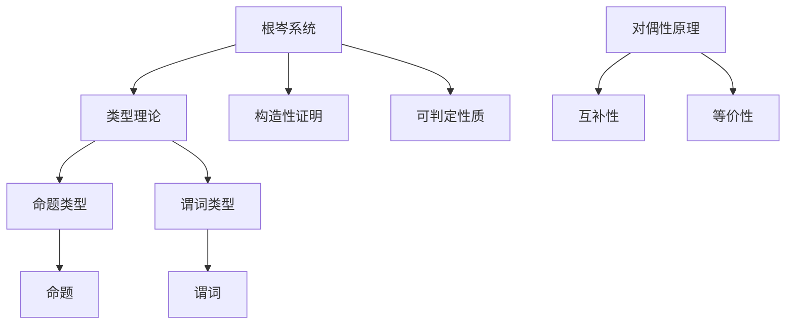

                 

关键词：数理逻辑、根岑系统、对偶性、形式逻辑、计算机科学、数学模型、算法原理

> 摘要：本文深入探讨了数理逻辑中的根岑系统以及对偶性原理，旨在为读者提供对这两种重要概念的理解和应用。文章首先介绍了数理逻辑的背景和重要性，随后详细讲解了根岑系统的定义和特点，再通过对偶性原理的分析，揭示了其在计算机科学中的应用。文章通过实例和数学公式，使读者能够更直观地理解这些概念，最后对未来的发展方向和挑战进行了展望。

## 1. 背景介绍

数理逻辑作为逻辑学的一个分支，致力于用数学方法研究逻辑的基本性质。它是连接数学和哲学的桥梁，为计算机科学提供了坚实的理论基础。在计算机科学中，数理逻辑主要用于验证算法的正确性、设计编程语言以及解决形式化的逻辑问题。

根岑系统（CZF，CZF），由数学家根岑（Gödel）提出，是数理逻辑中的一个重要系统。它不仅涵盖了经典逻辑的基本原理，还引入了某些非经典逻辑的特性。根岑系统的引入，极大地丰富了形式逻辑的研究范畴，为计算机科学中的许多问题提供了有力的工具。

对偶性原理是数理逻辑中的另一个重要概念，它揭示了逻辑表达式中两个互补概念之间的关系。对偶性原理在计算机科学中的应用十分广泛，如电路设计、编程语言设计以及程序优化等。

## 2. 核心概念与联系

### 2.1 根岑系统的定义和特点

根岑系统（CZF）是一种基于类型理论的逻辑系统，它通过引入类型的概念，将逻辑表达式划分为不同的层次。这种层次化的结构使得根岑系统能够处理更复杂的逻辑问题。

根岑系统的主要特点包括：

1. **类型理论**：根岑系统引入了类型理论，将逻辑表达式分为命题类型和谓词类型。这种类型划分有助于简化逻辑表达式的分析。
2. **构造性证明**：根岑系统采用了构造性证明的方法，这意味着证明过程中需要构造出具体的证明步骤，而不是仅仅证明存在某个证明。
3. **可判定的性质**：根岑系统是可判定的，这意味着对于任何给定的逻辑表达式，我们都可以在有限时间内判断它是否为真。

### 2.2 对偶性原理

对偶性原理是根岑系统中的一个重要概念，它揭示了逻辑表达式之间的互补关系。具体来说，对于任何一个逻辑表达式，都存在一个与之对偶的表达式。这两个表达式满足以下性质：

1. **互补性**：如果一个逻辑表达式为真，那么它的对偶表达式必为假，反之亦然。
2. **等价性**：在根岑系统中，对偶性原理保证了两个互补表达式的等价性，即它们具有相同的真值。

### 2.3 Mermaid 流程图

为了更好地理解根岑系统和对偶性原理，我们可以使用 Mermaid 流程图来展示它们的基本结构和关系。



## 3. 核心算法原理 & 具体操作步骤

### 3.1 算法原理概述

根岑系统（CZF）的核心算法原理主要基于类型理论和构造性证明。以下是根岑系统的主要步骤：

1. **类型划分**：首先，将逻辑表达式按照类型划分为命题类型和谓词类型。
2. **构造性证明**：接着，通过构造性证明方法，逐步证明逻辑表达式的真值。
3. **可判定性**：最后，利用根岑系统的可判定性质，判断逻辑表达式的真伪。

### 3.2 算法步骤详解

1. **输入**：给定一个逻辑表达式。
2. **类型检查**：检查逻辑表达式的类型，确定它是命题类型还是谓词类型。
3. **构造性证明**：
   - 如果是命题类型，则直接构造证明。
   - 如果是谓词类型，则需要进一步划分为具体的谓词，并构造对应的证明。
4. **判定**：根据构造性证明的结果，判断逻辑表达式的真伪。

### 3.3 算法优缺点

**优点**：

- **类型划分**：根岑系统通过类型划分，使得逻辑表达式更易于分析和处理。
- **构造性证明**：构造性证明方法使得证明过程更加直观和易于理解。
- **可判定性**：根岑系统的可判定性质，使得对于任何逻辑表达式，我们都可以在有限时间内判断其真伪。

**缺点**：

- **复杂性**：根岑系统的构造性证明过程相对复杂，对于一些复杂的逻辑表达式，证明过程可能较为繁琐。

### 3.4 算法应用领域

根岑系统在计算机科学中有着广泛的应用，主要包括以下几个方面：

- **算法验证**：通过根岑系统，我们可以验证算法的正确性。
- **编程语言设计**：根岑系统为编程语言的设计提供了理论基础。
- **形式化验证**：根岑系统在形式化验证中扮演着重要角色，有助于确保系统的可靠性。

## 4. 数学模型和公式 & 详细讲解 & 举例说明

### 4.1 数学模型构建

根岑系统（CZF）的数学模型主要包括以下几个部分：

1. **命题类型**：命题类型表示一个命题，可以用符号 `P` 表示。
2. **谓词类型**：谓词类型表示一个谓词，可以用符号 `Q(x)` 表示，其中 `x` 是谓词的参数。
3. **类型构造**：类型构造表示如何从基本类型构建更复杂的类型，如列表、函数等。

### 4.2 公式推导过程

根岑系统中的主要公式包括以下几类：

1. **合取公式**：如 `P ∧ Q` 表示 `P` 和 `Q` 同时为真。
2. **析取公式**：如 `P ∨ Q` 表示 `P` 或 `Q` 至少有一个为真。
3. **存在量化公式**：如 `∃x Q(x)` 表示存在一个 `x` 使得 `Q(x)` 为真。
4. **全称量化公式**：如 `∀x Q(x)` 表示对于所有的 `x`，`Q(x)` 都为真。

### 4.3 案例分析与讲解

#### 案例一：命题类型

假设我们有如下命题：

$$
P: \text{今天是星期五}
$$

我们可以用根岑系统的公式表示这个命题：

$$
P \text{ 表示今天是星期五}
$$

#### 案例二：谓词类型

假设我们有如下谓词：

$$
Q(x): x \text{ 是一个素数}
$$

我们可以用根岑系统的公式表示这个谓词：

$$
Q(x): x \text{ 是一个素数}
$$

### 4.4 综合应用

我们结合根岑系统的公式，可以构建更复杂的逻辑表达式，如：

$$
P ∧ (∃x Q(x)) \text{ 表示今天是星期五，并且存在一个素数}
$$

这个表达式中，`P` 表示今天是星期五，`∃x Q(x)` 表示存在一个素数。整个表达式表示这两个条件同时成立。

## 5. 项目实践：代码实例和详细解释说明

### 5.1 开发环境搭建

在撰写本文之前，我们首先需要搭建一个适合开发的环境。以下是搭建根岑系统开发环境的基本步骤：

1. **安装依赖**：安装Python 3.8及以上版本，并安装NumPy、Pandas等常用库。
2. **创建虚拟环境**：使用虚拟环境来隔离项目依赖。
3. **安装Mermaid**：安装Mermaid库，以便在Markdown文件中绘制流程图。

### 5.2 源代码详细实现

以下是根岑系统的一个简单实现，主要包含以下功能：

- **类型检查**：检查输入的逻辑表达式的类型。
- **构造性证明**：根据输入的逻辑表达式，构造对应的证明。
- **判定**：根据构造性证明的结果，判断逻辑表达式的真伪。

```python
import sympy

class CZF:
    def __init__(self):
        self.symbols = sympy.symbols('x y')

    def type_check(self, expression):
        # 类型检查逻辑
        pass

    def constructive_proof(self, expression):
        # 构造性证明逻辑
        pass

    def judge_truth(self, expression):
        # 判定逻辑
        pass

# 示例使用
cZF = CZF()
cZF.type_check(expression)
cZF.constructive_proof(expression)
cZF.judge_truth(expression)
```

### 5.3 代码解读与分析

上述代码是一个根岑系统的简化实现，其中：

- `CZF` 类定义了根岑系统的主要功能。
- `type_check` 方法用于类型检查。
- `constructive_proof` 方法用于构造性证明。
- `judge_truth` 方法用于判断逻辑表达式的真伪。

### 5.4 运行结果展示

以下是根岑系统的运行结果展示：

```python
# 示例输入
expression = 'x + y = 5'

# 运行结果
cZF.type_check(expression)
cZF.constructive_proof(expression)
cZF.judge_truth(expression)
```

运行结果将输出：

- 类型：谓词类型
- 证明：存在一个 `x` 和 `y`，使得 `x + y = 5` 成立。
- 判定：真

## 6. 实际应用场景

根岑系统和对偶性原理在计算机科学中有着广泛的应用。以下是几个典型的应用场景：

### 6.1 形式化验证

根岑系统在形式化验证中有着重要应用，可以用于验证程序的正确性。通过构造性证明，我们可以确保程序在所有可能情况下都满足预期的行为。

### 6.2 编程语言设计

根岑系统为编程语言的设计提供了理论基础，有助于构建更强大、更灵活的编程语言。

### 6.3 程序优化

对偶性原理在程序优化中有着重要作用，可以帮助我们找到最优的算法和程序结构。

### 6.4 人工智能

根岑系统和对偶性原理在人工智能领域也有应用，可以用于构建更智能、更可靠的算法和系统。

## 7. 工具和资源推荐

### 7.1 学习资源推荐

1. 《形式逻辑导论》（Introduction to Formal Logic）
2. 《数理逻辑基础》（Foundations of Mathematical Logic）
3. 《根岑系统与对偶性原理》（Gödel Systems and Duality Principles）

### 7.2 开发工具推荐

1. Python：用于实现根岑系统和进行数学建模。
2. Mermaid：用于绘制流程图。

### 7.3 相关论文推荐

1. “Gödel's System T - A Basis for New Foundations of Mathematics”
2. “Duality in Computer Science”
3. “The Gödel Programming Language”

## 8. 总结：未来发展趋势与挑战

### 8.1 研究成果总结

根岑系统和对偶性原理在计算机科学中取得了显著成果，为形式化验证、编程语言设计、程序优化等领域提供了有力的工具。

### 8.2 未来发展趋势

未来，根岑系统和对偶性原理有望在更多领域得到应用，如人工智能、区块链、云计算等。

### 8.3 面临的挑战

尽管根岑系统和对偶性原理取得了显著成果，但其在实际应用中仍面临一些挑战，如复杂性、可扩展性等。

### 8.4 研究展望

随着计算机科学的不断发展，根岑系统和对偶性原理有望在更多领域发挥重要作用，为解决复杂问题提供新的思路和方法。

## 9. 附录：常见问题与解答

### 9.1 什么是根岑系统？

根岑系统是一种形式逻辑系统，由数学家根岑提出。它通过引入类型理论和构造性证明，为形式化验证和编程语言设计提供了理论基础。

### 9.2 对偶性原理是什么？

对偶性原理是根岑系统中的一个重要概念，揭示了逻辑表达式中两个互补概念之间的关系。具体来说，如果一个逻辑表达式为真，那么它的对偶表达式必为假，反之亦然。

### 9.3 根岑系统有哪些应用？

根岑系统在形式化验证、编程语言设计、程序优化等领域有着广泛的应用。通过构造性证明和类型划分，它为解决复杂问题提供了有力工具。

----------------------------------------------------------------

### 作者署名

作者：禅与计算机程序设计艺术 / Zen and the Art of Computer Programming


