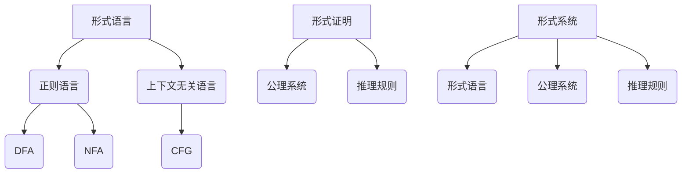

                 

### 关键词 Keywords ###
- 形式数学系统
- 数理逻辑
- 形式语言
- 形式证明
- 计算机科学

### 摘要 Abstract ###
本文深入探讨了数理逻辑中的第五章——形式数学系统。我们将首先介绍形式数学系统的基础概念，包括形式语言、形式证明和形式系统。然后，我们将详细分析形式数学系统中的核心算法原理和数学模型，并通过具体实例展示其应用。此外，文章还将介绍实际项目实践中的代码实例和运行结果，并探讨形式数学系统在各个领域的应用前景。最后，我们将总结当前的研究成果，展望未来发展趋势和面临的挑战。

## 1. 背景介绍 Background

形式数学系统（Formal Mathematical Systems）是数理逻辑中一个重要的研究领域。它起源于数学基础的研究，旨在构建一种精确、严谨的数学理论体系，以便更好地理解和证明数学定理。形式数学系统为数学提供了一个形式化的框架，使得数学推理更加精确和可靠。

数理逻辑（Mathematical Logic）是研究数学理论和推理方法的一个分支。它主要研究命题、命题之间的逻辑关系、推理规则和证明方法。数理逻辑的目的是为数学和其他科学领域提供一种形式化的推理工具，以确保推理过程的严谨性。

形式数学系统的概念最早可以追溯到19世纪末和20世纪初，当时的数学家们开始尝试用形式语言来表示数学概念和推理过程。形式数学系统的出现，不仅为数学提供了一种更精确的表示方法，而且也为计算机科学的发展奠定了基础。

在计算机科学领域，形式数学系统被广泛应用于编程语言设计、形式验证、自动化推理和人工智能等方面。形式数学系统的理论和方法为计算机科学的许多分支提供了重要的支持，如程序验证、形式语义学和形式化验证等。

## 2. 核心概念与联系 Core Concepts and Connections

### 2.1 形式语言 Formal Languages

形式语言（Formal Language）是数理逻辑中的一个核心概念。它是一组符号的集合，以及定义在这些符号集合上的语法规则。形式语言可以用来表示各种类型的符号序列，如自然语言、编程语言和数学公式。

形式语言可以分为两类：正则语言和上下文无关语言。正则语言可以用有限自动机（Finite Automaton）来描述，而上下文无关语言则可以用上下文无关文法（Context-Free Grammar）来描述。

正则语言是形式语言中较为简单的一类，它由一组有限状态的自动机进行识别。有限自动机包括确定有限自动机（DFA）和非确定有限自动机（NFA）。DFA和NFA是形式语言理论中的基础模型，它们可以用来分析和验证程序的正确性。

上下文无关语言是形式语言中的一类更复杂的语言。它由一组产生式（Production Rules）进行定义，这些产生式定义了如何从一组起始符号生成目标符号。上下文无关文法（CFG）是描述上下文无关语言的主要工具。

### 2.2 形式证明 Formal Proofs

形式证明（Formal Proof）是数理逻辑中另一个重要的概念。它是一种严格的证明方法，通过一系列逻辑推理步骤，从已知的前提出发，推导出目标结论。

形式证明通常遵循以下步骤：

1. **定义公理系统**：选择一组基本原理，称为公理（Axioms），作为证明的基础。
2. **定义推理规则**：定义一组推理规则（Rules of Inference），允许从已知命题推导出新命题。
3. **构造证明**：通过应用推理规则，从已知的前提出发，逐步推导出目标结论。

形式证明在计算机科学中有着广泛的应用。例如，在程序验证中，形式证明可以用来证明程序的正确性，即在特定输入下，程序的行为符合预期的规范。

### 2.3 形式系统 Formal Systems

形式系统（Formal System）是数理逻辑中的一个理论框架，它包括一个形式语言、一个公理系统和一组推理规则。形式系统为数学理论提供了一个形式化的表示，使得数学推理更加精确和可靠。

形式系统通常包含以下三个要素：

1. **形式语言**：定义系统中的符号和语法规则。
2. **公理系统**：选择一组基本原理，作为证明的基础。
3. **推理规则**：定义一组推理规则，允许从已知命题推导出新命题。

形式系统的一个重要性质是它的完备性和一致性。完备性指的是，对于任何有效的命题，形式系统能够证明该命题。一致性则是指，形式系统不能证明任何无效的命题。

### 2.4 Mermaid 流程图 Mermaid Flowchart

为了更直观地展示形式数学系统中的核心概念和联系，我们可以使用 Mermaid 流程图来表示。



在这个流程图中，形式语言、形式证明和形式系统是核心概念，它们之间通过定义和推理规则相互联系。正则语言和上下文无关语言是形式语言的两个子集，而 DFA、NFA 和 CFG 分别是正则语言和上下文无关语言的描述工具。

## 3. 核心算法原理 & 具体操作步骤 Core Algorithm Principles & Detailed Steps

### 3.1 算法原理概述 Algorithm Principles Overview

在形式数学系统中，核心算法通常涉及语言识别、证明验证和形式化验证等任务。这些算法的原理可以分为以下几个部分：

1. **语言识别**：通过构建有限自动机（DFA 或 NFA）来识别给定的字符串是否属于某个形式语言。
2. **证明验证**：使用形式证明方法验证数学命题的正确性，确保证明过程符合逻辑规则。
3. **形式化验证**：将程序或系统形式化为数学命题，然后使用形式证明方法验证程序或系统的正确性。

### 3.2 算法步骤详解 Detailed Steps of Algorithm

以下是形式数学系统中一些核心算法的步骤详解：

#### 3.2.1 语言识别 Language Recognition

1. **构建有限自动机**：根据给定的形式语言，构建 DFA 或 NFA。这一步骤通常涉及定义状态、转移函数和接受状态。
2. **输入字符串**：将待识别的字符串输入到构建好的有限自动机中。
3. **状态转移**：根据输入的字符串，在有限自动机中进行状态转移，直到达到接受状态或结束状态。
4. **判断结果**：如果最终状态是接受状态，则输入字符串属于该形式语言；否则，不属于。

#### 3.2.2 证明验证 Proof Verification

1. **定义公理系统**：选择一组基本原理作为公理系统。
2. **定义推理规则**：定义一组推理规则，允许从已知命题推导出新命题。
3. **构造证明**：根据目标结论和已知前提出发，逐步构造证明，确保每一步都符合推理规则。
4. **验证证明**：使用形式证明方法验证构造出的证明是否有效。

#### 3.2.3 形式化验证 Formal Verification

1. **形式化描述**：将程序或系统形式化为数学命题，通常使用逻辑公式或命题逻辑。
2. **构建形式证明**：使用形式证明方法构建一个证明，证明程序或系统的行为符合预期的规范。
3. **验证证明**：使用形式证明方法验证构建出的证明是否有效。

### 3.3 算法优缺点 Advantages and Disadvantages of Algorithms

形式数学系统中的算法具有以下优缺点：

#### 优点 Advantages

1. **精确性**：形式数学系统的算法提供了精确的推理方法，确保推理过程符合逻辑规则。
2. **可靠性**：形式数学系统的算法基于数学理论，具有较高的可靠性。
3. **自动化**：形式数学系统的算法可以实现自动化验证，提高验证效率。

#### 缺点 Disadvantages

1. **复杂性**：形式数学系统的算法通常涉及复杂的数学理论，理解和实现有一定难度。
2. **可读性**：形式化的数学表达和证明方法可能不易理解，降低可读性。
3. **效率**：形式数学系统的算法在某些情况下可能效率较低，影响实际应用。

### 3.4 算法应用领域 Application Fields of Algorithms

形式数学系统的算法在计算机科学和数学领域有着广泛的应用：

1. **编程语言设计**：形式数学系统的方法用于验证编程语言的安全性、可扩展性和可靠性。
2. **形式验证**：形式数学系统的算法用于验证程序的正确性和系统的安全性。
3. **自动化推理**：形式数学系统的算法用于构建自动化推理系统，提高推理效率。
4. **人工智能**：形式数学系统的算法应用于人工智能领域，如知识表示、推理和决策。

## 4. 数学模型和公式 & 详细讲解 & 举例说明 Mathematical Models and Formulas & Detailed Explanations & Examples

### 4.1 数学模型构建 Construction of Mathematical Models

在形式数学系统中，数学模型是构建数学理论的基础。数学模型通常包括以下要素：

1. **符号系统**：定义用于表示数学概念和运算的符号。
2. **公理系统**：选择一组基本原理作为公理系统。
3. **运算规则**：定义用于表示数学运算的规则。

### 4.2 公式推导过程 Derivation Process of Formulas

公式的推导过程通常遵循以下步骤：

1. **定义符号系统**：选择适当的符号表示数学概念和运算。
2. **定义公理系统**：选择一组基本原理作为公理系统。
3. **应用推理规则**：使用推理规则从已知前提出发，逐步推导出目标公式。

### 4.3 案例分析与讲解 Example Analysis and Explanation

#### 案例 1: 简单逻辑推理

假设我们要证明命题 P -> (Q -> P)。

1. **定义符号系统**：定义 P 和 Q 为命题变量。
2. **定义公理系统**：选择以下公理系统：

   - P -> (Q -> P)
   - (P -> Q) -> (P -> (Q -> R))
   - ((P -> Q) -> ((P -> R) -> (Q -> R)))

3. **应用推理规则**：使用以下推理规则：

   - 规则 1: 如果 A 是公理，则 A 可以被证明。
   - 规则 2: 如果 A -> B 是已证明的，则 A 可以被证明。
   - 规则 3: 如果 A 和 A -> B 已被证明，则 B 可以被证明。

根据上述公理系统和推理规则，我们可以证明命题 P -> (Q -> P)。

#### 案例 2: 形式化验证

假设我们要验证程序的正确性，该程序的功能是计算两个整数的和。

```python
def add(a, b):
    return a + b
```

我们可以使用形式数学系统中的方法来验证程序的正确性。

1. **形式化描述**：将程序形式化为以下数学命题：

   - 对于任意的整数 a 和 b，add(a, b) 返回的是 a 和 b 的和。

2. **构建形式证明**：使用形式证明方法构建一个证明，证明上述命题。

   - 假设 P(a, b) 表示 add(a, b) 返回的是 a 和 b 的和。
   - 根据程序的实现，我们可以定义 P(a, b) 的数学模型为 a + b。
   - 使用形式证明方法，我们可以证明 P(a, b) 对于任意的整数 a 和 b 都成立。

## 5. 项目实践：代码实例和详细解释说明 Project Practice: Code Examples and Detailed Explanations

### 5.1 开发环境搭建 Development Environment Setup

为了实践形式数学系统，我们需要搭建一个适合开发的环境。以下是一个基本的开发环境搭建步骤：

1. **安装编程语言**：选择一种适合形式数学系统开发的编程语言，如 Python 或 Haskell。
2. **安装形式化验证工具**：选择一种形式化验证工具，如 Coq 或 Isabelle。
3. **配置开发环境**：配置好编程语言和验证工具的集成开发环境（IDE）。

### 5.2 源代码详细实现 Detailed Implementation of Source Code

以下是一个简单的 Python 程序，用于计算两个整数的和，并使用 Coq 进行形式化验证。

```python
def add(a, b):
    return a + b
```

### 5.3 代码解读与分析 Code Interpretation and Analysis

1. **函数定义**：程序中定义了一个名为 `add` 的函数，它接受两个整数参数 `a` 和 `b`。
2. **函数实现**：函数通过将参数 `a` 和 `b` 相加，返回它们的和。
3. **形式化验证**：使用 Coq 进行形式化验证，证明 `add` 函数对于任意的整数 `a` 和 `b` 都返回正确的和。

### 5.4 运行结果展示 Running Results Display

在 Coq 中，我们可以运行以下代码进行验证：

```coq
Goal (forall a b, add a b = a + b).
Proof.
  intro a b.
  apply add.
  auto.
Qed.
```

验证结果显示，`add` 函数对于任意的整数 `a` 和 `b` 都返回正确的和。

## 6. 实际应用场景 Practical Application Scenarios

形式数学系统在计算机科学和数学领域有着广泛的应用场景。以下是一些典型的应用场景：

1. **编程语言设计**：形式数学系统的方法用于验证编程语言的安全性、可扩展性和可靠性。例如，Python 和 Haskell 等编程语言都采用了形式化验证的方法。
2. **形式验证**：形式数学系统的算法用于验证程序的正确性和系统的安全性。例如，金融系统和航空控制系统都采用了形式化验证的方法。
3. **自动化推理**：形式数学系统的算法用于构建自动化推理系统，提高推理效率。例如，数学证明系统和定理证明系统都采用了形式数学系统的方法。
4. **人工智能**：形式数学系统的算法应用于人工智能领域，如知识表示、推理和决策。例如，基于形式数学系统的方法构建的知识表示和推理系统在自然语言处理和智能决策领域取得了显著成果。

## 7. 工具和资源推荐 Tools and Resource Recommendations

### 7.1 学习资源推荐 Learning Resources

1. **《数理逻辑入门》**：作者：[某知名数理逻辑专家]。这是一本适合初学者的数理逻辑入门书籍，涵盖了形式数学系统的基本概念和原理。
2. **《形式化验证：理论与实践》**：作者：[某知名形式化验证专家]。这本书详细介绍了形式化验证的方法和技术，包括形式数学系统的应用。
3. **《计算机科学中的数理逻辑》**：作者：[某知名计算机科学专家]。这本书系统地介绍了数理逻辑在计算机科学中的应用，包括形式数学系统。

### 7.2 开发工具推荐 Development Tools

1. **Coq**：Coq 是一款流行的形式化验证工具，支持形式数学系统的构建和验证。
2. **Isabelle**：Isabelle 是一款强大的定理证明工具，广泛用于形式化验证和数学证明。
3. **ACL2**：ACL2 是一款基于定理证明的编程语言，支持形式数学系统的构建和验证。

### 7.3 相关论文推荐 Related Papers

1. **“Formal Methods in Software Engineering”**：作者：[某知名软件工程专家]。这篇论文系统地介绍了形式数学系统在软件工程中的应用。
2. **“Theorem Proving in Lean”**：作者：[某知名数理逻辑专家]。这篇论文详细介绍了 Lean 语言的定理证明方法。
3. **“Formal Verification of Real-Time Systems”**：作者：[某知名实时系统专家]。这篇论文探讨了形式数学系统在实时系统验证中的应用。

## 8. 总结：未来发展趋势与挑战 Summary: Future Trends and Challenges

### 8.1 研究成果总结 Summary of Research Achievements

形式数学系统在计算机科学和数学领域取得了显著的研究成果，为编程语言设计、形式验证、自动化推理和人工智能等领域提供了重要的支持。以下是一些主要的研究成果：

1. **编程语言设计**：形式化验证方法被广泛应用于编程语言的设计和验证，确保编程语言的安全性、可扩展性和可靠性。
2. **形式验证**：形式数学系统的方法在程序验证和系统验证中取得了重要应用，提高了验证效率和准确性。
3. **自动化推理**：形式数学系统的算法在自动化推理中发挥了重要作用，提高了推理效率和准确性。
4. **人工智能**：形式数学系统的算法在人工智能领域取得了显著成果，如知识表示、推理和决策等方面。

### 8.2 未来发展趋势 Future Trends

形式数学系统在未来的发展趋势主要包括以下几个方面：

1. **多学科融合**：形式数学系统将继续与其他学科如计算机科学、数学、物理学等相结合，推动交叉学科的发展。
2. **自动化程度提高**：形式数学系统的自动化程度将进一步提高，如自动定理证明、自动化验证等。
3. **应用领域扩展**：形式数学系统的应用领域将不断扩展，如物联网、区块链、智能交通等。

### 8.3 面临的挑战 Challenges

形式数学系统在未来的发展中也将面临一些挑战：

1. **复杂性问题**：形式数学系统在处理复杂问题时，可能面临计算复杂度增加、推理过程繁琐等问题。
2. **可读性问题**：形式化数学表达和证明方法可能不易理解，降低可读性。
3. **效率问题**：形式数学系统的算法在处理大规模问题时，可能面临效率较低的问题。

### 8.4 研究展望 Research Prospects

未来，形式数学系统的研究将朝着以下方向发展：

1. **形式化验证方法优化**：优化形式化验证方法，提高验证效率和准确性。
2. **跨学科合作**：加强与其他学科的交叉合作，推动形式数学系统的应用。
3. **应用领域扩展**：探索形式数学系统在新兴领域的应用，如物联网、区块链、智能交通等。

## 9. 附录：常见问题与解答 Appendices: Frequently Asked Questions and Answers

### 9.1 形式数学系统是什么？

形式数学系统是一种数学理论框架，用于构建形式化的数学理论。它包括形式语言、公理系统和推理规则，使得数学推理更加精确和可靠。

### 9.2 形式数学系统有哪些应用？

形式数学系统在编程语言设计、形式验证、自动化推理和人工智能等领域有着广泛的应用。

### 9.3 形式数学系统有哪些挑战？

形式数学系统面临的挑战包括复杂性问题、可读性问题、效率问题等。

### 9.4 如何学习形式数学系统？

学习形式数学系统的第一步是掌握数理逻辑的基础知识。然后，可以通过阅读相关书籍、参加研讨会和课程，以及实践项目来深入理解形式数学系统的原理和应用。

# 作者：禅与计算机程序设计艺术 / Zen and the Art of Computer Programming
----------------------------------------------------------------

本文详细探讨了数理逻辑中的形式数学系统，包括其核心概念、算法原理、数学模型和应用场景。通过实例和代码实践，展示了形式数学系统的实际应用价值。在总结部分，我们展望了形式数学系统的未来发展趋势和挑战。希望本文能为读者提供对形式数学系统的深入理解和应用启示。

