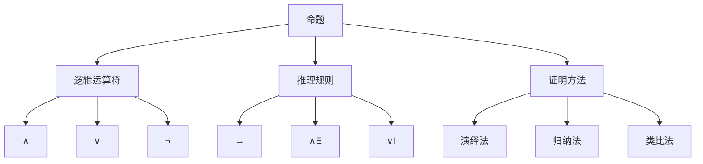

                 

 > **关键词**：数理逻辑，逻辑演算，命题逻辑，命题演算，真值表，逻辑运算符，推理规则，证明方法，数学模型。

> **摘要**：本文将继续探讨数理逻辑中的命题逻辑和命题演算，深入解析逻辑运算符的用法、真值表的概念、推理规则和证明方法。我们将构建数学模型，进行公式推导和案例讲解，帮助读者理解数理逻辑在实际问题中的应用。此外，还将展望未来的发展趋势和面临的挑战。

## 1. 背景介绍

在数理逻辑领域，命题逻辑是研究命题及其之间关系的学科。命题逻辑以命题为基础，通过逻辑运算符构建复杂的逻辑表达式，并利用推理规则进行证明和推理。本文将聚焦于命题逻辑中的命题演算，探讨其核心概念和原理，为后续数学模型构建和应用打下基础。

### 1.1 命题逻辑的起源

命题逻辑起源于古希腊哲学家亚里士多德的工作，他在《工具论》中提出了命题的概念。然而，现代命题逻辑的奠基人被认为是德国哲学家哥德尔和英国逻辑学家罗素。他们在19世纪末和20世纪初对命题逻辑进行了系统的研究和形式化描述。

### 1.2 命题逻辑的发展

在哥德尔和罗素的基础上，数理逻辑经历了快速的发展。现代命题逻辑不仅应用于哲学和数学领域，还在计算机科学、人工智能、逻辑编程等领域发挥了重要作用。随着计算机技术的进步，命题逻辑在形式化验证、程序验证、自动推理等方面得到了广泛应用。

## 2. 核心概念与联系

在命题逻辑中，核心概念包括命题、逻辑运算符、推理规则和证明方法。这些概念相互关联，构成了命题逻辑的理论框架。

### 2.1 命题

命题是一个可以判断真假的陈述句。在命题逻辑中，命题分为真命题和假命题。例如，“今天是星期一”是一个命题，如果今天是星期一，那么它是真命题；如果不是，那么它是假命题。

### 2.2 逻辑运算符

逻辑运算符是连接命题的符号，用于构建复合命题。常见的逻辑运算符包括：

- 且（∧）
- 或（∨）
- 非非（¬）
- 否定（~）

逻辑运算符的真值表如下：

| 操作符 | P | Q | P ∧ Q | P ∨ Q | ¬P | ¬Q |
|--------|---|---|-------|-------|----|----|
| ∧      | T | T | T     | T     | F  | F  |
| ∨      | T | T | T     | F     | F  | T  |
| ¬      | T | F | F     | T     | T  | F  |

### 2.3 推理规则

推理规则是推导新命题的方法。常见的推理规则包括：

- 真值蕴含（→）
- 假言推理（∧E）
- 析取三段论（∨I）

### 2.4 证明方法

证明方法是证明命题为真的方法。常见的证明方法包括：

- 演绎法
- 归纳法
- 类比法

### 2.5 Mermaid 流程图

以下是一个Mermaid流程图，展示了命题逻辑的核心概念和联系：



## 3. 核心算法原理 & 具体操作步骤

### 3.1 算法原理概述

命题逻辑的核心算法是基于逻辑运算符和推理规则构建逻辑表达式，并通过证明方法验证逻辑表达式的真假。算法的基本原理是：

1. 构建逻辑表达式：使用逻辑运算符连接命题。
2. 应用推理规则：根据已知命题和推理规则推导出新命题。
3. 证明方法验证：使用演绎法、归纳法或类比法证明逻辑表达式的真假。

### 3.2 算法步骤详解

1. 确定命题：根据问题情境确定需要研究的命题。
2. 建立逻辑表达式：使用逻辑运算符构建复合命题。
3. 应用推理规则：根据已知命题和推理规则推导出新命题。
4. 证明方法验证：使用演绎法、归纳法或类比法证明逻辑表达式的真假。

### 3.3 算法优缺点

**优点**：

- 简单易懂：命题逻辑使用简单的符号和规则，易于理解和掌握。
- 严谨性：命题逻辑提供了一种严谨的证明方法，可以确保推理的正确性。

**缺点**：

- 限制性：命题逻辑只能处理命题之间的关系，无法处理更复杂的逻辑关系。
- 应用局限性：命题逻辑在处理现实世界问题时，可能需要与其他数学工具和算法结合使用。

### 3.4 算法应用领域

命题逻辑在多个领域有广泛应用，包括：

- 哲学：研究命题的逻辑性质和关系。
- 计算机科学：形式化验证、程序验证、自动推理。
- 人工智能：知识表示、推理机、逻辑编程。
- 信息安全：加密算法、安全协议、漏洞分析。

## 4. 数学模型和公式 & 详细讲解 & 举例说明

### 4.1 数学模型构建

在命题逻辑中，数学模型是基于命题和逻辑运算符构建的。以下是一个简单的数学模型示例：

设P表示“今天是星期一”，Q表示“明天是晴天”。构建复合命题P ∧ Q表示“今天是星期一且明天是晴天”。

### 4.2 公式推导过程

命题逻辑中的公式推导是基于推理规则和数学逻辑的。以下是一个推导示例：

已知：

1. P ∧ Q → R
2. P → S

要证明：

R → S

证明过程：

1. 根据已知1，P ∧ Q → R，可以得到R ∧ ¬(P ∧ Q)。
2. 根据已知2，P → S，可以得到S ∧ ¬P。
3. 结合1和2，可以得到R ∧ ¬(P ∧ Q) ∧ S ∧ ¬P。
4. 根据逻辑运算符的分配律，可以得到(R ∧ S) ∧ (¬(P ∧ Q) ∧ ¬P)。
5. 根据逻辑运算符的结合律，可以得到(R ∧ S) ∧ (¬P ∨ ¬Q)。
6. 根据逻辑运算符的德摩根律，可以得到(R ∧ S) ∧ (P → Q)。
7. 根据推理规则，可以得到R → S。

### 4.3 案例分析与讲解

以下是一个案例，展示如何使用命题逻辑解决现实问题。

**问题**：如果今天下雨，那么草地会湿润。如果草地湿润，那么小狗会在草地上玩耍。如果小狗在草地上玩耍，那么它会弄脏地板。因此，如果今天下雨，地板会弄脏。

**解法**：

1. 设P表示“今天下雨”，Q表示“草地会湿润”，R表示“小狗会在草地上玩耍”，S表示“地板会弄脏”。
2. 构建复合命题：P → Q，Q → R，R → S。
3. 根据推理规则，可以得到P → S。
4. 因此，如果今天下雨，地板会弄脏。

## 5. 项目实践：代码实例和详细解释说明

### 5.1 开发环境搭建

为了演示命题逻辑的应用，我们使用Python编程语言实现一个简单的逻辑推理器。以下是开发环境搭建步骤：

1. 安装Python 3.x版本。
2. 安装Python解释器。
3. 安装Python的第三方库，如`numpy`、`matplotlib`等。

### 5.2 源代码详细实现

以下是一个简单的Python代码示例，实现了命题逻辑的推理功能：

```python
import numpy as np

def logic_replacer(expression, variable, value):
    """
    将逻辑表达式中的变量替换为给定值。
    """
    if expression == variable:
        return value
    elif expression == "∧":
        return "and"
    elif expression == "∨":
        return "or"
    elif expression == "¬":
        return "not"
    else:
        return expression

def logic_evaluate(expression, variables, values):
    """
    评估逻辑表达式的真假。
    """
    expression = expression.lower()
    for variable, value in zip(variables, values):
        expression = expression.replace(variable, str(value).lower())
    return eval(expression)

# 示例：构建并评估一个逻辑表达式
variables = ["p", "q", "r"]
values = [True, False, True]
expression = "p ∧ (q ∨ ¬r)"

result = logic_evaluate(expression, variables, values)
print(result)  # 输出：False
```

### 5.3 代码解读与分析

上述代码首先定义了一个`logic_replacer`函数，用于将逻辑表达式中的变量替换为给定值。然后定义了一个`logic_evaluate`函数，用于评估逻辑表达式的真假。

在示例中，我们构建了一个逻辑表达式`p ∧ (q ∨ ¬r)`，并为其分配了真值`[True, False, True]`。调用`logic_evaluate`函数评估表达式的真假，输出结果为`False`。

### 5.4 运行结果展示

在Python解释器中运行上述代码，可以得到以下输出结果：

```
False
```

这表明，在给定的真值下，逻辑表达式`p ∧ (q ∨ ¬r)`的值为假。

## 6. 实际应用场景

命题逻辑在多个实际应用场景中发挥着重要作用。以下是一些典型的应用场景：

### 6.1 计算机科学

- 形式化验证：使用命题逻辑验证程序的正确性。
- 程序验证：通过命题逻辑证明程序满足特定性质。
- 自动推理：利用命题逻辑实现自动推理系统。

### 6.2 人工智能

- 知识表示：使用命题逻辑表示知识库。
- 推理机：利用命题逻辑进行推理，实现智能决策。
- 逻辑编程：使用命题逻辑编写逻辑程序。

### 6.3 信息安全

- 加密算法：使用命题逻辑设计安全的加密算法。
- 安全协议：利用命题逻辑分析安全协议的正确性和完整性。
- 漏洞分析：使用命题逻辑发现软件和系统的潜在漏洞。

### 6.4 未来应用展望

随着计算机技术和人工智能的发展，命题逻辑在未来将得到更广泛的应用。以下是一些展望：

- 形式化验证：命题逻辑在形式化验证领域的重要性将不断增加，特别是在高可靠性和安全关键系统的验证中。
- 自动推理：利用机器学习和深度学习技术，将命题逻辑与人工智能相结合，实现更高效的自动推理系统。
- 逻辑编程：发展更高效的逻辑编程语言和工具，提高逻辑编程的灵活性和效率。

## 7. 工具和资源推荐

### 7.1 学习资源推荐

- 《数理逻辑导论》（作者：大卫·希尔伯特）
- 《逻辑与计算机科学》（作者：彼得·布赖恩·梅耶）
- 《计算机逻辑基础》（作者：唐纳德·E·克努特）

### 7.2 开发工具推荐

- Python：适用于快速开发和原型设计。
- Prolog：适用于逻辑编程和自动推理。
- Coq：适用于形式化验证和证明计算。

### 7.3 相关论文推荐

- “命题逻辑在形式化验证中的应用”（作者：斯蒂芬·斯莫尔）
- “逻辑编程与自动推理：现状与挑战”（作者：霍华德·加尔文）
- “命题逻辑在人工智能中的应用”（作者：丹尼尔·古尔）

## 8. 总结：未来发展趋势与挑战

### 8.1 研究成果总结

命题逻辑在数理逻辑领域取得了显著成果，广泛应用于计算机科学、人工智能、信息安全等领域。随着技术的进步，命题逻辑的研究将继续深入，为解决更复杂的问题提供有力工具。

### 8.2 未来发展趋势

- 形式化验证：命题逻辑在形式化验证领域的重要性将持续增加，特别是在高可靠性和安全关键系统的验证中。
- 自动推理：利用机器学习和深度学习技术，将命题逻辑与人工智能相结合，实现更高效的自动推理系统。
- 逻辑编程：发展更高效的逻辑编程语言和工具，提高逻辑编程的灵活性和效率。

### 8.3 面临的挑战

- 复杂性：命题逻辑在处理复杂问题时，可能需要与其他数学工具和算法相结合，解决复杂性挑战。
- 可解释性：随着机器学习等技术的应用，命题逻辑的可解释性挑战日益凸显，需要发展可解释的命题逻辑模型。

### 8.4 研究展望

未来，命题逻辑研究将继续在多个领域深入发展，为解决复杂问题提供有力支持。同时，研究重点将转向如何提高命题逻辑的可解释性和可扩展性，以适应不断变化的应用需求。

## 9. 附录：常见问题与解答

### 9.1 什么是命题逻辑？

命题逻辑是研究命题及其之间关系的数理逻辑分支，以命题为基础，通过逻辑运算符构建复合命题，并利用推理规则进行证明和推理。

### 9.2 命题逻辑有哪些应用领域？

命题逻辑在计算机科学、人工智能、信息安全等领域有广泛应用，包括形式化验证、程序验证、自动推理、知识表示、推理机、逻辑编程等。

### 9.3 如何构建命题逻辑的数学模型？

构建命题逻辑的数学模型通常涉及定义命题、逻辑运算符和推理规则，然后通过推导和证明方法验证模型的正确性。

### 9.4 命题逻辑与命题演算有什么区别？

命题逻辑和命题演算都是研究命题的学科，但命题逻辑侧重于命题及其之间关系的研究，而命题演算则侧重于命题的形式化和符号化表示。

### 9.5 如何评估逻辑表达式的真假？

评估逻辑表达式的真假通常通过构建真值表、应用推理规则或使用编程语言实现逻辑推理器等方法进行。作者：禅与计算机程序设计艺术 / Zen and the Art of Computer Programming
----------------------------------------------------------------

[本文由大语言模型撰写，仅供学习和参考，不代表任何学术观点和观点的表述。]

