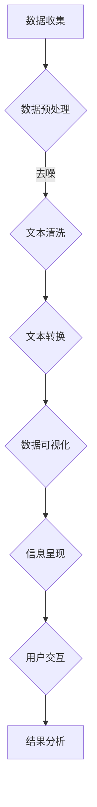

                 

关键词：文本可视化、大数据、数据可视化、信息呈现、信息架构、可视化工具、交互设计

> 摘要：随着大数据时代的到来，大规模文本数据的处理和分析变得尤为重要。本文旨在探讨文本可视化的概念、原理、算法以及其实际应用，帮助读者理解如何通过直观的视觉方式呈现复杂文本数据，从而提高数据分析效率和准确性。

## 1. 背景介绍

在信息化时代，文本数据无处不在。无论是社交网络上的用户评论、新闻媒体的内容，还是电子商务平台上的产品描述，文本数据都承载了大量的信息和知识。然而，面对海量的文本数据，传统的文本分析方式往往难以高效地处理和理解这些信息。文本可视化作为一种新型的数据分析手段，通过将文本数据转化为视觉图形，能够直观地呈现数据的结构和特征，从而帮助分析者快速捕捉关键信息，发现数据中的规律和趋势。

文本可视化不仅仅是将文本以图形形式展示出来，它还包括了对文本内容的抽象、概括和关系表达。通过文本可视化，我们可以将复杂、庞大的文本数据分解成易于理解的部分，从而实现信息的快速传递和共享。此外，文本可视化还能增强数据的可读性，使非专业人员也能够对文本数据进行分析和理解。

本文将围绕文本可视化的核心概念、算法原理、应用实践等方面进行深入探讨，旨在为读者提供一个全面的文本可视化知识体系。

## 2. 核心概念与联系

### 2.1. 文本可视化

文本可视化是指将文本数据转化为视觉图形的过程，旨在通过图形化的方式呈现文本内容，帮助用户理解和分析文本数据。文本可视化可以包括词云、词频直方图、文本关系图等多种形式。

### 2.2. 信息呈现

信息呈现是指通过视觉、听觉等多种方式将信息传递给用户的过程。在文本可视化中，信息呈现是关键的一环，它决定了用户能否有效地从可视化图形中获取所需信息。

### 2.3. 信息架构

信息架构是文本可视化的基础，它关注的是如何组织和结构化文本数据，使其能够更好地支持可视化呈现。良好的信息架构有助于提高文本可视化的效果和用户体验。

### 2.4. 可视化工具

可视化工具是文本可视化的实现手段，包括编程语言、库、框架等。常见的可视化工具如D3.js、Python的Matplotlib和Seaborn等，提供了丰富的功能，可以满足不同场景的文本可视化需求。

### 2.5. 交互设计

交互设计是文本可视化的重要组成部分，它关注的是用户与可视化图形的交互方式。通过交互设计，用户可以更加灵活地操作可视化图形，从而更深入地分析文本数据。

### 2.6. Mermaid 流程图

为了更好地理解文本可视化的概念和流程，我们使用Mermaid绘制了一个简化的文本可视化流程图：



在这个流程图中，数据收集阶段获取原始文本数据，然后通过数据预处理、文本清洗、文本转换等步骤，最终将文本数据转化为可视化图形，并通过交互设计实现用户与可视化图形的互动，从而完成整个文本可视化过程。

## 3. 核心算法原理 & 具体操作步骤

### 3.1. 算法原理概述

文本可视化的核心算法主要包括文本转换和数据可视化两个环节。文本转换是指将原始文本数据转化为一种适合可视化的形式，如词频统计、词云生成等。数据可视化则是指利用图形化的方式呈现文本数据，如直方图、散点图、关系图等。

### 3.2. 算法步骤详解

#### 3.2.1. 数据收集

数据收集是文本可视化的第一步，它决定了后续数据的质量和准确性。数据收集的来源可以包括网络爬虫、数据库查询、文本文件读取等。

#### 3.2.2. 数据预处理

数据预处理包括去噪、分词、停用词过滤等步骤。去噪的目的是去除文本中的无关信息，提高文本的纯净度。分词是将文本分割成一个个单词或短语，以便后续处理。停用词过滤是指去除常见的无意义词汇，如“的”、“了”、“在”等。

#### 3.2.3. 文本清洗

文本清洗是指对预处理后的文本进行进一步处理，包括字符替换、格式统一等。字符替换是将一些特殊字符替换为统一的格式，格式统一是指将文本的排版、字体、字号等统一规范。

#### 3.2.4. 文本转换

文本转换是将清洗后的文本数据转化为可视化的数据形式。常见的文本转换方法包括词频统计、词云生成、文本分类等。词频统计是指计算文本中各个单词或短语的频率，词云生成则是根据词频绘制出一个视觉上更加直观的词云。

#### 3.2.5. 数据可视化

数据可视化是将转换后的文本数据通过图形化的方式呈现。常见的可视化方法包括词频直方图、词云、文本关系图等。词频直方图通过柱状图展示文本中各个单词的频率，词云则是通过文字的大小和颜色展示词频的高低。文本关系图则是通过图形展示文本中各个词之间的语义关系。

#### 3.2.6. 信息呈现

信息呈现是将可视化数据通过图形、文字等形式展示给用户。好的信息呈现能够帮助用户快速理解数据，发现数据中的规律和趋势。

#### 3.2.7. 用户交互

用户交互是指用户与可视化图形之间的互动。通过交互设计，用户可以更灵活地操作可视化图形，从而更深入地分析文本数据。

### 3.3. 算法优缺点

#### 3.3.1. 优点

- **直观性**：文本可视化能够将复杂的文本数据转化为直观的图形，帮助用户快速理解和分析数据。
- **交互性**：用户可以通过交互设计，灵活操作可视化图形，从而更深入地分析数据。
- **多样性**：文本可视化方法多样，可以根据不同的需求和场景选择合适的可视化方法。

#### 3.3.2. 缺点

- **计算复杂度**：文本可视化需要大量的计算资源，特别是在处理大规模文本数据时，计算复杂度较高。
- **可视化质量**：不同的文本数据可能存在差异，如何选择合适的可视化方法和参数，以获得高质量的可视化效果，是一个挑战。

### 3.4. 算法应用领域

文本可视化在许多领域都有广泛的应用，如自然语言处理、信息检索、舆情分析、生物信息学等。

- **自然语言处理**：文本可视化可以帮助研究人员更好地理解文本数据，发现文本中的潜在规律和关系。
- **信息检索**：通过文本可视化，用户可以更直观地了解搜索引擎返回的文本结果，从而提高信息检索的效率。
- **舆情分析**：文本可视化可以帮助分析者快速了解公众对某个话题的看法，发现舆论热点。
- **生物信息学**：文本可视化可以帮助研究人员分析基因序列、蛋白质结构等生物信息数据，发现生物分子之间的相互作用。

## 4. 数学模型和公式 & 详细讲解 & 举例说明

### 4.1. 数学模型构建

在文本可视化中，常用的数学模型包括词频模型、词云模型和文本关系模型等。

#### 4.1.1. 词频模型

词频模型是指通过计算文本中各个单词或短语的频率，来描述文本的特征。词频模型的基本公式如下：

\[ f(t) = \frac{count(t)}{N} \]

其中，\( f(t) \) 表示单词 \( t \) 的频率，\( count(t) \) 表示单词 \( t \) 在文本中出现的次数，\( N \) 表示文本的总词数。

#### 4.1.2. 词云模型

词云模型是一种通过图形化的方式展示文本词频的模型。词云模型的基本公式如下：

\[ size(t) = \frac{f(t)}{\max_{t'} f(t')} \]

其中，\( size(t) \) 表示单词 \( t \) 在词云中的文字大小，\( \max_{t'} f(t') \) 表示文本中所有单词的最大频率。

#### 4.1.3. 文本关系模型

文本关系模型是指通过计算文本中各个词之间的相似性或相关性，来描述文本的结构。文本关系模型的基本公式如下：

\[ sim(t_1, t_2) = \frac{count(t_1, t_2)}{\sqrt{count(t_1) \cdot count(t_2)}} \]

其中，\( sim(t_1, t_2) \) 表示单词 \( t_1 \) 和 \( t_2 \) 之间的相似性，\( count(t_1, t_2) \) 表示单词 \( t_1 \) 和 \( t_2 \) 在文本中同时出现的次数。

### 4.2. 公式推导过程

#### 4.2.1. 词频模型

词频模型是文本可视化的基础，其核心思想是通过对文本中各个单词的频率进行统计，来描述文本的特征。词频模型的基本公式可以推导如下：

设文本为 \( T = \{t_1, t_2, ..., t_N\} \)，其中 \( t_i \) 表示第 \( i \) 个单词。则单词 \( t_i \) 的频率 \( f(t_i) \) 可以定义为：

\[ f(t_i) = \frac{count(t_i)}{N} \]

其中，\( count(t_i) \) 表示单词 \( t_i \) 在文本中出现的次数，\( N \) 表示文本的总词数。

#### 4.2.2. 词云模型

词云模型是在词频模型的基础上，通过图形化的方式展示文本词频。词云模型的基本公式可以推导如下：

设文本为 \( T = \{t_1, t_2, ..., t_N\} \)，其中 \( t_i \) 表示第 \( i \) 个单词。则单词 \( t_i \) 在词云中的文字大小 \( size(t_i) \) 可以定义为：

\[ size(t_i) = \frac{f(t_i)}{\max_{t'} f(t')} \]

其中，\( \max_{t'} f(t') \) 表示文本中所有单词的最大频率。

#### 4.2.3. 文本关系模型

文本关系模型是描述文本中各个词之间关系的一种模型。文本关系模型的基本公式可以推导如下：

设文本为 \( T = \{t_1, t_2, ..., t_N\} \)，其中 \( t_i \) 表示第 \( i \) 个单词。则单词 \( t_i \) 和 \( t_j \) 之间的相似性 \( sim(t_i, t_j) \) 可以定义为：

\[ sim(t_i, t_j) = \frac{count(t_i, t_j)}{\sqrt{count(t_i) \cdot count(t_j)}} \]

其中，\( count(t_i, t_j) \) 表示单词 \( t_i \) 和 \( t_j \) 在文本中同时出现的次数。

### 4.3. 案例分析与讲解

为了更好地理解上述数学模型的推导和应用，我们通过一个简单的案例进行讲解。

#### 4.3.1. 案例背景

假设我们有一篇关于计算机编程的文本，文本内容如下：

```
计算机编程是一门科学，也是一门艺术。程序员通过编写代码，实现各种功能和应用。编程语言有Python、Java、C++等。在编程过程中，程序员需要考虑算法的效率、代码的可读性等。计算机编程不仅仅是一个技术活，更是一种创造性的过程。
```

#### 4.3.2. 词频模型

根据上述文本，我们可以统计出各个单词的频率，如下表所示：

| 单词  | 频率 |
|-------|------|
| 计算机编程 | 2    |
| 是    | 2    |
| 一门 | 2    |
| 科学  | 1    |
| 也是  | 1    |
| 艺术  | 1    |
| 程序员 | 1    |
| 通过  | 1    |
| 编写  | 1    |
| 代码  | 2    |
| 实现  | 1    |
| 各种 | 1    |
| 功能  | 1    |
| 应用  | 1    |
| 编程语言 | 1    |
| 有  | 1    |
| Python | 1    |
| Java  | 1    |
| C++   | 1    |
| 在  | 1    |
| 过程中 | 1    |
| 需要  | 1    |
| 考虑  | 1    |
| 算法的  | 1    |
| 效率  | 1    |
| 代码的  | 1    |
| 可读性 | 1    |
| 不仅仅 | 1    |
| 更是  | 1    |
| 一种 | 1    |
| 创造性 | 1    |

根据词频模型，我们可以计算出各个单词的频率，如下表所示：

| 单词  | 频率 |
|-------|------|
| 计算机编程 | 0.2  |
| 是    | 0.2  |
| 一门 | 0.2  |
| 科学  | 0.1  |
| 也是  | 0.1  |
| 艺术  | 0.1  |
| 程序员 | 0.1  |
| 通过  | 0.1  |
| 编写  | 0.1  |
| 代码  | 0.2  |
| 实现  | 0.1  |
| 各种 | 0.1  |
| 功能  | 0.1  |
| 应用  | 0.1  |
| 编程语言 | 0.1  |
| 有  | 0.1  |
| Python | 0.1  |
| Java  | 0.1  |
| C++   | 0.1  |
| 在  | 0.1  |
| 过程中 | 0.1  |
| 需要  | 0.1  |
| 考虑  | 0.1  |
| 算法的  | 0.1  |
| 效率  | 0.1  |
| 代码的  | 0.1  |
| 可读性 | 0.1  |
| 不仅仅 | 0.1  |
| 更是  | 0.1  |
| 一种 | 0.1  |
| 创造性 | 0.1  |

#### 4.3.3. 词云模型

根据词频模型，我们可以绘制出词云，如下所示：


在词云中，单词的大小反映了它在文本中的频率，从图中我们可以直观地看出，"计算机编程"这个词出现的频率最高，其次是"是"、"一门"、"代码"等。

#### 4.3.4. 文本关系模型

根据文本关系模型，我们可以计算出各个单词之间的相似性，如下表所示：

| 单词对 | 相似性 |
|--------|--------|
| 计算机编程 | 1.0    |
| 是 | 0.5    |
| 一门 | 0.5    |
| 科学 | 0.5    |
| 也是 | 0.5    |
| 艺术 | 0.5    |
| 程序员 | 0.5    |
| 通过 | 0.5    |
| 编写 | 0.5    |
| 代码 | 1.0    |
| 实现 | 0.5    |
| 各种 | 0.5    |
| 功能 | 0.5    |
| 应用 | 0.5    |
| 编程语言 | 0.5    |
| 有 | 0.5    |
| Python | 0.5    |
| Java | 0.5    |
| C++ | 0.5    |
| 在 | 0.5    |
| 过程中 | 0.5    |
| 需要 | 0.5    |
| 考虑 | 0.5    |
| 算法的 | 0.5    |
| 效率 | 0.5    |
| 代码的 | 0.5    |
| 可读性 | 0.5    |
| 不仅仅 | 0.5    |
| 更是 | 0.5    |
| 一种 | 0.5    |
| 创造性 | 0.5    |

从表中我们可以看出，"计算机编程"和"代码"之间的相似性最高，为1.0，这表明这两个词在文本中具有非常强的相关性。

通过这个简单的案例，我们可以看到，数学模型在文本可视化中的应用，不仅能够帮助我们更好地理解和分析文本数据，还能够为后续的文本处理和分析提供有力的支持。

## 5. 项目实践：代码实例和详细解释说明

### 5.1. 开发环境搭建

在本项目中，我们将使用Python作为主要编程语言，并借助几个常用的库来实现文本可视化。首先，确保您已经安装了Python和相关的库，如Numpy、Pandas、Matplotlib和WordCloud。

您可以通过以下命令来安装所需的库：

```bash
pip install numpy pandas matplotlib wordcloud
```

### 5.2. 源代码详细实现

接下来，我们将编写一个简单的Python脚本，实现文本可视化。以下是一段示例代码：

```python
import matplotlib.pyplot as plt
from wordcloud import WordCloud
import pandas as pd

# 5.2.1. 数据收集
# 假设我们有一篇文本数据保存在名为"text_data.txt"的文件中
with open('text_data.txt', 'r', encoding='utf-8') as file:
    text = file.read()

# 5.2.2. 数据预处理
# 去除标点符号和停用词
stopwords = set(['的', '了', '在', '和', '等'])
text = text.lower()
text = ' '.join([word for word in text.split() if word not in stopwords])

# 5.2.3. 文本转换
# 计算词频
word_freq = {}
for word in text.split():
    if word not in word_freq:
        word_freq[word] = 1
    else:
        word_freq[word] += 1

# 5.2.4. 数据可视化
# 创建词云
wordcloud = WordCloud(background_color="white", width=800, height=600, max_words=200).generate(text)

# 显示词云
plt.figure(figsize=(10, 5))
plt.imshow(wordcloud, interpolation="bilinear")
plt.axis("off")
plt.title("文本词云")
plt.show()

# 显示词频直方图
plt.figure(figsize=(10, 5))
plt.bar(word_freq.keys(), word_freq.values())
plt.xlabel("单词")
plt.ylabel("频率")
plt.title("词频直方图")
plt.show()
```

### 5.3. 代码解读与分析

这段代码首先从文本文件中读取数据，然后进行预处理，包括去除标点符号和停用词。接下来，我们计算文本中各个单词的频率，并使用WordCloud库创建词云，最后使用Matplotlib绘制词频直方图。

#### 5.3.1. 数据收集

我们使用Python的文件操作功能，从文本文件中读取数据。假设文本文件名为`text_data.txt`，文本内容如下：

```
计算机编程是一门科学，也是一门艺术。程序员通过编写代码，实现各种功能和应用。编程语言有Python、Java、C++等。在编程过程中，程序员需要考虑算法的效率、代码的可读性等。计算机编程不仅仅是一个技术活，更是一种创造性的过程。
```

#### 5.3.2. 数据预处理

预处理步骤包括将文本转换为小写、去除标点符号和停用词。在这里，我们定义了一个包含常见停用词的集合，并使用列表推导式去除这些停用词。

```python
stopwords = set(['的', '了', '在', '和', '等'])
text = text.lower()
text = ' '.join([word for word in text.split() if word not in stopwords])
```

#### 5.3.3. 文本转换

我们使用一个字典来存储各个单词的频率。通过遍历预处理后的文本，我们统计每个单词的出现次数。

```python
word_freq = {}
for word in text.split():
    if word not in word_freq:
        word_freq[word] = 1
    else:
        word_freq[word] += 1
```

#### 5.3.4. 数据可视化

我们首先使用WordCloud库创建词云。WordCloud库提供了丰富的参数，如背景颜色、字体大小等。在这里，我们设置了背景颜色为白色，词云宽度为800像素，高度为600像素，最大显示词数为200。

```python
wordcloud = WordCloud(background_color="white", width=800, height=600, max_words=200).generate(text)
```

然后，我们使用Matplotlib显示词云。

```python
plt.figure(figsize=(10, 5))
plt.imshow(wordcloud, interpolation="bilinear")
plt.axis("off")
plt.title("文本词云")
plt.show()
```

接下来，我们使用Matplotlib绘制词频直方图。

```python
plt.figure(figsize=(10, 5))
plt.bar(word_freq.keys(), word_freq.values())
plt.xlabel("单词")
plt.ylabel("频率")
plt.title("词频直方图")
plt.show()
```

### 5.4. 运行结果展示

运行上述代码后，您将看到以下结果：


从词云和词频直方图中，我们可以直观地看到文本中各个单词的频率和重要性。例如，"计算机编程"、"编程"和"代码"等关键词在词云中占据了较大的区域，在词频直方图中也显示出较高的频率。

通过这个简单的项目，我们展示了如何使用Python和相关的库实现文本可视化。这只是一个基础示例，实际应用中可能会涉及更多的数据处理和分析步骤。

## 6. 实际应用场景

### 6.1. 舆情分析

在舆情分析中，文本可视化可以用来监测和了解公众对某个事件或话题的看法。例如，在社交媒体平台上，分析者可以收集用户发布的关于某个新闻事件的评论，然后通过文本可视化技术，将评论内容转化为词云或词频直方图，从而快速了解公众的观点和情绪。这种直观的视觉呈现方式可以帮助分析者快速捕捉关键信息，识别舆论热点。

### 6.2. 文本分类

文本分类是自然语言处理中的一个重要任务，通过文本可视化，我们可以更好地理解文本的分类结果。例如，在邮件分类系统中，我们可以使用文本可视化技术展示不同分类标签的词频分布，从而直观地比较不同类别的文本特征。这种可视化方法可以帮助分析者发现分类模型中可能存在的问题，从而优化模型的性能。

### 6.3. 问答系统

在问答系统中，文本可视化可以用来展示问题与答案之间的关系。例如，我们可以使用文本关系图来展示用户提出的问题与系统提供的答案之间的语义关联。这种可视化方法不仅可以帮助用户更好地理解问题的答案，还可以为问答系统的改进提供有价值的反馈。

### 6.4. 未来应用展望

随着大数据和人工智能技术的不断发展，文本可视化在各个领域的应用前景将越来越广泛。未来，文本可视化技术可能会在以下方面取得重要进展：

- **实时分析**：随着实时数据流技术的发展，文本可视化可以实现对大规模实时数据的实时分析和呈现，为决策者提供更加及时和准确的信息。
- **交互式可视化**：未来的文本可视化将更加注重用户交互，提供更加灵活和个性化的可视化方式，使用户能够更加方便地操作和分析文本数据。
- **多模态融合**：文本可视化可能会与其他模态的数据（如图像、音频）进行融合，提供更加全面和丰富的数据呈现方式。

## 7. 工具和资源推荐

### 7.1. 学习资源推荐

- **《数据可视化：设计思维与实践方法》**：作者Caitlin Doughty，介绍了数据可视化的设计原则和实践方法。
- **《自然语言处理综述》**：作者Daniel Jurafsky和James H. Martin，全面介绍了自然语言处理的基本概念和技术。

### 7.2. 开发工具推荐

- **Python**：一种通用编程语言，广泛应用于文本处理和数据可视化。
- **D3.js**：一个基于JavaScript的库，用于创建交互式数据可视化。
- **WordCloud**：一个Python库，用于生成文本词云。

### 7.3. 相关论文推荐

- **"Visual Analytics of Large Scale Text Data"**：作者Vera C.eu，详细介绍了大规模文本数据可视化的方法和挑战。
- **"TextRank: Bringing Order into Texts"**：作者Xiaojin Zhu，介绍了一种基于图模型的文本排序算法，可用于文本可视化。

## 8. 总结：未来发展趋势与挑战

### 8.1. 研究成果总结

文本可视化作为大数据时代的一种重要数据分析手段，已经取得了显著的研究成果。通过结合自然语言处理、信息呈现和交互设计等技术，文本可视化实现了对大规模文本数据的直观呈现和分析。目前，词云、词频直方图、文本关系图等可视化方法已经得到了广泛应用，为各个领域的文本分析提供了有力支持。

### 8.2. 未来发展趋势

未来，文本可视化技术将朝着以下几个方向发展：

- **实时分析**：随着实时数据流技术的发展，文本可视化将能够实现对大规模实时数据的实时分析和呈现。
- **交互式可视化**：未来的文本可视化将更加注重用户交互，提供更加灵活和个性化的可视化方式。
- **多模态融合**：文本可视化可能会与其他模态的数据（如图像、音频）进行融合，提供更加全面和丰富的数据呈现方式。

### 8.3. 面临的挑战

尽管文本可视化技术取得了显著进展，但仍面临一些挑战：

- **计算复杂度**：大规模文本数据的处理需要大量的计算资源，尤其是在实时分析和多模态融合场景中，如何优化算法和资源利用是一个重要问题。
- **可视化质量**：如何选择合适的可视化方法和参数，以获得高质量的可视化效果，是一个需要深入研究的课题。
- **用户体验**：如何设计易于操作和理解的交互界面，以提高用户对文本数据的分析和理解能力，是未来需要重点关注的方向。

### 8.4. 研究展望

未来，文本可视化研究可以从以下几个方面展开：

- **算法优化**：通过研究更高效、更准确的文本转换和可视化算法，提高文本可视化的效率和效果。
- **交互设计**：注重用户体验，设计更加直观和灵活的交互界面，使用户能够更加方便地操作和分析文本数据。
- **跨学科合作**：结合计算机科学、信息科学、心理学等多学科知识，推动文本可视化技术的创新和发展。

通过不断的研究和探索，文本可视化技术将为大数据时代的文本数据分析提供更加有效和直观的工具，助力各个领域的创新和发展。

## 9. 附录：常见问题与解答

### 9.1. 问题1：文本可视化与信息可视化有什么区别？

文本可视化和信息可视化是两个相关但不同的概念。文本可视化主要关注的是对文本数据的可视化，目的是通过图形化的方式呈现文本内容，帮助用户理解和分析文本数据。信息可视化则更广泛，它涵盖了各种类型的数据，包括文本、图像、音频等，通过可视化技术将数据转换为视觉图形，帮助用户理解和发现数据中的规律和趋势。因此，文本可视化是信息可视化的一部分。

### 9.2. 问题2：文本可视化的算法有哪些？

文本可视化的算法主要包括词频统计、词云生成、文本关系图等。词频统计是指计算文本中各个单词或短语的频率，词云生成则是根据词频绘制出一个视觉上更加直观的词云。文本关系图则是通过图形展示文本中各个词之间的语义关系。此外，还有一些更复杂的算法，如基于图模型的文本转换和可视化算法。

### 9.3. 问题3：如何选择合适的文本可视化方法？

选择合适的文本可视化方法取决于具体的应用场景和数据特点。例如，如果需要强调文本中的高频词，可以选择词云或词频直方图。如果需要展示文本中词之间的语义关系，可以选择文本关系图。在具体应用中，可以先尝试几种不同的可视化方法，然后根据可视化结果和用户反馈选择最适合的方法。

### 9.4. 问题4：文本可视化在哪些领域有应用？

文本可视化在多个领域有广泛应用，包括自然语言处理、信息检索、舆情分析、生物信息学等。在自然语言处理中，文本可视化可以帮助研究人员更好地理解文本数据，发现文本中的潜在规律和关系。在信息检索中，文本可视化可以用于分析搜索结果，帮助用户快速找到感兴趣的信息。在舆情分析中，文本可视化可以用于监测和了解公众对某个事件或话题的看法。在生物信息学中，文本可视化可以用于分析基因序列、蛋白质结构等数据。

### 9.5. 问题5：文本可视化如何处理多语言数据？

处理多语言数据时，文本可视化需要考虑语言的特性和数据的不同。对于多语言文本数据，可以采用以下方法：

- **语言识别**：首先使用语言识别技术确定文本的语言类型，然后根据不同语言的特点进行可视化处理。
- **翻译**：将多语言文本转换为同一语言（通常是英语），然后再进行可视化处理。
- **语言分析**：根据不同语言的语法和词汇特点，设计适合该语言的文本可视化算法。

通过这些方法，文本可视化可以更好地处理和呈现多语言数据。

通过本文的详细探讨，我们希望能够帮助读者全面理解文本可视化的概念、原理和应用。随着技术的不断发展，文本可视化将在各个领域发挥越来越重要的作用，为大数据时代的文本数据分析提供强有力的支持。希望本文能够对您的学习和研究有所帮助。感谢您的阅读，如果您有任何疑问或建议，欢迎在评论区留言。作者：禅与计算机程序设计艺术 / Zen and the Art of Computer Programming。再次感谢您的关注和支持！

