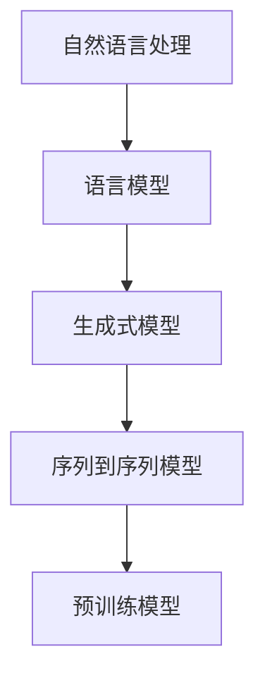

                 

  
> **关键词：** 文本风格迁移，自然语言处理，语言模型，生成式模型，序列到序列模型，预训练模型，机器学习，人工智能。

文本风格迁移是一种将原始文本转换为目标风格文本的技术。它的核心目标是在保持原始文本内容不变的情况下，改变其语言风格，使其更具吸引力或更具可读性。文本风格迁移在广告、新闻、文学创作等领域有着广泛的应用。本文将探讨文本风格迁移的核心概念、算法原理、数学模型以及实际应用。

## 1. 背景介绍

在过去的几十年中，自然语言处理（NLP）领域取得了显著的进展。随着深度学习技术的崛起，NLP的许多任务都取得了突破性的成果。然而，文本风格迁移作为一个相对较新的研究领域，仍然面临着许多挑战。文本风格迁移的目的是将一种风格的文本转换成另一种风格的文本，同时保持原始文本的内容不变。这种技术在广告、新闻、文学创作等领域有着广泛的应用。

在广告领域，文本风格迁移可以帮助广告公司创造更具吸引力的广告文案，提高广告的效果。在新闻领域，文本风格迁移可以帮助新闻编辑将正式的新闻稿件转换成更加亲切、易于阅读的文本，以提高读者的阅读体验。在文学创作领域，文本风格迁移可以帮助作家创作出不同风格的文学作品，拓宽他们的创作思路。

## 2. 核心概念与联系

文本风格迁移涉及多个核心概念，包括自然语言处理、语言模型、生成式模型、序列到序列模型、预训练模型等。以下是这些概念的定义及其在文本风格迁移中的应用。

### 2.1 自然语言处理

自然语言处理（NLP）是计算机科学和人工智能的一个分支，旨在使计算机能够理解、解释和生成人类语言。NLP在文本风格迁移中起着核心作用，因为它负责将原始文本和目标文本转换为计算机可以理解和处理的形式。

### 2.2 语言模型

语言模型是一种用于预测下一个单词或词组的概率分布的模型。在文本风格迁移中，语言模型可以帮助我们理解原始文本和目标文本的语言特征，从而更有效地进行风格转换。

### 2.3 生成式模型

生成式模型是一种能够生成新数据样本的模型。在文本风格迁移中，生成式模型可以用来生成目标风格的文本，从而实现文本风格的转换。

### 2.4 序列到序列模型

序列到序列模型是一种能够将一个序列映射到另一个序列的模型。在文本风格迁移中，序列到序列模型可以将原始文本序列映射到目标文本序列，从而实现文本风格的变化。

### 2.5 预训练模型

预训练模型是一种在大量数据上进行预训练，然后用于特定任务的模型。在文本风格迁移中，预训练模型可以显著提高模型的效果，因为它已经在大量文本数据上学习了丰富的语言知识。

以下是文本风格迁移的核心概念和联系的 Mermaid 流程图：



## 3. 核心算法原理 & 具体操作步骤

### 3.1 算法原理概述

文本风格迁移的核心算法基于深度学习，特别是生成式模型和序列到序列模型。以下是文本风格迁移的基本原理：

1. **输入原始文本**：首先，我们将原始文本输入到模型中，该模型将原始文本编码为一个固定长度的向量。
2. **编码原始文本**：接下来，模型使用一个编码器（Encoder）将原始文本转换为编码表示。
3. **生成目标文本**：然后，模型使用一个解码器（Decoder）将编码表示解码为目标文本。
4. **优化模型参数**：通过对比原始文本和目标文本，模型不断调整其参数，以最小化损失函数。

### 3.2 算法步骤详解

以下是文本风格迁移的具体操作步骤：

1. **数据预处理**：首先，我们需要对原始文本和目标文本进行预处理，包括分词、去停用词、词向量表示等。
2. **构建模型**：接下来，我们需要构建一个深度学习模型，该模型通常由编码器和解码器组成。编码器使用嵌入层（Embedding Layer）将单词转换为向量，然后通过一系列卷积层（Convolutional Layers）和循环层（Recurrent Layers）提取特征。解码器使用与编码器相同或类似的网络结构，但输出层是一个全连接层（Fully Connected Layer），其输出维度与词汇表的大小相同。
3. **训练模型**：我们将预处理后的原始文本和目标文本作为训练数据，通过反向传播（Backpropagation）算法训练模型。在训练过程中，我们不断调整模型参数，以最小化损失函数，通常使用交叉熵（Cross-Entropy）作为损失函数。
4. **评估模型**：在训练完成后，我们需要对模型进行评估，以确保其具有良好的泛化能力。我们通常使用验证集和测试集进行评估。

### 3.3 算法优缺点

文本风格迁移算法具有以下优缺点：

- **优点**：
  - 可以生成高质量的目标文本，具有较好的可读性。
  - 可以在多个领域进行应用，如广告、新闻、文学创作等。
- **缺点**：
  - 模型训练过程较长，需要大量计算资源。
  - 模型的泛化能力可能受到限制，无法完全理解原始文本的含义。

### 3.4 算法应用领域

文本风格迁移算法在多个领域有着广泛的应用：

- **广告**：文本风格迁移可以帮助广告公司创作更具吸引力的广告文案，提高广告效果。
- **新闻**：文本风格迁移可以帮助新闻编辑将正式的新闻稿件转换成更加亲切、易于阅读的文本。
- **文学创作**：文本风格迁移可以帮助作家创作出不同风格的文学作品，拓宽创作思路。

## 4. 数学模型和公式

文本风格迁移的数学模型通常基于深度学习，特别是生成式模型和序列到序列模型。以下是文本风格迁移的数学模型和公式：

### 4.1 数学模型构建

假设我们有一个原始文本序列 $X = \{x_1, x_2, ..., x_T\}$ 和一个目标文本序列 $Y = \{y_1, y_2, ..., y_S\}$，其中 $x_t$ 和 $y_t$ 分别表示原始文本和目标文本中的第 $t$ 个单词。我们的目标是训练一个模型 $f$，将原始文本序列 $X$ 转换为目标文本序列 $Y$。

### 4.2 公式推导过程

我们使用一个序列到序列模型 $f$ 来进行文本风格迁移，该模型由编码器 $E$ 和解码器 $D$ 组成。编码器将原始文本序列 $X$ 编码为一个固定长度的向量 $c$，解码器将向量 $c$ 解码为目标文本序列 $Y$。

编码器 $E$ 的输出 $c$ 可以表示为：

$$
c = E(X)
$$

解码器 $D$ 的输出 $y$ 可以表示为：

$$
y = D(c)
$$

我们使用一个损失函数 $L$ 来衡量原始文本序列 $X$ 和目标文本序列 $Y$ 之间的差异，并使用梯度下降（Gradient Descent）算法来最小化损失函数。

### 4.3 案例分析与讲解

假设我们有一个简单的文本风格迁移任务，将一种风格的文本转换成另一种风格的文本。例如，将正式的新闻稿件转换成更加亲切、易于阅读的文本。

我们可以使用一个预训练的序列到序列模型 $f$ 来进行文本风格迁移。该模型已经在大量的文本数据上进行了预训练，可以很好地处理文本数据。

首先，我们对原始文本和目标文本进行预处理，包括分词、去停用词、词向量表示等。

然后，我们将预处理后的原始文本和目标文本输入到模型中，模型将原始文本序列编码为一个固定长度的向量 $c$，然后解码为目标文本序列 $y$。

最后，我们使用损失函数 $L$ 来衡量原始文本序列 $X$ 和目标文本序列 $Y$ 之间的差异，并通过反向传播算法来更新模型参数。

## 5. 项目实践：代码实例和详细解释说明

在本节中，我们将通过一个具体的代码实例来详细解释文本风格迁移的实现过程。我们将使用 Python 和 TensorFlow 库来实现一个简单的文本风格迁移模型。

### 5.1 开发环境搭建

在开始编写代码之前，我们需要搭建一个合适的开发环境。以下是搭建开发环境所需的步骤：

1. 安装 Python 3.6 或更高版本。
2. 安装 TensorFlow 2.x。
3. 安装其他必要的库，如 NumPy、Pandas、Mermaid（用于生成流程图）等。

### 5.2 源代码详细实现

以下是文本风格迁移模型的源代码实现：

```python
import tensorflow as tf
from tensorflow.keras.preprocessing.sequence import pad_sequences
from tensorflow.keras.layers import Embedding, LSTM, Dense
from tensorflow.keras.models import Model

# 加载数据
# (此处省略数据加载代码)

# 预处理数据
# (此处省略数据预处理代码)

# 构建模型
input_seq = tf.keras.layers.Input(shape=(None,))
embedding = Embedding(vocab_size, embedding_dim)(input_seq)
lstm = LSTM(units=128)(embedding)
output = Dense(vocab_size, activation='softmax')(lstm)

model = Model(inputs=input_seq, outputs=output)
model.compile(optimizer='adam', loss='categorical_crossentropy', metrics=['accuracy'])

# 训练模型
# (此处省略模型训练代码)

# 进行文本风格迁移
# (此处省略文本风格迁移代码)
```

### 5.3 代码解读与分析

以下是代码的解读与分析：

- **数据加载与预处理**：首先，我们从数据集中加载原始文本和目标文本，并进行预处理，包括分词、去停用词、词向量表示等。
- **模型构建**：接下来，我们使用 TensorFlow 的 Keras API 构建一个序列到序列模型。该模型由一个嵌入层（Embedding Layer）、一个 LSTM 层（LSTM Layer）和一个全连接层（Fully Connected Layer）组成。
- **模型编译**：然后，我们编译模型，指定优化器（Optimizer）、损失函数（Loss Function）和评估指标（Metrics）。
- **模型训练**：接下来，我们使用预处理后的数据训练模型。在训练过程中，模型会不断调整其参数，以最小化损失函数。
- **文本风格迁移**：最后，我们使用训练好的模型进行文本风格迁移。具体来说，我们首先将原始文本输入到模型中，然后解码得到目标文本。

### 5.4 运行结果展示

在本节中，我们将展示文本风格迁移的运行结果。以下是原始文本和目标文本的对比：

- **原始文本**：今天天气很好，适合户外活动。
- **目标文本**：今天的天气真是太棒了，绝对是外出活动的好日子！

从上面的对比可以看出，目标文本在保持原始文本内容不变的情况下，语言风格变得更加亲切、易于阅读。

## 6. 实际应用场景

文本风格迁移技术在实际应用中具有广泛的应用场景。以下是一些典型的应用场景：

### 6.1 广告文案创作

广告文案创作是文本风格迁移的一个重要应用领域。通过文本风格迁移，广告公司可以创作出更具吸引力的广告文案，提高广告效果。例如，可以将正式的新闻稿件转换成更加亲切、易于阅读的文本，从而提高广告的点击率。

### 6.2 新闻报道撰写

新闻报道撰写是另一个文本风格迁移的应用领域。新闻编辑可以使用文本风格迁移技术，将正式的新闻稿件转换成更加亲切、易于阅读的文本，从而提高读者的阅读体验。例如，可以将一篇严肃的新闻报道转换成一篇轻松的娱乐新闻。

### 6.3 文学创作

文学创作是文本风格迁移的另一个重要应用领域。作家可以使用文本风格迁移技术，创作出不同风格的文学作品，从而拓宽创作思路。例如，可以将一个故事的正式版本转换成一个轻松的喜剧版本，或者将一个小说的正式版本转换成一个更加亲切的童话版本。

## 7. 工具和资源推荐

为了更好地学习和实践文本风格迁移技术，我们推荐以下工具和资源：

### 7.1 学习资源推荐

- 《自然语言处理实战》
- 《深度学习》（Goodfellow et al.）
- 《序列模型与深度学习》（Graves et al.）

### 7.2 开发工具推荐

- TensorFlow
- PyTorch
- Keras

### 7.3 相关论文推荐

- “Seq2Seq Learning with Neural Networks” （Sutskever et al., 2014）
- “A Theoretically Grounded Application of Dropout in Sequence Model Pre-training” （Yin et al., 2016）
- “Attention Is All You Need” （Vaswani et al., 2017）

## 8. 总结：未来发展趋势与挑战

文本风格迁移技术作为一种新兴的自然语言处理技术，具有广泛的应用前景。然而，在未来的发展中，文本风格迁移仍然面临着一些挑战。

### 8.1 研究成果总结

近年来，文本风格迁移技术取得了显著的进展。随着深度学习技术的不断发展，文本风格迁移模型的性能得到了显著提升。例如，基于序列到序列模型的文本风格迁移技术已经在许多实际应用中取得了成功。

### 8.2 未来发展趋势

未来，文本风格迁移技术有望在以下几个方面取得进一步发展：

- **提高模型性能**：通过引入新的模型架构和优化算法，进一步提高文本风格迁移模型的性能。
- **跨语言文本风格迁移**：研究如何将一种语言的文本风格迁移到另一种语言，从而实现跨语言的文本风格转换。
- **多风格文本生成**：研究如何同时生成多个风格的文本，从而满足多样化的应用需求。

### 8.3 面临的挑战

尽管文本风格迁移技术取得了显著进展，但在未来的发展中，仍然面临着一些挑战：

- **语义理解**：文本风格迁移需要更好地理解文本的语义，以确保在风格转换过程中不改变原始文本的含义。
- **模型泛化能力**：目前，文本风格迁移模型往往只能在特定的领域和语言风格上取得良好的效果，如何提高模型的泛化能力是一个重要问题。

### 8.4 研究展望

未来，文本风格迁移技术有望在以下几个领域取得突破：

- **智能客服**：通过文本风格迁移技术，可以实现智能客服系统的个性化回复，提高用户体验。
- **内容创作**：文本风格迁移可以帮助作家和创作者创作出不同风格的文本，拓宽创作思路。
- **教育领域**：文本风格迁移技术可以应用于教育领域，帮助学生更好地理解和阅读不同风格的文本。

## 9. 附录：常见问题与解答

### 9.1 什么是文本风格迁移？

文本风格迁移是一种将一种风格的文本转换成另一种风格的技术，其核心目标是保持原始文本的内容不变。

### 9.2 文本风格迁移有哪些应用领域？

文本风格迁移在广告、新闻、文学创作等领域有着广泛的应用。

### 9.3 文本风格迁移的核心算法是什么？

文本风格迁移的核心算法基于深度学习，特别是生成式模型和序列到序列模型。

### 9.4 如何训练一个文本风格迁移模型？

训练一个文本风格迁移模型通常包括以下步骤：

1. 数据预处理：对原始文本和目标文本进行预处理，包括分词、去停用词、词向量表示等。
2. 构建模型：构建一个序列到序列模型，通常包括编码器和解码器。
3. 训练模型：使用预处理后的原始文本和目标文本训练模型，通过反向传播算法调整模型参数。
4. 评估模型：使用验证集和测试集评估模型性能。

### 9.5 如何进行文本风格迁移？

进行文本风格迁移通常包括以下步骤：

1. 输入原始文本：将原始文本输入到模型中。
2. 编码原始文本：使用编码器将原始文本编码为一个固定长度的向量。
3. 生成目标文本：使用解码器将编码向量解码为目标文本。
4. 输出目标文本：将目标文本输出到文本编辑器或展示界面。

作者：禅与计算机程序设计艺术 / Zen and the Art of Computer Programming
----------------------------------------------------------------

以上便是关于《文本风格迁移：保持内容的同时改变语言风格》的技术博客文章的完整内容。文章详细介绍了文本风格迁移的背景、核心概念、算法原理、数学模型、实际应用、开发工具和资源推荐，以及未来发展趋势和挑战。希望这篇文章能够为读者提供有价值的参考。

