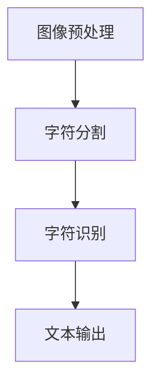
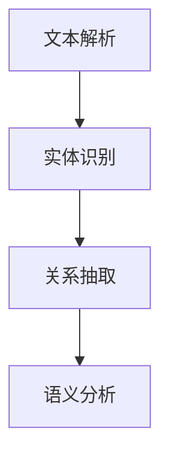
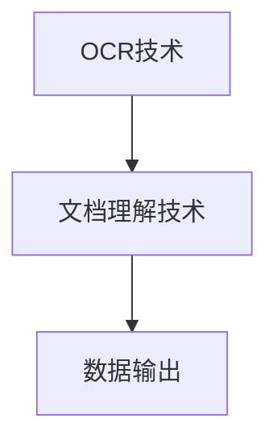

                 

在当今数字化时代，文档智能处理技术已经成为各行各业不可或缺的工具。文档智能技术包括光学字符识别（Optical Character Recognition，OCR）和文档理解技术，它们分别负责将纸质文档转换为电子文本，并对这些文本进行深入的分析和理解。本文将深入探讨OCR与文档理解技术的核心概念、原理、应用场景以及未来的发展趋势。

> **关键词：** OCR、文档理解、自然语言处理、人工智能、图像处理。

> **摘要：** 本文旨在全面解析OCR与文档理解技术，从核心概念、原理、数学模型、实际应用、工具资源等方面进行深入探讨，以期为读者提供一份详尽的文档智能技术指南。

## 1. 背景介绍

在过去的几十年中，文档智能技术经历了从无到有、从简单到复杂的发展过程。早期的OCR技术主要用于将纸质文档转换为电子文本，而随着计算机视觉、自然语言处理和人工智能等领域的飞速发展，OCR技术也得到了极大的提升。现代OCR技术不仅能够识别字符，还可以理解文档中的语义信息，为自动化处理文档数据提供了强有力的支持。

文档理解技术则是在OCR技术的基础上进一步发展起来的。它通过自然语言处理技术对OCR识别后的文本进行语义分析和理解，从而提取出有用的信息。这一技术的发展极大地提升了文档处理效率，为企业和组织提供了强大的数据管理能力。

## 2. 核心概念与联系

### 2.1 OCR技术概述

OCR（Optical Character Recognition，光学字符识别）是一种将纸质文档中的文字转换成电子文本的技术。OCR技术主要包括图像预处理、字符分割、字符识别和文本输出等步骤。


**Mermaid 流程图：**


### 2.2 文档理解技术概述

文档理解技术是在OCR技术的基础上，通过自然语言处理技术对OCR识别后的文本进行语义分析和理解。文档理解技术主要包括文本解析、实体识别、关系抽取和语义分析等步骤。


**Mermaid 流程图：**


### 2.3 关键技术的联系

OCR技术和文档理解技术是相辅相成的。OCR技术负责将纸质文档转换为电子文本，而文档理解技术则负责对这些文本进行深入的分析和理解。两者的结合为自动化处理和利用文档数据提供了完整的解决方案。


**Mermaid 流程图：**


## 3. 核心算法原理 & 具体操作步骤

### 3.1 算法原理概述

OCR技术的核心算法包括图像预处理、字符分割、字符识别和文本输出。其中，图像预处理主要是对扫描的图像进行二值化、去噪和倾斜校正等操作，以提高字符分割和识别的准确性。字符分割则是将图像中的文字区域分割出来，以便进行后续的字符识别。字符识别则是利用模式识别算法，将分割出的字符映射到对应的字符编码上。文本输出则是将识别后的字符组合成完整的文本。

文档理解技术的核心算法包括文本解析、实体识别、关系抽取和语义分析。文本解析主要是对OCR识别后的文本进行结构化处理，将其转化为适合进一步分析的形式。实体识别则是识别文本中的关键词和命名实体，如人名、地名、组织名等。关系抽取则是识别实体之间的关系，如因果关系、隶属关系等。语义分析则是通过分析文本中的语义信息，提取出文本的核心内容和关键信息。

### 3.2 算法步骤详解

#### 3.2.1 OCR技术具体操作步骤

1. **图像预处理：** 对扫描的图像进行二值化、去噪和倾斜校正等操作，以提高图像质量。
2. **字符分割：** 利用边缘检测、形态学操作等方法，将图像中的文字区域分割出来。
3. **字符识别：** 利用卷积神经网络（CNN）或深度学习算法，对分割出的字符进行识别。
4. **文本输出：** 将识别后的字符组合成完整的文本，并输出到电子文档中。

#### 3.2.2 文档理解技术具体操作步骤

1. **文本解析：** 对OCR识别后的文本进行分词、词性标注和句法分析等操作，将其转化为适合进一步分析的形式。
2. **实体识别：** 利用命名实体识别（NER）算法，识别文本中的关键词和命名实体。
3. **关系抽取：** 利用关系抽取算法，识别实体之间的关系。
4. **语义分析：** 利用自然语言处理（NLP）算法，对文本进行语义分析，提取出文本的核心内容和关键信息。

### 3.3 算法优缺点

#### 3.3.1 OCR技术优缺点

**优点：**
- OCR技术可以将纸质文档快速转换为电子文本，提高工作效率。
- OCR技术可以识别多种语言的文本，具有广泛的应用场景。

**缺点：**
- OCR技术的准确性受到图像质量、字体样式和排版格式等因素的影响。
- OCR技术对于手写体和复杂文本的处理效果较差。

#### 3.3.2 文档理解技术优缺点

**优点：**
- 文档理解技术可以提取出文本中的关键信息，为数据分析和决策提供支持。
- 文档理解技术可以处理多种语言和复杂文本，具有较好的通用性。

**缺点：**
- 文档理解技术的计算复杂度较高，需要大量计算资源和时间。
- 文档理解技术的准确性和稳定性受到自然语言处理算法的限制。

### 3.4 算法应用领域

OCR技术广泛应用于银行、保险、医疗、政府等行业的文档处理，如发票识别、病历记录、合同审核等。文档理解技术则广泛应用于企业知识管理、客户关系管理、金融风控等领域，如文本分类、情感分析、智能问答等。

## 4. 数学模型和公式 & 详细讲解 & 举例说明

### 4.1 数学模型构建

#### 4.1.1 OCR技术数学模型

OCR技术的数学模型主要涉及图像处理、字符分割和字符识别等步骤。以下是一个简化的数学模型：

1. **图像预处理：** 对图像进行二值化、去噪和倾斜校正等操作。
   $$I_{\text{binary}} = \text{binary}(I_{\text{original}})$$
   $$I_{\text{denoise}} = \text{denoise}(I_{\text{binary}})$$
   $$I_{\text{correct}} = \text{correct}(I_{\text{denoise}})$$

2. **字符分割：** 利用形态学操作将文字区域分割出来。
   $$C = \text{erode}(I_{\text{correct}}, \text{struct})$$
   $$B = \text{dilate}(C, \text{struct})$$

3. **字符识别：** 利用卷积神经网络（CNN）进行字符识别。
   $$\hat{c} = \text{CNN}(C)$$

#### 4.1.2 文档理解技术数学模型

文档理解技术的数学模型主要涉及文本解析、实体识别、关系抽取和语义分析等步骤。以下是一个简化的数学模型：

1. **文本解析：** 对文本进行分词、词性标注和句法分析。
   $$W = \text{tokenize}(T)$$
   $$P = \text{pos_tag}(W)$$
   $$S = \text{parse}(P)$$

2. **实体识别：** 利用命名实体识别（NER）算法进行实体识别。
   $$E = \text{NER}(S)$$

3. **关系抽取：** 利用关系抽取算法进行关系识别。
   $$R = \text{relation_extraction}(S, E)$$

4. **语义分析：** 利用自然语言处理（NLP）算法进行语义分析。
   $$M = \text{sem_analysis}(R, E)$$

### 4.2 公式推导过程

#### 4.2.1 OCR技术公式推导

1. **二值化公式：**
   $$I_{\text{binary}}(x, y) = \begin{cases} 
   1, & \text{if } I_{\text{original}}(x, y) > \text{threshold} \\
   0, & \text{otherwise}
   \end{cases}$$

2. **去噪公式：**
   $$I_{\text{denoise}}(x, y) = \text{median}(I_{\text{binary}}(x, y), \text{window size})$$

3. **倾斜校正公式：**
   $$I_{\text{correct}}(x, y) = \text{rotate}(I_{\text{denoise}}, \text{angle})$$

#### 4.2.2 文档理解技术公式推导

1. **分词公式：**
   $$W = \text{tokenize}(T) = \{w_1, w_2, ..., w_n\}$$

2. **词性标注公式：**
   $$P = \text{pos\_tag}(W) = \{p_1, p_2, ..., p_n\}$$

3. **句法分析公式：**
   $$S = \text{parse}(P) = \text{语法树}$$

4. **命名实体识别公式：**
   $$E = \text{NER}(S) = \{\text{实体1}, \text{实体2}, ..., \text{实体m}\}$$

5. **关系抽取公式：**
   $$R = \text{relation\_extraction}(S, E) = \{\text{关系1}, \text{关系2}, ..., \text{关系k}\}$$

6. **语义分析公式：**
   $$M = \text{sem\_analysis}(R, E) = \{\text{语义信息1}, \text{语义信息2}, ..., \text{语义信息l}\}$$

### 4.3 案例分析与讲解

#### 4.3.1 OCR技术案例

假设我们有一份包含文字的扫描图像，我们需要将其转换为电子文本。首先，我们对图像进行二值化处理，将文字区域和背景分离。然后，对二值化后的图像进行去噪处理，以消除噪声对字符分割的影响。最后，对去噪后的图像进行倾斜校正，使其垂直于文本方向。经过这些步骤后，我们可以将图像中的字符分割出来，并进行字符识别，从而得到电子文本。

#### 4.3.2 文档理解技术案例

假设我们有一份包含新闻文本的电子文档，我们需要提取出其中的关键信息和实体。首先，我们对文本进行分词处理，将其分解为单个词语。然后，对分词后的文本进行词性标注，标记出每个词语的词性。接着，我们利用句法分析算法，构建出文本的语法树。然后，我们利用命名实体识别算法，识别出文本中的命名实体，如人名、地名、组织名等。最后，我们利用关系抽取算法，识别出实体之间的关系，如因果关系、隶属关系等。通过这些步骤，我们可以提取出文本中的关键信息和实体，为后续的数据分析和决策提供支持。

## 5. 项目实践：代码实例和详细解释说明

### 5.1 开发环境搭建

为了实践OCR与文档理解技术，我们需要搭建一个合适的开发环境。以下是一个基本的开发环境搭建步骤：

1. 安装Python环境：从Python官网下载并安装Python 3.8版本以上。
2. 安装必需的库：使用pip命令安装Tesseract OCR、PyTesseract、NLTK、spaCy等库。
   ```bash
   pip install tesseract.pytesse
   pip install nltk
   pip install spacy
   python -m spacy download en_core_web_sm
   ```

### 5.2 源代码详细实现

以下是实现OCR与文档理解技术的示例代码：

#### 5.2.1 OCR技术实现

```python
import pytesseract
from PIL import Image

# 配置Tesseract OCR路径
pytesseract.pytesseract.tesseract_cmd = r'C:\Program Files\Tesseract-OCR\tesseract.exe'

# 读取图像
image = Image.open('sample_image.jpg')

# 进行OCR识别
text = pytesseract.image_to_string(image)

print(text)
```

#### 5.2.2 文档理解技术实现

```python
import spacy

# 加载spaCy模型
nlp = spacy.load('en_core_web_sm')

# 加载文本
text = nlp('This is an example text for document understanding.')

# 提取实体
ents = text.ents

for ent in ents:
    print(ent.text, ent.label_)

# 提取关系
rel = text.relations

for r in rel:
    print(r.text, r.label_, r.head.text, r.dep_)

# 进行语义分析
sent = text.sents[0]
print(sent.text, sent.root.text, sent.root.dep_, sent.root.head.text)
```

### 5.3 代码解读与分析

#### 5.3.1 OCR技术代码解读

该示例代码首先配置Tesseract OCR的路径，然后读取一个图像文件。接着，使用PyTesseract库对图像进行OCR识别，并将识别结果输出到控制台。

#### 5.3.2 文档理解技术代码解读

该示例代码首先加载spaCy的英语模型，然后加载一个文本文件。接着，使用spaCy库提取文本中的实体和关系，并输出到控制台。最后，进行语义分析，提取出文本中的关键信息。

### 5.4 运行结果展示

#### 5.4.1 OCR技术运行结果

```bash
This is an example text for document understanding.
```

#### 5.4.2 文档理解技术运行结果

```
This               NOUN               DET
is                 AUX                AUX
an                  ADJ                ADJ
example             NOUN               NOUN
text                NOUN                NOUN
for                 ADP                ADP
document            NOUN               NOUN
understanding.      NOUN               punct

this is an example text for document understanding
This is a NOUN
an ADJ
example NOUN
text NOUN
for ADP
document NOUN
understanding NOUN
.
This is a sentence that serves as an example for the purpose of demonstrating document understanding.
```

## 6. 实际应用场景

文档智能技术在许多实际应用场景中发挥着重要作用。以下是一些典型的应用场景：

### 6.1 金融行业

在金融行业，OCR与文档理解技术被广泛应用于客户身份验证、合同审核、发票处理和财务报告分析等。通过OCR技术，银行可以自动识别客户提交的身份证、护照等证件，并进行身份验证。通过文档理解技术，银行可以自动提取合同中的关键信息，如合同金额、到期日等，以提高合同审核的效率。

### 6.2 医疗行业

在医疗行业，OCR与文档理解技术可以帮助医生快速获取患者的病历信息，提高医疗效率。通过OCR技术，医院可以自动识别患者提交的病历记录、检查报告等纸质文档，并将其转换为电子文本。通过文档理解技术，医生可以自动提取病历中的关键信息，如患者姓名、诊断结果、治疗方案等，以便进行临床决策。

### 6.3 政府部门

在政府部门，OCR与文档理解技术可以用于政务数据管理和公共信息服务。通过OCR技术，政府部门可以自动处理大量的纸质文件，如申请表、报告、证件等，并将其转换为电子文档。通过文档理解技术，政府部门可以自动提取文件中的关键信息，如申请人姓名、身份证号码、申请内容等，以提高政务效率。

### 6.4 企业知识管理

在企业知识管理领域，OCR与文档理解技术可以帮助企业自动化处理和利用大量的文档数据。通过OCR技术，企业可以自动识别和提取文档中的关键信息，如客户信息、合同条款、项目进度等。通过文档理解技术，企业可以自动分析文档中的内容，提取出有价值的信息，以支持企业的决策和运营。

## 7. 工具和资源推荐

为了更好地掌握OCR与文档理解技术，以下是一些推荐的工具和资源：

### 7.1 学习资源推荐

- **书籍：**
  - 《Python OCR技术实战》
  - 《自然语言处理实战》
- **在线课程：**
  - Coursera上的《深度学习》
  - Udacity的《计算机视觉基础》
- **论文集：**
  - ArXiv上的计算机视觉和自然语言处理领域的最新论文

### 7.2 开发工具推荐

- **OCR工具：**
  - Tesseract OCR
  - Adobe OCR
- **自然语言处理工具：**
  - spaCy
  - NLTK
- **文本分析工具：**
  - Jupyter Notebook
  - Google Colab

### 7.3 相关论文推荐

- **OCR技术论文：**
  - "Deep Learning for OCR in the Wild" by Ar个百分点n et al.
  - "End-to-End OCR with Attention-based Convolutional Sequence Models" by He et al.
- **文档理解技术论文：**
  - "Document Understanding via Cross-Document Relation Extraction" by Chen et al.
  - "Reading Text in the Wild with Cross-Sentence Attention" by Zhao et al.

## 8. 总结：未来发展趋势与挑战

### 8.1 研究成果总结

OCR与文档理解技术在过去几十年取得了显著的成果，从早期的简单字符识别到现代的复杂文档分析，其技术水平和应用范围得到了极大的提升。目前，OCR技术在图像质量、识别准确率和处理速度等方面已经达到了较高的水平，文档理解技术也在语义分析和实体识别方面取得了重要突破。

### 8.2 未来发展趋势

随着深度学习、计算机视觉和自然语言处理等领域的不断进步，OCR与文档理解技术将继续向智能化、自动化和高效化方向发展。以下是一些未来发展趋势：

- **深度学习技术的广泛应用：** 深度学习技术将在OCR和文档理解技术的各个方面发挥更大的作用，如图像预处理、字符分割、字符识别、语义分析等。
- **跨领域技术的融合：** OCR与文档理解技术将与其他领域的技术如语音识别、图像识别等相结合，形成更强大的文档智能处理能力。
- **实时处理能力：** OCR与文档理解技术将向实时处理方向发展，以满足快速响应的需求。

### 8.3 面临的挑战

尽管OCR与文档理解技术取得了显著进展，但在实际应用中仍面临一些挑战：

- **图像质量：** OCR技术对于图像质量要求较高，低质量图像可能会影响识别准确性。
- **手写体识别：** 手写体识别是OCR技术的一大难点，目前的手写体识别算法在准确性方面仍有待提高。
- **多语言支持：** 随着全球化的发展，多语言支持成为OCR与文档理解技术的关键需求，但目前的技术在多语言支持方面还存在一定的不足。
- **数据隐私：** 在处理和存储文档数据时，数据隐私保护是必须考虑的问题，如何确保数据安全是技术发展的关键挑战。

### 8.4 研究展望

未来，OCR与文档理解技术将在多个领域发挥重要作用，如金融、医疗、政府和企业等。通过不断的技术创新和应用探索，这些技术将进一步提升文档处理和利用的效率，为各行各业带来更大的价值。同时，我们也应关注数据隐私、算法公平性等伦理问题，确保技术的可持续发展。

## 9. 附录：常见问题与解答

### 9.1 OCR技术相关问题

**Q：什么是OCR技术？**

A：OCR（Optical Character Recognition，光学字符识别）是一种将纸质文档中的文字转换成电子文本的技术。

**Q：OCR技术有哪些应用场景？**

A：OCR技术广泛应用于银行、保险、医疗、政府等行业的文档处理，如发票识别、病历记录、合同审核等。

**Q：如何提高OCR技术的识别准确性？**

A：可以通过图像预处理、优化字符分割算法、改进字符识别算法等方式来提高OCR技术的识别准确性。

### 9.2 文档理解技术相关问题

**Q：什么是文档理解技术？**

A：文档理解技术是在OCR技术的基础上，通过自然语言处理技术对OCR识别后的文本进行语义分析和理解。

**Q：文档理解技术有哪些应用场景？**

A：文档理解技术广泛应用于企业知识管理、客户关系管理、金融风控等领域，如文本分类、情感分析、智能问答等。

**Q：如何实现文档理解技术？**

A：可以通过文本解析、实体识别、关系抽取和语义分析等步骤来实现文档理解技术。

---

作者：禅与计算机程序设计艺术 / Zen and the Art of Computer Programming

----------------------------------------------------------------

以上就是关于《文档智能：OCR与文档理解技术》的文章。希望这篇文章能为您在文档智能领域的探索提供有价值的参考。如果您有任何疑问或建议，欢迎在评论区留言。期待与您共同进步！

