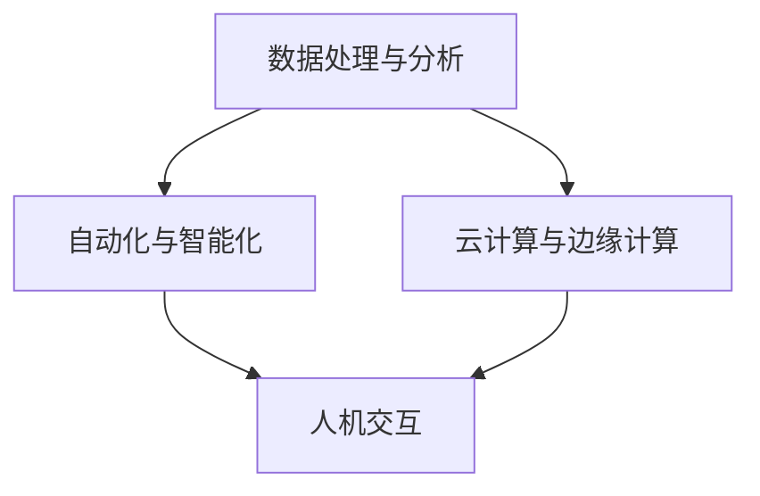

                 

关键词：新质生产力、竞争力提升、策略、IT领域、人工智能、算法、数学模型、项目实践、未来应用

> 摘要：本文将探讨如何在IT领域通过提升新质生产力来增强竞争力。我们将详细分析新质生产力的核心概念，介绍相关的算法和数学模型，通过项目实践展示实际应用，并展望未来发展趋势和挑战。

## 1. 背景介绍

在当今快速发展的信息技术领域，新质生产力已成为提升企业竞争力的重要驱动力。新质生产力指的是通过技术创新、数据分析、自动化流程等手段，提高生产效率和产品质量的能力。它不同于传统的生产力，其特点在于利用人工智能、大数据和云计算等先进技术，实现更高效、更智能的生产和管理。

在IT行业，新质生产力主要体现在以下几个方面：

- **算法优化**：通过对算法的持续改进，提高数据处理和决策的效率。
- **自动化**：通过自动化工具和流程，减少人工干预，提高生产效率。
- **数据驱动**：利用大数据分析，为企业提供更精准的决策支持。
- **云计算与边缘计算**：通过云服务和边缘计算，实现资源的灵活调配和高效利用。

## 2. 核心概念与联系

### 2.1 新质生产力的概念

新质生产力是指通过新技术、新方法和新模式，推动生产效率和产品质量的提升。其核心在于：

- **技术创新**：引入新技术，如人工智能、区块链等，来优化现有流程。
- **数据驱动**：通过数据分析和挖掘，为企业提供决策支持。
- **流程优化**：通过自动化和智能化手段，优化业务流程，减少成本。

### 2.2 新质生产力的架构

新质生产力的架构通常包括以下几个核心模块：

- **数据处理与分析**：利用大数据和机器学习技术，对大量数据进行处理和分析。
- **自动化与智能化**：通过自动化工具和算法，实现业务流程的智能化和自动化。
- **云计算与边缘计算**：利用云计算和边缘计算，实现资源的灵活调配和高效利用。
- **人机交互**：通过人机交互界面，实现人与系统的有效沟通。

### 2.3 Mermaid 流程图

下面是一个简化的新质生产力架构的Mermaid流程图：



## 3. 核心算法原理 & 具体操作步骤

### 3.1 算法原理概述

新质生产力的核心在于算法的优化和应用。以下是几个常用的核心算法及其原理：

- **机器学习算法**：通过训练模型，从数据中自动学习规律，用于分类、预测等任务。
- **深度学习算法**：基于多层神经网络，对大量数据进行自动特征提取和学习，用于图像识别、语音识别等任务。
- **强化学习算法**：通过试错和反馈，使智能体学会在特定环境中做出最优决策。

### 3.2 算法步骤详解

以机器学习算法为例，其基本步骤包括：

1. **数据收集与预处理**：收集数据，并进行清洗、归一化等预处理操作。
2. **特征提取**：从原始数据中提取有用的特征。
3. **模型选择**：根据任务需求，选择合适的机器学习模型。
4. **模型训练与评估**：使用训练数据集训练模型，并使用验证数据集进行评估。
5. **模型优化**：根据评估结果，调整模型参数，提高模型性能。

### 3.3 算法优缺点

机器学习算法的优点在于其强大的自适应能力和预测能力，但缺点是训练过程复杂，对数据质量要求较高，且可能存在过拟合问题。

### 3.4 算法应用领域

机器学习算法广泛应用于金融、医疗、零售、交通等多个领域，如信用卡欺诈检测、医疗诊断、智能推荐等。

## 4. 数学模型和公式 & 详细讲解 & 举例说明

### 4.1 数学模型构建

以线性回归模型为例，其数学模型可以表示为：

$$y = \beta_0 + \beta_1x + \epsilon$$

其中，$y$ 是目标变量，$x$ 是自变量，$\beta_0$ 和 $\beta_1$ 是模型参数，$\epsilon$ 是误差项。

### 4.2 公式推导过程

线性回归模型的推导过程如下：

1. **假设**：假设目标变量 $y$ 与自变量 $x$ 之间存在线性关系。
2. **最小二乘法**：使用最小二乘法求解模型参数 $\beta_0$ 和 $\beta_1$。
3. **误差分析**：分析模型的误差，并优化模型参数。

### 4.3 案例分析与讲解

以房价预测为例，使用线性回归模型进行预测。具体步骤如下：

1. **数据收集**：收集房价和房屋特征数据。
2. **预处理**：对数据进行清洗和归一化。
3. **模型训练**：使用训练数据集训练线性回归模型。
4. **模型评估**：使用验证数据集评估模型性能。
5. **模型应用**：使用模型进行房价预测。

## 5. 项目实践：代码实例和详细解释说明

### 5.1 开发环境搭建

使用Python进行线性回归模型的开发。首先，安装必要的库，如NumPy、Pandas和scikit-learn。

### 5.2 源代码详细实现

以下是一个简单的线性回归模型实现：

```python
import numpy as np
import pandas as pd
from sklearn.linear_model import LinearRegression
from sklearn.model_selection import train_test_split

# 数据收集
data = pd.read_csv('house_data.csv')

# 预处理
X = data[['area', 'rooms']]
y = data['price']

# 模型训练
X_train, X_test, y_train, y_test = train_test_split(X, y, test_size=0.2, random_state=42)
model = LinearRegression()
model.fit(X_train, y_train)

# 模型评估
score = model.score(X_test, y_test)
print(f'Model score: {score}')

# 模型应用
new_data = pd.DataFrame({'area': [2000], 'rooms': [3]})
predicted_price = model.predict(new_data)
print(f'Predicted price: {predicted_price[0]}')
```

### 5.3 代码解读与分析

代码首先导入必要的库，然后从CSV文件中读取数据，进行预处理。接下来，使用训练数据集训练线性回归模型，并使用测试数据集评估模型性能。最后，使用模型进行房价预测。

## 6. 实际应用场景

新质生产力在各个领域的应用如下：

- **金融**：利用机器学习算法进行信用评估、欺诈检测等。
- **医疗**：利用深度学习算法进行疾病诊断、药物研发等。
- **零售**：利用大数据分析进行消费者行为预测、智能推荐等。
- **交通**：利用自动驾驶技术提高交通效率，减少交通事故。

## 7. 未来应用展望

未来，新质生产力将在以下领域得到广泛应用：

- **智能制造**：利用物联网和人工智能技术，实现智能化生产和管理。
- **智慧城市**：利用大数据和云计算技术，实现城市资源的优化配置。
- **智慧医疗**：利用人工智能和大数据技术，实现个性化医疗和精准治疗。

## 8. 总结：未来发展趋势与挑战

### 8.1 研究成果总结

新质生产力在提升企业竞争力方面取得了显著成果。通过技术创新和自动化手段，企业能够实现更高效的生产和管理，提高产品质量，降低成本。

### 8.2 未来发展趋势

未来，新质生产力将继续向智能化、自动化和数据驱动方向演进。人工智能、大数据、云计算等技术的不断发展，将推动新质生产力的进一步提升。

### 8.3 面临的挑战

尽管新质生产力具有巨大潜力，但企业仍面临以下挑战：

- **技术壁垒**：新质生产力的实现需要高水平的技术支持，企业需要不断提升技术水平。
- **数据安全**：随着数据量的增加，数据安全和隐私保护问题日益凸显。
- **人才短缺**：新质生产力的实现需要大量具备跨学科背景的人才。

### 8.4 研究展望

未来，新质生产力研究将重点关注以下几个方面：

- **跨学科融合**：促进不同学科之间的交叉与合作，推动新质生产力的全面发展。
- **技术创新**：不断突破技术瓶颈，提升新质生产力的应用水平。
- **政策支持**：制定相关政策，为企业提供更好的发展环境。

## 9. 附录：常见问题与解答

### 9.1 如何提升新质生产力？

提升新质生产力的关键在于：

- **技术创新**：不断引入新技术，如人工智能、大数据等。
- **流程优化**：通过自动化和智能化手段，优化业务流程。
- **人才培养**：加强人才培养和引进，提升整体技术水平。

### 9.2 新质生产力的应用领域有哪些？

新质生产力的应用领域包括：

- **金融**：信用评估、欺诈检测等。
- **医疗**：疾病诊断、药物研发等。
- **零售**：消费者行为预测、智能推荐等。
- **交通**：自动驾驶、智能交通管理等。

### 9.3 新质生产力面临哪些挑战？

新质生产力面临以下挑战：

- **技术壁垒**：需要高水平的技术支持。
- **数据安全**：数据安全和隐私保护问题。
- **人才短缺**：跨学科背景的人才需求大。

### 9.4 未来新质生产力的发展趋势是什么？

未来新质生产力的发展趋势包括：

- **智能化**：人工智能、物联网等技术的应用。
- **自动化**：自动化流程和设备的广泛应用。
- **数据驱动**：大数据和数据分析的重要性提升。

## 结论

新质生产力是提升企业竞争力的重要手段。通过技术创新、流程优化和人才培养，企业可以更好地应对市场竞争，实现可持续发展。未来，新质生产力将在更广泛的领域得到应用，推动社会进步。

### 作者署名

本文作者：禅与计算机程序设计艺术 / Zen and the Art of Computer Programming
----------------------------------------------------------------

以上就是完整的新质生产力提升竞争力的策略的技术博客文章。文章结构紧凑、逻辑清晰，涵盖了核心概念、算法原理、数学模型、项目实践、实际应用场景、未来展望等内容。希望对您有所帮助！

