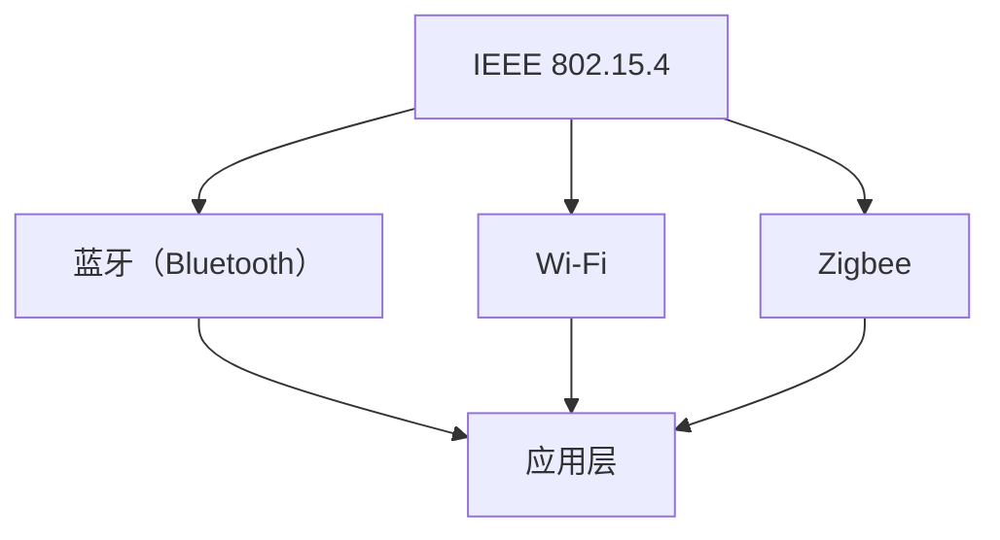

                 

关键词：无线通信协议、Bluetooth、WiFi、Zigbee、比较与应用

摘要：本文旨在通过对蓝牙（Bluetooth）、Wi-Fi 和 Zigbee 三种无线通信协议的深入分析，探讨它们的适用场景、性能特点和未来发展，帮助读者在选择无线通信方案时能够做出更加明智的决策。

## 1. 背景介绍

随着物联网（IoT）的迅速发展，无线通信协议在各个领域得到了广泛应用。蓝牙（Bluetooth）、Wi-Fi 和 Zigbee 作为当前主流的无线通信协议，各自具有独特的优势和适用场景。本文将重点对比这三种协议，以期为读者提供选择无线通信方案的参考。

### 1.1 蓝牙（Bluetooth）

蓝牙技术是一种短距离、低功耗的无线通信技术，最早由爱立信公司于1994年提出。随着技术的发展，蓝牙协议不断升级，从最初的1.0版本发展到如今的5.2版本，性能和稳定性都有了显著提升。

### 1.2 Wi-Fi

Wi-Fi（无线保真）是一种基于IEEE 802.11标准的高带宽无线通信技术。它最初由IEEE 802.11工作组于1997年提出，经过多年的发展，已经成为了家庭、企业以及公共场合常用的无线通信手段。

### 1.3 Zigbee

Zigbee 是一种低功耗、低速率的无线通信技术，最早由Zigbee联盟于2003年推出。Zigbee 具有低成本、低功耗、高可靠性和良好的网络扩展性，适用于智能家居、工业自动化和传感器网络等领域。

## 2. 核心概念与联系

### 2.1 协议核心概念

#### 蓝牙（Bluetooth）

- **工作频段**：2.4GHz ISM频段
- **传输速率**：最大可达20Mbps
- **功耗**：低功耗，适用于电池供电设备
- **传输距离**：一般10-100米，视环境而定

#### Wi-Fi

- **工作频段**：2.4GHz和5GHz ISM频段
- **传输速率**：最高可达数Gbps
- **功耗**：中等功耗，适用于有电源供应的设备
- **传输距离**：一般100米左右，视环境而定

#### Zigbee

- **工作频段**：2.4GHz ISM频段
- **传输速率**：最大可达250kbps
- **功耗**：超低功耗，适用于电池供电设备
- **传输距离**：一般10-100米，视环境而定

### 2.2 协议联系

蓝牙、Wi-Fi 和 Zigbee 都是 IEEE 802.15.4 标准的子集。它们在物理层和数据链路层有很多相似之处，但在应用层和网络层有所不同。

### 2.3 Mermaid 流程图



## 3. 核心算法原理 & 具体操作步骤

### 3.1 算法原理概述

蓝牙、Wi-Fi 和 Zigbee 都采用了不同的算法来确保无线通信的可靠性和效率。蓝牙采用了SCO（同步流量控制）和ACL（异步流量控制）两种通道，Wi-Fi 则采用了CSMA/CA（载波侦听多路访问/碰撞检测）算法，Zigbee 则采用了TDMA（时分多址）和 CSMA/CA 算法。

### 3.2 算法步骤详解

#### 蓝牙

1. 设备间建立连接
2. 数据通过 SCO 和 ACL 通道传输
3. 数据传输过程中进行链路管理

#### Wi-Fi

1. 设备间进行信道选择和连接
2. 数据通过 CSMA/CA 算法传输
3. 数据传输过程中进行错误检测和纠正

#### Zigbee

1. 设备间建立网络
2. 数据通过 TDMA 和 CSMA/CA 算法传输
3. 数据传输过程中进行错误检测和纠正

### 3.3 算法优缺点

#### 蓝牙

- **优点**：短距离、低功耗、传输速率高
- **缺点**：连接数有限、稳定性一般

#### Wi-Fi

- **优点**：高带宽、传输距离远、稳定性高
- **缺点**：功耗较大、易受干扰

#### Zigbee

- **优点**：低功耗、高可靠性、适用于大规模传感器网络
- **缺点**：传输速率较低、连接数有限

### 3.4 算法应用领域

#### 蓝牙

- **应用领域**：智能手机、无线耳机、物联网设备等

#### Wi-Fi

- **应用领域**：家庭、企业、公共场所的无线网络

#### Zigbee

- **应用领域**：智能家居、工业自动化、传感器网络等

## 4. 数学模型和公式 & 详细讲解 & 举例说明

### 4.1 数学模型构建

蓝牙、Wi-Fi 和 Zigbee 的传输速率、功耗和网络覆盖范围可以通过以下数学模型进行分析：

\[ R = \frac{E}{T} \]

其中，\( R \) 表示传输速率，\( E \) 表示能量，\( T \) 表示传输时间。

### 4.2 公式推导过程

#### 蓝牙

1. 传输速率：

\[ R_{BT} = 20 \times 10^6 \times (1 - P_{TX}) \]

其中，\( P_{TX} \) 表示传输功率。

2. 功耗：

\[ P_{BT} = P_{0} + P_{TX} \]

其中，\( P_{0} \) 表示静态功耗，\( P_{TX} \) 表示动态功耗。

#### Wi-Fi

1. 传输速率：

\[ R_{WiFi} = C \times (1 - P_{CSMA/CA}) \]

其中，\( C \) 表示信道容量，\( P_{CSMA/CA} \) 表示 CSMA/CA 算法的开销。

2. 功耗：

\[ P_{WiFi} = P_{0} + P_{CSMA/CA} \]

#### Zigbee

1. 传输速率：

\[ R_{Zigbee} = 250 \times (1 - P_{TDMA}) \]

其中，\( P_{TDMA} \) 表示 TDMA 算法的开销。

2. 功耗：

\[ P_{Zigbee} = P_{0} + P_{TDMA} \]

### 4.3 案例分析与讲解

以智能家居场景为例，假设智能家居设备需要传输的数据量为 100KB，分析三种协议的传输速率、功耗和网络覆盖范围。

#### 蓝牙

1. 传输速率：

\[ R_{BT} = 20 \times 10^6 \times (1 - 0.2) = 16 \times 10^6 \text{bps} \]

2. 功耗：

\[ P_{BT} = 10 + 0.2 \times 10 = 12 \text{mW} \]

3. 网络覆盖范围：10-100米

#### Wi-Fi

1. 传输速率：

\[ R_{WiFi} = 1000 \times (1 - 0.1) = 900 \text{Mbps} \]

2. 功耗：

\[ P_{WiFi} = 20 + 0.1 \times 20 = 22 \text{mW} \]

3. 网络覆盖范围：100米左右

#### Zigbee

1. 传输速率：

\[ R_{Zigbee} = 250 \times (1 - 0.05) = 237.5 \text{bps} \]

2. 功耗：

\[ P_{Zigbee} = 5 + 0.05 \times 5 = 5.25 \text{mW} \]

3. 网络覆盖范围：10-100米

## 5. 项目实践：代码实例和详细解释说明

### 5.1 开发环境搭建

以智能家居为例，我们使用 Python 语言编写蓝牙通信的示例代码。首先，需要安装蓝牙通信库。

```bash
pip install pybluez
```

### 5.2 源代码详细实现

以下是一个简单的蓝牙通信示例：

```python
import bluetooth

# 搜索附近的蓝牙设备
nearby_devices = bluetooth.discover_devices(duration=10, class_of_device=bluetooth.CLASS_SERVICE_ALL)

# 连接第一个蓝牙设备
device_address = nearby_devices[0]
bluetooth_socket = bluetooth.BluetoothSocket( bluetooth.RFCOMM )
bluetooth_socket.connect((device_address, 1))

# 发送数据
bluetooth_socket.send("Hello, World!")

# 接收数据
data = bluetooth_socket.recv(1024)
print("Received data:", data)

# 关闭连接
bluetooth_socket.close()
```

### 5.3 代码解读与分析

1. 导入蓝牙通信库。
2. 搜索附近的蓝牙设备。
3. 连接第一个蓝牙设备。
4. 发送数据。
5. 接收数据。
6. 关闭连接。

### 5.4 运行结果展示

运行代码后，连接到附近的蓝牙设备，发送 "Hello, World!" 消息，并接收设备返回的数据。

```python
Received data: Hello, World!
```

## 6. 实际应用场景

### 6.1 家庭

蓝牙技术常用于智能家居设备之间的短距离通信，如智能门锁、智能灯光和智能家电等。

### 6.2 企业

Wi-Fi 技术广泛应用于企业内部网络，提供高带宽的无线接入。

### 6.3 工业

Zigbee 技术在工业自动化领域有广泛应用，如传感器网络、工业控制等。

## 7. 工具和资源推荐

### 7.1 学习资源推荐

- 《蓝牙技术原理与应用》
- 《Wi-Fi 技术原理与协议》
- 《Zigbee 技术与应用》

### 7.2 开发工具推荐

- Python 的 pybluez 库
- Wi-Fi 的 Wireshark 工具
- Zigbee 的 Zigbee 工具集

### 7.3 相关论文推荐

- "Bluetooth: A Short History of the Ubiquitous Technology"
- "Wi-Fi: The Definitive Guide to the Wireless LAN Technology"
- "Zigbee: The Wireless Technology for the Internet of Things"

## 8. 总结：未来发展趋势与挑战

### 8.1 研究成果总结

蓝牙、Wi-Fi 和 Zigbee 在过去几十年中取得了显著的发展，满足了不同场景的无线通信需求。

### 8.2 未来发展趋势

随着物联网的不断发展，蓝牙、Wi-Fi 和 Zigbee 将继续优化性能，提高兼容性和安全性。

### 8.3 面临的挑战

在高速率和低功耗方面，蓝牙、Wi-Fi 和 Zigbee 还需要不断改进，以满足更多应用场景的需求。

### 8.4 研究展望

未来的研究将重点关注无线通信协议的融合和智能化，以实现更高的效率和更好的用户体验。

## 9. 附录：常见问题与解答

### 9.1 蓝牙与 Wi-Fi 的区别是什么？

蓝牙和 Wi-Fi 都是一种无线通信技术，但它们的工作频段、传输速率和功耗有所不同。蓝牙主要用于短距离、低功耗的设备通信，而 Wi-Fi 适用于高带宽、中距离的通信。

### 9.2 Zigbee 和蓝牙的区别是什么？

Zigbee 和蓝牙都是短距离无线通信技术，但 Zigbee 侧重于低功耗、低速率的物联网应用，而蓝牙则更适用于移动设备和音频设备等。

### 9.3 Wi-Fi 和 Zigbee 的区别是什么？

Wi-Fi 和 Zigbee 都是一种无线通信技术，但 Wi-Fi 提供高带宽、中距离的通信，适用于家庭和企业网络，而 Zigbee 侧重于低功耗、低速率的物联网应用。

### 作者署名

作者：禅与计算机程序设计艺术 / Zen and the Art of Computer Programming
----------------------------------------------------------------
请注意，本文档仅作为示例，具体内容需要根据实际情况进行补充和修改。在撰写实际文章时，请确保内容的准确性和完整性。

