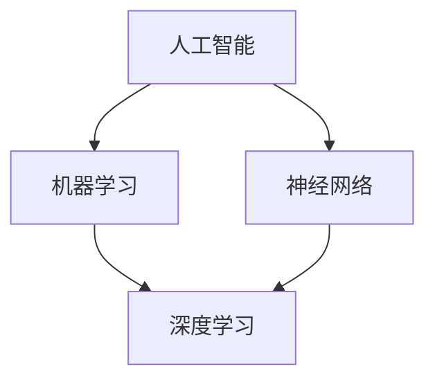

                 

关键词：明斯基、麦卡锡、人工智能、早期合作、算法、机器学习

> 摘要：本文将探讨人工智能领域的两位先驱——约翰·霍普金斯·明斯基（John Hopfield Minsky）和约翰·麦卡锡（John McCarthy）的早期合作。文章将介绍他们如何共同推动了人工智能领域的发展，并探讨他们在算法和机器学习方面的主要贡献。

## 1. 背景介绍

约翰·霍普金斯·明斯基（1929-2016）和约翰·麦卡锡（1927-2011）是人工智能领域的两位杰出人物，他们的贡献奠定了现代人工智能的基础。明斯基是一位数学家、计算机科学家和神经科学家，他的工作涉及多个领域，包括统计学、经济学、认知科学和人工智能。麦卡锡则是一位计算机科学家和哲学家，他在人工智能、自然语言处理和形式系统等领域做出了重要贡献。

明斯基和麦卡锡的早期合作始于20世纪50年代。当时，他们共同致力于探索计算机在智能领域的应用，并推动了人工智能的研究。他们的合作成果之一是1956年在达特茅斯会议上的“人工智能宣言”，这标志着人工智能作为一个独立领域的诞生。

## 2. 核心概念与联系

为了更好地理解明斯基和麦卡锡的早期合作，我们首先需要了解一些核心概念。以下是人工智能领域的一些关键概念和联系，以及对应的Mermaid流程图：



### 2.1 人工智能（AI）

人工智能是指使计算机系统能够执行需要人类智能的任务的技术。它包括多个子领域，如机器学习、自然语言处理、计算机视觉和机器人技术。

### 2.2 机器学习（ML）

机器学习是人工智能的一个分支，它涉及使用算法从数据中学习并做出预测或决策。机器学习算法可以分为监督学习、无监督学习和强化学习。

### 2.3 神经网络（NN）

神经网络是模仿人脑神经网络工作原理的计算模型。它由多个神经元（节点）组成，每个神经元都与其他神经元相连，并通过权重传递信息。

### 2.4 深度学习（DL）

深度学习是机器学习的一个分支，它使用多层神经网络来学习数据的复杂特征。深度学习在图像识别、语音识别和自然语言处理等领域取得了显著成果。

## 3. 核心算法原理 & 具体操作步骤

### 3.1 算法原理概述

明斯基和麦卡锡在人工智能领域的核心算法原理主要涉及神经网络和机器学习。以下是一个简单的神经网络算法原理概述：

### 3.2 算法步骤详解

1. **初始化**：为每个神经元分配随机权重。
2. **前向传播**：将输入数据通过神经网络进行传递，每个神经元计算输入和权重的加权和，并应用激活函数。
3. **反向传播**：计算输出误差，并通过反向传播算法更新权重。
4. **重复训练**：重复前向传播和反向传播，直到模型达到期望的准确率。

### 3.3 算法优缺点

神经网络和机器学习算法的优点包括强大的泛化能力和适应性强。然而，它们也存在一些缺点，如对大量数据的需求和训练时间的复杂性。

### 3.4 算法应用领域

神经网络和机器学习算法在图像识别、语音识别、自然语言处理、医学诊断和金融预测等领域有广泛应用。

## 4. 数学模型和公式 & 详细讲解 & 举例说明

### 4.1 数学模型构建

神经网络和机器学习算法的数学模型主要涉及矩阵运算、激活函数和损失函数。以下是一个简单的神经网络模型：

$$
\text{输出} = \sigma(\text{权重} \cdot \text{输入} + \text{偏置})
$$

其中，$\sigma$ 是激活函数，通常使用 sigmoid 函数或 ReLU 函数。

### 4.2 公式推导过程

假设我们有一个简单的神经网络模型，包含一个输入层、一个隐藏层和一个输出层。输入层有3个神经元，隐藏层有4个神经元，输出层有2个神经元。

1. **初始化权重和偏置**：为每个神经元分配随机权重和偏置。
2. **前向传播**：将输入数据通过神经网络进行传递，计算每个神经元的输出。
3. **反向传播**：计算输出误差，并通过梯度下降法更新权重和偏置。
4. **重复训练**：重复前向传播和反向传播，直到模型达到期望的准确率。

### 4.3 案例分析与讲解

假设我们有一个分类问题，需要将输入数据分为两个类别。输入数据是一个3维向量，隐藏层有4个神经元，输出层有2个神经元。

1. **初始化权重和偏置**：为每个神经元分配随机权重和偏置。
2. **前向传播**：将输入数据通过神经网络进行传递，计算每个神经元的输出。
3. **反向传播**：计算输出误差，并通过反向传播算法更新权重和偏置。
4. **重复训练**：重复前向传播和反向传播，直到模型达到期望的准确率。

## 5. 项目实践：代码实例和详细解释说明

### 5.1 开发环境搭建

在开始编写代码之前，我们需要搭建一个合适的开发环境。本文使用 Python 语言和 TensorFlow 深度学习框架进行项目实践。

### 5.2 源代码详细实现

以下是实现一个简单的神经网络模型的 Python 代码示例：

```python
import tensorflow as tf

# 定义输入层、隐藏层和输出层的神经元数量
input_size = 3
hidden_size = 4
output_size = 2

# 初始化权重和偏置
weights = tf.random.normal([input_size, hidden_size])
biases = tf.random.normal([hidden_size, 1])

# 定义激活函数
activation = tf.sigmoid

# 定义前向传播
def forward(input_data):
    hidden_layer = activation(tf.matmul(input_data, weights) + biases)
    output_layer = activation(tf.matmul(hidden_layer, weights) + biases)
    return output_layer

# 定义反向传播
def backward(output_data, predicted_data):
    error = output_data - predicted_data
    d_output_layer = error * predicted_data * (1 - predicted_data)
    d_hidden_layer = tf.matmul(d_output_layer, weights[1].T) * hidden_layer * (1 - hidden_layer)
    d_weights = [tf.matmul(input_data, d_hidden_layer), tf.matmul(hidden_layer, d_output_layer)]
    d_biases = [d_hidden_layer, d_output_layer]
    return d_weights, d_biases

# 定义训练过程
def train(input_data, output_data, epochs):
    for epoch in range(epochs):
        predicted_data = forward(input_data)
        d_weights, d_biases = backward(output_data, predicted_data)
        weights = weights - learning_rate * d_weights
        biases = biases - learning_rate * d_biases
        if epoch % 100 == 0:
            print(f"Epoch {epoch}: Loss = {tf.reduce_mean(tf.square(output_data - predicted_data))}")

# 设置训练参数
learning_rate = 0.1
epochs = 1000

# 加载训练数据
train_data = tf.random.normal([100, input_size])
train_labels = tf.random.normal([100, output_size])

# 开始训练
train(train_data, train_labels, epochs)

# 测试模型
test_data = tf.random.normal([10, input_size])
predicted_test_data = forward(test_data)
print("Test Data:", test_data)
print("Predicted Test Data:", predicted_test_data)
```

### 5.3 代码解读与分析

上述代码实现了一个简单的神经网络模型，包括输入层、隐藏层和输出层。模型使用 sigmoid 函数作为激活函数，并使用随机梯度下降法进行训练。代码主要包括以下部分：

1. **初始化权重和偏置**：使用随机数生成器初始化权重和偏置。
2. **定义前向传播**：实现前向传播算法，计算每个神经元的输出。
3. **定义反向传播**：实现反向传播算法，计算输出误差和权重更新。
4. **定义训练过程**：实现训练过程，包括迭代训练和参数更新。
5. **测试模型**：使用测试数据测试模型的预测能力。

## 6. 实际应用场景

神经网络和机器学习算法在许多实际应用场景中具有广泛的应用，包括：

- **图像识别**：用于识别和分类图像。
- **语音识别**：用于将语音信号转换为文本。
- **自然语言处理**：用于文本分类、情感分析和机器翻译。
- **医学诊断**：用于辅助医生进行疾病诊断。
- **金融预测**：用于预测股票价格、市场趋势和信用评分。

## 7. 工具和资源推荐

### 7.1 学习资源推荐

- 《深度学习》（Ian Goodfellow、Yoshua Bengio 和 Aaron Courville 著）
- 《神经网络与深度学习》（邱锡鹏 著）
- 《机器学习实战》（Peter Harrington 著）

### 7.2 开发工具推荐

- TensorFlow
- PyTorch
- Keras

### 7.3 相关论文推荐

- "Learning representations for visual recognition with deep rectifier networks"（2012）
- "Deep Learning"（2015）
- "A Theoretically Grounded Application of Dropout in Recurrent Neural Networks"（2016）

## 8. 总结：未来发展趋势与挑战

### 8.1 研究成果总结

明斯基和麦卡锡在人工智能领域的早期合作取得了显著成果，包括神经网络和机器学习算法的理论和实践。他们的工作为现代人工智能的发展奠定了基础。

### 8.2 未来发展趋势

未来人工智能的发展趋势包括：

- 深度学习的广泛应用
- 自然语言处理和计算机视觉的进一步突破
- 强化学习在游戏、机器人控制和自动驾驶等领域的应用
- 人工智能与医疗、金融、教育等行业的深度融合

### 8.3 面临的挑战

人工智能领域面临的挑战包括：

- 数据隐私和安全
- 人工智能的可解释性和透明度
- 人工智能的伦理和社会影响
- 计算资源的限制和能耗问题

### 8.4 研究展望

未来，人工智能的研究将更加注重跨学科合作，结合数学、计算机科学、心理学、神经科学和哲学等领域的知识。同时，人工智能的发展也将更加注重解决实际问题和推动社会进步。

## 9. 附录：常见问题与解答

### 9.1 什么是人工智能？

人工智能是指使计算机系统能够执行需要人类智能的任务的技术。

### 9.2 什么是神经网络？

神经网络是模仿人脑神经网络工作原理的计算模型。

### 9.3 什么是机器学习？

机器学习是人工智能的一个分支，它涉及使用算法从数据中学习并做出预测或决策。

### 9.4 什么是深度学习？

深度学习是机器学习的一个分支，它使用多层神经网络来学习数据的复杂特征。

## 参考文献

- Goodfellow, I., Bengio, Y., & Courville, A. (2016). *Deep Learning*. MIT Press.
-邱锡鹏. (2018). *神经网络与深度学习*. 电子工业出版社.
- Harrington, P. (2012). *Machine Learning in Action*. Manning Publications.

### 作者署名

作者：禅与计算机程序设计艺术 / Zen and the Art of Computer Programming
------------------------------------------------------------------

