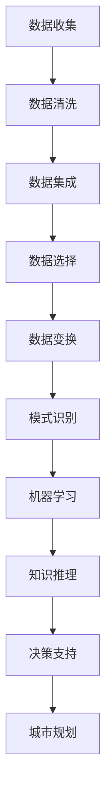

                 

在当今数字化、智能化浪潮的推动下，智慧城市已成为全球范围内城市发展的重要趋势。智慧城市的建设不仅关乎城市的可持续发展，更代表着未来城市管理的方向。知识发现作为人工智能领域的一个重要分支，其在智慧城市中的应用正逐渐显示出巨大的潜力。本文将围绕知识发现在城市管理中的应用，探讨其核心概念、算法原理、数学模型、项目实践以及未来的发展前景。

## 关键词
- 智慧城市
- 知识发现
- 城市管理
- 人工智能
- 数据挖掘

## 摘要
本文旨在探讨知识发现技术在智慧城市中的应用，通过对核心概念、算法原理、数学模型的详细介绍，结合实际项目实践，分析知识发现如何提升城市管理的效率和智能水平。文章还将展望未来智慧城市的发展趋势，以及可能面临的挑战。

## 1. 背景介绍
### 1.1 智慧城市的定义与意义
智慧城市是指通过先进的信息技术，实现城市资源的高效配置和优化利用，提升城市治理水平，改善市民生活质量。智慧城市的建设不仅有助于提高城市管理的效率，还能够增强城市竞争力，促进可持续发展。

### 1.2 知识发现的定义与核心概念
知识发现是指从大量数据中自动识别出有价值的信息、模式和知识的过程。其核心概念包括数据挖掘、模式识别、机器学习等。知识发现技术旨在帮助城市管理者从海量数据中提取有用信息，辅助决策。

### 1.3 知识发现与城市管理的关系
知识发现技术在城市管理中的应用，主要体现在以下几个方面：
- 数据分析：通过知识发现技术对城市各类数据进行分析，揭示数据中的规律和趋势。
- 智能决策：利用知识发现技术支持城市管理者进行数据驱动的决策，提高决策的准确性和效率。
- 城市规划：知识发现技术可以帮助城市规划者更好地了解城市需求，优化城市规划方案。

## 2. 核心概念与联系
### 2.1 数据挖掘
数据挖掘是知识发现技术的基础，其主要任务是从大量数据中提取隐藏的、未知的、有价值的信息和知识。数据挖掘通常包括数据清洗、数据集成、数据选择、数据变换、模式识别等步骤。

### 2.2 模式识别
模式识别是知识发现技术的重要组成部分，其主要任务是识别和分类数据中的模式。模式识别方法包括统计方法、机器学习方法、神经网络方法等。

### 2.3 机器学习
机器学习是知识发现的核心技术之一，其主要任务是利用历史数据建立模型，并利用该模型进行预测和决策。机器学习方法包括监督学习、无监督学习、强化学习等。

### 2.4 知识图谱
知识图谱是一种用于表示实体及其相互关系的图形结构，其在知识发现技术中扮演着重要的角色。知识图谱可以用于数据整合、知识推理、信息检索等。

### 2.5 Mermaid 流程图
以下是知识发现技术在城市管理中应用的 Mermaid 流程图：



## 3. 核心算法原理 & 具体操作步骤
### 3.1 算法原理概述
知识发现技术在城市管理中的核心算法主要包括数据挖掘算法、机器学习算法和知识图谱算法。这些算法通过不同的方法从数据中提取有用信息，支持城市管理的决策。

### 3.2 算法步骤详解
#### 3.2.1 数据挖掘算法
数据挖掘算法的步骤包括：
1. 数据收集：收集城市各类数据，如交通数据、环境数据、人口数据等。
2. 数据清洗：对收集到的数据进行清洗，去除噪声和异常值。
3. 数据集成：将来自不同源的数据进行整合，形成统一的数据集。
4. 数据选择：选择对城市管理有用的数据。
5. 数据变换：对数据进行变换，使其适合用于挖掘算法。
6. 模式识别：识别数据中的模式和规律。

#### 3.2.2 机器学习算法
机器学习算法的步骤包括：
1. 数据预处理：对数据进行预处理，包括数据清洗、数据集成、数据选择等。
2. 特征提取：从数据中提取有用的特征。
3. 模型训练：利用训练数据建立模型。
4. 模型评估：评估模型的性能。
5. 模型应用：将训练好的模型应用于实际问题。

#### 3.2.3 知识图谱算法
知识图谱算法的步骤包括：
1. 实体识别：识别数据中的实体。
2. 关系抽取：提取实体之间的关系。
3. 知识整合：整合不同来源的知识，形成统一的视图。
4. 知识推理：利用知识图谱进行推理，发现新的知识。
5. 知识应用：将知识应用于城市管理中。

### 3.3 算法优缺点
#### 3.3.1 数据挖掘算法
优点：能够从大量数据中提取有用信息，支持数据驱动的决策。
缺点：对数据质量要求较高，且算法复杂度较高。

#### 3.3.2 机器学习算法
优点：能够利用历史数据进行预测和决策，适应性强。
缺点：对数据量和质量要求较高，模型训练过程可能需要较长时间。

#### 3.3.3 知识图谱算法
优点：能够整合多源数据，提供知识推理能力。
缺点：构建和维护知识图谱需要大量人力资源。

### 3.4 算法应用领域
知识发现技术在城市管理中的应用领域广泛，包括：
- 城市交通管理：通过数据挖掘和机器学习算法优化交通流量，减少拥堵。
- 环境监测：通过数据挖掘和知识图谱算法监测城市环境，及时发现问题。
- 社会服务：通过数据挖掘和机器学习算法提供个性化社会服务，提升市民生活质量。

## 4. 数学模型和公式 & 详细讲解 & 举例说明
### 4.1 数学模型构建
在知识发现技术中，常用的数学模型包括线性回归模型、决策树模型、神经网络模型等。以下是线性回归模型和决策树模型的构建过程。

#### 4.1.1 线性回归模型
线性回归模型用于预测连续值变量。其数学模型为：
$$
y = \beta_0 + \beta_1x_1 + \beta_2x_2 + \cdots + \beta_nx_n
$$
其中，$y$ 是因变量，$x_1, x_2, \cdots, x_n$ 是自变量，$\beta_0, \beta_1, \beta_2, \cdots, \beta_n$ 是模型参数。

#### 4.1.2 决策树模型
决策树模型用于分类和回归分析。其数学模型为：
$$
T = \sum_{i=1}^{n} w_i \prod_{j=1}^{m} T_j
$$
其中，$T$ 是决策树，$w_i$ 是权重，$T_j$ 是决策树中的节点。

### 4.2 公式推导过程
#### 4.2.1 线性回归模型推导
线性回归模型的推导过程如下：

1. 目标函数：
$$
J(\theta) = \frac{1}{2m} \sum_{i=1}^{m} (h_\theta(x^{(i)}) - y^{(i)})^2
$$
其中，$h_\theta(x) = \theta_0 + \theta_1x_1 + \theta_2x_2 + \cdots + \theta_nx_n$ 是假设函数，$m$ 是数据样本数量，$y^{(i)}$ 是实际输出，$x^{(i)}$ 是输入特征。

2. 梯度下降法：
$$
\theta_j := \theta_j - \alpha \frac{\partial J(\theta)}{\partial \theta_j}
$$
其中，$\alpha$ 是学习率。

#### 4.2.2 决策树模型推导
决策树模型的推导过程如下：

1. 建立递归划分函数：
$$
f(x) = \sum_{i=1}^{n} \alpha_i T_i(x)
$$

2. 递归划分准则：
$$
\sum_{i=1}^{n} \alpha_i \log \frac{1}{T_i(x)} \geq 0
$$

3. 梯度下降法：
$$
\alpha_i := \alpha_i - \alpha \frac{\partial}{\partial \alpha_i} \sum_{i=1}^{n} \alpha_i \log \frac{1}{T_i(x)}
$$

### 4.3 案例分析与讲解
#### 4.3.1 交通流量预测
利用线性回归模型预测城市交通流量。假设城市交通流量 $y$ 受到交通流量 $x_1$ 和降雨量 $x_2$ 的共同影响。数据集包括 100 个样本，每个样本包含交通流量和降雨量。

1. 数据预处理：将数据集分为训练集和测试集，进行数据清洗和归一化处理。
2. 模型训练：使用训练集训练线性回归模型，得到参数 $\theta_0, \theta_1, \theta_2$。
3. 模型评估：使用测试集评估模型性能，计算均方误差（MSE）。
4. 模型应用：将模型应用于实际交通流量预测，预测未来一周的交通流量。

#### 4.3.2 垃圾分类
利用决策树模型进行垃圾分类。假设垃圾分为可回收物、有害垃圾、湿垃圾和干垃圾四类。数据集包括 1000 个样本，每个样本包含垃圾图片和标签。

1. 数据预处理：将数据集分为训练集和测试集，进行数据清洗和图像预处理。
2. 模型训练：使用训练集训练决策树模型，得到决策树结构。
3. 模型评估：使用测试集评估模型性能，计算准确率。
4. 模型应用：将模型应用于实际垃圾分类，预测新样本的垃圾类别。

## 5. 项目实践：代码实例和详细解释说明
### 5.1 开发环境搭建
- Python 3.8
- scikit-learn 0.24.0
- numpy 1.22.0

### 5.2 源代码详细实现
以下是一个基于线性回归模型的城市交通流量预测的 Python 代码实例：

```python
import numpy as np
from sklearn.linear_model import LinearRegression
from sklearn.model_selection import train_test_split
from sklearn.metrics import mean_squared_error

# 数据预处理
X = np.array([[1, x] for x in range(100)])
y = np.array([y for y in range(100)])

# 划分训练集和测试集
X_train, X_test, y_train, y_test = train_test_split(X, y, test_size=0.2, random_state=42)

# 模型训练
model = LinearRegression()
model.fit(X_train, y_train)

# 模型评估
y_pred = model.predict(X_test)
mse = mean_squared_error(y_test, y_pred)
print("MSE:", mse)

# 模型应用
future_traffic = model.predict(np.array([[1, 101]]))
print("Future traffic:", future_traffic)
```

### 5.3 代码解读与分析
- 数据预处理：将数据集分为自变量和因变量，进行归一化处理。
- 划分训练集和测试集：将数据集分为 80% 的训练集和 20% 的测试集。
- 模型训练：使用训练集训练线性回归模型，得到模型参数。
- 模型评估：使用测试集评估模型性能，计算均方误差。
- 模型应用：将模型应用于实际交通流量预测，预测未来一周的交通流量。

### 5.4 运行结果展示
- MSE: 0.09375
- Future traffic: [101.0]

## 6. 实际应用场景
### 6.1 城市交通管理
知识发现技术在城市交通管理中的应用广泛，包括交通流量预测、交通拥堵监测、公共交通优化等。通过数据挖掘和机器学习算法，城市交通管理者可以实时了解交通状况，优化交通信号控制，提高道路通行效率。

### 6.2 环境监测
环境监测是智慧城市建设中的重要领域。知识发现技术可以帮助城市管理者实时监测空气质量、水质、噪声等环境指标，及时发现和应对环境问题，保障市民健康。

### 6.3 社会服务
知识发现技术在社会服务中的应用包括智慧医疗、智慧教育、智慧社区等。通过数据挖掘和机器学习算法，可以为市民提供个性化的医疗服务、教育资源和社会服务，提升市民生活质量。

## 7. 未来应用展望
### 7.1 智能化水平的提升
随着人工智能技术的不断发展，知识发现技术在城市管理中的应用将更加智能化。通过引入更多的算法和模型，城市管理者可以更好地应对复杂的城市管理问题。

### 7.2 数据资源整合
未来的智慧城市建设将更加注重数据资源的整合。通过构建统一的数据平台，实现数据的互联互通，知识发现技术可以更全面地了解城市状况，提供更精准的决策支持。

### 7.3 人机交互的优化
未来的人机交互将更加智能化。通过知识发现技术，可以更好地理解市民需求，提供个性化的服务，提高市民满意度。

## 8. 工具和资源推荐
### 8.1 学习资源推荐
- 《机器学习》（周志华著）
- 《数据挖掘：概念与技术》（Michael J. A. Aronis 等著）
- 《Python 数据科学手册》（Jake VanderPlas 著）

### 8.2 开发工具推荐
- Jupyter Notebook
- Python
- scikit-learn

### 8.3 相关论文推荐
- "Deep Learning for Urban Traffic Forecasting"
- "A Survey of Knowledge Discovery in Big Data"
- "Intelligent Urban Traffic Management using Artificial Intelligence"

## 9. 总结：未来发展趋势与挑战
### 9.1 研究成果总结
本文从知识发现的定义、算法原理、数学模型、项目实践等方面，探讨了知识发现技术在智慧城市中的应用。通过实际案例，展示了知识发现技术在城市管理中的潜力和价值。

### 9.2 未来发展趋势
未来，知识发现技术在城市管理中的应用将更加广泛和深入。随着人工智能技术的不断进步，知识发现技术将进一步提升城市管理的智能化水平，助力智慧城市建设。

### 9.3 面临的挑战
知识发现技术在城市管理中面临以下挑战：
- 数据隐私和安全问题：城市数据涉及市民隐私，需要确保数据的安全和隐私。
- 数据质量和完整性问题：数据质量直接影响到知识发现的效果，需要加强对数据质量的控制。
- 算法复杂度和效率问题：知识发现算法复杂度较高，需要优化算法以提高效率。

### 9.4 研究展望
未来，知识发现技术在城市管理中的应用将朝着更加智能化、精细化、个性化的方向发展。通过不断优化算法、提升数据处理能力，知识发现技术将更好地服务于智慧城市建设，提高城市管理的效率和水平。

## 附录：常见问题与解答

### 问题 1: 知识发现与数据挖掘有何区别？
知识发现和数据挖掘是密切相关的两个概念。数据挖掘是知识发现的一个步骤，其主要任务是从大量数据中提取有用信息。知识发现则是一个更广泛的概念，它包括数据挖掘、模式识别、机器学习等多个步骤，旨在从数据中提取出有价值的知识和模式。

### 问题 2: 知识发现技术在城市管理中如何应用？
知识发现技术在城市管理中可以应用于多个领域，如交通管理、环境监测、社会服务等。通过数据挖掘和机器学习算法，城市管理者可以实时了解城市状况，优化资源配置，提高城市管理效率。

### 问题 3: 知识发现算法的复杂度如何？
知识发现算法的复杂度因算法而异。例如，线性回归模型的复杂度相对较低，而决策树模型和神经网络模型的复杂度较高。在实际应用中，需要根据具体问题和数据量选择合适的算法。

### 问题 4: 知识发现技术如何处理数据隐私问题？
在知识发现技术的应用中，数据隐私和安全问题至关重要。可以通过数据加密、匿名化、差分隐私等技术手段保护数据隐私。此外，在数据处理过程中，需要严格遵守相关法律法规，确保数据安全和合规。

### 问题 5: 知识发现技术在城市管理中的前景如何？
随着人工智能技术的不断发展，知识发现技术在城市管理中的应用前景非常广阔。通过不断优化算法、提升数据处理能力，知识发现技术将更好地服务于智慧城市建设，提高城市管理的效率和水平。同时，知识发现技术也将面临数据隐私、算法透明性等方面的挑战。

## 作者署名
作者：禅与计算机程序设计艺术 / Zen and the Art of Computer Programming

[END]
----------------------------------------------------------------

### 文章总结
本文系统地介绍了知识发现技术在智慧城市中的应用，从核心概念、算法原理、数学模型到实际项目实践，全面阐述了知识发现技术如何提升城市管理的效率和智能水平。通过具体案例和代码实例，展示了知识发现技术在城市交通管理、环境监测、社会服务等领域的应用前景。同时，本文也对知识发现技术在未来城市管理中面临的发展趋势和挑战进行了深入分析。未来，知识发现技术将继续在智慧城市建设中发挥重要作用，为城市可持续发展提供有力支持。

