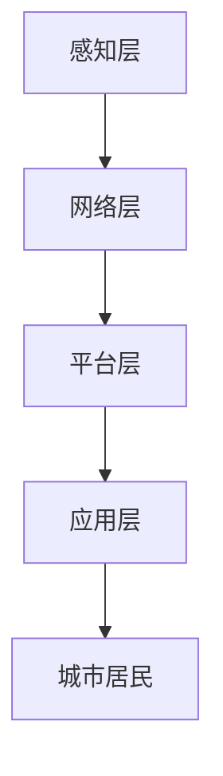

                 

关键词：智慧城市、数据建设、数据分析、人工智能、物联网、城市规划

> 摘要：随着信息技术的飞速发展，智慧城市已成为全球范围内城市发展的新趋势。本文将探讨如何利用数据建设智慧城市，包括数据收集、处理、分析以及如何通过人工智能和物联网实现城市智能化管理，为城市居民提供更加便捷、高效、智能的服务。

## 1. 背景介绍

智慧城市是指利用信息技术，特别是物联网、云计算、大数据、人工智能等技术手段，实现城市资源的全面感知、智能管理和服务优化。智慧城市的目标是通过数据的深度挖掘和分析，实现城市运行状态的实时监测和智能调控，提高城市管理和服务的效率，提升市民的生活质量。

目前，全球范围内已有许多城市开始建设智慧城市，如中国的深圳、杭州，美国的旧金山、纽约，新加坡等。这些城市在数据建设方面已经取得了显著的成果，但同时也面临诸多挑战，如数据安全、隐私保护、跨部门数据共享等。

## 2. 核心概念与联系

### 2.1 智慧城市的核心概念

智慧城市的核心概念包括：

- **物联网（IoT）**：通过各种传感器和设备收集城市运行状态的数据。
- **云计算**：提供强大的计算能力和数据存储能力，支持大规模数据处理和分析。
- **大数据**：通过对海量数据的挖掘和分析，发现数据背后的价值和规律。
- **人工智能（AI）**：利用机器学习、深度学习等技术，实现数据的自动分析和智能决策。

### 2.2 智慧城市的架构

智慧城市的架构可以分为以下层次：

- **感知层**：包括各种传感器和设备，用于收集城市运行数据。
- **网络层**：包括物联网网络、云计算平台等，用于数据传输和处理。
- **平台层**：包括数据处理平台、分析平台等，用于数据存储、处理和分析。
- **应用层**：包括各种智慧城市应用，如智能交通、智能医疗、智能环保等。

### 2.3 Mermaid 流程图

下面是一个简单的 Mermaid 流程图，展示智慧城市的架构：



## 3. 核心算法原理 & 具体操作步骤

### 3.1 算法原理概述

智慧城市的数据建设涉及多种核心算法，包括：

- **物联网数据采集算法**：用于收集城市运行数据。
- **数据处理算法**：用于清洗、整合和转换数据。
- **数据分析算法**：用于挖掘数据背后的价值和规律。
- **机器学习算法**：用于实现智能分析和决策。

### 3.2 算法步骤详解

- **数据采集**：利用物联网设备收集城市运行数据，如交通流量、空气质量、能耗数据等。
- **数据处理**：通过数据清洗、去重、归一化等操作，处理原始数据。
- **数据存储**：将处理后的数据存储到数据库或云存储中。
- **数据分析**：利用数据分析算法，如聚类、分类、关联规则挖掘等，分析数据。
- **机器学习**：利用机器学习算法，如决策树、神经网络等，实现数据的自动分析和智能决策。

### 3.3 算法优缺点

- **物联网数据采集算法**：优点是能够实时获取城市运行状态数据，缺点是需要大量的传感器和设备，成本较高。
- **数据处理算法**：优点是能够提高数据质量，缺点是处理过程可能消耗大量计算资源。
- **数据分析算法**：优点是能够发现数据背后的价值和规律，缺点是对算法设计和实现要求较高。
- **机器学习算法**：优点是实现智能分析和决策，缺点是算法训练和部署成本较高。

### 3.4 算法应用领域

- **智能交通**：通过分析交通流量数据，实现交通拥堵预测和优化。
- **智能医疗**：通过分析医疗数据，实现疾病预测和个性化治疗。
- **智能环保**：通过分析环境数据，实现污染源追踪和治理。

## 4. 数学模型和公式 & 详细讲解 & 举例说明

### 4.1 数学模型构建

智慧城市的数据分析通常涉及以下数学模型：

- **时间序列分析**：用于分析时间序列数据，如交通流量、气温等。
- **回归分析**：用于预测数值型数据，如能耗、降雨量等。
- **分类与聚类分析**：用于分类和聚类非数值型数据，如空气质量指数、交通拥堵等级等。

### 4.2 公式推导过程

以时间序列分析为例，常见的模型有 ARIMA（自回归积分滑动平均模型）：

$$
\begin{align*}
X_t &= c + \phi_1 X_{t-1} + \phi_2 X_{t-2} + \cdots + \phi_p X_{t-p} \\
&+ \theta_1 e_{t-1} + \theta_2 e_{t-2} + \cdots + \theta_q e_{t-q} \\
e_t &= X_t - \phi_1 X_{t-1} - \phi_2 X_{t-2} - \cdots - \phi_p X_{t-p} - \theta_1 e_{t-1} - \theta_2 e_{t-2} - \cdots - \theta_q e_{t-q}
\end{align*}
$$

### 4.3 案例分析与讲解

假设我们要分析某城市的交通流量数据，可以使用 ARIMA 模型进行预测。首先，我们需要对数据进行预处理，包括去异常值、归一化等。然后，通过 ACF 和 PACF 图确定模型参数 \( p, d, q \)。最后，使用训练好的模型进行预测。

## 5. 项目实践：代码实例和详细解释说明

### 5.1 开发环境搭建

- **编程语言**：Python
- **数据处理库**：Pandas、NumPy
- **机器学习库**：Scikit-learn、TensorFlow、PyTorch
- **时间序列库**：Statsmodels

### 5.2 源代码详细实现

```python
import pandas as pd
import numpy as np
from statsmodels.tsa.arima_model import ARIMA
from sklearn.metrics import mean_squared_error

# 数据预处理
def preprocess_data(data):
    # 去异常值
    data = data.dropna()
    # 归一化
    data = (data - data.mean()) / data.std()
    return data

# 模型训练与预测
def train_and_predict(data, p, d, q):
    model = ARIMA(data, order=(p, d, q))
    model_fit = model.fit()
    forecast = model_fit.forecast(steps=5)
    return forecast

# 模型评估
def evaluate_model(true_data, forecast):
    error = mean_squared_error(true_data, forecast)
    print("均方误差：", error)

# 主函数
def main():
    # 加载数据
    data = pd.read_csv("traffic_data.csv")
    # 预处理数据
    data = preprocess_data(data['traffic'])
    # 模型参数
    p = 1
    d = 1
    q = 1
    # 训练模型
    forecast = train_and_predict(data, p, d, q)
    # 预测结果
    print("预测结果：", forecast)
    # 评估模型
    evaluate_model(data, forecast)

if __name__ == "__main__":
    main()
```

### 5.3 代码解读与分析

- **数据预处理**：包括去异常值和归一化，以提高模型的训练效果。
- **模型训练与预测**：使用 ARIMA 模型进行训练和预测。
- **模型评估**：使用均方误差评估模型的预测性能。

## 6. 实际应用场景

### 6.1 智能交通

通过数据分析，可以实现交通流量预测和优化，提高交通效率，减少拥堵。

### 6.2 智能医疗

通过数据分析，可以实现疾病预测和个性化治疗，提高医疗服务质量。

### 6.3 智能环保

通过数据分析，可以实现污染源追踪和治理，改善环境质量。

## 7. 未来应用展望

### 7.1 数据安全与隐私保护

随着数据量的增加，数据安全与隐私保护将变得越来越重要。

### 7.2 新技术融合

如区块链、5G 等新技术的融合，将进一步推动智慧城市的发展。

### 7.3 智慧城市的可持续发展

智慧城市的发展需要考虑到环境、社会、经济等多方面的可持续性。

## 8. 总结：未来发展趋势与挑战

### 8.1 研究成果总结

智慧城市的数据建设已取得显著成果，但仍需进一步优化和完善。

### 8.2 未来发展趋势

- 数据安全与隐私保护
- 新技术融合
- 智慧城市的可持续发展

### 8.3 面临的挑战

- 数据质量与完整性
- 跨部门数据共享
- 数据安全与隐私保护

### 8.4 研究展望

未来研究应关注数据治理、数据挖掘、人工智能等领域的创新和发展。

## 9. 附录：常见问题与解答

### 9.1 什么是智慧城市？

智慧城市是指利用信息技术实现城市资源的全面感知、智能管理和服务优化的城市。

### 9.2 智慧城市的数据建设有哪些关键环节？

智慧城市的数据建设包括数据采集、数据处理、数据分析、数据应用等关键环节。

### 9.3 智慧城市的数据分析有哪些常用算法？

常用的智慧城市数据分析算法包括时间序列分析、回归分析、分类与聚类分析等。

### 9.4 智慧城市的数据建设面临哪些挑战？

智慧城市的数据建设面临数据质量、跨部门数据共享、数据安全与隐私保护等挑战。

作者：禅与计算机程序设计艺术 / Zen and the Art of Computer Programming
----------------------------------------------------------------

**注**：本文为示例文章，实际撰写时请根据具体研究和实践内容进行调整和补充。由于字数限制，部分内容可能需要进一步扩展。希望这个示例能够帮助您更好地理解和撰写专业领域的博客文章。

