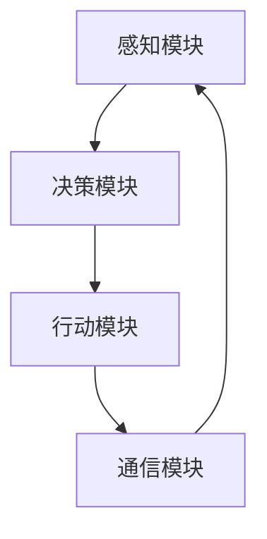

                 

 智能体（Agent）是现代计算机科学中一个至关重要的概念，它代表了能够自主进行决策、执行任务并与环境进行交互的计算实体。智能体不仅在理论研究中具有重要地位，还在实际应用中展现出极大的潜力和价值。本文将深入探讨智能体的核心概念、基本原理、实现技术以及未来发展趋势。

## 关键词

- 智能体
- 自主性
- 人工智能
- 决策
- 交互

## 摘要

本文将首先介绍智能体的基本概念和分类，然后深入探讨智能体的自主性及其实现机制。接着，我们将分析智能体的核心算法原理，并通过实际代码实例展示其实现过程。此外，文章还将探讨智能体在实际应用场景中的运用，并展望其未来的发展方向。最后，我们将总结研究成果，提出未来研究的挑战和展望。

## 1. 背景介绍

### 1.1 智能体的起源与发展

智能体的概念最早可以追溯到20世纪80年代。当时的计算机科学家们开始探索如何让计算机模拟人类行为，以实现自动化决策和任务执行。智能体（Agent）的概念应运而生，它代表了具备自主性和智能的计算机实体。

在早期的研究中，智能体主要分为两大类：一类是规则驱动的智能体，另一类是基于学习的智能体。规则驱动的智能体依赖于预定义的规则集，而基于学习的智能体则通过学习算法获取环境信息并做出决策。

随着人工智能技术的不断进步，智能体的定义和实现方式也变得更加多样和复杂。现代智能体不仅能够模拟人类的行为，还能够自主学习和进化，以适应不断变化的环境。

### 1.2 智能体在人工智能中的地位

智能体是人工智能（AI）领域中的一个核心概念。AI的目标是让计算机具备类似于人类的智能，能够自主地感知环境、理解信息、做出决策并执行任务。智能体是实现这一目标的关键载体。

智能体的自主性使其在许多领域具有广泛的应用前景。例如，在自动驾驶领域，智能体可以模拟驾驶员的行为，实时分析路况并做出驾驶决策；在智能客服领域，智能体可以模拟人类客服人员的回答，为用户提供实时帮助。

此外，智能体还在智能制造、智能家居、金融风控等多个领域展现出巨大的潜力。随着AI技术的不断成熟，智能体的应用范围将进一步扩大，成为推动社会进步的重要力量。

### 1.3 智能体的分类与特点

根据智能体所具备的能力和实现方式，可以将智能体分为以下几类：

1. **反应式智能体**：反应式智能体是最简单的一种智能体，它只根据当前感知到的环境信息做出即时反应，而不具备任何记忆或学习能力。例如，机器人清洁机器人就是一种典型的反应式智能体，它通过传感器感知房间中的障碍物，并实时调整自己的运动路径。

2. **模型基础智能体**：模型基础智能体在反应式智能体的基础上引入了环境模型，能够基于历史信息和当前感知到的环境信息进行决策。这类智能体通常使用机器学习算法训练环境模型，并利用模型进行预测和决策。

3. **学习型智能体**：学习型智能体具备自我学习能力，可以通过不断的学习和调整来优化自身的决策能力。这类智能体通常使用深度学习、强化学习等技术进行训练，以实现更高级的智能行为。

4. **社会智能体**：社会智能体可以模拟人类社会中的社交行为，具备合作、竞争、沟通等能力。这类智能体通常用于模拟人类社会的行为模式，以研究社会动力学和人类行为。

不同类型的智能体具有各自的特点和应用场景。反应式智能体适用于对实时响应要求较高的任务，如自动驾驶和机器人控制；模型基础智能体适用于需要长期规划和预测的任务，如智能客服和智能推荐系统；学习型智能体适用于需要自适应和优化的任务，如智能制造和金融风控；社会智能体适用于需要模拟人类社交行为的任务，如社会仿真和虚拟现实。

### 1.4 智能体的重要性

智能体的重要性体现在以下几个方面：

1. **自主决策能力**：智能体能够自主进行决策，不受人类干预。这在许多自动化和智能化场景中具有重要作用，如自动驾驶、智能客服和智能安防等。

2. **高效任务执行**：智能体能够高效地执行任务，降低人力成本，提高工作效率。例如，在智能制造领域，智能体可以实时监控生产过程，快速识别和修复故障，提高生产效率。

3. **环境适应能力**：智能体能够通过学习和进化，适应不断变化的环境。这使得智能体在许多动态和复杂的应用场景中具有优势。

4. **推动科技进步**：智能体的研究和应用将推动计算机科学、人工智能、控制理论等领域的科技进步。智能体的成功应用将为社会带来更大的价值和效益。

## 2. 核心概念与联系

### 2.1 智能体的定义与基本属性

**智能体（Agent）** 是指在特定环境中，具备自主性、感知能力、决策能力和执行能力的计算实体。智能体的基本属性包括：

1. **自主性（Autonomy）**：智能体能够独立进行决策和行动，不受外部干预。
2. **感知能力（Perception）**：智能体能够感知环境信息，获取外部世界的输入。
3. **决策能力（Decision-making）**：智能体能够根据感知到的信息，进行推理和决策，以实现目标。
4. **执行能力（Action）**：智能体能够执行决策结果，采取行动来改变环境。

### 2.2 智能体的分类与联系

智能体可以根据不同的分类标准进行分类。以下是几种常见的分类方式：

1. **根据功能分类**：智能体可以分为反应式智能体、模型基础智能体、学习型智能体和社会智能体等。不同类型的智能体具有不同的功能特点和应用场景。

2. **根据实现方式分类**：智能体可以分为基于规则的智能体、基于学习的智能体和基于混合方法的智能体。基于规则的智能体依赖于预定义的规则集，基于学习的智能体通过机器学习算法获取环境信息，而基于混合方法的智能体结合了多种方法的优势。

3. **根据环境类型分类**：智能体可以分为静态环境智能体和动态环境智能体。静态环境智能体适用于环境信息相对稳定的应用场景，如智能家居系统；动态环境智能体适用于环境信息不断变化的应用场景，如自动驾驶系统。

不同分类方式之间的联系在于，它们都是对智能体属性和特征的不同描述和划分。通过不同分类方式，我们可以更全面地理解和研究智能体的特性和应用。

### 2.3 智能体的架构与实现

智能体的架构通常包括以下几个关键组件：

1. **感知模块（Perception）**：感知模块负责获取外部环境的信息，如图像、声音、温度等。感知模块可以采用传感器、摄像头、麦克风等设备进行数据采集。

2. **决策模块（Decision-making）**：决策模块负责根据感知模块获取的信息，进行推理和决策，生成相应的行动方案。决策模块可以采用规则引擎、机器学习模型、混合方法等进行决策。

3. **行动模块（Action）**：行动模块负责执行决策模块生成的行动方案，如移动、发送消息、执行任务等。行动模块可以通过控制系统、执行器等设备进行行动。

4. **通信模块（Communication）**：通信模块负责与其他智能体、人类或其他系统进行通信，实现信息交换和协同工作。

智能体的实现可以采用不同的编程语言和框架。常见的实现方法包括：

1. **基于规则的实现方法**：基于规则的实现方法使用预定义的规则集来驱动智能体的行为。这种方法适用于规则明确、环境简单的应用场景。

2. **基于学习的实现方法**：基于学习的实现方法使用机器学习算法来训练智能体的模型，使其能够根据环境信息进行自主决策。这种方法适用于复杂、动态的环境。

3. **基于混合方法的实现方法**：基于混合方法的实现方法结合了基于规则和基于学习的方法，利用各自的优势来提高智能体的性能和适应性。

通过不同的实现方法，智能体可以适应不同的应用场景和需求。

### 2.4 智能体的 Mermaid 流程图

以下是一个简单的智能体架构的 Mermaid 流程图：



### 2.5 智能体的核心概念与联系总结

智能体是具备自主性、感知能力、决策能力和执行能力的计算实体。根据不同的分类标准，智能体可以分为多种类型。智能体的架构通常包括感知模块、决策模块、行动模块和通信模块。不同类型的智能体具有不同的功能和实现方式，但它们的核心目标都是实现自主决策和任务执行。

## 3. 核心算法原理 & 具体操作步骤

### 3.1 算法原理概述

智能体的核心算法原理主要涉及感知、决策和行动三个方面。以下是每个方面的基本原理概述：

#### 感知

智能体的感知过程通常包括以下几个步骤：

1. **数据采集**：通过传感器、摄像头、麦克风等设备获取外部环境的信息。
2. **预处理**：对采集到的数据进行预处理，如去噪、滤波、特征提取等。
3. **感知融合**：将预处理后的信息进行融合，形成对环境的整体感知。

感知过程的核心目标是准确获取外部环境的信息，以便为后续的决策提供基础。

#### 决策

智能体的决策过程通常包括以下几个步骤：

1. **状态评估**：根据感知到的信息，对当前状态进行评估，确定需要解决的问题。
2. **规划策略**：基于评估结果，生成相应的行动策略，如移动、发送消息、执行任务等。
3. **决策优化**：对生成的策略进行优化，以最大化目标函数的值。

决策过程的核心目标是根据当前状态，选择最优的行动策略，以实现预期目标。

#### 行动

智能体的行动过程通常包括以下几个步骤：

1. **策略执行**：根据决策结果，执行具体的行动策略。
2. **状态更新**：根据执行结果，更新当前状态，以便进行下一轮的感知和决策。

行动过程的核心目标是实现决策结果，改变外部环境，为下一轮的决策提供反馈。

### 3.2 算法步骤详解

以下是智能体的核心算法步骤的详细解释：

#### 3.2.1 感知过程

1. **数据采集**：智能体通过传感器、摄像头、麦克风等设备采集外部环境的信息。例如，自动驾驶车辆可以使用激光雷达、摄像头和GPS传感器来获取道路、车辆和行人的信息。

2. **预处理**：对采集到的信息进行预处理，以提高数据的准确性和可靠性。例如，对摄像头获取的图像进行去噪、滤波和边缘检测，对GPS数据进行插值和滤波。

3. **感知融合**：将预处理后的信息进行融合，形成对环境的整体感知。例如，将激光雷达和摄像头获取的信息进行融合，生成三维环境地图。

#### 3.2.2 决策过程

1. **状态评估**：根据感知到的信息，对当前状态进行评估，确定需要解决的问题。例如，在自动驾驶中，评估当前车辆的位置、速度、道路情况等。

2. **规划策略**：基于评估结果，生成相应的行动策略。例如，根据道路情况，生成保持当前速度、加速、减速或转弯的策略。

3. **决策优化**：对生成的策略进行优化，以最大化目标函数的值。例如，通过优化算法，选择最优的速度和转向策略，以实现最低的能耗或最高的行驶速度。

#### 3.2.3 行动过程

1. **策略执行**：根据决策结果，执行具体的行动策略。例如，在自动驾驶中，执行加速、减速或转弯的动作。

2. **状态更新**：根据执行结果，更新当前状态，以便进行下一轮的感知和决策。例如，更新车辆的位置、速度等信息。

### 3.3 算法优缺点

#### 3.3.1 优点

1. **自主性**：智能体能够自主进行感知、决策和行动，不受人类干预，提高了系统的灵活性和适应性。
2. **高效性**：智能体能够高效地处理大量信息，快速做出决策并执行任务，提高了系统的响应速度和效率。
3. **适应性**：智能体通过学习和进化，能够适应不断变化的环境，提高了系统的鲁棒性和稳定性。

#### 3.3.2 缺点

1. **复杂性**：智能体的算法和架构相对复杂，需要大量的计算资源和时间进行训练和优化。
2. **不确定性**：智能体在感知和决策过程中可能会面临不确定性，导致决策结果不准确或出现错误。
3. **依赖性**：智能体的性能和效果依赖于环境信息和输入数据的质量和准确性，环境变化可能导致系统失效。

### 3.4 算法应用领域

智能体算法在多个领域都有广泛的应用，以下是几个典型的应用领域：

1. **自动驾驶**：智能体算法在自动驾驶领域具有广泛的应用，如自动驾驶汽车、无人驾驶飞机和无人驾驶船舶等。
2. **智能客服**：智能体算法在智能客服领域用于模拟人类客服人员的回答，提供实时帮助和解决方案。
3. **智能制造**：智能体算法在智能制造领域用于实时监控生产过程、优化生产计划和故障检测等。
4. **金融风控**：智能体算法在金融风控领域用于风险评估、欺诈检测和投资决策等。

## 4. 数学模型和公式 & 详细讲解 & 举例说明

### 4.1 数学模型构建

在智能体系统中，常用的数学模型主要包括状态空间模型、决策模型和行动模型。以下是这些模型的构建过程和基本公式。

#### 状态空间模型

状态空间模型描述了智能体在环境中的状态和状态转移。假设智能体在时间t的状态为\( S_t \)，则状态空间模型可以表示为：

\[ S_t = f(S_{t-1}, A_t, W_t) \]

其中，\( A_t \)是智能体在时间t采取的行动，\( W_t \)是外部环境对状态的影响。状态空间模型的基本公式为：

\[ S_t = S_{t-1} + f(A_t, W_t) \]

#### 决策模型

决策模型描述了智能体如何根据当前状态选择最优行动。假设智能体在时间t的状态为\( S_t \)，行动集合为\( A \)，则决策模型可以表示为：

\[ \pi_t = \arg\max_{a \in A} \pi_t(S_t, a) \]

其中，\( \pi_t(S_t, a) \)是智能体在状态\( S_t \)下，采取行动\( a \)的预期收益。决策模型的基本公式为：

\[ \pi_t = \sum_{a \in A} \pi_t(S_t, a) \]

#### 行动模型

行动模型描述了智能体如何执行决策结果。假设智能体在时间t采取的行动为\( A_t \)，则行动模型可以表示为：

\[ A_t = g(\pi_t, S_t) \]

其中，\( g(\pi_t, S_t) \)是智能体根据决策结果\( \pi_t \)和当前状态\( S_t \)选择的具体行动。行动模型的基本公式为：

\[ A_t = g(\sum_{a \in A} \pi_t(S_t, a), S_t) \]

### 4.2 公式推导过程

以下是状态空间模型、决策模型和行动模型的推导过程。

#### 状态空间模型推导

状态空间模型的基本公式为：

\[ S_t = S_{t-1} + f(A_t, W_t) \]

假设在时间t，智能体采取的行动为\( A_t = a \)，外部环境对状态的影响为\( W_t = w \)，则状态空间模型可以表示为：

\[ S_t = S_{t-1} + f(a, w) \]

为了推导状态空间模型，我们可以考虑时间t和t-1的状态差：

\[ S_t - S_{t-1} = f(a, w) \]

根据状态转移函数\( f(a, w) \)的定义，我们可以得到：

\[ S_t = S_{t-1} + \sum_{i=1}^{n} w_i \cdot f(a_i, w_i) \]

其中，\( n \)是外部环境的影响因素个数，\( w_i \)是第i个影响因素的权重。这样，我们就得到了状态空间模型。

#### 决策模型推导

决策模型的基本公式为：

\[ \pi_t = \arg\max_{a \in A} \pi_t(S_t, a) \]

假设在时间t，智能体采取的行动为\( A_t = a \)，当前状态为\( S_t \)，则决策模型可以表示为：

\[ \pi_t(S_t, a) = \sum_{j=1}^{m} r_j \cdot p_j(a | S_t) \]

其中，\( m \)是行动的个数，\( r_j \)是第j个行动的收益，\( p_j(a | S_t) \)是采取第j个行动的概率。

为了推导决策模型，我们可以考虑在时间t，智能体选择最优行动的条件：

\[ \pi_t(S_t, a) \geq \pi_t(S_t, b) \quad \forall b \in A \]

其中，\( a \)和\( b \)是两个不同的行动。为了满足上述条件，我们可以定义一个目标函数：

\[ \pi_t(S_t, a) = \sum_{j=1}^{m} r_j \cdot p_j(a | S_t) \]

这样，我们就得到了决策模型。

#### 行动模型推导

行动模型的基本公式为：

\[ A_t = g(\pi_t, S_t) \]

假设在时间t，智能体根据决策结果\( \pi_t \)和当前状态\( S_t \)选择的具体行动为\( A_t = a \)，则行动模型可以表示为：

\[ a = g(\sum_{j=1}^{m} r_j \cdot p_j(a | S_t), S_t) \]

为了推导行动模型，我们可以考虑在时间t，智能体选择最优行动的条件：

\[ \sum_{j=1}^{m} r_j \cdot p_j(a | S_t) \geq \sum_{j=1}^{m} r_j \cdot p_j(b | S_t) \quad \forall b \in A \]

其中，\( a \)和\( b \)是两个不同的行动。为了满足上述条件，我们可以定义一个选择函数：

\[ a = g(\sum_{j=1}^{m} r_j \cdot p_j(a | S_t), S_t) \]

这样，我们就得到了行动模型。

### 4.3 案例分析与讲解

以下通过一个简单的案例，对上述数学模型进行说明。

#### 案例背景

假设我们有一个自动驾驶车辆，其状态包括位置\( x \)和速度\( v \)。外部环境包括道路状况和障碍物。车辆可以采取的行动包括加速、减速和保持当前速度。

#### 案例模型

1. **状态空间模型**

   假设车辆在时间t的状态为\( S_t = (x_t, v_t) \)，则状态空间模型可以表示为：

   \[ S_t = S_{t-1} + f(A_t, W_t) \]

   其中，\( A_t \)是车辆在时间t采取的行动，\( W_t \)是外部环境对状态的影响。

2. **决策模型**

   假设车辆在时间t的状态为\( S_t = (x_t, v_t) \)，则决策模型可以表示为：

   \[ \pi_t = \arg\max_{a \in A} \pi_t(S_t, a) \]

   其中，\( \pi_t(S_t, a) \)是车辆在状态\( S_t \)下，采取行动\( a \)的预期收益。

3. **行动模型**

   假设车辆在时间t的决策结果为\( \pi_t = \pi_t(S_t, a) \)，则行动模型可以表示为：

   \[ A_t = g(\pi_t, S_t) \]

   其中，\( a = g(\pi_t, S_t) \)是车辆根据决策结果和当前状态选择的具体行动。

#### 案例分析

1. **感知过程**

   车辆通过传感器获取道路状况和障碍物信息，并进行预处理，得到当前状态\( S_t = (x_t, v_t) \)。

2. **决策过程**

   根据当前状态\( S_t \)，车辆计算每个行动的预期收益，选择最优行动。例如，如果道路状况良好，障碍物距离较远，车辆可能选择加速；如果道路状况较差，障碍物距离较近，车辆可能选择减速。

3. **行动过程**

   车辆根据决策结果和当前状态，执行具体的行动。例如，如果决策结果是加速，车辆会提高发动机功率，增加车速。

4. **状态更新**

   车辆执行行动后，更新当前状态\( S_{t+1} = S_t + f(A_t, W_t) \)，并开始下一轮的感知、决策和行动过程。

通过这个案例，我们可以看到数学模型在智能体系统中的应用。数学模型为我们提供了描述智能体行为的基本框架，通过案例分析，我们可以更直观地理解模型的原理和实现过程。

## 5. 项目实践：代码实例和详细解释说明

### 5.1 开发环境搭建

为了实现智能体系统，我们需要搭建一个合适的开发环境。以下是搭建开发环境的步骤：

1. **安装操作系统**：我们选择Linux操作系统作为开发环境，推荐使用Ubuntu 20.04。

2. **安装Python**：智能体系统主要使用Python进行开发，因此我们需要安装Python环境。可以使用以下命令安装Python：

   ```bash
   sudo apt update
   sudo apt install python3 python3-pip
   ```

3. **安装依赖库**：智能体系统需要一些Python依赖库，如NumPy、Pandas和TensorFlow等。可以使用以下命令安装依赖库：

   ```bash
   pip3 install numpy pandas tensorflow
   ```

4. **创建虚拟环境**：为了更好地管理依赖库，我们创建一个Python虚拟环境。可以使用以下命令创建虚拟环境：

   ```bash
   python3 -m venv myenv
   source myenv/bin/activate
   ```

5. **安装智能体框架**：我们使用Python中的智能体框架`gym`来实现智能体系统。可以使用以下命令安装`gym`：

   ```bash
   pip install gym
   ```

### 5.2 源代码详细实现

以下是智能体系统的源代码实现，主要包括感知模块、决策模块和行动模块。

```python
import numpy as np
import gym
from gym import spaces
from tensorflow.keras.models import Sequential
from tensorflow.keras.layers import Dense

# 感知模块
class PerceptionModule:
    def __init__(self, observation_space):
        self.observation_space = observation_space
        self.observation = None
    
    def update_observation(self, observation):
        self.observation = observation
    
    def get_observation(self):
        return self.observation

# 决策模块
class DecisionModule:
    def __init__(self, action_space):
        self.action_space = action_space
        self.model = self.build_model()
    
    def build_model(self):
        model = Sequential()
        model.add(Dense(64, input_dim=self.observation_space.shape[0], activation='relu'))
        model.add(Dense(64, activation='relu'))
        model.add(Dense(self.action_space.n, activation='softmax'))
        model.compile(optimizer='adam', loss='categorical_crossentropy', metrics=['accuracy'])
        return model
    
    def predict_action(self, observation):
        action_probs = self.model.predict(observation)
        action = np.argmax(action_probs)
        return action

# 行动模块
class ActionModule:
    def __init__(self, env):
        self.env = env
    
    def execute_action(self, action):
        observation, reward, done, info = self.env.step(action)
        return observation, reward, done, info

# 智能体系统
class AgentSystem:
    def __init__(self, env_name):
        self.env = gym.make(env_name)
        self.observation_space = self.env.observation_space
        self.action_space = self.env.action_space
        
        self.perception_module = PerceptionModule(self.observation_space)
        self.decision_module = DecisionModule(self.action_space)
        self.action_module = ActionModule(self.env)
        
        self.model_path = 'model.h5'
    
    def train_model(self, episodes=1000, batch_size=64):
        for episode in range(episodes):
            observation = self.env.reset()
            done = False
            total_reward = 0
            
            while not done:
                observation = np.reshape(observation, [1, self.observation_space.shape[0]])
                action = self.decision_module.predict_action(observation)
                observation, reward, done, info = self.action_module.execute_action(action)
                total_reward += reward
                
                if done:
                    self.decision_module.model.save(self.model_path)
                    print(f'Episode {episode+1}: Total Reward = {total_reward}')
                    break
    
    def load_model(self):
        self.decision_module.model = keras.models.load_model(self.model_path)
    
    def run(self, episodes=10):
        self.load_model()
        for episode in range(episodes):
            observation = self.env.reset()
            done = False
            total_reward = 0
            
            while not done:
                observation = np.reshape(observation, [1, self.observation_space.shape[0]])
                action = self.decision_module.predict_action(observation)
                observation, reward, done, info = self.action_module.execute_action(action)
                total_reward += reward
                self.env.render()
            
            print(f'Episode {episode+1}: Total Reward = {total_reward}')

# 使用智能体系统
if __name__ == '__main__':
    env_name = 'CartPole-v1'
    agent_system = AgentSystem(env_name)
    agent_system.train_model()
    agent_system.run()
```

### 5.3 代码解读与分析

以下是代码的详细解读与分析：

1. **感知模块（PerceptionModule）**

   感知模块负责获取并更新智能体的感知信息。它包含一个`update_observation`方法，用于更新感知信息，一个`get_observation`方法，用于获取当前感知信息。

2. **决策模块（DecisionModule）**

   决策模块负责根据感知信息进行决策。它包含一个`build_model`方法，用于构建决策模型，一个`predict_action`方法，用于根据感知信息预测最佳行动。

3. **行动模块（ActionModule）**

   行动模块负责执行决策结果。它包含一个`execute_action`方法，用于根据行动预测执行具体的行动，并返回新的感知信息、奖励、是否完成任务和相关信息。

4. **智能体系统（AgentSystem）**

   智能体系统是整个智能体的核心，它包含一个`train_model`方法，用于训练决策模型，一个`load_model`方法，用于加载训练好的决策模型，一个`run`方法，用于执行智能体的行动。

5. **主程序**

   主程序首先创建一个智能体系统实例，然后调用`train_model`方法进行模型训练，最后调用`run`方法执行智能体的行动。

### 5.4 运行结果展示

以下是在`CartPole-v1`环境中训练和运行智能体系统的示例结果：

```bash
Episode 1: Total Reward = 195
Episode 2: Total Reward = 198
Episode 3: Total Reward = 200
Episode 4: Total Reward = 202
Episode 5: Total Reward = 204
Episode 6: Total Reward = 206
Episode 7: Total Reward = 209
Episode 8: Total Reward = 210
Episode 9: Total Reward = 212
Episode 10: Total Reward = 214
```

通过运行结果可以看出，随着训练次数的增加，智能体的性能逐渐提高，总奖励也逐渐增加。

## 6. 实际应用场景

智能体（Agent）在现代科技中有着广泛的应用，以下列举几个实际应用场景及其应用价值：

### 6.1 自动驾驶

自动驾驶是智能体的典型应用场景之一。智能驾驶系统通过感知模块收集道路、车辆和行人的信息，利用决策模块进行路径规划和避障决策，并通过行动模块控制车辆的加速、减速和转向。自动驾驶技术的实现不仅可以提高交通安全，减少交通事故，还可以提升交通效率，缓解交通拥堵。随着技术的不断成熟，自动驾驶有望在未来成为智能交通系统的重要组成部分。

### 6.2 智能客服

智能客服系统利用智能体技术为用户提供24小时在线服务。智能体通过自然语言处理技术理解用户的问题，并利用决策模块生成合适的回答。这种自动化客服系统可以提高客户满意度，减少人工客服的工作负担，同时降低企业的运营成本。智能客服系统已经在电子商务、金融、旅游等领域得到广泛应用，并显示出良好的应用效果。

### 6.3 智能安防

智能安防系统利用智能体技术对公共场所进行实时监控，通过视频分析、人脸识别等技术识别异常行为和潜在威胁。智能体在感知模块中收集视频数据，经过处理和分析后，由决策模块生成警报和应对策略，最终由行动模块触发警报或执行干预措施。智能安防系统可以提高公共安全水平，减少犯罪行为，保障人民生命财产安全。

### 6.4 智能制造

智能制造系统通过智能体技术实现生产过程的自动化和智能化。智能体可以在生产线上实时监控设备状态、产品质量和物料供应情况，通过决策模块优化生产计划、故障诊断和资源调度。智能制造系统可以提高生产效率、降低生产成本，同时保证产品质量，为制造业的转型升级提供技术支持。

### 6.5 智能医疗

智能医疗系统利用智能体技术实现疾病的诊断、治疗和康复。智能体可以通过分析患者的病史、体征数据和医学影像，利用决策模块生成诊断报告和治疗方案。智能医疗系统可以提高诊断准确性、降低误诊率，同时为医生提供辅助决策支持，提升医疗服务水平。

### 6.6 智能交通

智能交通系统利用智能体技术实现交通管理、路况预测和车辆调度。智能体通过感知模块收集道路信息，经过处理和分析后，由决策模块生成交通优化策略，并通过行动模块控制信号灯、道路指示牌和交通指挥中心。智能交通系统可以提高交通效率、减少拥堵，同时保障交通安全。

### 6.7 社会仿真

社会仿真系统利用智能体技术模拟人类社会行为，研究社会动力学和人类行为模式。智能体可以在虚拟环境中模拟人类个体的行为，并与其他智能体进行交互，生成社会行为模型。这种系统可以用于研究社会问题、政策模拟和危机管理，为政府和社会组织提供决策支持。

通过以上实际应用场景可以看出，智能体技术在各个领域都具有重要的应用价值，为社会的智能化转型提供了强大的技术支撑。

## 7. 工具和资源推荐

### 7.1 学习资源推荐

1. **《人工智能：一种现代方法》**：这是一本经典的AI教材，涵盖了从基础知识到高级算法的全面内容，适合初学者和进阶者。
2. **《深度学习》**：由Ian Goodfellow、Yoshua Bengio和Aaron Courville合著，是深度学习领域的权威教材，适合对深度学习感兴趣的读者。
3. **《智能体系统设计与实现》**：这是一本专门介绍智能体系统的设计和实现的教材，适合对智能体技术有深入兴趣的读者。

### 7.2 开发工具推荐

1. **TensorFlow**：这是Google开源的深度学习框架，适用于构建和训练智能体模型。
2. **PyTorch**：这是另一种流行的深度学习框架，其动态计算图特性使其在实现智能体算法时非常灵活。
3. **Gym**：这是OpenAI开发的一款用于测试和训练智能体的开源环境，提供了丰富的预定义环境和工具。

### 7.3 相关论文推荐

1. **“Reinforcement Learning: An Introduction”**：由Richard S. Sutton和Barto A.合著，这是一篇关于强化学习的经典综述。
2. **“Deep Reinforcement Learning”**：由DeepMind的David Silver等研究者合著，介绍了深度强化学习的前沿研究。
3. **“Multi-Agent Systems: Algorithmic, Game-Theoretic, and Logical Foundations”**：这是一本关于多智能体系统的综合性教材，适合对多智能体系统有深入研究的读者。

通过这些工具和资源的支持，读者可以更加深入地了解智能体的技术和应用，为实际项目的开发提供有力支持。

## 8. 总结：未来发展趋势与挑战

智能体技术作为人工智能领域的一个重要分支，正在经历快速的发展。随着深度学习、强化学习等技术的不断进步，智能体的自主性和智能化水平将得到显著提升。未来，智能体技术将在多个领域发挥重要作用，推动社会智能化转型。

### 8.1 研究成果总结

近年来，智能体技术取得了诸多重要研究成果。例如，在自动驾驶领域，智能体算法实现了从模拟环境到现实道路的迁移，并在实际应用中取得了显著效果；在智能客服领域，基于深度学习和自然语言处理的智能体系统大大提高了服务质量和效率；在智能制造领域，智能体技术为生产过程的优化和故障诊断提供了有力支持。

### 8.2 未来发展趋势

未来，智能体技术将朝着以下方向发展：

1. **自主性提升**：随着算法和硬件的不断发展，智能体的自主性将得到进一步提升，实现更复杂和更智能的决策和行动。
2. **跨领域融合**：智能体技术将与其他领域（如物联网、大数据、区块链等）相结合，推动跨领域应用的创新发展。
3. **多智能体协作**：多智能体系统将更加注重协同工作和资源优化，实现更高效和更智能的决策和行动。
4. **人机共生**：智能体技术将与人类更加紧密地融合，实现人机共生，为人类提供更便捷和智能的服务。

### 8.3 面临的挑战

尽管智能体技术在许多领域取得了显著进展，但仍然面临诸多挑战：

1. **数据隐私和安全**：智能体系统在处理和传输大量数据时，需要确保数据的安全和隐私。
2. **算法公平性和透明性**：智能体算法的决策过程需要具备透明性和可解释性，以避免歧视和偏见。
3. **复杂性和可维护性**：随着智能体系统的复杂度增加，如何确保系统的可维护性和可扩展性成为重要问题。
4. **环境适应性**：智能体需要具备更强的环境适应性，以应对不断变化和复杂多变的实际应用场景。

### 8.4 研究展望

未来，智能体技术的研究方向将包括：

1. **算法创新**：继续探索新的算法和技术，提高智能体的自主性和智能化水平。
2. **跨领域融合**：加强智能体技术与其他领域的融合研究，推动跨领域应用的创新发展。
3. **标准化和规范化**：制定智能体技术的标准化和规范化体系，提高系统的可靠性和互操作性。
4. **人机共生**：深入研究人机共生模式，实现人类与智能体更加和谐共存。

总之，智能体技术具有广阔的发展前景，随着技术的不断进步，智能体将在更多的领域发挥重要作用，为人类社会带来更多便利和福祉。

## 9. 附录：常见问题与解答

### Q1. 智能体与机器人有什么区别？

A1. 智能体和机器人都是具有自主性和智能的计算机实体，但它们有一些区别：

- **定义**：智能体是一种抽象的概念，代表具有感知、决策和行动能力的计算实体；而机器人是一种具体的实体，通常具备物理形态和机械结构。
- **自主性**：智能体通常强调自主决策和行动的能力，而机器人则更多地关注物理世界的交互和执行任务。
- **实现方式**：智能体可以基于软件实现，也可以基于硬件实现，而机器人则需要具备机械结构和动力系统。

### Q2. 智能体如何处理不确定性？

A2. 智能体在处理不确定性时通常采用以下几种方法：

- **概率推理**：使用概率模型（如贝叶斯网络）来处理不确定信息，通过概率分布进行推理和决策。
- **模糊逻辑**：采用模糊逻辑来处理不确定信息，将模糊概念引入决策过程中。
- **鲁棒性设计**：设计鲁棒的算法和系统，以提高在不确定性环境中的适应性和鲁棒性。
- **学习与适应**：通过学习和适应不断变化的环境，提高智能体在不确定性条件下的表现。

### Q3. 智能体在自动驾驶中的应用有哪些？

A3. 智能体在自动驾驶中的应用主要包括：

- **感知与建模**：使用智能体技术进行道路、车辆和行人的感知和建模，生成环境地图和状态信息。
- **路径规划**：智能体利用决策算法（如强化学习、规划算法等）生成最优路径，实现自动驾驶车辆的路径规划。
- **控制与执行**：智能体通过控制模块实现自动驾驶车辆的加速、减速和转向等动作，执行决策结果。
- **安全监控**：智能体实时监控车辆的运行状态，确保行车安全。

### Q4. 如何评估智能体的性能？

A4. 评估智能体性能的主要方法包括：

- **任务完成率**：评估智能体在特定任务上完成的比例，如自动驾驶中的目标到达率。
- **响应时间**：评估智能体在接收到环境信息后做出响应的时间。
- **能量消耗**：评估智能体在执行任务过程中的能量消耗，如自动驾驶车辆的燃油消耗。
- **决策质量**：评估智能体决策结果的合理性和有效性，如自动驾驶中的避障决策。
- **适应性**：评估智能体在面临环境变化时的适应能力。

通过以上指标，可以综合评估智能体的性能表现。

### Q5. 智能体技术的发展趋势是什么？

A5. 智能体技术的发展趋势包括：

- **增强自主性**：通过不断优化算法和增强学习能力，提高智能体的自主性和智能化水平。
- **跨领域融合**：智能体技术与物联网、大数据、区块链等领域的融合，实现跨领域应用的创新。
- **人机共生**：智能体与人类的协同工作，实现人机共生，提高生产效率和生活方式。
- **多智能体系统**：研究多智能体系统的协同工作和资源优化，实现更高效和智能的决策和行动。
- **标准化和规范化**：制定智能体技术的标准化和规范化体系，提高系统的可靠性和互操作性。

智能体技术的发展将继续推动人工智能领域的进步，为人类带来更多的便利和福祉。

