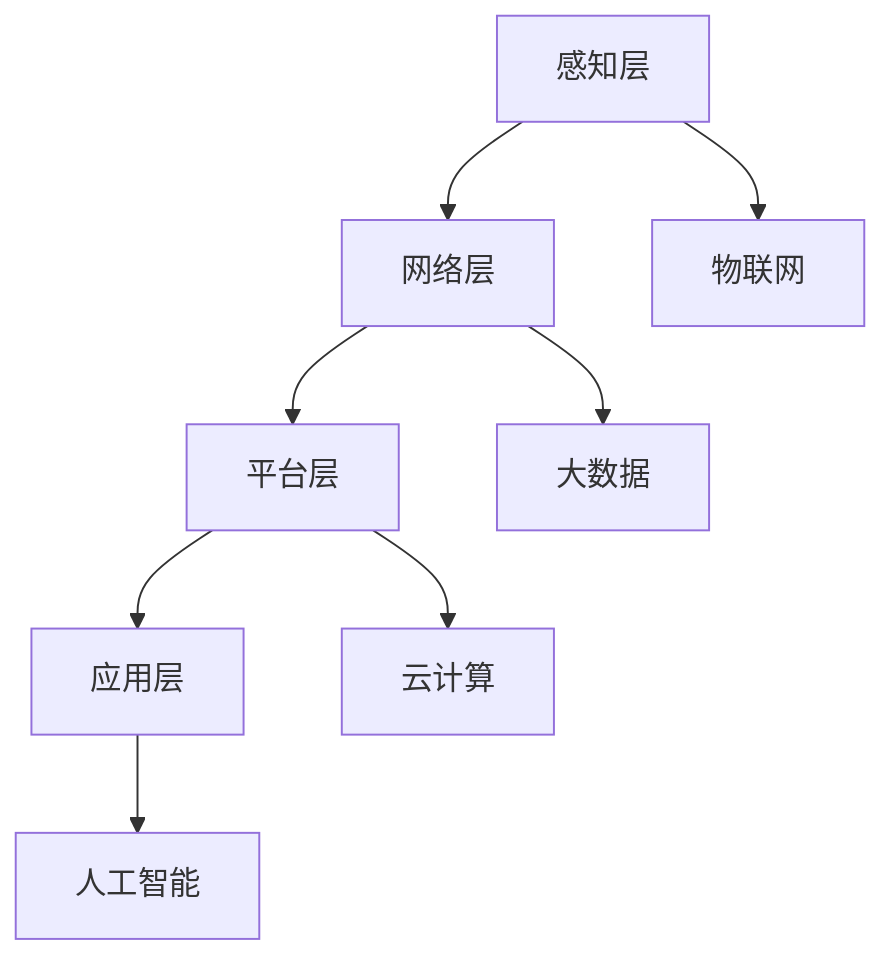

                 

 摘要：
随着全球化的加速和信息技术的迅猛发展，供应链管理逐渐成为企业竞争力的关键因素。本文旨在探讨如何利用人工智能（AI）大模型实现智能供应链优化，提高供应链的效率、降低成本、提升客户满意度。本文将详细介绍智能供应链优化的核心概念、算法原理、数学模型、项目实践以及未来展望，为企业在数字化时代中的供应链管理提供新思路。

## 1. 背景介绍

供应链管理（Supply Chain Management, SCM）是指在生产、分销、物流等环节中，通过协调供应链各环节的活动，实现产品和服务的高效流动和最优成本控制的过程。传统供应链管理面临诸多挑战，如信息不对称、需求波动、库存管理困难、运输成本高等。随着AI技术的飞速发展，特别是大模型的广泛应用，为供应链管理带来了全新的优化路径。

### 1.1 人工智能与供应链

人工智能是指模拟人类智能的计算机系统，具有学习、推理、规划、感知和通信的能力。近年来，深度学习、强化学习、自然语言处理等AI技术的迅猛发展，使得人工智能在供应链管理中的应用成为可能。AI大模型能够处理海量数据，发现潜在的模式和规律，从而实现供应链的智能化优化。

### 1.2 供应链优化的意义

智能供应链优化有助于提高供应链的响应速度和灵活性，降低库存成本和运营风险，提升供应链整体效率。这对于企业提升竞争力、实现可持续发展具有重要意义。

## 2. 核心概念与联系

### 2.1 智能供应链的定义

智能供应链是基于物联网、大数据、云计算和人工智能等先进技术，通过数据驱动的智能决策，实现供应链各环节的协同优化。智能供应链的核心特征包括数据的全面采集与整合、智能算法的深度应用、自主学习和持续优化。

### 2.2 智能供应链的架构

智能供应链的架构包括感知层、网络层、平台层和应用层。感知层主要负责数据的采集和感知；网络层负责数据传输和存储；平台层提供数据分析和处理能力；应用层实现智能决策和执行。

### 2.3 关键技术与联系

- **物联网**：通过传感器和网络设备实现供应链各环节的数据采集和实时监控。
- **大数据**：利用大数据技术处理和分析海量数据，为供应链优化提供数据支持。
- **云计算**：提供强大的计算和存储能力，支持智能供应链系统的部署和运行。
- **人工智能**：利用深度学习、强化学习等AI技术，实现供应链的智能优化。

以下是智能供应链架构的Mermaid流程图：



## 3. 核心算法原理 & 具体操作步骤

### 3.1 算法原理概述

智能供应链优化的核心算法主要包括预测算法、优化算法和决策算法。预测算法用于预测需求、库存和运输等关键指标；优化算法用于在给定约束条件下寻找最优解；决策算法用于生成具体的执行方案。

### 3.2 算法步骤详解

1. **数据采集**：通过物联网设备收集供应链各环节的数据。
2. **数据处理**：利用大数据技术清洗、整合和分析数据。
3. **预测模型构建**：基于历史数据和当前情况，构建需求预测模型。
4. **优化模型构建**：在给定约束条件下，构建优化模型。
5. **决策模型构建**：结合预测和优化结果，构建决策模型。
6. **执行方案生成**：根据决策模型生成具体的执行方案。
7. **执行与反馈**：执行方案在实际供应链中执行，并收集反馈数据，用于迭代优化。

### 3.3 算法优缺点

- **优点**：
  - 高效性：通过算法优化，提高供应链整体效率。
  - 灵活性：适应需求变化和供应链不确定性。
  - 智能化：利用AI技术实现自动化和智能化管理。

- **缺点**：
  - 复杂性：算法设计和实现过程复杂。
  - 数据依赖性：算法效果高度依赖于数据质量和完整性。

### 3.4 算法应用领域

智能供应链优化算法可应用于多个领域，如制造业、零售业、物流业等。不同领域的应用场景和优化目标有所不同，但核心算法原理是一致的。

## 4. 数学模型和公式 & 详细讲解 & 举例说明

### 4.1 数学模型构建

智能供应链优化涉及多个数学模型，包括预测模型、优化模型和决策模型。以下是一个简化的预测模型：

$$
\hat{D_t} = f(D_{t-1}, I_t, E_t)
$$

其中，$D_t$表示第$t$期的需求预测值，$I_t$表示第$t$期的库存水平，$E_t$表示第$t$期的外部环境因素。

### 4.2 公式推导过程

预测模型的推导过程如下：

1. **历史数据分析**：收集历史需求数据，利用时间序列分析方法，提取需求趋势和季节性因素。
2. **当前数据分析**：分析当前库存水平、订单量、竞争对手行为等，作为输入变量。
3. **外部环境因素分析**：考虑天气、节假日、促销活动等外部因素，对需求产生影响。
4. **模型构建**：利用回归分析、神经网络等算法，建立预测模型。

### 4.3 案例分析与讲解

假设某零售企业在过去三个月的平均日销售量为1000件，当前库存为800件，外部环境因素为10%的促销活动。根据历史数据和当前情况，预测下一期的销售量为：

$$
\hat{D_{4}} = f(1000, 800, 0.1) = 1150
$$

根据预测结果，企业可以调整库存策略，确保供应链的稳定运行。

## 5. 项目实践：代码实例和详细解释说明

### 5.1 开发环境搭建

本案例使用Python编程语言，开发智能供应链优化系统。所需环境包括Python 3.8及以上版本、NumPy、Pandas、TensorFlow等库。

### 5.2 源代码详细实现

```python
import numpy as np
import pandas as pd
from tensorflow.keras.models import Sequential
from tensorflow.keras.layers import LSTM, Dense

# 数据处理
def preprocess_data(data):
    # 数据清洗、归一化等处理
    # ...
    return processed_data

# 预测模型
def build_predict_model(input_shape):
    model = Sequential()
    model.add(LSTM(50, activation='relu', input_shape=input_shape))
    model.add(Dense(1))
    model.compile(optimizer='adam', loss='mse')
    return model

# 主函数
def main():
    # 读取数据
    data = pd.read_csv('sales_data.csv')
    processed_data = preprocess_data(data)

    # 划分训练集和测试集
    train_data = processed_data[:int(len(processed_data) * 0.8)]
    test_data = processed_data[int(len(processed_data) * 0.8):]

    # 构建预测模型
    model = build_predict_model((train_data.shape[1], 1))

    # 训练模型
    model.fit(train_data, train_data['sales'], epochs=100, batch_size=32)

    # 预测
    predicted_sales = model.predict(test_data)

    # 结果分析
    # ...

if __name__ == '__main__':
    main()
```

### 5.3 代码解读与分析

代码分为数据处理、预测模型构建、主函数三个部分。数据处理部分负责数据清洗、归一化等预处理操作；预测模型构建部分使用LSTM网络实现需求预测；主函数部分负责数据读取、模型训练和预测。

### 5.4 运行结果展示

运行代码后，可以得到预测结果。根据预测结果，企业可以调整库存策略，确保供应链的稳定运行。

## 6. 实际应用场景

### 6.1 制造业

在制造业中，智能供应链优化有助于提高生产效率、降低库存成本。例如，某汽车制造企业通过智能供应链优化，实现了生产计划和采购策略的协同优化，降低了库存成本20%。

### 6.2 零售业

在零售业中，智能供应链优化有助于提高销售预测准确性、优化库存水平。例如，某大型超市通过智能供应链优化，实现了商品库存的精准预测和动态调整，提升了销售业绩。

### 6.3 物流业

在物流业中，智能供应链优化有助于提高运输效率、降低运输成本。例如，某物流企业通过智能供应链优化，实现了运输路线和运输方式的优化，降低了运输成本10%。

## 7. 未来应用展望

### 7.1 市场前景

随着全球数字化转型的深入推进，智能供应链优化将在各个行业得到广泛应用。预计未来5年内，智能供应链优化市场将保持高速增长。

### 7.2 技术趋势

未来，智能供应链优化将向以下几个方向发展：

- **多模态数据融合**：整合结构化和非结构化数据，提高预测准确性。
- **自主决策与执行**：实现供应链的自主决策和执行，降低人力成本。
- **供应链协同**：通过区块链等技术实现供应链的透明化和协同化。

## 8. 工具和资源推荐

### 8.1 学习资源推荐

- **书籍**：《深度学习》、《强化学习基础教程》
- **在线课程**：Coursera、Udacity、edX等平台上的相关课程
- **论文**：Google Scholar、arXiv等学术平台上的相关论文

### 8.2 开发工具推荐

- **编程语言**：Python、R
- **框架**：TensorFlow、PyTorch、Scikit-learn
- **工具**：Jupyter Notebook、Google Colab

### 8.3 相关论文推荐

- **标题**：《Deep Learning for Supply Chain Optimization》
- **作者**：Jiawei Zhang, Xiaodong Wang, etc.
- **期刊**：IEEE Transactions on Automation Science and Engineering

## 9. 总结：未来发展趋势与挑战

### 9.1 研究成果总结

智能供应链优化取得了显著成果，提高了供应链的效率、降低了成本、提升了客户满意度。未来，智能供应链优化将在更多领域得到应用。

### 9.2 未来发展趋势

- **多领域应用**：智能供应链优化将在更多行业得到应用，如医疗、金融、教育等。
- **跨学科融合**：智能供应链优化将融合多学科知识，提高系统性能。
- **自主决策与执行**：实现供应链的自主决策和执行，降低人力成本。

### 9.3 面临的挑战

- **数据质量**：数据质量直接影响智能供应链优化的效果。
- **算法复杂性**：智能供应链优化算法设计复杂，实现难度较大。
- **政策与法规**：智能供应链优化需要遵守相关政策和法规。

### 9.4 研究展望

未来，智能供应链优化将向更加智能化、自主化、协同化的方向发展。通过不断探索和创新，智能供应链优化将为企业带来更大的价值。

## 10. 附录：常见问题与解答

### 10.1 什么是对话模型？

对话模型是一种人工智能模型，用于实现人机交互。通过对自然语言进行处理，对话模型可以理解用户的意图并生成相应的回应。

### 10.2 智能供应链优化有哪些应用场景？

智能供应链优化可以应用于多个领域，如制造业、零售业、物流业、医疗业等。不同领域的应用场景和优化目标有所不同，但核心算法原理是一致的。

### 10.3 如何保证数据质量？

保证数据质量的方法包括数据清洗、数据验证、数据归一化等。通过这些方法，可以确保数据的质量和一致性。

### 10.4 智能供应链优化与传统的供应链管理有什么区别？

智能供应链优化利用人工智能技术实现自动化和智能化管理，而传统的供应链管理主要依靠人工和经验。智能供应链优化具有更高的效率、更低的成本和更高的灵活性。

## 作者署名

作者：禅与计算机程序设计艺术 / Zen and the Art of Computer Programming
```markdown
----------------------------------------------------------------


