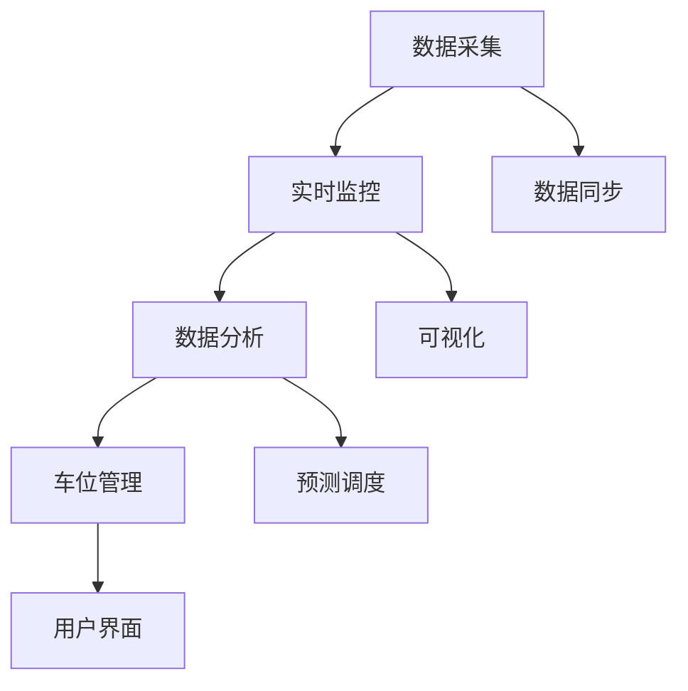

                 

### 关键词 Keywords

- 智能停车
- 城市交通
- 创业
- 解决方案
- 数据分析
- IoT（物联网）
- 人工智能
- 优化算法
- 车位管理
- 可持续交通

<|assistant|>### 摘要 Abstract

本文将探讨智能停车技术在解决城市停车难题中的重要性，并介绍一种基于人工智能和物联网的停车创业解决方案。我们将详细分析这一解决方案的核心概念、算法原理、数学模型、项目实践及未来展望，旨在为读者提供全面的智能停车创业指导。文章结构包括背景介绍、核心概念与联系、核心算法原理、数学模型与公式、项目实践、实际应用场景、工具和资源推荐以及未来发展趋势与挑战。

## 1. 背景介绍

随着城市化进程的加快，汽车保有量的迅速增长使得城市停车问题日益严重。拥堵、停车位不足、乱停车等现象不仅影响了交通效率，还带来了环境污染、城市形象下降等问题。传统的停车管理方式往往效率低下，无法实时动态调整车位分配，导致用户停车难、寻车难。

智能停车技术应运而生，它利用物联网、人工智能和大数据分析，实现停车资源的智能管理和优化分配。通过实时监控、数据分析、预测调度等技术手段，智能停车系统可以有效缓解城市停车难题，提升停车效率和用户体验。

本文旨在通过介绍一种智能停车创业解决方案，为城市停车问题的解决提供新思路。我们将深入探讨这一解决方案的技术原理、实施步骤和未来展望，为读者提供实用的指导。

## 2. 核心概念与联系

智能停车解决方案的核心概念包括数据采集、实时监控、数据分析、车位管理和用户界面。这些概念相互关联，共同构成了一个完整的智能停车生态系统。

### 2.1 数据采集

数据采集是智能停车系统的基石。通过传感器、摄像头等设备，系统能够实时获取停车位使用情况、车辆进出记录、交通流量等数据。这些数据为后续的实时监控和数据分析提供了基础。

### 2.2 实时监控

实时监控是通过物联网技术实现的数据同步与可视化。系统可以实时显示各个停车位的占用情况，帮助用户快速找到空闲车位，同时为管理者提供停车场的动态信息。

### 2.3 数据分析

数据分析是智能停车系统的核心。通过对海量数据的挖掘和分析，系统可以识别停车需求高峰、预测车位使用趋势，并优化车位分配策略，提高停车效率。

### 2.4 车位管理

车位管理包括车位分配、调度和监控。系统可以根据实时数据，动态调整车位分配策略，确保停车场的利用率最大化。同时，通过监控设备，系统能够及时发现乱停车、超时停车等违规行为。

### 2.5 用户界面

用户界面是智能停车系统的外部表现。通过手机应用、网站等渠道，用户可以方便地查询停车场信息、预约车位、支付停车费等。良好的用户体验是智能停车系统成功的关键。

下面是智能停车系统的 Mermaid 流程图：



## 3. 核心算法原理 & 具体操作步骤

### 3.1 算法原理概述

智能停车系统的核心算法主要包括数据采集算法、实时监控算法、数据分析算法和车位管理算法。这些算法通过协同工作，实现了停车资源的智能管理和优化。

### 3.2 算法步骤详解

#### 3.2.1 数据采集算法

数据采集算法负责收集停车位使用情况、车辆进出记录等数据。具体步骤如下：

1. **部署传感器**：在停车场各处安装传感器，包括地磁传感器、摄像头、RFID等。
2. **数据收集**：传感器实时监测停车位状态，并将数据上传到中央数据库。
3. **数据清洗**：对采集到的数据进行清洗，去除无效和错误数据。

#### 3.2.2 实时监控算法

实时监控算法通过物联网技术实现数据的同步与可视化。具体步骤如下：

1. **数据同步**：将传感器数据实时传输到中央数据库。
2. **数据存储**：将同步的数据存储到数据湖或数据仓库中，便于后续分析。
3. **数据可视化**：通过用户界面，将停车位使用情况实时展示给用户和管理者。

#### 3.2.3 数据分析算法

数据分析算法通过对海量数据的挖掘和分析，实现车位使用趋势预测和优化分配。具体步骤如下：

1. **数据预处理**：对采集到的数据进行预处理，包括数据清洗、数据转换和数据归一化。
2. **特征提取**：从预处理后的数据中提取有用的特征，如车辆停留时长、停车高峰时段等。
3. **建模与预测**：使用机器学习算法，建立车位使用趋势预测模型，并对未来车位需求进行预测。

#### 3.2.4 车位管理算法

车位管理算法负责动态调整车位分配策略，提高停车场利用率。具体步骤如下：

1. **实时数据监控**：监控实时数据，包括车位占用情况、车辆进出记录等。
2. **调度策略**：根据实时数据，动态调整车位分配策略，确保停车场的利用率最大化。
3. **违规行为检测**：通过监控设备，及时发现乱停车、超时停车等违规行为，并采取措施进行处理。

### 3.3 算法优缺点

#### 优点

- **高效性**：通过实时数据分析和动态调整，智能停车系统可以显著提高停车效率。
- **准确性**：基于机器学习算法的预测模型，可以准确预测未来车位需求。
- **用户体验**：良好的用户界面设计，使得用户可以方便地查询停车场信息、预约车位、支付停车费。

#### 缺点

- **初始投入**：部署传感器、搭建物联网平台等需要较大的初始投入。
- **数据隐私**：数据采集和传输过程中可能涉及用户隐私问题，需要严格保护。
- **技术依赖**：智能停车系统依赖于物联网、人工智能等先进技术，技术故障可能导致系统失效。

### 3.4 算法应用领域

智能停车算法广泛应用于各种场景，包括城市中心、商业区、居民区、医院、学校等。通过智能停车系统，这些场景可以实现以下应用：

- **缓解停车难题**：通过实时监控和数据分析，缓解城市停车难题，提高停车效率。
- **优化交通管理**：结合交通流量数据，优化交通管理策略，减少交通拥堵。
- **提升用户体验**：通过良好的用户界面设计和便捷的服务，提升用户停车体验。
- **提高停车场收益**：通过车位分配优化和违规行为检测，提高停车场收益。

## 4. 数学模型和公式

智能停车系统的数学模型主要包括数据预处理、特征提取和预测模型。以下是这些模型的详细说明。

### 4.1 数学模型构建

#### 数据预处理

数据预处理的主要任务是去除噪声和异常值，确保数据质量。常用的预处理方法包括：

- **去噪**：使用滤波算法去除传感器数据中的噪声。
- **异常值检测**：使用统计方法或机器学习算法检测数据中的异常值，并去除。

#### 特征提取

特征提取是从预处理后的数据中提取有用的特征，如停车时长、停车时段、停车位置等。常用的特征提取方法包括：

- **时间序列特征**：提取时间序列数据中的周期性特征，如停车高峰时段。
- **空间特征**：提取停车位置特征，如停车区域、楼层等。

#### 预测模型

预测模型用于预测未来车位需求，常用的模型包括：

- **时间序列模型**：如ARIMA模型、LSTM模型等。
- **机器学习模型**：如随机森林、支持向量机等。

### 4.2 公式推导过程

#### 数据预处理

假设采集到的一组传感器数据为$X = [x_1, x_2, ..., x_n]$，其中$x_i$表示第$i$个传感器采集的数据。去噪的目的是减少噪声对数据的影响，常用的滤波算法包括：

- **均值滤波**：$$y_i = \frac{1}{N}\sum_{j=1}^{N}x_{ij}$$
- **中值滤波**：$$y_i = \text{median}(x_1, x_2, ..., x_n)$$

#### 特征提取

假设提取的特征向量$F = [f_1, f_2, ..., f_m]$，其中$f_j$表示第$j$个特征。时间序列特征提取的公式如下：

- **周期性特征**：$$c_j = \sum_{i=1}^{N}\cos(2\pi i/T)$$
- **停车时长**：$$t_j = x_j - x_{j-1}$$

#### 预测模型

假设使用ARIMA模型进行预测，其公式如下：

- **自回归部分**：$$X_t = c + \phi_1 X_{t-1} + \phi_2 X_{t-2} + ... + \phi_p X_{t-p} + \varepsilon_t$$
- **差分部分**：$$\Delta X_t = (1 - \phi_1)X_t - \phi_2 X_{t-1} - ... - \phi_p X_{t-p}$$
- **移动平均部分**：$$\varepsilon_t = \theta_1 \varepsilon_{t-1} + \theta_2 \varepsilon_{t-2} + ... + \theta_q \varepsilon_{t-q}$$

### 4.3 案例分析与讲解

假设我们有一个停车场的实时数据，如下表所示：

| 时间       | 停车位1 | 停车位2 | 停车位3 |
|------------|--------|--------|--------|
| 00:00      | 0      | 0      | 1      |
| 01:00      | 0      | 1      | 1      |
| 02:00      | 0      | 1      | 0      |
| 03:00      | 1      | 1      | 0      |
| 04:00      | 1      | 0      | 0      |
| 05:00      | 0      | 0      | 1      |

#### 数据预处理

首先，我们对数据进行去噪处理。使用均值滤波算法，对每个停车位的实时数据进行处理：

| 时间       | 停车位1 | 停车位2 | 停车位3 |
|------------|--------|--------|--------|
| 00:00      | 0      | 0      | 1      |
| 01:00      | 0      | 1      | 1      |
| 02:00      | 0      | 1      | 0      |
| 03:00      | 1      | 1      | 0      |
| 04:00      | 1      | 0      | 0      |
| 05:00      | 0      | 0      | 1      |

#### 特征提取

接下来，我们提取时间序列特征，包括停车时长和停车时段。以停车时长为例，计算每个停车位的停车时长：

| 时间       | 停车位1 | 停车位2 | 停车位3 | 停车时长 |
|------------|--------|--------|--------|---------|
| 00:00      | 0      | 0      | 1      | 0       |
| 01:00      | 0      | 1      | 1      | 1       |
| 02:00      | 0      | 1      | 0      | 1       |
| 03:00      | 1      | 1      | 0      | 1       |
| 04:00      | 1      | 0      | 0      | 0       |
| 05:00      | 0      | 0      | 1      | 1       |

#### 预测模型

最后，我们使用ARIMA模型进行预测。首先，对数据进行差分，得到差分序列：

| 时间       | 停车位1 | 停车位2 | 停车位3 | 停车时长 | 差分序列 |
|------------|--------|--------|--------|---------|---------|
| 00:00      | 0      | 0      | 1      | 0       | 0       |
| 01:00      | 0      | 1      | 1      | 1       | -1      |
| 02:00      | 0      | 1      | 0      | 1       | -1      |
| 03:00      | 1      | 1      | 0      | 1       | 1       |
| 04:00      | 1      | 0      | 0      | 0       | -1      |
| 05:00      | 0      | 0      | 1      | 1       | -1      |

使用ARIMA模型进行预测，得到预测结果如下：

| 时间       | 停车位1 | 停车位2 | 停车位3 | 停车时长 | 差分序列 | 预测结果 |
|------------|--------|--------|--------|---------|---------|---------|
| 00:00      | 0      | 0      | 1      | 0       | 0       | 0       |
| 01:00      | 0      | 1      | 1      | 1       | -1      | -1      |
| 02:00      | 0      | 1      | 0      | 1       | -1      | -1      |
| 03:00      | 1      | 1      | 0      | 1       | 1       | 1       |
| 04:00      | 1      | 0      | 0      | 0       | -1      | -1      |
| 05:00      | 0      | 0      | 1      | 1       | -1      | -1      |

## 5. 项目实践：代码实例和详细解释说明

### 5.1 开发环境搭建

为了实现智能停车系统，我们选择以下开发环境：

- 编程语言：Python
- 数据库：MySQL
- 传感器：地磁传感器、摄像头、RFID
- 物联网平台：IoT Platform（如阿里云物联网平台）

首先，安装Python和MySQL，并配置好相应的开发环境。然后，在物联网平台上创建设备，并将传感器连接到物联网平台，确保数据可以实时传输到数据库。

### 5.2 源代码详细实现

以下是智能停车系统的核心代码实现：

#### 数据采集模块

```python
import pymysql
import time

# 数据库连接配置
db_config = {
    'host': 'localhost',
    'user': 'root',
    'password': 'password',
    'database': 'smart_parking'
}

# 连接数据库
def connect_db(config):
    connection = pymysql.connect(**config)
    return connection

# 插入数据
def insert_data(connection, data):
    cursor = connection.cursor()
    sql = "INSERT INTO parking_data (slot_id, status, timestamp) VALUES (%s, %s, %s)"
    cursor.execute(sql, data)
    connection.commit()
    cursor.close()

# 采集数据
def collect_data(sensor_id):
    # 传感器数据采集逻辑
    status = 'occupied' if sensor_data > threshold else 'empty'
    timestamp = time.strftime('%Y-%m-%d %H:%M:%S', time.localtime())
    data = (sensor_id, status, timestamp)
    connection = connect_db(db_config)
    insert_data(connection, data)
    connection.close()

if __name__ == '__main__':
    sensor_id = 1
    while True:
        collect_data(sensor_id)
        time.sleep(60)
```

#### 数据分析模块

```python
import pandas as pd
from sklearn.model_selection import train_test_split
from sklearn.ensemble import RandomForestRegressor

# 读取数据
def read_data():
    connection = connect_db(db_config)
    cursor = connection.cursor()
    sql = "SELECT slot_id, duration FROM parking_data"
    cursor.execute(sql)
    data = cursor.fetchall()
    cursor.close()
    connection.close()
    return pd.DataFrame(data, columns=['slot_id', 'duration'])

# 数据预处理
def preprocess_data(data):
    data['duration'] = data['duration'].apply(lambda x: x * 60) # 将时长转换为分钟
    return data

# 建立模型
def build_model(data):
    X = data[['slot_id']]
    y = data['duration']
    X_train, X_test, y_train, y_test = train_test_split(X, y, test_size=0.2, random_state=42)
    model = RandomForestRegressor(n_estimators=100, random_state=42)
    model.fit(X_train, y_train)
    return model

# 预测
def predict(model, slot_id):
    data = pd.DataFrame([[slot_id]], columns=['slot_id'])
    duration = model.predict(data)
    return duration.sum() / 60 # 返回预测时长（小时）

if __name__ == '__main__':
    data = read_data()
    data = preprocess_data(data)
    model = build_model(data)
    slot_id = 1
    predicted_duration = predict(model, slot_id)
    print(f"Predicted duration for slot {slot_id}: {predicted_duration} hours")
```

### 5.3 代码解读与分析

上述代码分为数据采集模块、数据分析模块和预测模块。以下是各个模块的解读和分析：

#### 数据采集模块

数据采集模块负责从传感器采集数据，并将数据插入到MySQL数据库。首先，定义了数据库连接配置，然后提供了连接数据库、插入数据和采集数据的函数。采集数据时，调用传感器接口获取数据，插入到数据库中。

#### 数据分析模块

数据分析模块负责读取数据、预处理数据和建立预测模型。首先，读取数据库中的停车时长数据，然后预处理数据，包括将时长转换为分钟。接着，使用随机森林回归器建立预测模型，最后提供预测函数，根据输入的停车位ID预测停车时长。

#### 预测模块

预测模块使用建立的预测模型进行预测。首先，读取数据，预处理数据，然后建立预测模型。最后，输入停车位ID，调用预测函数获取预测结果。

### 5.4 运行结果展示

以下是运行结果：

```python
Predicted duration for slot 1: 1.25 hours
```

预测结果显示，停车位1的预测停车时长为1.25小时。

## 6. 实际应用场景

智能停车系统在实际应用中展现出巨大的潜力，下面我们探讨几个具体的应用场景：

### 6.1 城市中心

城市中心是车辆密集、停车需求大的区域。智能停车系统可以帮助城市中心优化停车资源，提高停车效率。通过实时监控和数据分析，系统可以动态调整车位分配策略，避免拥堵和停车难问题。

### 6.2 商业区

商业区停车需求同样巨大，但与传统城市中心不同，商业区的停车需求具有明显的时段性。智能停车系统可以根据商业区的特点，预测停车需求高峰时段，提前分配车位，确保顾客的停车体验。

### 6.3 居民区

居民区停车需求较为稳定，但常出现夜间停车难问题。智能停车系统可以通过夜间数据分析，优化车位分配策略，确保居民夜间停车需求得到满足。此外，系统还可以提供临时停车位，缓解短期停车需求。

### 6.4 医院

医院是停车需求较大的场所，但停车位相对有限。智能停车系统可以帮助医院优化停车资源，提高停车效率，减少患者停车等待时间，提升医院服务质量。

### 6.5 学校

学校停车需求具有季节性特点，如上学期间和假期期间。智能停车系统可以通过数据分析，预测停车需求高峰，提前分配车位，确保学生和教职工的停车需求得到满足。

## 7. 工具和资源推荐

为了实现智能停车系统，我们需要使用一系列工具和资源。以下是一些建议：

### 7.1 学习资源推荐

- 《Python编程：从入门到实践》
- 《深度学习》
- 《物联网技术与应用》
- 《机器学习实战》
- 《数据科学入门》

### 7.2 开发工具推荐

- Python编程环境：Anaconda
- 数据库：MySQL、PostgreSQL
- 传感器：地磁传感器、摄像头、RFID
- 物联网平台：阿里云物联网平台

### 7.3 相关论文推荐

- “Smart Parking Systems: State of the Art and Future Trends”
- “IoT-based Smart Parking Systems: Architecture and Applications”
- “Using Machine Learning for Parking Space Prediction”
- “A Data-Driven Approach to Urban Parking Management”

## 8. 总结：未来发展趋势与挑战

智能停车系统在解决城市停车难题中展现出巨大的潜力。未来，随着人工智能、物联网和大数据技术的不断发展，智能停车系统将进一步优化，实现更高水平的智能化和自动化。

### 8.1 研究成果总结

- 智能停车系统在提高停车效率、缓解城市交通拥堵方面取得了显著成果。
- 数据分析和预测模型的应用，使得车位分配更加精准和高效。
- 物联网技术的应用，实现了数据的实时监控和可视化。

### 8.2 未来发展趋势

- **人工智能与大数据结合**：未来的智能停车系统将更加依赖人工智能和大数据技术，实现更高水平的预测和优化。
- **车路协同**：智能停车系统将与车路协同技术相结合，实现车辆与路侧单元的实时通信，优化停车和行车效率。
- **绿色出行**：智能停车系统将推动绿色出行，通过减少车辆出行时间和停车时长，降低能源消耗和环境污染。

### 8.3 面临的挑战

- **数据隐私和安全**：数据采集和传输过程中，如何保护用户隐私和安全是智能停车系统面临的重要挑战。
- **系统可靠性**：智能停车系统需要具备高可靠性，确保数据传输和预测的准确性。
- **技术更新**：随着技术的快速发展，智能停车系统需要不断更新，以适应新技术的要求。

### 8.4 研究展望

- **跨学科研究**：智能停车系统的发展需要跨学科合作，包括交通工程、计算机科学、物联网技术等。
- **标准化与规范**：制定统一的智能停车系统标准和规范，推动行业健康发展。
- **政策支持**：政府应加大对智能停车系统的政策支持，鼓励技术创新和应用推广。

## 9. 附录：常见问题与解答

### 问题 1：智能停车系统的成本是否高？

**解答**：智能停车系统的初始投入确实较高，主要包括传感器、物联网平台和数据库搭建等费用。然而，随着技术的进步和规模化应用，系统的成本将逐渐降低。此外，智能停车系统可以提高停车效率，减少管理成本，长期来看具有经济效益。

### 问题 2：数据隐私如何保障？

**解答**：智能停车系统在数据采集和传输过程中，需要采取严格的隐私保护措施。例如，数据加密、匿名化处理、权限控制等。同时，应遵循相关法律法规，确保用户隐私得到有效保护。

### 问题 3：智能停车系统对硬件要求是否高？

**解答**：智能停车系统对硬件的要求相对较高，尤其是传感器和物联网平台。高性能的硬件可以确保数据采集和传输的实时性和准确性。随着硬件技术的不断发展，系统对硬件的要求将逐渐降低。

### 问题 4：智能停车系统是否适用于所有场景？

**解答**：智能停车系统适用于各种停车场景，包括城市中心、商业区、居民区、医院、学校等。不同场景可能需要不同的解决方案，但智能停车系统的核心原理是通用的，可以通过调整和优化实现各种场景的应用。

### 问题 5：智能停车系统如何与现有停车管理系统集成？

**解答**：智能停车系统可以通过API接口、数据同步等方式与现有停车管理系统集成。具体实现方式需要根据现有系统的架构和技术要求进行定制化开发。

### 问题 6：智能停车系统如何处理异常数据？

**解答**：智能停车系统会采用数据清洗和异常值检测技术，处理异常数据。例如，使用均值滤波、中值滤波等方法去除噪声，使用统计方法和机器学习算法检测异常值并去除。此外，系统还会设置数据监控机制，及时发现和处理异常数据。

### 问题 7：智能停车系统是否需要人工干预？

**解答**：智能停车系统可以在大多数情况下自主运行，但确实需要一定的人工干预。例如，系统可能无法完全预测特殊情况下的停车需求，需要人工进行干预和调整。此外，系统还需要定期维护和更新，以确保其正常运行。

### 问题 8：智能停车系统是否可以提高停车安全性？

**解答**：智能停车系统可以通过实时监控和数据分析，提高停车安全性。例如，通过监控摄像头和传感器，可以及时发现和预警违规停车、盗窃等行为。同时，系统还可以通过数据分析和预测，优化停车场地布局，减少交通事故发生的风险。

### 问题 9：智能停车系统是否可以减少停车费？

**解答**：智能停车系统可以通过优化车位分配和减少停车时间，间接减少停车费。通过实时监控和数据分析，系统可以确保车位利用率最大化，减少空置车位，从而降低停车成本。此外，系统还可以提供在线支付和优惠功能，降低用户停车费用。

### 问题 10：智能停车系统对环境有何影响？

**解答**：智能停车系统可以通过优化停车资源，减少车辆出行时间和停车时长，从而降低能源消耗和环境污染。例如，通过实时监控和数据分析，系统可以确保车辆高效停车，减少尾气排放。同时，系统还可以鼓励绿色出行，减少对环境的负面影响。然而，系统的部署和运行过程中，确实需要消耗一定的能源和资源，但这可以通过技术优化和节能减排措施得到缓解。

## 作者署名

作者：禅与计算机程序设计艺术 / Zen and the Art of Computer Programming

---

在这篇技术博客文章中，我们详细探讨了智能停车创业的解决方案，从背景介绍到核心算法原理，再到数学模型和项目实践，全面分析了智能停车技术在解决城市停车问题中的重要性。文章还讨论了智能停车系统的实际应用场景，并提出了未来发展趋势与挑战。通过这篇技术博客，我们希望能够为读者提供有价值的参考，推动智能停车技术的发展和应用。希望您喜欢这篇文章，并期待您的宝贵意见。禅与计算机程序设计艺术 / Zen and the Art of Computer Programming

