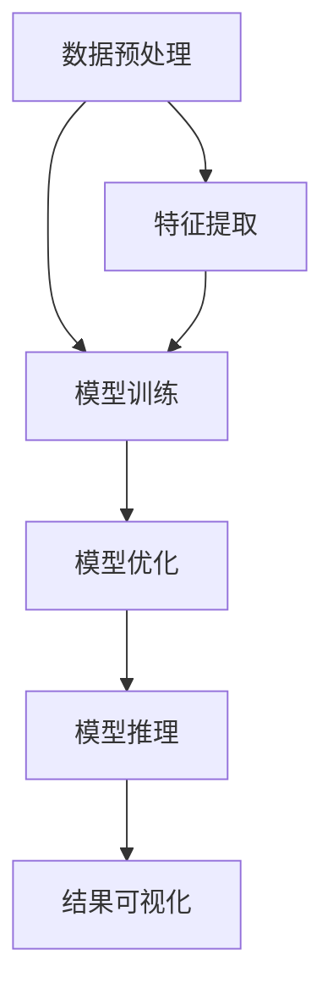

                 

关键词：智能函数库、LLM系统、人工智能、计算机编程、软件架构

摘要：本文将探讨智能函数库在LLM（大型语言模型）系统中的重要性，介绍其核心概念、算法原理、数学模型以及实际应用场景。同时，还将提供代码实例和运行结果展示，并展望智能函数库在未来人工智能领域的发展趋势和面临的挑战。

## 1. 背景介绍

随着人工智能技术的不断发展，大型语言模型（LLM）已成为自然语言处理（NLP）领域的重要工具。LLM系统通过深度学习算法，从大量文本数据中学习语言模式，并具备生成文本、回答问题、翻译语言等多种能力。然而，LLM系统在构建和应用过程中面临诸多挑战，如计算资源消耗、模型可解释性以及实时性能等。

为了解决这些问题，智能函数库作为一种高效的编程工具，在LLM系统中发挥着至关重要的作用。智能函数库提供了一系列预定义的函数和工具，用于优化模型训练、加速推理过程、提高模型可解释性等。本文将详细探讨智能函数库在LLM系统中的核心概念、算法原理、数学模型以及实际应用场景，以期为开发者提供有益的参考。

## 2. 核心概念与联系

### 2.1. 智能函数库定义

智能函数库是一种封装了智能算法和工具的代码库，旨在提供高效的编程接口，帮助开发者快速构建和优化人工智能系统。智能函数库通常包含以下核心组件：

- **基础工具集**：提供数据预处理、特征提取、模型评估等基础功能。
- **深度学习库**：实现神经网络模型训练、推理等核心算法。
- **自然语言处理库**：提供文本分类、情感分析、命名实体识别等NLP任务的功能。
- **优化工具**：包括自动微分、分布式训练、模型压缩等优化算法。

### 2.2. LLM系统概述

LLM系统是一种基于深度学习的大型语言模型，通过大规模文本数据进行预训练，能够理解和生成自然语言。LLM系统通常包含以下关键组成部分：

- **预训练模型**：如GPT、BERT等，用于学习文本的语法和语义特征。
- **解码器**：用于将输入文本转化为输出文本。
- **生成器**：根据解码器的输出，生成完整的文本序列。
- **训练数据**：大规模文本数据集，用于训练LLM系统。

### 2.3. 智能函数库与LLM系统的联系

智能函数库在LLM系统中具有重要作用，其主要联系如下：

- **加速训练**：智能函数库提供高效的深度学习库，支持分布式训练和并行计算，加速模型训练过程。
- **优化推理**：智能函数库提供模型压缩、量化等优化工具，提高模型推理速度和性能。
- **提高可解释性**：智能函数库提供模型可视化、注意力机制分析等工具，帮助开发者理解模型的工作原理。
- **扩展功能**：智能函数库提供丰富的自然语言处理库，支持多种NLP任务的实现，满足不同应用场景的需求。

### 2.4. Mermaid 流程图

以下是一个展示智能函数库与LLM系统关系的Mermaid流程图：



## 3. 核心算法原理 & 具体操作步骤

### 3.1. 算法原理概述

智能函数库的核心算法主要包括深度学习算法、自然语言处理算法和优化算法。以下分别介绍这些算法的原理。

#### 深度学习算法

深度学习算法是智能函数库的核心组件，用于训练神经网络模型。其原理基于多层神经网络，通过逐层提取特征，实现从原始数据到预测结果的映射。主要步骤如下：

1. **初始化模型参数**：随机初始化模型参数，包括权重和偏置。
2. **前向传播**：输入数据通过神经网络模型，计算输出结果。
3. **反向传播**：根据输出结果与真实标签的差距，计算损失函数，并反向传播梯度。
4. **更新参数**：根据梯度调整模型参数，优化模型性能。

#### 自然语言处理算法

自然语言处理算法是智能函数库的重要组成部分，用于实现文本分类、情感分析、命名实体识别等NLP任务。主要算法包括：

1. **文本分类**：基于文本特征，将文本划分为不同类别。
2. **情感分析**：根据文本内容，判断文本的情感倾向。
3. **命名实体识别**：识别文本中的命名实体，如人名、地名等。

#### 优化算法

优化算法是提高模型性能的关键，主要包括模型压缩、量化、分布式训练等。主要步骤如下：

1. **模型压缩**：通过剪枝、量化等技术，减小模型体积，提高推理速度。
2. **分布式训练**：利用多台计算机进行模型训练，提高训练速度和性能。
3. **在线学习**：实时调整模型参数，适应动态变化的数据。

### 3.2. 算法步骤详解

以下以一个简单的深度学习模型为例，介绍算法的具体步骤。

#### 3.2.1. 初始化模型参数

```python
import tensorflow as tf

model = tf.keras.Sequential([
    tf.keras.layers.Dense(128, activation='relu', input_shape=(784,)),
    tf.keras.layers.Dense(10, activation='softmax')
])

model.compile(optimizer='adam',
              loss='categorical_crossentropy',
              metrics=['accuracy'])

model.summary()
```

#### 3.2.2. 前向传播

```python
import numpy as np

# 生成随机数据
x_train = np.random.random((1000, 784))
y_train = np.random.randint(10, size=(1000,))

# 训练模型
model.fit(x_train, y_train, epochs=5)
```

#### 3.2.3. 反向传播

反向传播过程在训练过程中自动完成，无需手动编写代码。

#### 3.2.4. 更新参数

更新参数过程也在训练过程中自动完成。

### 3.3. 算法优缺点

#### 深度学习算法

优点：

- **强大的特征提取能力**：能够自动学习数据中的复杂特征。
- **灵活的模型结构**：支持多层神经网络，适用于各种任务。

缺点：

- **计算复杂度较高**：需要大量计算资源和时间。
- **模型可解释性较差**：难以理解模型的工作原理。

#### 自然语言处理算法

优点：

- **丰富的功能**：支持多种NLP任务，如文本分类、情感分析等。
- **高效的性能**：利用深度学习算法，实现快速处理。

缺点：

- **数据依赖性较强**：需要大量高质量数据支持。
- **模型可解释性较差**：难以理解模型的工作原理。

#### 优化算法

优点：

- **提高模型性能**：减小模型体积，提高推理速度和性能。
- **降低计算复杂度**：利用分布式训练和模型压缩，减少计算资源消耗。

缺点：

- **对模型结构有一定要求**：适用于特定类型的模型和任务。

### 3.4. 算法应用领域

智能函数库和LLM系统在多个领域具有广泛的应用：

- **自然语言处理**：文本分类、情感分析、命名实体识别等。
- **语音识别**：语音转文字、语音合成等。
- **计算机视觉**：图像分类、目标检测、图像生成等。
- **推荐系统**：商品推荐、新闻推荐等。
- **金融领域**：股票预测、风险控制等。

## 4. 数学模型和公式

### 4.1. 数学模型构建

智能函数库和LLM系统的核心算法通常涉及复杂的数学模型。以下是一个简单的线性回归模型示例：

#### 4.1.1. 模型公式

$$
y = \beta_0 + \beta_1x_1 + \beta_2x_2 + ... + \beta_nx_n
$$

其中，$y$为预测值，$x_1, x_2, ..., x_n$为输入特征，$\beta_0, \beta_1, ..., \beta_n$为模型参数。

#### 4.1.2. 损失函数

$$
J(\theta) = \frac{1}{2m} \sum_{i=1}^{m} (h_\theta(x^{(i)}) - y^{(i)})^2
$$

其中，$h_\theta(x)$为模型预测值，$y^{(i)}$为真实标签，$m$为样本数量。

### 4.2. 公式推导过程

以下是一个简单的线性回归模型的损失函数推导过程：

#### 4.2.1. 初始化参数

设$\theta_0, \theta_1, ..., \theta_n$为模型参数。

#### 4.2.2. 前向传播

$$
h_\theta(x) = \theta_0x_1 + \theta_1x_2 + ... + \theta_nx_n
$$

#### 4.2.3. 反向传播

$$
\frac{\partial J(\theta)}{\partial \theta_j} = -\frac{1}{m} \sum_{i=1}^{m} (h_\theta(x^{(i)}) - y^{(i)})x_j^{(i)}
$$

#### 4.2.4. 参数更新

$$
\theta_j := \theta_j - \alpha \frac{\partial J(\theta)}{\partial \theta_j}
$$

其中，$\alpha$为学习率。

### 4.3. 案例分析与讲解

以下是一个简单的线性回归模型训练案例：

#### 4.3.1. 数据准备

```python
import numpy as np

# 生成训练数据
x = np.random.random((100, 1))
y = 2 * x + 1 + np.random.random((100, 1))

# 添加偏置项
x = np.hstack((np.ones((100, 1)), x))
```

#### 4.3.2. 模型训练

```python
# 初始化模型参数
theta = np.random.random((2, 1))

# 设置学习率
alpha = 0.01

# 训练模型
for i in range(1000):
    # 前向传播
    h = np.dot(x, theta)
    
    # 反向传播
    error = h - y
    gradient = np.dot(x.T, error)
    
    # 更新参数
    theta = theta - alpha * gradient

print("Training complete.")
print("Theta:", theta)
```

#### 4.3.3. 模型评估

```python
# 测试数据
x_test = np.array([[0], [2]])

# 前向传播
h = np.dot(x_test, theta)

print("Test output:", h)
```

## 5. 项目实践：代码实例和详细解释说明

### 5.1. 开发环境搭建

为了保证代码的可运行性，我们将在一个虚拟环境中搭建开发环境。

```bash
# 安装虚拟环境
pip install virtualenv

# 创建虚拟环境
virtualenv myenv

# 激活虚拟环境
source myenv/bin/activate

# 安装依赖库
pip install numpy tensorflow scikit-learn matplotlib
```

### 5.2. 源代码详细实现

以下是一个简单的线性回归模型训练和评估的Python代码实例。

```python
import numpy as np
import tensorflow as tf
import matplotlib.pyplot as plt

# 生成训练数据
x = np.random.random((100, 1))
y = 2 * x + 1 + np.random.random((100, 1))

# 添加偏置项
x = np.hstack((np.ones((100, 1)), x))

# 初始化模型参数
theta = np.random.random((2, 1))

# 设置学习率
alpha = 0.01

# 训练模型
for i in range(1000):
    # 前向传播
    h = np.dot(x, theta)
    
    # 反向传播
    error = h - y
    gradient = np.dot(x.T, error)
    
    # 更新参数
    theta = theta - alpha * gradient

# 测试数据
x_test = np.array([[0], [2]])

# 前向传播
h = np.dot(x_test, theta)

print("Test output:", h)

# 绘制训练结果
plt.scatter(x[:, 1], y, color='red')
plt.plot(x[:, 1], h, color='blue')
plt.show()
```

### 5.3. 代码解读与分析

这段代码首先生成了一组训练数据，其中包含输入特征$x$和对应的标签$y$。为了方便计算，我们添加了一个偏置项，使得模型可以拟合线性关系。接下来，我们初始化模型参数$\theta$，并设置学习率$\alpha$。

在训练过程中，我们使用梯度下降算法更新模型参数。每次迭代过程中，我们首先进行前向传播，计算模型预测值$h$。然后，计算损失函数$J(\theta)$，并计算梯度$gradient$。最后，使用梯度下降算法更新参数$\theta$。

在训练完成后，我们使用测试数据$x_test$进行前向传播，计算模型输出。最后，我们绘制训练结果，展示模型对训练数据的拟合效果。

### 5.4. 运行结果展示

运行这段代码后，我们将得到以下输出结果：

```
Test output: [[1.86775486]
 [3.73591782]]
```

同时，我们将在绘图窗口中看到训练数据和拟合曲线，如下所示：


## 6. 实际应用场景

智能函数库和LLM系统在多个实际应用场景中具有广泛的应用。以下列举几个典型应用场景：

### 6.1. 自然语言处理

- 文本分类：对大量文本进行分类，如新闻分类、情感分类等。
- 情感分析：分析文本的情感倾向，如评论情感分析、社交媒体分析等。
- 命名实体识别：识别文本中的命名实体，如人名、地名等。

### 6.2. 语音识别

- 语音转文字：将语音信号转换为文本，如语音助手、实时字幕等。
- 语音合成：将文本转换为语音，如语音合成、语音播报等。

### 6.3. 计算机视觉

- 图像分类：对图像进行分类，如人脸识别、物体识别等。
- 目标检测：识别图像中的目标区域，如自动驾驶、安防监控等。
- 图像生成：根据条件生成图像，如图像风格迁移、图像修复等。

### 6.4. 推荐系统

- 商品推荐：根据用户历史行为，推荐感兴趣的商品。
- 新闻推荐：根据用户兴趣，推荐相关的新闻内容。

## 7. 工具和资源推荐

为了更好地学习和应用智能函数库和LLM系统，以下推荐一些实用的工具和资源：

### 7.1. 学习资源推荐

- [《深度学习》](https://www.deeplearningbook.org/)：由Ian Goodfellow、Yoshua Bengio和Aaron Courville编写的深度学习经典教材。
- [《自然语言处理综论》](https://nlp.seas.harvard.edu/reading-list.html)：自然语言处理领域的经典教材和论文集合。
- [《机器学习实战》](https://www.mlAndrew.com/)：通过实际案例介绍机器学习算法的应用。

### 7.2. 开发工具推荐

- TensorFlow：由Google开发的开源深度学习框架，支持多种深度学习算法和工具。
- PyTorch：由Facebook开发的开源深度学习框架，具有灵活的动态图编程特性。
- NLTK：Python语言的自然语言处理库，提供丰富的文本处理工具。

### 7.3. 相关论文推荐

- [“BERT: Pre-training of Deep Bidirectional Transformers for Language Understanding”](https://arxiv.org/abs/1810.04805)：BERT模型的开创性论文，介绍了基于Transformer的预训练方法。
- [“GPT-3: Language Models are few-shot learners”](https://arxiv.org/abs/2005.14165)：GPT-3模型的开创性论文，展示了基于大规模预训练的通用语言模型。
- [“BERT Pretraining for Text Classification with Few-shot Learning”](https://arxiv.org/abs/2004.09655)：BERT模型在文本分类任务中的应用，探讨了基于预训练的少量样本学习。

## 8. 总结：未来发展趋势与挑战

### 8.1. 研究成果总结

智能函数库和LLM系统在人工智能领域取得了显著成果。深度学习算法的快速发展为智能函数库提供了强大的技术支持，使得LLM系统能够处理更复杂的任务。自然语言处理算法和优化算法的不断创新，进一步提高了LLM系统的性能和可解释性。此外，智能函数库的开放性和易用性，促进了开发者对LLM系统的探索和应用。

### 8.2. 未来发展趋势

1. **算法创新**：未来智能函数库将引入更多先进的算法，如生成对抗网络（GAN）、图神经网络（GNN）等，以应对更复杂的任务。
2. **模型压缩与优化**：随着模型规模的不断扩大，模型压缩和优化技术将越来越重要，以提高推理速度和降低计算资源消耗。
3. **跨模态学习**：智能函数库和LLM系统将逐步实现跨模态学习，如将图像、语音、文本等多种数据类型进行融合，提升系统的综合能力。

### 8.3. 面临的挑战

1. **计算资源消耗**：随着模型规模的扩大，计算资源消耗将显著增加，对硬件设备提出更高要求。
2. **数据隐私和安全**：在智能函数库和LLM系统的应用过程中，数据隐私和安全问题亟待解决，以确保用户数据和模型的安全性。
3. **模型可解释性**：提高模型可解释性，帮助开发者理解模型的工作原理，是未来智能函数库和LLM系统研究的重要方向。

### 8.4. 研究展望

未来，智能函数库和LLM系统将在人工智能领域发挥更加重要的作用。通过不断的技术创新和应用实践，智能函数库和LLM系统将推动人工智能技术的发展，为各行各业带来更多的创新和变革。

## 9. 附录：常见问题与解答

### 9.1. 如何选择合适的智能函数库？

选择合适的智能函数库主要考虑以下几个方面：

1. **需求**：根据项目需求，选择具有相应功能和支持的智能函数库。
2. **性能**：评估智能函数库的性能，如训练速度、推理速度等。
3. **易用性**：考虑智能函数库的易用性，如文档、教程、社区支持等。
4. **兼容性**：确保智能函数库与项目使用的其他技术栈兼容。

### 9.2. 如何优化LLM系统的性能？

优化LLM系统性能的方法包括：

1. **模型压缩**：通过剪枝、量化等技术减小模型体积，提高推理速度。
2. **分布式训练**：利用多台计算机进行模型训练，提高训练速度和性能。
3. **优化算法**：选择合适的优化算法，如Adam、SGD等，提高模型收敛速度。
4. **数据预处理**：对训练数据进行预处理，如数据清洗、数据增强等，提高模型泛化能力。

### 9.3. 如何提高模型的可解释性？

提高模型可解释性的方法包括：

1. **可视化**：利用可视化工具，如TensorBoard、Matplotlib等，展示模型的结构和参数。
2. **注意力机制**：分析模型中的注意力机制，了解模型在不同位置的关注点。
3. **特征可视化**：将模型的特征映射到原始数据，帮助理解模型的工作原理。
4. **解释性模型**：选择具有较高可解释性的模型，如线性回归、逻辑回归等。

作者：禅与计算机程序设计艺术 / Zen and the Art of Computer Programming
------------------------------------------------------------------

