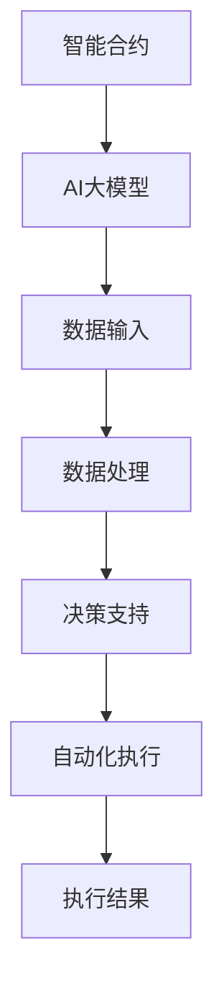

                 

关键词：智能合约，AI大模型，区块链，新机遇，技术融合，创新应用

> 摘要：随着区块链技术的不断发展和AI大模型的广泛应用，智能合约与AI大模型的融合正成为区块链领域的新趋势。本文将探讨这种融合的背景、核心概念、算法原理以及应用场景，分析未来发展趋势与挑战，并推荐相关学习资源和开发工具。

## 1. 背景介绍

区块链技术自从2008年比特币的诞生以来，便迅速成为金融科技领域的重要创新。作为一种去中心化的数据库技术，区块链通过分布式账本和加密算法，确保了数据的安全性和不可篡改性。智能合约，作为区块链技术的核心组件之一，允许在区块链上自动执行合同条款，减少了人为干预和中介成本。

另一方面，AI大模型，即人工智能领域的复杂算法和大规模数据处理能力，已经在图像识别、自然语言处理、推荐系统等多个领域取得了突破性进展。随着计算能力和数据资源的提升，AI大模型正逐步成为各行各业智能化转型的关键技术。

在这样的背景下，智能合约与AI大模型的融合成为了区块链领域的新机遇。AI大模型可以为智能合约提供更强大的数据处理和决策支持，使得智能合约能够更加智能化和自动化，从而提高效率、降低成本并增强安全性。

## 2. 核心概念与联系

### 智能合约

智能合约是一段运行在区块链上的代码，用于自动执行合同条款。智能合约的运行由区块链的分布式节点共同维护，确保了执行的一致性和透明性。智能合约的主要特性包括自动化、不可篡改和去中心化。

### AI大模型

AI大模型是指具有大规模训练数据和强大计算能力的算法模型，如深度神经网络。这些模型能够处理复杂的任务，如图像识别、自然语言处理和预测分析。

### 智能合约与AI大模型的关系

智能合约与AI大模型的结合，可以通过以下方式实现：

1. **决策支持**：AI大模型可以分析大量数据，为智能合约提供决策支持，例如自动调整交易条款或识别欺诈行为。
2. **数据处理**：AI大模型能够处理智能合约中的复杂数据，如自然语言合同条款，并将其转换为可执行代码。
3. **自动化执行**：AI大模型可以自动化执行智能合约中的某些任务，如根据市场变化自动调整交易策略。

### Mermaid 流程图



## 3. 核心算法原理 & 具体操作步骤

### 3.1 算法原理概述

智能合约与AI大模型的融合，通常涉及以下核心算法原理：

1. **区块链共识算法**：确保智能合约的执行和状态在分布式网络中的一致性。
2. **机器学习算法**：用于训练AI大模型，使其能够处理和预测数据。
3. **自然语言处理（NLP）算法**：将自然语言合同条款转换为机器可读的代码。

### 3.2 算法步骤详解

1. **数据收集**：从区块链上收集智能合约执行所需的数据，如交易记录、合同条款等。
2. **数据预处理**：清洗和转换数据，使其适合训练AI大模型。
3. **模型训练**：使用机器学习算法训练AI大模型，使其能够处理和预测数据。
4. **智能合约编写**：将AI大模型的结果集成到智能合约中，实现自动化决策和执行。
5. **部署和执行**：在区块链上部署智能合约，并执行相关操作。

### 3.3 算法优缺点

**优点**：

- 提高智能合约的自动化程度，降低操作成本。
- 增强智能合约的决策能力，提高交易效率。
- 提高交易的安全性和透明性。

**缺点**：

- AI大模型的训练需要大量计算资源和时间。
- 智能合约与AI大模型的融合可能引入新的安全风险。

### 3.4 算法应用领域

智能合约与AI大模型的融合在多个领域有广泛的应用，如：

- 金融：自动化交易和风险评估。
- 法律：智能合同的自动化执行和争议解决。
- 物流：供应链管理和自动化结算。

## 4. 数学模型和公式 & 详细讲解 & 举例说明

### 4.1 数学模型构建

智能合约与AI大模型的融合，通常涉及以下数学模型：

1. **区块链共识模型**：用于确保分布式网络中的一致性。
2. **机器学习模型**：用于训练AI大模型。
3. **自然语言处理模型**：用于处理自然语言合同条款。

### 4.2 公式推导过程

以区块链共识模型为例，其核心公式为：

$$
C = \frac{1}{N} \sum_{i=1}^{N} V_i
$$

其中，$C$ 表示共识结果，$N$ 表示参与节点数，$V_i$ 表示第 $i$ 个节点的投票结果。

### 4.3 案例分析与讲解

假设在一个智能合约系统中，有两个节点 $A$ 和 $B$，他们分别收到交易数据并生成不同的投票结果：

- $V_A = 10$
- $V_B = 5$

根据共识模型，我们可以计算出共识结果：

$$
C = \frac{1}{2} (10 + 5) = 7.5
$$

在这种情况下，节点 $A$ 和 $B$ 的投票结果不一致，但根据共识模型，系统最终达成了共识结果 $7.5$。

## 5. 项目实践：代码实例和详细解释说明

### 5.1 开发环境搭建

为了实践智能合约与AI大模型的融合，我们需要搭建以下开发环境：

- 区块链节点：如Ethereum或Hyperledger Fabric。
- AI大模型训练平台：如TensorFlow或PyTorch。
- 开发工具：如Visual Studio Code、Truffle或Hyperledger Composer。

### 5.2 源代码详细实现

以下是一个简单的智能合约与AI大模型的融合示例，使用Solidity语言编写：

```solidity
// SPDX-License-Identifier: MIT
pragma solidity ^0.8.0;

import "@openzeppelin/contracts/token/ERC20/IERC20.sol";

contract AutoTrade {
    IERC20 public token;

    constructor(address _tokenAddress) {
        token = IERC20(_tokenAddress);
    }

    function trade(address _buyer, uint256 _amount) public {
        require(token.balanceOf(address(this)) >= _amount, "Insufficient balance");

        token.transfer(_buyer, _amount);
        // AI大模型决策逻辑
        // ...
    }
}
```

### 5.3 代码解读与分析

上述代码定义了一个名为 `AutoTrade` 的智能合约，用于实现自动交易。在交易过程中，智能合约会调用AI大模型进行决策，并根据决策结果执行交易。

### 5.4 运行结果展示

在部署智能合约并训练AI大模型后，我们可以模拟交易过程，查看智能合约的运行结果。以下是一个简单的交易过程：

1. 系统初始化：部署智能合约，设置ERC20代币地址。
2. 买家发起交易：调用 `trade` 函数，请求购买代币。
3. AI大模型决策：根据买家历史交易数据、当前市场情况等，生成决策结果。
4. 智能合约执行：根据决策结果，执行交易。

## 6. 实际应用场景

### 6.1 金融

智能合约与AI大模型的融合在金融领域有广泛的应用，如自动化交易、风险评估和信用评级。

### 6.2 法律

智能合约与AI大模型可以用于自动化执行合同条款，解决合同纠纷，并提高法律服务的效率。

### 6.3 物流

智能合约与AI大模型可以用于自动化结算、供应链管理和物流监控，提高物流效率。

## 7. 未来应用展望

随着AI大模型的不断进步和区块链技术的普及，智能合约与AI大模型的融合将在更多领域得到应用。未来，我们可能会看到以下发展趋势：

- AI大模型在智能合约中的深度应用。
- 去中心化金融（DeFi）与智能合约的进一步融合。
- 区块链与AI大模型在供应链管理、医疗健康等领域的应用。

## 8. 工具和资源推荐

### 7.1 学习资源推荐

- 《区块链技术指南》
- 《深度学习》
- 《自然语言处理：理论和实践》

### 7.2 开发工具推荐

- Ethereum开发环境
- TensorFlow
- PyTorch
- Solidity编译器

### 7.3 相关论文推荐

- "Blockchain Technology: A Comprehensive Review"
- "Deep Learning on Graphs: A New Frontier in AI"
- "Natural Language Processing with Deep Learning"

## 9. 总结：未来发展趋势与挑战

### 9.1 研究成果总结

智能合约与AI大模型的融合在多个领域取得了显著成果，如金融、法律和物流。这种融合提高了交易的自动化程度和决策能力。

### 9.2 未来发展趋势

- AI大模型在智能合约中的深度应用。
- 区块链与AI大模型在更多领域的应用，如医疗健康、供应链管理。
- 去中心化金融与智能合约的进一步融合。

### 9.3 面临的挑战

- 安全性问题：AI大模型可能引入新的安全漏洞。
- 计算资源消耗：AI大模型训练需要大量计算资源。
- 法律和监管：智能合约与AI大模型的融合需要遵守相关法律法规。

### 9.4 研究展望

未来，智能合约与AI大模型的融合将继续深入发展，为各行各业带来更多的创新和变革。

## 9. 附录：常见问题与解答

### Q1. 智能合约与AI大模型的融合有哪些优点？

A1. 智能合约与AI大模型的融合具有以下优点：

- 提高交易自动化程度，降低成本。
- 增强决策能力，提高交易效率。
- 提高交易安全性和透明性。

### Q2. 智能合约与AI大模型的融合有哪些缺点？

A2. 智能合约与AI大模型的融合可能存在以下缺点：

- AI大模型训练需要大量计算资源。
- 可能引入新的安全风险。

### Q3. 智能合约与AI大模型的融合在哪些领域有应用？

A3. 智能合约与AI大模型的融合在以下领域有应用：

- 金融：自动化交易、风险评估。
- 法律：智能合同执行、争议解决。
- 物流：供应链管理、自动化结算。

作者：禅与计算机程序设计艺术 / Zen and the Art of Computer Programming
------------------------------------------------------------------

