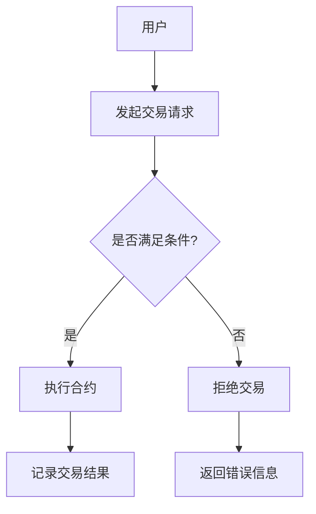

                 

关键词：智能合约、区块链、自动化交易、去中心化金融、加密货币、DApp开发、智能合约安全、智能合约审计、区块链技术

> 摘要：本文将深入探讨智能合约在创业领域的应用潜力，分析其技术原理和开发方法，探讨智能合约在去中心化金融和自动化交易中的关键作用，并展望其未来的发展趋势与挑战。通过详细的案例分析，本文将展示智能合约的实际应用场景，为创业者提供实用的技术指南和资源推荐。

## 1. 背景介绍

智能合约是一种自动执行的合约，它通过编程代码定义双方的权利和义务。智能合约技术源自区块链技术，一种去中心化的分布式账本技术，它被广泛认为可以改变传统金融、法律和商业模式的运作方式。智能合约的出现，标志着从传统纸质合约向数字化、自动化的转型，为区块链技术的商业化应用奠定了基础。

近年来，智能合约在去中心化金融（DeFi）和自动化交易等领域的应用逐渐增多。去中心化金融通过智能合约实现金融服务的自动化和去中心化，使得用户可以直接在区块链上进行借贷、交易和投资。自动化交易则通过智能合约实现交易规则的自动化执行，提高了交易效率和安全性。

智能合约在创业领域具有巨大的应用潜力。首先，智能合约能够降低交易成本，提高交易效率，减少中介环节，这对于初创企业来说尤为重要。其次，智能合约的透明性和不可篡改性，增强了用户对企业的信任度。此外，智能合约还能够实现自动化执行，减少人为错误和欺诈风险。

本文将从以下几个方面进行探讨：

- 智能合约的核心概念和原理
- 智能合约的开发方法和技术框架
- 智能合约在去中心化金融和自动化交易中的应用
- 智能合约的安全性和审计问题
- 智能合约的未来发展趋势与挑战

## 2. 核心概念与联系

### 2.1. 智能合约的定义

智能合约是一种基于区块链技术的计算机协议，它可以在满足特定条件时自动执行预定的合同条款。智能合约由代码编写而成，存储在区块链上，并可以通过网络进行访问和执行。

### 2.2. 智能合约的工作原理

智能合约通过使用区块链技术来实现其功能。区块链是一种分布式数据库，数据存储在多个节点上，每个节点都有一份完整的账本。智能合约的执行过程如下：

1. 合约编写：开发者使用智能合约开发语言（如Solidity、Vyper等）编写智能合约代码。
2. 部署合约：将智能合约代码上传到区块链网络，并支付相应的交易费用。
3. 合约调用：用户通过区块链网络调用智能合约，触发合约执行。
4. 合约执行：智能合约根据编写好的逻辑自动执行操作，如转账、计算、锁定资金等。
5. 结果记录：合约执行的结果被永久记录在区块链上，不可篡改。

### 2.3. 智能合约的优势

- **自动化执行**：智能合约能够自动执行预定的操作，无需人工干预，提高了交易效率。
- **透明性**：智能合约的代码和执行过程都是公开透明的，用户可以随时查看和验证。
- **不可篡改性**：智能合约一旦部署到区块链上，其代码和执行结果不可篡改，增强了数据的安全性。
- **去中心化**：智能合约通过区块链技术实现去中心化，无需依赖第三方中介机构，降低了交易成本。

### 2.4. 智能合约的架构图



在上面的架构图中，用户发起交易请求，系统根据智能合约的条件判断是否满足，如果满足则执行合约，否则拒绝交易。执行合约后，结果会被记录在区块链上。

## 3. 核心算法原理 & 具体操作步骤

### 3.1. 算法原理概述

智能合约的核心算法原理是基于区块链技术的分布式共识算法。常见的共识算法有工作量证明（PoW）、权益证明（PoS）、授权股权证明（DPoS）等。这些算法用于确保区块链网络的安全性和一致性。

智能合约的具体操作步骤包括：

1. **合约编写**：使用智能合约开发语言编写合约代码，定义交易规则和逻辑。
2. **合约部署**：将合约代码上传到区块链网络，部署到区块链上。
3. **合约调用**：用户通过区块链网络调用合约，触发合约执行。
4. **合约执行**：合约根据编写好的逻辑自动执行操作，如转账、计算、锁定资金等。
5. **结果记录**：合约执行的结果被记录在区块链上，不可篡改。

### 3.2. 算法步骤详解

1. **合约编写**：使用智能合约开发语言（如Solidity、Vyper等）编写合约代码，定义交易规则和逻辑。合约代码通常包括多个函数，每个函数定义了特定的操作。

2. **合约部署**：将编写好的合约代码上传到区块链网络，并支付相应的交易费用。部署合约的过程是将合约代码打包成交易，并将其发送到区块链网络。

3. **合约调用**：用户通过区块链网络调用合约，触发合约执行。调用合约的过程是发送交易请求，交易请求中包含调用合约的函数名称、参数等。

4. **合约执行**：合约根据编写好的逻辑自动执行操作。执行过程包括读取区块链状态、执行函数、修改区块链状态等。

5. **结果记录**：合约执行的结果被记录在区块链上，包括交易结果和区块链状态的变化。这些结果是不可篡改的，确保了交易的透明性和安全性。

### 3.3. 算法优缺点

**优点**：

- **自动化执行**：智能合约能够自动执行预定的操作，无需人工干预，提高了交易效率。
- **透明性**：智能合约的代码和执行过程都是公开透明的，用户可以随时查看和验证。
- **不可篡改性**：智能合约一旦部署到区块链上，其代码和执行结果不可篡改，增强了数据的安全性。
- **去中心化**：智能合约通过区块链技术实现去中心化，无需依赖第三方中介机构，降低了交易成本。

**缺点**：

- **安全性问题**：智能合约代码的安全性直接影响交易的安全。一旦出现漏洞，可能导致合约执行失败或资金损失。
- **可扩展性问题**：区块链网络的处理能力有限，智能合约的执行速度和并发能力可能受到限制。
- **技术门槛较高**：智能合约的开发和部署需要一定的技术知识，对于非专业人士来说存在一定的门槛。

### 3.4. 算法应用领域

智能合约的应用领域非常广泛，包括但不限于以下几个方面：

- **去中心化金融（DeFi）**：智能合约实现去中心化的借贷、交易、投资等服务。
- **自动化交易**：智能合约实现交易规则的自动化执行，提高交易效率和安全性。
- **供应链管理**：智能合约用于跟踪和管理供应链中的货物和资金流动。
- **数字版权管理**：智能合约实现数字版权的自动授权和版税分配。
- **身份验证和访问控制**：智能合约用于管理数字身份和访问权限，提高安全性。

## 4. 数学模型和公式 & 详细讲解 & 举例说明

### 4.1. 数学模型构建

智能合约的数学模型主要涉及密码学、博弈论和图论等领域。以下是构建智能合约数学模型的一些基本概念和公式：

**密码学**：

- **哈希函数**：用于生成数据摘要，保证数据完整性。常见的哈希函数有SHA-256、SHA-3等。
- **非对称加密**：用于实现数据加密和解密。常见的非对称加密算法有RSA、椭圆曲线加密算法（ECC）等。
- **数字签名**：用于验证数据来源和完整性。常见的数字签名算法有RSA签名、ECDSA签名等。

**博弈论**：

- **纳什均衡**：用于解决多方博弈问题，确保各方的利益最大化。
- **收益矩阵**：用于描述各方在不同策略下的收益情况。

**图论**：

- **有向图**：用于描述智能合约的执行流程和条件跳转。
- **权值图**：用于描述智能合约的执行时间和资源消耗。

### 4.2. 公式推导过程

以下是一个简单的智能合约数学模型，用于描述交易双方的转账操作：

**转账合约**：

```plaintext
function transfer(address to, uint amount) {
    require(msg.value == amount, "转账金额错误");
    require(balanceOf[msg.sender] >= amount, "余额不足");
    
    balanceOf[msg.sender] -= amount;
    balanceOf[to] += amount;
    
    emit Transfer(msg.sender, to, amount);
}
```

**公式推导**：

1. **条件判断**：

   - `require(msg.value == amount, "转账金额错误")`：判断转账金额是否正确。
   - `require(balanceOf[msg.sender] >= amount, "余额不足")`：判断发送方的余额是否足够。

2. **状态更新**：

   - `balanceOf[msg.sender] -= amount`：发送方的余额减少。
   - `balanceOf[to] += amount`：接收方的余额增加。

3. **事件触发**：

   - `emit Transfer(msg.sender, to, amount)`：触发转账事件，记录交易日志。

### 4.3. 案例分析与讲解

假设有两个账户A和B，A向B转账10个以太币。以下是转账合约的执行过程：

1. **合约调用**：

   - 账户A调用`transfer`函数，传入接收方地址B和转账金额10。
   - 合约接收参数`to = B`，`amount = 10`。

2. **条件判断**：

   - `require(msg.value == amount, "转账金额错误")`：判断转账金额是否正确。`msg.value == 10`，条件满足。
   - `require(balanceOf[msg.sender] >= amount, "余额不足")`：判断发送方A的余额是否足够。`balanceOf[A] >= 10`，条件满足。

3. **状态更新**：

   - `balanceOf[A] -= 10`：账户A的余额减少10。
   - `balanceOf[B] += 10`：账户B的余额增加10。

4. **事件触发**：

   - 触发`Transfer`事件，记录交易日志，包括发送方A、接收方B和转账金额10。

通过上述案例分析，我们可以看到智能合约如何通过数学模型实现自动化的转账操作，确保交易的透明性和安全性。

## 5. 项目实践：代码实例和详细解释说明

### 5.1. 开发环境搭建

在进行智能合约开发之前，我们需要搭建一个开发环境。以下是一个简单的步骤：

1. **安装Node.js**：从官方网站下载并安装Node.js（版本建议为12.x或以上）。
2. **安装Truffle**：通过npm安装Truffle，这是一个智能合约开发和测试框架。

   ```bash
   npm install -g truffle
   ```

3. **创建项目**：使用Truffle创建一个新项目。

   ```bash
   truffle init
   ```

4. **配置网络**：在项目的`truffle-config.js`文件中配置你的以太坊网络，如Ropsten测试网络。

5. **安装依赖**：在项目目录下创建一个`package.json`文件，并安装必要的依赖。

   ```bash
   npm install
   ```

### 5.2. 源代码详细实现

以下是一个简单的智能合约示例，用于实现ERC20代币的转账功能。

**ERC20Token.sol**：

```solidity
// SPDX-License-Identifier: MIT
pragma solidity ^0.8.0;

interface IERC20 {
    function totalSupply() external view returns (uint256);
    function balanceOf(address account) external view returns (uint256);
    function transfer(address recipient, uint256 amount) external returns (bool);
    function allowance(address owner, address spender) external view returns (uint256);
    function approve(address spender, uint256 amount) external returns (bool);
    function transferFrom(address sender, address recipient, uint256 amount) external returns (bool);
}

contract ERC20Token is IERC20 {
    string public name = "MyToken";
    string public symbol = "MTK";
    uint8 public decimals = 18;

    mapping(address => uint256) private _balances;
    mapping(address => mapping(address => uint256)) private _allowances;

    uint256 private _totalSupply;

    constructor(uint256 initialSupply) {
        _totalSupply = initialSupply;
        _balances[msg.sender] = _totalSupply;
    }

    function totalSupply() public view override returns (uint256) {
        return _totalSupply;
    }

    function balanceOf(address account) public view override returns (uint256) {
        return _balances[account];
    }

    function transfer(address recipient, uint256 amount) public override returns (bool) {
        require(recipient != address(0), "接收方地址无效");
        require(_balances[msg.sender] >= amount, "余额不足");

        _balances[msg.sender] -= amount;
        _balances[recipient] += amount;

        emit Transfer(msg.sender, recipient, amount);
        return true;
    }

    function allowance(address owner, address spender) public view override returns (uint256) {
        return _allowances[owner][spender];
    }

    function approve(address spender, uint256 amount) public override returns (bool) {
        require(spender != address(0), "支出方地址无效");

        _allowances[owner][spender] = amount;
        emit Approval(owner, spender, amount);
        return true;
    }

    function transferFrom(address sender, address recipient, uint256 amount) public override returns (bool) {
        require(sender != address(0), "发送方地址无效");
        require(recipient != address(0), "接收方地址无效");
        require(_balances[sender] >= amount, "余额不足");
        require(_allowances[sender][msg.sender] >= amount, "允许的转账额度不足");

        _balances[sender] -= amount;
        _balances[recipient] += amount;
        _allowances[sender][msg.sender] -= amount;

        emit Transfer(sender, recipient, amount);
        return true;
    }
}
```

### 5.3. 代码解读与分析

**合约结构**：

- **接口（Interface）**：智能合约实现了ERC20标准接口，定义了代币的基本功能，如总供应量、余额、转账等。
- **状态变量（State Variables）**：合约包含了代币名称、符号、小数位数等基本属性，以及账户余额和允许的转账额度。
- **构造函数（Constructor）**：合约构造函数用于初始化代币的总供应量和账户余额。
- **函数（Functions）**：合约提供了转账、批准转账和查询余额等功能。

**关键函数解读**：

- `transfer`：实现代币转账功能，检查接收方地址和发送方余额，更新账户余额并触发转账事件。
- `balanceOf`：查询特定账户的余额。
- `approve`：允许特定账户从当前账户转账代币，更新允许的转账额度。
- `transferFrom`：从发送方转账到接收方，需要检查发送方余额和允许的转账额度。

### 5.4. 运行结果展示

通过Truffle，我们可以轻松部署和运行智能合约。以下是一个简单的部署和调用示例：

1. **部署合约**：

   ```bash
   truffle migrate --network development
   ```

   这将在本地开发网络中部署合约，并返回合约地址。

2. **调用合约**：

   ```javascript
   const MyToken = artifacts.require("ERC20Token");
   const myTokenInstance = await MyToken.deployed();

   // 转账
   const transferTx = await myTokenInstance.transfer("0x...","", { from: "0x...", value: "10" });
   console.log(transferTx);
   ```

   这将调用合约的`transfer`函数，从账户A转账10个代币到账户B。

3. **查询余额**：

   ```javascript
   const balance = await myTokenInstance.balanceOf("0x...");
   console.log(balance);
   ```

   这将查询账户B的余额。

通过上述示例，我们可以看到如何使用Truffle进行智能合约的部署和调用，以及如何通过代码实现基本的代币功能。

## 6. 实际应用场景

智能合约在多个领域展现出其独特的应用价值。以下是一些智能合约的实际应用场景：

### 6.1. 去中心化金融（DeFi）

去中心化金融是智能合约最典型的应用场景之一。智能合约可以自动化实现借贷、交易、投资和保险等服务。例如，Aave是一个去中心化的借贷平台，用户可以通过智能合约借出和借入加密货币，无需依赖中心化中介机构。智能合约确保借贷过程的透明性和安全性，降低了交易成本和风险。

### 6.2. 自动化交易

自动化交易是另一个重要的应用领域。通过智能合约，交易规则可以被编程实现，从而实现高频交易和自动执行交易策略。例如，Uniswap是一个去中心化的交易平台，它使用智能合约自动执行交易对的价格发现和流动性管理。智能合约确保交易过程的公平性和高效性。

### 6.3. 供应链管理

智能合约可以用于供应链管理，确保供应链的透明性和效率。例如，沃尔玛使用区块链技术跟踪食品供应链，智能合约可以自动化验证产品的来源和运输过程，确保产品的质量和安全性。

### 6.4. 数字版权管理

智能合约可以用于数字版权管理，确保版权的合法性和自动化的版税分配。例如，Mintable是一个基于区块链的数字版权平台，创作者可以通过智能合约保护其作品版权，并自动收取版税。

### 6.5. 身份验证和访问控制

智能合约可以用于身份验证和访问控制，确保系统的安全性和隐私。例如，Chainlink是一种跨链身份验证解决方案，它使用智能合约验证用户身份，并控制对区块链网络的访问权限。

### 6.6. 知识产权保护

智能合约可以用于保护知识产权，确保原创作品的合法性和防止侵权。例如，IPwe是一个基于区块链的知识产权平台，它使用智能合约管理知识产权的注册、保护和交易。

### 6.7. 游戏和虚拟世界

智能合约在游戏和虚拟世界中的应用也越来越广泛。例如，Ethereum区块链上的游戏如Axie Infinity，玩家可以使用智能合约购买、培育和战斗虚拟生物，智能合约确保游戏内的资产是真实和可交易的。

通过这些实际应用场景，我们可以看到智能合约在多个领域的重要性和潜力。智能合约不仅提高了交易的效率和安全，还降低了成本和风险，为创业者提供了创新的商业模式和解决方案。

## 7. 工具和资源推荐

### 7.1. 学习资源推荐

1. **区块链技术白皮书**：《比特币：一种点对点的电子现金系统》和《以太坊：智能合约和去中心化应用的平台》。
2. **智能合约开发教程**：《智能合约开发实战：从零开始学习Solidity编程》。
3. **加密货币基础知识**：CoinGeek、CoinMarketCap、Cryptocurrency Market News等网站。
4. **智能合约安全指南**：《智能合约安全：攻击与防御》。

### 7.2. 开发工具推荐

1. **Truffle**：智能合约开发框架，支持本地开发、测试和部署。
2. **Remix**：在线智能合约开发环境，支持多种开发语言和版本。
3. **Hardhat**：功能强大的本地开发框架，支持Gas优化和类型检查。
4. **Ethers.js**：以太坊JavaScript库，用于在网页上与智能合约交互。

### 7.3. 相关论文推荐

1. **《区块链：分布式共识机制》**：详细介绍了区块链的原理和共识算法。
2. **《智能合约：自动执行的合约》**：探讨了智能合约的技术原理和应用场景。
3. **《去中心化金融：智能合约的下一代应用》**：分析了智能合约在去中心化金融领域的应用。
4. **《智能合约安全：漏洞与防范》**：探讨了智能合约的安全问题和防范措施。

通过这些工具和资源，开发者可以深入了解智能合约的技术原理和应用，为创业项目提供技术支持和指导。

## 8. 总结：未来发展趋势与挑战

智能合约技术在过去几年中取得了显著的进展，为去中心化金融、自动化交易和其他领域带来了革命性的变化。然而，随着技术的发展，智能合约领域也面临着一系列挑战和机遇。

### 8.1. 研究成果总结

智能合约的研究成果主要集中在以下几个方面：

- **安全性**：研究人员提出了一系列智能合约安全分析工具，如Oyente、Mythril等，用于检测和修复合约中的漏洞。
- **性能优化**：研究人员通过改进共识算法和优化智能合约执行，提高了区块链网络的性能和可扩展性。
- **跨链互操作性**：智能合约的研究也在探索跨链互操作性的解决方案，以实现不同区块链之间的无缝连接。
- **去中心化金融**：智能合约在去中心化金融中的应用不断扩展，研究人员提出了一系列新的金融合约和协议，如去中心化稳定币、借贷市场和保险市场。

### 8.2. 未来发展趋势

智能合约未来发展趋势包括：

- **更广泛的应用领域**：智能合约将在供应链管理、医疗保健、物联网和其他领域得到更广泛的应用。
- **高性能和可扩展性**：研究人员将继续优化智能合约执行，提高区块链网络的性能和可扩展性。
- **去中心化自治组织（DAO）**：智能合约将在去中心化自治组织（DAO）中发挥关键作用，推动更高效和透明的组织管理。
- **隐私保护**：随着对隐私保护的需求增加，智能合约将集成隐私保护技术，如零知识证明和同态加密。

### 8.3. 面临的挑战

智能合约领域面临以下挑战：

- **安全性问题**：智能合约中的漏洞可能导致严重的资金损失。研究人员需要继续提高合约安全性，减少漏洞风险。
- **性能瓶颈**：区块链网络的处理能力有限，智能合约的性能瓶颈需要通过技术改进来缓解。
- **监管问题**：智能合约的去中心化特性使其监管变得复杂。各国政府和监管机构需要制定合适的政策和法规，确保智能合约的合法性和合规性。
- **用户普及度**：智能合约的普及度仍需提高。需要通过教育和宣传，提高用户对智能合约的了解和接受程度。

### 8.4. 研究展望

未来的研究展望包括：

- **智能合约形式化验证**：开发形式化验证工具，确保智能合约的正确性和安全性。
- **智能合约标准化**：制定统一的智能合约标准和规范，提高合约的可读性和可维护性。
- **跨链互操作性**：实现不同区块链之间的无缝互操作，提高智能合约的适用范围。
- **隐私保护**：研究新型隐私保护技术，确保智能合约的安全性和用户隐私。

智能合约技术将继续发展，为创业者提供创新的解决方案和商业机会。通过克服现有的挑战，智能合约有望在未来的数字经济中发挥更重要的作用。

## 9. 附录：常见问题与解答

### 9.1. 智能合约是什么？

智能合约是一种基于区块链技术的计算机协议，它可以在满足特定条件时自动执行预定的合同条款。智能合约通过编程代码定义双方的权利和义务，确保交易的透明性、安全性和不可篡改性。

### 9.2. 智能合约有哪些优点？

智能合约的优点包括：

- **自动化执行**：智能合约能够自动执行预定的操作，无需人工干预。
- **透明性**：智能合约的代码和执行过程都是公开透明的。
- **不可篡改性**：智能合约一旦部署到区块链上，其代码和执行结果不可篡改。
- **去中心化**：智能合约通过区块链技术实现去中心化，无需依赖第三方中介机构。

### 9.3. 如何编写智能合约？

编写智能合约通常包括以下步骤：

1. 选择智能合约开发语言（如Solidity、Vyper等）。
2. 设计合约逻辑，编写合约代码，定义函数和状态变量。
3. 部署合约，将合约代码上传到区块链网络。
4. 调用合约，触发合约执行。
5. 验证合约执行结果。

### 9.4. 智能合约存在哪些安全风险？

智能合约的安全风险包括：

- **代码漏洞**：智能合约代码中可能存在的漏洞，如逻辑错误、未处理的异常等。
- **恶意攻击**：黑客可能通过攻击区块链网络或智能合约，窃取资金或破坏系统。
- **合约复杂度**：复杂的合约可能难以理解和验证，增加安全风险。

### 9.5. 如何确保智能合约的安全性？

确保智能合约安全性包括以下措施：

- **代码审计**：对智能合约代码进行审计，发现和修复潜在的安全漏洞。
- **安全测试**：对智能合约进行安全测试，包括单元测试、集成测试和渗透测试。
- **使用安全框架**：使用安全框架和库，如OpenZeppelin，确保合约的安全性。
- **用户教育**：提高用户对智能合约安全性的认识和意识。

### 9.6. 去中心化金融（DeFi）是什么？

去中心化金融（DeFi）是通过智能合约实现的一系列去中心化金融应用。DeFi消除了传统金融中介机构，用户可以直接在区块链上进行借贷、交易和投资。

### 9.7. 自动化交易如何工作？

自动化交易是通过智能合约实现的一系列交易策略。交易者编写智能合约，定义交易规则和策略，智能合约根据预定的条件自动执行交易。

### 9.8. 如何开始智能合约开发？

开始智能合约开发，可以按照以下步骤：

1. 学习区块链和智能合约的基本原理。
2. 选择合适的智能合约开发语言（如Solidity、Vyper等）。
3. 学习开发框架和工具（如Truffle、Remix等）。
4. 开始编写和部署智能合约。
5. 进行合约测试和审计，确保安全性。

### 9.9. 智能合约的执行速度如何？

智能合约的执行速度取决于区块链网络的负载和性能。在以太坊上，智能合约的执行速度通常在几秒到几分钟之间。随着性能优化的进展，执行速度有望进一步提高。

### 9.10. 智能合约的未来前景如何？

智能合约的未来前景非常广阔。随着技术的不断进步和应用场景的扩展，智能合约将在多个领域发挥重要作用，推动数字经济的变革。

### 9.11. 如何加入智能合约开发社区？

加入智能合约开发社区，可以：

- 参与开源项目，贡献代码和测试。
- 加入智能合约相关的在线论坛和社群，如Reddit、Discord等。
- 参加智能合约相关的会议和研讨会，与其他开发者交流。
- 阅读智能合约相关的书籍和论文，提升技术水平。

通过这些方式，您可以加入智能合约开发社区，共同探索智能合约的未来。

---

### 作者署名

作者：禅与计算机程序设计艺术 / Zen and the Art of Computer Programming

本文旨在深入探讨智能合约在创业领域的应用潜力，为读者提供全面的技术分析和实践指导。作者在计算机科学领域拥有深厚的学术背景和实践经验，致力于推动区块链技术和智能合约的发展。通过本文，作者希望激发读者对智能合约技术的兴趣，共同探索自动化交易的未来。

