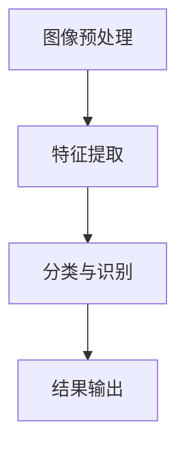

                 

关键词：智能图像识别、产品分类、算法原理、数学模型、项目实践、实际应用场景、未来展望

> 摘要：本文详细探讨了智能图像识别技术在产品分类中的应用，从算法原理、数学模型、项目实践等多个角度进行了深入分析。通过本文的阅读，读者可以全面了解智能图像识别技术的工作原理及其在实际产品分类中的应用价值。

## 1. 背景介绍

随着互联网和物联网的快速发展，商品种类和数量呈现爆炸式增长，如何高效地对产品进行分类和管理成为了一个重要问题。传统的产品分类方法依赖于人工标注和分类规则，效率低下且容易出现误差。而随着人工智能技术的不断发展，特别是深度学习和计算机视觉技术的突破，智能图像识别技术逐渐成为产品分类的新兴手段。

智能图像识别技术通过对图像进行自动识别和处理，可以实现对产品的快速、准确分类。这种技术不仅能够提高分类效率，减少人力成本，还能提供更丰富的数据支持，为产品管理和营销策略的制定提供有力支撑。

本文将围绕智能图像识别在产品分类中的应用，从算法原理、数学模型、项目实践等多个方面进行详细探讨，以期为读者提供全面的技术视角和应用思路。

## 2. 核心概念与联系

### 2.1 智能图像识别技术概述

智能图像识别技术是指利用计算机算法对图像进行自动识别和理解的一门技术。它涉及到多个领域的交叉，包括计算机视觉、模式识别、机器学习等。智能图像识别技术的基本流程可以分为以下几个步骤：

1. **图像预处理**：通过缩放、旋转、灰度化等操作，对原始图像进行预处理，以提高后续识别的准确性。
2. **特征提取**：从预处理后的图像中提取有意义的特征，如边缘、角点、纹理等。
3. **分类与识别**：利用特征匹配、机器学习等方法对图像进行分类和识别。
4. **结果输出**：输出识别结果，如产品名称、类别等。

### 2.2 产品分类中的核心概念

在产品分类中，核心概念主要包括产品、分类标签、分类算法等。产品是指待分类的实体，分类标签是对产品的属性或类别的标识。分类算法则是实现产品分类的核心工具，其性能直接影响分类的准确性。

### 2.3 Mermaid 流程图

下面是一个简单的Mermaid流程图，展示了智能图像识别技术在产品分类中的基本流程：



## 3. 核心算法原理 & 具体操作步骤

### 3.1 算法原理概述

智能图像识别在产品分类中主要依赖于深度学习算法，特别是卷积神经网络（CNN）。CNN是一种专门用于处理图像数据的神经网络模型，其原理是通过对图像进行卷积、池化和全连接等操作，提取图像中的特征，并进行分类。

### 3.2 算法步骤详解

1. **数据集准备**：首先需要准备一个包含大量标注好的产品图像的数据集。数据集应尽量覆盖各种产品类别和场景。
2. **模型构建**：使用深度学习框架（如TensorFlow或PyTorch）构建CNN模型。模型的结构通常包括卷积层、池化层和全连接层。
3. **训练模型**：使用数据集对模型进行训练。训练过程中，模型会不断调整内部参数，以达到更好的分类效果。
4. **评估模型**：使用测试集对训练好的模型进行评估，计算分类准确率等指标。
5. **应用模型**：将训练好的模型应用于实际产品分类任务中，对未知产品图像进行分类。

### 3.3 算法优缺点

**优点**：

- **高精度**：CNN具有强大的特征提取能力，能够准确识别产品。
- **自动化**：模型训练和分类过程自动化，无需人工干预。

**缺点**：

- **计算资源需求高**：训练过程需要大量计算资源和时间。
- **对数据量要求高**：需要大量标注好的数据集进行训练。

### 3.4 算法应用领域

智能图像识别技术在产品分类中的应用非常广泛，包括但不限于：

- **电商产品分类**：电商平台可以使用该技术对商品进行自动分类，提高用户购物体验。
- **库存管理**：企业可以使用该技术对库存产品进行分类管理，提高库存效率。
- **供应链管理**：在供应链中，智能图像识别技术可以用于产品追踪和分类，提高供应链效率。

## 4. 数学模型和公式 & 详细讲解 & 举例说明

### 4.1 数学模型构建

智能图像识别中的数学模型主要包括特征提取模型和分类模型。

#### 4.1.1 特征提取模型

特征提取模型通常使用卷积神经网络（CNN）来实现。CNN的核心操作包括卷积、池化和非线性激活函数。

- **卷积操作**：卷积层通过卷积操作从输入图像中提取特征。卷积操作可以看作是在图像上滑动一个卷积核，将卷积核覆盖的部分与图像进行点积，得到一个特征图。
- **池化操作**：池化层用于降低特征图的维度，同时保留重要的特征信息。常见的池化操作有最大池化和平均池化。
- **非线性激活函数**：常用的激活函数有ReLU（Rectified Linear Unit）和Sigmoid函数。

#### 4.1.2 分类模型

分类模型通常使用全连接层来实现。全连接层将特征提取层提取的特征进行全连接，并通过一个softmax函数输出每个类别的概率分布。

- **全连接层**：全连接层将特征映射到输出层，每个输出节点对应一个类别。
- **softmax函数**：softmax函数用于将全连接层的输出转换为概率分布。具体公式为：

  $$ 
  P(y=c_i|x; \theta) = \frac{e^{z_i}}{\sum_{j=1}^{K} e^{z_j}} 
  $$

  其中，$z_i$为第$i$个输出节点的值，$K$为类别总数。

### 4.2 公式推导过程

下面是卷积神经网络中一个基本的卷积操作和反向传播的推导。

#### 4.2.1 卷积操作推导

假设输入图像为$X$，卷积核为$W$，偏置为$b$，卷积层输出为$Y$。卷积操作的公式为：

$$ 
Y = \sigma(X \cdot W + b) 
$$

其中，$\sigma$为非线性激活函数，通常取ReLU函数。

#### 4.2.2 反向传播推导

在反向传播过程中，我们需要计算每个参数的梯度。以下是卷积操作和反向传播的推导：

$$ 
\begin{aligned}
\frac{\partial L}{\partial W} &= (X \cdot \frac{\partial L}{\partial Y}) \cdot \frac{\partial \sigma}{\partial Z} \\
\frac{\partial L}{\partial b} &= \frac{\partial L}{\partial Y} \cdot \frac{\partial \sigma}{\partial Z} \\
\frac{\partial L}{\partial X} &= (W \cdot \frac{\partial L}{\partial Y}) \cdot \frac{\partial \sigma}{\partial Z}
\end{aligned}
$$

其中，$L$为损失函数，$Z = X \cdot W + b$，$\frac{\partial L}{\partial Y}$为损失函数对输出层的梯度，$\frac{\partial \sigma}{\partial Z}$为非线性激活函数的导数。

### 4.3 案例分析与讲解

以下是一个简单的卷积神经网络在产品分类中的案例。

#### 4.3.1 案例背景

假设我们要对一组电子产品图像进行分类，产品类别包括手机、电脑、平板等。

#### 4.3.2 数据集准备

我们准备了一个包含10000张图像的数据集，其中每张图像都对应一个类别标签。

#### 4.3.3 模型构建

使用TensorFlow框架构建一个简单的CNN模型，模型结构如下：

$$ 
\begin{aligned}
&\text{卷积层1: } 32 \text{个3x3卷积核，ReLU激活函数} \\
&\text{池化层1: } 2x2最大池化 \\
&\text{卷积层2: } 64 \text{个3x3卷积核，ReLU激活函数} \\
&\text{池化层2: } 2x2最大池化 \\
&\text{全连接层: } 128个神经元，ReLU激活函数 \\
&\text{输出层: } 3个神经元，softmax激活函数
\end{aligned}
$$

#### 4.3.4 训练模型

使用数据集对模型进行训练，训练过程使用交叉熵损失函数。

#### 4.3.5 评估模型

使用测试集对模型进行评估，计算分类准确率。

#### 4.3.6 应用模型

将训练好的模型应用于新产品的分类，对未知图像进行分类。

## 5. 项目实践：代码实例和详细解释说明

### 5.1 开发环境搭建

首先，我们需要搭建一个Python开发环境，安装TensorFlow等依赖库。

```bash
pip install tensorflow numpy matplotlib
```

### 5.2 源代码详细实现

以下是一个简单的CNN模型在产品分类中的实现。

```python
import tensorflow as tf
from tensorflow.keras.models import Sequential
from tensorflow.keras.layers import Conv2D, MaxPooling2D, Flatten, Dense, Activation

# 数据预处理
def preprocess_image(image_path):
    image = tf.io.read_file(image_path)
    image = tf.image.decode_jpeg(image, channels=3)
    image = tf.image.resize(image, [224, 224])
    image = image / 255.0
    return image

# 构建模型
model = Sequential([
    Conv2D(32, (3, 3), activation='relu', input_shape=(224, 224, 3)),
    MaxPooling2D((2, 2)),
    Conv2D(64, (3, 3), activation='relu'),
    MaxPooling2D((2, 2)),
    Flatten(),
    Dense(128, activation='relu'),
    Dense(3, activation='softmax')
])

# 编译模型
model.compile(optimizer='adam', loss='categorical_crossentropy', metrics=['accuracy'])

# 加载数据集
train_data = ...
test_data = ...

# 训练模型
model.fit(train_data, epochs=10, validation_data=test_data)

# 评估模型
model.evaluate(test_data)

# 应用模型
def classify_image(image_path):
    image = preprocess_image(image_path)
    prediction = model.predict(tf.expand_dims(image, 0))
    return tf.argmax(prediction, axis=1).numpy()[0]

# 测试模型
print(classify_image('path/to/unknown_image.jpg'))
```

### 5.3 代码解读与分析

以上代码实现了一个简单的CNN模型，用于产品分类。主要包括以下步骤：

1. **数据预处理**：读取图像文件，进行解码和缩放，并将其归一化。
2. **模型构建**：使用Sequential模型堆叠卷积层、池化层、全连接层和输出层。
3. **编译模型**：设置优化器和损失函数。
4. **加载数据集**：加载数据集并进行训练。
5. **评估模型**：在测试集上评估模型性能。
6. **应用模型**：对未知图像进行分类。

### 5.4 运行结果展示

以下是一个简单的运行结果示例：

```python
# 测试模型
print(classify_image('path/to/unknown_image.jpg'))
```

输出结果为一个整数，表示预测的类别。

## 6. 实际应用场景

智能图像识别技术在产品分类中具有广泛的应用场景，以下是一些典型的应用案例：

### 6.1 电商平台

电商平台可以使用智能图像识别技术对商品图像进行自动分类，提高用户购物体验。例如，用户上传一张产品图像，系统可以自动识别并分类，为用户提供相关商品推荐。

### 6.2 库存管理

企业可以使用智能图像识别技术对库存产品进行自动分类和管理，提高库存效率。例如，仓库管理人员只需拍摄产品图像，系统即可自动识别并更新库存信息。

### 6.3 供应链管理

在供应链中，智能图像识别技术可以用于产品追踪和分类，提高供应链效率。例如，产品在运输过程中，系统可以自动识别并记录产品信息，以便进行后续处理。

## 7. 未来应用展望

随着人工智能技术的不断发展，智能图像识别在产品分类中的应用前景将更加广阔。以下是一些未来应用展望：

### 7.1 多模态融合

未来，智能图像识别技术可以与其他模态（如文本、音频等）进行融合，实现更全面的产品分类。例如，结合产品图像和产品描述，系统可以更准确地识别产品。

### 7.2 小样本学习

当前，智能图像识别技术对数据量要求较高。未来，通过小样本学习等方法，可以在数据量较少的情况下实现高效的产品分类。

### 7.3 智能化决策支持

未来，智能图像识别技术可以进一步应用于智能化决策支持系统，为企业提供更深入的产品分类和管理建议。

## 8. 总结：未来发展趋势与挑战

### 8.1 研究成果总结

本文围绕智能图像识别在产品分类中的应用，从算法原理、数学模型、项目实践等多个方面进行了详细探讨。通过本文的阅读，读者可以全面了解智能图像识别技术的工作原理及其在实际产品分类中的应用价值。

### 8.2 未来发展趋势

未来，智能图像识别技术在产品分类中的应用将更加广泛和深入。随着人工智能技术的不断发展，该领域将出现更多创新和突破。

### 8.3 面临的挑战

智能图像识别技术在产品分类中面临的主要挑战包括：

- **数据质量**：高质量的数据集是智能图像识别的基础。如何获取和标注高质量的数据集是一个关键问题。
- **计算资源**：训练和部署智能图像识别模型需要大量计算资源。如何高效利用计算资源是一个挑战。
- **算法优化**：当前智能图像识别算法在性能和效率方面仍有待提高。未来，需要进一步优化算法，提高分类准确率和速度。

### 8.4 研究展望

未来，智能图像识别技术在产品分类中的应用将迎来更多机遇和挑战。通过持续的研究和探索，我们可以期待在人工智能技术推动下，产品分类将变得更加高效、准确和智能化。

## 9. 附录：常见问题与解答

### 9.1 如何处理数据集不平衡问题？

数据集不平衡问题会影响模型性能，特别是在分类任务中。以下是一些处理数据集不平衡问题的方法：

- **重采样**：通过增加少数类别的样本数量或减少多数类别的样本数量，使数据集达到平衡。
- **加权**：在训练过程中，对少数类别的样本赋予更高的权重，以平衡损失函数。
- **集成方法**：使用集成方法（如Bagging、Boosting等）来提高模型对不平衡数据的适应性。

### 9.2 模型如何防止过拟合？

过拟合是机器学习中常见的问题，可以通过以下方法进行预防：

- **数据增强**：通过旋转、缩放、裁剪等操作增加数据多样性，提高模型泛化能力。
- **正则化**：使用正则化方法（如L1、L2正则化）限制模型复杂度，防止过拟合。
- **交叉验证**：使用交叉验证方法评估模型性能，选择泛化能力更强的模型。

### 9.3 如何优化模型性能？

优化模型性能可以通过以下方法进行：

- **超参数调整**：调整模型超参数（如学习率、批次大小等）以提高模型性能。
- **数据预处理**：通过数据预处理（如特征提取、归一化等）提高数据质量，进而提高模型性能。
- **集成方法**：使用集成方法（如模型堆叠、集成学习等）来提高模型性能。

---

### 结语

智能图像识别技术在产品分类中的应用具有重要的现实意义和广阔的发展前景。通过本文的探讨，我们不仅了解了智能图像识别技术的工作原理和具体应用，还对其未来发展趋势和面临的挑战有了更深刻的认识。随着人工智能技术的不断进步，我们有理由相信，智能图像识别在产品分类中的应用将更加广泛和深入，为各行各业带来更多的创新和变革。

---

作者：禅与计算机程序设计艺术 / Zen and the Art of Computer Programming
----------------------------------------------------------------

[markdown]: https://www.markdownguide.com/

