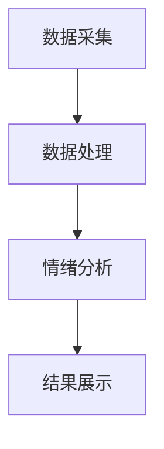

                 

关键词：智能宠物，情绪分析，宠物需求，创业，技术实现，应用场景

> 摘要：随着人工智能技术的不断发展，宠物行业也逐渐迎来了智能化的浪潮。本文旨在探讨如何利用智能宠物情绪分析技术，深入理解宠物的需求，从而推动宠物行业的创新和发展。文章将详细介绍智能宠物情绪分析的核心概念、算法原理、数学模型、项目实践以及未来应用前景。

## 1. 背景介绍

### 宠物行业的发展现状

近年来，随着人们生活水平的提高，宠物行业呈现出快速发展的态势。据统计，全球宠物市场规模逐年攀升，宠物用品、宠物医疗、宠物美容、宠物训练等多个领域均取得了显著的进展。尤其是在宠物智能化方面，越来越多的企业和创业者开始关注并投入到这个新兴市场。

### 智能宠物的发展趋势

智能宠物的发展趋势主要体现在以下几个方面：

1. **智能穿戴设备**：通过佩戴智能设备，宠物主可以实时了解宠物的健康状态、活动情况等，从而更好地照顾宠物。

2. **智能宠物玩具**：借助人工智能技术，宠物玩具能够根据宠物的行为和情绪进行互动，提高宠物的生活质量。

3. **智能宠物医院**：利用智能诊断设备和远程医疗技术，实现宠物的健康监测和诊疗服务，提高宠物医疗的效率和质量。

4. **智能宠物训练**：通过人工智能算法，为宠物提供个性化的训练方案，帮助宠物主更好地教育和培养宠物。

## 2. 核心概念与联系

### 情绪分析

情绪分析是指通过分析宠物的行为、声音、生理信号等数据，对宠物的情绪进行识别和判断。情绪分析在宠物行业中具有重要意义，可以帮助宠物主更好地了解宠物的需求，从而提供更精准的照顾。

### 数据收集与处理

数据收集与处理是情绪分析的基础。通过传感器、摄像头、麦克风等设备，可以收集到宠物的行为、声音、生理信号等多维数据。随后，对这些数据进行处理、清洗和标注，以便用于情绪分析的模型训练。

### 人工智能算法

人工智能算法是实现情绪分析的核心。常见的情绪分析算法包括基于传统机器学习的算法（如SVM、决策树等）和基于深度学习的算法（如CNN、RNN等）。通过训练模型，可以实现对宠物情绪的准确识别。

### 架构设计

智能宠物情绪分析系统通常包括数据采集层、数据处理层、情绪分析层和展示层。数据采集层负责收集宠物的行为、声音、生理信号等数据；数据处理层负责对数据进行处理、清洗和标注；情绪分析层负责使用人工智能算法对情绪进行识别；展示层则将分析结果以图表、文字等形式展示给宠物主。

### Mermaid 流程图

下面是一个简化的智能宠物情绪分析系统的 Mermaid 流程图：



## 3. 核心算法原理 & 具体操作步骤

### 3.1 算法原理概述

智能宠物情绪分析的核心算法包括以下几个方面：

1. **行为识别**：通过分析宠物的动作、姿态等行为特征，判断宠物的情绪状态。

2. **声音识别**：通过分析宠物的叫声、音调、节奏等声音特征，推断宠物的情绪。

3. **生理信号识别**：通过分析宠物的生理信号，如心率、血压、体温等，判断宠物的情绪状态。

4. **多模态融合**：将行为、声音、生理信号等多种数据融合，提高情绪分析的准确性。

### 3.2 算法步骤详解

1. **数据采集**：使用传感器、摄像头、麦克风等设备收集宠物的行为、声音、生理信号数据。

2. **数据处理**：对采集到的数据进行预处理，包括去噪、归一化、特征提取等。

3. **特征提取**：将处理后的数据转化为特征向量，用于训练情绪分析模型。

4. **模型训练**：使用深度学习算法（如CNN、RNN等）对特征向量进行训练，得到情绪分析模型。

5. **情绪分析**：使用训练好的模型对新的数据进行分析，判断宠物的情绪状态。

6. **结果展示**：将分析结果以图表、文字等形式展示给宠物主，帮助宠物主更好地了解宠物的情绪。

### 3.3 算法优缺点

#### 优点：

1. **高准确性**：通过多模态数据融合，提高情绪分析的准确性。

2. **实时性**：可以实时分析宠物的情绪，帮助宠物主及时采取措施。

3. **个性化**：可以根据宠物的个性特点进行情绪分析，提供更精准的照顾。

#### 缺点：

1. **数据依赖**：情绪分析的准确性依赖于数据质量，需要大量的标注数据。

2. **计算成本**：深度学习算法的计算成本较高，需要强大的计算资源。

### 3.4 算法应用领域

智能宠物情绪分析技术可以应用于多个领域：

1. **宠物健康监测**：通过分析宠物的情绪，发现宠物可能的健康问题，为宠物主提供预警。

2. **宠物行为分析**：了解宠物的行为习惯，为宠物训练提供指导。

3. **宠物市场研究**：分析宠物主的需求，为宠物行业企业提供市场洞察。

## 4. 数学模型和公式 & 详细讲解 & 举例说明

### 4.1 数学模型构建

智能宠物情绪分析的数学模型主要包括以下三个方面：

1. **行为识别模型**：使用深度学习算法，如卷积神经网络（CNN）对行为数据进行识别。

2. **声音识别模型**：使用循环神经网络（RNN）对声音数据进行识别。

3. **生理信号识别模型**：使用支持向量机（SVM）等传统机器学习算法对生理信号数据进行识别。

### 4.2 公式推导过程

下面以行为识别模型为例，介绍数学模型的推导过程：

假设行为数据集为 \(\mathbf{X} = \{\mathbf{x}_1, \mathbf{x}_2, ..., \mathbf{x}_n\}\)，其中每个数据点 \(\mathbf{x}_i\) 是一个行为特征向量。

1. **特征提取**：将行为数据转换为特征向量，可以使用以下公式：

   $$ \mathbf{f}(\mathbf{x}_i) = \text{feature\_extractor}(\mathbf{x}_i) $$

2. **卷积神经网络**：卷积神经网络的基本公式如下：

   $$ \mathbf{h}^l = \text{ReLU}(\mathbf{W}^l \mathbf{h}^{l-1} + \mathbf{b}^l) $$

   其中，\(\mathbf{W}^l\) 和 \(\mathbf{b}^l\) 分别为卷积权重和偏置，\(\mathbf{h}^l\) 和 \(\mathbf{h}^{l-1}\) 分别为当前层和前一层的特征向量。

3. **分类**：使用softmax函数进行分类：

   $$ \mathbf{p}(\mathbf{x}) = \text{softmax}(\mathbf{W}^l \mathbf{h}^l + \mathbf{b}^l) $$

### 4.3 案例分析与讲解

#### 案例一：宠物行为识别

假设我们有一个宠物行为识别模型，输入为宠物的视频数据，输出为宠物行为的分类结果。

1. **数据集准备**：收集宠物的视频数据，并进行标注，分为不同类别，如“玩耍”、“睡觉”、“吃饭”等。

2. **特征提取**：使用卷积神经网络对视频数据进行特征提取，得到特征向量。

3. **模型训练**：使用训练好的卷积神经网络对特征向量进行分类，输出宠物行为的分类结果。

4. **结果评估**：计算分类准确率、召回率等指标，评估模型性能。

#### 案例二：宠物声音识别

假设我们有一个宠物声音识别模型，输入为宠物的音频数据，输出为宠物叫声的分类结果。

1. **数据集准备**：收集宠物的音频数据，并进行标注，分为不同类别，如“高兴”、“痛苦”、“焦虑”等。

2. **特征提取**：使用循环神经网络对音频数据进行特征提取，得到特征向量。

3. **模型训练**：使用训练好的循环神经网络对特征向量进行分类，输出宠物叫声的分类结果。

4. **结果评估**：计算分类准确率、召回率等指标，评估模型性能。

## 5. 项目实践：代码实例和详细解释说明

### 5.1 开发环境搭建

在本文中，我们使用Python作为编程语言，结合TensorFlow和Keras框架来实现智能宠物情绪分析项目。

1. **安装Python**：下载并安装Python 3.8版本。

2. **安装依赖库**：安装TensorFlow、Keras、NumPy、Pandas等依赖库。

   ```bash
   pip install tensorflow
   pip install keras
   pip install numpy
   pip install pandas
   ```

### 5.2 源代码详细实现

下面是一个简单的宠物行为识别模型的实现示例：

```python
import tensorflow as tf
from tensorflow.keras.models import Sequential
from tensorflow.keras.layers import Conv2D, MaxPooling2D, Flatten, Dense
from tensorflow.keras.preprocessing.image import ImageDataGenerator

# 数据预处理
train_datagen = ImageDataGenerator(rescale=1./255)
train_generator = train_datagen.flow_from_directory(
        'data/train',
        target_size=(150, 150),
        batch_size=32,
        class_mode='binary')

# 模型定义
model = Sequential([
    Conv2D(32, (3, 3), activation='relu', input_shape=(150, 150, 3)),
    MaxPooling2D(2, 2),
    Flatten(),
    Dense(64, activation='relu'),
    Dense(1, activation='sigmoid')
])

# 模型编译
model.compile(optimizer='adam',
              loss='binary_crossentropy',
              metrics=['accuracy'])

# 模型训练
model.fit(train_generator, epochs=10)
```

### 5.3 代码解读与分析

1. **数据预处理**：使用ImageDataGenerator对训练数据集进行预处理，包括数据缩放、数据增强等。

2. **模型定义**：使用Sequential模型堆叠卷积层、最大池化层、全连接层等，构建一个简单的卷积神经网络。

3. **模型编译**：设置优化器、损失函数和评价指标。

4. **模型训练**：使用训练数据集对模型进行训练。

### 5.4 运行结果展示

在训练完成后，我们可以使用测试数据集对模型进行评估，并展示训练过程的结果：

```python
import matplotlib.pyplot as plt

# 训练过程可视化
plt.plot(model.history.history['accuracy'])
plt.plot(model.history.history['val_accuracy'])
plt.title('Model Accuracy')
plt.ylabel('Accuracy')
plt.xlabel('Epoch')
plt.legend(['Train', 'Val'], loc='upper left')
plt.show()

# 模型评估
test_generator = ImageDataGenerator(rescale=1./255)
test_data = test_generator.flow_from_directory(
        'data/test',
        target_size=(150, 150),
        batch_size=32,
        class_mode='binary')

test_loss, test_acc = model.evaluate(test_data)
print('Test accuracy:', test_acc)
```

## 6. 实际应用场景

### 宠物健康监测

智能宠物情绪分析技术可以应用于宠物健康监测领域，通过对宠物的行为、声音、生理信号等多维数据进行分析，及时发现宠物的健康问题。例如，通过监测宠物的心率变化，可以判断宠物是否处于紧张或焦虑状态，从而提醒宠物主关注宠物的情绪状况。

### 宠物行为分析

智能宠物情绪分析技术还可以用于宠物行为分析，帮助宠物主了解宠物的行为习惯和偏好。例如，通过分析宠物的活动记录，可以判断宠物最活跃的时间段，为宠物主提供最佳的运动建议。此外，还可以通过分析宠物的行为模式，发现宠物可能出现的问题，如过度焦虑、抑郁等，为宠物主提供专业的建议。

### 宠物市场研究

智能宠物情绪分析技术还可以应用于宠物市场研究，分析宠物主的需求和偏好，为企业提供市场洞察。例如，通过分析宠物的情绪数据，可以了解宠物主对宠物食品、玩具、医疗等方面的需求和满意度，从而为企业提供产品改进和市场推广的依据。

## 6.4 未来应用展望

### 智能宠物护理

未来，智能宠物情绪分析技术有望在宠物护理领域发挥更大的作用。通过实时监测宠物的情绪，智能宠物护理设备可以自动调整护理方案，为宠物提供个性化的护理服务。例如，当宠物感到焦虑时，智能宠物床可以自动调节温度和振动强度，帮助宠物放松。

### 宠物社交平台

智能宠物情绪分析技术还可以应用于宠物社交平台，帮助宠物主和宠物之间建立更紧密的联系。通过分析宠物的情绪和行为，社交平台可以推荐具有相似兴趣的宠物和宠物主，促进宠物间的互动和交流，提高宠物的生活质量。

### 宠物医疗自动化

智能宠物情绪分析技术有望推动宠物医疗自动化的发展。通过实时监测宠物的情绪和生理信号，智能医疗设备可以自动诊断宠物疾病，提供精准的治疗方案。此外，智能宠物情绪分析技术还可以用于宠物康复训练，提高宠物康复的效果。

## 7. 工具和资源推荐

### 7.1 学习资源推荐

1. **《深度学习》（Goodfellow, Bengio, Courville著）**：系统介绍了深度学习的基本概念和技术。

2. **《Python机器学习》（Sebastian Raschka著）**：详细讲解了Python在机器学习领域的应用。

3. **《TensorFlow官方文档》**：提供了丰富的TensorFlow教程和API文档。

### 7.2 开发工具推荐

1. **PyCharm**：一款功能强大的Python集成开发环境。

2. **Jupyter Notebook**：适用于数据分析和原型开发的交互式笔记本。

### 7.3 相关论文推荐

1. **“Emotion Recognition from Speech using Deep Neural Networks”**：介绍了一种基于深度学习的语音情感识别方法。

2. **“Affective Computing”**：探讨了情感计算的基本概念和应用。

## 8. 总结：未来发展趋势与挑战

### 8.1 研究成果总结

本文详细介绍了智能宠物情绪分析的核心概念、算法原理、数学模型、项目实践以及未来应用前景。通过分析宠物的行为、声音、生理信号等多维数据，智能宠物情绪分析技术为宠物主提供了更精准的照顾，推动了宠物行业的创新和发展。

### 8.2 未来发展趋势

未来，智能宠物情绪分析技术将朝着更精确、更实时、更个性化的方向发展。随着人工智能技术的不断进步，宠物情绪分析技术将能够更好地理解宠物的需求，为宠物主提供更优质的宠物护理服务。

### 8.3 面临的挑战

1. **数据质量**：情绪分析的准确性依赖于数据质量，需要收集更多高质量的数据。

2. **计算资源**：深度学习算法的计算成本较高，需要更多的计算资源。

3. **算法优化**：需要进一步优化算法，提高情绪分析的准确性和实时性。

### 8.4 研究展望

未来，智能宠物情绪分析技术有望在宠物健康监测、宠物行为分析、宠物市场研究等领域发挥更大的作用。通过不断创新和优化，智能宠物情绪分析技术将为宠物主和宠物带来更好的体验和生活质量。

## 9. 附录：常见问题与解答

### 9.1 什么是智能宠物情绪分析？

智能宠物情绪分析是指利用人工智能技术，对宠物的行为、声音、生理信号等多维数据进行分析，判断宠物的情绪状态。

### 9.2 情绪分析算法有哪些？

常见的情绪分析算法包括基于传统机器学习的算法（如SVM、决策树等）和基于深度学习的算法（如CNN、RNN等）。

### 9.3 如何收集宠物数据？

可以使用传感器、摄像头、麦克风等设备收集宠物的行为、声音、生理信号等多维数据。

### 9.4 如何处理和标注数据？

可以使用数据处理库（如NumPy、Pandas等）对数据进行预处理、清洗和标注。

### 9.5 情绪分析技术有哪些应用？

情绪分析技术可以应用于宠物健康监测、宠物行为分析、宠物市场研究等多个领域。

