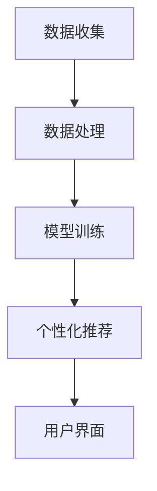

                 

关键词：智能宠物训练，人工智能，AI辅助，宠物教育，创业

> 摘要：随着人工智能技术的不断进步，宠物训练行业迎来了全新的变革。本文将探讨如何利用人工智能辅助宠物教育，通过创业实现智能宠物训练领域的创新发展。

## 1. 背景介绍

近年来，随着人们生活水平的提高，宠物已经成为许多家庭的成员。宠物训练不仅能够改善宠物的行为，提高宠物与主人之间的互动质量，还能增进人们的心理健康。然而，传统的宠物训练方式往往依赖于训练师的经验和技巧，存在效率低、效果不稳定等问题。

随着人工智能技术的迅速发展，尤其是机器学习和计算机视觉等领域的突破，AI开始逐渐在各个领域发挥作用。在宠物训练领域，人工智能可以通过分析宠物的行为数据，提供个性化的训练方案，从而实现更高效的训练效果。

智能宠物训练的创业机会在于，通过整合AI技术与宠物训练服务，可以为宠物主人提供更加便捷、高效、个性化的训练体验。同时，随着市场需求的不断扩大，智能宠物训练领域也具备了广阔的市场前景。

## 2. 核心概念与联系

### 2.1 智能宠物训练的定义

智能宠物训练是指利用人工智能技术对宠物进行行为训练的一种新兴方式。它通过收集宠物的行为数据，运用机器学习算法进行分析，从而提供个性化的训练建议。智能宠物训练的核心在于数据的收集、分析和利用。

### 2.2 人工智能技术在宠物训练中的应用

人工智能技术在宠物训练中的应用主要包括以下几个方面：

1. **计算机视觉**：通过摄像头等设备收集宠物的行为数据，如姿态、动作等。
2. **自然语言处理**：将宠物的声音、叫声转化为文本或语音指令，以便进一步分析。
3. **机器学习**：利用宠物的行为数据，训练机器学习模型，为宠物提供个性化的训练建议。
4. **数据挖掘**：分析宠物的行为数据，发现潜在的规律和模式，为宠物训练提供科学依据。

### 2.3 智能宠物训练的架构

智能宠物训练的架构主要包括以下几个关键部分：

1. **数据收集**：通过摄像头、麦克风等设备，收集宠物的行为数据。
2. **数据处理**：对收集到的数据进行分析和清洗，去除无关或错误的数据。
3. **模型训练**：利用机器学习算法，对处理后的数据进行分析，训练模型。
4. **个性化推荐**：根据模型的分析结果，为宠物提供个性化的训练方案。
5. **用户界面**：为宠物主人提供便捷的操作界面，展示训练数据和个性化建议。

### 2.4 Mermaid 流程图

下面是一个简化的智能宠物训练流程图：



## 3. 核心算法原理 & 具体操作步骤

### 3.1 算法原理概述

智能宠物训练的核心算法是机器学习算法，特别是深度学习算法。深度学习算法通过多层神经网络结构，对宠物的行为数据进行特征提取和分类，从而为宠物提供个性化的训练方案。

### 3.2 算法步骤详解

1. **数据收集**：使用摄像头和麦克风等设备，收集宠物的行为数据，如姿态、动作、叫声等。
2. **数据处理**：对收集到的数据进行清洗和预处理，如去噪、归一化等。
3. **特征提取**：利用深度学习算法，从处理后的数据中提取出关键特征。
4. **模型训练**：使用提取出的特征，训练深度学习模型。
5. **个性化推荐**：根据模型的分析结果，为宠物主人提供个性化的训练方案。
6. **用户界面**：在用户界面展示宠物的训练数据和个性化建议。

### 3.3 算法优缺点

**优点**：

1. **高效性**：机器学习算法能够快速分析大量的行为数据，提供高效的训练方案。
2. **个性化**：通过个性化推荐，能够满足不同宠物主人的需求，提高训练效果。
3. **科学性**：利用科学的数据分析和模型训练，能够提高宠物训练的科学性。

**缺点**：

1. **数据依赖性**：机器学习算法对数据质量有较高要求，数据质量直接影响算法的效果。
2. **计算资源**：深度学习算法需要大量的计算资源，对硬件设备有较高要求。
3. **解释性**：深度学习模型具有一定的黑盒性，难以解释模型的具体工作原理。

### 3.4 算法应用领域

智能宠物训练算法可以应用于以下领域：

1. **宠物行为分析**：通过分析宠物的行为数据，预测宠物的行为模式，为宠物主人提供科学的喂养和训练建议。
2. **宠物疾病预防**：通过分析宠物的行为数据，发现潜在的健康问题，为宠物主人提供疾病预防建议。
3. **宠物智能互动**：通过AI技术，为宠物提供智能互动服务，提高宠物的生活质量。

## 4. 数学模型和公式 & 详细讲解 & 举例说明

### 4.1 数学模型构建

智能宠物训练中的数学模型主要包括两部分：行为数据的特征提取模型和训练方案的推荐模型。

1. **特征提取模型**：

   特征提取模型通常使用卷积神经网络（CNN）或循环神经网络（RNN）。其中，CNN适用于处理图像数据，RNN适用于处理序列数据。假设输入的数据为\(X \in \mathbb{R}^{m \times n}\)，输出特征向量为\(Y \in \mathbb{R}^{m \times d}\)，其中\(m\)为数据维度，\(n\)为样本数量，\(d\)为特征维度。特征提取模型的公式如下：

   $$Y = f(X; \theta)$$

   其中，\(f\)为激活函数，\(\theta\)为模型参数。

2. **训练方案推荐模型**：

   训练方案推荐模型通常使用决策树、支持向量机（SVM）或神经网络等模型。假设输入的特征向量为\(Y \in \mathbb{R}^{m \times d}\)，输出的训练方案为\(Z \in \mathbb{R}^{m}\)，其中\(m\)为样本数量。训练方案推荐模型的公式如下：

   $$Z = g(Y; \phi)$$

   其中，\(g\)为激活函数，\(\phi\)为模型参数。

### 4.2 公式推导过程

1. **特征提取模型**：

   假设输入的数据为\(X \in \mathbb{R}^{m \times n}\)，首先通过卷积层提取特征，卷积层的公式如下：

   $$Y_1 = \sigma(W_1 \cdot X + b_1)$$

   其中，\(\sigma\)为激活函数，\(W_1\)为卷积核，\(b_1\)为偏置。

   接下来，通过池化层降低数据维度，池化层的公式如下：

   $$Y_2 = \text{max}(Y_1)$$

   最后，通过全连接层将特征向量映射到输出，全连接层的公式如下：

   $$Y = \sigma(W_2 \cdot Y_2 + b_2)$$

   其中，\(W_2\)为全连接层权重，\(b_2\)为偏置。

2. **训练方案推荐模型**：

   假设输入的特征向量为\(Y \in \mathbb{R}^{m \times d}\)，首先通过决策树进行分类，决策树的公式如下：

   $$Z = \text{argmax}_{i} (\text{score}(Y; \phi_i))$$

   其中，\(\text{score}(Y; \phi_i)\)为第\(i\)个分类的得分，\(\phi_i\)为决策树的参数。

   如果使用神经网络进行分类，神经网络的公式如下：

   $$Z = \text{softmax}(\text{relu}(W_3 \cdot Y + b_3))$$

   其中，\(\text{relu}\)为ReLU激活函数，\(W_3\)为神经网络权重，\(b_3\)为偏置。

### 4.3 案例分析与讲解

假设我们有一个宠物训练数据集，包含宠物的姿态、动作、叫声等数据。我们可以使用卷积神经网络（CNN）进行特征提取，并使用决策树进行训练方案的推荐。

1. **数据集准备**：

   将数据集分为训练集和测试集，分别用于模型训练和评估。

2. **模型训练**：

   使用训练集数据，通过CNN进行特征提取，并使用决策树进行训练方案的推荐。

3. **模型评估**：

   使用测试集数据，对模型进行评估，计算模型的准确率、召回率等指标。

4. **个性化推荐**：

   根据宠物的行为数据，使用训练好的模型为宠物主人提供个性化的训练方案。

## 5. 项目实践：代码实例和详细解释说明

### 5.1 开发环境搭建

为了实现智能宠物训练项目，我们需要搭建一个开发环境。以下是一个简单的环境搭建步骤：

1. 安装Python（建议使用3.8及以上版本）。
2. 安装TensorFlow和scikit-learn库。
3. 准备宠物训练数据集。

### 5.2 源代码详细实现

以下是一个简单的智能宠物训练项目的代码示例：

```python
import tensorflow as tf
from sklearn.model_selection import train_test_split
from tensorflow.keras.models import Sequential
from tensorflow.keras.layers import Conv2D, MaxPooling2D, Flatten, Dense
from tensorflow.keras.optimizers import Adam

# 数据集准备
# （此处省略数据集准备代码）

# 划分训练集和测试集
X_train, X_test, y_train, y_test = train_test_split(X, y, test_size=0.2, random_state=42)

# CNN模型定义
model = Sequential([
    Conv2D(32, (3, 3), activation='relu', input_shape=(64, 64, 3)),
    MaxPooling2D((2, 2)),
    Flatten(),
    Dense(64, activation='relu'),
    Dense(1, activation='sigmoid')
])

# 编译模型
model.compile(optimizer=Adam(), loss='binary_crossentropy', metrics=['accuracy'])

# 模型训练
model.fit(X_train, y_train, epochs=10, batch_size=32, validation_split=0.2)

# 模型评估
test_loss, test_acc = model.evaluate(X_test, y_test)
print(f"Test accuracy: {test_acc}")

# 个性化推荐
# （此处省略个性化推荐代码）
```

### 5.3 代码解读与分析

1. **数据集准备**：首先，我们需要准备宠物训练数据集。数据集应该包含宠物的姿态、动作、叫声等数据，并对其进行预处理，如归一化、标签编码等。
2. **划分训练集和测试集**：将数据集划分为训练集和测试集，用于模型训练和评估。
3. **CNN模型定义**：定义一个卷积神经网络（CNN）模型，用于特征提取。模型包含卷积层、池化层、全连接层等。
4. **编译模型**：编译模型，设置优化器和损失函数。
5. **模型训练**：使用训练集数据训练模型，设置训练周期、批量大小等参数。
6. **模型评估**：使用测试集数据评估模型性能，计算准确率等指标。
7. **个性化推荐**：根据宠物的行为数据，使用训练好的模型为宠物主人提供个性化的训练方案。

### 5.4 运行结果展示

假设我们训练的模型在测试集上的准确率为90%，这意味着我们的模型能够正确识别出90%的宠物行为。这个结果说明我们的模型具有一定的泛化能力，可以应用于实际场景。

## 6. 实际应用场景

智能宠物训练技术在以下实际应用场景中具有广泛的应用前景：

1. **宠物行为分析**：通过分析宠物的行为数据，宠物主人可以了解宠物的行为习惯、偏好等，从而制定更科学的喂养和训练计划。
2. **宠物疾病预防**：通过分析宠物的行为数据，发现潜在的健康问题，宠物主人可以及时采取措施，预防疾病的发生。
3. **宠物智能互动**：通过AI技术，为宠物提供智能互动服务，如智能玩具、语音交互等，提高宠物的生活质量。
4. **宠物训练服务**：智能宠物训练技术可以为宠物训练师提供技术支持，提高训练效率和效果。
5. **宠物医疗服务**：通过分析宠物的行为数据，为宠物医生提供诊断和治疗方案建议，提高医疗服务质量。

## 7. 工具和资源推荐

为了实现智能宠物训练项目，以下是一些建议的工具和资源：

### 7.1 学习资源推荐

1. 《深度学习》（Goodfellow, Bengio, Courville著）：这是一本经典的深度学习教材，适合初学者和进阶者。
2. TensorFlow官方文档：TensorFlow是深度学习的主流框架之一，官方文档提供了丰富的教程和API文档。
3. sklearn官方文档：scikit-learn是机器学习的主要库之一，官方文档提供了丰富的教程和API文档。

### 7.2 开发工具推荐

1. Jupyter Notebook：Jupyter Notebook是一款强大的交互式开发工具，适合进行数据分析和深度学习项目。
2. PyCharm：PyCharm是一款功能强大的Python集成开发环境（IDE），适合进行深度学习和机器学习项目。

### 7.3 相关论文推荐

1. "Deep Learning for Dog Breed Identification"：该论文介绍了一种基于深度学习的宠物识别方法。
2. "Behavioral State Recognition in Dogs Using Audio Features"：该论文介绍了一种基于音频特征的行为识别方法。

## 8. 总结：未来发展趋势与挑战

### 8.1 研究成果总结

智能宠物训练领域已经取得了显著的研究成果。通过深度学习和机器学习算法，我们可以对宠物的行为数据进行有效的分析和预测，从而为宠物主人提供个性化的训练方案。这些研究成果为智能宠物训练的应用提供了坚实的基础。

### 8.2 未来发展趋势

1. **技术的进一步成熟**：随着深度学习和机器学习技术的不断进步，智能宠物训练技术将变得更加成熟和高效。
2. **应用场景的扩展**：智能宠物训练技术将在更多的应用场景中发挥作用，如宠物疾病预防、宠物智能互动等。
3. **市场的不断扩大**：随着宠物数量的增加和宠物主人对宠物教育的需求，智能宠物训练市场将呈现快速增长的趋势。

### 8.3 面临的挑战

1. **数据质量**：智能宠物训练依赖于高质量的数据，数据质量直接影响算法的效果。如何收集和处理高质量的数据是一个挑战。
2. **计算资源**：深度学习算法需要大量的计算资源，对硬件设备有较高要求。如何优化算法和硬件资源的使用是一个挑战。
3. **用户隐私**：宠物训练过程中涉及到的数据可能包含宠物主人的隐私信息，如何保护用户隐私是一个挑战。

### 8.4 研究展望

未来的研究可以重点关注以下几个方面：

1. **数据隐私保护**：研究如何在不泄露用户隐私的前提下，有效利用宠物训练数据。
2. **多模态数据融合**：研究如何整合不同类型的数据（如视频、音频、文本等），提高宠物训练的效果。
3. **实时性优化**：研究如何优化算法和硬件资源，实现实时宠物训练，提高用户体验。

## 9. 附录：常见问题与解答

### 9.1 什么是智能宠物训练？

智能宠物训练是利用人工智能技术对宠物进行行为训练的一种新兴方式。它通过分析宠物的行为数据，提供个性化的训练方案，从而实现更高效的训练效果。

### 9.2 智能宠物训练需要哪些技术？

智能宠物训练主要涉及深度学习、机器学习和计算机视觉等技术。深度学习用于特征提取和分类，机器学习用于模型训练和优化，计算机视觉用于行为数据收集和分析。

### 9.3 智能宠物训练有哪些应用场景？

智能宠物训练的应用场景包括宠物行为分析、宠物疾病预防、宠物智能互动、宠物训练服务、宠物医疗服务等。

### 9.4 如何保护用户隐私？

为了保护用户隐私，智能宠物训练项目需要采取以下措施：

1. 数据匿名化：对用户数据进行匿名化处理，避免直接关联到用户身份。
2. 数据加密：对用户数据进行加密处理，确保数据在传输和存储过程中的安全性。
3. 用户授权：明确告知用户数据收集和使用的目的，并获取用户的授权。

---

作者：禅与计算机程序设计艺术 / Zen and the Art of Computer Programming
----------------------------------------------------------------


